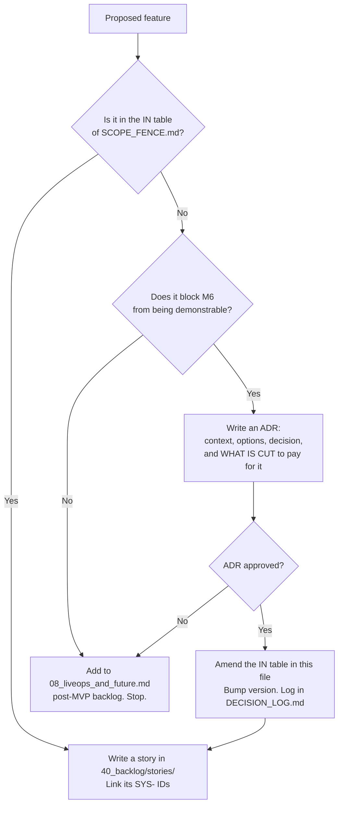

# MVP Scope Fence

This document defines the boundary of the minimum viable product. It exists because the
single most common way a small team fails to ship a multiplayer game is not technical
difficulty — it is scope accretion that never resolves into a playable loop.

**The fence rule:** anything not in the IN list below requires an
[ADR](DECISION_LOG.md) to add. Not a conversation, not a "quick" pull request — an ADR
naming what is being cut to pay for it.

**The fence is not a wish-list boundary.** It is a *demonstrability* boundary. The MVP is
finished when six humans can play an 8-minute match, understand why they scored what they
scored, and want to play again.

---

## 1. IN scope — the MVP

| # | Item | Definition of "in" | Milestone |
|---|---|---|---|
| 1 | **One map** | `MAP-VETRAIO`, ~120 × 120 m playable, three vertical strata, 5 hiding spots, 4 blend circuits, 6 spawn points, 2 theatre spaces. Greybox art acceptable at ship. | M0 (blockout) → M6 (dressed) |
| 2 | **One mode** | Free-for-all "Contract". No teams, no objectives beyond the contract cycle. | M4 |
| 3 | **Four personas** | `PERSONA-VETRAIO`, `PERSONA-CANTATRICE`, `PERSONA-LUCERNA`, `PERSONA-PESATORE`. Silhouette-distinct at 40 m. | M3 |
| 4 | **Four abilities + one passive slot** | `ABIL-CINDERFALL`, `ABIL-WHISPERBOLT`, `ABIL-SECONDFACE`, `ABIL-LUNGE`; passives `PASV-STILLNESS`, `PASV-COLDREAD`, `PASV-SECONDWIND`. Two abilities + one passive equipped, locked at match start. | M5 |
| 5 | **The full loop** | Compass, suspicion, blending, detection, kill, stun, respawn, contract reassignment, scoring with every bonus in the table. | M4 (core) → M5 (bonuses) |
| 6 | **Crowd AI** | 60–90 NPCs, 8–12 clones per persona, filler archetypes, Stroll / Idle / WalkingGroup / Startle / Gawk behaviours, ≤ 2.0 ms/frame. | M3 |
| 7 | **8-minute match** | Lobby → 5 s countdown → 8:00 play → 30 s Final Contract → results. Score decides the winner. | M6 |
| 8 | **Lobby** | Direct-IP join, ready-up, persona and loadout selection, player list. | M6 |
| 9 | **Scoreboard & results** | Live score feed during play; a results screen with a per-player bonus breakdown. | M5 |
| 10 | **Placeholder art & audio** | Primitives/procedural or CC0-with-attribution only. Every third-party asset recorded in [`ASSET_LICENSES.md`](ASSET_LICENSES.md). | throughout |
| 11 | **Dedicated headless server** | `--server` CLI flag, server-authoritative, 3+ clients stable across joins and leaves. | M2 |
| 12 | **Windows + Linux desktop** | 1080p / 60 fps minimum on the reference machine. | M6 |
| 13 | **CI** | GitHub Actions: headless import, `gdlint`, GUT unit tests, export templates. Green on `main` at all times. | M0 |

### 1.1 What "IN" does not mean

Being in scope does not license polish. Every item above ships at the fidelity required to
answer one question: *is the loop fun with six humans?* Art, audio and UI are held at
"legible placeholder" until M6 explicitly.

---

## 2. OUT of scope — deferred, with reasons

Each of these is deferred for a specific reason, recorded so that nobody has to relitigate
it from memory. "Because it is not MVP" is not a reason and does not appear below.

| # | Deferred item | Why it is out |
|---|---|---|
| 1 | **Team modes** (2v2v2, cops-and-robbers variants) | Team modes change the contract graph from a Hamiltonian cycle to a bipartite assignment problem, and change the information economy fundamentally — a teammate is a free information channel. That is a second game's worth of balance work. Revisit after the free-for-all balance model is validated against real playtest telemetry. |
| 2 | **Progression / unlocks** | Requires persistence, which requires accounts, which requires a backend and its security surface. Also actively harmful pre-balance: unlocks create power asymmetry that masks whether the base loop is fun. `IProfileStore` is stubbed so the seam exists. |
| 3 | **Cosmetics** | Cosmetics are an *anonymity leak* by construction. Any visual customisation makes a player distinguishable from their clones, which is the one thing the game cannot allow. Needs a design solution (crowd-wide cosmetic propagation) before it is an art task. |
| 4 | **Matchmaking** | Requires a service, a queue, a rating system and a population. With zero players, matchmaking is worse than direct IP: it fails silently instead of connecting friends. Direct IP + private lobbies is the correct first move for this genre. See [`../10_gdd/08_liveops_and_future.md`](../10_gdd/08_liveops_and_future.md) §4. |
| 5 | **Voice chat** | Voice destroys the information economy: players narrate positions out loud, and the Compass stops being the primary channel. If it ships, it ships as proximity-only with an explicit design pass. |
| 6 | **Console ports** | Certification, input, and performance work with no revenue hypothesis attached. Desktop-first is the only sane order. |
| 7 | **Cutscenes** | No narrative in MVP. A cutscene is an art and animation cost with zero effect on whether the loop works. |
| 8 | **Story / narrative campaign** | The game's fiction is entirely environmental. Story is a post-product-market-fit investment. |
| 9 | **Anti-cheat beyond server authority** | Server authority over kills, stuns, suspicion and score already removes the exploits that matter (teleport-kill, score injection, suspicion spoofing). Anything further (attestation, heuristics, bans) requires accounts and a population to be worth its cost. Documented in [`../20_tdd/04_networking.md`](../20_tdd/04_networking.md) §9. |
| 10 | **Mobile** | Input model is incompatible with the traversal and blend verbs. Not a port, a redesign. |
| 11 | **Kill-cam / death replay** | Genuinely tempting, genuinely out. A kill-cam reveals the killer's identity and position, which permanently changes the paranoia economy — you would always know who killed you. Deferred to a design investigation, not an engineering task. See [`../10_gdd/06_ui_audio.md`](../10_gdd/06_ui_audio.md) §2.3. |
| 12 | **Minimap** | Deliberately absent, permanently. A minimap replaces the Compass with certainty and deletes the core tension. This is a design law, not a scope cut. |
| 13 | **Additional maps** | One map, iterated ten times, teaches more about social-stealth level design than three maps built once. Map two begins after M6 playtests. |
| 14 | **Bots to fill lobbies** | Acknowledged as the most likely post-MVP necessity (see the population problem). Out of MVP because a bot that can play social stealth convincingly is a research problem, and a bad bot teaches players the wrong game. |
| 15 | **Spectator mode** | Useful for playtest observation; not required, since playtests are run in-person or over screen share at this stage. |
| 16 | **Replays / telemetry dashboards** | Telemetry *events are logged* (see [`../10_gdd/07_balance.md`](../10_gdd/07_balance.md) §8) — the dashboard to read them is a spreadsheet until it isn't. |
| 17 | **Localisation** | English strings, but all user-facing text goes through a string table from day one so that localisation is later a data task, not a refactor. |

---

## 3. The fence in diagram form

---

## 4. Scope tripwires

These are the specific, observable symptoms that the fence has been breached. If you
observe one, stop and write an ADR.

| Tripwire | What it means |
|---|---|
| A story exists with no `SYS-` ID it belongs to | You are building something the design does not describe. |
| A second map folder appears before M6 exits | Map-two work is displacing map-one iteration. |
| Any `.tres` under `data/cosmetics/` | See OUT #3. |
| A new ability appears without an entry in [`../10_gdd/04_abilities.md`](../10_gdd/04_abilities.md) | Legibility law violation and scope breach in one. |
| An HTTP client or database driver enters the dependency list | Persistence has arrived without an ADR. |
| The word "just" appears in a scope discussion | It is never just. |
| M4 has not been reached but M5/M6 work is in progress | The loop is not yet playable; nothing downstream is worth building. |

---

## 5. What the MVP is allowed to be bad at

Stated explicitly so nobody "fixes" these before M6:

- **Visual fidelity.** Greybox and primitives are correct until M6.
- **Audio richness.** One sound per event, no variation layers, no reverb zones.
- **Animation polish.** Blends may pop. Clone parity matters; smoothness does not, yet.
- **Menu presentation.** A functional list of players and a ready button is complete.
- **Onboarding.** MVP playtests are facilitated in person. The onboarding problem is
  analysed in [`../10_gdd/08_liveops_and_future.md`](../10_gdd/08_liveops_and_future.md) §3
  but not solved in MVP.
- **Population.** MVP requires arranging six humans by hand. That is expected and fine.

---

## 6. Acceptance criteria for this document

- [ ] Every item in the IN table maps to at least one milestone in [`../40_backlog/ROADMAP.md`](../40_backlog/ROADMAP.md).
- [ ] Every item in the OUT table has a reason that is specific to *this* game, not generic.
- [ ] Every OUT item that is a design law rather than a schedule cut (minimap, cosmetics,
      kill-cam) is also stated as a law in the relevant GDD chapter.
- [ ] No story exists in `40_backlog/stories/` that implements an OUT item.
