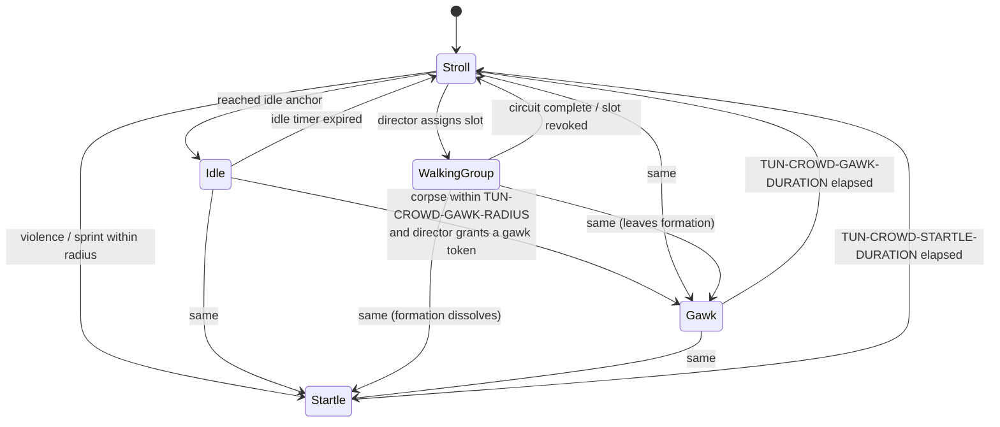

# ADR-0003 — Crowd AI: hierarchical state machines over behaviour trees

## Context

`SYS-CROWD` must run 60–90 NPCs inside `TUN-PERF-CROWD-BUDGET` = 2.0 ms/frame, in GDScript
(ADR-0001), on the server, every tick — and the same agents must also run on clients for
animation and blend-group membership.

The behaviour set is small and fully enumerated in the design:

| Behaviour | Complexity |
|---|---|
| Stroll (waypoint patrol) | trivial |
| Idle (bench, stall, conversation cluster) | trivial |
| WalkingGroup (formation, joinable by a player) | moderate — formation slots, join/leave |
| Startle (flee for `TUN-CROWD-STARTLE-DURATION`, propagate) | simple + propagation rule |
| Gawk (crowd a corpse for `TUN-CROWD-GAWK-DURATION`, capped) | simple + arbitration |

That is five behaviours with two interrupt sources (violence, corpse). Crucially, **the
crowd is not required to be intelligent.** It is required to be *legible*: a startle wave
must read as directional, a gawk cluster must be visible at range, and a walking group must
be joinable. The crowd is an information medium, not an opponent.

The engineering question is what execution model to use for something this small, this
numerous, and this performance-constrained.

## Options considered

| Option | Pros | Cons | Verdict |
|---|---|---|---|
| **Hierarchical finite state machine (HFSM), flat per-agent, with a shared director** | Minimal per-agent cost (one enum + one timer + one function call); trivially inspectable in a debugger; state transitions map 1:1 onto the design's language; easy to LOD by simply ticking less often. | Poor at composing many concurrent concerns; would become unmanageable at ~15+ behaviours. | **Chosen** |
| Behaviour tree | Composable; industry standard; designer-editable; good at layered priorities. | Per-tick tree traversal costs node visits per agent — at 90 agents this is thousands of virtual calls in GDScript per tick. Overkill for 5 behaviours. Introduces an editor/authoring surface we do not need. | Rejected |
| Utility AI | Elegant for "which of many options"; naturally handles competing drives. | Requires scoring every option every tick per agent — the most expensive option for the least benefit here. The crowd has no competing drives; it has interrupts. | Rejected |
| GOAP / planner | Emergent behaviour. | Absurd for this problem. | Rejected |
| Pure flow-field / boids, no per-agent state | Cheapest possible; excellent for dense crowds. | Cannot express WalkingGroup membership, Gawk arbitration or the joinable-slot mechanic — all of which are *gameplay*, not decoration. | Rejected as the whole model; **adopted for the steering layer** |

## Decision

**Each NPC runs a flat hierarchical state machine** with the states above, plus a shared
**crowd director** that owns everything the individual agent should not:

**Startle is a global interrupt**: it can be entered from any state and always wins. This is
deliberate — a startle wave must be *reliable*, because players read it as information.

**The crowd director** (one instance, server-side) owns:

- Walking-group formation slots and their circuits.
- Gawk token issuance, capped by `TUN-CROWD-GAWK-MAX`, so a corpse cannot depopulate a
  crowd pocket (which would perversely make the kill site *safer* to stand in).
- Startle propagation (`TUN-CROWD-STARTLE-PROPAGATION`), computed once per event as a
  decaying wave rather than per-agent-per-tick.
- Clone distribution rebalancing every `TUN-CROWD-DIRECTOR-INTERVAL`, maintaining
  `TUN-CROWD-CLONE-LOCAL-MIN` clones of each in-use persona near each player.

**Steering is a separate, dumb layer**: local avoidance and formation-slot seeking, run at
LOD-dependent rates. It does not know about states. This is where the boids-style approach
is adopted — as the *how to move*, under an HFSM's *where and why*.

**LOD is applied to tick rate, not to logic.** An NPC at `TUN-PERF-CROWD-LOD-FAR` runs the
same state machine at 2 Hz. It never runs a *different, simpler* state machine, because a
crowd whose behaviour changes with the observer's distance is a crowd that lies.

## Consequences

### Positive
- Per-agent per-tick cost is one integer compare, one timer decrement and one small
  function call. This is what makes 2.0 ms plausible in GDScript.
- The states are the same nouns the GDD uses. A designer reading
  [`../../10_gdd/03_social_stealth.md`](../../10_gdd/03_social_stealth.md) §6 and an
  engineer reading the code are looking at the same five words.
- LOD is a one-line change (tick interval), not an architectural fork.
- The director centralises everything with *global* correctness requirements (gawk caps,
  clone distribution), which are exactly the things that are wrong when written per-agent.
- Testable: the state machine is a pure function of (state, timer, events) and is unit-
  testable without a scene tree.

### Negative — stated honestly
- **This does not scale to a richer crowd.** At ~15 behaviours, or if NPCs ever need
  concurrent concerns (hungry *and* fleeing *and* in a conversation), a flat HFSM becomes a
  transition-table nightmare. If the post-MVP crowd grows, this ADR is superseded, not
  patched.
- The crowd director is a single point of coupling and a potential hotspot. It is capped at
  `TUN-CROWD-DIRECTOR-INTERVAL` = 2 s and must stay off the per-tick path.
- Global-interrupt Startle means a Startle *cannot* be suppressed by any state, including
  Gawk. An NPC gawking at a corpse who is then startled abandons the corpse — which
  destroys a standing information object. Accepted: it reads correctly (people scatter),
  and the corpse itself persists for `TUN-CORPSE-LIFETIME` regardless.
- No designer-facing authoring tool. Behaviour changes are code changes. At five behaviours
  this is cheaper than building the tool.

### Neutral / follow-on
- The transition table lives in one file and is asserted complete by a test: every
  (state, event) pair either has a transition or is explicitly listed as ignored. Silent
  no-op transitions are the classic FSM bug and this test is the standard defence.

## Compliance

- [ ] `NpcBrain` exposes exactly the five states named above; adding a sixth requires an ADR.
- [ ] No per-agent code allocates per tick (no `Array`/`Dictionary` construction in the
      step function). Asserted by a profiling test.
- [ ] `CrowdDirector` runs on a timer at `TUN-CROWD-DIRECTOR-INTERVAL`, never in
      `_physics_process`.
- [ ] `test_npc_transition_table.gd` asserts every (state, event) pair is handled or
      explicitly ignored.
- [ ] `test_crowd_perf.gd` spawns `TUN-CROWD-COUNT-MAX` agents headless and asserts the
      per-tick cost is within `TUN-PERF-CROWD-BUDGET`.
- [ ] LOD changes tick *rate* only; `grep` finds no distance check inside `NpcBrain.step()`.

## Revisit trigger

Reopen if the crowd behaviour set grows beyond eight states, if NPCs acquire genuinely
concurrent concerns, or if `test_crowd_perf.gd` fails after the LOD tiers are tuned — in
which case the first move is moving *steering* (not the FSM) to a C# or `GDExtension`
implementation, since steering is the numeric inner loop and the FSM is not.
