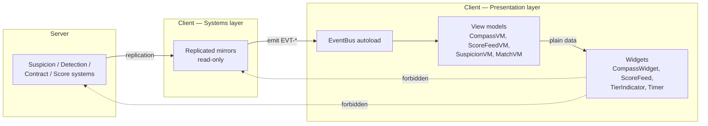

# ADR-0006 — One-way UI data flow via an event bus

## Context

The HUD is not decoration in this game. It *is* the game's primary information channel: the
Compass is how you hunt, the prey warning is how you survive, and the score feed is how you
learn. [`../../10_gdd/03_social_stealth.md`](../../10_gdd/03_social_stealth.md) §11 treats
the set of information channels as the master system diagram.

That has an architectural consequence most projects do not face: **a UI bug here is a
gameplay bug.** A Compass that shows a stale bearing is not a cosmetic defect; it is the game
lying to the player about the only thing it tells them.

Three additional forces:

1. **Server authority (ADR-0002)** means most of what the HUD displays does not exist on the
   client as simulation state — it arrives as replicated facts. A widget that "reads the
   player's suspicion" is reading a mirror, and it must be obvious that it is a mirror.
2. **The classic Godot failure mode** is `get_node("../../Player/Suspicion").value` in a
   widget's `_process`. It works, it is fast to write, and it couples the UI to the scene
   tree so tightly that moving a node breaks the HUD.
3. **The score feed's correctness requirement** (ADR-0004) is that it *is* the event stream.
   A feed that polls a score total cannot show which bonuses were earned.

## Options considered

| Option | Pros | Cons | Verdict |
|---|---|---|---|
| **Strict one-way: systems → event bus → view models → widgets** | Widgets are pure renderers with no knowledge of gameplay; testable by feeding a view model; no scene-tree coupling; matches the event-sourced score naturally. | One more layer; requires discipline; a view model must exist for every HUD concern. | **Chosen** |
| Widgets read gameplay nodes directly | Least code. | Couples UI to scene structure; makes every widget a potential source of a gameplay-visible bug; untestable without a full game. | Rejected |
| Direct signals from each system to each widget | No global bus; explicit wiring. | O(systems × widgets) connections; every new widget edits system code; the wiring itself becomes the bug surface. | Rejected |
| Full reactive/binding framework | Elegant; automatic. | No good Godot-native option; building one is scope we do not have. | Rejected |
| Polling a shared state singleton each frame | Simple; one source. | Loses event semantics — the score feed and the prey-warning sting are *events*, not states, and polling cannot recover when something happened. | Rejected as the whole model; state view models still exist (see below) |

## Decision

**Data flows in exactly one direction: gameplay systems → the event bus → view models →
widgets. No widget may read a gameplay node, and no gameplay system may read a widget.**

Rules:

1. **Two kinds of thing cross the bus.** *Facts* (`EVT-SUSPICION-TIER-CHANGED`,
   `EVT-CONTRACT-ASSIGNED`) and *moments* (`EVT-SCORE-EVENT-APPENDED`,
   `EVT-PREY-WARNING-TRIGGERED`). Both are past-tense: the bus reports what has happened,
   never what should happen.
2. **Signal names are past-tense facts**, per
   [`../../30_bible/CODING_STANDARDS.md`](../../30_bible/CODING_STANDARDS.md):
   `contract_assigned`, not `assign_contract` or `on_contract`.
3. **View models own presentation state.** A view model may hold interpolated values,
   animation phase, and derived formatting. `CompassVM` owns the pulse phase accumulator; the
   widget just draws the arc at the phase it is given.
4. **Widgets are pure.** A widget's entire input is its view model. A widget with a
   `get_node` call outside its own subtree is a defect.
5. **The bus is not for gameplay.** Systems do not talk to each other through it. System-to-
   system communication uses direct references and typed calls, because gameplay ordering
   matters and a bus makes ordering invisible. The rule for *which* to use is in
   [`../../30_bible/SIGNAL_AND_EVENT_BUS.md`](../../30_bible/SIGNAL_AND_EVENT_BUS.md) §2.
6. **Input flows the other way and does not use the bus.** Player input goes
   widget → input handler → network, as a direct call chain. Mixing input into the bus would
   make the bus bidirectional, which is the failure this ADR exists to prevent.

## Consequences

### Positive
- Every widget can be tested by constructing a view model and asserting what it renders. The
  Compass's pulse curve — the single most important piece of presentation in the game — is
  unit-testable without a running match.
- Moving, renaming or restructuring gameplay nodes cannot break the HUD.
- The score feed is a direct subscription to `EVT-SCORE-EVENT-APPENDED`, which is exactly the
  event-sourced log from ADR-0004. The two decisions reinforce each other.
- Accessibility variants (colourblind palettes, caption tracks for audio tells) are widget-
  level changes with no gameplay reach.
- The "what does the player actually know?" question has a mechanical answer: everything on
  the bus, and nothing else. This makes the information-economy table auditable against code.

### Negative — stated honestly
- **The bus makes ordering invisible.** If two view models must update in a particular order,
  the bus will not enforce it. This is precisely why rule 5 forbids system-to-system bus use;
  within presentation, order-dependence between view models is a design smell to be fixed,
  not worked around.
- More files. A new HUD element is a view model plus a widget, not a widget.
- A signal-based bus in Godot has no compile-time checking of payload shape. Mitigated by
  documenting every signal's payload schema in `SIGNAL_AND_EVENT_BUS.md` and by a test that
  asserts each signal is emitted with the documented arity.
- Debugging "why did nothing happen?" is harder with a bus than with a direct call. Mitigated
  by a debug-console command that logs all bus traffic.

### Neutral / follow-on
- The bus is a single autoload with no logic beyond signal declarations. It must never
  acquire state; a stateful event bus is a global variable wearing a disguise.

## Compliance

- [ ] `grep -rn "get_node\|\$\.\./" scripts/ui/` finds no traversal outside a widget's own
      subtree.
- [ ] No file under `scripts/ui/` imports or references a class from `scripts/systems/`.
- [ ] `EventBus.gd` contains only `signal` declarations and documentation comments — no
      `var`, no `func`.
- [ ] Every signal in `EventBus.gd` has a payload schema row in `SIGNAL_AND_EVENT_BUS.md`.
- [ ] Every widget has a corresponding `*VM` and takes it via `@export` or constructor,
      never by lookup.
- [ ] `test_compass_vm.gd` asserts the pulse period against the TUNABLES.md §4.2 sampled
      table at every listed distance.

## Revisit trigger

Reopen if a HUD element genuinely requires per-frame data at a rate the bus cannot carry
(the Compass at 30 Hz is comfortably within it), or if view-model ordering dependencies
appear that cannot be resolved by merging the view models involved.
