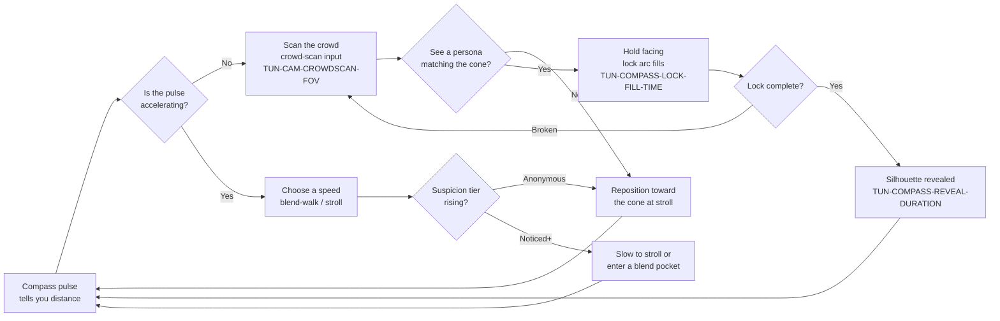
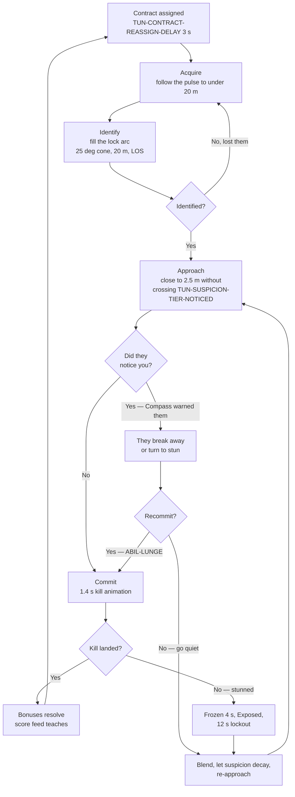
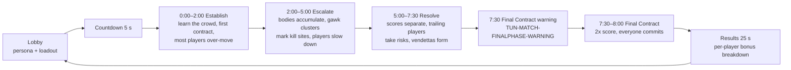
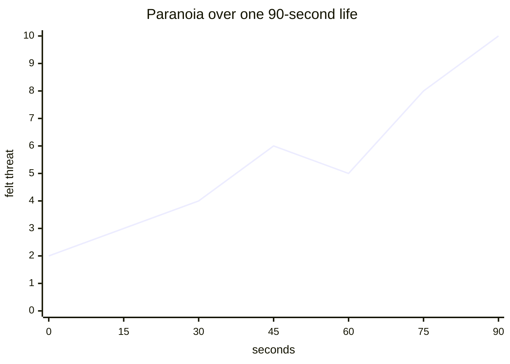

# GDD Part 1 — Foundations

> **Context restated for a reader who has read nothing else.** Project Sottovoce is an
> online multiplayer social-stealth game for 4–6 players set in a dense Renaissance-Italian
> city district (`MAP-VETRAIO`, the Glassmakers' Quarter of the fictional city of Vessalia).
> Every player simultaneously holds a **contract** on one other player and is the contract of
> an unknown other player. The district holds 60–90 AI civilians, and each of the four
> playable **personas** has 8–12 identical AI **clones** walking the streets. Matches are
> 8 minutes, free-for-all, decided by score rather than kills.

---

## 1. Vision statement

> A Renaissance city where six people are hunting each other and nobody can tell who is a
> person. You are always both hunter and hunted. Running finds your target and loses your
> cover; standing still keeps you invisible and lets your killer close. The game is decided
> by who can bear to move slowly for longer.

*(58 words.)*

---

## 2. Design philosophy — the six design laws

Every mechanic in this game is evaluated against these six laws. A feature that violates one
does not ship, however good it is in isolation. Each law is stated with a **feature we
rejected because of it** — the rejections are the load-bearing part, because a law that has
never cost anything is not a law.

### Law 1 — Speed is spent anonymity

*Any increase in velocity must cost something the player values, immediately and legibly.*

The suspicion ladder (`TUN-SUSPICION-GAIN-RUN` 14/s → `TUN-SUSPICION-GAIN-SPRINT` 25/s) exists
so that the movement input is also an economic decision. There is no free fast.

> **Rejected: a stamina bar.** Stamina was proposed to limit sprinting. It was rejected
> because it puts the cost of speed in the *future* ("you'll be tired later") rather than in
> the *present* ("you are visible now"). A stamina bar makes sprinting a resource-management
> puzzle; suspicion makes it a social risk. Worse, stamina regenerates the same way whether
> you were seen or not — it does not care about the crowd, and this game is about the crowd.

> **Rejected: a sprint that is silent on grass.** Surface-dependent noise was proposed for
> texture. It was rejected because it creates *sprint routes* — paths where speed is free —
> and the moment a free-speed route exists, the optimal play is to learn it and the game
> becomes a racing line.

### Law 2 — The crowd is a mechanic, not a backdrop

*Every NPC behaviour must produce information a player can act on.*

Stroll gives you cover to stand in. WalkingGroup gives you mobile cover
(`TUN-BLEND-GROUP-JOIN-RADIUS`). Startle broadcasts that someone moved badly
(`TUN-CROWD-STARTLE-RADIUS-VIOLENCE` 12 m). Gawk marks a corpse from 10 m away
(`TUN-CROWD-GAWK-RADIUS`). Idle clusters are the blend pockets the level design is built
around. Nothing in the crowd is decorative.

> **Rejected: ambient NPC dialogue barks.** Proposed for atmosphere. Rejected because they
> generate audio that carries no information, competing for attention with the audio that
> does — the Compass pulse (`TUN-AUDIO-COMPASS-DUCK`) and the prey-warning sting
> (`TUN-AUDIO-STING-DUCK`). In a game where sound is a primary information channel, atmospheric
> sound is not neutral; it is noise on the wire.

> **Rejected: NPCs that react to the player's persona.** "The guards nod at the Pesatore"
> was proposed as flavour. Rejected outright: it would make the player *distinguishable from
> their own clones*, which is the one thing the game may never do.

### Law 3 — Every ability has a tell

*No ability may resolve without the victim having had a perceivable chance to read it.*

`ABIL-WHISPERBOLT` has a 1.0 s wind-up during which the thrower is forced **Exposed**.
`ABIL-LUNGE` has a 0.25 s audible wind-up and is stunnable for its entire duration.
`ABIL-SECONDFACE` has a visible 0.8 s morph and a 0.6 s un-morph. `ABIL-CINDERFALL` scatters
NPCs across 9 m. There are no invisible instant-wins.

> **Rejected: a short-range teleport ("Slip").** A 4 m blink through a wall to escape a
> chase. Mechanically clean, immediately fun, and rejected because the victim's experience is
> "they were there and then they were not". A chase that ends in an unreadable disappearance
> teaches nothing and generates no story. `ABIL-CINDERFALL` fills the same role — an escape —
> while leaving a 5 m cloud and a fleeing crowd behind it, which is a *legible* escape.

> **Rejected: passive detection immunity.** A passive that suppressed the silhouette tint at
> the **Noticed** tier. Rejected because it deletes an information channel rather than
> competing within one; a player would have no way to know they were fighting it.

### Law 4 — Patience must be the strongest strategy, not merely the safest

*It is not enough that hiding keeps you alive. Hiding must win matches.*

This is the law most games in this space fail. `TUN-SCORE-BLENDED` (+200) is the largest
bonus in the game. A full patient blend kill is worth 650 points against a sprinting tackle's
50. A player who never exceeds `TUN-SCORE-PATIENT-SPEED` must be able to top the scoreboard, and the
balance model (`50_tuning/BALANCE_MODEL.md`) targets a patient player winning ~60 % of even
matches.

> **Rejected: a kill streak multiplier.** Proposed to reward strong play. Rejected because
> streaks reward *rate*, and rate rewards aggression: a streak bonus makes four fast kills
> beat two perfect ones. `SCORE-VARIETY` was designed in its place — it rewards a *varied*
> streak rather than a fast one, so the way to compound your score is to change your approach,
> not to accelerate.

> **Rejected: a "hunter's instinct" ping on standing still.** An anti-camping measure that
> would reveal stationary players after 20 s. Rejected as a direct assault on the thesis. If
> standing still becomes punishable, the game is a shooter with a costume.

### Law 5 — The prey must have teeth

*Being hunted is the more frightening role; it must not be the weaker one.*

`SYS-STUN` gives prey a hard counter: `TUN-STUN-RANGE` (3.0 m) deliberately exceeds
`TUN-KILL-RANGE` (2.5 m), so a hunter who closes to kill range has already entered stun range.
A successful stun is worth `TUN-STUN-SCORE` = 100 — *exactly* a base kill — freezes the hunter
for 4 s, and exiles them for 12 s. Defence is a scoring strategy, not a survival tax.

**The teeth are in the approach, not in the last instant.** A hunter who has been careless is
stunnable for the whole of their approach, from further away than they can strike. What the
prey does *not* get is a save at the moment of commitment: once a kill animation has begun it
completes, and only a third party killing the killer ends it. Amended 2026-08-26, ADR-0013 —
the reference resolves a contested kill for the killer, and the corresponding
`is_interruptible` window is gone.

> **Rejected: a stun that only interrupts.** The first design had stun cancel a kill attempt
> with no lockout. Rejected in review: it made stun a 4-second delay rather than counterplay,
> and a hunter would simply wait and re-approach. `TUN-STUN-LOCKOUT` (12 s) is what converts
> interruption into refusal. **This rejection stands and is now doing more work than before:**
> with the last-instant save gone, the lockout is the whole of what a stun buys.

> **Overturned 2026-08-26 (ADR-0013): the prey warning is directional.** This law used to
> reject it, on the argument that direction would convert the best moment in the game — the
> panicked scan of a crowd, trying to find the one face that is looking back — into a lookup.
> The reference gives the prey a marker carrying **bearing and distance** once the pursuer has
> revealed themselves, so `TUN-COMPASS-WARN-GIVES-DIRECTION` is now `true`.
>
> The original argument is preserved rather than deleted, because it is not wrong — it is a
> real cost, knowingly paid. What survives of it is the **gate**: an Anonymous pursuer still
> produces no warning at all, so the panicked scan is still what a *competent* hunter leaves
> you with. Direction is what carelessness now costs.

### Law 6 — Uncertainty is authored, not accidental

*Where the game is imprecise, the imprecision is designed, bounded, and consistent.*

The Compass gives a ±12° cone (`TUN-COMPASS-CONE-HALFWIDTH`) with a deterministic wobble
seeded per contract — so it is a stable property of *this hunt*, not a per-frame lie. The
pulse curve is a specified formula with a published sampled table. Suspicion tiers have
`TUN-SUSPICION-HYSTERESIS` so a boundary never strobes. Players may not know things; they must
never be *misled inconsistently*.

> **Rejected: random Compass jitter.** Frame-to-frame noise on the bearing was the first
> attempt at imprecision. Rejected because it is unlearnable: a player cannot build a mental
> model of noise. Deterministic per-contract wobble is imprecise in exactly the same *amount*
> and is learnable — you come to recognise that the cone drifts, and you compensate.

> **Rejected: a rare false Compass reading.** Proposed to create paranoia. Rejected because a
> game that occasionally lies teaches players to distrust its only information channel, and a
> distrusted channel is a deleted channel.

---

## 3. Target audience

Three personas, with what they want, what they can already do, and what will make them leave.

### 3.1 "Renata" — the returning social-stealth player, 32

| | |
|---|---|
| **Motivation** | Has played social-stealth PvP before and misses it. Wants the specific feeling of standing in a crowd, certain she has been seen, and being wrong. |
| **Skill floor** | High. Understands blending immediately. Will find the crowd pockets in her first match. |
| **Skill ceiling expectation** | Wants depth in *reading people*, not in execution. Will be disappointed by a game that rewards mechanical precision over observation. |
| **Session length** | 45–90 minutes, 4–8 matches. |
| **What loses her** | Any sign that aggression is optimal. If she watches a sprinting player top the scoreboard once, she will conclude the balance is broken — and she will usually be right. |
| **Design consequence** | Law 4. The score feed must make it *visible* that patience pays, every match, in her peripheral vision. |

### 3.2 "Tobias" — the curious lapsed shooter player, 24

| | |
|---|---|
| **Motivation** | Bored of aim-dominant games. Attracted by the premise but has no vocabulary for it. Will sprint in his first match because sprinting is what he knows. |
| **Skill floor** | Low *for this game*. High mechanical skill that does not transfer. His first three deaths will be to players he never saw. |
| **Skill ceiling expectation** | Will invest if he can see *why* he lost. Will quit if death feels arbitrary. |
| **Session length** | 20–40 minutes. Two bad matches and he is gone. |
| **What loses him** | Opacity. Dying with no information about what gave him away. |
| **Design consequence** | The score feed is a teacher (`TUN-UI-SCOREFEED-STAGGER`: bonuses arrive as a readable sequence). The suspicion tier indicator must always answer "how visible am I right now?" before he asks. The onboarding problem for Tobias is analysed in [`08_liveops_and_future.md`](08_liveops_and_future.md) §3. |

### 3.3 "Mei" — the friend brought along, 29

| | |
|---|---|
| **Motivation** | Here because four friends are here. Plays 3–4 hours a month across all games. Wants to not be a burden. |
| **Skill floor** | Very low, and that is fine — blend-walking and standing still are the correct play and require no execution. |
| **Skill ceiling expectation** | None. She wants one good moment per match to talk about. |
| **Session length** | One session, 60 minutes, possibly never again. |
| **What loses her** | Being unable to contribute. A game where the weakest player is a free 100 points for everyone else is a game she will not return to. |
| **Design consequence** | `TUN-STUN-SCORE` = 100 exists partly for Mei: a player who does nothing but hide and stun their pursuer can score. `TUN-SCORE-DEATH-PENALTY` = 0 exists entirely for Mei: dying costs time, never points, so she can never be driven into a hole she cannot climb out of. |

**The audience shape this implies:** a game that is *trivially* playable badly and *deeply*
playable well, where the skill gradient is in observation rather than execution. That is an
unusual shape and it is the design's main bet.

---

## 4. Comparable analysis

What the social-stealth PvP lineage has proven, and where it has repeatedly failed. This
section is about *failure modes to design around*, not about features to copy.

### 4.1 What the genre has proven works

| Proven mechanic | Evidence | Our version |
|---|---|---|
| A crowd of identical NPCs is sufficient to make a human unreadable | Every game in this space; players routinely walk past their target | 8–12 clones per persona (`TUN-CROWD-CLONES-PER-PERSONA-MIN/MAX`), enforced locally by `TUN-CROWD-CLONE-LOCAL-MIN` |
| Imprecise proximity information creates better tension than precise information | Directional-only indicators outperform minimaps in every comparison | `SYS-COMPASS` with a ±12° cone and no minimap, permanently (`SCOPE_FENCE` OUT #12) |
| Scoring that pays for restraint changes behaviour within one match | Players visibly slow down after seeing a high-value bonus once | The score feed as teacher, `TUN-UI-SCOREFEED-DURATION` 4 s |
| A defensive counter (stun) prevents the game collapsing into a footrace | Without it, the dominant strategy is always to sprint at your target | `SYS-STUN`, deliberately over-ranged vs. kill |

### 4.2 Where past attempts have failed

| Failure | Why it happens | Our specific mitigation |
|---|---|---|
| **Population collapse.** The genre's defining death. These modes are attached to larger products and die when the wider population moves on; standalone attempts never reach critical mass. | Matchmaking requires a population to work, and a broken queue is worse than no queue. | Direct IP + private lobbies first, no matchmaking in MVP (`SCOPE_FENCE` OUT #4). 4-player viability (`TUN-LOBBY-MIN-PLAYERS`) so a small group is a *supported* configuration, not a degraded one. The honest analysis is in [`08_liveops_and_future.md`](08_liveops_and_future.md) §4. |
| **The skill gap is invisible and therefore infuriating.** New players lose to veterans without ever learning why. | Deaths are silent and the information that gave you away is never surfaced. | Every bonus is *named* in the feed at the instant it is earned, so a new player learns the vocabulary by being killed by it. The results screen breaks down every bonus per player (`TUN-MATCH-RESULTS-DURATION` 25 s). |
| **No kill-cam, so no learning.** Players never see what they did wrong. | Kill-cams are expensive and reveal the killer. | We **also** ship without a kill-cam, and we accept the cost — because a kill-cam reveals the killer's identity, which would permanently change the paranoia economy (`SCOPE_FENCE` OUT #11). Instead the teaching load is carried by the score feed and by **theatre spaces** ([`05_level_design.md`](05_level_design.md) §5), where you learn by *watching other people's chases*. |
| **Aggression quietly dominates.** The scoring says patience is better; the reality is that a fast player gets more attempts. | Bonus multipliers are not large enough to overcome attempt rate. | The balance model explicitly computes points-per-minute for both archetypes including attempt rate, cooldowns and failure probability, and targets patience winning ~60 % of even matches. This is the number the whole balance pass is aimed at. |
| **The crowd is too small or too static, so blending fails.** | Performance budget. | `TUN-PERF-CROWD-BUDGET` is 2.0 ms and `TUN-CROWD-COUNT-MIN` is a hard floor of 60. Crowd density is treated as a *design requirement*, not a performance variable — the first thing to cut when the budget is missed is fidelity, never count. |
| **Roofs become the optimal camp.** Elevation gives information and safety. | Nothing costs the player for being up there. | `TUN-SUSPICION-GAIN-ROOF` = 18/s applies for *presence*, not movement — standing on a roof reaches **Noticed** in 1.7 s. And `ABIL-WHISPERBOLT` exists specifically to punish campers (3–12 m range, street-to-balcony). |

---

## 5. USP — five falsifiable claims

Each of these is written so it can be shown to be false by a playtest. That is the point; a
selling point that cannot fail is a slogan.

1. **You will walk past your target without recognising them, and you will know afterwards
   that you did.** *Falsified if:* in playtest, players correctly identify their contract on
   first visual contact more than 40 % of the time. *Measured by:* `TEL-FIRST-CONTACT-OUTCOME`.
2. **The strongest defensive play in the game is standing still.** *Falsified if:* players who
   spend more than 30 % of their life stationary have a lower survival rate than players who
   spend under 10 %. *Measured by:* `TEL-STATIONARY-FRACTION` against `TEL-LIFE-DURATION`.
3. **A patient player beats an aggressive player of equal skill.** *Falsified if:* across
   ≥ 20 matches, the highest-`TEL-MEAN-SPEED` player wins more than 45 % of the time.
4. **Being hunted is more frightening than hunting is satisfying.** *Falsified if:* in the
   post-match questionnaire ([`../30_bible/TEST_PLAN.md`](../30_bible/TEST_PLAN.md) §6,
   questions 4 and 5), players rate "the moment I realised I was being followed" below "the
   moment I killed someone" on remembered intensity.
5. **You can be taught the game by losing at it.** *Falsified if:* a first-time player's mean
   speed does not measurably decrease between their first and third match. *Measured by:*
   `TEL-MEAN-SPEED` per match index for new players.

---

## 6. The core gameplay loop, at three timescales

### 6.1 The 10-second micro-loop — *scan, decide, adjust*

This is what the player's hands and eyes are doing continuously.

The loop's tension: **C (scan) and D (move) compete for the same seconds.** You cannot read
the crowd while crossing it at speed, because the camera FOV widens
(`TUN-CAM-FOV-SPRINT` 72° vs `TUN-CAM-CROWDSCAN-FOV` 48°) and because moving costs the
suspicion that keeps you unread. Every 10 seconds the player re-answers "look, or move?"

### 6.2 The 60-second hunt-loop — *acquire, approach, commit*

**The loop's tension is at E.** Everything before it is preparation; everything after it is
consequence. The player's whole skill expression is in arriving at E without having triggered
their target's warning — and the warning triggers on **tier**, not on distance
(`TUN-COMPASS-WARN-MIN-TIER` = `TUN-SUSPICION-TIER-NOTICED`). An Anonymous hunter can stand
next to their prey. That is the game.

### 6.3 The 8-minute match-loop — *establish, escalate, resolve*

---

## 7. Gameplay pillars

Four pillars. Each has a **breakage test** — the specific observation that would tell us the
pillar is broken. A pillar without a breakage test is a poster.

### Pillar 1 — Anonymity

*The player must be able to become genuinely unreadable, and must be able to feel it happen.*

| | |
|---|---|
| **Expressed by** | `SYS-SUSPICION` tiers, `SYS-BLEND`, the clone population, the animation-parity constraint. |
| **How we'd know we broke it** | Players report that they "always feel seen". Or: `TEL-FIRST-CONTACT-OUTCOME` shows contracts being correctly identified on first sight more than 40 % of the time — meaning the crowd is not doing its job. Or, mechanically: any animation exists that a player can perform and their clones cannot ([`../30_bible/ANIMATION_SPEC.md`](../30_bible/ANIMATION_SPEC.md) §6 clone-parity table). |
| **The subtle break** | Anonymity fails *locally* before it fails globally. If all 12 Lucerna clones drift to the north plaza, the Lucerna player in the south market is unique and does not know it. `TUN-CROWD-CLONE-LOCAL-MIN` exists for exactly this. |

### Pillar 2 — Patience

*Waiting must be the strongest play, and must feel like a decision rather than a delay.*

| | |
|---|---|
| **Expressed by** | The bonus hierarchy (`TUN-SCORE-BLENDED` > `TUN-SCORE-PATIENT` > `TUN-SCORE-SILENT`), the suspicion decay cliff at stroll speed, `PASV-STILLNESS`. |
| **How we'd know we broke it** | The highest-mean-speed player wins more than 45 % of matches. Or players describe blending as "hiding until it's safe" rather than as "setting up" — the former is a delay, the latter is a play. |
| **The subtle break** | Patience can be strong *and boring*. If a patient player's 60 seconds contain no decisions, we have built a waiting room. The micro-loop (§6.1) exists to keep those seconds full of scanning, reading and repositioning. |

### Pillar 3 — Legibility

*Every outcome must be reconstructable by the person it happened to.*

| | |
|---|---|
| **Expressed by** | Law 3 (tells), the score feed naming bonuses as they are earned, theatre spaces, corpse Gawk clusters, Startle waves, `TUN-SUSPICION-HYSTERESIS`. |
| **How we'd know we broke it** | Playtest question 7 ("Did you understand why you died?") scoring below 4/5 on average. Or any ability shipping whose tell cannot be described in one sentence. |
| **The subtle break** | Legibility degrades under load. A player receiving a prey warning, a Compass acceleration and three score-feed lines simultaneously is receiving nothing. `TUN-UI-SCOREFEED-MAX-LINES` (4) and the audio ducking rules (`TUN-AUDIO-STING-DUCK` −12 dB) exist to enforce a priority order on attention. |

### Pillar 4 — Commitment

*Decisive actions must be irreversible, and the player must feel them close.*

| | |
|---|---|
| **Expressed by** | `TUN-KILL-ANIM-DURATION` 1.4 s with `TUN-KILL-ANIM-CANCEL-WINDOW` = 0. `ABIL-LUNGE` being stunnable throughout. `ABIL-WHISPERBOLT`'s 1.0 s Exposed wind-up. `TUN-STUN-FREEZE` 4 s. |
| **How we'd know we broke it** | Players attempting kills speculatively — "I'll try it and see". If the cost of a failed attempt (`TUN-SUSPICION-GAIN-FAILED-KILL` 30) is not felt, the whole approach phase becomes optional. |
| **The subtle break** | Commitment must never read as *unresponsiveness*. A 1.4 s animation the player chose is commitment; a 1.4 s animation they did not understand they were choosing is a bug. This is why `TUN-FEEL-INPUT-TO-ANIM-MAX` is 80 ms and why the kill has an unmistakable initiation tell. |

---

## 8. Player psychology

### 8.1 The paranoia curve

The central emotional mechanism. Paranoia is not constant; it is *cultivated and released*
on a cycle, and the cycle's shape is a design output.

| Phase | Seconds | What produces it |
|---|---|---|
| **Baseline unease** | 0–20 | You know, structurally, that someone has you. Nothing has happened. The knowledge alone is the whole effect — this is the cheapest tension in the game and it is free from the contract cycle's shape. |
| **Ambient accumulation** | 20–45 | You start noticing things: a clone that seems to be walking your way, a Startle wave two streets over, a Gawk cluster forming. Most of these mean nothing. That is the point — a game where every signal is real is a game with no paranoia, only information. |
| **Confirmation or release** | 45–60 | Either your Compass flashes red (`TUN-COMPASS-WARN-RADIUS` 15 m) — confirmation — or the moment passes. Release is as important as confirmation; without it there is no curve, only a ramp. |
| **Acute** | 60–90 | Post-warning. You know you are hunted, you do not know from where, and `TUN-COMPASS-WARN-GIVES-DIRECTION` is `false`. You are scanning faces. This is the peak of the game. |

**The design consequence:** the warning must be *rare enough to matter*. If it fires every
15 seconds, it is weather. `TUN-COMPASS-WARN-MIN-TIER` gating it on the pursuer being at least
**Noticed** is what keeps it rare — a competent hunter never triggers it at all, which means
the warning's absence is *also* information, and the most dangerous hunts are silent.

### 8.2 Intermittent reinforcement and the Compass pulse

The Compass is a variable-ratio reinforcement schedule with a legible mechanism, which is an
unusual and deliberate combination.

- The pulse **always** tells the truth about distance. There is no random reward.
- But *whether closing distance produces a sighting* is uncertain, because the ±12° cone
  covers roughly a market stall's width at 30 m, and your target is one of 9–13 identical
  figures.
- So the player experiences: reliable feedback on progress, unreliable feedback on success.

That combination — **certain progress, uncertain payoff** — is the strongest engagement
pattern available, and it is achieved here without a single random number affecting a gameplay
outcome. The uncertainty comes from the crowd, not from the code.

The pulse's *acceleration curve* (`TUN-COMPASS-PULSE-EXP`, §4.2 of TUNABLES) matters
psychologically as well as informationally: because the rate barely changes from 60 m to 20 m
and then climbs steeply, the player's felt experience is a long flat approach followed by a
sudden sense of *imminence*. That inflection is where the heart rate change is.

### 8.3 Why being hunted must be scarier than hunting is satisfying

This is the asymmetry the whole design is tuned around, and it is counterintuitive: we are
deliberately making the *passive* role the more intense one.

**The argument:** in a free-for-all where everyone is both roles simultaneously, the emotional
tone of the match is set by whichever role is more vivid. If hunting were the more intense
experience, players would optimise toward hunting — moving, seeking, closing — and the game
would become a footrace, which Law 4 forbids. By making *being hunted* the more vivid role,
the player's attention is pulled toward defence, observation and stillness, which is precisely
the behaviour the scoring pays for. **The emotional design and the economic design push the
same direction.**

Concretely:

| Hunting produces | Being hunted produces |
|---|---|
| A pulse cadence (predictable, controllable) | A red flash with no direction (sudden, uncontrollable) |
| Progress you can measure | A fact you cannot act on precisely |
| A payoff you chose the timing of | A threat whose timing belongs to someone else |
| Satisfaction | Fear |

**The risk of getting this wrong:** if being hunted is *too* punishing, players become
passive to the point of inaction — the "corner-parking" degenerate strategy audited in
[`07_balance.md`](07_balance.md) §5. The counter is that hiding does not score; only *killing
from hiding* and *stunning* do. Fear must drive players into the crowd, not out of the match.

### 8.4 The three feelings we are actually selling

1. **"I walked right past them."** Retrospective, delivered by the results screen or by a
   friend's story afterwards.
2. **"They're here."** The red flash. The scan. Not knowing.
3. **"They never saw me."** The blended kill. The single most valuable action in the game
   (`TUN-SCORE-BLENDED` +200) is also the one that feels best, which is not a coincidence —
   it is the design working.

---

## 9. The emotional beat map of a single match

Minute by minute, at the design centre of 6 players (ASM-0006). This is a *target*: if a
playtest does not produce roughly this shape, something is mistuned.

| Time | What is happening mechanically | What the room feels like | Design lever if it is wrong |
|---|---|---|---|
| **0:00–0:30** | Contracts assigned. Everyone spawns apart (`TUN-RESPAWN-MIN-DIST-FROM-ANY-PLAYER`). Compasses pulse at 0.8–0.9 s — everyone is far from everyone. | Quiet. Orientation. Players learning the crowd's rhythm. Nobody has done anything wrong yet. | If it is chaotic instead of quiet, spawn spread is too tight. |
| **0:30–1:30** | First approaches. Inexperienced players sprint and hit **Noticed** within 2 s. First Startle waves. | The first *tell*: someone across the plaza is moving wrong, and everyone can see it. Laughter. | If nobody over-moves, `TUN-COMPASS-RANGE-MAX` may be too generous — players are not being made to search. |
| **1:30–2:30** | First kills. First corpse, first Gawk cluster. First score-feed lines teach the vocabulary. | The first "oh — *that's* worth 350?" This is the teaching minute. | If the first kill is later than ~2:00, the approach phase is too long: check `TUN-COMPASS-LOCK-FILL-TIME`. |
| **2:30–4:00** | Behaviour visibly changes. Mean speed drops. Blend pockets fill. First stuns. | The room goes quiet. This is the moment the game "turns on" and it is the most important 90 seconds in the match. | If mean speed does *not* drop, Law 4 is broken and the bonus values are wrong. This is the single most diagnostic observation in a playtest. |
| **4:00–5:30** | Vendettas form (`SCORE-VENDETTA`). Players start recognising individuals by behaviour rather than appearance. Second and third deaths. | Personal. Players start narrating: "it's you, isn't it." | If players cannot form vendettas, the reveal on kill is insufficient — check that the victim learns their killer's identity at death. |
| **5:30–7:00** | Scores separate. Trailing players take rooftop routes and Whisperbolt shots. Leaders play maximally slow. | Divergent: leaders are tense and still, trailers are loud and mobile. Watchable. | If leaders can simply hide out the clock, the Final Contract multiplier is too weak. |
| **7:00–7:30** | Final Contract warning at 7:30 minus `TUN-MATCH-FINALPHASE-WARNING`. Positioning. | Held breath. | — |
| **7:30–8:00** | 2× score. Everyone commits. Multiple simultaneous kills, contests, stuns. | Loud, fast, funny, decisive. Deliberately the *least* characteristic 30 seconds of the game — it is the exhale after 7½ minutes of restraint. | If the final phase regularly overturns the whole match, `TUN-MATCH-FINALPHASE-MULT` is too high. |
| **8:00–8:25** | Results. Per-player bonus breakdown. | Comparison, argument, stories. The "you walked right past me" moment. | If players skip the results screen, the breakdown is not readable enough — a UI failure with a design cost. |

**The shape to preserve:** quiet → teaching → *the turn* → personal → divergent → release.
The turn at 2:30–4:00 is the whole product. Everything before it exists to set it up, and
everything after it exists because of it.

---

## 10. Acceptance criteria

Observable and testable. These are the conditions under which Part 1 is satisfied.

- [ ] Every mechanic specified in Parts 2–7 can be traced to at least one of the six design
      laws, and none contradicts any of them. Verified by a review pass at each milestone exit.
- [ ] Each of the six laws has at least one recorded rejection in this document or in
      [`../00_meta/DECISION_LOG.md`](../00_meta/DECISION_LOG.md).
- [ ] Each of the four pillars has a breakage test that is measurable from telemetry or from
      the standard playtest questionnaire.
- [ ] All five USP claims are expressed as falsifiable propositions with a named telemetry
      event or questionnaire item.
- [ ] The three loop diagrams (§6) contain no mechanic that is absent from the scope fence's
      IN list.
- [ ] The beat map (§9) has a named design lever for every row that could go wrong.
- [ ] Playtest 1 produces an observable drop in mean player speed between minute 1 and
      minute 4 (the "turn").

---

## 11. Failure modes

How this chapter's design feels bad if it is mistuned. Each has an observable symptom.

| # | Failure | Symptom in playtest | Root cause to check |
|---|---|---|---|
| 1 | **The game is a footrace.** | Mean speed does not drop after minute 3; the fastest player wins. | Bonus values too flat; `TUN-SUSPICION-GAIN-SPRINT` too low; stun too weak. Law 4 violated. |
| 2 | **The game is a waiting room.** | Players stand in blend pockets doing nothing for 30+ seconds; matches feel empty. | The micro-loop has no content — Compass gives too little to act on, or crowd-scan is unrewarding. Pillar 2's subtle break. |
| 3 | **Paranoia never arrives.** | Players report never feeling hunted. | Prey warning firing too rarely (pursuers staying Anonymous is *good*, but if it fires almost never the channel is dead) or `TUN-COMPASS-WARN-RADIUS` too small. |
| 4 | **Paranoia never leaves.** | Players report constant dread and disengage. | Warning firing too often; it has become weather. Check `TUN-COMPASS-WARN-COOLDOWN` and whether the tier gate is working. |
| 5 | **Death is arbitrary.** | Question 7 scores low; new players quit after two matches. | Legibility failure. The killer's identity, the bonus names, or the suspicion tier indicator are not landing. |
| 6 | **The crowd reads as wallpaper.** | Players stop looking at NPCs entirely by minute 4. | Clone density too low locally, or NPC behaviours not producing actionable information. Law 2 violated. |
| 7 | **The turn never happens.** | The match's emotional shape is flat from 0:00 to 7:30. | The single most serious failure. Usually means the score feed is not teaching — players never learn that patience pays, so they never change. |
| 8 | **The final phase decides everything.** | Players report the first 7:30 "didn't matter". | `TUN-MATCH-FINALPHASE-MULT` too high, or scores too compressed beforehand. |
| 9 | **Hunting feels better than being hunted.** | Players optimise toward seeking; §8.3's asymmetry has inverted. | The Compass is too satisfying, or the warning is too weak. Consider whether the reveal on lock is too generous. |

---

## 12. Open questions

| # | Question | Why it is open | Needed by |
|---|---|---|---|
| 1 | Should the victim learn their killer's identity at death? The beat map (§9, 4:00–5:30) assumes yes, because `SCORE-VENDETTA` requires it and vendettas drive the match's personal phase. But it partially undermines the paranoia economy in the same way a kill-cam would — it tells you one thing you did not earn. Current position: **yes, name only, no position, no replay.** | Design tension between two of our own goals. | M4 |
| 2 | Is a 90-second life (§8.1's paranoia curve) the actual expected life duration? The curve's shape depends on it. If real lives are 40 s, the curve never reaches Acute and the game is a scramble. | Needs measurement, not argument. | M4 (first telemetry) |
| 3 | Does the "turn" (§9, 2:30–4:00) happen for a *group of strangers*, or only for a group who can hear each other laugh? Our playtests will be facilitated and social; the product may not be. | Cannot be answered before an unfacilitated playtest. | M6 |
| 4 | Should `TUN-COMPASS-WARN-GIVES-DIRECTION` stay `false` at 4 players? At 4 players there are fewer candidates and the directionless warning may be trivially resolvable anyway, making the restriction pointless friction. | Player-count scaling interaction. | M6 |
| 5 | Renata (§3.1) and Mei (§3.3) want opposite things from the skill gradient. We have chosen Mei's side (`TUN-SCORE-DEATH-PENALTY` = 0, stun scoring). Is that the right bet for retention? | A genuine strategic bet, not a design detail. | Post-M6 |
