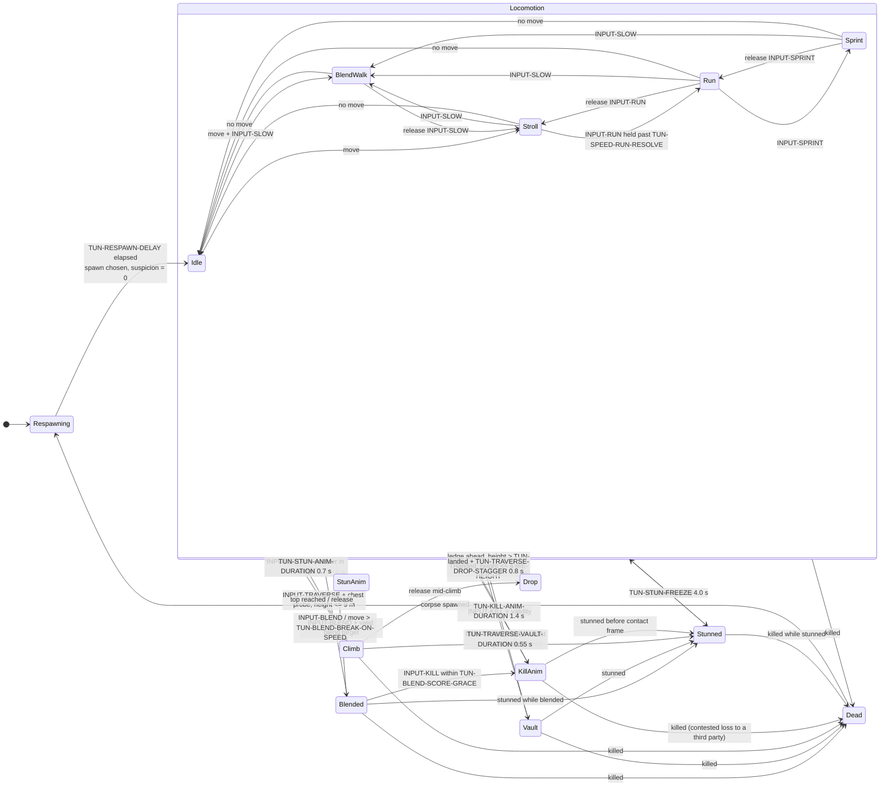
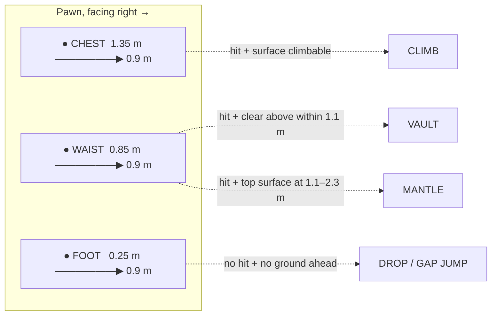

# GDD Part 2 — The Player

> **Context restated.** Project Sottovoce is a 4–6 player social-stealth game. Each player
> holds a **contract** on another player and is the contract of an unknown third. The map
> holds 60–90 AI civilians including 8–12 identical **clones** of each playable persona.
> The design thesis: *speed is a resource that costs anonymity*. This chapter specifies the
> pawn — what the player presses, what the character does, what the camera shows, and what
> each manoeuvre costs.
>
> Implements: `SYS-PAWN`, `SYS-INPUT`, `SYS-TRAVERSAL`, `SYS-CAMERA`.

---

## 1. Input map

### 1.1 Design principles for this input scheme

1. **One contextual traverse.** Vault, mantle, climb, drop-swing and gap-jump resolve from
   one input by context (§7). The player never chooses *which* manoeuvre; they choose
   *whether* to move through the world athletically, and the game resolves how.
2. **Speed is an axis, not a button.** The player's speed is chosen from a small ladder, and
   the ladder is always visible in the camera FOV. Because speed is the game's central
   economic decision (Law 1), it must be *held*, not toggled by accident.
3. **Crowd-scan is a first-class input.** Reading the crowd is the game's central act; it gets
   its own button rather than being an emergent consequence of standing still.
4. **Everything holdable is toggleable.** See §9.

### 1.2 Keyboard and mouse

| Action | ID | Default | Type | Notes |
|---|---|---|---|---|
| Move | `INPUT-MOVE` | `W A S D` | Axis (2D) | Magnitude sets stroll vs. blend-walk when no modifier is held. |
| Look | `INPUT-LOOK` | Mouse | Axis (2D) | |
| **Blend-walk** | `INPUT-SLOW` | `Left Ctrl` | Hold | Forces `TUN-SPEED-BLENDWALK`. The most important key in the game. |
| **Run** | `INPUT-RUN` | `Left Shift` | Hold | Raises the ceiling to `TUN-SPEED-RUN`. |
| **Sprint** | `INPUT-SPRINT` | `Left Shift`, **double-tap within `TUN-SPEED-RUN-RESOLVE`** | Hold | Deliberately *awkward* — see §1.5. A sustained hold means Run and no longer sprints (US-0090); `TUN-SPEED-SPRINT-DOUBLETAP` and `TUN-SPEED-SPRINT-HOLD` are deprecated. |
| **Traverse** | `INPUT-TRAVERSE` | `Space` | Press | Context-resolved (§7). |
| **Kill** | `INPUT-KILL` | `Left Mouse` | Press | Validity conditions in [`03_social_stealth.md`](03_social_stealth.md) §10. |
| **Stun** | `INPUT-STUN` | `Right Mouse` | Press | Only valid against your pursuer. Misuse is punished (`TUN-STUN-INVALID-STAGGER`). |
| **Blend / interact** | `INPUT-BLEND` | `E` | Press | Enter the highlighted blend action. |
| **Ability 1** | `INPUT-ABILITY-1` | `Q` | Press | |
| **Ability 2** | `INPUT-ABILITY-2` | `F` | Press | |
| **Crowd-scan** | `INPUT-SCAN` | `Middle Mouse` | Hold | `TUN-CAM-CROWDSCAN-SPEED` 0.45×, `TUN-CAM-CROWDSCAN-FOV` 48°. |
| ~~Shoulder swap~~ | `INPUT-SHOULDER` | — | — | **DEPRECATED 2026-08-12.** The camera has no lateral offset to swap; see §4.1. The ID is retained and never reused, and it is bound to nothing. |
| Scoreboard | `INPUT-SCORE` | `Tab` | Hold | |
| Menu | `INPUT-MENU` | `Escape` | Press | Also **releases the mouse**. It is captured on launch, and a click takes it back — without capture the cursor stops at the window edge and the camera stops turning with it. |
| Push-to-talk | — | — | — | Not in MVP (`SCOPE_FENCE` OUT #5). |

### 1.3 Gamepad

| Action | Default | Notes |
|---|---|---|
| Move | Left stick | Stick magnitude maps continuously to the speed ladder — the analogue advantage. |
| Look | Right stick | |
| Blend-walk | `L3` (click) toggle **or** stick magnitude ≤ `TUN-SPEED-STICK-BLENDWALK-MAX` | Toggle by default on pad, because holding a click is uncomfortable. |
| Run | `L2` / `LT` (analogue) | Held past `TUN-SPEED-TRIGGER-RUN`; below that the trigger does not run at all. There is no partial band since the Jog rung was deprecated. |
| Sprint | `L2` full + `A` / cross | Two-input, matching the KBM awkwardness. |
| Traverse | `A` / cross | |
| Kill | `R2` / `RT` | |
| Stun | `R1` / `RB` | |
| Blend / interact | `X` / square | |
| Ability 1 | `L1` / `LB` | |
| Ability 2 | `Y` / triangle | |
| Crowd-scan | `R3` (click) hold | |
| ~~Shoulder swap~~ | — | **DEPRECATED 2026-08-12**, with the offset it moved. |
| Scoreboard | `Back` / `View` | |

**ONLY ONE DEVICE DRIVES THESE BINDINGS, AND IT MUST BE A MAPPED GAMEPAD.** Windows presents
every HID device with axes as a joypad, and the shipped bindings answer *any* device. A pair of
sim pedals enumerating as joypad 0 rests its axes at −1.0, which reads as full left stick on
three actions forever: the pawn walks at stroll and the camera turns without stopping, with the
player's hands nowhere near it. So `PadSelection` picks the lowest-numbered device the engine has
a gamepad mapping for and points every joypad binding at that one; an unmapped device drives
nothing. **`TUN-SPEED-STICK-DEADZONE` cannot help here** — a deadzone rejects drift, a small
nonzero, and this is a full-scale reading from a device working perfectly. Found by the owner
trying to run the M1 feel gate, which is the second thing that checklist has paid for.

**The analogue stick is a genuine advantage on gamepad**, because the speed ladder is
continuous rather than stepped. This is accepted rather than corrected: the advantage is in
*fine speed control*, which rewards the same virtue the game rewards everywhere else. It is
logged for review at M6 against telemetry (`TEL-MEAN-SPEED` split by input device).

### 1.4 Rebinding

All actions are rebindable except `INPUT-MENU`. Rebinds are stored through `IProfileStore`
(a no-op in MVP, ASM-0026), which means **rebinds do not persist across sessions in MVP.**
This is a known, accepted MVP limitation and is the first thing a real profile store fixes.

| Rule | Detail |
|---|---|
| Conflict handling | A duplicate binding is permitted with a warning, except between `INPUT-KILL` and `INPUT-STUN`, which may never share a binding. |
| Modifier bindings | Supported (`Shift+E`). |
| Gamepad/KBM independence | Separate binding sets; hot-swap on input detected. |
| Device selection | §1.3: only a mapped gamepad may hold the joypad bindings. A reset restores the shipped bindings *and* re-applies that restriction — the shipped `device: -1` is the bug. |
| Reset | Per-action and global reset available. |

### 1.5 Why sprint is deliberately awkward

`INPUT-SPRINT` requires a double-tap within `TUN-SPEED-RUN-RESOLVE`, on both KBM and pad. **The
sustained-hold route was deprecated in US-0090**: a held key means Run and keeps meaning Run, so it
cannot also mean Sprint. The friction did not weaken — it stopped having two doors.
This is intentional friction, and it is the only intentional friction in the input scheme.

**The friction is resolved client-side**, in the input sampler, and reaches the pawn as a single
already-decided bit. That is deliberate: sprint is not an *outcome*, so nothing about it needs
server adjudication (never-do #2 governs kill and stun, which are validated against the
lag-compensated world). A modified client could skip the double-tap and gain nothing but the
suspicion it costs — which is the whole price. The friction exists to stop *accidents*, not
cheats, and a rule that only has to survive accident belongs where the accident happens.

Sprinting reaches **Noticed** in 1.2 s and **Exposed** in 2.8 s
(`TUN-SUSPICION-GAIN-SPRINT` 25/s). It is a three-second budget, not a movement mode
(Law 1). An input that can be entered accidentally would mean players spending that budget
without deciding to. The awkwardness makes sprint a *choice you made*, which is a
precondition for the failure feeling fair.

**The counter-argument, recorded:** friction on a panic button is cruel, because panic is
exactly when precise input fails. This is why `ABIL-LUNGE` exists — the "I have been made,
commit now" button is a single press with a 30 s cooldown, and it is the intended panic
response. Sprint is for *planned* speed; Lunge is for *unplanned* speed.

---

## 2. Speed states and transition rules

#### The frame the stick is read in

**MOVEMENT IS CAMERA-RELATIVE, AND THE PAWN FACES THE CAMERA.** `InputCommand.move` is an
intention — forward, back, left, right *as the player sees it* — and the world direction is that
intention rotated onto the look yaw. The body's facing is the camera's every tick, so the pawn
**strafes** rather than turning to face its own travel; `TUN-SPEED-BACKPEDAL-MULT` exists because
of that, and is what prices walking backwards.

Read as a world vector instead — which is how it shipped from US-0015 until the owner played it —
W walks north whatever the camera is doing, and A walks *west*, which at yaw 0 is the pawn's
right. So A and D were swapped on the heading everything spawns at and simply wrong on every
other. It survived nine stories because the code agreed with itself and every test asked whether
the pawn moved, never whether it moved where the camera was pointing.

### 2.1 The ladder

| State | Speed | Suspicion/s | Camera FOV | Time to **Noticed** (30) from 0 | Suspicion-free? |
|---|---|---|---|---|---|
| Idle | 0 | −8.0 (decay) | 55° | never | ✅ |
| **Blend-walk** | `TUN-SPEED-BLENDWALK` 1.4 | −8.0 (decay) | `TUN-CAM-FOV-BLEND` 55° | never | ✅ |
| **Stroll** | `TUN-SPEED-STROLL` 2.2 | −8.0 (decay) | `TUN-CAM-FOV-STROLL` 60° | never | ✅ |
| **Run** | `TUN-SPEED-RUN` 4.5 | +14.0 | `TUN-CAM-FOV-RUN` 69° | 2.1 s | ❌ |
| **Sprint** | `TUN-SPEED-SPRINT` 6.2 | +25.0 | `TUN-CAM-FOV-SPRINT` 72° | 1.2 s | ❌ |
| Climb | `TUN-SPEED-CLIMB` 2.8 | +12.0 | 62° | 2.5 s | ❌ |

**The cliff is between Stroll and Run**, and since 2026-08-12 there is nothing in between.
The ladder had a Jog rung at 3.4 m/s for +4.0/s; it was removed because `INPUT-RUN` producing
a speed the player did not ask for costs more than the cheap rung was buying. **The number
survives as `TUN-SCORE-PATIENT-SPEED`**, so `SCORE-PATIENT` still means what it meant.
 `TUN-SUSPICION-DECAY-SPEED-CEILING` equals
`TUN-SPEED-STROLL` exactly (ASM-0008): at or below 2.2 m/s you *recover*; above it you
*spend*, with no decay running concurrently. That single threshold is the design thesis
expressed as one conditional, and invariant §17.3 in TUNABLES asserts it.

### 2.2 Transition rules

| From → To | Condition | Notes |
|---|---|---|
| Idle → Blend-walk | `INPUT-MOVE` magnitude > 0 with `INPUT-SLOW` held | |
| Idle → Stroll | `INPUT-MOVE` magnitude > 0, no modifier | Default movement is Stroll, not Blend-walk. Blend-walk is a deliberate act. |
| Stroll → Run | `INPUT-RUN` still held when `TUN-SPEED-RUN-RESOLVE` expires | The window is what tells a hold from the first half of a double-tap. Continuous ramp; the discrete names are for tuning and telemetry, the acceleration is smooth. |
| Run → Sprint | `INPUT-SPRINT` satisfied (§1.5) | Reached through Run, one tick after it — there is no Stroll → Sprint edge, and 33 ms is not a rung the player can read. |
| Any → Blend-walk | `INPUT-SLOW` pressed | **Always available and instant.** Slowing down is never gated, never delayed, never refused. |
| Any → Idle | `INPUT-MOVE` released | Deceleration at `TUN-SPEED-DECEL` 24 m/s², faster than acceleration — see below. |
| Sprint → * | `ABIL-SECONDFACE` active | Sprinting breaks Second Face (`TUN-SECONDFACE-BREAK-SPEED`). The HUD warns before the break, not after. |

**Acceleration is asymmetric on purpose.** `TUN-SPEED-ACCEL` is 18 m/s² and
`TUN-SPEED-DECEL` is 24 m/s². Stopping is faster than starting. This means "stop and blend"
is always instantly available — the defensive option is never gated behind a physics
animation — while committing to speed takes a moment. The asymmetry is the thesis written
into the acceleration curve.

---

## 3. The player state machine

> **Amended by [ADR-0012](../00_meta/adr/ADR-0012-slow-is-always-available.md), 2026-08-05.**
> Six edges were added: `Jog`/`Run`/`Sprint` → `BlendWalk` and → `Idle` (the Jog pair went
> with the rung on 2026-08-12). §2.2 declares
> `Any → Blend-walk` "always available and instant" and `Any → Idle` on move-release, but
> Mermaid has no notation for a wildcard edge, so neither row had ever been drawn — which
> made `Sprint → BlendWalk` illegal in the asserted table and the M1 feel gate unmeetable.

Fourteen states — fifteen were declared until the Jog rung was deprecated, and `Jog` is
retained as a retired ID that nothing reaches ([`../30_bible/NAMING_AND_IDS.md`](../30_bible/NAMING_AND_IDS.md)
§2.3). This diagram is **normative**: the transition table in
`PawnStateMachine.TRANSITIONS` is asserted against it by `test_pawn_transitions.gd`
(ADR-0008). If the code and this diagram disagree, the diagram is right until an ADR says
otherwise.



### 3.1 State table — entry, exit and interrupt priority

Priority constants: `NORMAL = 0`, `COMBAT = 10`, `FATAL = 20` (ADR-0008 rule 4). A transition
requested at priority *P* may interrupt a state whose `is_interruptible()` is false only if
*P* exceeds that state's own priority.

| State | Entry condition | Exit condition | Interruptible? | Priority | Suspicion contribution |
|---|---|---|---|---|---|
| **Respawning** | Death resolved | `TUN-RESPAWN-DELAY` 5.0 s | No | FATAL | n/a (set to 0 on exit) |
| **Idle** | No move input, grounded | Any move input | Yes | NORMAL | decay |
| **BlendWalk** | Move + `INPUT-SLOW` | Input change | Yes | NORMAL | decay |
| **Stroll** | Move, no modifier | Input change | Yes | NORMAL | decay |
| **Run** | `INPUT-RUN` ≥ 0.35 s | Release / escalate | Yes | NORMAL | +14.0/s |
| **Sprint** | `INPUT-SPRINT` | Release | Yes | NORMAL | +25.0/s |
| **Climb** | Traverse + chest probe on climbable ≤ 9 m | Top / release / stun | Yes (to COMBAT+) | NORMAL | +12.0/s, and +18.0/s on arrival if the destination is the roof stratum |
| **Vault** | Traverse + waist probe ≤ `TUN-TRAVERSE-VAULT-MAX-HEIGHT` | 0.55 s | Yes (to COMBAT+) | NORMAL | none — a vault is a civilian act |
| **Drop** | Ledge exit above `TUN-TRAVERSE-DROP-SAFE-HEIGHT` | Landing | No (airborne) | NORMAL | none in air; `TUN-TRAVERSE-DROP-STAGGER` on hard landing |
| **Blended** | `INPUT-BLEND` on a valid target, after `TUN-BLEND-ENTRY-TIME` 0.35 s | `INPUT-BLEND`, speed break, damage | Yes (to COMBAT+) | NORMAL | crushes to 0 over `TUN-BLEND-CRUSH-TIME` 1.2 s |
| **KillAnim** | `INPUT-KILL` + server validation | `TUN-KILL-ANIM-DURATION` 1.4 s | **No.** Only FATAL gets through — a third party killing the killer. **Amended 2026-08-26, ADR-0013**: COMBAT no longer interrupts before the contact frame | COMBAT | none directly; `TUN-SUSPICION-GAIN-WITNESSED-KILL` may apply |
| **StunAnim** | `INPUT-STUN` + pursuer in range and ≥ Noticed | 0.7 s | No below FATAL | COMBAT | none if valid; `TUN-STUN-INVALID-SUSPICION` +20 if not. **Built US-0061.** Its first version returned `true` from `is_interruptible`, reasoned from ADR-0013 being "one state wide" — this column is normative and the inference was not |
| **Stunned** | Stunned by prey | `TUN-STUN-FREEZE` 4.0 s | No below FATAL | COMBAT | forced to `TUN-SUSPICION-MAX` |
| **Dead** | Kill resolved against you | Corpse spawned | No | FATAL | n/a |

> **Corrected 2026-08-05: fifteen, not fourteen.** Six places in the corpus said
> "fourteen states" while this table and the normative diagram above both list fifteen.
> §3 states the diagram is normative, so the prose was corrected rather than the table.
> `StunAnim` (you performing a stun) and `Stunned` (you being stunned) are distinct
> states with different priorities and exit conditions; neither is redundant.
> `PawnStateId.ALL` is the machine-readable list, asserted by `test_pawn_state_count.gd`.

### 3.2 The three interrupt rules that matter

1. **A kill in progress cannot be stopped by the victim.** Amended 2026-08-26 (ADR-0013).
   `KillAnim` declines every COMBAT-priority interruption, so a stun landing after the
   killer has committed does nothing for the victim. **Only FATAL gets through** — a third
   party killing the killer mid-animation, which the §3 diagram already draws.

   This reverses the earlier rule, which let a stun cancel the kill until
   `TUN-KILL-CORPSE-SPAWN-DELAY`. The reference resolves a contested kill **for the killer**,
   and the prey's counterplay lives entirely in the approach: a careless hunter is stunnable
   from further away than they can strike, for the whole time they are closing. What is gone
   is the save at the moment of commitment.

   **`TUN-KILL-CORPSE-SPAWN-DELAY` is still a tunable and still means the contact frame** —
   it decides when the victim dies, when the corpse appears and when the crowd startles. It
   simply no longer decides whether a stun arrived in time.
2. **Nothing interrupts `Stunned`.** Not another stun, not a kill attempt (which simply
   succeeds), not input. Four seconds of total helplessness is the point of the mechanic
   (Law 5).
3. **`Blended` yields to everything.** Being blended protects your anonymity, never your
   body. A blended player can be killed, stunned, or Whisperbolted normally. Blend is not
   cover.

---

## 4. Camera

### 4.1 Rig

| Property | Tunable | Value | Why |
|---|---|---|---|
| Type | — | Third-person spring arm | The player must be able to see their own silhouette. Judging "how do I look right now?" is a core skill, and a first-person camera makes it impossible. |
| Arm length | `TUN-CAM-ARM-LENGTH` | 2.6 m | Far enough to show your own body, close enough to keep faces legible at 20 m. |
| Pivot height | `TUN-CAM-ARM-HEIGHT` | 1.55 m | Roughly shoulder height on the tallest persona (Lucerna). |
| Framing | — | **Centred** | The pawn sits on the centre line. See below. |
| Occlusion pull-in | `TUN-CAM-OCCLUSION-PULL-RATE` | 12 m/s | Fast. A camera stuck in a wall, in a game about looking at people, is a critical failure. |
| Occlusion restore | `TUN-CAM-OCCLUSION-RESTORE-RATE` | 4 m/s | Slower than pull-in, to prevent oscillation in doorways. |

#### The pawn is centred, and that is a decision

**THE CAMERA HAS NO LATERAL OFFSET.** The pawn stands on the centre line of the shot, and the
`TUN-CAM-SHOULDER-OFFSET` / `TUN-CAM-SHOULDER-SWAP-TIME` pair that used to move it off is
deprecated along with `INPUT-SHOULDER`.

Two reasons, and the second is the one that matters:

1. **The offset never did anything.** The rig slid the camera 0.45 m sideways and then aimed at
   the pivot — the pawn's own axis — so the pawn re-centred in view however far the camera moved.
   It changed the viewing *angle* and never the composition. Nobody could see that while the
   pawn was invisible (US-0091); the first screenshot of a rendered body made it obvious.
2. **A centred model is the right shot for this game.** It is the established framing for
   third-person social stealth, and it is the framing this design needs: the pawn's silhouette is
   the thing the player is *reading* — how do I look right now, am I moving like the crowd — and a
   silhouette pushed into a corner of the screen is a silhouette you stop checking. An
   over-the-shoulder offset exists to clear a firing line, and this game has no firing line.

The cost is honest and accepted: your own body occupies the middle of the screen and hides what
is directly ahead at close range. That is what `TUN-CAM-ARM-LENGTH` and the FOV ladder are for,
and it is a cost every game with this camera pays.

### 4.2 FOV as an information channel

FOV is bound to speed state, transitioning at `TUN-CAM-FOV-BLEND-RATE` (90°/s):

```
55° blend-walk → 60° stroll → 69° run → 72° sprint
                                      ↑ the cliff is here (suspicion begins)
48° crowd-scan (narrowest — leaning in)
```

**This is not a style choice; it is a warning system.** The widening FOV at speed produces
peripheral distortion and a sense of loss of control that tells the player, pre-consciously,
that they are doing something conspicuous — before they read the tier indicator. It is the
cheapest possible reinforcement of Law 1.

The narrow blend-walk FOV does the opposite: it compresses the scene, makes distant faces
larger and more comparable, and rewards the player for slowing down with *better vision*.
Slowing down literally lets you see more clearly. That is the game's thesis rendered as a
lens.

### 4.3 The crowd-scan pan

Held `INPUT-SCAN`:

| Effect | Value |
|---|---|
| Look sensitivity | × `TUN-CAM-CROWDSCAN-SPEED` 0.45 |
| FOV | `TUN-CAM-CROWDSCAN-FOV` 48° |
| Movement | Capped at `TUN-SPEED-BLENDWALK` |
| Audio | Ambience ducked slightly; footstep sources sharpened |
| Compass | Unchanged — scanning gives no extra information, only *better perception of existing information* |

Crowd-scan is the game's "aim down sights", and it deliberately grants **no mechanical
advantage** — no reveal, no highlight, no tag. It grants *slower, closer, quieter looking*.
The advantage is entirely in the player's own perception. This is the single clearest
statement of what kind of game this is.

### 4.4 Occlusion handling

Standard spring-arm collision, with two additions specific to this game:

1. **NPCs do not occlude the camera.** The arm collides with world geometry only. If NPCs
   pushed the camera in, a dense crowd — the safest place in the game — would become the
   place where the camera is least usable.
2. **The arm never passes through a wall to a position where the player can see around a
   corner they could not see around on foot.** Where the pull-in would grant that, the camera
   pulls *in* rather than sideways. This is a fairness rule: camera position must not be an
   information channel.

---

## 5. Feel budget

| Constraint | Tunable | Value | Enforcement |
|---|---|---|---|
| Input → visible animation response | `TUN-FEEL-INPUT-TO-ANIM-MAX` | ≤ 80 ms | Measured locally with prediction active. Automated frame-capture test in `test_feel_latency.gd`. |
| Maximum unskippable animation | `TUN-FEEL-MAX-COMMIT` | 1.4 s | Only `KillAnim` may sit at the ceiling. Asserted by TUNABLES invariant §17.15. |
| Slowing down | — | Never gated | `Any → BlendWalk` is instant from every locomotion state. No animation, no delay, no refusal. |
| Camera control during commitment | — | Retained | The player keeps look control during `KillAnim`, `Vault` and `Drop`. Losing camera control is disorienting and — worse — prevents the player from *watching the consequences of their own commitment*, which is where the tension lives. |
| Camera control while `Stunned` | — | **Removed** | The one exception. Being stunned takes everything, including the camera, which snaps to a fixed offset. This is the mechanical difference between "interrupted" and "helpless". |

**The 80 ms budget's real meaning:** the game is decided at 2.5 m with a 0.4 s contest window
(`TUN-KILL-CONTEST-WINDOW`). 80 ms is a fifth of that window. Above ~100 ms, players stop
trusting close-range timing, and the moment they stop trusting it they stop attempting patient
close-range kills — which deletes the game.

---

## 6. Traversal cost table

Every manoeuvre priced in the three currencies that matter: **time**, **suspicion**, **noise**.
Noise radius determines who hears you (`TUN-AUDIO-FOOTSTEP-RADIUS-*`) and whether NPCs
Startle (`TUN-CROWD-STARTLE-RADIUS-SPRINT` 5 m).

| Manoeuvre | Time | Suspicion cost | Noise radius | NPC Startle? | Net verdict |
|---|---|---|---|---|---|
| Blend-walk 10 m | 7.14 s | −8/s (recovering) | 4 m | No | The default. Slow, free, invisible. |
| Stroll 10 m | 4.55 s | −8/s (recovering) | 6 m | No | The travel speed. Still recovering. |
| Run 10 m | 2.22 s | +31.1 total | 14 m | Yes (marginal) | Crosses into **Noticed** in one street's length. |
| Sprint 10 m | 1.61 s | +40.3 total | 18 m | **Yes** | Noticed, loud, and leaves a Startle trail marking your path. |
| **Vault** (≤ 1.1 m) | 0.55 s | **0** | 5 m | No | *Free.* A civilian hops a low wall. The only athletic move that costs nothing — and therefore the backbone of ground-level route-finding. |
| **Mantle** (≤ 2.3 m) | 0.95 s | +11.4 (climb rate × duration) | 7 m | No | Cheap but visible: a 0.95 s commitment readable at 30 m. |
| **Climb** (per metre) | 0.36 s/m | +4.3/m | 7 m | No | A 9 m climb: 3.2 s, +38.6 suspicion — **Noticed** before you arrive. |
| **Arrive on roof stratum** | — | +18/s *while present*, and **decay stops** | — | No | Standing on a roof reaches **Noticed** in 1.7 s — 30/18, the toll alone. Netting the 8/s decay against it would make that 3.0 s. The roofs are a highway with a toll booth. |
| **Drop** (≤ 4 m) | ~0.9 s | 0 | 8 m | No | Free and fast. Dropping *down* is the cheap direction — descending into the crowd is always safer than ascending out of it. |
| **Drop** (> 4 m, hard) | ~1.1 s + `TUN-TRAVERSE-DROP-STAGGER` 0.8 s | 0 | 12 m | Yes | The panic-off-a-roof move. No suspicion, but 0.8 s of helplessness on landing. |
| **Gap jump** (≤ 3.2 m) | ~0.8 s | +18/s roof presence | 8 m | No | Only exists on the roof stratum, so it always carries the roof toll. |
| **Blend entry** | `TUN-BLEND-ENTRY-TIME` 0.35 s | crushes to 0 over 1.2 s | 2 m | No | The cheapest defensive action in the game. |

### 6.1 What this table is saying

Read the suspicion column vertically. **Vertical movement costs; horizontal slow movement
pays; and dropping down is free.** The route economics that fall out:

- Ground routes at stroll are strictly optimal when you have time.
- Roof routes are fast, high-visibility, and cost anonymity for as long as you are up there —
  so they are for *crossing* the map, never for *waiting*.
- The correct roof play is: climb, cross, drop *immediately*, and let the crowd absorb you.
  The expensive mistake is lingering.
- Vault is free, so ground-level route quality is a level-design responsibility: a district
  full of vaultable furniture is a district where patient players have options.

This is the tension [`05_level_design.md`](05_level_design.md) is built to exploit.

---

## 7. Parkour — assisted, not simulated

**The design position:** traversal here is *forgiving and legible*, not athletic and precise.
A missed ledge must be a decision error, never a timing error. The player is a tradesperson
who can climb, not an acrobat.

### 7.1 Probe layout

Three forward raycasts, `TUN-TRAVERSE-PROBE-COUNT` = 3, each of length
`TUN-TRAVERSE-PROBE-LENGTH` = 0.9 m (longer than the pawn's radius, so intent is detected
*before* collision).



A fourth, downward probe (`FOOT` cast down 5 m from 0.6 m ahead) distinguishes a **gap**
(ground found within `TUN-TRAVERSE-GAP-MAX` 3.2 m ahead) from a **drop** (no ground within
that distance).

### 7.2 Context resolution priority

Evaluated in this order. **First match wins.** This ordering is normative and is asserted by
`test_traversal_resolution.gd`.

| # | Condition | Resolves to | Why this priority |
|---|---|---|---|
| 1 | Airborne and a ledge is within `TUN-TRAVERSE-MAGNET-RADIUS` 0.6 m | **Ledge grab** | Catching a ledge you are falling past must always beat anything else. It is the forgiveness case, and forgiveness goes first. |
| 2 | `FOOT` clear, no ground ahead, gap ≤ `TUN-TRAVERSE-GAP-MAX` 3.2 m, **and the landing is not more than `TUN-TRAVERSE-DROP-SAFE-HEIGHT` below** | **Gap jump** | Crossing a gap you are running at is unambiguous intent. The depth clause is what keeps a roof edge out of this row: the street below you is horizontally *near*, so the gap test passes on it, and a fall is not a jump. |
| 3 | `FOOT` clear, no ground ahead, no landing within range | **Drop** (or drop-swing if a lower ledge exists within 2 m) | |
| 4 | `WAIST` hit, obstacle top ≤ `TUN-TRAVERSE-VAULT-MAX-HEIGHT` 1.1 m, clear space beyond | **Vault** | Before mantle, because a low wall you can go *over* should not become a wall you climb *onto*. |
| 5 | `WAIST` hit, obstacle top 1.1–`TUN-TRAVERSE-MANTLE-MAX-HEIGHT` 2.3 m | **Mantle** | |
| 6 | `CHEST` hit on a climbable surface, height ≤ `TUN-TRAVERSE-CLIMB-MAX-HEIGHT` 9 m | **Climb** | Last, because climbing is the most expensive option and should never be selected when a cheaper one applies. |
| 7 | No match, **or a lip less than `TUN-TRAVERSE-DROP-MIN-HEIGHT` high with the ground resuming beside it** | **A hop** — `TUN-TRAVERSE-HOP-STANDING` from idle/blend-walk/stroll, `TUN-TRAVERSE-HOP-COMMITTED` from run/sprint. No manoeuvre, no state change, no horizontal component | **This row was silence until US-0093**, and silence was the wrong answer for it: a key that does nothing in open ground reads as broken rather than as restraint. It is an *impulse*, so the resolver stays the only owner of `INPUT-TRAVERSE` and the pawn keeps whatever state — and suspicion rate — it already had. A failed traverse must still never look like a bug, and a step is still not a manoeuvre: paying a planned arc to cross one metre off a 0.9 m counter is a worse trade than walking off. |

### 7.3 Forgiveness windows

| Window | Tunable | Value | What it forgives |
|---|---|---|---|
| Ledge-grab magnetism (time) | `TUN-TRAVERSE-MAGNET-WINDOW` | 0.25 s | Pressing traverse *late* — after you have already passed the ledge. |
| Ledge-grab magnetism (space) | `TUN-TRAVERSE-MAGNET-RADIUS` | 0.6 m | Not being laterally aligned with the ledge. |
| Traverse input buffer | `TUN-TRAVERSE-INPUT-BUFFER` | 0.20 s | Pressing traverse *early* — before the obstacle is in probe range. |
| Gap-jump auto-align | `TUN-TRAVERSE-GAP-ALIGN-ARC` | ±20° | Not facing exactly across the gap. |

**Combined, a player has a ~0.45 s window (0.20 s early + 0.25 s late) around any traverse
opportunity.** That is enormous by action-game standards, and it is correct: the player's
attention should be on the *crowd*, not on their own footwork.

### 7.4 The level-design contract

Because traversal is assisted, the level must never present an ambiguous case. The metrics
bible in [`05_level_design.md`](05_level_design.md) §4 builds all geometry at unambiguous
heights:

| Built at | Resolves as | Never build at |
|---|---|---|
| 0.9 m | Vault, always | 1.05–1.15 m (vault/mantle boundary) |
| 1.8 m | Mantle, always | 2.25–2.35 m (mantle/climb boundary) |
| 4.0 m+ | Climb, always | — |
| 2.0 m gap | Easy jump | 3.0–3.4 m (jump/no-jump boundary) |
| 2.8 m gap | Committed jump | — |
| 3.6 m gap | Impossible, and visibly so | — |

A player must never have to *guess* whether geometry is traversable. Guessing costs attention,
and attention is the resource the game is actually about.

---

## 8. Animation and clone parity

Stated here because it constrains the controller, and specified fully in
[`../30_bible/ANIMATION_SPEC.md`](../30_bible/ANIMATION_SPEC.md) §6.

**The constraint:** every animation a player can perform *while Anonymous* must also be
performable by that persona's NPC clones. Any animation a player has that its clones do not
is an **anonymity leak** and is a release-blocking bug.

| Player animation | Clone equivalent required? | Reasoning |
|---|---|---|
| Idle, blend-walk, stroll | **Yes, identical** | The states a player spends most of their life in. |
| Idle variations (look around, shift weight) | **Yes, identical set** | A player idling with a variation their clones lack is uniquely identifiable while doing the safest thing in the game. |
| Sit on bench, lean on stall, join walking group | **Yes** | These *are* clone behaviours; the player is imitating them. |
| Run | No | Already **Noticed** — anonymity is already spent. |
| Sprint, climb, vault, mantle, drop | No | Same. |
| Kill, stun, ability casts | No | Explicitly non-civilian; the tell is the point. |

**The implication for the controller:** the boundary between "must have a clone equivalent"
and "need not" is exactly the suspicion cliff at `TUN-SPEED-STROLL`. Anything free is
imitated; anything that costs is exposed. Adding a *free* player animation without a clone
equivalent is the easiest way to silently break the game's core promise.

---

## 9. Accessibility

Accessibility here is not an add-on, because this game's information is delivered through
channels that commonly fail: colour, sound, and sustained visual attention.

### 9.1 Colour

| Provision | Detail |
|---|---|
| **Colourblind-safe Compass** | The Compass never encodes information in hue alone. Distance is *cadence*, direction is *position*, lock is *arc fill*, and the prey warning is *a flash plus a shape change plus an audio sting*. Three palettes (deuteranopia, protanopia, tritanopia) plus a high-contrast monochrome mode. Specified in [`../30_bible/UI_UX_SPEC.md`](../30_bible/UI_UX_SPEC.md) §7. |
| **Suspicion tier** | Encoded by an icon *shape* change (open circle → half-filled → filled triangle) as well as by colour, so tier is readable in monochrome. |
| **Persona identification** | By silhouette at 40 m ([`../30_bible/ART_BIBLE.md`](../30_bible/ART_BIBLE.md) §2), never by colour. This was a design requirement before it was an accessibility one, and it happens to solve both. |
| **The colour-language law** | Colour carries exactly three meanings in this game — persona identity, suspicion tint, ability tell — and *nothing decorative may use those hues*. Enforced in the art bible. |

### 9.2 Audio

| Provision | Detail |
|---|---|
| **Every audio tell has a caption** | Optional caption track naming every gameplay-relevant sound: "Compass — close", "Warning — you are hunted", "Whisperbolt wind-up nearby", "Cinderfall". Captions are positional (rendered at screen edge in the sound's direction) where the sound itself is positional. |
| **Visual Compass pulse** | The Compass pulses visually as well as audibly, at identical cadence. A deaf player loses *no* Compass information. |
| **Visual prey warning** | The red flash is the primary channel; the sting is reinforcement, not the carrier. |
| **Mono downmix** | Full support; positional information is preserved through the caption system for players who cannot use stereo imaging. |
| **Independent buses** | Ambience, information sounds (Compass, stings, tells), footsteps, music, and UI on separate sliders. A player may mute ambience entirely without losing a single piece of gameplay information — see [`../30_bible/AUDIO_BIBLE.md`](../30_bible/AUDIO_BIBLE.md) §3's information-vs-atmosphere split. |

### 9.3 Input

| Provision | Detail |
|---|---|
| **Hold/toggle for every hold input** | `INPUT-SLOW`, `INPUT-RUN`, `INPUT-SPRINT`, `INPUT-SCAN`, `INPUT-SCORE`. Individually configurable. |
| **Full rebinding** | Every action except `INPUT-MENU`. |
| **No required simultaneous inputs** | The gamepad sprint (`L2` + `A`) has a single-input alternative in the accessibility menu. |
| **No timing-critical inputs** | Guaranteed by §7.3's forgiveness windows. The tightest genuinely-required window in the game is `TUN-KILL-CONTEST-WINDOW` (0.4 s), and losing it costs a stagger, not a death. |
| **Adjustable input buffer** | `TUN-TRAVERSE-INPUT-BUFFER` and `TUN-ABILITY-INPUT-BUFFER` may be raised (not lowered) up to 0.4 s. Raising them is a pure accessibility gain with no competitive advantage, because they only affect whether *your own* input registers. |

### 9.4 Motion and visual load

| Provision | Detail |
|---|---|
| **Motion-reduction mode** | Disables FOV changes with speed (locks to `TUN-CAM-FOV-MOTION-REDUCED`, 62°), reduces camera bob, removes speed-line effects, and slows the Compass's visual pulse animation while preserving its cadence. |
| **Trade-off, stated honestly** | Motion-reduction removes the FOV warning channel (§4.2). To compensate, the mode adds a persistent numeric/iconic speed-state indicator to the HUD. This is a *different* channel, not a worse one, but it is more explicit and slightly less immersive. Players should know they are making that trade. |
| **Camera shake** | Fully disableable. No gameplay information is ever carried by shake. |
| **Reduced crowd density option** | **Deliberately not offered.** Crowd density is gameplay (Law 2), and reducing it would grant a competitive advantage by making players easier to pick out. Performance-driven density reduction is handled by fidelity LOD instead (`TUN-PERF-CROWD-LOD-*`), never by count. This is the one accessibility request we refuse, and the reason is recorded here so it does not have to be re-argued. |

### 9.5 Cognitive load

| Provision | Detail |
|---|---|
| **Bonus name persistence** | Score-feed lines persist `TUN-UI-SCOREFEED-DURATION` 4 s, with an option to raise to 8 s. |
| **Results screen has no timer pressure** | `TUN-MATCH-RESULTS-DURATION` 25 s, skippable only by *unanimous* input, so one impatient player cannot deny another the teaching moment. |
| **A glossary is available in-game** | From the pause menu, listing every bonus and its condition, drawn from the same string table as the score feed. |

---

## 10. Acceptance criteria

- [ ] Every action in §1.2 and §1.3 is bound, rebindable, and present in the input map resource.
- [ ] `INPUT-KILL` and `INPUT-STUN` cannot be bound to the same control; the binding UI refuses it.
- [ ] All fourteen states in §3 exist as separate `PawnState` subclasses (ADR-0008). `Jog` was retired in US-0090 and is not among them.
- [ ] `PawnStateMachine.TRANSITIONS` matches the §3 diagram edge for edge, asserted by `test_pawn_transitions.gd`.
- [ ] `Any → BlendWalk` succeeds from every locomotion state within one tick, from any speed.
- [ ] Measured input-to-animation latency ≤ `TUN-FEEL-INPUT-TO-ANIM-MAX` (80 ms) at 60 fps with prediction active.
- [ ] No animation except `KillAnim` reaches `TUN-FEEL-MAX-COMMIT` (1.4 s).
- [ ] `KillAnim` is stun-interruptible before 0.9 s and not after; covered by `test_kill_interrupt.gd`.
- [ ] `Stunned` is uninterruptible for its full `TUN-STUN-FREEZE` duration.
- [ ] Traversal resolution follows §7.2's priority order exactly; `test_traversal_resolution.gd` covers all seven cases including the no-match silence.
- [ ] A traverse input pressed 0.20 s early or 0.25 s late still resolves.
- [ ] FOV matches the §4.2 ladder within 1° at each steady speed state.
- [ ] NPCs do not occlude the camera; verified by walking into a 6-NPC pocket with no arm pull-in.
- [ ] Every animation marked "Yes, identical" in §8 exists in the clone-parity table with a matching NPC clip.
- [ ] Every hold input in §9.3 has a working toggle mode.
- [ ] With ambience muted and captions on, a player can complete a match without losing any gameplay information. Verified manually in playtest.

---

## 11. Failure modes

| # | Failure | Symptom | Root cause to check |
|---|---|---|---|
| 1 | **Sprint is entered accidentally.** | Players report "I didn't mean to run" and resent the suspicion cost. | §1.5's friction is insufficient, or the double-tap window is too generous. Un-earned punishment breaks Law 1's legibility. |
| 2 | **Slowing down feels delayed.** | Players die during the deceleration from sprint. | `TUN-SPEED-DECEL` too low, or a state transition is gating `→ BlendWalk`. This must always be instant; it is the escape hatch the whole speed economy depends on. |
| 3 | **Traversal fires when unwanted.** | Player vaults a stall while trying to walk past it, entering an animation and drawing attention. | Probe length too long, or priority order wrong. Rule 7 (silence on no match) must never be reached by *accident* in the other direction either. |
| 4 | **Traversal fails when wanted.** | Player presses traverse at a ledge and nothing happens. | Magnetism windows too tight, or geometry built in a boundary band (§7.4). Almost always a level-design bug, not a code bug. |
| 5 | **The camera is unusable in a crowd.** | Players avoid dense pockets — the safest place in the game — because they cannot see. | NPC occlusion has been re-enabled, or the arm is too short for the pocket module's density. |
| 6 | **FOV changes are nauseating.** | Playtesters report discomfort at speed transitions. | `TUN-CAM-FOV-BLEND-RATE` too fast. Motion-reduction mode must be discoverable *before* someone feels sick, i.e. offered at first launch. |
| 7 | **Kill feels unresponsive.** | Players press kill in range and nothing happens; they blame the game. | Server validation rejecting on facing cone (`TUN-KILL-FACING-CONE`) or on lag-compensation grace. Whatever the cause, the *fix is feedback*: a rejected kill must play a distinct whiff, never silence. |
| 8 | **Clone parity breaks silently.** | Skilled players start picking out humans reliably in the crowd and cannot say why. | A player-only animation has shipped. The hardest failure in this chapter to detect and the most damaging; the automated parity test exists because human review will miss it. |
| 9 | **Motion-reduction players are competitively disadvantaged.** | Accessibility-mode players report losing to speed changes they could not perceive. | The compensating speed indicator (§9.4) is missing or unreadable. |

---

## 12. Open questions

| # | Question | Position taken for now | Needed by |
|---|---|---|---|
| 1 | Should the analogue-stick speed advantage (§1.3) be normalised away by quantising gamepad input to the five discrete speeds? Current position: **no** — the advantage rewards fine control, which is the virtue we already reward. But it is an unfair-by-device asymmetry and should be measured. | Keep analogue; measure `TEL-MEAN-SPEED` by device at M6. | M6 |
| 2 | Should `Vault` really cost zero suspicion? It is the only free athletic move, and a player who chains vaults across a market moves faster than stroll while paying nothing. | Keep it free — chained vaults are geometry-limited and the level design controls them. Revisit if telemetry shows vault-chaining as a dominant travel mode. | M4 |
| 3 | Is a 0.45 s combined traverse forgiveness window (§7.3) too generous? It may make traversal feel automatic rather than chosen. | Keep. Attention belongs on the crowd. Revisit only if players report accidental traversal (failure mode 3). | M4 |
| 4 | Should `Blended` be interruptible *out* by the player instantly, or should `TUN-BLEND-EXIT-TIME` (0.30 s) apply even when fleeing a detected threat? Currently the exit time always applies. | Keep the exit time. Blend must be a commitment in both directions or it becomes a toggle that costs nothing. | M4 |
| 5 | Does the camera-fairness rule (§4.4.2) conflict with playability in the narrow alleys the metrics bible specifies? A camera that refuses to pull sideways may become useless in a 2.2 m alley. | Unresolved. May require widening the minimum alley width, which is a level-design cost. | M1 |
