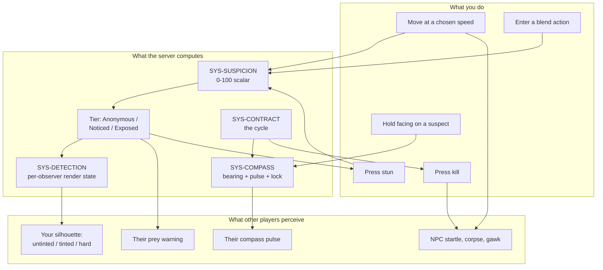
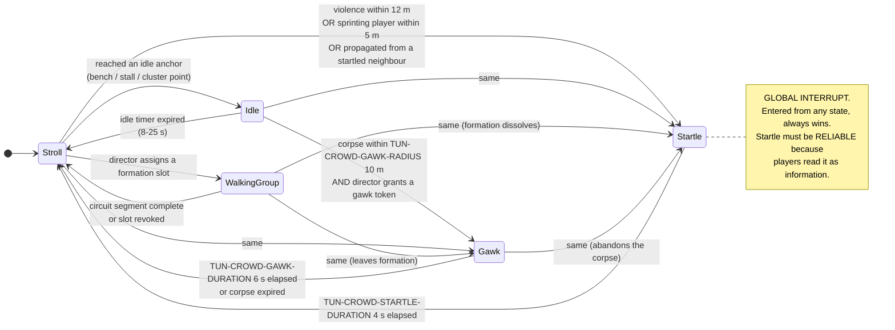
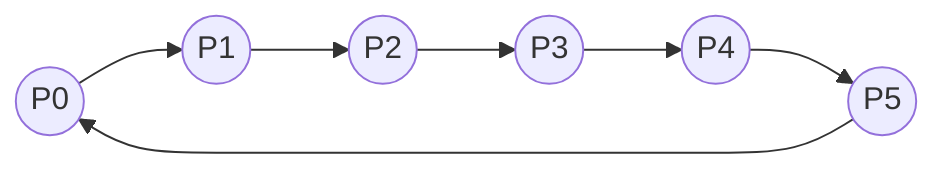

# GDD Part 3 — The Social Stealth Core

> **Context restated for a reader who has read nothing else.** Project Sottovoce is a 4–6
> player free-for-all social-stealth game set in `MAP-VETRAIO`, a ~120 × 120 m Renaissance
> city district. Every player holds a **contract** on one other player and is the contract of
> an unknown third; the assignment forms a single directed cycle. The district holds 60–90 AI
> civilians, including 8–12 identical **clones** of each of the four playable **personas**.
> Matches last 8 minutes and are decided by score, not kills. The thesis: *speed is a resource
> that costs anonymity; patience must be the winning strategy, not merely the safe one.*
>
> **This is the most important chapter in the corpus.** Every other system exists to serve
> what is specified here.
>
> Implements: `SYS-SUSPICION`, `SYS-BLEND`, `SYS-DETECTION`, `SYS-CONTRACT`, `SYS-COMPASS`,
> `SYS-KILL`, `SYS-STUN`, `SYS-CROWD`, `SYS-NPC-AI`, `SYS-CORPSE`.

---

## 1. The core in one diagram



**Read the diagram this way:** your *speed* and your *position relative to the crowd* are the
only things you control that affect what others see. Everything else — the Compass, the
contract, the tier — is computed for you. The entire game is the loop from "what speed am I
moving at" to "what does the person hunting me see".

---

## 2. The anonymity model — what the other player actually sees

This is the most literal section in the corpus, because "what does the other player see" is
the question the whole game is built on and it must have exactly one answer.

### 2.1 The rendering rule

For any pair of players (observer **O**, subject **S**), the server computes S's render state
*from O's perspective* every tick:

```
render_state(O, S) =
    if S.tier == ANONYMOUS:                     PLAIN
    elif S.tier == NOTICED  and contract(O) == S:  TINTED
    elif S.tier == EXPOSED  and contract(O) == S:  HARD
    elif S.tier == EXPOSED  and contract(S) == O:  HARD      # your pursuer, if reckless
    else:                                        PLAIN
```

Three consequences that must be internalised:

1. **Suspicion is not a broadcast.** A player at 95 suspicion looks completely ordinary to
   everyone except their hunter and (if they are the hunter) their prey. Four of the five
   other players in a 6-player match see nothing. This is what stops the game from collapsing
   into "everyone converges on the visible guy".
2. **The relationship determines the channel.** The same player, at the same suspicion, is
   rendered differently to different observers *simultaneously*. This is a per-observer render
   pass, not a material swap.
3. **Being Exposed cuts both ways.** An Exposed player is visible to their hunter (they are
   easier to kill) *and* to their prey (their target is warned). Recklessness is punished
   twice by one mechanic.

### 2.2 Tier-by-tier specification

#### Tier: **Anonymous** — `suspicion < 30` (`TUN-SUSPICION-TIER-NOTICED`)

| Aspect | Specification |
|---|---|
| **To your hunter** | Identical to an NPC clone of your persona. Same mesh, same materials, same shader, same animation set, no outline, no tint, no rim light, no marker. |
| **To your prey** | The same. No warning is generated at any distance (`TUN-COMPASS-WARN-MIN-TIER`). |
| **To everyone else** | The same. |
| **Compass effect on your hunter** | Their bearing cone still points at you (the Compass is not gated on tier), but the lock arc will not complete faster and no reveal is granted. They must find you by looking. |
| **What breaks it** | Any behaviour that is not a civilian's: moving above stroll, being on a roof, standing alone, bumping people, using a loud ability. |

> **Mock screenshot — Anonymous.** Mid-afternoon in the Piazza del Vetro. Twenty-three
> figures in frame: four Cantatrice, three Lucerna, five Vetraio, six Pesatore, five filler.
> One of them is a player. There is no visual difference of any kind — no shimmer, no subtle
> outline, no marker at the screen edge. The player's hunter is standing 9 m away with their
> Compass pulsing at 0.47 s, cone pointing into the middle of this group. The information the
> hunter has is "one of these eleven figures in a 6 m arc". The information the hunter needs is
> "which one". Nothing on screen will tell them. They will have to watch for behaviour.

#### Tier: **Noticed** — `30 <= suspicion < 70` (`TUN-SUSPICION-TIER-EXPOSED`)

| Aspect | Specification |
|---|---|
| **To your hunter** | A faint tint applied to your silhouette. Specification: a 12 % desaturation shift plus a low-intensity rim light at the persona's assigned identity hue, visible at up to ~35 m against typical district lighting. **Readable, but not obvious** — a hunter who is not looking at you will not notice. |
| **To your prey** | Nothing yet — but you become **stunnable** (`TUN-STUN-MIN-TIER` = 30), and their Compass warning arms if you come within `TUN-COMPASS-WARN-RADIUS` 15 m. |
| **To everyone else** | Nothing. |
| **Compass effect on your hunter** | Lock arc fills normally. No free reveal. |
| **How long to clear** | From 30 → below 25 (hysteresis) at `TUN-SUSPICION-DECAY-BASE` 8/s = 0.6 s of walking. Noticed is a *transient* state for a competent player. |

> **Mock screenshot — Noticed.** The same plaza, from the hunter's view. Among the eleven
> figures in the Compass cone, one Pesatore has a slightly cooler cast to their robe and a thin
> warm edge along the shoulder where the light catches. It reads, at first glance, as a
> lighting artefact — until you notice that the four Pesatore beside them do not have it. The
> hunter's job at this moment is *comparison*, not detection. This is deliberate: the tint is
> tuned to be visible only against its own crowd, which means the crowd is doing the work.

#### Tier: **Exposed** — `suspicion >= 70`

| Aspect | Specification |
|---|---|
| **To your hunter** | A hard silhouette: a full-strength outline in the persona's identity hue, drawn through geometry at up to `TUN-COMPASS-RANGE-MAX` 60 m. Unmistakable. Reading it requires no comparison and no attention. |
| **To your prey** | Their Compass flashes red and stings if you are within 15 m (`TUN-COMPASS-WARN-RADIUS`). They know they are hunted. They do not learn from where (`TUN-COMPASS-WARN-GIVES-DIRECTION` = false). |
| **To everyone else** | Still nothing. Even at 100 suspicion, four of five other players see an ordinary civilian. |
| **Compass effect on your hunter** | The lock arc completes **immediately**. They get the reveal for free. |
| **Score effect** | Killing while Exposed incurs `SCORE-RECKLESS` (−50), reducing a base kill to 50 points. |
| **How long to clear** | From 100 → below 65 at 8/s ≈ 4.4 s; to Anonymous ≈ 8.8 s. With `PASV-STILLNESS` while stationary, 6.3 s. |

> **Mock screenshot — Exposed.** The hunter's view again. One figure in the plaza is outlined
> in a hard amber line that persists through the wall of the loggia when they step behind it.
> The other twenty-two figures are unmarked. There is no ambiguity, no comparison, no skill
> involved. This is what the game looks like when someone has made a mistake, and it is
> deliberately *ugly* — it is the visual language of failure. Meanwhile, unseen by this hunter,
> the outlined player's own prey — three streets away — has just had their screen edge pulse
> red, because the outlined player is 12 m from them and Exposed.

### 2.3 What is never rendered

Stated as prohibitions, because the temptation to add each of these will recur:

| Never render | Why |
|---|---|
| A marker, arrow or nameplate over any player | The Compass is the only positional channel. A marker deletes the search. |
| Suspicion as a number or bar *for other players* | You may see your own tier; you may never see someone else's value. |
| A minimap | Permanent design law (`SCOPE_FENCE` OUT #12). |
| Any tint on a player who is not in a contract relationship with you | Would turn the district into a threat-display and delete anonymity for everyone. |
| A "recently killed someone" marker | The corpse and its Gawk cluster carry that information diegetically. |
| Anything at all through geometry, except the Exposed outline | The Exposed outline is the single x-ray in the game, and it is the punishment. |

---

## 3. Suspicion — `SYS-SUSPICION`

### 3.1 The scalar

A hidden per-player float in `[0, 100]`, evaluated on the 30 Hz server tick (ASM-0020), and
replicated to the owning client (as a value) and to the relevant observers (as a tier only).

### 3.2 Full source and decay table

| Source | Type | Rate / impulse | Tunable | Time from 0 to Noticed (30) | to Exposed (70) |
|---|---|---|---|---|---|
| Idle / blend-walk / stroll | decay | −8.0 /s | `TUN-SUSPICION-DECAY-BASE` | — | — |
| …with `PASV-STILLNESS` while stationary | decay | −11.2 /s | `TUN-PASV-STILLNESS-MULT` 1.40× | — | — |
| **Run** | gain | +14.0 /s | `TUN-SUSPICION-GAIN-RUN` | 2.1 s | 5.0 s |
| **Sprint** | gain | +25.0 /s | `TUN-SUSPICION-GAIN-SPRINT` | 1.2 s | 2.8 s |
| **On the roof stratum** (any speed, incl. standing) | gain | +18.0 /s | `TUN-SUSPICION-GAIN-ROOF` | 1.7 s | 3.9 s |
| **Climbing** | gain | +12.0 /s | `TUN-SUSPICION-GAIN-CLIMB` | 2.5 s | 5.8 s |
| **Alone** (no NPC within 6 m) | gain | +6.0 /s | `TUN-SUSPICION-GAIN-OPEN` | 5.0 s | 11.7 s |
| **Bumping an NPC** | impulse | +15.0 | `TUN-SUSPICION-GAIN-NPC-BUMP` | 2 bumps | 5 bumps |
| **Loud ability** (Cinderfall, Lunge) | impulse | +40.0 | `TUN-SUSPICION-GAIN-LOUD-ABILITY` | immediate | +1 more |
| **Failed kill** | impulse | +30.0 | `TUN-SUSPICION-GAIN-FAILED-KILL` | immediate | — |
| **Whisperbolt wind-up** | forced | tier = Exposed | `TUN-WHISPERBOLT-FORCES-EXPOSED` | immediate | immediate |
| **Kill witnessed by another player** | impulse | +25.0 | `TUN-SUSPICION-GAIN-WITNESSED-KILL` | — | — |
| **Being stunned** | forced | = 100 for 4 s | `TUN-STUN-FORCES-EXPOSED` | immediate | immediate |
| **Blend action** | crush | → 0 over 1.2 s | `TUN-BLEND-CRUSH-TIME` | — | — |
| **Second Face cast** | impulse | +10.0 | `TUN-SECONDFACE-SUSPICION` | — | — |
| **Death / respawn** | reset | → 0 | `TUN-RESPAWN-SUSPICION` | — | — |

### 3.3 The accumulation formula

```
# Evaluated once per server tick, dt = 1/30 s.

gain_rate = 0
if speed_state == RUN:      gain_rate += TUN-SUSPICION-GAIN-RUN        # 14.0
if speed_state == SPRINT:   gain_rate += TUN-SUSPICION-GAIN-SPRINT     # 25.0
if speed_state == CLIMB:    gain_rate += TUN-SUSPICION-GAIN-CLIMB      # 12.0
if stratum == ROOF:         gain_rate += TUN-SUSPICION-GAIN-ROOF       # 18.0
if nearest_npc_dist > TUN-SUSPICION-OPEN-RADIUS:
                            gain_rate += TUN-SUSPICION-GAIN-OPEN       # 6.0

decay_rate = 0
if speed <= TUN-SUSPICION-DECAY-SPEED-CEILING  (2.2 m/s)  \
   and time_since_last_gain >= TUN-SUSPICION-DECAY-DELAY  (0.6 s):
    decay_rate = TUN-SUSPICION-DECAY-BASE                              # 8.0
    if has(PASV-STILLNESS) and speed <= TUN-PASV-STILLNESS-SPEED-CEILING:
        decay_rate *= TUN-PASV-STILLNESS-MULT                          # 1.40

if blending:
    # Linear crush, independent of gain/decay. Overrides both.
    suspicion = move_toward(suspicion, 0.0, (100.0 / TUN-BLEND-CRUSH-TIME) * dt)
else:
    suspicion = clamp(suspicion + (gain_rate - decay_rate) * dt, 0.0, 100.0)

# Impulses are applied at the event, outside this integration:
suspicion = clamp(suspicion + impulse, 0.0, 100.0)
```

**Three properties this formula guarantees, and why each matters:**

1. **Gain and decay are mutually exclusive** (ASM-0008). Above stroll speed there is no
   concurrent decay, so the ladder's costs are the *full* costs shown in §3.2, not net-of-decay
   ones. Without this, a cheap gain against −8/s decay would be *negative* and the ladder would
   invert.
2. **`TUN-SUSPICION-DECAY-DELAY` (0.6 s) closes the tap-sprint exploit** — **mostly. Measured
   2026-08-21 and the claim is amended.** Without it, a player alternating sprint and stroll at
   4 Hz gains 25/s for half the time and loses 8/s for the other half, netting +8.5/s while
   travelling at ~4.2 m/s average. With the delay they pay the **full** sprint rate for every
   sprint tick: 12.5/s at the same 4.2 m/s. In suspicion **per metre**, which is what a player
   actually spends to cross the district:

   | | pts/m |
   |---|---|
   | Tap-sprint, no delay (the exploit as written) | **2.024** |
   | Tap-sprint, with the delay | **2.976** |
   | Committing to a run | **3.111** |

   **The delay adds 47 % to the tap-sprinter's cost and leaves them 4.3 % cheaper than running**,
   so "strictly worse than committing" is not true at the shipped values. Two things could close
   the rest and neither is the integrator's: `TUN-SUSPICION-GAIN-SPRINT` at **26.1** rather than
   25.0, inside its own 20–32 band; or the **speed ladder**, since a real pawn cannot alternate
   at 4 Hz through `TUN-SPEED-RUN-RESOLVE` and the sprint double-tap. The second is the likely
   answer and is **unverified** — `test_suspicion_tapsprint.gd` drives `speed_state` directly,
   and nothing yet drives real pawn states through the integrator. It reports the gap rather
   than failing.
3. **Sources are additive with a clamp** (ASM-0018). A sprinting player on a roof with nobody
   nearby accrues 25 + 18 + 6 = **49/s**, reaching Exposed in 1.4 s. Additive stacking means
   compounding bad choices compounds the cost — the alternative (max-of) would make the second
   mistake free.

### 3.4 Hysteresis

Tiers are entered at their threshold and exited `TUN-SUSPICION-HYSTERESIS` (5.0) below it.

| Transition | Trigger |
|---|---|
| Anonymous → Noticed | suspicion ≥ 30.0 |
| Noticed → Anonymous | suspicion < 25.0 |
| Noticed → Exposed | suspicion ≥ 70.0 |
| Exposed → Noticed | suspicion < 65.0 |

**Why this is not a polish detail.** Without hysteresis, a player hovering at exactly 30.0 —
which happens constantly, because 30.0 is where a slow climb in suspicion crosses — flickers between
tiers at 30 Hz. The visible result is a strobing silhouette tint. The *actual* result is that
the tint stops being trustworthy information, and this entire game is an information economy
(§11). An unreliable channel is worse than a missing one, because players spend attention on
it and get nothing back. 5 points ≈ 0.6 s of decay: stable, not sticky.

### 3.5 Worked example — a 45-second timeline

A Pesatore player, `PASV-COLDREAD` equipped (so no decay bonus). Their contract is a Lucerna
across the plaza. Track suspicion, tier, and what the world does about it.

| t (s) | Action | Δ | Suspicion | Tier | What others perceive |
|---|---|---|---|---|---|
| 0.0 | Standing in a crowd pocket, 5 NPCs within 3.5 m | −8/s (floor) | 0.0 | Anonymous | Nothing. |
| 0.0–4.0 | Stroll toward the loggia, crowd around | −8/s (floor) | 0.0 | Anonymous | Nothing. |
| 4.0 | Compass pulse accelerates to 0.55 s — contract is ~15 m ahead | — | 0.0 | Anonymous | Nothing. |
| 4.0–7.0 | Jog to close the gap | +4/s | 12.0 | Anonymous | Nothing. Footsteps audible to 10 m. |
| 7.0 | Clips a Vetraio NPC at a stall | +15 | 27.0 | Anonymous | The NPC staggers visibly (`TUN-CROWD-BUMP-PUSH` 1.2 m/s) — a *diegetic* tell readable by anyone watching, even though the tier has not changed. |
| 7.0–8.0 | Keeps jogging | +4/s | 31.0 | **Noticed** | Their hunter — if looking — now sees a faint tint. Their prey can now stun them if within 3 m. |
| 8.0 | Stops. Enters the crowd at the glass stall. | decay armed at 8.6 s | 31.0 | Noticed | Tint persists. |
| 8.6–9.35 | Decay (0.6 s delay elapsed) | −8/s | 25.0 → below 25 | **Anonymous** at 9.35 s | Tint gone. Total exposure: 2.35 s. |
| 9.35–20.0 | Stationary, watching. Suspicion floors at 0 by 12.5 s. | — | 0.0 | Anonymous | Nothing. Their own Compass is pulsing at 0.31 s — the Lucerna is 2 m away and has not seen them. |
| 20.0 | Holds line of sight on the Lucerna. Lock arc begins. | — | 0.0 | Anonymous | Nothing. |
| 21.23 | Lock completes (1.6 s ÷ 1.30 with Cold Read = 1.23 s). Silhouette revealed for 1.5 s. | — | 0.0 | Anonymous | Nothing — the reveal is *theirs*, not a broadcast. |
| 21.5–26.0 | Steps out of the pocket and blend-walks to 2.4 m behind the Lucerna. Alone-check: NPCs are within 6 m throughout. | 0 | 0.0 | Anonymous | **Nothing.** They are standing at conversational distance behind their target, and the target has no warning of any kind, because the hunter never crossed Noticed. |
| 26.0 | Presses kill. | — | 0.0 | Anonymous | 1.4 s committed animation, fully visible to anyone in line of sight. |
| 27.4 | Kill resolves. | +25 if witnessed | 0.0 or 25.0 | Anonymous | Corpse spawns at 26.9 s. Gawk cluster forms within 10 m. NPCs within 12 m Startle. |

**Score for that kill:** `SCORE-CONTRACT` 100 + `SCORE-SILENT` 100 + `SCORE-PATIENT` 150
(never exceeded jog in the 10 s before, at 16.0–26.0 they were stationary or blend-walking) +
`SCORE-FOCUS` 100 (unbroken LOS from 20.0) + `SCORE-BLENDED` 200 (they were in the crowd
pocket within `TUN-BLEND-SCORE-GRACE` 1.0 s of… **no** — they left the pocket at 21.5 and
initiated at 26.0, 4.5 s later, so **Blended does not apply**) = **450 points**.

That last correction is deliberate and instructive: the player made a *good* kill worth 450,
but the *great* kill worth 650 required them to let the target come to them rather than
walking to the target. **That 200-point gap is the entire design thesis, priced.**

---

## 4. Blend actions — `SYS-BLEND`

### 4.1 The four blend actions

All four crush suspicion to 0 over `TUN-BLEND-CRUSH-TIME` 1.2 s, cost
`TUN-BLEND-ENTRY-TIME` 0.35 s to enter and `TUN-BLEND-EXIT-TIME` 0.30 s to leave, and arm
`SCORE-BLENDED` (+200) for `TUN-BLEND-SCORE-GRACE` 1.0 s after exit.

#### 4.1.1 Crowd pocket (standing still among NPCs)

| Field | Specification |
|---|---|
| **Activation** | `INPUT-BLEND` while ≥ `TUN-BLEND-POCKET-MIN-NPC` (4) NPCs are within `TUN-BLEND-POCKET-RADIUS` (3.5 m). |
| **What it looks like** | You adopt a persona-appropriate idle: the Vetraio inspects a pane, the Cantatrice hums, the Lucerna trims a wick, the Pesatore checks a ledger. **Identical to the clone idle set** — this is the clone-parity constraint's most important case. |
| **What breaks it** | Moving above `TUN-BLEND-BREAK-ON-SPEED` (2.2 m/s), being damaged, or the NPC count dropping below 4 (which happens when a Startle scatters the pocket). |
| **Counterplay** | The pocket is *findable*. A hunter who knows the map knows where the four pockets are. And Startle-inducing actions — a Cinderfall at 9 m, a sprint past at 5 m — scatter the pocket and evict the player. |
| **Why it exists** | **This is the game's thesis as a verb.** Standing still in a crowd must be the strongest defensive play (Law 4). Everything else in this section is a variation on it. |

#### 4.1.2 Walking group

| Field | Specification |
|---|---|
| **Activation** | `INPUT-BLEND` within `TUN-BLEND-GROUP-JOIN-RADIUS` (2.5 m) of a group of `TUN-CROWD-GROUP-SIZE` (4) NPCs walking a circuit. You occupy a formation slot. |
| **What it looks like** | You walk in loose formation at `TUN-CROWD-NPC-SPEED-STROLL` (1.4 m/s, exactly `TUN-SPEED-BLENDWALK`), matching pace and slot. |
| **What breaks it** | Drifting more than `TUN-BLEND-GROUP-SLOT-TOLERANCE` (0.8 m) from your slot, exceeding stroll, damage, or the group Startling. |
| **Counterplay** | Groups follow *known circuits* (`TUN-CROWD-GROUP-COUNT` = 4 on `MAP-VETRAIO`). A hunter who has learned the circuits knows where a blending player can be. |
| **Why it exists** | **The only way to travel while gaining anonymity rather than spending it.** Every other form of movement costs. This one pays — at 1.4 m/s, on a route you did not choose. That trade (mobility for agency) is what makes it interesting rather than dominant. |

#### 4.1.3 Bench / stall lean (static prop)

| Field | Specification |
|---|---|
| **Activation** | `INPUT-BLEND` at a marked bench, stall counter or well edge. No NPC requirement. |
| **What it looks like** | Seated or leaning, persona-appropriate, matching the clone idle used at that prop type. |
| **What breaks it** | Any movement input, damage. |
| **Counterplay** | Static props are fixed level geometry: a hunter learns all of them. And a lone figure sitting on a bench with no NPCs nearby still accrues `TUN-SUSPICION-GAIN-OPEN`… **no** — the blend crush overrides accumulation entirely (see the formula in §3.3). Instead the counterplay is positional: a bench in an empty street is *visually* conspicuous even while mechanically anonymous, because a hunter scanning an empty street has only one thing to look at. |
| **Why it exists** | Blending must be available where the crowd is not, or the map's quiet corners become unusable and the playable area shrinks. |

#### 4.1.4 Concealment prop (hay cart, well, wardrobe)

| Field | Specification |
|---|---|
| **Activation** | `INPUT-BLEND` at the prop. Capacity `TUN-BLEND-PROP-CAPACITY` = 1. |
| **What it looks like** | You are fully hidden. Not rendered at all. |
| **What breaks it** | `INPUT-BLEND` to exit. Cannot be broken from outside; a player inside cannot be killed. |
| **Counterplay** | **This is the strongest and most restricted blend.** Five props exist on the map (the five "hiding spots"). Capacity 1 makes each a *claimable resource*: a second player arriving has a real problem. `TUN-BLEND-PROP-EXIT-VULN` (0.5 s) prevents door-flickering to dodge a kill attempt. And you can see nothing while inside — you are safe and blind, which is a genuine cost in a game about looking. |
| **Why it exists** | An escape of last resort with a hard cost: total safety in exchange for total blindness and a fixed, learnable location. |

### 4.2 The blend comparison table

| Blend | Mobility | Vision | Availability | Breakable from outside? | Best for |
|---|---|---|---|---|---|
| Crowd pocket | None | Full | 4 locations + wherever ≥ 4 NPCs cluster | Yes (Startle) | Setting an ambush |
| Walking group | 1.4 m/s on a fixed circuit | Full | 4 circuits | Yes (Startle) | Crossing the map safely |
| Bench / stall | None | Full | ~12 props | No (but conspicuous) | Waiting out a decay in a quiet street |
| Concealment prop | None | **None** | 5 props, capacity 1 | No | Escaping a lock you cannot break |

### 4.3 The crucial feel rule

> **Standing still in a crowd must be the strongest defensive play in the game. A patient
> player must never be forced to run.**

This is stated as a tuning constraint with a test:

- A player who enters a crowd pocket while Anonymous, and stays, **cannot be reliably found**
  by a hunter who does not already know where they are. The hunter's Compass gives a ±12°
  cone (±6 m at 30 m) containing 8–14 figures, and the tint is off. Their only tool is
  observation.
- The hunter's counter is *not* to force the player out, but to **watch the pocket and wait
  for them to leave**. That produces a standoff, and the standoff is broken by the match clock
  and the Final Contract phase — which is exactly what the phase is for.
- **The test:** `test_patience_never_forced.gd` (a design assertion, verified in playtest, not
  automation) — across a full match, a player who never exceeds `TUN-SPEED-STROLL` must be
  able to reach a positive score. Failure to satisfy this means the balance is wrong, not the
  player.

---

## 5. Crowd design as a level-design material

The crowd is not placed for realism. It is placed the way cover is placed in a shooter.

### 5.1 Density heat-map targets

`MAP-VETRAIO` is divided into zones with target NPC densities, expressed as *NPCs within a
6 m radius* — the radius that matters, because it is `TUN-SUSPICION-OPEN-RADIUS`.

| Zone | Target NPCs within 6 m | Effect on a player standing there | Design role |
|---|---|---|---|
| **Market rows** (Piazza del Vetro stalls) | 7–11 | Blend pocket valid; open-ground gain suppressed | The safest ground. Where standoffs happen. |
| **Loggia / arcade** | 4–7 | Blend pocket valid at the dense end | Transitional. Cover with sightlines. |
| **Main streets** | 3–6 | Pocket usually invalid; open-ground gain suppressed | Travel. Safe to move, not safe to stop. |
| **Side alleys** | 1–3 | Open-ground gain applies intermittently | Fast, quiet, risky. Where kills happen. |
| **The empty plaza** (Piazza Secca) | 0–1 | **Open-ground gain always applies** (+6/s → Noticed in 5 s) | **A designed danger zone.** See §5.3. |
| **Balcony stratum** | 0 | Open-ground applies; no roof gain | Elevated but not roof — the middle option. |
| **Roof stratum** | 0 | Open-ground **and** roof gain: +24/s → Noticed in 1.25 s | Transit only. Never a camp. |

**The density design rule:** every zone's density is chosen so that its *suspicion consequence*
matches its *intended tactical role*. Density is not a dressing decision; it is the primary
lever by which the level designer says "this is a safe place to think" or "you cannot stand
here".

### 5.2 Blend-group circuits

`TUN-CROWD-GROUP-COUNT` = 4 walking groups, each on a closed circuit. Circuit design rules:

| Rule | Reason |
|---|---|
| Every circuit passes through at least two zones of different density | So joining a group is a genuine *route* decision, not just a speed choice. |
| No two circuits are ever within 8 m of each other simultaneously | Two adjacent groups would create a super-pocket and a trivially safe corridor. |
| Every circuit passes within 15 m of at least one spawn point | A freshly-respawned player must have a safe travel option available quickly. |
| Circuit period is 55–75 s | Short enough that a hunter can learn the timing within a match; long enough that "wait for the group" is a real cost. |
| No circuit enters the empty plaza | The empty plaza must stay empty. Its whole function is the absence of cover. |
| At least one circuit crosses a theatre space | So a chase along a circuit is watchable. |

### 5.3 The empty plaza as an intentional danger zone

Piazza Secca — "the dry plaza" — is a ~22 × 18 m open square with a dead fountain, no stalls,
no NPC circuits, and 0–1 filler NPCs.

**What it does mechanically:** anyone standing in it accrues `TUN-SUSPICION-GAIN-OPEN` at
+6/s and reaches **Noticed** in 5 seconds. There is no blend action available. Sightlines
across it are unbroken.

**Why the map needs it:**

1. **It makes the crowd legible by contrast.** A player who has spent four minutes in a dense
   market does not consciously register the crowd's protection until they cross Piazza Secca
   and feel it stop.
2. **It is a commitment gate.** Crossing it at stroll takes 10 s and costs 60 suspicion —
   almost Exposed. Crossing at sprint takes 3.5 s and costs 87 (sprint 25 + open 6, minus
   nothing) — fully Exposed. **There is no cheap way across**, which makes the two routes
   around it meaningful.
3. **It is the best theatre space on the map** (§5.5). A chase across it is visible from the
   loggia, both flanking streets, and the campanile.
4. **It is where desperate players go and die.** That is a feature: a match needs a place
   where bad decisions are visible to everyone.

### 5.4 Choke points

| Type | Width | Effect |
|---|---|---|
| **Alley mouth** | 2.2–2.8 m | Fits one `ABIL-CINDERFALL` cloud (5 m radius) with overlap. The canonical escape geometry. |
| **Arcade span** | 3.5–4.5 m | Two people can pass; a blend-walking player and their hunter can occupy it without contact. |
| **Stair run** | 1.8 m | Single file. Committing to a stair is committing to a direction — no NPCs use stairs, so a player on a stair is always alone (open-ground gain applies). |
| **Bridge over the canal cut** | 2.4 m | The only connection between the north and south market rows at street level. Deliberately singular: it creates a predictable crossing that hunters can watch and prey must risk. |

**The choke-point rule:** no dead end may be longer than 8 m. A player who commits to a dead
end must be able to see its end from its mouth. Dead ends longer than that produce deaths that
feel like map bugs rather than decisions.

### 5.5 Theatre spaces

At least two spaces where a chase is visible to an uninvolved third party. Specified fully in
[`05_level_design.md`](05_level_design.md) §5; the *reason* belongs here:

**Without a kill-cam (`SCOPE_FENCE` OUT #11), watching other people is the only way to learn
the game from outside your own mistakes.** A player who watches a Cantatrice sprint across
Piazza Secca, go Exposed, get stunned, and lose 12 seconds has learned Law 1 without paying
for it. Theatre spaces are the game's tutorial, and they are made of geometry.

---

## 6. NPC AI — `SYS-NPC-AI`

### 6.1 The behaviour machine

Per ADR-0003, each NPC runs a flat hierarchical state machine with a shared **crowd
director**. Five states, two global interrupts.



### 6.2 Per-archetype behaviour

All NPCs share the machine; archetypes differ in *parameters and anchors*, not in logic.

| Archetype | Clone of a persona? | Idle anchors | Circuit participation | Notes |
|---|---|---|---|---|
| Clone: **Vetraio** | Yes | Glass stalls, furnace mouths, drying racks | Yes | Idle set must match the player's Vetraio idle set exactly. |
| Clone: **Cantatrice** | Yes | Loggia steps, well edge, plaza corners | Yes | " |
| Clone: **Lucerna** | Yes | Lamp posts, arcade columns | Yes | " |
| Clone: **Pesatore** | Yes | Weigh-house, stall counters, ledger tables | Yes | " |
| `ARCH-PORTER` | No | Cart bays, warehouse doors | Yes | Carries a crate — a silhouette no player has. |
| `ARCH-WATERCARRIER` | No | Well, fountain, canal steps | Yes | Yoke silhouette. |
| `ARCH-CHILD` | No | Anywhere | No | **Scale is unmistakably non-player.** Acts as a *negative* silhouette that trains the eye to size-check. |
| `ARCH-MENDICANT` | No | Church steps, alley mouths | No | Seated, low. Populates quiet corners so alleys are not fully empty. |
| `ARCH-FISHWIFE` | No | Market rows | No | Basket silhouette; part of the dense-zone texture. |

### 6.3 Clone-authoring rules

These are the rules that make anonymity real. Each is a release blocker if violated.

| # | Rule | Consequence of violation |
|---|---|---|
| 1 | A clone uses the **same mesh, materials, shader and animation set** as the player persona. No "NPC variant" material, no reduced-bone rig within `TUN-COMPASS-RANGE-MAX`. | Players learn to spot the difference and anonymity is dead. |
| 2 | **Animation parity**: every animation a player performs while Anonymous exists identically on the clone. See §6.5. | Same. |
| 3 | Clone count per persona stays within `TUN-CROWD-CLONES-PER-PERSONA-MIN/MAX` (8–12) **globally**, and `TUN-CROWD-CLONE-LOCAL-MIN` (2) **within `TUN-CROWD-CLONE-LOCAL-RADIUS` (25 m) of every player who has been in the world longer than `CloneParity.grace_seconds()`** — see below. The opening arrangement is [`05_level_design.md`](05_level_design.md) §2.7 rule 8's. | Global sufficiency with local depletion is the silent failure: the last Lucerna in the south market is unique and does not know it. |
| 4 | Clone personas are assigned from `match_seed` (ASM-0025), identically on every peer. | "I saw a Lucerna by the furnace" becomes a lie; the social layer breaks. |
| 5 | **Every persona in use by a player must have clones.** If nobody plays Cantatrice, Cantatrice clones may still spawn (harmless). If someone plays Cantatrice, clones are mandatory. | A player with zero clones is a marked man. |
| 6 | Per-instance variation (colour, accessory) is **forbidden** on clones. | Any variation the player cannot also have is a discriminator. Any variation the player *can* have is a cosmetic system, which is out of scope (`SCOPE_FENCE` OUT #3) for exactly this reason. |
| 7 | Clones must be able to occupy every blend action a player can. | A player sitting on a bench that no NPC ever sits on is a player sitting alone on a bench. |

#### Rule 3 does not bind at the instant a player is placed

> **Amended 2026-08-21. The rule read "of every player", full stop, from M0 until then.**

**A RULE NOTHING CAN SATISFY IS A RULE NOBODY CAN ACT ON.** Four personas at the floor need
**eight clone seats** within the radius. Three of `MAP-VETRAIO`'s six spawn points offer 4, 6 and
**1**, and no arrangement of a crowd can put eight bodies where the map seats one — so rule 3 was
violated at the first tick of every match, by the level rather than by the crowd. It was recorded
as a release blocker in US-0096, re-recorded in TDD-08 §5.1.3, and carried unresolved through two
milestones with a `pending` test naming it. **That is what an unsatisfiable blocker does: it stops
being a decision and becomes a fact of the corpus.**

**THE SCOPE IS THE RULE'S OWN PURPOSE.** Rule 3 protects a player from being the only instance of
their persona **where they are standing**. At the instant of placement a player has not chosen
where they are standing — the match chose — so what the rule can fairly require is that they are
covered from the moment they could have moved.

**THE GRACE IS THAT MOVE, AND IT IS DERIVED RATHER THAN CHOSEN.** `CloneParity.grace_seconds()` is
one `TUN-CROWD-DIRECTOR-INTERVAL` — the soonest the crowd can notice — plus one crossing of
`TUN-CROWD-CLONE-LOCAL-RADIUS` at `TUN-CROWD-NPC-SPEED-STROLL`. **19.9 s at the shipped values,
4.1 % of a match.** It is deliberately not a tunable: every term is already tuned, and a fourth
number could be set to a value the first three contradict.

**IT IS ONE NUMBER SERVING BOTH ENDS OF THE RULE, AND THAT IS NOT A COINCIDENCE.** It is how long a
fetched clone takes to reach the player *and* how long the player takes to reach the crowd, because
**invariant 1 forces `TUN-CROWD-NPC-SPEED-STROLL` to equal `TUN-SPEED-BLENDWALK`** — the two walks
are the same walk. So a player placed in a thin corner is never asked to **run** to buy back their
anonymity, which is design law 1 charging them for the map's shortfall.

**WHAT THIS DOES NOT DO IS EXCUSE THE OPENING ARRANGEMENT, AND THE DISTINCTION IS THE WHOLE POINT.**
A player placed at `S4` still begins with one NPC within 25 m and is still uniquely identifiable
for the grace. Nothing about their exposure changed. What changed is **whose defect it is**:
[`05_level_design.md`](05_level_design.md) §2.7 rule 8 now requires a spawn point to seat the
minimum, `test_spawn_points.gd` grades every spawn against it, and the fix is to move a spawn point
— a level pass with an owner and a tool — rather than a design law no map could satisfy.

**AND THE SCOPE IS ONLY HONEST WHILE ITS CONDITIONS HOLD**, so they are asserted rather than left
as prose. `test_clone_parity_scope.gd` requires the grace to be at least one blend-walk of the
radius and strictly less than a match, and falsifies both against a shortened grace — the same
treatment `test_the_district_is_enclosed.gd` gives the traversal case it exists to keep unreachable.

### 6.4 Startle and Gawk propagation

#### Startle

```
on violence at position P:                       # kill, stun, whisperbolt release
    for npc in npcs_within(P, TUN-CROWD-STARTLE-RADIUS-VIOLENCE = 12 m):
        npc.startle(flee_direction = normalize(npc.pos - P))

on sprinting player at position P:                # per second, not per tick
    for npc in npcs_within(P, TUN-CROWD-STARTLE-RADIUS-SPRINT = 5 m):
        npc.startle(flee_direction = normalize(npc.pos - P))

on npc.startle():
    if not npc.has_propagated:
        npc.has_propagated = true                 # once per startle, never a chain reaction
        for other in npcs_within(npc.pos, TUN-CROWD-STARTLE-RADIUS-SPRINT = 5 m):
            if randf() < TUN-CROWD-STARTLE-PROPAGATION (0.4):
                other.startle(flee_direction = normalize(other.pos - npc.pos))
```

**Why propagation matters:** a hard-edged 12 m circle of fleeing NPCs reads as a *radius*. A
decaying probabilistic wave reads as a *direction* — because propagation continues furthest
along the direction NPCs were already fleeing. A player 30 m away, who cannot see the
violence, sees a wave and can infer roughly where it started. That inference is the whole
point. The `has_propagated` flag caps it at two hops, so a startle in a dense market cannot
cascade across the district.

#### Gawk

```
on corpse spawned at P:
    tokens = TUN-CROWD-GAWK-MAX (6)
    candidates = npcs_within(P, TUN-CROWD-GAWK-RADIUS = 10 m), nearest first
    for npc in candidates:
        if tokens == 0: break
        if npc.state == Startle: continue          # fleeing beats gawking
        director.grant_gawk_token(npc, corpse)
        tokens -= 1
```

The `TUN-CROWD-GAWK-MAX` cap of 6 exists for a non-obvious reason: **without it, a corpse in a
dense market pocket would recruit every nearby NPC, dropping the pocket below
`TUN-BLEND-POCKET-MIN-NPC` (4) and destroying it as a blend location.** That would make the
site of a kill *safer to stand in afterwards*, which is exactly backwards. The cap keeps the
pocket viable while still producing a visible cluster.

Two distinct information phases result, because `TUN-CROWD-GAWK-DURATION` (6 s) is shorter
than `TUN-CORPSE-LIFETIME` (20 s):

| Phase | 0–6 s | 6–20 s |
|---|---|---|
| What it looks like | A cluster of 6 NPCs staring at a point | A body on the ground, crowd normal |
| What it tells a distant player | "Something happened *just now*, over there" — readable at 25 m+ | "Someone died here recently" — readable only at close range |
| Tactical meaning | The killer may still be nearby | Someone respawned; a contract has shifted |

### 6.5 The animation-parity constraint

> **Any animation a player has that its clones do not is an anonymity leak.**

Stated here as a design law; the enforcement table lives in
[`../30_bible/ANIMATION_SPEC.md`](../30_bible/ANIMATION_SPEC.md) §6, and it is checked by
`test_clone_animation_parity.gd` — which enumerates every clip in the player's Anonymous
animation set and asserts an identically-named clip exists in the clone's.

The boundary is precise: **parity is required for every animation reachable while Anonymous,
and for nothing else.** Jog, sprint, climb, vault, kill and ability casts need no clone
equivalent, because a player performing them has already spent their anonymity. The rule is
not "clones must do everything players do"; it is "clones must do everything a player does
*while pretending to be a clone*".

This is why art and animation scope is bounded: the parity set is idle, idle variations,
blend-walk, stroll, and the four blend-action idles. Roughly 14 clips per persona.

---

## 7. Target assignment — the contract cycle, `SYS-CONTRACT`

### 7.1 The structure

The contract graph over living players is maintained as a **single Hamiltonian cycle**: an
ordered list `C = [p₀, p₁, …, pₙ₋₁]` where `contract(pᵢ) = p₍ᵢ₊₁ mod n₎`.



Every player has exactly one outgoing edge (their contract) and exactly one incoming edge
(their pursuer). The representation is just the ordered list; the edges are implicit.

### 7.2 The algorithm

```
# ---- state -------------------------------------------------------------
cycle: Array[int]              # ordered peer ids of LIVING players
recent: Dictionary[int, Array] # peer -> last TUN-CONTRACT-ANTI-REPEAT-DEPTH contracts held

# ---- helpers -----------------------------------------------------------
func contract_of(p) -> int:
    var i = cycle.find(p)
    return cycle[(i + 1) % cycle.size()]

# ---- events ------------------------------------------------------------
func on_death(victim) -> void:
    # Removing a node from a cycle yields a cycle of length n-1.
    # The victim's pursuer automatically inherits the victim's contract.
    cycle.erase(victim)
    _mark_degenerate_if_needed()

func on_disconnect(peer) -> void:
    on_death(peer)                     # identical: a disconnect is a death that does not respawn

func on_respawn(player, killer) -> void:
    # Insert at the position that maximises distance from the killer in cycle order,
    # subject to the anti-repeat rule.
    var best = _best_insertion_index(player, killer)
    cycle.insert(best, player)
    recent[player].push_front(contract_of(player))

func on_join(peer) -> void:
    cycle.insert(randi() % (cycle.size() + 1), peer)

func _best_insertion_index(player, killer) -> int:
    var candidates := []
    for i in range(cycle.size() + 1):
        var pred = cycle[(i - 1 + cycle.size()) % cycle.size()]
        var succ = cycle[i % cycle.size()]
        if succ == player or pred == player:   continue   # never self-assign
        if succ in recent[player]:             continue   # anti-repeat (soft)
        if pred == killer:                     continue   # killer must not immediately re-hunt
        candidates.append(i)
    if candidates.is_empty():
        candidates = _relax_constraints()      # drop anti-repeat, then drop killer rule
    return candidates.pick_random()
```

### 7.3 Repair events

| Event | Cycle operation | Length | Notes |
|---|---|---|---|
| **Kill** | Remove victim | n → n−1 | The killer's pursuer relationship is unchanged; the killer's *contract* becomes the victim's former contract, automatically, after `TUN-CONTRACT-REASSIGN-DELAY` (3.0 s). |
| **Death by any means** | Same | n → n−1 | |
| **Respawn** | Insert, constrained | n → n+1 | After `TUN-RESPAWN-DELAY` (5.0 s). |
| **Disconnect** | Remove | n → n−1 | Identical handling to a death. The pursuer is not punished for their target quitting; they simply inherit the next contract. |
| **Join mid-match** | Insert at random | n → n+1 | |
| **Simultaneous events** | Batched | — | Multiple events within `TUN-CONTRACT-REPAIR-DEBOUNCE` (0.25 s) are applied in one pass. Without this, a double kill produces two conflicting rebuilds. |

### 7.4 Validity proof

**Claim.** For all n ≥ 2, the algorithm maintains the invariant that the contract graph is a
single directed Hamiltonian cycle over living players with no fixed point.

**Invariant I.** `cycle` is a list of distinct living player ids, and `contract(pᵢ) = p₍ᵢ₊₁ mod n₎`.

*Proof by induction on the sequence of events.*

**Base case.** At match start, `cycle` is a uniformly random permutation of the n ≥ 4 players
(`TUN-LOBBY-MIN-PLAYERS`). By construction it is a list of distinct ids, and the contract
function is the cyclic successor. I holds. No fixed point exists because `contract(pᵢ) = pᵢ`
would require `i ≡ i+1 (mod n)`, i.e. `n | 1`, impossible for n ≥ 2. ∎

**Inductive step — removal (kill, death, disconnect).** Let `cycle` satisfy I with length n,
and remove element `pₖ`. The resulting list has length n−1, contains distinct living ids
(removal cannot introduce a duplicate), and the successor function on the shortened list is
still cyclic successor. Therefore I holds for n−1. No fixed point for n−1 ≥ 2 by the same
modular argument.

*Note the structural consequence:* `pₖ₋₁`, who was hunting the removed player, now hunts
`pₖ₊₁`. **The repair is the removal.** No reassignment pass is needed, and no player is left
without a contract at any instant. This is the property that motivated choosing a cycle over
a random matching. ∎

**Inductive step — insertion (respawn, join).** Let `cycle` satisfy I with length n, and
insert `q ∉ cycle` at index i. The result has length n+1 with distinct ids (q was absent by
precondition — a respawning player is removed on death and cannot be inserted twice, enforced
by an assertion). The successor function remains cyclic successor. I holds.

`_best_insertion_index` never returns an index whose successor or predecessor is `q` itself,
so no fixed point is introduced. If `candidates` is empty after all filters,
`_relax_constraints()` drops filters in a fixed order — anti-repeat first, then the
killer-adjacency rule — and the *self-assignment* filter is never dropped. **The
self-assignment constraint is the only hard one; every other constraint is a preference.**
Therefore an insertion index always exists (any of the n+1 positions satisfies the hard
constraint for n ≥ 1), and the algorithm terminates. ∎

**Degenerate cases, handled explicitly:**

| n | Behaviour | Rationale |
|---|---|---|
| n ≥ 3 | Normal cycle. Hunter ≠ prey for every player. | |
| n = 2 | Mutual contracts: each hunts the other. This is a *fixed-point-free* 2-cycle and I still holds, but hunter = prey, which is a different game. Flagged as `TEL-DEGENERATE-CYCLE` in telemetry; below `TUN-CONTRACT-MIN-CYCLE-LENGTH` (3). | Unavoidable at n=2. Occurs only when 4 of 6 players are simultaneously dead — rare, brief, and self-correcting within `TUN-RESPAWN-DELAY`. |
| n = 1 | No contract issued. The lone player accrues no kill opportunities and cannot be hunted. Compass shows no bearing. | Momentary; resolves on the next respawn. |
| n = 0 | Match ends early (all disconnected). | |

**A property worth naming:** at n ≥ 3, `contract(p) ≠ pursuer(p)` is **not** guaranteed by the
cycle structure — at n = 3 it is *always* violated in the sense that A→B→C→A means A's prey is
B and A's pursuer is C, which are different, so it *is* guaranteed. It fails only at n = 2.
This is the mathematical reason `TUN-LOBBY-MIN-PLAYERS` is 4 and the design centre is 6
(ASM-0006): at 4 players, three deaths away from a 2-cycle; at 6, five.

### 7.5 The anti-repeat rule

`TUN-CONTRACT-ANTI-REPEAT-DEPTH` = 1: the algorithm avoids handing you the contract you most
recently held, *where a valid alternative exists*.

**Why it is soft, not hard.** At n = 3 there are only two possible contracts for any player,
so a hard anti-repeat rule can be unsatisfiable. A constraint system that can fail is a crash
waiting for a playtest. The relaxation order is fixed and documented, so behaviour under
pressure is predictable rather than emergent.

**What it prevents:** the two-player death spiral, where A and B kill each other repeatedly and
neither engages with the rest of the match. `SCORE-VENDETTA` (+100) deliberately *rewards*
revenge, so without an anti-repeat rule the incentive and the assignment would compound.

---

### 7.6 What US-0049 built, and the two ways the anti-repeat rule was inert

**2026-08-21.** `ContractCycle` is §7.2's algorithm as a pure Core type. Four amendments, and
two of them are defects that every assertion about a *live* cycle passed straight over.

**`recent` IS A PROPERTY OF THE PLAYER AND MUST OUTLIVE THEIR DEATH.** The first version cleared
a peer's history when it left the cycle — and the only reader of that history is the insertion
that happens when they **come back**. §7.5's rule was therefore inert for the one case it exists
for. Nothing failed: a cycle with no history simply never applies the filter.

**AND THE OPENING DEAL IS A CONTRACT HELD.** `recent` was written only by insertion, so at the
first respawn of a match the history was empty and the repeat could only be avoided by luck.
Measured over forty seeds: **26 of 40 avoided it, against 40 of 40 once `open` records the deal
it just made.** Both defects are the same shape — a rule that is *present* and never *reached*.

**`assert_valid()` RETURNS A STRING RATHER THAN ASSERTING.** GDScript strips `assert()` from
release builds, so a validity check written as an assertion is one that does not exist in the
shipped game — which is exactly where a contract graph going wrong would cost most and be seen
least. Empty means sound.

**THE DEBOUNCED BATCH OF §7.3 LIVES IN CORE, AND ITS ORDER IS THE RULE.** `apply()` performs
every removal before any insertion, so a respawn cannot be placed beside somebody who leaves the
cycle in the same pass — a contract handed to a corpse. A join is the *same call* as a respawn
with the constraints vacuous (no killer, no history), rather than the separate random insertion
§7.2 sketches, so the two cannot drift apart.

**AND THE FIXED-POINT AND ONE-CYCLE CHECKS ARE UNREACHABLE TODAY, DELIBERATELY.** With an ordered
list, `contract(p) = p` requires p to appear twice, which the distinctness check catches first.
They are defence for the day the representation becomes a map of edges, and the test says so
rather than leaving an unexercised branch to read as dead code.

---

## 8. The hunter system — `SYS-COMPASS`

### 8.1 What the Compass is

A radial HUD element giving **direction** and **proximity** to your contract. Never position.
It is the only positional information channel in the game, and its imprecision is authored
(Law 6).

### 8.2 The distance → pulse math

```
t = clamp(distance / TUN-COMPASS-RANGE-MAX, 0.0, 1.0)         # RANGE-MAX = 60 m
period = TUN-COMPASS-PULSE-MIN
       + (TUN-COMPASS-PULSE-MAX - TUN-COMPASS-PULSE-MIN)
       * pow(t, 1.0 / TUN-COMPASS-PULSE-EXP)                   # MIN 0.15, MAX 0.90, EXP 2.2
rate = 1.0 / period
```

The **reciprocal** exponent is the whole trick: `pow(t, 1/2.2)` is flat far away and steep
close in.

| Distance (m) | Period (s) | Rate (Hz) | Δ rate vs. previous |
|---|---|---|---|
| 60 | 0.900 | 1.11 | — |
| 50 | 0.840 | 1.19 | +7 % |
| 40 | 0.774 | 1.29 | +8 % |
| 30 | 0.697 | 1.43 | +11 % |
| 25 | 0.654 | 1.53 | +7 % |
| 20 | 0.605 | 1.65 | +8 % |
| 15 | 0.549 | 1.82 | +10 % |
| 10 | 0.482 | 2.07 | +14 % |
| 5 | 0.392 | 2.55 | +23 % |
| 2 | 0.310 | 3.23 | +27 % |
| 1 | 0.267 | 3.75 | +16 % |
| 0 | 0.150 | 6.67 | +78 % |

**What this feels like.** From 60 m to 20 m, the rate creeps up about 8 % per 10 m — you can
tell you are getting closer, slowly. Inside 10 m, every step adds 15–25 %. The rate at 15 m is
41 % faster than at 40 m; at 1 m it is *triple*. The player's felt experience is a long, flat
approach followed by a sudden sense of imminence. **That inflection is where the heart-rate
change is**, and it is the single most carefully-tuned curve in the game.

### 8.3 The direction cone

| Property | Value | Effect |
|---|---|---|
| Half-width | `TUN-COMPASS-CONE-HALFWIDTH` 12° | At 30 m, ±6 m of positional ambiguity — about one market stall, containing 8–14 figures in a dense zone. |
| Wobble amplitude | `TUN-COMPASS-CONE-WOBBLE` 4° | Deterministic, **seeded per contract**. |
| Wobble period | `TUN-COMPASS-CONE-WOBBLE-PERIOD` 3.1 s | Non-integer so it never visibly syncs with the pulse. |
| Update rate | `TUN-COMPASS-UPDATE-RATE` 30 Hz | Equals the server tick. The Compass never contains information newer than the simulation. |

**Deterministic wobble, not random jitter.** The wobble is a function of `(contract_id, time)`,
so for the duration of one hunt it is a *stable property of that hunt*. A player can learn "the
cone is drifting left of true" and compensate. Random per-frame noise would be unlearnable, and
an unlearnable channel is a deleted channel (Law 6, and the rejected feature recorded there).

### 8.4 The lock

| Condition | Tunable | Value |
|---|---|---|
| Contract inside your facing cone | `TUN-COMPASS-LOCK-CONE` | 25° total (±12.5°) |
| Contract within range | `TUN-COMPASS-LOCK-RANGE` | 20 m |
| Line of sight, server-evaluated | `TUN-COMPASS-LOCK-REQUIRES-LOS` | true |
| Fill time | `TUN-COMPASS-LOCK-FILL-TIME` | 1.6 s (1.23 s with `PASV-COLDREAD`) |
| Drain rate when broken | `TUN-COMPASS-LOCK-DECAY-RATE` | 1.4× the fill rate |
| Reveal duration on completion | `TUN-COMPASS-REVEAL-DURATION` | 1.5 s |
| Reveal cooldown | `TUN-COMPASS-REVEAL-COOLDOWN` | 4.0 s |

**Why 1.6 s specifically:** it is deliberately longer than one NPC stride cycle
(~1.1 s at `TUN-CROWD-NPC-SPEED-STROLL`). This means a lock **cannot be completed through the
incidental gaps in a walking group** — the target must be genuinely, continuously visible. A
shorter fill would let hunters lock through crowds, which would make the crowd cosmetic.

**Why the drain is 1.4× the fill:** a broken lock is lost faster than it was gained, so
repeatedly peeking is strictly worse than committing to one clear view. This pushes the hunter
toward *standing still and watching* — which is the behaviour the game wants, and which also
happens to keep their own suspicion at zero.

**The reveal cooldown** stops chain-locking. Without it, a hunter with clear line of sight
could re-lock every 1.6 s and keep their target permanently outlined, which would convert the
Compass from a search tool into a tracker.

### 8.5 What the hunter is deliberately *not* told

This list is as important as the specification above. Each omission is a design decision.

| Not told | Why |
|---|---|
| The contract's **exact position** | Deletes the search, which is the game. |
| The contract's **persona** | **Critical.** If you knew your target was a Lucerna, the crowd would collapse from 60–90 candidates to 8–13. The whole crowd's value comes from not knowing which slice of it to look at. |
| The contract's **name or peer identity** | Same reason, and it prevents metagaming across matches. |
| The contract's **suspicion or tier** | You see the *consequence* (tint/outline) but never the value. |
| The contract's **elevation** | The Compass is 2D. A contract on the roof and one at street level 10 m away read identically. This is why the campanile exists as a place to *look from*. |
| Whether the contract is **moving toward or away** | Only the cadence changes, and it changes for both. |
| Whether the contract is **in a blend action** | A blended player is invisible to every channel except direct observation. |
| Whether the contract has **already been engaged** by someone else | No shared-state information ever. |
| **Who their pursuer is** | Structural — nobody is ever told this except through the prey warning, which is directionless. |

**The design principle behind the whole list:** the Compass answers *where roughly*, and
nothing else. Every other question must be answered by looking at people.

---

## 9. Detection and the warning to prey — `SYS-DETECTION`

### 9.1 The prey warning

The single most important piece of feedback in the game, and the prey's only warning.

| Condition | Tunable | Value |
|---|---|---|
| Your pursuer is within | `TUN-COMPASS-WARN-RADIUS` | 15.0 m |
| **and** their tier is at least | `TUN-COMPASS-WARN-MIN-TIER` | Noticed (30) |
| Flash + sting duration | `TUN-COMPASS-WARN-DURATION` | 1.2 s |
| Re-trigger interval | `TUN-COMPASS-WARN-COOLDOWN` | 2.5 s |
| Gives direction? | `TUN-COMPASS-WARN-GIVES-DIRECTION` | **false** |

**What it tells you:** *someone is hunting you, they are close, and they are being careless.*

**What it does not tell you:** who, where, from which direction, how close within 15 m, or
what they intend.

**The three consequences of the tier gate:**

1. **A competent hunter never triggers it.** An Anonymous hunter can stand at conversational
   distance behind you indefinitely. The most dangerous approaches are silent.
2. **The warning's *absence* is also information** — but unreliable information, which is
   perfect. "I haven't been warned" means either nobody is near you, or someone very good is.
3. **It is the same threshold as the stun gate** (`TUN-STUN-MIN-TIER`, invariant §17.8). "I was
   warned about them" and "I can stun them" are *the same condition*. Two different thresholds
   here would be unlearnable; one threshold means the warning is functionally an instruction:
   *turn around and stun.*

### 9.2 Line of sight resolution

All line-of-sight determinations are **server-side** and use the same query, so that
`SCORE-FOCUS`, the Compass lock, and Cinderfall occlusion cannot disagree:

```
func has_los(a: Vector3, b: Vector3, at_tick: int) -> bool:
    # Rewound to `at_tick` for kill/stun validation (ADR-0010); current otherwise.
    # Blocked by: world geometry, active Cinderfall volumes.
    # NOT blocked by: NPCs, other players, corpses.
```

**NPCs do not block line of sight.** This is counterintuitive and deliberate. If NPCs occluded
LOS, a dense crowd would be *mechanically* opaque and the entire skill of picking a person out
of a crowd would be replaced by a visibility calculation. The crowd must hide you by being
*confusing*, never by being *solid*. It is a perceptual defence, not a physical one — which is
the difference between social stealth and cover shooting.

### 9.3 What each party knows, summarised

| | You know about your **contract** | You know about your **pursuer** |
|---|---|---|
| Direction | ±12° cone, wobbling | Nothing |
| Distance | Pulse cadence, ±0 error | Within 15 m, if they are ≥ Noticed |
| Identity | Nothing until you look | Nothing, ever, until they act |
| Persona | Nothing | Nothing |
| Tier | Tint if Noticed, outline if Exposed | Outline if Exposed |
| Intent | Nothing | Nothing |

**The asymmetry is the game.** You have a search tool for your prey and a smoke alarm for your
hunter. Both are deliberately poor.

---

## 10. The stun system — `SYS-STUN`

### 10.1 Specification

| Property | Tunable | Value |
|---|---|---|
| Range | `TUN-STUN-RANGE` | **3.0 m** |
| Facing cone | `TUN-STUN-FACING-CONE` | 120° (±60°) |
| Required target tier | `TUN-STUN-MIN-TIER` | Noticed (30) |
| Valid target | — | **Your pursuer only** |
| Score to stunner | `TUN-STUN-SCORE` | 100 |
| Freeze duration | `TUN-STUN-FREEZE` | 4.0 s |
| Contract lockout | `TUN-STUN-LOCKOUT` | 12.0 s (8.0 with `PASV-SECONDWIND`) |
| Forces Exposed | `TUN-STUN-FORCES-EXPOSED` | true — suspicion set to 100 for the freeze |
| Stunner's commitment | `TUN-STUN-ANIM-DURATION` | 0.7 s |
| Invalid-target stagger | `TUN-STUN-INVALID-STAGGER` | 2.0 s |
| Invalid-target suspicion | `TUN-STUN-INVALID-SUSPICION` | +20 |
| Attempt cooldown | `TUN-STUN-COOLDOWN` | 3.0 s |

### 10.2 The three numbers that make stun work

**1. `TUN-STUN-RANGE` (3.0 m) exceeds `TUN-KILL-RANGE` (2.5 m).**

This is asserted as invariant §17.6 and is the most important geometric relationship in the
game. **A hunter who closes to kill range has already entered stun range.** Recklessness is
punished by geometry before it is punished by scoring. There is no distance at which a
Noticed hunter can kill you that you could not have stunned them from.

**2. `TUN-STUN-MIN-TIER` (Noticed) means an Anonymous hunter is unstunnable.**

Patience is *genuinely* safe, not merely safer. A hunter who approaches at blend-walk, from a
crowd pocket, at zero suspicion, cannot be stunned at all — and their prey receives no warning
(§9.1, same threshold). The reward for perfect play is perfect safety. Stun is not a coin-flip
defence; it is a punishment for a specific mistake.

**3. `TUN-STUN-LOCKOUT` (12 s) is what makes it counterplay rather than a delay.**

Without the lockout, a stun costs the hunter 4 seconds and they walk back. With it, they are
frozen 4 s, Exposed (so *their* prey may be warned, and their own hunter can see them), and
forbidden from re-engaging you for 12 s. In a 90-second hunt cycle, **that is the hunt.** The
rejected earlier design — an interrupt-only stun — is recorded in
[`01_vision.md`](01_vision.md) §2 Law 5.

### 10.3 Anti-spam

Stunning a player who is not your pursuer:

- 0 points.
- `TUN-STUN-INVALID-STAGGER` 2.0 s of self-stagger — longer than the 0.7 s a valid stun costs,
  so flailing is strictly worse than doing nothing.
- `TUN-STUN-INVALID-SUSPICION` +20, which is two-thirds of the way to Noticed. You have just
  made yourself easier to kill, in public.
- The target is *not* affected at all — they see you lunge at them and stumble.

**Why this matters:** without it, the optimal defensive play in a crowd would be to stun
everyone who comes near, on the chance one is your pursuer. That would be tedious, would look
absurd, and would delete the "is that them?" tension that the whole approach phase is made of.

### 10.4 The "why this must stay strong" argument

Recorded here so it does not have to be re-argued every balance pass.

**The claim:** stun must hard-counter a sprinting attacker, permanently, and must never be
tuned below that bar.

**The argument:**

1. The game's thesis is that patience beats speed (Law 4).
2. Scoring alone cannot enforce this, because scoring only affects the *value* of a fast kill
   (50 points vs 650), not its *availability*. A player who does not care about score can still
   sprint at people and kill them, and in doing so makes the game unpleasant for everyone
   playing it properly.
3. Therefore the fast approach must be **mechanically refused**, not merely underpaid.
4. Stun is that refusal. A sprinting attacker reaches Exposed in 2.8 s — long before they cross
   a plaza — and is therefore stunnable for the entire approach, from 3.0 m, by a target who
   merely turns around.
5. If stun were weakened — shorter lockout, tighter cone, higher tier gate — the sprint
   approach becomes *viable but suboptimal*, and "viable but suboptimal" strategies dominate
   in practice because they are easier.

**The corollary:** if playtesting shows stun is *frustrating* for hunters, the correct fix is
never to weaken stun. It is to make the Anonymous approach more reliable — better crowd
density, more forgiving lock, clearer tier feedback — so that hunters have a real alternative
to the approach that gets them stunned.

**The one legitimate reason to weaken it:** if telemetry shows stuns landing against
*Anonymous-approaching* hunters, that would mean the tier gate is broken, and the fix would be
in detection, not in stun.

---

## 11. The information economy

> **A social-stealth game is entirely defined by this table.** It is the master system diagram.
> Every channel by which one player learns anything about another, who receives it, how fast,
> and how much they can trust it.

### 11.1 The master table

| # | Channel | Carried by | Who receives it | Latency | Reliability | Blockable? |
|---|---|---|---|---|---|---|
| 1 | **Compass pulse cadence** | Audio + visual pulse | Hunter, about their contract | ≤ 33 ms (server tick) | **Exact.** Distance is never lied about. | No |
| 2 | **Compass direction cone** | Visual arc | Hunter, about their contract | ≤ 33 ms | ±12° with 4° deterministic wobble — *bounded and learnable* | No |
| 3 | **Compass lock arc** | Visual fill | Hunter, about their own progress | Continuous | Exact | Broken by LOS loss, Cinderfall |
| 4 | **Reveal silhouette** | 1.5 s outline | Hunter, about their contract | Instant on lock completion | Exact while it lasts | 4 s cooldown limits it |
| 5 | **Prey warning** | Red flash + `TUN-AUDIO-STING-DUCK` sting | Prey, about their pursuer | ≤ 33 ms | Binary and directionless. *Absence is ambiguous* — either nobody is near, or someone very good is. | No |
| 6 | **Noticed tint** | Faint rim light | Hunter only, about their contract | ≤ 33 ms | Reliable but easy to miss; requires comparison against the crowd | Distance (~35 m), occlusion |
| 7 | **Exposed outline** | Hard through-wall outline | Hunter about contract; prey about pursuer | ≤ 33 ms | Unmissable | Nothing — the only x-ray in the game |
| 8 | **NPC Startle wave** | Fleeing NPCs, decaying propagation | **Anyone who can see it**, up to ~30 m | 0.3–1.2 s (propagation delay) | Directional but imprecise; tells you *roughly where*, never *who* | Occlusion only |
| 9 | **NPC bump reaction** | An NPC staggering | Anyone with LOS, ~20 m | Instant | Very reliable *that* someone moved badly; says nothing about who | Occlusion |
| 10 | **Corpse** | A body on the ground, 20 s | Anyone within ~15 m | Instant on spawn | Exact: someone died here | Occlusion |
| 11 | **Gawk cluster** | 6 NPCs staring, 6 s | Anyone within ~25 m | ~1 s to form | Exact: someone died here *just now* | Occlusion |
| 12 | **Kill animation** | 1.4 s committed animation | Anyone with LOS | Instant | Exact and identifying — you see *who* | Occlusion, Cinderfall |
| 13 | **Whisperbolt wind-up** | 1.0 s Exposed + pose + audio | Anyone with LOS, and the target | Instant | Exact | Occlusion |
| 14 | **Cinderfall** | 5 m cloud + 9 m Startle | Anyone within ~30 m | Instant | Exact that *something* happened; the cloud hides who | Nothing |
| 15 | **Lunge** | 0.25 s wind-up audio + 6 m dash + 7 m Startle | Anyone with LOS or within earshot | Instant | Exact and identifying | Occlusion |
| 16 | **Second Face morph** | 0.8 s silhouette change | Anyone with LOS, ~20 m | Instant | Exact — and the *un*-morph is equally visible | Occlusion, Cinderfall |
| 17 | **Footstep audio** | Positional audio, radius by speed (4 m blend → 18 m sprint) | Anyone in radius | ~50 ms | Directional, material-coloured. **Unblockable** — the only channel geometry cannot stop, only muffle (`TUN-AUDIO-OCCLUSION-LOWPASS`) | Muffled, never silenced |
| 18 | **Score feed** | HUD text | The scoring player only | Instant | Exact. *Teaches* — names good play as it happens | No |
| 19 | **Killer identity on death** | Results text | The victim only | Instant | Exact name; **no position, no replay** | No |
| 20 | **Scoreboard** | `INPUT-SCORE` hold | Everyone | Instant | Exact totals; reveals *who is winning*, which drives late-match targeting | No |
| 21 | **Final Contract warning** | HUD + audio | Everyone | Instant | Exact, global | No |

### 11.2 What the table shows

Read down the **Who receives it** column, and three structural facts appear:

1. **Only three channels are private-to-a-relationship** (1–7): the Compass, the tint, the
   warning. Everything else is *public* — startles, corpses, gawks, animations, footsteps.
   **The public channels are the majority.** This is what makes the game social rather than
   parallel-solitaire: most of what you learn, you learn by watching a city react to people
   who are not hunting you.
2. **Every private channel is deliberately degraded** — imprecise (2), bounded (5), subtle (6),
   or brief (4). Every public channel is *exact*. The game is generous with information about
   *what happened* and miserly with information about *who and where*.
3. **Exactly one channel cannot be blocked by anything**: footstep audio (17). Geometry muffles
   it, but nothing silences it. That makes audio the floor of the information economy — the
   thing you can always rely on a little, which is why moving fast is loud (18 m at sprint) and
   moving slowly is nearly silent (4 m at blend-walk). **The audio radius table is the speed
   ladder restated in a second currency.**

### 11.3 The rule for adding a channel

Any new mechanic that conveys information must be added to this table before it is
implemented, with all six columns filled. If a proposed mechanic's row would read
"instant / exact / unblockable / everyone", it is almost certainly a design error — that is
the profile of a minimap, and the reason there is no minimap.

---

## 12. Acceptance criteria

- [ ] `render_state(O, S)` (§2.1) is computed per-observer server-side; no client determines any other player's visual state.
- [ ] A player at 100 suspicion is rendered PLAIN to every player not in a contract relationship with them. Verified in a 6-client test.
- [ ] Tier tint is visible at 35 m and invisible at 45 m under standard district lighting.
- [ ] Exposed outline renders through geometry at 60 m and is the only through-geometry effect in the game.
- [ ] The suspicion formula (§3.3) matches implementation exactly; `test_suspicion_math.gd` reproduces the §3.5 worked timeline to within 0.1 points at every listed timestamp.
- [ ] Gain and decay never apply in the same tick.
- [ ] `TUN-SUSPICION-DECAY-DELAY` closes the tap-sprint exploit: `test_suspicion_tapsprint.gd` asserts that 4 Hz sprint/stroll alternation yields a higher suspicion-per-metre than continuous running.
- [ ] Hysteresis prevents any tier oscillation faster than 1 Hz under any input pattern.
- [ ] All four blend actions crush suspicion to 0 within `TUN-BLEND-CRUSH-TIME` + `TUN-BLEND-ENTRY-TIME`.
- [ ] A blended player can be killed and stunned normally (blend is not cover).
- [ ] `TUN-BLEND-PROP-CAPACITY` = 1 is enforced; a second player's blend input on an occupied prop is refused with distinct feedback.
- [ ] Every zone in §5.1 measures within its target NPC-within-6 m band at 5 sample points, in a headless density test.
- [ ] The empty plaza measures 0–1 NPCs within 6 m at every sample point.
- [ ] No dead end on the map exceeds 8 m.
- [ ] The NPC state machine implements exactly the five states in §6.1 with Startle as a global interrupt from all four others.
- [ ] Startle propagation is capped at two hops (`has_propagated`); `test_startle_propagation.gd` asserts no cascade beyond 2 hops in a 90-NPC dense cluster.
- [ ] Gawk never reduces a crowd pocket below `TUN-BLEND-POCKET-MIN-NPC`; asserted by `test_gawk_pocket_preservation.gd`.
- [ ] Clone-authoring rules 1–7 (§6.3) each have a corresponding automated or checklist check. Rule 3's scope is asserted by `test_clone_parity_scope.gd`; its opening-arrangement half is §2.7 rule 8's.
- [ ] `test_clone_animation_parity.gd` passes: every Anonymous-reachable player clip has an identically-named clone clip, for all four personas.
- [ ] The contract cycle maintains invariant I across 10 000 randomised event sequences (`test_contract_cycle_fuzz.gd`): kills, respawns, joins, disconnects and simultaneous batches.
- [ ] No player is ever assigned themselves, at any n, under any relaxation path.
- [ ] `_relax_constraints()` never drops the self-assignment filter; asserted directly.
- [ ] n = 2 raises `TEL-DEGENERATE-CYCLE`; n = 1 issues no contract without erroring.
- [ ] Compass pulse period matches the §8.2 table at every listed distance within 1 ms (`test_compass_curve.gd`).
- [ ] Compass wobble is deterministic: the same `(contract_id, time)` yields the same offset on every peer.
- [ ] A lock cannot complete through a walking group's incidental gaps; verified by a scripted scenario test.
- [ ] The hunter is never sent their contract's persona, position, tier value, or elevation. Asserted by inspecting the `NET-S2C-COMPASS` payload schema — it contains bearing, distance-bucket and lock-fraction only.
- [ ] The prey warning fires only when both conditions in §9.1 hold, and carries no directional data in its payload.
- [ ] `TUN-COMPASS-WARN-MIN-TIER == TUN-STUN-MIN-TIER` (invariant §17.8).
- [ ] `TUN-STUN-RANGE > TUN-KILL-RANGE` (invariant §17.6).
- [ ] An Anonymous pursuer cannot be stunned at any range.
- [ ] Stunning a non-pursuer awards 0, staggers 2.0 s, adds 20 suspicion, and does not affect the target.
- [ ] NPCs never block line of sight in any LOS query (`test_los_ignores_npcs.gd`).
- [ ] Every channel in §11.1 exists in implementation with the stated receiver set and blockability.

---

## 13. Failure modes

| # | Failure | Symptom | Root cause to check |
|---|---|---|---|
| 1 | **The tint is invisible.** | Hunters report never seeing a Noticed target and rely entirely on the Exposed outline. | Tint intensity too low, or the persona identity hue is too close to district lighting. The tint is meant to require comparison — but "requires comparison" and "imperceptible" are 5 % apart. |
| 2 | **The tint is a beacon.** | Every Noticed player is instantly located; the Noticed tier becomes a death sentence. | Tint too strong or drawn through geometry. Noticed must be a *transient inconvenience*, not a second Exposed. |
| 3 | **Suspicion is opaque.** | Players cannot predict their own tier; the tier indicator surprises them. | Too many concurrent sources without feedback. Each *active* source should be individually visible on the HUD, not just the total. |
| 4 | **Blending is a panic button.** | Players sprint into a crowd pocket to erase suspicion mid-chase. | `TUN-BLEND-CRUSH-TIME` too short, or `TUN-BLEND-ENTRY-TIME` too short. Blending must be *pre-emptive*; erasing a chase in 1.2 s makes speed free. |
| 5 | **Blending is useless.** | Players never blend because it takes too long and breaks too easily. | Entry/exit times too long, or Startle scattering pockets too often. Check whether sprint-Startle radius is oversized. |
| 6 | **The crowd feels like a police lineup.** | Players report the district reading as "four costumes repeated". | Filler ratio too low. At `TUN-CROWD-COUNT-DEFAULT-6P` = 78 with 48 clones, filler is only 38 %. If it reads badly, raise filler and lower clones-per-persona toward the 8 floor — never below it. |
| 7 | **Local clone depletion.** | A player is uniquely identifiable in a region and has no idea. | `TUN-CROWD-CLONE-LOCAL-MIN` not enforced, or `TUN-CROWD-DIRECTOR-INTERVAL` too slow to respond. **The most dangerous silent failure in this chapter** — it breaks the core promise invisibly. |
| 8 | **Startle waves are unreadable.** | Players never infer anything from fleeing NPCs. | Propagation probability too low (no directionality) or too high (uniform panic). 0.4 was chosen to produce a *lopsided* wave. |
| 9 | **Gawk destroys blend pockets.** | Killing near a pocket makes the pocket safer afterwards. | `TUN-CROWD-GAWK-MAX` cap not enforced. |
| 10 | **The Compass is a laser.** | Players walk directly to their target every time. | Cone half-width too small, or wobble disabled. Check that the cone renders as an *arc* and not as a needle — the visual matters as much as the math. |
| 11 | **The Compass is noise.** | Players ignore it and wander. | Cone too wide, or the pulse curve too flat in the near field. Check `TUN-COMPASS-PULSE-EXP`. |
| 12 | **Locks complete through crowds.** | Hunters identify targets without ever having a clear view. | `TUN-COMPASS-LOCK-FILL-TIME` shorter than an NPC stride cycle, or the LOS query is ignoring something it should not. |
| 13 | **The prey warning is weather.** | Players stop reacting to it. | Firing too often — check the tier gate is actually gating, and that `TUN-COMPASS-WARN-COOLDOWN` is applied. |
| 14 | **The prey warning never fires.** | Players report never feeling hunted. | Either hunters are all playing perfectly (good, but check) or the radius/tier conditions are mis-evaluated. Distinguish via `TEL-WARNING-FIRED` rate per match. |
| 15 | **Stun-flailing is viable.** | Players spam stun at strangers. | `TUN-STUN-INVALID-STAGGER` too short or invalid-suspicion too low. |
| 16 | **Stun feels unfair to hunters.** | Hunters report being stunned during good approaches. | **Check whether they were Anonymous.** If Anonymous players are being stunned, detection is broken. If they were Noticed, the system is working and the fix is elsewhere (§10.4). |
| 17 | **The contract cycle produces duels.** | Two players repeatedly kill each other and ignore the match. | Anti-repeat relaxing too eagerly, or player count dropped to 2 too often. Check `TEL-DEGENERATE-CYCLE` frequency. |
| 18 | **Contract reassignment is jarring.** | Players report their Compass "jumping" for no reason. | `TUN-CONTRACT-REASSIGN-DELAY` too short, or no feedback on reassignment. A new contract must be *announced*, not merely applied. |

---

## 14. Open questions

| # | Question | Position taken | Needed by |
|---|---|---|---|
| 1 | Should the Noticed tint be visible to the **prey** as well as the hunter — i.e. should you see a faint tint on your pursuer before the warning? Currently no; the warning is binary and the outline only appears at Exposed. Adding it would give a graduated warning instead of a cliff. | **No** for MVP. A graduated warning would let prey track a Noticed hunter continuously, which makes the 15 m warning radius meaningless and hands prey a tracking tool. | M4 |
| 2 | Is `TUN-SUSPICION-GAIN-WITNESSED-KILL` (+25) an addition beyond the brief? Yes — it was added to give theatre spaces mechanical weight, so that killing in public costs something. It can be set to 0 without touching anything else. | Keep, measure at M4. If it makes public kills feel over-punished, zero it. | M4 |
| 3 | Should NPCs block line of sight after all (§9.2)? The current answer (no) preserves the perceptual nature of the crowd, but it means a hunter can lock through a dense pocket if they have the angle — the 1.6 s fill time is the only defence. | Keep NPCs LOS-transparent. If locks-through-crowds prove common, raise `TUN-COMPASS-LOCK-FILL-TIME` rather than making NPCs opaque. | M4 |
| 4 | Should the concealment prop (§4.1.4) show the occupant *anything*? Total blindness is a strong cost, but it also means the player has no idea when it is safe to leave, which may make the prop feel like a trap rather than a refuge. | Total blindness for MVP. Revisit with a possible audio-only channel (footsteps audible, muffled) at M5. | M5 |
| 5 | At 4 players, the cycle is only three deaths from degenerating to n=2. Should 4-player matches use a longer respawn or a shorter one? Shorter respawn keeps the cycle long; longer respawn punishes death more. These conflict. | Unresolved. Currently `TUN-RESPAWN-DELAY` is player-count-independent. | M6 |
| 6 | Does the reveal on lock completion (§8.4) give too much? 1.5 s of silhouette is enough to close 3–9 m. An alternative is to reveal only a *direction refinement* (cone narrowing to ±3°) rather than the body. | Keep the silhouette reveal. It is the payoff for the hardest skill in the game and cutting it would make locking unrewarding. | M5 |
| 7 | Should the victim learn their killer's identity (§11.1 channel 19)? It enables `SCORE-VENDETTA` and drives the match's personal phase, but it is information the victim did not earn. | Yes, name only. Recorded as an open question in [`01_vision.md`](01_vision.md) §12 too, because it is a cross-cutting decision. | M4 |
