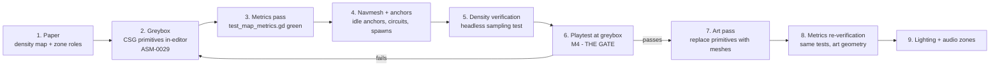

# GDD Part 5 — Level Design

> **Context restated.** Project Sottovoce is a 4–6 player social-stealth free-for-all. Players
> move on a speed ladder where anything above stroll (2.2 m/s) accrues **suspicion**; standing
> among ≥ 4 NPCs erases it. Being alone (no NPC within 6 m) accrues suspicion at +6/s; being on
> a roof accrues +18/s *for presence alone*. Kills happen at 2.5 m; the prey's counter-stun
> reaches 3.0 m. The map's job is to turn all of that into places worth standing.
>
> Implements: `SYS-MAP`, `SYS-SPAWN`. Constrains: `SYS-CROWD`, `SYS-BLEND`, `SYS-TRAVERSAL`.

---

## 1. Level-design pillars for social stealth

A social-stealth map is not a shooter map with civilians added. The design vocabulary is
different, and the differences are worth stating before any geometry exists.

### Pillar A — Density is the primary material

In a shooter, the designer places **cover**. Here the designer places **people**, and cover is
a secondary consideration. A wall protects you from being shot; it does nothing about being
recognised. Four NPCs standing together protect you from being recognised and nothing else.

**Consequence:** every zone's NPC density is chosen *first*, and the architecture is built to
justify and contain it. A market row exists because a crowd needs a reason to stand still; a
plaza is empty because the design needs a place where standing still is impossible.

### Pillar B — Every space must answer "why would a civilian be here?"

Because clones must be able to go everywhere a player can go while Anonymous
([`03_social_stealth.md`](03_social_stealth.md) §6.3), any space without a plausible civilian
reason to exist is a space where a player is automatically unique. Roofs are the deliberate
exception — and they carry `TUN-SUSPICION-GAIN-ROOF` +18/s precisely because no civilian is up
there.

**Consequence:** the map has no "player-only" ground-level areas. If a player can stand
somewhere at street or balcony level, an NPC must have a reason to stand there too.

### Pillar C — Sightlines are two-way and asymmetric in value

A long sightline lets you *watch*, which is the game's central skill. It also puts you in
someone's view. But the two are not symmetric: the watcher is stationary (suspicion decaying),
the watched is usually moving (suspicion accruing). **Long sightlines favour patience**, which
is the correct bias.

**Consequence:** the map is generous with sightlines and stingy with total concealment. There
are exactly five places on the map where a player is fully hidden, and each has a hard cost.

### Pillar D — Verticality is transit, not tenancy

The roof stratum is fast (`TUN-SPEED-CLIMB` 2.8 m/s, gap jumps, unobstructed routes) and
constantly expensive (+18/s → Noticed in 1.7 s). It exists to *cross*, never to *camp*.

**Consequence:** roofs are laid out as continuous routes with frequent descents. There are no
rooftop dead ends, no roof-only pickups, and every roof segment has a drop within 12 m of any
point on it.

### Pillar E — Legibility of the map itself

A player deciding whether to cross Piazza Secca must be able to see, at a glance, that it is
open, that there are no NPCs in it, and where the two flanking routes go. Map knowledge should
be acquirable by *looking*, not by dying.

**Consequence:** landmarks are tall, distinct and visible from most of the map. Zone boundaries
are architecturally obvious (an arcade edge, a canal, a level change), not subtle.

### Pillar F — Every chase must have an audience

Without a kill-cam ([`../00_meta/SCOPE_FENCE.md`](../00_meta/SCOPE_FENCE.md) OUT #11), watching
other people is the only way to learn from mistakes that are not your own.

**Consequence:** at least two **theatre spaces** — see §5.

---

## 2. `MAP-VETRAIO` — Rione Vetraio, the Glassmakers' Quarter

~120 × 120 m playable, three vertical strata, one district of the fictional city of Vessalia
(ASM-0001, ASM-0002).

### 2.1 Top-down schematic

Each character is approximately 3 × 3 m. North is up.

```
        0    15    30    45    60    75    90   105   120  (metres, X →)
   0  ┌────────────────────────────────────────────────────┐
      │███████████│▒▒▒▒▒▒▒▒▒▒▒▒▒▒▒▒▒▒▒▒▒▒▒▒▒▒▒▒▒│▓▓▓▓▓▓▓▓▓▓│
      │███ FORNACE│▒▒  P I A Z Z A   D E L    ▒▒│▓        ▓│
  15  │███  ROW   │▒▒        V E T R O        ▒▒│▓  CAMPA ▓│
      │███ ▪H1▪   │▒▒  ▪▪▪ stalls ▪▪▪ ▪▪▪ ▪▪▪ ▒▒│▓  NILE  ▓│
      │███████████│▒▒▒▒▒▒▒▒▒▒▒▒▒▒▒▒▒▒▒▒▒▒▒▒▒▒▒▒▒│▓  ▪S6▪  ▓│
  30  │───────────┼──────╥────────────╥─────────┼▓▓▓▓╥▓▓▓▓▓│
      │           │      ║            ║         │    ║     │
      │  ▪S1▪  ░░░│░░░░░░╨░░░░░░░░░░░░╨░░░░░░░░░│░░░░╨░░░░ │
  45  │  VIA    ░░│ L O G G I A   D E I   V E T R A I  ░░░░│
      │  DELLE  ░░│░░░░░░░░░░░░░░░░░░░░░░░░░░░░░│░░░░░░░░░░│
      │  LAMPE  ──┼─────────╥───────────────────┼──────────┤
  60  │  ▪H2▪     │         ║                   │   ▪S5▪   │
      │           │  ·····································│
      │ ┌─────────┤  ·  P I A Z Z A   S E C C A ·│  MERCATO │
  75  │ │  ▪S2▪   │  ·      (empty)    ▪fountain·│  PICCOLO │
      │ │         │  ·····································│
      │ │  VICOLO ├──────────╥────────────────────┼─────────┤
  90  │ │  STRETTO│          ║        ▪H3▪        │  ▪H4▪   │
      │ └─────────┤  ═══════ PONTE CORTO ════════ │   ▪S4▪  │
      │≈≈≈≈≈≈≈≈≈≈≈≈≈≈≈≈ C A N A L E ≈≈≈≈≈≈≈≈≈≈≈≈≈≈≈≈≈≈≈≈≈≈≈│
 105  │▪S3▪ ████████ F O N D A C O ████████ ▪H5▪ ██████████│
      │     ████████  (warehouse row) ████████████████████│
 120  └────────────────────────────────────────────────────┘

LEGEND
  ███  Furnace / warehouse blocks (solid, climbable façades)
  ▒▒▒  Piazza del Vetro — dense market, 7–11 NPCs / 6 m
  ░░░  Loggia dei Vetrai — covered arcade, 4–7 NPCs / 6 m
  ···  Piazza Secca — the empty plaza, 0–1 NPCs / 6 m
  ≈≈≈  Canale — impassable water, 4 m wide
  ═══  Ponte Corto — the only street-level canal crossing, 2.4 m wide
  ▓▓▓  Campanile block — bell tower, the third stratum
  ║ ╥ ╨  Alley mouths and arcade openings (2.2–2.8 m)
  ▪Hn▪  Hiding spot (concealment prop), n = 1..5
  ▪Sn▪  Spawn point, n = 1..6
```

### 2.2 Vertical section (looking east, cut through X = 60 m)

```
  Z
  │
24├──                                    ┌───────┐
  │                                      │CAMPANI│  ◄── STRATUM 3: BELL-TOWER
20├──                                    │  LE   │      (one location only)
  │                                      │ ▪S6▪  │
16├──                                    │       │
  │        ┌────────┐                    │       │
12├──  ┌───┤ ROOF   ├────┐  ┌────────┐   │       │  ◄── STRATUM 2b: ROOFTOP
  │    │   └────────┘    │  │ ROOF   │   │       │      +18/s suspicion, transit only
 8├──  │  ╔═ BALCONY ═╗  │  └────────┘   │       │  ◄── STRATUM 2a: BALCONY
  │    │  ║           ║  │  ╔════════╗   │       │      0 NPCs, no roof penalty
 4├──  │  ║           ║  │  ║        ║   │       │
  │    │  ║           ║  │  ║        ║   │       │
 0├────┴──╨───────────╨──┴──╨────────╨───┴───────┴──  ◄── STRATUM 1: STREET
  │    ▲                ▲                  ▲            the crowd lives here
  │  loggia          piazza             campanile
  └──────────────────────────────────────────────────► Y (north → south)

  Climb heights:  street → balcony  4.5 m   (TUN-TRAVERSE-CLIMB-MAX-HEIGHT 9 m: one climb)
                  balcony → roof    4.0 m   (one climb)
                  street → roof     8.5 m   (one climb, at the limit — deliberate)
  Drop heights:   roof → balcony    4.0 m   (at TUN-TRAVERSE-DROP-SAFE-HEIGHT: no stagger)
                  balcony → street  4.5 m   (0.5 m over safe: 0.8 s stagger — see §4.3)
```

**The 4.5 m balcony drop is a deliberate 0.5 m over `TUN-TRAVERSE-DROP-SAFE-HEIGHT`.**
Descending from the balcony to the street costs `TUN-TRAVERSE-DROP-STAGGER` 0.8 s of
helplessness unless the player uses a drop-swing off the balcony rail. This makes coming down
into the crowd a *small skill check* rather than a free action, and it means a panicking player
who leaps off a balcony lands stunned-ish in front of everyone. Roof → balcony is exactly at
the safe threshold, so the *upper* transitions are free and only the final descent costs — you
can flee across the roofs cheaply, but you cannot rejoin the crowd cheaply.

### 2.3 Named landmarks

| ID | Name | Stratum | Role |
|---|---|---|---|
| `LOC-PIAZZAVETRO` | Piazza del Vetro | Street | The dense heart. 7–11 NPCs/6 m. Where standoffs happen and where patient players live. |
| `LOC-LOGGIA` | Loggia dei Vetrai | Street (covered) | 60 m east–west covered arcade. 4–7 NPCs/6 m. Long sightlines under cover — the best watching position at street level. |
| `LOC-PIAZZASECCA` | Piazza Secca | Street | The empty plaza. 22 × 18 m, 0–1 NPCs. A designed danger zone and the map's best theatre space. |
| `LOC-FORNACE` | Fornace Row | Street | West-edge glass furnaces. Heat shimmer, strong light, climbable façades. Visually loud — a poor place to be watched, a good place to watch from. |
| `LOC-FONDACO` | Fondaco | Street | South warehouse row across the canal. Low density (3–6), long straight streets. Where fleeing players go. |
| `LOC-MERCATOPICCOLO` | Mercato Piccolo | Street | East-side secondary market. 5–8 NPCs/6 m. The second-safest ground; exists so the map has two poles rather than one. |
| `LOC-CAMPANILE` | Campanile | Bell-tower | The single third-stratum location. See §2.6. |
| `LOC-PONTECORTO` | Ponte Corto | Street | The only street-level canal crossing. 2.4 m wide. |
| `LOC-VIALAMPE` | Via delle Lampe | Street | West main street, north–south. |
| `LOC-VICOLOSTRETTO` | Vicolo Stretto | Street | The narrow alley network in the southwest. |

### 2.4 The five hiding spots (concealment props)

`TUN-BLEND-PROP-CAPACITY` = 1 each. Full concealment, zero vision.

| ID | Location | Type | Deliberate weakness |
|---|---|---|---|
| `H1` | Fornace Row, north end | Cooling well | Adjacent to the map's loudest visual area; anyone watching the furnaces sees you approach. |
| `H2` | Via delle Lampe, mid | Hay cart | On the main north–south street. High traffic — likely to be observed entering. |
| `H3` | Piazza Secca, south edge | Dry fountain basin | **Inside the danger zone.** Reaching it costs suspicion; leaving it costs suspicion. The riskiest refuge on the map. |
| `H4` | Mercato Piccolo, east | Stall wardrobe | The safest of the five. Balanced by being the furthest from any spawn (§2.7) — you have to survive the walk. |
| `H5` | Fondaco, south | Crate stack | Across the canal, so reaching it commits you to the Ponte Corto or a long detour. |

**The design rule for hiding spots:** every one has a *specific* weakness, and the weakness is
positional rather than mechanical. The prop is always perfect; the walk to it never is. This
keeps the five spots strategically distinct without needing five different mechanics.

### 2.5 The four blend-group circuits

`TUN-CROWD-GROUP-COUNT` = 4, each `TUN-CROWD-GROUP-SIZE` = 4 NPCs, period 55–75 s
(§5.2 rules in [`03_social_stealth.md`](03_social_stealth.md)).

| ID | Route | Period | Density zones crossed | Passes near spawn | Crosses a theatre space |
|---|---|---|---|---|---|
| `CIRC-A` | Piazza del Vetro → Loggia (west half) → Via delle Lampe → back | 58 s | Dense → medium → medium | S1 | No |
| `CIRC-B` | Loggia (full length, east–west) → Mercato Piccolo → Loggia | 71 s | Medium → dense → medium | S5 | **Yes** — the Loggia overlook |
| `CIRC-C` | Mercato Piccolo → east street → Ponte Corto → Fondaco → back | 74 s | Dense → low → low | S4 | **Yes** — the bridge |
| `CIRC-D` | Piazza del Vetro → Fornace Row → Vicolo Stretto → Via delle Lampe → back | 66 s | Dense → medium → low → medium | S2 | No |

**No circuit enters Piazza Secca.** The empty plaza stays empty; that is its entire function.

> **AND ALL FOUR ROUTES RUN THROUGH SOLID GEOMETRY (2026-08-20).** Sampled every half metre along
> the interpolated route, not at the waypoints: **CIRC-A 15.8 %, CIRC-B 15.4 %, CIRC-C 28.0 %,
> CIRC-D 19.8 %** of each route is inside a building mass or over no floor. Five waypoints are
> inside blocks outright — CIRC-D's `(28, 12)` and `(14, 20)` in Fornace Row, CIRC-B's `(98, 60)`
> and CIRC-C's `(106, 60)` and `(112, 60)` in the Mercato north wall — and CIRC-C's `(60, 91)` is
> over nothing.
>
> **CrowdFormations drives members straight at a slot with no path query**, by design (US-0043),
> so a member whose slot is inside masonry presses into the wall and stays there. That is what the
> owner reported as NPCs trembling and stuck; the bodies were measured against Fornace Row's east
> wall at the z of CIRC-D's own waypoint.
>
> **The waypoints are not the route.** CIRC-A has no bad waypoint and 15.8 % of a bad route,
> because `CrowdCircuit` interpolates and a segment that clips a corner puts a slot inside masonry
> with both endpoints clear. These routes were authored as prose in this section and transcribed
> into `VetraioLayout.CIRCUITS` without ever being checked against the geometry.
> `test_circuit_separation.gd` carries it.

> **BLOCKER, 2026-08-20: PIAZZA DEL VETRO CANNOT BE WALKED TO.** `CIRC-A` and `CIRC-D` both
> begin in the piazza, and there is **no floor at all** between it (z 0–30) and the Loggia
> (z 36–54) for x 30–90 — a 60 × 6 m void, 90 of 90 sampled points with nothing under them.
> `VetraioLayout.FLOORS` has no rectangle covering that strip; `ViaDelleLampe` (x 0–30) and
> `EastStreet` (x 90–120) pass either side of it and touch the piazza only at a corner, which
> does not connect navmesh polygons.
>
> Measured: `PiazzaDelVetro reaches 0 of 8` other street floors, every other street reaches
> every other, and **24 of 67 idle anchors are unreachable**. So two of the four processions
> are routed along a path that cannot exist, and the district's densest zone — §3's "dense
> heart", 7–11 NPCs/6 m — holds a crowd that can never mix with the rest of the map.
>
> **This is level data disagreeing with this document, not a bake problem.** The fix is a floor
> and it is a design decision: how the piazza opens onto the Loggia changes sightlines, the
> anti-camp spread and every circuit length. Reported rather than re-authored.
> `test_navmesh_coverage.gd::test_the_district_is_one_connected_island` carries it and goes
> green by itself once the floor exists.


**No two circuits are within 8 m simultaneously.** Verified by a headless test that samples
both circuits' positions at 0.5 s intervals over the least common multiple of their periods.
Two adjacent groups would form a super-pocket and a trivially safe travelling corridor.

### 2.6 The Campanile

The map's single third-stratum location, and a deliberate special case.

| Property | Value | Reason |
|---|---|---|
| Height | 22 m | Sees the whole district. |
| Access | One internal stair (single file, 1.8 m) + one exterior climb (8.5 m from the balcony) | Two entrances, both slow, both visible. |
| NPCs | **Zero** | So `TUN-SUSPICION-GAIN-OPEN` (+6/s) applies continuously. |
| Roof-stratum penalty | **Applies** (+18/s) | Combined: **+24/s → Noticed in 1.25 s, Exposed in 2.9 s.** |
| Sightlines | Every zone except inside the Loggia and inside the Fondaco | |
| Escape | One drop to the roof stratum (4 m, safe); the stair | |

**The Campanile is a trap that looks like a prize.** It grants the best information in the game
and charges the highest suspicion rate in the game for it. A player who climbs it is Exposed
within three seconds and stays Exposed — visible through walls to their hunter, at up to 60 m,
from the most conspicuous point on the map.

Its correct use is a **five-second look**: climb, scan, drop, and let it decay on the way down.
Its incorrect use — camping — is answered by `ABIL-WHISPERBOLT` (12 m range reaches the
campanile from the adjacent roof) and by the fact that everyone can see you.

This is the clearest single expression of Law 1 in the level design: *the best view in the
district costs the most anonymity.*

### 2.7 Spawn points and the anti-spawn-camp check

`TUN-SPAWN-POINT-COUNT` = 6 — one per player at maximum lobby size, so a full simultaneous
respawn is always satisfiable.

| ID | Location | Stratum | Nearest circuit | Distance to nearest other spawn |
|---|---|---|---|---|
| `S1` | Via delle Lampe, north | Street | `CIRC-A` (7 m) | 38 m (S2) |
| `S2` | Vicolo Stretto, north end | Street | `CIRC-D` (11 m) | 38 m (S1) |
| `S3` | Fondaco, west | Street | — (25 m) | 41 m (S2) |
| `S4` | Fondaco, east | Street | `CIRC-C` (9 m) | 34 m (S5) |
| `S5` | Mercato Piccolo, north | Street | `CIRC-B` (6 m) | 34 m (S4) |
| `S6` | Campanile base | Street | — (19 m) | 44 m (S5) |

> **THREE OF THE SIX STOOD OVER NOTHING UNTIL 2026-08-13.** `VetraioLayout.SPAWNS` had S3 and
> S4 at z 106 — past the northern edge of `FondacoStreet`, which ends at z 99 — and S6 at
> (104, 26), outside every floor rectangle in the district. A pawn placed at any of them falls.
> Nobody had hit it because `LocalPawnDriver.spawn_index` is 0 and spawn *selection* is US-0062,
> so only S1 has ever been used. The table above was right and the data was wrong; the data now
> agrees with it. **Rule 1 below is satisfied and arithmetic (closest pair 30.9 m); rules 4 and 6
> were NOT re-derived after the move and are owed a level pass.**
>
> **THAT PASS IS RUN AS OF US-0096's FOLLOW-UP, AND ONE OF THE TWO WAS FALSE.**
> `test_spawn_points.gd` measures both against `MapData` on every run.
>
> **Rule 4 holds** — every spawn is within 25 m of a circuit *segment*, worst 22.50 m at S3. It
> is measured against segments rather than waypoints on purpose: §4.4 spaces waypoints 6–10 m
> apart, so "near a corner" and "near the route" can differ by half a spacing.
>
> **Rule 6 does not.** Every pair is already further apart than 25 m — the closest is 30.86 m —
> so the rule can only mean every pair must be **occluded**, and **nine of fifteen are not**. The
> worst is `S4 → S5` at **30.86 m**, the closest pair on the map and the one the anti-spawn-camp
> table below leans on hardest.
>
> **THE CAUSE IS NOT WHERE THE SPAWNS ARE.** `VetraioLayout.BLOCKS` holds **seven** masses, four
> of them corner blocks, and the district's whole middle — Piazza del Vetro, the Loggia and
> Piazza Secca — has no building mass between them. No spawn position can occlude a 120 m open
> span, so **the anti-spawn-camp analysis below is asserted against geometry the greybox does not
> have yet.** Reported rather than patched: authoring interior massing is a level pass with an
> owner, and it is the same class of finding as §5.2's 0.51 m circuits.

**Spawn placement rules:**

| # | Rule | Value | Reason |
|---|---|---|---|
| 1 | Minimum spawn-to-spawn distance | 30 m | Two players respawning simultaneously must not land in each other's kill range. |
| 2 | Minimum distance to the killer | `TUN-RESPAWN-MIN-DIST-FROM-KILLER` 40 m | One third of the map diagonal. |
| 3 | Minimum distance to *any* living player | `TUN-RESPAWN-MIN-DIST-FROM-ANY-PLAYER` 12 m | Never spawn inside anyone's kill range. |
| 4 | Every spawn is within 25 m of a blend-group circuit | ✅ **measured, worst 22.50 m (S3)** | A freshly-respawned player must have a safe travel option quickly. |
| 5 | No spawn is in Piazza Secca or above street level | ✅ | You never begin a life already accruing suspicion. |
| 6 | No spawn has a sightline longer than 25 m to another spawn | ❌ **measured: 9 of 15 pairs are in clear sight** | Prevents a camper covering two spawns at once. |
| 7 | Fallback when constraints are unsatisfiable | Choose the farthest available point | **A spawn system that can fail is a crash waiting for a playtest.** |

**The anti-spawn-camp analysis.** With 6 spawns, 6 players and constraint 2 at 40 m, a killer
standing at any point covers at most **two** spawn points within 40 m. Worked from the table:

| Camper position | Spawns within 40 m | Spawns excluded by rule 2 | Remaining valid spawns |
|---|---|---|---|
| Piazza del Vetro (centre-north) | S1, S5, S6 | 3 | **3** |
| Piazza Secca (centre) | S1, S2, S5 | 3 | **3** |
| Fondaco (south) | S3, S4 | 2 | **4** |
| Campanile base | S5, S6 | 2 | **4** |

**Worst case: three valid spawns remain**, all at least 40 m from the camper, and the camper
does not know which one was used. Combined with `TUN-RESPAWN-INVULN` (1.0 s) and the fact that
camping means standing still in one place while your own pursuer hunts you, spawn camping is
not viable. It is audited again as a degenerate strategy in
[`07_balance.md`](07_balance.md) §5.

### 2.8 Sightline analysis

The map's long sightlines, and what each is for:

| Sightline | Length | From → To | Function |
|---|---|---|---|
| Loggia, full length | 60 m | East end ↔ west end | The best street-level watching position. Covered (no roof penalty), NPC-dense (no open penalty), and it sees the whole arcade. **The single most valuable standing spot on the map**, and correspondingly contested. |
| Piazza Secca, diagonal | 28 m | Any corner ↔ opposite | The theatre. Anyone crossing is visible from four approaches and the Loggia. |
| Via delle Lampe | 45 m | North ↔ south | The main artery. Long, straight, medium density — safe to walk, impossible to hide in. |
| Ponte Corto approach | 22 m | Either bank | Both approaches to the only bridge are visible from the other side. Crossing is always a decision. |
| Campanile → everything | up to 95 m | Tower ↔ most zones | Best information in the game, highest suspicion cost. |
| Fondaco streets | 35 m | East ↔ west | Long, low-density, few NPCs. Where chases go to be resolved. |

**Deliberately short sightlines** (all under 12 m): Vicolo Stretto's alley network, the market
row interiors, the Fornace Row gaps. These are where a player breaks a lock.

---

## 3. Density map

Target NPC count within a 6 m radius — the radius that matters, because it is
`TUN-SUSPICION-OPEN-RADIUS`.

| Zone | Target | Blend pocket valid? | Open-ground gain? | Tactical role |
|---|---|---|---|---|
| Piazza del Vetro | **7–11** | ✅ reliably | No | The safe heart. Standoffs. |
| Mercato Piccolo | **5–8** | ✅ usually | No | The second pole. |
| Loggia dei Vetrai | **4–7** | ✅ at the dense end | No | Watching under cover. |
| Via delle Lampe | **3–6** | ❌ usually | No | Travel. Safe to move, not to stop. |
| Fondaco | **3–5** | ❌ | Intermittently | Chase resolution. |
| Fornace Row | **2–4** | ❌ | Intermittently | Watching from the edge. |
| Vicolo Stretto | **1–3** | ❌ | Often | Fast, quiet, risky. Where kills happen. |
| Ponte Corto | **0–2** | ❌ | Usually | A committed crossing. |
| **Piazza Secca** | **0–1** | ❌ never | **Always** | The danger zone. |
| Balcony stratum | **0** | ❌ | Always (+6/s) | Elevated, not roofed — the middle option. |
| Roof stratum | **0** | ❌ | Always (+6/s **and** +18/s = **+24/s**) | Transit only. |
| Campanile | **0** | ❌ | +24/s | The five-second look. |

**The density gradient is the map's difficulty curve.** A new player naturally stays in the
Piazza del Vetro, where they are safe and where the game is slowest. A player who wants kills
must move toward the low-density zones, where kills happen and where they are visible. The map
teaches the risk/reward trade by geography.

---

## 4. Metrics bible

Every dimension on the map is drawn from this table. The purpose is that **a player never has
to guess whether geometry is traversable** — guessing costs attention, and attention is the
resource the game is actually about ([`02_player_controller.md`](02_player_controller.md) §7.4).

### 4.1 Traversal metrics

| Element | Build at | Resolves as | **Never build at** |
|---|---|---|---|
| Vaultable wall / stall counter | **0.9 m** | Vault (free, 0.55 s) | 1.05–1.15 m — the vault/mantle boundary |
| Mantle ledge | **1.8 m** | Mantle (0.95 s) | 2.25–2.35 m — the mantle/climb boundary |
| Balcony rail | **1.0 m** above balcony floor | Vault | — |
| Climbable façade | **3.5 m** (street→balcony), **5.0 m** (balcony→roof), **8.5 m** (street→roof) | Climb | 8.9–9.1 m — the climb-height limit |
| Easy roof gap | **2.0 m** | Comfortable jump | — |
| Committed roof gap | **2.8 m** | Jump that must be intended | 3.0–3.4 m — the jump/no-jump boundary |
| Impossible gap | **3.6 m** | Visibly impossible | — |
| Safe drop | **4.0 m** | No stagger | 3.9–4.1 m — the stagger boundary |
| Costly drop | **4.5 m** | 0.8 s stagger | — |

> **Corrected 2026-08-05.** This row previously read 4.5 m (street→balcony) and 4.0 m
> (balcony→roof). A 4.0 m façade is also a 4.0 m *drop* coming down, and 3.9–4.1 m is this
> table's own stagger boundary — so the stagger would fire or not by sub-centimetre position,
> which is precisely what the bands exist to prevent. Moving the balcony to 3.5 m makes both
> drops unambiguous (3.5 m clearly safe, 5.0 m clearly staggering) and leaves street→roof at
> 8.5 m, still clear of the 8.9–9.1 m climb band.
>
> The **balcony rail** was corrected the same day and for the same reason: it read 1.1 m, which
> is inside this table's 1.05–1.15 m vault/mantle band, while the row itself says a rail must
> resolve as a *vault*. Now 1.0 m — the smallest change that clears the band and keeps a rail
> visibly taller than a 0.9 m stall counter. Both found by `test_map_metrics.gd`, which is the
> point of having it.

**The boundary bands are the important column.** Geometry built in a boundary band produces
traversal that resolves differently depending on sub-centimetre position, which reads as the
game being broken. `test_map_metrics.gd` scans committed map geometry for any traversable
surface inside a boundary band and fails the build.

### 4.2 Circulation metrics

| Element | Value | Reason |
|---|---|---|
| **Alley mouth width** | 2.2–2.8 m | Fits one `ABIL-CINDERFALL` cloud (5 m radius) with overlap — the canonical escape geometry. |
| **Alley width** | 2.6 m minimum | Wide enough for the camera-fairness rule ([`02_player_controller.md`](02_player_controller.md) §4.4.2) to be satisfiable. **Open question 5 in Part 2 flagged this**; 2.6 m is the resolution. |
| **Arcade span** | 3.5–4.5 m | Two people pass without contact; a blend-walking player and their hunter can share it. |
| **Main street width** | 6–8 m | Wide enough to hold a walking group plus passers-by, so travel density holds. |
| **Stair run width** | 1.8 m | Single file. Committing to a stair commits you to a direction. |
| **Stair angle** | 30° | Climbable at walk speed with no traversal input, so stairs never read as parkour. |
| **Bridge width** (Ponte Corto) | 2.4 m | Narrow enough to be a genuine decision. |
| **Doorway width** | 1.4 m | Single file; no NPC pathing conflicts. |
| **Doorway height** | 2.2 m | Above the tallest persona (Lucerna at ~1.9 m with headwear). |
| **Maximum dead-end length** | **8.0 m** | A player committing to a dead end must see its end from its mouth. Longer dead ends produce deaths that feel like map bugs. Asserted by `test_map_dead_ends.gd`. |
| **Minimum ceiling** (Loggia) | 3.2 m | Camera arm (2.6 m) plus pivot height (1.55 m) needs headroom without constant occlusion pull-in. |

### 4.3 The standard crowd-pocket module

The repeatable unit of safety. Four instances exist on `MAP-VETRAIO`, plus incidental pockets
that form wherever ≥ 4 NPCs cluster.

```
              ← 8.0 m →
        ┌───────────────────┐
        │  ▪     ▪     ▪    │   ▪ = NPC idle anchor (6 anchors)
   8.0 m│      ╔═════╗      │   ╔═╗ = the 3.5 m blend radius
        │  ▪   ║  ◉  ║   ▪  │   ◉ = the standing position
        │      ╚═════╝      │
        │         ▪         │   Anchors are placed so that any point
        └───────────────────┘   inside the blend radius has >= 4 NPCs
              stall row           within TUN-BLEND-POCKET-RADIUS 3.5 m
```

| Property | Value | Reason |
|---|---|---|
| Module footprint | 8.0 × 8.0 m | |
| Idle anchors | 6 | Two more than `TUN-BLEND-POCKET-MIN-NPC` (4), so the pocket survives losing two NPCs to a Gawk (`TUN-CROWD-GAWK-MAX` 6, but capped so it cannot take them all) or a partial Startle. |
| Anchor spacing | 2.4–3.2 m | Close enough that a 3.5 m radius reaches four of them from any interior point; far enough that NPCs do not visually merge. |
| Sightlines into the module | ≥ 2, ≤ 4 | Fewer than two makes it un-watchable (a free hiding spot); more than four makes it un-standable. |
| Adjacency to a circuit | Within 12 m | So a player can transfer between mobile and static cover. |
| Escape routes | ≥ 2, at least one to a different density zone | A pocket with one exit is a trap, and a trap is not cover. |

**Why six anchors and not four:** a pocket that drops below four NPCs *silently stops working*
— the player believes they are blended and is not. Two anchors of margin is the cheapest
insurance against the most dangerous silent failure in the game.

### 4.4 NPC circulation metrics

| Element | Value | Reason |
|---|---|---|
| Navmesh agent radius | 0.4 m | |
| Minimum navigable width | 1.4 m | Matches doorway width; NPCs must reach everywhere players can go at street level (Pillar B). |
| Idle anchor density, dense zones | 1 per 12 m² | Produces 7–11 NPCs within 6 m. |
| Idle anchor density, medium zones | 1 per 30 m² | Produces 4–7. |
| Idle anchor density, low zones | 1 per 70 m² | Produces 1–3. |
| Circuit waypoint spacing | 6–10 m | Close enough for smooth formation, sparse enough to author. |
| Off-navmesh area | Roofs, balconies, canal | Roofs and balconies are deliberately unreachable by NPCs — that is why they cost suspicion. |

---

## 5. The chase-theatre principle

> **Every map needs spaces where a chase between two players is visible to an uninvolved
> third.**

### 5.1 Why

Without a kill-cam, a player learns from three sources: their own score feed, their own
deaths, and **watching other people**. The third is the only one that costs nothing and
teaches at scale. A player who watches a Cantatrice sprint across Piazza Secca, go Exposed, get
stunned and lose twelve seconds has learned Law 1 for free.

Theatre spaces are also where the match's *stories* come from. A social game needs shared
events, and a shared event requires witnesses.

### 5.2 What makes a space a theatre

| Requirement | Reason |
|---|---|
| **A stage**: an open area ≥ 15 m across with unbroken sightlines | The chase must be followable, not glimpsed. |
| **≥ 3 viewing positions** at different angles, each ≥ 15 m from the stage | Far enough that watching is safe. |
| **At least one viewing position is NPC-dense** | So a spectator can watch while blended, at zero suspicion. A theatre you must pay to watch is a theatre nobody watches. |
| **The stage is a natural route**, not a detour | Chases must happen there without being herded. |
| **The stage is visible from at least one elevated position** | The best view is the most expensive one. |

### 5.3 The two theatre spaces on `MAP-VETRAIO`

#### Theatre 1 — **Piazza Secca**

| | |
|---|---|
| Stage | 22 × 18 m, completely open, no cover, no NPCs |
| Viewing positions | (a) Loggia east opening, 19 m, **NPC-dense 4–7** ✅; (b) Via delle Lampe mouth, 17 m, medium density; (c) Vicolo Stretto mouth, 16 m, low density; (d) the balcony above the Loggia, 21 m and 4.5 m up |
| Why chases happen here | It is the shortest route between the north market and the south crossing. Going around costs 18–24 s. |
| What a spectator learns | Speed costs anonymity, visibly and immediately: anyone crossing at pace goes Noticed within 5 s and Exposed within 12 s, in full view. |

**Piazza Secca is doing three jobs at once** — danger zone, theatre, and route decision — and
that overlap is why it is the best-designed space on the map. Its emptiness is not the absence
of content; it *is* the content.

#### Theatre 2 — **Ponte Corto and its approaches**

| | |
|---|---|
| Stage | The 2.4 m bridge plus 22 m of approach on each bank |
| Viewing positions | (a) Mercato Piccolo edge, 20 m, **NPC-dense 5–8** ✅; (b) Fondaco north face, 18 m; (c) the Loggia's south end, 26 m; (d) the roof of the Fondaco, 24 m and 8 m up |
| Why chases happen here | It is the *only* street-level canal crossing. Every north–south chase resolves at it. |
| What a spectator learns | Commitment and chokepoints: a player who enters the bridge cannot change their mind, and `ABIL-CINDERFALL` at the bridge mouth is the clearest possible demonstration of what that ability is for. |

### 5.4 The theatre checklist for future maps

- [ ] At least two theatre spaces.
- [ ] Each has ≥ 3 viewing positions at ≥ 15 m.
- [ ] At least one viewing position per theatre is NPC-dense enough for a valid blend pocket.
- [ ] Each stage sits on a route that is 15+ seconds faster than going around.
- [ ] Each stage is visible from at least one elevated position.
- [ ] The two theatres are at least 40 m apart, so a single spectator cannot cover both.

---

## 6. Player-count scaling — the 4-player soft bound

At 4 players, the full 120 × 120 m district produces too few encounters. The map soft-bounds to
the **inner 90 × 90 m** (ASM-0006, `TUNABLES` §16).

| Aspect | Implementation |
|---|---|
| Excluded region | The Fondaco (south of the canal) and the western half of Fornace Row. |
| How it is bounded | **Softly.** NPC circuits do not enter; spawns S3 and S4 are disabled; and a player who crosses the boundary accrues an additional +8/s suspicion ("you have left the district"), with a HUD message. **No invisible wall.** |
| Why soft | A hard wall in a game about a living city is a lie the player can walk into. A suspicion penalty is the same mechanic the whole game already uses, applied to a new condition, and it is legible without explanation. |
| Compass scaling | `TUN-COMPASS-RANGE-MAX` drops from 60 m to 50 m, so signal density per playable area is constant. |
| Crowd scaling | `TUN-CROWD-COUNT` 78 → 66, redistributed into the smaller area, so density per zone is unchanged. |
| Theatre spaces | Both remain inside the bound (Piazza Secca fully; Ponte Corto's north approach only — the bridge becomes the boundary). |

**Open concern:** at 4 players the Ponte Corto theatre is half-usable, since the south bank is
out of bounds. This is noted in §10 and may require a third theatre space inside the inner
bound.

---

## 7. Blockout-to-art pipeline

### 7.1 Stages



### 7.2 The gate at stage 6

**No art work begins until the greybox map has been playtested and the loop is fun on it.**
This is the single most important rule in the pipeline. Art is the most expensive and least
reversible work in the project, and a map's quality in this game is entirely a function of
density, sightlines and metrics — none of which art changes.

### 7.3 Rules that survive the art pass

Art may change how a space *looks*. It may not change:

| Invariant | Verified by |
|---|---|
| Every traversable surface height | `test_map_metrics.gd` re-run on art geometry |
| Every navmesh boundary | Navmesh diff against the greybox bake |
| Every idle anchor position | Anchor positions are data, not geometry — art cannot move them |
| Every circuit waypoint | Same |
| Every sightline in §2.8, ± 2 m | `test_map_sightlines.gd` raycasts the named pairs |
| Dead-end lengths | `test_map_dead_ends.gd` |
| Alley widths ≥ 2.6 m | `test_map_widths.gd` |

**Decorative geometry may not create new cover.** A crate placed for visual interest that
happens to break a 60 m Loggia sightline has changed the map's balance. All art props are
either (a) inside the navmesh-excluded volume, (b) below 0.9 m (vaultable, and therefore not
cover), or (c) explicitly signed off as a metrics change with a re-run of the tests.

### 7.4 Greybox material set

| Material | Colour role | Applied to |
|---|---|---|
| `MAT-GREY-FLOOR` | Neutral mid-grey | All walkable street surface |
| `MAT-GREY-WALL` | Lighter grey | Non-climbable walls |
| `MAT-CLIMB` | **Desaturated blue** | Every climbable façade — the one greybox colour that carries information |
| `MAT-VAULT` | **Desaturated yellow** | Every 0.9 m vaultable surface |
| `MAT-BLEND` | **Desaturated green** | Blend props and pocket floor markers |
| `MAT-VOID` | Magenta | Out of bounds / error. Must never appear in a playtest build. |

Note that the greybox colour language uses *desaturated* versions of hues, deliberately
avoiding the saturated identity hues reserved by the colour-language law
([`../30_bible/ART_BIBLE.md`](../30_bible/ART_BIBLE.md) §3) for persona identity, suspicion
tint and ability tells.

---

## 8. Repeatable checklist for authoring a future map

Run in order. Each stage gates the next.

### Stage 1 — Density plan (paper)

- [ ] Zone map drawn with a target NPC-within-6 m band per zone.
- [ ] At least two dense zones (≥ 5 NPCs/6 m) at opposite ends of the map.
- [ ] Exactly one empty zone (0–1 NPCs) sized 300–450 m².
- [ ] Every zone has a stated tactical role in one sentence.
- [ ] Every space passes Pillar B: a civilian has a reason to be there.

### Stage 2 — Circulation

- [ ] 4 blend-group circuits planned, periods 55–75 s, no two within 8 m simultaneously.
- [ ] No circuit enters the empty zone.
- [ ] Every circuit crosses ≥ 2 density zones.
- [ ] ≥ 1 circuit crosses a theatre space.
- [ ] Exactly one, or at most two, chokepoints connect the map's halves.

### Stage 3 — Metrics

- [ ] Every traversable height drawn from §4.1's build-at column.
- [ ] No geometry in a boundary band.
- [ ] All alleys ≥ 2.6 m; all arcades 3.5–4.5 m; all main streets 6–8 m.
- [ ] No dead end > 8 m.
- [ ] 4 crowd-pocket modules placed per §4.3, each with ≥ 2 exits.

### Stage 4 — Verticality

- [ ] Three strata present.
- [ ] Every roof segment has a drop within 12 m.
- [ ] No rooftop dead ends.
- [ ] Street→roof climbs at 8.5 m (not 9.0 — leave margin below the limit).
- [ ] Balcony→street drop at 4.5 m so descent into the crowd costs a stagger.
- [ ] At most one bell-tower-class vantage.

### Stage 5 — Spawns

- [ ] 6 spawn points, all at street level, none in the empty zone.
- [ ] Minimum spawn-to-spawn 30 m.
- [ ] Every spawn within 25 m of a circuit.
- [ ] No spawn has a > 25 m sightline to another spawn.
- [ ] Anti-camp analysis run (§2.7): from any single position, ≥ 3 spawns remain valid.

### Stage 6 — Theatre

- [ ] ≥ 2 theatre spaces meeting the §5.4 checklist.
- [ ] The two are ≥ 40 m apart.

### Stage 7 — Verification

- [ ] `test_map_metrics.gd` green.
- [ ] `test_map_dead_ends.gd` green.
- [ ] `test_map_widths.gd` green.
- [ ] `test_map_sightlines.gd` green with the map's named sightline pairs.
- [ ] `test_map_density.gd` green: every zone samples inside its band at ≥ 5 points.
- [ ] `test_circuit_separation.gd` green.
- [ ] Navmesh reaches every street-level area a player can reach.

### Stage 8 — Playtest gate

- [ ] Greybox playtested with ≥ 4 humans.
- [ ] Mean player speed drops measurably between minute 1 and minute 4 (the "turn").
- [ ] At least one chase observed by a non-participant.
- [ ] No player reports being unable to find their contract for > 60 s.
- [ ] **Only then does art begin.**

---

## 9. Acceptance criteria

- [ ] `MAP-VETRAIO` is 120 × 120 m playable with the three strata in §2.2.
- [ ] All ten landmarks in §2.3 exist and are named in the string table.
- [ ] All five hiding spots exist, each `TUN-BLEND-PROP-CAPACITY` = 1.
- [ ] All four circuits exist with the periods in §2.5, verified by `test_circuit_separation.gd`.
- [ ] No circuit enters Piazza Secca.
- [ ] All six spawns exist and satisfy rules 1–7 in §2.7.
- [ ] The anti-camp analysis holds: from any position, ≥ 3 spawns remain valid under `TUN-RESPAWN-MIN-DIST-FROM-KILLER`.
- [ ] Every zone samples inside its §3 density band at ≥ 5 points.
- [ ] Piazza Secca samples 0–1 NPCs within 6 m at every point.
- [ ] No traversable geometry sits in a §4.1 boundary band.
- [ ] No dead end exceeds 8.0 m.
- [ ] Every alley is ≥ 2.6 m wide.
- [ ] Four crowd-pocket modules exist per §4.3, each with 6 anchors and ≥ 2 exits.
- [ ] Every roof point has a drop within 12 m; no rooftop dead ends.
- [ ] The Campanile applies both `TUN-SUSPICION-GAIN-ROOF` and `TUN-SUSPICION-GAIN-OPEN` (+24/s total).
- [ ] Both theatre spaces satisfy the §5.4 checklist.
- [ ] The 4-player soft bound applies a suspicion penalty rather than a collision wall.
- [ ] Art-pass invariants (§7.3) are all covered by an automated test that runs on both greybox and art geometry.

---

## 10. Failure modes

| # | Failure | Symptom | Root cause to check |
|---|---|---|---|
| 1 | **The dense zone is the whole game.** | Players never leave Piazza del Vetro; matches stall. | Not enough reason to leave. Check that the Compass reliably pulls players out — if contracts are usually in the same zone, the spawn/contract interaction is clustering people. |
| 2 | **The empty plaza is simply avoided.** | Piazza Secca sees no traffic; the theatre never fires. | The detour around it is too cheap. It must cost 15–24 s to go around; measure the actual routes. |
| 3 | **Roofs are camped anyway.** | Players sit on the roof stratum despite +24/s. | Either the Exposed outline is not reaching them (range/occlusion bug) or Whisperbolt is not being taken. Check `TEL-TIME-BY-STRATUM`. |
| 4 | **Traversal is ambiguous.** | Players report "I don't know if I can climb that". | Geometry in a boundary band, or the greybox material language was lost in the art pass. |
| 5 | **A crowd pocket silently fails.** | A player is killed while believing they were blended. | Pocket dropped below 4 NPCs — Gawk cap not enforced, Startle scattered it, or anchors are too far apart for the 3.5 m radius to reach four. **The most damaging map failure.** |
| 6 | **Spawn camping works.** | A player repeatedly dies within 10 s of respawning to the same killer. | Rule 2 not enforced, or the fallback path is being taken too often (which means the constraints are too tight for the spawn count). |
| 7 | **The Loggia is the only place worth being.** | All standoffs occur in one 60 m arcade. | It is deliberately the best watching spot; if it is *dominant* rather than merely best, the second pole (Mercato Piccolo) is under-built. |
| 8 | **Chases are never watched.** | Playtesters report never seeing another player's chase. | Theatre stages are off the natural routes, or viewing positions are too exposed to stand in. Check that the NPC-dense viewing position requirement is actually met. |
| 9 | **The 4-player bound feels arbitrary.** | Players wander out and are confused by the penalty. | Boundary is not architecturally legible. A soft bound still needs a visible edge — the canal is a good one; the Fornace Row cut is not. |
| 10 | **Art broke the map.** | Balance shifts after the art pass with no tuning change. | A decorative prop created cover, or a surface height drifted. This is what §7.3's re-verification exists to catch. |

---

## 11. Open questions

| # | Question | Position taken | Needed by |
|---|---|---|---|
| 1 | At 4 players the Ponte Corto theatre is half-outside the soft bound (§6). Does the inner 90 × 90 m need a third theatre space? | Probably yes. Candidate: the Loggia's west opening onto Via delle Lampe. Deferred until 4-player playtests exist. | M6 |
| 2 | Is one bell-tower-class vantage right, or should there be two so that the Campanile is contested rather than claimed? | One. Two would halve the suspicion cost of holding a vantage by giving players a choice of which to burn. | M5 |
| 3 | The Loggia (60 m sightline, covered, NPC-dense) may be strictly the best standing position on the map. Is a single dominant watching spot acceptable, or does it need a counterbalance? | Acceptable *if contested* — a dominant spot that everyone wants is a gathering point, which is good for a social game. Becomes a problem only if one player can hold it. Watch `TEL-TIME-BY-ZONE`. | M4 |
| 4 | Should the canal be crossable by swimming or by a second bridge? Currently the Ponte Corto is a hard singularity, which makes the south third a partial trap. | Keep it singular for MVP; the trap quality is what makes the Fondaco a place chases *resolve* rather than a place they continue. Revisit if `TEL-DEATHS-BY-ZONE` shows the Fondaco as an outlier. | M6 |
| 5 | Alley width was raised to 2.6 m to satisfy the camera-fairness rule (Part 2 open question 5). Does 2.6 m still feel like an alley, or does it read as a street? | Unresolved until greybox playtest. If it reads as a street, the alternative is relaxing the camera rule in alleys specifically, which is a worse trade. | M1 |
