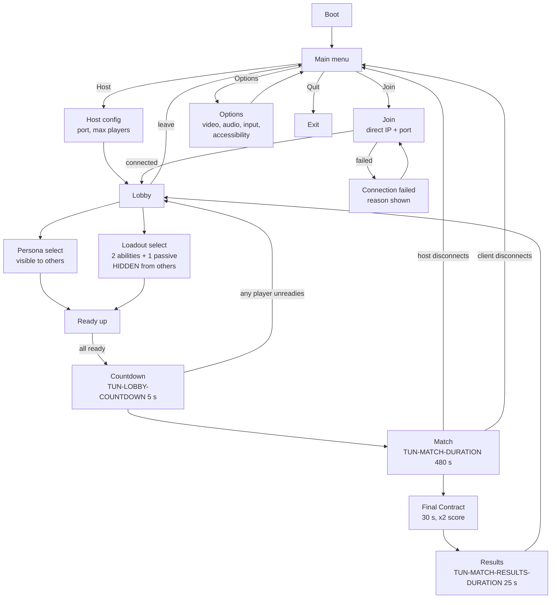
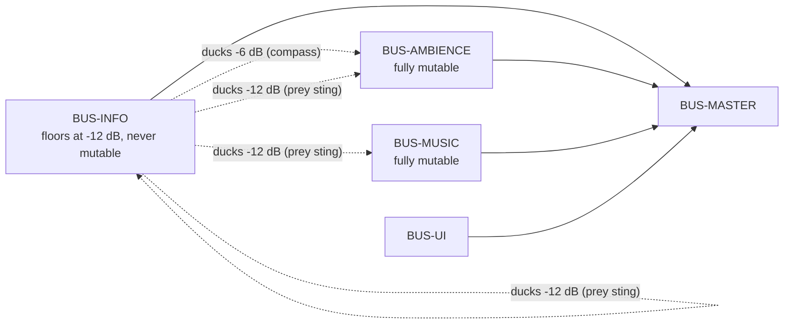

# GDD Part 6 — Interface, Feedback and Audio

> **Context restated.** Project Sottovoce is a 4–6 player social-stealth free-for-all in a
> 120 × 120 m Renaissance city district holding 60–90 AI civilians, including 8–12 identical
> **clones** of each of four playable **personas**. Each player holds a **contract** on one
> other player and is the contract of an unknown third. A hidden **suspicion** value drives
> three tiers — Anonymous (< 30), Noticed (30–69), Exposed (≥ 70) — which determine whether
> your hunter can see you and whether your prey is warned. Kills happen at 2.5 m; the prey's
> counter-**stun** reaches 3.0 m. Matches are 8 minutes and decided by score.
>
> **This chapter's premise:** in this game the HUD and the audio mix are not presentation
> layers over the mechanics. They *are* the mechanics' delivery system. The Compass is how you
> hunt; the prey-warning sting is how you survive; the score feed is how you learn. A UI bug
> here is a gameplay bug.
>
> Implements: `SYS-HUD`, `SYS-SCOREFEED`, `SYS-AUDIO`, `SYS-MUSIC`, `SYS-RESULTS`, `SYS-LOBBY`.

---

## 1. The interface design laws

Four rules, derived from the design laws in [`01_vision.md`](01_vision.md) §2.

| # | Law | Consequence |
|---|---|---|
| 1 | **Every HUD element must answer a question the player is actively asking.** | If you cannot state the question in the player's own words, the element is decoration and it is cut. Every element in §2 has its question written next to it. |
| 2 | **The HUD tells you about *yourself*. The world tells you about *others*.** | Your suspicion, your cooldowns, your score are on the HUD. Other players' states are communicated diegetically — silhouette tint, NPC startle, corpses, ability tells. The one exception is the Compass, and its imprecision is what buys that exception. |
| 3 | **Readability in `TUN-UI-READABILITY-TARGET` 0.5 s.** | Every HUD state must be parseable at a glance, because the player's eyes belong on the crowd. Test procedure in [`../30_bible/UI_UX_SPEC.md`](../30_bible/UI_UX_SPEC.md) §9. |
| 4 | **Information sound is never masked by atmosphere sound.** | The audio mix has a strict priority order (§6.3). Ambience ducks for the Compass; everything ducks for the prey warning. |

---

## 2. The HUD

### 2.1 Wireframe

1920 × 1080 reference. All positions are in the safe area with a 5 % margin.

```
┌──────────────────────────────────────────────────────────────────────────┐
│                                                                          │
│  ┌────────────┐                    ┌────────┐                            │
│  │ ▓ CONTRACT │                    │  4:38  │  ◄── E ─ match timer       │
│  │ ┌────────┐ │  ◄── B ─ contract  │ ══════ │       (+ final-phase bar)  │
│  │ │   ?    │ │      portrait      └────────┘                            │
│  │ └────────┘ │      (unknown /                                          │
│  │  LUCERNA   │       revealed)                                          │
│  └────────────┘                                                          │
│                                                                          │
│                                                                          │
│                                                                          │
│                                                                          │
│                            ·  ·  ·                                       │
│                          ·  crosshair ·   ◄── F ─ 3 px dot, kill-range   │
│                            ·  ·  ·                     state only        │
│                                                                          │
│                                                                          │
│                                                                          │
│                                                             ┌──────────┐ │
│                                                             │ +100     │ │
│                                                             │  Silent  │ │
│  ┌──────────┐                                               │ +150     │ │
│  │  ◐       │  ◄── C ─ suspicion tier                       │  Patient │ │
│  │ NOTICED  │        (shape + colour + word)                │ +200     │ │
│  └──────────┘                                               │  Blended │ │
│                          ╭───────────╮                      └──────────┘ │
│   ┌───┐  ┌───┐          │     ▲      │   ◄── A ─ THE COMPASS   ▲         │
│   │ Q │  │ F │          │  ╱     ╲   │        centre-bottom    │         │
│   │45s│  │ ● │          │ ╱  cone ╲  │                         D ─ score │
│   └───┘  └───┘          ╰───────────╯                              feed  │
│     ◄── G ─ abilities                                                    │
└──────────────────────────────────────────────────────────────────────────┘
```

### 2.2 Element-by-element justification

Each element states **the question it answers, in the player's words**. Law 1.

#### A — The Compass  *(centre-bottom, 220 px diameter)*

| | |
|---|---|
| **Question it answers** | *"Where is my contract, roughly, and am I getting closer?"* |
| **Shows** | A direction cone of half-width `TUN-COMPASS-CONE-HALFWIDTH` 12°, drawn relative to camera facing. A pulse whose *cadence* encodes distance (`TUN-COMPASS-PULSE-MAX` 0.90 s at 60 m → `TUN-COMPASS-PULSE-MIN` 0.15 s at 0 m, curve in [`03_social_stealth.md`](03_social_stealth.md) §8.2). A lock arc that fills over `TUN-COMPASS-LOCK-FILL-TIME` 1.6 s. |
| **Position** | Centre-bottom, not a corner. It is the single most-consulted element and must be reachable by peripheral vision without moving the eyes off the crowd. |
| **Never shows** | Distance in metres. Elevation. The contract's persona (until §2.2 B is earned). Whether they are moving toward or away. |
| **Why centre-bottom and not an edge compass strip** | An edge strip encourages reading it as a map. A radial dial at the bottom of the screen reads as an *instrument* — something you consult, that has its own rhythm. This is a deliberate framing choice. |

#### B — Contract portrait  *(top-left, 180 × 220 px)*

| | |
|---|---|
| **Question it answers** | *"Do I know what my target looks like yet?"* |
| **Shows** | On assignment: a featureless silhouette and the word `UNKNOWN`. After a Compass lock completes: the contract's **persona** silhouette and name, permanently, until the contract changes (ASM-0030). |
| **Why it is earned rather than given** | Knowing your contract's persona collapses the candidate set from 60–90 figures to 8–13. Handing that over on assignment would delete the search, which is the game. Making it the lock's payoff does two jobs: it preserves the search, and it makes the 1.6 s of standing still that a lock costs *worth paying* — the 1.5 s reveal alone is too brief to justify it. |
| **Never shows** | Player name. Position. Distance. Suspicion. Score. |
| **Reset** | On contract reassignment, back to `UNKNOWN`. The work does not carry over. |

#### C — Suspicion tier indicator  *(left, above abilities)*

| | |
|---|---|
| **Question it answers** | *"How visible am I right now?"* |
| **Shows** | Tier as **shape + colour + word** simultaneously: `○ ANONYMOUS` (open circle), `◐ NOTICED` (half-filled), `▲ EXPOSED` (filled triangle). Encoding tier in shape as well as colour is what makes it readable in monochrome ([`02_player_controller.md`](02_player_controller.md) §9.1). |
| **Also shows** | A short list of **active suspicion sources** when any is contributing: `SPRINTING`, `ON ROOFTOPS`, `ALONE`. This is a direct answer to failure mode 3 in Part 3 §13 — a player who cannot attribute their suspicion cannot learn from it. |
| **Never shows** | The numeric value. Tier is what the world reacts to; exposing the number would invite optimising to 29.9 rather than to *behaviour*. |
| **Transition** | `TUN-UI-TIER-TRANSITION-TIME` 0.25 s. At Exposed, a screen-edge vignette fades in over `TUN-UI-DAMAGE-VIGNETTE-TIME` 0.8 s — the only full-screen effect in the game, reserved for the game's punishment state. |

#### D — Score feed  *(right, above centre)*

| | |
|---|---|
| **Question it answers** | *"What did I just get paid for?"* |
| **Shows** | Up to `TUN-UI-SCOREFEED-MAX-LINES` 4 lines, each persisting `TUN-UI-SCOREFEED-DURATION` 4.0 s. Bonuses from one kill arrive as a *sequence*, staggered by `TUN-UI-SCOREFEED-STAGGER` 0.12 s. |
| **Why it is the most important element after the Compass** | See §3. |
| **Never shows** | Other players' score events. Kill notifications for kills you were not part of. **There is no global kill feed** — knowing that someone died somewhere is information the corpse and its Gawk cluster deliver diegetically, at a location, to people who are there. |

#### E — Match timer  *(top-centre, small)*

| | |
|---|---|
| **Question it answers** | *"How long do I have, and is the Final Contract coming?"* |
| **Shows** | `M:SS` remaining. A thin bar underneath fills during the last `TUN-MATCH-FINALPHASE-WARNING` 5 s before the Final Contract phase, then the whole element shifts to the phase treatment for the final `TUN-MATCH-FINALPHASE-DURATION` 30 s with a persistent `×2` marker. |
| **Why small and top-centre** | It matters intensely for about 40 seconds of an 8-minute match and should be ignorable for the rest. |

#### F — Crosshair  *(screen centre, 3 px)*

| | |
|---|---|
| **Question it answers** | *"Is the thing in front of me killable right now?"* |
| **Shows** | A 3 px dot at rest. It expands to a small ring **only** when a valid kill target is within `TUN-KILL-RANGE` 2.5 m and inside `TUN-KILL-FACING-CONE` 60° — i.e. only when pressing kill would succeed. A second, distinct treatment appears when a valid **stun** target (your pursuer, at ≥ Noticed, within `TUN-STUN-RANGE` 3.0 m) is present. |
| **Why it exists at all** | This is the one place the game *must* be unambiguous. Part 2's failure mode 7 is "kill feels unresponsive" — a player who presses kill in what they believe is range and gets nothing blames the game. The crosshair state removes that ambiguity entirely: if the ring is not there, the kill will not land. |
| **Never shows** | Who the target is, or any identity information. Note that the ring's *presence* does imply the figure in front of you is your contract, since only a contract is a valid kill target — that implication is intended, and it is the payoff for having got this close. |

#### G — Ability slots  *(bottom-left, two 64 px icons)*

| | |
|---|---|
| **Question it answers** | *"Can I use it yet?"* |
| **Shows** | Two icons with their bound key, a radial cooldown sweep, and remaining seconds as text when on cooldown. |
| **Never shows** | The passive. The passive has no input, no cooldown and no decision attached to it — an always-on icon would be pure noise. It is shown in the lobby and on the results screen, where it is a *choice*, and nowhere else. |

### 2.3 What is deliberately absent

Stated as a list because the pressure to add each of these will recur, and because several are
design laws rather than schedule cuts.

| Absent | Status | Why |
|---|---|---|
| **Minimap** | **Permanent design law** | A minimap replaces the Compass with certainty and deletes the search. The entire tension of the hunt is not knowing which of eleven figures in a 6 m arc is your target. `SCOPE_FENCE` OUT #12. |
| **Kill-cam / death replay** | **Deferred, with a design reason** | A kill-cam reveals the killer's identity *and position*, which permanently changes the paranoia economy — you would always know who killed you and where they were. The teaching load it would carry is instead carried by the score feed (§3) and by theatre spaces ([`05_level_design.md`](05_level_design.md) §5). `SCOPE_FENCE` OUT #11. |
| **Health bar** | **Not applicable** | There is no health. Kills are binary and instant on contact; stuns are a timed state. A bar would imply a resource that does not exist. |
| **Global kill feed** | **Permanent design law** | "X killed Y" broadcast to everyone would tell every player how the contract cycle has shifted, for free. The cycle's opacity is load-bearing. Deaths are learned diegetically — a corpse, a Gawk cluster, a Startle wave. |
| **Player nameplates** | **Permanent design law** | Directly deletes anonymity. |
| **Damage indicators / hit direction** | **Permanent design law** | The prey warning is deliberately directionless (`TUN-COMPASS-WARN-GIVES-DIRECTION` = false). A directional indicator anywhere in the HUD would leak the same information through a side door. |
| **Live scoreboard on screen** | Present on `INPUT-SCORE` hold only | Persistent scores would drive constant leader-targeting. Available on demand, because knowing you are behind should be a *choice to check*, not an ambient pressure. |
| **Objective marker / waypoint** | Not applicable | There are no objectives beyond the contract. |
| **Ammo / resource counters** | Not applicable | Abilities are on cooldowns only. |
| **Suspicion as a numeric value or bar** | **Design decision** | See §2.2 C. Tier, not value. |
| **Other players' cooldowns** | **Permanent** | Kit knowledge is earned by watching, per [`04_abilities.md`](04_abilities.md) §5.1. Showing it would delete the deduction. |

**The pattern:** almost everything absent is absent because it would convert an *earned
inference* into a *given fact*. That is the single test to apply to any proposed HUD addition.

---

## 3. The score feed as the game's teacher

### 3.1 The problem it solves

Without a kill-cam, a new player who dies learns nothing about what gave them away, and a new
player who *succeeds* learns nothing about why. [`01_vision.md`](01_vision.md) §3.2 identifies
this as the "Tobias" failure: a mechanically-skilled player from other genres who quits after
two matches because death feels arbitrary.

The score feed is the primary countermeasure. It names good play, out loud, at the instant it
happens.

### 3.2 How it teaches

| Property | Value | Why |
|---|---|---|
| **Named, not numeric** | `+150 Patient`, not `+150` | The name *is* the lesson. A player who reads "Patient" three times learns the word, then the condition, then the behaviour. |
| **Sequenced, not blocked** | `TUN-UI-SCOREFEED-STAGGER` 0.12 s between lines from one kill | Four bonuses arriving simultaneously is one event. Arriving 0.12 s apart, they are four events, each individually readable — and the sequence is *more satisfying*, which is a real effect and not a small one. |
| **At the moment earned** | Immediate | A bonus explained at the results screen five minutes later teaches nothing, because the behaviour that earned it is no longer in working memory. |
| **Persistent enough to read** | `TUN-UI-SCOREFEED-DURATION` 4.0 s, raisable to 8 s in accessibility options | |
| **Peripheral, not central** | Right side, above centre | It must be readable *without looking at it*. A player who has to look at the HUD to learn is a player who is not watching the crowd. |
| **Penalties are visually distinct** | `−50 Reckless` in the penalty treatment | The one negative event must not read as a smaller positive one. |

### 3.3 The teaching sequence, by design

A new player's first ten minutes, as the feed intends it:

| Match minute | What they see | What they learn |
|---|---|---|
| ~1:30 | `+100 Contract Fulfilled` — bare, after a sprinting kill, followed by `−50 Reckless` | *Killing works. Something about how I did it was wrong.* |
| ~2:30 | Someone else's `+650` announced on the results screen later | *That number is possible.* |
| ~3:00 | Their own `+100 Contract` `+100 Silent` | *"Silent" — I did something differently that time.* |
| ~4:30 | `+100 Contract` `+100 Silent` `+150 Patient` | *Slower is worth more. Substantially more.* |
| ~6:00 | `+200 Blended` | *Waiting in the crowd is the biggest one.* |
| Results | Their bonus breakdown next to the winner's | *The winner did the same things, more often.* |

**The feed's real function is to make the balance model visible.** The claim in
[`07_balance.md`](07_balance.md) — that a patient kill is worth 3–13× a reckless one — is only
a design claim if players cannot see it. The feed converts it into a lesson.

### 3.4 The results screen

`TUN-MATCH-RESULTS-DURATION` 25 s, skippable only by **unanimous** input so one impatient
player cannot deny another the teaching moment.

| Shows | Why |
|---|---|
| Final placement and total, all players | The outcome. |
| **Per-player bonus breakdown**: each bonus type, count earned, points contributed | The lesson. This is the screen's actual purpose — the placement is just the frame. Directly enabled by the event-sourced score log (ADR-0004), where the breakdown is a `group_by` over the same data the total is folded from, so the two can never disagree. |
| Each player's persona, loadout and passive | Retrospective kit-reading: *"oh, that's what they had."* |
| Your killer(s), by name, count only | Enables `SCORE-VENDETTA` to have felt meaning. Name only — no position, no replay. |
| Highest single kill of the match, with its bonus stack | The aspirational number, attributed. |
| **Not shown** | Any per-player timeline, path, or heatmap. That is a kill-cam by another name. |

---

## 4. Menus and flow



### 4.1 Lobby requirements

The lobby is an **information surface**, not a menu, because loadouts are locked for the whole
match ([`04_abilities.md`](04_abilities.md) §5.1) and that choice must be informed.

| Requirement | Detail |
|---|---|
| Every ability shows its full specification | Cooldown, suspicion cost, duration, and **its tell, in one sentence**. A player must be able to choose without having used it. |
| Every passive shows its exact effect | Numerically, not descriptively. `Suspicion decays 40% faster while stationary`, not `Recover faster`. |
| Persona selection is **visible** to other players | Your persona is visible in the world anyway; hiding it in the lobby would create an asymmetry that evaporates at match start. |
| Loadout selection is **hidden** from other players | Kit-reading is a core skill. |
| Duplicate personas are permitted | Two players may both be Vetraio. This is *good*: it adds a candidate to each other's crowd. |
| Ready state per player, visible | |
| Countdown cancels if anyone unreadies | Misclick protection. |
| Minimum `TUN-LOBBY-MIN-PLAYERS` 4 to start | Below 4 the contract cycle degenerates ([`03_social_stealth.md`](03_social_stealth.md) §7.4). |

### 4.2 What the MVP menu system is allowed to be

Per `SCOPE_FENCE` §5: a functional list of players and a ready button is complete. No
animation, no transitions, no art. The lobby's *information content* (above) is a hard
requirement; its presentation is not.

---

## 5. Audio design

### 5.1 The information / atmosphere split

The single most important structural decision in the audio design. Every sound in the game
belongs to exactly one of two categories, and they are routed to separate buses with separate
volume sliders.

| | **Information** | **Atmosphere** |
|---|---|---|
| **Definition** | Carries a fact a player can act on | Carries mood only |
| **Examples** | Compass pulse, prey warning sting, ability tells, footsteps, tier transitions, score feed stings | Crowd murmur, furnace roar, water, bells, wind, music |
| **Bus** | `BUS-INFO` | `BUS-AMBIENCE`, `BUS-MUSIC` |
| **May be muted by the player?** | **No** — the slider floors at −12 dB, never off | **Yes, fully** |
| **Ducks for anything?** | Only for higher-priority information | Ducks for all information |
| **Has a caption?** | **Yes, mandatory** | No |
| **Positional?** | Where the underlying fact is positional | Usually |

**The guarantee this produces:** *a player who mutes ambience and music entirely loses no
gameplay information whatsoever.* That is an accessibility requirement
([`02_player_controller.md`](02_player_controller.md) §9.2) and a competitive-integrity one —
nobody should gain an advantage by turning the atmosphere off, and nobody should have to.

This is also why Design Law 2's rejected feature was *ambient NPC dialogue barks*: sound that
carries no information competes for attention with sound that does.

### 5.2 The diegetic / non-diegetic split

| | Diegetic (exists in the world) | Non-diegetic (exists only for you) |
|---|---|---|
| **Examples** | Footsteps, NPC startle cries, the Cinderfall crack, the Lunge shout, corpse gawk murmur, furnace roar, bells | Compass pulse, prey warning sting, tier transition, score stings, music |
| **Heard by others?** | **Yes** — this is what makes it diegetic | No |
| **Occluded by geometry?** | Yes (`TUN-AUDIO-OCCLUSION-LOWPASS` 900 Hz) | No |
| **Rule** | If another player can hear it, it is a public information channel and must appear in the information-economy table ([`03_social_stealth.md`](03_social_stealth.md) §11.1) | If only you can hear it, it must be about *you* — Law 2 of §1 |

**The load-bearing consequence:** the Compass pulse is non-diegetic, so a hunter's Compass
never gives them away. If it were audible to others, standing near a hunter would reveal them,
which would convert the Compass from a private instrument into a public liability and break the
information economy in a way that is very hard to see coming.

### 5.3 The Compass sting

The game's signature sound and its most-heard.

| Property | Specification |
|---|---|
| **Character** | A short, dry, pitched tick — closer to a metronome or a fingernail on glass than a musical tone. It must survive being heard ~1 500 times per match without becoming irritating, which rules out anything with a tail, a pitch bend, or a resonant body. |
| **Cadence** | `1 / p(d)` where `p(d)` is the period curve in [`03_social_stealth.md`](03_social_stealth.md) §8.2 — 1.11 Hz at 60 m to 6.67 Hz at 0 m. |
| **Pitch** | Rises subtly with proximity: a perfect fifth across the full range. The pitch is *redundant* with the cadence, never the primary carrier, so that a player with pitch-perception difficulty loses nothing. |
| **Ducking** | Ducks `BUS-AMBIENCE` by `TUN-AUDIO-COMPASS-DUCK` −6 dB for the tick's duration. The pulse must never be masked by crowd noise: it is the primary information channel. |
| **Visual parity** | The Compass pulses visually at identical cadence. A deaf player loses **no** Compass information — the audio is reinforcement, not the carrier. |
| **At high cadence** | Below ~0.30 s period (inside ~2 m) the ducking is smoothed to a sustained −4 dB rather than per-tick, to avoid the ambience pumping audibly. |

### 5.4 The "you are exposed" motif

A three-note descending figure, used in exactly three places and nowhere else, so that it
acquires a single unambiguous meaning:

| Where | Variant |
|---|---|
| **Your own tier crosses into Exposed** (`SFX-TIER-EXPOSED`) | Full motif, non-diegetic, plus the screen-edge vignette |
| **The prey warning** (`SFX-WARN-PREY-STING`) | The motif's first two notes only, inverted (rising) — *related but not the same*, so the player can distinguish "I am exposed" from "someone near me is" without conscious effort |
| **`MUS-STEM-EXPOSED`** | The motif as the music stem's bass figure, sustained |

Everything else — kills, stuns, abilities, score — uses unrelated material. **A motif that
means one thing is worth more than five motifs that mean nothing.**

### 5.5 The prey warning sting

The single most important sound in the game.

| Property | Specification |
|---|---|
| **Trigger** | Your pursuer within `TUN-COMPASS-WARN-RADIUS` 15 m **and** at least Noticed. |
| **Character** | The inverted motif (§5.4), short, dry, close-miked — it should feel like it happened *inside your head*, not in the district. Non-diegetic and deliberately so. |
| **Ducking** | `TUN-AUDIO-STING-DUCK` −12 dB on everything else, including `BUS-INFO`. This is the only sound in the game that ducks other information. |
| **Positional?** | **No.** `TUN-COMPASS-WARN-GIVES-DIRECTION` is false. Rendering it positionally would hand over the direction the design deliberately withholds — and this is the easiest possible way to break that rule by accident. The sound must be authored and routed as strictly mono/centred, and this is worth a test. |
| **Duration** | `TUN-COMPASS-WARN-DURATION` 1.2 s including the visual flash. |
| **Cooldown** | `TUN-COMPASS-WARN-COOLDOWN` 2.5 s, so a pursuer hovering at the tier boundary does not produce a strobe. |
| **Caption** | `⚠ You are being hunted` — no direction, matching the audio exactly. |

### 5.6 Crowd ambience layers

Four layers, each driven by the *actual* NPC count within a radius, so that ambience is an
honest reflection of density rather than a zone-painted mood.

| Layer | Driven by | Content | Why |
|---|---|---|---|
| `AMB-CROWD-NEAR` | NPC count within 6 m (= `TUN-SUSPICION-OPEN-RADIUS`) | Close murmur, cloth, footfalls | **This layer is quietly informational**: it rises and falls with the exact quantity that governs the open-ground suspicion source. A player learns to hear whether they are alone. It is routed to `BUS-AMBIENCE` because it is redundant with the tier indicator, but it is the reason the ambience system is density-driven rather than zone-driven. |
| `AMB-CROWD-MID` | NPC count within 25 m | Market hubbub, bartering, cart wheels | Sense of place. |
| `AMB-ZONE` | Current zone | Furnace roar, water lapping, arcade reverb | Zone identity; helps positional orientation. |
| `AMB-DISTRICT` | Always | Bells on the quarter-hour, gulls, distant city | Constant bed. **The quarter-hour bells double as a coarse match clock**, diegetically. |

### 5.7 Footstep material set

Footsteps are the one information channel that **cannot be blocked**, only muffled
([`03_social_stealth.md`](03_social_stealth.md) §11.2). Their radius by speed is the speed
ladder restated in a second currency.

| Material | Zones | Character |
|---|---|---|
| `MAT-STONE` | Piazza del Vetro, Loggia, Piazza Secca | Bright, clear, long-carrying |
| `MAT-GRAVEL` | Via delle Lampe, Fondaco yards | Crunchy, very legible at speed |
| `MAT-WOOD` | Bridges, market stall platforms, balconies | Hollow, resonant — **the loudest material**, so the Ponte Corto crossing is audibly a commitment |
| `MAT-TILE` | Roof stratum | Sharp, brittle, with an occasional slip — a roof runner is audible from the street below, which is a deliberate counter to roof travel |
| `MAT-WATER` | Canal steps, fountain edge | Splash; rare, and therefore highly identifying |

Audible radius, from `TUN-AUDIO-FOOTSTEP-RADIUS-*`:

| Speed | Radius | Ratio to blend-walk |
|---|---|---|
| Blend-walk | 4 m | 1.0× |
| Stroll | 6 m | 1.5× |
| Jog | 10 m | 2.5× |
| Run | 14 m | 3.5× |
| Sprint | **18 m** | **4.5×** |

**NPC footsteps use the same set and the same radii.** They must, or a player at blend-walk
would be audibly distinguishable from the clones around them — an audio anonymity leak exactly
equivalent to the animation-parity constraint.

### 5.8 The occlusion model

Deliberately simple. Complexity here buys realism, and realism is not what this game needs from
audio.

```
for each diegetic source:
    if raycast(listener, source) hits world geometry:
        apply low-pass at TUN-AUDIO-OCCLUSION-LOWPASS (900 Hz)
        apply -6 dB
    if source is inside an active Cinderfall volume:
        apply -3 dB          # the cloud muffles but does not silence
    # NPCs never occlude audio, matching the rule that NPCs never occlude line of sight
```

| Rule | Reason |
|---|---|
| One raycast per source, no portal system | Frame budget, and the added precision would not change a single decision a player makes. |
| **NPCs do not occlude** | Matches the LOS rule ([`03_social_stealth.md`](03_social_stealth.md) §9.2). The crowd hides you by being *confusing*, never by being *solid* — in vision or in sound. |
| Occlusion muffles, never silences | Footsteps are the unblockable floor of the information economy. Full occlusion would remove the floor. |
| Non-diegetic sounds are never occluded | They are not in the world. |

---

## 6. The audio event table

Referenced by ID from the TDD, the implementation and the test plan. ID grammar
`SFX-<CATEGORY>-<NAME>` per [`../30_bible/NAMING_AND_IDS.md`](../30_bible/NAMING_AND_IDS.md).

**Legend** — *Bus*: `INFO` / `AMB` / `MUS` / `UI`. *D*: diegetic (others can hear it).
*Cap*: has a mandatory caption.

### 6.1 Compass and detection

| ID | Trigger | Bus | D | Cap | Radius | Notes |
|---|---|---|---|---|---|---|
| `SFX-COMPASS-PULSE` | Every pulse period | INFO | ✗ | ✓ | — | Pitch rises a fifth across range; ducks AMB −6 dB |
| `SFX-COMPASS-LOCK-FILL` | Lock arc filling | INFO | ✗ | ✓ | — | Rising sustained tone, tracks fill fraction |
| `SFX-COMPASS-LOCK-COMPLETE` | Lock reaches 100 % | INFO | ✗ | ✓ | — | Resolves the fill tone; also fills the contract portrait (ASM-0030) |
| `SFX-COMPASS-LOCK-BREAK` | Lock lost before completion | INFO | ✗ | ✓ | — | Deliberately unpleasant; a broken lock cost you 1.6 s |
| `SFX-CONTRACT-ASSIGNED` | New contract issued | INFO | ✗ | ✓ | — | Must be unmistakable — Part 3 failure mode 18 is players not noticing reassignment |
| `SFX-WARN-PREY-STING` | Prey warning fires | INFO | ✗ | ✓ | — | **Mono/centred, never positional.** Ducks everything −12 dB |

### 6.2 Suspicion

| ID | Trigger | Bus | D | Cap | Radius | Notes |
|---|---|---|---|---|---|---|
| `SFX-TIER-NOTICED` | Own tier → Noticed | INFO | ✗ | ✓ | — | Short, low |
| `SFX-TIER-EXPOSED` | Own tier → Exposed | INFO | ✗ | ✓ | — | Full "exposed" motif + vignette |
| `SFX-TIER-CLEARED` | Own tier → Anonymous | INFO | ✗ | ✓ | — | Release; the sound of safety |

### 6.3 Kill and stun

| ID | Trigger | Bus | D | Cap | Radius | Notes |
|---|---|---|---|---|---|---|
| `SFX-KILL-INITIATE` | Kill animation starts | INFO | ✓ | ✓ | 12 m | Audible to bystanders — the kill is a public event |
| `SFX-KILL-CONTACT` | Contact frame, 0.9 s in | INFO | ✓ | ✓ | 15 m | |
| `SFX-KILL-WHIFF` | Kill input rejected / invalid target | INFO | ✓ | ✓ | 10 m | **Must never be silence.** Part 2 failure mode 7 |
| `SFX-KILL-CONTEST-LOSS` | Lost the contest window | INFO | ✗ | ✓ | — | |
| `SFX-STUN-INITIATE` | Stun animation starts | INFO | ✓ | ✓ | 10 m | |
| `SFX-STUN-SUCCESS` | Valid stun lands | INFO | ✓ | ✓ | 18 m | The loudest non-ability event; a stun is a public humiliation |
| `SFX-STUN-INVALID` | Stunned a non-pursuer | INFO | ✓ | ✓ | 10 m | Deliberately comic — flailing should sound like flailing |
| `SFX-STUN-RECEIVED` | You are stunned | INFO | ✗ | ✓ | — | Muffled, dulled — the audio equivalent of losing camera control |
| `SFX-STUN-RECOVER` | Stun freeze ends | INFO | ✗ | ✓ | — | |

### 6.4 Abilities

| ID | Trigger | Bus | D | Cap | Radius | Notes |
|---|---|---|---|---|---|---|
| `SFX-CINDERFALL-THROW` | Cast begins | INFO | ✓ | ✓ | 15 m | |
| `SFX-CINDERFALL-BURST` | Cloud spawns | INFO | ✓ | ✓ | **25 m** | The tell. Sharp crack |
| `SFX-CINDERFALL-EXPIRE` | Cloud ends | AMB | ✓ | ✗ | 12 m | |
| `SFX-WHISPERBOLT-DRAW` | Wind-up begins | INFO | ✓ | ✓ | 14 m | Rising metallic draw across the full 1.0 s |
| `SFX-WHISPERBOLT-RELEASE` | Thrown | INFO | ✓ | ✓ | 16 m | |
| `SFX-WHISPERBOLT-IMPACT` | Hit | INFO | ✓ | ✓ | 15 m | |
| `SFX-WHISPERBOLT-MISS` | Missed | INFO | ✓ | ✓ | 12 m | Blade on stone — *distinct from impact*, so bystanders learn the outcome |
| `SFX-SECONDFACE-MORPH-IN` | Cast, 0.8 s | INFO | ✓ | ✓ | 8 m | Soft cloth rush. The quietest tell in the game, deliberately |
| `SFX-SECONDFACE-MORPH-OUT` | Duration ends or broken | INFO | ✓ | ✓ | 8 m | The more important of the two — it fires at a moment the player did not choose |
| `SFX-LUNGE-WINDUP` | Wind-up, 0.25 s | INFO | ✓ | ✓ | **20 m** | Sharp intake |
| `SFX-LUNGE-DASH` | Dash | INFO | ✓ | ✓ | 20 m | |
| `SFX-LUNGE-WHIFF` | Dash ended with no kill | INFO | ✓ | ✓ | 14 m | |
| `SFX-ABILITY-READY` | Cooldown ends | INFO | ✗ | ✓ | — | Very quiet; it is a convenience, not a demand |
| `SFX-ABILITY-DENIED` | Used while on cooldown / illegal | UI | ✗ | ✗ | — | |

### 6.5 Movement and traversal

| ID | Trigger | Bus | D | Cap | Radius | Notes |
|---|---|---|---|---|---|---|
| `SFX-FOOTSTEP-<MATERIAL>` | Per step | INFO | ✓ | ✗ | 4–18 m by speed | 5 materials × 5 speeds. **Identical for players and NPCs** |
| `SFX-VAULT` | Vault | INFO | ✓ | ✗ | 5 m | |
| `SFX-MANTLE` | Mantle | INFO | ✓ | ✗ | 7 m | |
| `SFX-CLIMB-LOOP` | While climbing | INFO | ✓ | ✗ | 7 m | |
| `SFX-DROP-LAND-SOFT` | Landing ≤ 4 m | INFO | ✓ | ✗ | 8 m | |
| `SFX-DROP-LAND-HARD` | Landing > 4 m, staggered | INFO | ✓ | ✓ | 12 m | Captioned because it marks a vulnerable player |
| `SFX-BLEND-ENTER` | Blend entered | INFO | ✗ | ✓ | — | |
| `SFX-BLEND-EXIT` | Blend left | INFO | ✗ | ✓ | — | |
| `SFX-BLEND-BREAK` | Blend broken involuntarily | INFO | ✗ | ✓ | — | Distinct from exit — you did not choose this |

### 6.6 Crowd and world

| ID | Trigger | Bus | D | Cap | Radius | Notes |
|---|---|---|---|---|---|---|
| `SFX-NPC-BUMP` | Player collides with an NPC | INFO | ✓ | ✓ | 12 m | Captioned: it is a public tell worth +15 suspicion |
| `SFX-CROWD-STARTLE` | Startle wave begins | INFO | ✓ | ✓ | 30 m | Layered cries; **the loudest diegetic event in the game** |
| `SFX-CROWD-GAWK-MURMUR` | Gawk cluster forms | INFO | ✓ | ✓ | 20 m | Rising murmur — audible before the cluster is visible |
| `SFX-CORPSE-SPAWN` | Corpse appears | INFO | ✓ | ✗ | 10 m | |

### 6.7 Match and score

| ID | Trigger | Bus | D | Cap | Radius | Notes |
|---|---|---|---|---|---|---|
| `SFX-MATCH-COUNTDOWN` | Each of the final 5 s | UI | ✗ | ✓ | — | |
| `SFX-MATCH-START` | Match begins | INFO | ✗ | ✓ | — | |
| `SFX-MATCH-FINALPHASE-WARN` | 5 s before the phase | INFO | ✗ | ✓ | — | |
| `SFX-MATCH-FINALPHASE-START` | Phase begins | INFO | ✗ | ✓ | — | Bells; diegetically motivated by the district's clock |
| `SFX-MATCH-END` | Match ends | INFO | ✗ | ✓ | — | |
| `SFX-SCORE-BONUS-SMALL` | Bonus ≤ 100 | INFO | ✗ | ✗ | — | |
| `SFX-SCORE-BONUS-LARGE` | Bonus ≥ 150 | INFO | ✗ | ✗ | — | Pitched up per position in a stack, so a four-bonus kill *ascends*. The single most satisfying sound in the game and the cheapest to build |
| `SFX-SCORE-PENALTY` | `SCORE-RECKLESS` | INFO | ✗ | ✓ | — | Must not read as a small positive |
| `SFX-DEATH` | You die | INFO | ✗ | ✓ | — | |
| `SFX-RESPAWN` | You respawn | INFO | ✗ | ✓ | — | |

### 6.8 UI

| ID | Trigger | Bus | D | Cap |
|---|---|---|---|---|
| `SFX-UI-NAV` | Menu navigation | UI | ✗ | ✗ |
| `SFX-UI-CONFIRM` | Confirm | UI | ✗ | ✗ |
| `SFX-UI-BACK` | Back | UI | ✗ | ✗ |
| `SFX-UI-READY` | Ready toggled | UI | ✗ | ✗ |

### 6.9 Bus routing and ducking



**Ducking priority**, highest first. A higher-priority sound ducks everything below it:

1. `SFX-WARN-PREY-STING` — ducks *everything*, including other information. The only sound with this privilege.
2. `SFX-TIER-EXPOSED`
3. `SFX-COMPASS-PULSE` — ducks ambience and music only
4. All other information
5. Ambience
6. Music

---

## 7. Music — reactive stems keyed to suspicion tier

### 7.1 Structure

Four stems, always playing, cross-faded by state. No transitions, no stingers, no cues — a
stem system rather than a cue system, because the driving state (`suspicion tier`) can change
several times in ten seconds and any transition longer than the state's dwell time would
desynchronise the music from the game.

| Stem | Active when | Content |
|---|---|---|
| `MUS-STEM-BASE` | Always | Sparse plucked strings, slow, near-ambient. The district's own music — nearly diegetic in character. |
| `MUS-STEM-NOTICED` | Own tier = Noticed | A single sustained low string enters. Barely a change; that is correct — Noticed is a transient state and the music should not dramatise it. |
| `MUS-STEM-EXPOSED` | Own tier = Exposed | The "exposed" motif (§5.4) as a sustained bass figure, plus a rhythmic pulse. Unmistakable. |
| `MUS-STEM-FINALPHASE` | Final Contract phase | Full ensemble, faster. Replaces rather than layers — the last 30 seconds are deliberately the least characteristic of the game. |

| Property | Value |
|---|---|
| Cross-fade time | 0.8 s in, 1.6 s out — fast to arrive, slow to leave, so the tension outlasts its cause |
| Tempo | Constant across all stems, so they layer without alignment work |
| Key | Constant |
| Loop length | 32 bars, all stems, sample-aligned |
| Fully mutable | Yes — music is atmosphere, never information (§5.1) |

### 7.2 What the music is deliberately not keyed to

| Not keyed to | Why |
|---|---|
| **Compass proximity** | The Compass already carries proximity, precisely and continuously. Doubling it in music would either be redundant or — worse — a *second*, less precise proximity channel that players might trust. |
| **Other players' states** | Music must never leak information about anyone but you (Law 2 of §1). |
| **Kills anywhere on the map** | Would be a global kill feed by another route. |
| **Being hunted** | Tempting, and rejected: it would give a continuous "someone is near you" signal that the prey warning deliberately delivers only in a 15 m radius, only against a careless pursuer. Music keyed to being hunted would be a permanent, free, directionless proximity sensor. |

**The rule:** music reacts to *your own suspicion tier* and to *the match phase*, and to
nothing else. Both are things you already know.

---

## 8. Acceptance criteria

- [ ] Every HUD element in §2.1 exists, and each has its player-facing question documented in the implementation's header comment.
- [ ] No HUD element exists that is not in §2.1.
- [ ] The Compass renders as a cone of half-width `TUN-COMPASS-CONE-HALFWIDTH`, never as a needle.
- [ ] The Compass never displays a numeric distance.
- [ ] The contract portrait shows `UNKNOWN` on assignment and fills only on lock completion; it resets on reassignment (ASM-0030). Covered by `test_contract_portrait_gating.gd`.
- [ ] The suspicion indicator encodes tier in shape *and* colour *and* word, and is legible with the monochrome palette applied.
- [ ] The suspicion indicator lists active suspicion sources when any is contributing.
- [ ] The numeric suspicion value appears nowhere in the HUD.
- [ ] The crosshair ring appears if and only if pressing kill would succeed; `test_crosshair_truth.gd` asserts agreement with server-side kill validity across 500 randomised poses.
- [ ] The score feed shows bonus *names*, staggered by `TUN-UI-SCOREFEED-STAGGER`, capped at `TUN-UI-SCOREFEED-MAX-LINES`.
- [ ] No global kill feed, nameplate, minimap, health bar, hit-direction indicator or persistent scoreboard exists anywhere in the build.
- [ ] The results screen's per-bonus breakdown is derived from the same `ScoreEvent` fold as the totals (ADR-0004), so the two cannot disagree; asserted by `test_results_matches_scoreboard.gd`.
- [ ] The results screen is skippable only by unanimous input.
- [ ] The lobby displays every ability's cooldown, suspicion cost and **tell** before selection.
- [ ] Lobby persona selections are visible to all; loadout selections are visible to none.
- [ ] Every audio event in §6 exists with the stated bus, diegetic flag and caption flag.
- [ ] Every event marked `Cap ✓` has a caption string in `data/strings/en.csv`.
- [ ] `BUS-INFO` cannot be muted; its slider floors at −12 dB.
- [ ] **With `BUS-AMBIENCE` and `BUS-MUSIC` muted, no gameplay information is lost.** Verified by a manual playtest pass and by asserting that no `AMB`/`MUS`-routed event is marked `Cap`.
- [ ] `SFX-WARN-PREY-STING` is routed mono/centred and carries no positional data; `test_prey_sting_nonpositional.gd` asserts the emitter has no 3D position component.
- [ ] Player and NPC footsteps use identical clips and identical radii per speed; asserted by `test_footstep_parity.gd`.
- [ ] Occlusion applies `TUN-AUDIO-OCCLUSION-LOWPASS` and −6 dB; NPCs never occlude audio.
- [ ] Music stems are keyed only to own suspicion tier and match phase; `grep` finds no reference to another player's state in the music controller.
- [ ] The "exposed" motif appears in exactly the three places listed in §5.4 and nowhere else.

---

## 9. Failure modes

| # | Failure | Symptom | Root cause to check |
|---|---|---|---|
| 1 | **The HUD is where the player looks.** | Playtesters' eyes are on the corners; they miss crowd behaviour entirely. | Too many elements, or elements too far from centre. The Compass is centre-bottom for exactly this reason; if players are still looking down, it is too detailed. |
| 2 | **The score feed is missed.** | Players cannot name a single bonus after a match. | Duration too short, stagger too fast, or the feed is positioned outside peripheral vision. **This is the most damaging failure in this chapter** — the feed is the game's only teacher. |
| 3 | **The score feed is noise.** | Players report the right side of the screen as "stuff scrolling". | Too many lines, or small bonuses shown with the same weight as large ones. |
| 4 | **The prey sting is positional.** | Players report being able to tell which direction their hunter is. | An audio bus or emitter regression. Silent, severe, and it deletes the game's best moment. Hence a dedicated test. |
| 5 | **The Compass pulse becomes irritating.** | Players mute the game or report fatigue after two matches. | The tick has a tail, a resonance, or a pitch bend. It is heard ~1 500 times per match; it must be dry and short. |
| 6 | **Ambience masks the Compass.** | Players lose the pulse in the dense market — the place they most need it. | Ducking not applied, or `TUN-AUDIO-COMPASS-DUCK` insufficient in high-density zones. |
| 7 | **Footstep parity breaks.** | Skilled players start identifying humans by sound. | Player and NPC footsteps have diverged in clip, radius or timing. Exactly equivalent to the animation-parity leak in Part 3, and equally hard to spot by review. |
| 8 | **Captions lag the audio.** | Deaf players react late to the prey warning. | Captions must be emitted on the same frame as the event, from the same call. |
| 9 | **Music tells players something.** | A player says "I could hear when someone was near me." | A stem is keyed to something other than own tier or match phase. |
| 10 | **The crosshair lies.** | Players press kill with the ring showing and nothing happens. | Client-side prediction of kill validity disagreeing with server validation — usually a lag-compensation or facing-cone discrepancy. Either fix the agreement or make the ring server-confirmed; a lying crosshair is worse than no crosshair. |
| 11 | **The results screen is skipped.** | Players hammer through it; the teaching moment is lost. | Breakdown not readable in the time available, or the unanimous-skip rule not enforced. |
| 12 | **The contract portrait reveals too much.** | Players report finding targets easily after their first lock. | Working as designed (ASM-0030) — but if `TEL-TIME-TO-KILL` drops sharply after first lock, the persona reveal may be too strong and should degrade (e.g. show silhouette class only). |

---

## 10. Open questions

| # | Question | Position taken | Needed by |
|---|---|---|---|
| 1 | Should the contract portrait reveal the full persona, or only a silhouette *class* (tall/broad/wide/round)? The full persona narrows 78 NPCs to ~12; a class narrows it to ~24. | Full persona for MVP — it is what the player saw during the reveal anyway, and withholding it would feel arbitrary. Degrade to class only if failure mode 12 fires. | M5 |
| 2 | Should `AMB-CROWD-NEAR` (§5.6) be reclassified as information rather than atmosphere? It is driven by exactly the quantity that governs open-ground suspicion, so a player can hear whether they are alone — which is genuinely actionable. | Keep as atmosphere, because the tier indicator already carries it explicitly and the guarantee "muting ambience loses nothing" is worth more than the redundancy. Revisit if players report relying on it. | M5 |
| 3 | Is a persistent on-screen scoreboard needed for the last 60 seconds? Currently it is hold-only. Trailing players may not know they need to take risks. | Hold-only. The Final Contract's ×2 makes risk correct for everyone regardless of position, so the information is less load-bearing than it looks. | M6 |
| 4 | Should `SFX-KILL-INITIATE` be audible at 12 m? That is generous — it means a patient kill in a dense market is often heard. | Keep. A kill is meant to be a public event; the counter is to kill somewhere quiet, which is a positional decision the level design supports. | M4 |
| 5 | Four music stems may be more than a placeholder-audio MVP needs. Is `MUS-STEM-NOTICED` (deliberately barely audible) worth building at all? | Build `BASE`, `EXPOSED` and `FINALPHASE` first; `NOTICED` last and only if the tier transition feels unmarked without it. | M5 |
| 6 | The HUD has no indication of *how long* a stun lockout has left when you are the stunned player. Should it? | Yes, probably — being unable to act with no visible reason is the worst kind of opacity. Deferred to M5 as a small addition to element C. | M5 |
