# GDD Part 7 — Match Rules, Scoring and Balance

> **Context restated.** Project Sottovoce is a 4–6 player social-stealth free-for-all in a
> 120 × 120 m district holding 60–90 AI civilians, including 8–12 identical **clones** of each
> of four playable **personas**. Contracts form a single directed **Hamiltonian cycle**: each
> player hunts exactly one other and is hunted by exactly one other. A hidden **suspicion**
> value drives three tiers — Anonymous (< 30), Noticed (30–69), Exposed (≥ 70). Moving above
> stroll (2.2 m/s) accrues suspicion; standing among ≥ 4 NPCs erases it. Kills happen at 2.5 m
> after a committed 1.4 s animation; the prey's counter-**stun** reaches 3.0 m and only works
> on a pursuer who is at least Noticed. Matches are 8 minutes and decided by **score**.
>
> **The design claim this chapter must defend:** *a patient player beats an aggressive player
> of equal skill.*
>
> Implements: `SYS-MATCH`, `SYS-SCORE`, `SYS-TELEMETRY`.

---

## 1. Match flow

### 1.1 The state machine

```mermaid
stateDiagram-v2
    [*] --> Lobby

    Lobby --> Countdown: all players ready<br/>AND count >= TUN-LOBBY-MIN-PLAYERS (4)
    Countdown --> Lobby: any player unreadies<br/>or disconnects below 4
    Countdown --> Playing: TUN-LOBBY-COUNTDOWN (5 s) elapsed<br/>contract cycle built, seed broadcast

    Playing --> FinalWarning: t_remaining == TUN-MATCH-FINALPHASE-DURATION<br/>+ TUN-MATCH-FINALPHASE-WARNING (35 s)
    FinalWarning --> FinalContract: t_remaining == 30 s<br/>score multiplier -> TUN-MATCH-FINALPHASE-MULT (2.0)
    FinalContract --> Results: t_remaining == 0

    Playing --> Results: players < TUN-LOBBY-MIN-PLAYERS<br/>(abandoned; results still shown)
    FinalContract --> Results: same

    Results --> Lobby: TUN-MATCH-RESULTS-DURATION (25 s)<br/>or unanimous skip

    state Playing {
        [*] --> Live
        Live --> Live: kill / death / stun / respawn<br/>cycle repaired, ScoreEvents appended
    }

    note right of FinalContract
        Multiplier is resolved at ScoreEvent
        APPEND time from the event's tick
        (ADR-0004 rule 3), not at fold time.
        A kill initiated at 7:29 and landing
        at 7:31 scores at 1x - the phase is
        judged at initiation, like every
        other bonus condition.
    end note
```



### 1.2 Phase table

| Phase | Duration | Score multiplier | What changes |
|---|---|---|---|
| **Lobby** | Until ready | — | Persona and loadout selection. Loadouts hidden from other players. |
| **Countdown** | `TUN-LOBBY-COUNTDOWN` 5.0 s | — | Contract cycle built as a uniformly random permutation. `match_seed` broadcast (clone roster derives from it, ASM-0025). Cancellable. |
| **Playing** | 450 s (of the 480 s total) | 1.0× | The game. |
| **Final Warning** | `TUN-MATCH-FINALPHASE-WARNING` 5.0 s | 1.0× | HUD timer treatment changes; `SFX-MATCH-FINALPHASE-WARN`. Players position. **No rule change yet** — the warning exists so the phase is anticipated rather than sprung. |
| **Final Contract** | `TUN-MATCH-FINALPHASE-DURATION` 30 s | **`TUN-MATCH-FINALPHASE-MULT` 2.0×** | All `ScoreEvent`s appended in this window carry the multiplier. Everything else is unchanged — no respawn change, no contract change, no ability change. |
| **Results** | `TUN-MATCH-RESULTS-DURATION` 25 s | — | Per-player bonus breakdown. Unanimous skip only. |

### 1.3 Design notes on the flow

**Why the Final Contract changes only the multiplier.** Every proposal to make the final phase
*mechanically* different — everyone hunts the leader, contracts double up, respawns disable —
was rejected. The phase's job is to make the last 30 seconds decisive without making them a
*different game*. Doubling the score does that with one number and zero new rules to learn.
A player who has spent 7½ minutes learning to be patient should not have that skill invalidated
in the last 30 seconds; they should simply be paid double for it.

**Why the warning is separate from the phase.** A rule change that arrives without notice is
indistinguishable from a bug. Five seconds is enough to stop, look at where you are, and
decide.

**Why disconnects do not end the match.** Play continues down to
`TUN-LOBBY-MIN-PLAYERS` 4; below that the match ends early *and still shows results*, because
the score data is real and the players who stayed earned it.

---

## 2. A structural property of the cycle that governs everything below

Before any scoring math, one consequence of the Hamiltonian cycle
([`03_social_stealth.md`](03_social_stealth.md) §7) has to be made explicit, because most of
this chapter depends on it and it is easy to miss:

> **Your contract can only be killed by you.**

Each player has exactly one incoming contract edge. A kill on a player who is not your contract
is invalid and costs you `TUN-SUSPICION-GAIN-FAILED-KILL` (+30). Therefore:

| Consequence | Why it matters |
|---|---|
| **Kill-stealing is impossible.** | No third party can take your target. A hunt, once begun, is yours until you die or are stunned. |
| **Hunts are not interrupted by other players' success.** | Your hunt ends in exactly three ways: you kill, you die, or you are stunned into a 12 s lockout. This makes the timing model in §4 tractable. |
| **Target-trading between two players is structurally impossible at n ≥ 3.** | A and B can only kill each other if A hunts B *and* B hunts A, which requires a 2-cycle. See §5.5. |
| **There is no "everyone piles on the leader" failure.** | Even if the scoreboard shows a runaway leader, five players cannot converge on them — only one player is allowed to kill them. This is the single strongest anti-degenerate property in the design, and it comes free from the cycle's shape. |

---

## 3. The scoring table, with derivations

Every value is expressed as a multiple of `TUN-SCORE-CONTRACT` (100), which is the **unit of
account** and is therefore fixed by definition rather than tuned.

| Bonus | Value | × base | Condition | Derivation |
|---|---|---|---|---|
| **Contract Fulfilled** `SCORE-CONTRACT` | 100 | 1.0 | Any valid kill on your contract | The unit. Everything else is priced against it. |
| **Silent** `SCORE-SILENT` | +200 | 2.0 | Suspicion ≤ 29 (Anonymous) at initiation | **Re-priced 2026-08-26 from +100, ADR-0013.** The reference pays exactly this for exactly this condition: a hunter who was briefly conspicuous during the approach but is not conspicuous at the kill. It is no longer "the floor of competence worth one unit" — with the recklessness penalty gone, this bonus and the one below it are the *only* thing enforcing the thesis. |
| **Patient** `SCORE-PATIENT` | +100 | 1.0 | Never exceeded `TUN-SCORE-PATIENT-SPEED` in the 10 s before initiation | **Re-priced 2026-08-26 from +150, ADR-0013, and it is now the smaller half.** The old derivation argued sustained discipline should price above an instantaneous state. The reference disagrees: it pays 200 for being unseen at the kill and 300 for having been unseen throughout, so the sustained half is worth **+100 on top**, not more than the instantaneous half. **What matters is that the pair sums to 300** — three base kills, which is invariant §17.18. |
| **Masked** `SCORE-MASKED` | +150 | 1.5 | `ABIL-SECONDFACE` active at initiation | Set **equal to Patient** deliberately: disguise is a different route to the same virtue (being unreadable), and equal pricing says the game does not prefer one route. |
| **Focus** `SCORE-FOCUS` | +150 | 1.5 | Unbroken LOS on the contract for `TUN-SCORE-FOCUS-WINDOW` 6 s | **Re-priced 2026-08-26 from +100, ADR-0013**, to the reference's exact value. Pays for the hardest *perceptual* skill in the game — tracking one person in a moving crowd. |
| **From Above** `SCORE-FROMABOVE` | +100 | 1.0 | Initiated from ≥ `TUN-SCORE-FROMABOVE-HEIGHT` 3 m above the target | **Derived from the roof's cost.** A roof approach forfeits Silent (−100) and usually Patient (−150) because of `TUN-SUSPICION-GAIN-ROOF` +18/s. +100 does *not* make the roof break even — it reduces the penalty from −250 to −150. That is intentional: the roof route should be a deliberate ~150-point investment in speed and position, not a free alternative. |
| **Blended** `SCORE-BLENDED` | +200 | **2.0** | Inside a blend action within `TUN-BLEND-SCORE-GRACE` 1.0 s of initiation | **Unchanged, and the reference pays exactly 200 for the same thing** — a kill made from a blending spot. One of the few numbers in this table that needed no re-pricing at all. It requires the hardest thing to do: *predicting where your target will be and being there first, motionless*, and it is the only bonus that cannot be earned reactively. |
| **Long Hunt** `SCORE-LONGHUNT` | +50 / +150 | 0.5 / 1.5 | Chase > 20 s / > 45 s, measured from first Compass lock | **Derived from time cost.** At the modelled patient rate (§4) a player earns ~7.1 points/second. A 45 s hunt versus a 20 s hunt costs 25 seconds ≈ **178 points** of foregone scoring. The +100 step between tiers compensates most of that, so patience across a long hunt is roughly time-neutral rather than time-punished. Without this bonus, rushing would be correct even under the current bonus structure. |
| **Vendetta** `SCORE-VENDETTA` | +100 | 1.0 | Killing the player who last killed you | **Not derived from the model** — it is an emotional payoff. Priced at one base kill: noticeable, but never worth *seeking*. If it were higher, dying deliberately to set up a revenge kill would become a strategy. |
| **Poisoned** `SCORE-POISONED` | +75 | 0.75 | Delayed-kill ability | **Dormant in MVP** (ASM-0016). No MVP ability triggers it; implemented and tested, reserved for post-MVP `ABIL-NIGHTSHADE`. |
| **Variety** `SCORE-VARIETY` | +50 × n | 0.5n | n = bonus types earned for the first time in the current life | See §3.1 — this one needs its own discussion. |
| **Reckless** `SCORE-RECKLESS` | **0** | 0 | Suspicion ≥ 70 (Exposed) at initiation | **Neutralised 2026-08-26 from −50, ADR-0013. There is now no points penalty in the game.** The reference has none either: its enforcement is that a careless kill *earns less*, never that it costs. An Exposed kill here already forfeits Silent and Patient — 300 points — and a further −50 was punishment stacked on top of an enforcement that was already doing the work. **The event still fires and is still shown, at zero**, because the feed line saying *you were seen* is the half that teaches. |
| **Stun** `SCORE-STUN` | 100 | 1.0 | Valid stun on your pursuer | **Set exactly equal to a base kill.** This is a statement, not a calculation: successfully defending yourself is worth as much as successfully attacking. Asserted as TUNABLES invariant §17.19 so it cannot drift. |
| **Escape** `SCORE-ESCAPE` | +100 | 1.0 | Your pursuer's chase timer emptied while you stayed unseen | **New 2026-08-26, [ADR-0014](../00_meta/adr/ADR-0014-the-escape-verb.md). Dormant until US-0097** — nothing yet computes a chase. The reference's own value, and it lands **equal to a base kill and to `SCORE-STUN`**, which is the same statement those two already make about each other: surviving a hunt is worth what ending one is. |
| **Close Call** `SCORE-CLOSECALL` | +50 | 0.5 | …and your pursuer was still within `TUN-PURSUIT-CLOSECALL-RADIUS` when it emptied | **New 2026-08-26, ADR-0014. Dormant until US-0097.** The reference's own value. Half an escape, because escaping from under the hunter's nose is the same achievement performed under pressure rather than a different achievement. |

**The last two are the only bonuses in this table that are not evaluated at a kill.** Every
other row is folded at `INITIATION` on somebody's contract; these two fold when a chase timer
empties, and they are paid to the player who was being hunted. TDD-10 §6's twelve-bonus fold is
unchanged — these are a second, much smaller fold beside it, not a thirteenth and fourteenth
case inside it.
| **Death** | 0 | — | — | **Dying costs no points, only time.** A points penalty would make a trailing player's position unrecoverable and push them toward the safest, most passive play — the opposite of what a trailing player should do. It also protects the low-investment player persona ("Mei", [`01_vision.md`](01_vision.md) §3.3) from being driven into a hole. |
| **Invalid stun** | 0 | — | Stunning a non-pursuer | Plus `TUN-STUN-INVALID-STAGGER` 2.0 s and `TUN-STUN-INVALID-SUSPICION` +20. |

### 3.1 A finding about `SCORE-VARIETY`

`SCORE-VARIETY` pays 50 × *n*, where *n* counts bonus types earned for the first time in the
current life (ASM-0017, resetting on death).

**At the design centre, players average roughly one kill per life** (§4.3 models 4.6 kills and
4.6 deaths per player per match). At one kill per life, *every* bonus on that kill is
necessarily "first time this life", so:

> **`SCORE-VARIETY` currently behaves as a flat +50 uplift on every other bonus earned, not as
> a reward for varying your approach.**

For a patient player earning ~3.7 bonus types per kill, that is **+187 points per kill** — the
second-largest single contributor to their score, and it arrives without them doing anything
the bonus was designed to encourage.

The bonus only does its intended job for a player on a **streak of 2+ kills in one life**,
where the second kill must genuinely differ from the first to pay. That is rare at the design
centre and common only for a strong player who is not dying — which is arguably the right
place to put a compounding reward, but it is not what the bonus's name or description implies.

**Position taken:** leave it as specified for MVP and measure `TEL-KILLS-PER-LIFE` and
`TEL-VARIETY-N`. If kills-per-life stays near 1.0, the honest options are (a) accept it as a
flat uplift and rename it, or (b) change the reset from *death* to *contract*, so that *n*
counts within a hunt rather than within a life.

**And the reference answers this question with a third option nobody proposed** (found
2026-08-26 in the ADR-0013 audit). It awards Variety **per match**, at thresholds — the player
accumulates distinct bonus types across the whole match and is paid when the count reaches
**5, 10 and 15**. That is neither per-life nor per-contract, and it is immune to the defect
described above: at one kill per life the count still has to climb across many lives to reach a
threshold, so it can only be earned by *actually varying your approach*.

**Not adopted here, because the payout values are not documented anywhere I could source.**
Changing the rule without them means inventing three numbers and calling them fidelity.
Recorded as the recommended fix, ahead of options (a) and (b), for whoever prices it. Logged
in §10.

### 3.2 Reference kill values

Re-derived 2026-08-26 against the re-priced table (ADR-0013).

| Kill archetype | Bonuses | Total | Was |
|---|---|---|---|
| Sprinting tackle while Exposed | 100 | **100** | 50 |
| Careless but not Exposed | 100 | **100** | 100 |
| Clean walk-up | 100 + Silent 200 + Patient 100 | **400** | 350 |
| Watched, waited, struck | + Focus 150 | **550** | 450 |
| The full patient blend kill | + Blended 200 | **750** | 650 |
| …with Variety (5 new types) | + 250 | **1 000** | 900 |
| …in the Final Contract phase | × 2.0 | **2 000** | 1 800 |

**750 IS THE REFERENCE'S OWN WORKED EXAMPLE, ARRIVED AT INDEPENDENTLY.** Its published
combination is kill 100 + top stealth 300 + hidden 200 + focus 150 = 750, and the row above is
100 + (200 + 100) + 200 + 150. The two tables now agree on the number a perfect kill is worth,
by construction on three of the four terms and by coincidence on none.

**Best-case ratio, patient blend kill to sprint tackle: 7.5:1 — down from 13:1.** That is the
direction the re-pricing moves it, and it is worth being clear about: **converging on the
reference makes this game *less* punishing of aggression, not more.** The old 13:1 came from a
sprint kill being worth 50 after a penalty the reference does not levy. With the penalty gone
the sprint kill is worth a full base kill, and the spread narrows to something much closer to
the brief's 3–5×.

The ratio that actually governs play is the **expected** one, modelled in §4, which lands near
2.5:1.

---

## 4. The balance model

Full derivations and sensitivity analysis in
[`../50_tuning/BALANCE_MODEL.md`](../50_tuning/BALANCE_MODEL.md). This section states the
model, its inputs, its outputs, and — importantly — its confidence.

### 4.1 The timing model

Because a contract can only be killed by its holder (§2), each player runs exactly one hunt at
a time and is the subject of exactly one hunt. Model both as competing exponential processes.

Let **T** = mean uninterrupted hunt duration (contract assigned → kill lands).

Your hunt completes at rate `1/T`. Your pursuer's hunt on you completes at rate `1/T′` (where
`T′` is *their* hunt duration against *you*, which depends on **your** behaviour, not theirs —
this asymmetry is the model's engine).

Over a match of `M` = 480 s, with dead time of 5 s per death (`TUN-RESPAWN-DELAY`) and 3 s per
kill (`TUN-CONTRACT-REASSIGN-DELAY`):

```
active time  A  =  M / (1 + 3/T + 5/T′)
kills          =  A / T
deaths         =  A / T′
```

### 4.2 Calibrating T

The design centre targets **~4.6 kills per player per match** (`TUNABLES` §16). Solving with
`T = T′` (all players identical) gives:

```
4.6 = A/T,  A = 480/(1 + 8/T)
=> 4.6 T (1 + 8/T) = 480
=> 4.6 T + 36.8 = 480
=> T = 96.3 s
```

**A 96-second mean hunt, and therefore a 96-second mean life.** This is a useful result on its
own: it **resolves open question 2 in [`01_vision.md`](01_vision.md) §12**, which asked whether
the 90-second paranoia curve in §8.1 of that chapter matches the real expected life. It does,
to within 7 %.

The 96 s decomposes plausibly for a patient player:

| Hunt phase | Duration |
|---|---|
| Acquisition — follow the pulse from ~60 m to within 20 m | ~35 s |
| Identification — position for line of sight, fill the lock arc | ~15 s |
| Approach and wait — close to 2.5 m at blend-walk, or let them come | ~45 s |
| Kill animation | 1.4 s |
| **Total** | **~96 s** |

### 4.3 The three archetypes

| | **Patient (P)** | **Opportunist (O)** | **Aggressor (A)** |
|---|---|---|---|
| Behaviour | Never exceeds `TUN-SCORE-PATIENT-SPEED`. Blends pre-emptively. Waits for the target to come to them. | Strolls to acquire, commits hard inside 10 m, uses Lunge. | Sprints on the bearing. Uses roofs. Forces engagements. |
| Own hunt duration **T** | 96 s | 70 s | 86 s (fast attempts, high failure rate) |
| Pursuer's hunt on them **T′** | 96 s | 78 s | 55 s (Exposed often — easy to find) |
| Kills / match | 4.6 | 5.6 | 5.0 |
| Deaths / match | 4.6 | 5.0 | 7.8 |

The Aggressor's `T` is only slightly better than the Patient's, because sprinting buys
acquisition speed and then loses it again: an Exposed approach warns the prey
(`TUN-COMPASS-WARN-RADIUS` 15 m), and a warned prey turns and stuns
(`TUN-STUN-RANGE` 3.0 m > `TUN-KILL-RANGE` 2.5 m). Modelled at a 45 % stun rate per attempt,
each costing 4 s freeze + 12 s lockout, the Aggressor needs 1.8 attempts per kill.

> **THE 45 % IS STALE AS OF 2026-08-26 AND THIS TABLE IS NOT RE-DERIVED, DELIBERATELY.**
> ADR-0013 removed the stun's ability to interrupt a committed kill, so a prey who reacts *at
> the moment of commitment* no longer saves themselves — the window shrank from "any time
> before the 0.9 s contact frame" to "before the hunter presses at all", which in practice is
> the half-metre between `TUN-STUN-RANGE` and `TUN-KILL-RANGE`.
>
> **The rate must fall, and I will not invent the number it falls to.** Halving it to ~25 %
> would take the Aggressor from 1.8 attempts per kill to 1.33, drop their `T` from 86 s toward
> ~64 s, and raise their kills per match — every figure in this table and the two below moves
> with it. That is a chain of four guesses resting on a fifth, and a model that confident about
> a number nobody measured is worse than a model that says it does not know.
>
> `TEL-STUN-RATE` is what settles it. Until a playtest produces one, **read §4.3, §4.4 and §4.5
> as the arithmetic of the new point values against the OLD behavioural assumptions** — the
> per-kill figures below are re-derived and correct; the kills-per-match figures they are
> multiplied by are not.

**Their `T′` is where they actually lose.** Being Exposed for much of the match means their own
pursuer finds them in 55 s instead of 96 s, so they die 70 % more often.

### 4.4 Expected points per kill

Probability that each bonus fires, by archetype, and the resulting expectation:

Re-derived 2026-08-26 against the re-priced values (ADR-0013). **The probabilities are
unchanged** — only the values moved, so this is arithmetic rather than a new model.

| Bonus | Value | P(fires) — Patient | Patient E | P(fires) — Aggressor | Aggressor E |
|---|---|---|---|---|---|
| Contract | 100 | 1.00 | 100.0 | 1.00 | 100.0 |
| Silent | 200 | 0.92 | 184.0 | 0.08 | 16.0 |
| Patient | 100 | 0.85 | 85.0 | 0.05 | 5.0 |
| Focus | 150 | 0.45 | 67.5 | 0.20 | 30.0 |
| Blended | 200 | 0.35 | 70.0 | 0.03 | 6.0 |
| From Above | 100 | 0.05 | 5.0 | 0.20 | 20.0 |
| Masked | 150 | 0.15 | 22.5 | 0.05 | 7.5 |
| Long Hunt | 50/150 | 0.45 / 0.40 | 82.5 | 0.55 / 0.10 | 42.5 |
| Vendetta | 100 | 0.12 | 12.0 | 0.20 | 20.0 |
| Reckless | 0 | 0.02 | 0.0 | 0.55 | 0.0 |
| **Subtotal** | | | **628.5** | | **247.0** |
| Variety | 50 × n | n̄ = 3.74 | 187.0 | n̄ = 1.46 | 73.0 |
| **Per kill** | | | **815.5** | | **320.0** |

**Per-kill ratio, Patient : Aggressor = 2.55 : 1 — down from 2.68 : 1.**

**THE RE-PRICING NARROWED THE GAP, WHICH IS THE OPPOSITE OF WHAT IT WAS EXPECTED TO DO.** The
Patient gained 73 points per kill and the Aggressor gained 43, so the ratio fell. The reason is
the penalty: removing `SCORE-RECKLESS` is worth **+27.5 per kill to the Aggressor** and +1.0 to
the Patient, and that alone eats most of the stealth uplift's advantage.

**Read together with the combat change, aggression got better on both axes** — it earns more
per kill *and* its kills are harder to stop, because a stun no longer saves a committed
victim. The reference's answer to that is a stealth ladder paying three base kills, which is
now in place and is invariant §17.18. Whether three is enough **in this game**, which has a
crowd of clones and a suspicion scalar the reference did not have, is a playtest question and
is logged as such.

### 4.5 Match totals

| | Patient | Opportunist | Aggressor | Defender |
|---|---|---|---|---|
| Kills | 4.6 | 5.6 | 5.0 | 1.5 |
| Points per kill | 815 | 510 | 320 | 815 |
| Kill points | 3 751 | 2 856 | 1 600 | 1 223 |
| Stuns | 1.2 | 0.8 | 0.4 | 6.0 |
| Stun points | 120 | 80 | 40 | 600 |
| **Total** | **3 871** | **2 936** | **1 640** | **1 823** |
| **Points / minute** | **484** | **367** | **205** | **228** |

Re-derived 2026-08-26. **The kills and stuns columns are the stale ones** — see the note in
§4.3 — so these totals are the new point values multiplied by old behavioural estimates. The
Opportunist's 510 is interpolated at its previous position between the two modelled archetypes
(38 % of the way from Aggressor to Patient), because §4.4 models only the extremes.

**Patient : Aggressor on totals = 2.36 : 1**, down from 2.48 : 1.

### 4.6 The honest finding

> **The model says the current values make patience roughly 2.5× stronger than aggression
> overall, which — carried through to win probability — puts a patient player ahead of an
> equally-skilled aggressive player in about 90 % of matches. The design target is ~60 %.**

Working the win probability: kills are approximately Poisson, so per-match score standard
deviations are ≈ 1 560 (Patient) and ≈ 610 (Aggressor). The difference
`D = P − A ~ N(2 108, 1 675)`, giving `P(A wins) = Φ(−1.26) ≈ 0.10`.

**This exceeds the target, and I am not proposing a pre-playtest re-tune.** The reason is that
the model's *inputs* — the hunt durations in §4.3 and the bonus-fire probabilities in §4.4 —
are estimates, not measurements. Every one of them is a guess about how humans will play a game
that does not exist yet. Re-tuning shipped values against guessed inputs would replace a
defensible starting point with an undefensible one, and would destroy the ability to tell
whether a later discrepancy came from the values or from the model.

**What the model is actually for** is stated in §4.7: it produces a list of measurements that
will confirm or refute it, and an ordered list of levers to pull when they arrive.

### 4.7 The falsification plan

The model is refuted if any of these measurements lands outside its band.

| # | Prediction | Measured by | Band |
|---|---|---|---|
| 1 | Mean hunt duration ≈ 96 s | `TEL-HUNT-DURATION` | 75–120 s |
| 2 | Kills per player per match ≈ 4.6 | `TEL-KILLS` | 3.5–5.5 |
| 3 | Mean life ≈ 96 s | `TEL-LIFE-DURATION` | 75–120 s |
| 4 | Patient players score ≈ 2.5× aggressive | `TEL-SCORE` vs `TEL-MEAN-SPEED` | 1.5–3.5× |
| 5 | `SCORE-SILENT` fires on ≥ 85 % of low-speed players' kills | `TEL-BONUS-FIRED` | ≥ 0.80 |
| 6 | `SCORE-BLENDED` fires on ~35 % of patient kills | `TEL-BONUS-FIRED` | 0.20–0.50 |
| 7 | Aggressive attempts are stunned ~45 % of the time | `TEL-STUN-LANDED` / `TEL-KILL-ATTEMPT` | 0.30–0.60 |
| 8 | Kills per life ≈ 1.0 | `TEL-KILLS-PER-LIFE` | 0.8–1.5 |

### 4.8 The lever list, in order

If measurement 4 confirms patience is over-dominant, pull in this order. The ordering is
deliberate: **the first three levers reduce the gap without weakening the thesis**; only the
last two touch the bonuses that *are* the thesis.

| # | Lever | Effect | Why this order |
|---|---|---|---|
| 1 | Change `SCORE-VARIETY`'s reset from death to contract (§3.1) | −187 → ~−60 for Patient, −73 → ~−30 for Aggressor. Net gap −97. | Fixes a bonus that is currently not doing its stated job. Pure improvement, no thesis cost. |
| 2 | Raise `TUN-SCORE-FROMABOVE` 100 → 150 | +25 expected for Aggressor. | Pays for the roof route, which is the aggressive player's distinctive tool, without making speed safe. |
| 3 | Reduce `TUN-STUN-LOCKOUT` 12 s → 10 s | Lowers the Aggressor's effective `T` from 86 s to ~82 s. | Softens the punishment without weakening the counter itself. **Do not go below 8 s** — see [`03_social_stealth.md`](03_social_stealth.md) §10.4. |
| 4 | Reduce `TUN-SCORE-RECKLESS` −50 → −25 | +14 expected for Aggressor. | Now touching the thesis, mildly. |
| 5 | Reduce `TUN-SCORE-BLENDED` 200 → 150 | −18 expected for Patient. | **Last resort.** This is the thesis priced, and it is the one value in the table the reference agrees with exactly. TUNABLES invariant §17.18 no longer constrains it — **amended 2026-08-26 to `SILENT + PATIENT >= 3 × CONTRACT`**, a floor on the stealth ladder rather than an ordering — so nothing mechanical stops this change, which is precisely why it is last. |

**Explicitly not on the list:** weakening stun, adding a suspicion decay while running, or
reducing the crowd. Each of those would trade the design's identity for a balance number.

### 4.9 Can a defensive player podium?

Yes — the Defender column in §4.5 scores 1 713, ahead of the Aggressor's 1 425. The mechanism
is `TUN-STUN-SCORE` = 100 at 6 stuns per match, plus 1.5 opportunistic kills at the full
patient rate.

**But the model exposes a genuine dependency worth stating plainly:**

> **The defensive strategy scores only when opponents make mistakes.** A stun requires the
> pursuer to be at least Noticed (`TUN-STUN-MIN-TIER`). Against a lobby of purely patient
> players — who are Anonymous throughout their approach — a Defender can never stun anyone and
> scores only their 1 113 kill points.

So the Defender is a **counter-strategy, not a standalone strategy**: strong in a lobby with
aggression, weak in a disciplined one. That is healthy, and it is the closest the design gets
to strategic rock-paper-scissors.

### 4.10 The strategy ordering, and a risk it creates

Combining §4.5 and §4.9:

```
Patient  >  Opportunist  >  Defender  >  Aggressor
  3533        2628           1713         1425          (all-mixed lobby)
Patient  >  Opportunist  >  Aggressor  >  Defender
  3533        2628           1425          1113         (all-patient lobby)
```

Patience is **strictly dominant** in both. That is correct by design — Law 4 requires patience
to be the strongest strategy, not merely a viable one.

**But it carries a risk the design should own:** if there is one dominant strategy, every
skilled player converges on it, and matches between skilled players may all look the same.
The design's answer is that **the variation lives inside patience, not between strategies** —
crowd reading, blend prediction, lock timing, route choice and cooldown tracking are all
expressions of the same strategy played at different levels of skill (§6). Whether that is
*enough* variation is genuinely unknown until skilled players exist, and it is logged as the
chapter's most important open question (§10.1).

---

## 5. Anti-degenerate-strategy audit

For each degenerate strategy: what it is, why it is tempting, and **the specific mechanic that
punishes it**.

### 5.1 Rooftop camping

| | |
|---|---|
| **The strategy** | Sit on the roof stratum or the Campanile. Superior sightlines, no ground-level threats, see everything. |
| **Why tempting** | Elevation genuinely gives the best information in the game. |
| **Punished by** | **`TUN-SUSPICION-GAIN-ROOF` +18/s applies for *presence*, not movement.** Standing still on a roof reaches Noticed in 1.7 s and Exposed in 3.9 s. On the Campanile, where `TUN-SUSPICION-GAIN-OPEN` +6/s also applies, the combined +24/s reaches Exposed in **2.9 s**. |
| **Reinforced by** | An Exposed player is outlined **through geometry at 60 m** to their pursuer — from the most conspicuous point on the map. There are no NPCs on roofs, so no blend action can clear it. `ABIL-WHISPERBOLT` reaches 12 m, street-to-balcony and balcony-to-roof. And `SCORE-FROMABOVE` (+100) does not offset the forfeited Silent (−100) and Patient (−150). |
| **Residual risk** | A camper who accepts permanent Exposure and simply relocates constantly. Monitored by `TEL-TIME-BY-STRATUM`. |

### 5.2 Spawn camping

| | |
|---|---|
| **The strategy** | Wait near a spawn point and kill the same player repeatedly. |
| **Why tempting** | Guaranteed target location. |
| **Punished structurally** | **It cannot work, for three independent reasons.** (1) `TUN-RESPAWN-MIN-DIST-FROM-KILLER` 40 m excludes any spawn near the killer; the analysis in [`05_level_design.md`](05_level_design.md) §2.7 shows **≥ 3 of 6 spawns remain valid from any camping position**, and the camper cannot know which was used. (2) **Only you can kill your contract** (§2) — a camper waiting at a spawn can only benefit if the person spawning there is *their specific contract*, which the spawn constraint has just made unlikely. (3) A camper is stationary in a known place while their *own* pursuer has a Compass pointing at them. |
| **Reinforced by** | `TUN-RESPAWN-INVULN` 1.0 s; spawn-to-spawn minimum 30 m; no spawn has a > 25 m sightline to another. |
| **Residual risk** | Essentially none. This is the best-defended degenerate strategy in the design. |

### 5.3 Stun-flailing

| | |
|---|---|
| **The strategy** | Press stun at every player who comes near, on the chance one is your pursuer. |
| **Why tempting** | You cannot identify your pursuer, so a probabilistic defence looks rational. |
| **Punished by** | Stunning a non-pursuer yields **0 points**, `TUN-STUN-INVALID-STAGGER` **2.0 s** of self-stagger — *longer than the 0.7 s a valid stun costs* — and `TUN-STUN-INVALID-SUSPICION` **+20**, two-thirds of the way to Noticed. `TUN-STUN-COOLDOWN` 3.0 s caps the attempt rate. |
| **The key asymmetry** | Flailing is **strictly worse than doing nothing**: the stagger exceeds the successful-stun animation, and the suspicion makes you *easier for your actual pursuer to kill*. The strategy punishes itself with the thing it was trying to prevent. |
| **Residual risk** | Low. Monitored by `TEL-STUN-INVALID-RATE`. |

### 5.4 Corner-parking (hiding all match)

| | |
|---|---|
| **The strategy** | Enter a concealment prop or a quiet corner and never leave. Survive, deny kills, wait out the clock. |
| **Why tempting** | Perfect safety is available (`TUN-BLEND-PROP-CAPACITY` 1, unkillable inside). |
| **Punished by** | **Hiding scores nothing.** `TUN-SCORE-DEATH-PENALTY` is 0, so surviving has no positive value — a parked player finishes on 0 points and last place. |
| **Reinforced by** | (1) **A parked player is a stationary Compass beacon.** Their pursuer's bearing points at a fixed location and the pulse accelerates monotonically; they are the easiest possible target to find. (2) The five concealment props are fixed, learnable locations, capacity 1, and **blind** — you cannot see when it is safe to leave. (3) Quiet corners without NPCs accrue `TUN-SUSPICION-GAIN-OPEN` +6/s → Noticed in 5 s → stunnable *and* their prey is warned. (4) `TUN-BLEND-PROP-EXIT-VULN` 0.5 s prevents door-flickering. |
| **The decisive one** | Reason (1). In most stealth games hiding is safe because the seeker lacks information. Here the seeker has a direction and a distance, permanently. **Stillness is only safe when combined with a crowd**, which is precisely the behaviour the design wants. |

### 5.5 Target-trading

| | |
|---|---|
| **The strategy** | Two players repeatedly kill each other, farming `SCORE-VENDETTA` and ignoring the match. |
| **Why tempting** | Vendetta is +100, and a cooperating partner is a reliable target. |
| **Punished structurally** | **Impossible at n ≥ 3.** A trade requires A to hold a contract on B *and* B to hold a contract on A — a 2-cycle. In a Hamiltonian cycle of length n ≥ 3, `contract(A) = B` and `contract(B) = A` would require the cycle to close after two nodes, contradicting the invariant proved in [`03_social_stealth.md`](03_social_stealth.md) §7.4. |
| **Reinforced by** | `TUN-CONTRACT-ANTI-REPEAT-DEPTH` 1 avoids re-assigning the contract you just held. `SCORE-VENDETTA` is priced at 1.0× base specifically so that dying deliberately is never worth it. |
| **Residual risk** | Only at n = 2 (four of six players simultaneously dead), which is rare, brief, self-correcting within `TUN-RESPAWN-DELAY`, and flagged as `TEL-DEGENERATE-CYCLE`. |

### 5.6 Leader-piling

| | |
|---|---|
| **The strategy** | Everyone converges on the scoreboard leader. |
| **Punished structurally** | **Impossible.** Only the leader's single pursuer may kill them (§2). Any other player attempting it takes `TUN-SUSPICION-GAIN-FAILED-KILL` +30 and a whiff animation. |
| **Note** | This is why the scoreboard can be shown at all (on `INPUT-SCORE` hold) without creating a focus-fire problem. |

### 5.7 Suicide-to-reroll

| | |
|---|---|
| **The strategy** | Die deliberately to get a closer contract, reset ability cooldowns, or escape a bad matchup. |
| **Why tempting** | Cooldowns reset on death ([`04_abilities.md`](04_abilities.md) §5). |
| **Punished by** | `TUN-RESPAWN-DELAY` 5.0 s of nothing; loss of all `SCORE-VARIETY` progress for that life; loss of `SCORE-LONGHUNT` accumulation; and the new contract is *not* guaranteed to be closer. |
| **Residual risk** | **Real but small, and deliberately not over-engineered against.** Monitored by `TEL-SUICIDE-SUSPECTED` (deaths with the victim having made no evasive input in the preceding 5 s). If it appears, the fix is to preserve cooldowns across death, not to add a death penalty — a death penalty would harm the low-skill player far more than the exploiter. |

### 5.8 Whisperbolt turret

| | |
|---|---|
| **The strategy** | Hold a fixed elevated position and use `ABIL-WHISPERBOLT` on every contract that passes below. |
| **Punished by** | 40 s cooldown means at most 12 attempts per match and realistically 2–3 that connect. The 1.0 s wind-up **forces Exposed**, so every attempt announces the position through geometry at 60 m. Being on a roof already costs +18/s. And a Whisperbolt kill earns neither Silent nor Patient — approximately 250 points against a patient kill's 815. |
| **Residual risk** | Low, but this is the combination most likely to be over-strong with `PASV-COLDREAD`. Monitored by `TEL-KILLS-BY-METHOD` and `TEL-TIME-BY-STRATUM`. |

---

## 6. Skill floor and ceiling

### 6.1 The floor is deliberately near zero

| A player who does *only* this | Can they participate? |
|---|---|
| Holds `INPUT-SLOW` and walks | Yes — blend-walk is the safest movement in the game and requires no execution. |
| Stands in the market and does nothing | Yes — they are in a valid blend pocket and are effectively unfindable while Anonymous. |
| Presses stun when their screen flashes red | Yes — and scores 100 per success, equal to a kill. |
| Presses kill when the crosshair ring appears | Yes — the ring appears *if and only if* the kill will land ([`06_ui_audio.md`](06_ui_audio.md) §2.2 F). |

**There is no mechanical execution requirement anywhere in the game.** The tightest genuinely
required window is `TUN-KILL-CONTEST-WINDOW` 0.4 s, and losing it costs a stagger, not a death.
Traversal has ~0.45 s of combined forgiveness. This is what makes the "Mei" persona
([`01_vision.md`](01_vision.md) §3.3) viable.

### 6.2 The ceiling is entirely perceptual and inferential

Ordered roughly by how long they take to acquire:

| # | Skill | What it looks like |
|---|---|---|
| 1 | **Speed discipline** | Never crossing into Noticed unintentionally. Acquired in ~3 matches. |
| 2 | **Pocket literacy** | Knowing where the four crowd-pocket modules and twelve static blend props are, and routing through them. ~5 matches. |
| 3 | **Pulse reading** | Estimating distance from cadence alone, without looking at the Compass. ~10 matches. |
| 4 | **Cone compensation** | Learning that the ±12° cone wobbles deterministically per contract, and correcting for it. ~15 matches. |
| 5 | **Circuit timing** | Knowing the four walking-group circuits' 55–75 s periods and intercepting them. ~20 matches. |
| 6 | **Behavioural identification** | Picking a player out of a crowd of clones by *how they move* — hesitation, path correction, looking at people — rather than by any rendered cue. **The game's highest skill.** |
| 7 | **Blend prediction** | Being motionless in the place your target is about to walk to. This is what `SCORE-BLENDED` (+200) actually pays for, and it requires 5 and 6 together. |
| 8 | **Kit inference** | Deducing an opponent's loadout from one observed use and tracking their cooldowns across the match. Enabled by loadouts being match-locked ([`04_abilities.md`](04_abilities.md) §5.1). |
| 9 | **Cycle inference** | Reasoning about the contract graph from observed deaths — knowing a corpse means a cycle repair, and inferring who inherited whom. Approaches theoretical limits quickly, but the partial version (knowing your pursuer changed) is actionable. |

### 6.3 The shape of the gradient

The floor-to-ceiling gap is **entirely in observation and inference, not in execution**. This is
the design's central bet ([`01_vision.md`](01_vision.md) §3), and it has two consequences:

- **Good:** a new player is never mechanically outclassed, only out-thought. They lose to
  something they can understand and eventually learn.
- **Risky:** perceptual skill is *invisible*. A losing player cannot see what the winner is
  doing, because the winner is doing nothing visible — standing still and looking. This is why
  the score feed naming bonuses ([`06_ui_audio.md`](06_ui_audio.md) §3) is load-bearing rather
  than a nicety: it is the only channel that makes invisible skill legible.

---

## 7. Player-count scaling

### 7.1 What changes

| Aspect | 4 players | 5 players | 6 players (centre) | Reason |
|---|---|---|---|---|
| `TUN-CROWD-COUNT` | 66 | 72 | 78 | Fewer players need fewer clones for equal per-player anonymity. |
| Clones per persona | 10 | 11 | 12 | `(count − filler) / 4`. |
| Filler NPCs | 26 | 28 | 30 | Roughly constant — the city's texture does not depend on lobby size. |
| Playable area | Inner 90 × 90 m | Full | Full | Soft-bounded via a suspicion penalty, not a wall ([`05_level_design.md`](05_level_design.md) §6). |
| `TUN-COMPASS-RANGE-MAX` | 50 m | 55 m | 60 m | Scaled with area so signal density is constant. |
| `TUN-MATCH-DURATION` | 480 s | 480 s | 480 s | **Unchanged.** Match length is a scheduling property, not a balance one. |
| Expected kills/player | ~4.0 | ~4.3 | ~4.6 | Falls out of the model; smaller area shortens `T` but fewer players lengthen respawn-driven downtime. |

### 7.2 The contract cycle at low counts

The important scaling effect, and the reason 6 is the design centre (ASM-0006):

| Living players | Cycle property | Consequence |
|---|---|---|
| **6** | Hunter and prey are always different people; 4 other players between you and your pursuer in cycle order | The intended experience. Five deaths away from degeneracy. |
| **5** | Same | |
| **4** | Same, but only **two** deaths from n = 2 | Working as intended, with less margin. |
| **3** | `A→B→C→A`. Hunter ≠ prey still holds. But with only two other players, **your contract is one of two people**, which collapses the search dramatically. | Playable but thin. Common transiently at 4-player counts. |
| **2** | **Mutual contracts.** Hunter = prey. The asymmetry that defines the game is gone; it becomes a duel. | Flagged `TEL-DEGENERATE-CYCLE`. Below `TUN-CONTRACT-MIN-CYCLE-LENGTH` 3. Self-corrects within `TUN-RESPAWN-DELAY`. |
| **1** | No contract issued; Compass blank. | Momentary. |

**Why this makes 6 the centre rather than 4:** at 4 players, three simultaneous deaths produce
a duel. At 6, five are needed. The cycle's *information* properties — not its mechanics —
degrade with length, and they degrade fastest at the bottom.

### 7.3 What deliberately does not scale

| Unchanged | Why |
|---|---|
| All suspicion rates and thresholds | The suspicion economy is about you and the crowd, not about how many players exist. |
| All scoring values | A kill is worth the same in any lobby, so scores are comparable across match sizes. |
| Kill/stun ranges, cooldowns, ability values | Changing these by player count would mean players learn a different game at each size. |
| `TUN-MATCH-DURATION` | See above. |

---

## 8. Telemetry plan

Every event needed to make the §4 model falsifiable. All are derived from the server-side
`ScoreEvent` log (ADR-0004) or from a parallel `TelemetryEvent` stream with the same
append-only discipline.

**Privacy note:** telemetry is match-scoped and anonymous. There are no accounts in MVP
(`SCOPE_FENCE` OUT #2), so events carry a per-match peer index, never a persistent identity.

### 8.1 Match-level

| ID | Fields | Answers |
|---|---|---|
| `TEL-MATCH-START` | match_id, seed, player_count, map, tuning_profile_hash | Which values were in force — essential for re-folding old matches against new tuning (ADR-0004). |
| `TEL-MATCH-END` | duration, end_reason, final_scores[] | |
| `TEL-DEGENERATE-CYCLE` | tick, cycle_length | §7.2 — how often the cycle degrades. |
| `TEL-LOBBY-FILL-TIME` | first_join_tick, start_tick, final_player_count, abandoned | **The single most important post-MVP metric.** Median time-to-fill decides whether the population problem is real for us, and therefore the entire post-MVP ordering — see [`08_liveops_and_future.md`](08_liveops_and_future.md) §4.7. |

### 8.2 Per-player, per-life

| ID | Fields | Answers |
|---|---|---|
| `TEL-LIFE-DURATION` | peer, spawn_tick, death_tick, killer | Model prediction 3 (mean life ≈ 96 s). |
| `TEL-KILLS-PER-LIFE` | peer, life_index, kills | §3.1's Variety finding, and model prediction 8. |
| `TEL-MEAN-SPEED` | peer, life_index, mean m/s, time-weighted | **The archetype classifier.** Every "patient vs aggressive" claim is resolved against this. |
| `TEL-STATIONARY-FRACTION` | peer, fraction of life below 0.15 m/s | USP claim 2 ([`01_vision.md`](01_vision.md) §5). |
| `TEL-TIME-BY-TIER` | peer, seconds in Anonymous / Noticed / Exposed | Whether the suspicion economy behaves as modelled. |
| `TEL-TIME-BY-STRATUM` | peer, seconds at street / balcony / roof / campanile | §5.1 rooftop camping. |
| `TEL-TIME-BY-ZONE` | peer, seconds per named zone | §5.4 corner-parking; [`05_level_design.md`](05_level_design.md) open question 3. |

### 8.3 Per-hunt

| ID | Fields | Answers |
|---|---|---|
| `TEL-CONTRACT-ASSIGNED` | peer, contract, tick, reason (start/kill/respawn/repair) | |
| `TEL-FIRST-LOCK` | peer, tick, elapsed since assignment | Splits acquisition from approach in the §4.2 decomposition. |
| `TEL-FIRST-CONTACT-OUTCOME` | peer, identified_correctly | **USP claim 1** — the < 40 % target. |
| `TEL-HUNT-DURATION` | peer, assignment_tick, resolution_tick, outcome (kill/death/stun/disconnect) | Model prediction 1. |

### 8.4 Per-action

| ID | Fields | Answers |
|---|---|---|
| `TEL-KILL-ATTEMPT` | killer, victim, tick, killer_suspicion, distance, outcome | Denominator for prediction 7. |
| `TEL-KILLS-BY-METHOD` | method (melee / whisperbolt / lunge-auto) | §5.8, and [`04_abilities.md`](04_abilities.md) failure mode 1's ~15 % threshold. |
| `TEL-BONUS-FIRED` | kill_id, bonus_kind, value, multiplier | **The core dataset.** Predictions 5 and 6, and the whole §4.4 table. |
| `TEL-VARIETY-N` | kill_id, n | §3.1. |
| `TEL-STUN-LANDED` | stunner, target, target_tier, valid | Prediction 7. |
| `TEL-STUN-INVALID-RATE` | peer, invalid / total attempts | §5.3. |
| `TEL-WARNING-FIRED` | peer, tick, pursuer_tier | Part 3 failure modes 13/14 — is the warning weather, or absent? |
| `TEL-ABILITY-USED` | peer, ability, tick, suspicion_before | [`04_abilities.md`](04_abilities.md) failure mode 2 (unused abilities). |
| `TEL-SECONDFACE-IN-CLOUD` | peer, tick | [`04_abilities.md`](04_abilities.md) §7.1's monitored combination, ~20 % threshold. |
| `TEL-CONTEST-RESOLVED` | winner, loser, both RTTs | ADR-0010 — whether contest outcomes skew with latency. |
| `TEL-BLEND-ENTERED` | peer, blend_type, tick, duration | §4.4's Blended fire rate. |
| `TEL-SUICIDE-SUSPECTED` | peer, tick | §5.7. |
| `TEL-DEATHS-BY-ZONE` | zone | [`05_level_design.md`](05_level_design.md) open question 4. |

### 8.5 How the data is used

1. **Classify each player-match** as Patient / Opportunist / Aggressor by `TEL-MEAN-SPEED`
   terciles. Archetypes are *measured*, never self-reported.
2. **Compare score distributions** across classes → model prediction 4.
3. **Re-fold historical `ScoreEvent` logs** against candidate tuning values (ADR-0004 makes this
   a pure function) to ask "what would this match have scored under the new numbers?" — before
   changing anything.
4. **Pull levers in §4.8 order**, one at a time, re-measuring after each.

**The rule:** no tuning value changes without a `TEL-` measurement justifying it, recorded in
[`../00_meta/DECISION_LOG.md`](../00_meta/DECISION_LOG.md).

---

## 9. Acceptance criteria

- [ ] The match state machine implements exactly the phases and transitions in §1.1.
- [ ] The Final Contract multiplier is resolved at `ScoreEvent` **append** time from the event's tick, not at fold time (ADR-0004 rule 3).
- [ ] A kill initiated before the phase boundary and landing after it scores at 1.0×; `test_finalphase_boundary.gd` asserts this.
- [ ] The Final Contract phase changes the multiplier and nothing else — no respawn, contract, or ability behaviour differs.
- [ ] `TUN-MATCH-FINALPHASE-WARNING` fires 5 s before the phase with no rule change.
- [ ] A match continues down to `TUN-LOBBY-MIN-PLAYERS` and ends with results shown below it.
- [ ] Every bonus in §3 is implemented with its exact value from `ScoringTuning`; no literals.
- [ ] `TUN-SCORE-STUN == TUN-SCORE-CONTRACT` (TUNABLES invariant §17.19).
- [ ] `TUN-SCORE-SILENT + TUN-SCORE-PATIENT >= 3 × TUN-SCORE-CONTRACT` (invariant §17.18, amended 2026-08-26 by ADR-0013 from the old `BLENDED > PATIENT > SILENT` ordering).
- [ ] Death awards and deducts zero points.
- [ ] A kill on a non-contract player is rejected and applies `TUN-SUSPICION-GAIN-FAILED-KILL`; `test_only_contract_killable.gd` asserts no code path allows otherwise.
- [ ] `SCORE-VARIETY` excludes itself, `SCORE-CONTRACT` and `SCORE-RECKLESS` from its count (ASM-0017).
- [ ] `test_score_fold.gd` reproduces every reference value in §3.2 exactly.
- [ ] All five degenerate strategies in §5 have their named punishing mechanic implemented and covered by a test.
- [ ] The spawn analysis holds: ≥ 3 valid spawns remain from any camping position ([`05_level_design.md`](05_level_design.md) §2.7).
- [ ] Every `TEL-` event in §8 is emitted with its listed fields.
- [ ] `TEL-MATCH-START` records the tuning profile hash, so historical logs can be re-folded.
- [ ] Telemetry carries no persistent identity — only a per-match peer index.
- [ ] Player-count scaling changes only the values in §7.1 and nothing in §7.3.

---

## 10. Failure modes

| # | Failure | Symptom | Root cause to check |
|---|---|---|---|
| 1 | **Aggression wins.** | Highest `TEL-MEAN-SPEED` player wins > 45 % of matches. | The model is wrong in the *opposite* direction to §4.6's finding. Check the stun rate (prediction 7) first — if aggressive attempts are not being stunned, the tier gate or the warning is broken, and that is a bug, not a balance issue. |
| 2 | **Patience wins too easily.** | Predicted by §4.6. Aggressive players disengage; matches feel decided by minute 3. | Pull levers §4.8 in order, one at a time, with measurement between each. |
| 3 | **All skilled play looks identical.** | Every good player does the same thing; matches between them are static. | §4.10's acknowledged risk. If it materialises, the answer is more *expressive* patient play (post-MVP abilities like False Coin and Chalk Mark), not weakening patience. |
| 4 | **The final phase decides everything.** | Players report the first 7:30 "didn't matter". | `TUN-MATCH-FINALPHASE-MULT` too high, or scores too compressed beforehand. At 2.0× one maximal final kill is 1 800 — enough to overturn a moderate deficit, not a large one. Check the actual score spread at 7:30. |
| 5 | **The final phase is ignored.** | No behaviour change at 7:30. | Multiplier too low or the warning not landing. |
| 6 | **`SCORE-VARIETY` is meaningless.** | `TEL-VARIETY-N` correlates almost perfectly with total bonuses on the kill. | §3.1, working as measured. Apply the contract-reset fix. |
| 7 | **Defenders cannot score.** | Stun-focused players finish last consistently. | Expected in a disciplined lobby (§4.9) and *not* a bug. Becomes a bug only if it also happens in lobbies with measurable aggression — check `TEL-STUN-LANDED` against `TEL-TIME-BY-TIER` for the lobby as a whole. |
| 8 | **Scores are unreadable.** | Players cannot tell why they placed where they did. | The results breakdown is not landing. This is a UI failure with a balance cost, because an invisible balance model cannot teach. |
| 9 | **Telemetry cannot classify archetypes.** | `TEL-MEAN-SPEED` terciles do not separate meaningfully. | Either everyone is playing the same way (see failure 3) or the metric needs to be time-weighted per life rather than per match. |
| 10 | **The model is unfalsifiable in practice.** | Playtests produce data but no prediction is cleanly confirmed or refuted. | The bands in §4.7 are too wide, or the sample is too small. Three external playtests (M6 exit criterion) at 6 players is ~18 player-matches — enough for predictions 1–3, marginal for 4. Plan more.

---

## 11. Open questions

| # | Question | Position taken | Needed by |
|---|---|---|---|
| 1 | **Is a strictly dominant patient strategy acceptable?** §4.10 shows Patient > Opportunist > Defender > Aggressor with no cycle. Law 4 requires patience to be strongest, but strict dominance risks every skilled player converging on one style. | Accept for MVP. The bet is that variation lives *inside* patience (§6.2) rather than between strategies. **This is the chapter's most important unknown** and cannot be answered before skilled players exist. | M6, and again post-M6 |
| 2 | The model predicts ~90 % head-to-head for patience against a ~60 % target (§4.6). Should values be pre-tuned before the first playtest? | **No.** The model's inputs are guesses; re-tuning against guesses destroys the ability to attribute a later discrepancy. Ship the brief's values, measure, then pull §4.8's levers in order. | M4 (first telemetry) |
| 3 | `SCORE-VARIETY` currently acts as a flat +50 per bonus rather than a variety incentive (§3.1). Change the reset from death to contract? | Measure first (`TEL-KILLS-PER-LIFE`). The contract-reset fix restores the intended meaning without changing any value and is the recommended remedy. | M5 |
| 4 | Should `TUN-MATCH-FINALPHASE-MULT` scale with how close the scores are? A dynamic multiplier would guarantee a live finish. | **No.** A rule that changes based on the scoreboard is a rule players cannot reason about, and it would punish a player for playing well. Fixed 2.0×. | — |
| 5 | Is 8 minutes right? The model gives 4.6 kills per player — enough for the score to be signal rather than noise, but only just. A 10-minute match would nearly double the signal. | Keep 480 s. Match length is a scheduling property; a longer match improves the statistics at the cost of the thing that makes people play another one. | M6 |
| 6 | Should cooldowns persist across death to close the suicide-to-reroll gap (§5.7)? | Not yet. Monitor `TEL-SUICIDE-SUSPECTED`. Preserving cooldowns is the fix if needed; a death penalty is not. | M5 |
| 7 | Three external playtests (the M6 exit criterion) yield ~18 player-matches at 6 players. Is that enough to test prediction 4? | Almost certainly not for a 1.5–3.5× band. Either raise the playtest count or accept that prediction 4 remains open past M6. Flagged in failure mode 10. | M6 |
