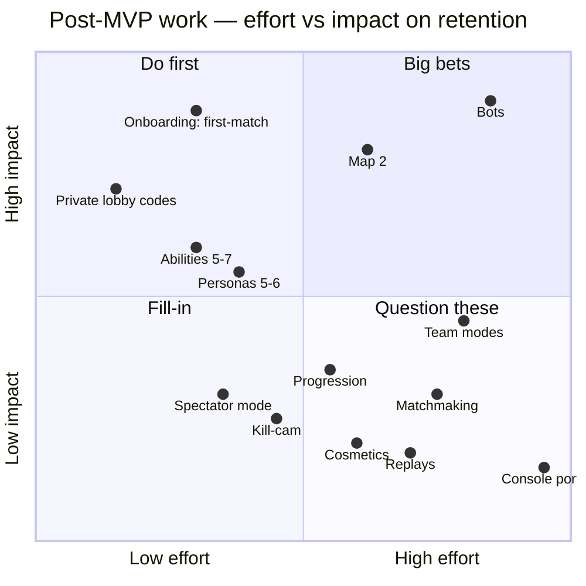

# GDD Part 8 — Beyond the MVP

> **Context restated.** Project Sottovoce is a 4–6 player social-stealth free-for-all set in a
> 120 × 120 m Renaissance city district populated by 60–90 AI civilians, including 8–12
> identical **clones** of each of four playable **personas**. Contracts form a single directed
> cycle: you hunt one player, an unknown player hunts you. Suspicion rises with speed and is
> erased by standing among the crowd. Matches are 8 minutes, decided by score, and patience
> is designed to beat aggression.
>
> **What this chapter is for.** The MVP ends at M6 with a game that works for six people who
> were arranged by hand. This chapter is about what happens next, and it is deliberately more
> pessimistic than the rest of the corpus — because the honest analysis in §4 is that **this
> genre's failure mode is not design quality, it is population**, and a design document that
> does not say so is not telling the truth.

---

## 1. What the MVP actually delivers

Stated precisely, so that "what's next" is measured from a real baseline rather than a hoped-for
one.

| Delivered at M6 | Not delivered |
|---|---|
| One map, one mode, four personas, four abilities, three passives | Any variety beyond that |
| A complete, tested, playable 8-minute loop | Any reason to play it a hundred times |
| Direct-IP lobbies for 4–6 players | Any way to find players you do not already know |
| A balance model with a falsification plan and ~18 player-matches of data | Enough data to *settle* the balance question ([`07_balance.md`](07_balance.md) open question 7) |
| Placeholder art and audio that is legible | Anything anyone would screenshot |
| A game that is good for one evening | A game that survives the second evening |

**The honest summary: M6 produces a validated prototype, not a product.** Every item in §2 is
about closing one of the gaps in the right-hand column, and the ordering is driven by which gap
kills the project first.

---

## 2. The post-MVP roadmap

### 2.1 The effort/impact grid

### 2.2 The prioritised list

Ordered by **which gap kills the project first**, not by appeal.

| # | Item | Effort | Impact | Why here | Gate |
|---|---|---|---|---|---|
| **1** | **Onboarding: surviving the first match** | M | **Very high** | Every retention problem downstream is worse if players quit in match one. §3. | Immediately post-M6 |
| **2** | **Private lobby codes** | S | High | Removes the direct-IP friction without building matchmaking. The cheapest possible population intervention. §4.4. | Immediately post-M6 |
| **3** | **Map 2** | L | High | One map is the single most-cited reason a session ends. Also: the map authoring checklist ([`05_level_design.md`](05_level_design.md) §8) is unvalidated until a second map is built with it. | After 3 more playtests on map 1 |
| **4** | **Abilities 5–7** | M | Med-high | Loadout space grows from 6 pairs to 21. Cheap variety per unit of effort, and the pipeline already supports ≤ 3 files per ability. Candidates ranked in [`04_abilities.md`](04_abilities.md) §8. | After map 2 |
| **5** | **Personas 5–6** | M | Medium | Crowd variety and silhouette space. Constrained: each new persona needs 8–12 clones, full animation parity, and a silhouette orthogonal to the existing four — which is the binding constraint, not the art. | After abilities |
| **6** | **Bots** | XL | **Very high, but conditional** | The only real answer to the population problem, and a research-grade problem. §4.5. | Only if §4's metrics say the population problem is real for us |
| **7** | **Progression** | L | Low-medium | Retention scaffolding, but actively harmful before balance is settled (§5). | After balance is closed |
| **8** | **Team modes** | XL | Medium | A second game's worth of balance work; see §5. | Post-progression, if ever |
| **9** | **Matchmaking** | L | Low **until** population exists | Matchmaking with no players is worse than direct IP: it fails silently instead of connecting friends. | Only after a measured population |
| **10** | **Spectator mode** | M | Low-medium | Useful for playtest observation and for the chase-theatre principle at a distance. Genuinely nice; not urgent. | Opportunistic |
| **11** | **Cosmetics** | L | Low, and **design-blocked** | Cosmetics are an anonymity leak by construction. Needs a design solution (crowd-wide propagation) before it is an art task. §5. | Blocked on design |
| **12** | **Kill-cam / replays** | M/L | Low, and **design-blocked** | Would reveal the killer's identity and position, permanently changing the paranoia economy. §5. | Blocked on design |
| **13** | **Console ports** | XL | Very low pre-population | Certification and input work with no revenue hypothesis attached. | Not foreseeable |

### 2.3 The three things that would change this ordering

Stated so the plan is falsifiable rather than a preference list:

1. **If playtests show players quitting mid-first-match**, item 1 becomes the only item until
   fixed.
2. **If players return for a second session but not a third**, item 3 (map 2) jumps to the top —
   content exhaustion is the diagnosis.
3. **If players want to play but cannot assemble a lobby**, items 2 and 6 dominate, and the
   whole plan becomes a population plan. §4.

---

## 3. The onboarding problem

### 3.1 The problem, stated precisely

A new player's first match is hostile in a way most games' are not:

| What happens | Why it is worse here than elsewhere |
|---|---|
| They die to a player they never saw | There is no kill-cam ([`../00_meta/SCOPE_FENCE.md`](../00_meta/SCOPE_FENCE.md) OUT #11), so the *cause* is invisible. |
| They sprint, because sprinting is what other games taught them | Sprinting reaches **Noticed** in 1.2 s and **Exposed** in 2.8 s. Their instincts are precisely inverted. |
| They cannot find their contract | The Compass gives a ±12° cone containing 8–14 identical figures. Without pocket literacy or pulse reading, this reads as "the game is not telling me anything". |
| They stun a stranger and are punished | `TUN-STUN-INVALID-STAGGER` 2.0 s + 20 suspicion. Correct design, hostile first experience. |
| Everyone else is standing still doing nothing visible | The skill they are losing to is *invisible* ([`07_balance.md`](07_balance.md) §6.3). |

**This is the "Tobias" persona from [`01_vision.md`](01_vision.md) §3.2**, and the design's
retention hinges on him: two bad matches and he is gone.

### 3.2 What the MVP already does about it

Not nothing — these are load-bearing and were designed for this:

| Mechanism | Effect |
|---|---|
| **The score feed names bonuses as they are earned** ([`06_ui_audio.md`](06_ui_audio.md) §3) | Teaches the vocabulary by using it. The intended ten-minute learning sequence is in §3.3 of that chapter. |
| **`TUN-SCORE-DEATH-PENALTY` = 0** | Dying costs 5 seconds, never points. A new player cannot be driven into an unrecoverable hole. |
| **`TUN-STUN-SCORE` = 200, twice a base kill** | A player who does nothing but hide and stun their pursuer scores. There is a floor strategy that works — and ADR-0018 doubled it precisely because *equal to a kill* under-paid the prey by half while looking like fidelity. It still loses to a well-made kill, which is the ordering design law 5 now states. |
| **Near-zero mechanical skill floor** ([`07_balance.md`](07_balance.md) §6.1) | Blend-walking and standing still require no execution. The correct play is also the easiest play. |
| **The crosshair ring is truthful** ([`06_ui_audio.md`](06_ui_audio.md) §2.2 F) | If the ring is there, the kill lands. Removes the "why didn't that work?" class of confusion entirely. |
| **Theatre spaces** ([`05_level_design.md`](05_level_design.md) §5) | Watching someone else sprint across Piazza Secca and get stunned teaches Law 1 for free. |
| **Suspicion source list on the HUD** ([`06_ui_audio.md`](06_ui_audio.md) §2.2 C) | Answers "why am I visible?" before the player has to ask. |

### 3.3 What is still missing, and the proposed fills

| # | Gap | Proposal | Effort | Notes |
|---|---|---|---|---|
| 1 | **Nothing teaches the inverted speed instinct before it costs a life.** | A **first-match speed coach**: the first three times a new player crosses into Noticed by sprinting, a single non-modal line appears — *"Sprinting made you visible. Walk to disappear."* Disabled permanently after three firings or one match. | S | Deliberately not a tutorial. It fires at the exact moment the lesson is relevant, three times, then never again. |
| 2 | **No safe place to learn the Compass.** | A **solo practice district**: the map, the crowd, one bot contract that never fights back, no timer, no score. Purely a place to learn what the pulse feels like at 40 m vs 15 m. | M | Requires a minimal bot (a walking target), far below the full bot problem in §4.5. |
| 3 | **A new player cannot tell that standing still is correct.** | On the **results screen**, add one line per player: *time spent Anonymous*, and highlight the winner's. It makes the invisible skill visible in the one place players are already comparing themselves. | S | The cheapest high-value item here. Data already exists (`TEL-TIME-BY-TIER`). |
| 4 | **Dying is uninformative.** | A **death card**: on death, three facts — your suspicion tier at the moment you died, your killer's name, and whether they were Anonymous when they initiated. **No position, no replay, no camera.** | S | Deliberately the *minimum* information that makes death legible without becoming a kill-cam. The third fact is the lesson: *"they were Anonymous — you could not have seen them, and that is what you should learn to do."* |
| 5 | **First-time loadout choice is uninformed.** | A **default recommended loadout** (Cinderfall + Second Face, Stillness) pre-selected for first-time players, with the lobby's full specs still visible. | S | Loadouts are locked for the match ([`04_abilities.md`](04_abilities.md) §5.1), so a bad first pick costs 8 minutes. |
| 6 | **No sense of progress within a session.** | Nothing. **Deliberately.** Progression is item 7 in §2.2 and is actively harmful pre-balance (§5). The session's reward is getting better, and the score feed is what makes that legible. | — | Recorded as a deliberate omission so it is not "fixed" reflexively. |

### 3.4 The onboarding target

> **A new player's third match should contain at least one kill scoring ≥ 350 points** (a clean
> walk-up: base + Silent + Patient).

That is the measurable definition of "they have learned the game". It is checkable from
`TEL-BONUS-FIRED` per match index, and it is a stronger target than a survey question because it
measures behaviour rather than opinion.

Supporting measure, from [`01_vision.md`](01_vision.md) §5 USP claim 5: a first-time player's
`TEL-MEAN-SPEED` must measurably decrease between their first and third match.

---

## 4. The population problem

### 4.1 The honest analysis

**This genre does not usually die of bad design. It dies of empty lobbies.**

The pattern, stated plainly:

1. Social stealth requires **4–6 simultaneous humans**. There is no meaningful single-player
   mode and no asynchronous version. The minimum viable session is six people deciding to play
   the same thing at the same time.
2. That is a **much higher coordination cost** than a game that is fun at two players or fun
   alone.
3. Historically, the mode has succeeded only when **attached to a large product** that supplied
   the population for free — and it has died, every time, when that product's population moved
   on. The mode did not get worse; the crowd left.
4. **Standalone attempts face a cold-start problem with no obvious exit.** A new player who
   queues and finds nobody does not queue again. Population decline is therefore
   self-accelerating in a way that quality cannot arrest.
5. **The 8-minute match length makes it worse.** A player who cannot fill a lobby has lost
   nothing by leaving; a player mid-match is committed for 8 minutes. The friction is all at
   the start, which is exactly where a fragile population cannot afford it.

**What this means for us:** we do not have a large product to attach to. So the population
problem is not something to solve after launch; it is a constraint on what we build.

### 4.2 What we are *not* going to pretend

| Comforting belief | Why it is false |
|---|---|
| "If the game is good enough, players will come." | Every previous attempt in this genre was also good. Quality is necessary and insufficient. |
| "Matchmaking will solve it." | Matchmaking is a *multiplier* on an existing population. Applied to zero, it yields zero — and it fails *silently*, which is worse than direct IP failing visibly. |
| "We'll add bots later." | Bots that can play social stealth convincingly are a research problem (§4.5). "Later" may mean "never", and a bad bot teaches players the wrong game. |
| "Streamers will carry it." | Possibly — the game is unusually watchable, which is a real asset (§4.6). But this is a lottery ticket, not a plan. |

### 4.3 The design decisions already made because of this

These are in the MVP *because* of the population analysis, not incidentally:

| Decision | Population rationale |
|---|---|
| **`TUN-LOBBY-MIN-PLAYERS` = 4, treated as a supported configuration** | Not a degraded mode. Crowd count, compass range and map area all scale ([`07_balance.md`](07_balance.md) §7). **Four humans is a much easier ask than six.** |
| **Direct IP first, no matchmaking** (`SCOPE_FENCE` OUT #4) | Private groups are the only population that reliably exists at launch. Serve them first and well. |
| **8 minutes, not 15** | Short enough that a filled lobby is worth assembling and a bad match is cheap. |
| **No accounts, no progression** | Nothing is lost by playing on someone else's machine, at a LAN, or after six months away. Zero re-entry friction. |
| **No cosmetics** | Also a design constraint (§5), but note it removes the "my stuff is over there" lock-in that makes returning feel obligatory rather than wanted. |

### 4.4 Mitigations, in order of cost

| # | Mitigation | Cost | Honest assessment |
|---|---|---|---|
| **1** | **Private lobby codes.** A 6-character code instead of an IP address. | S | **Do this first.** It does not create players; it removes friction from the players who already want to play together. Highest ratio of impact to effort in the entire post-MVP plan. |
| **2** | **Make 4 players genuinely good, not merely possible.** | M (mostly balance and one more theatre space — see [`05_level_design.md`](05_level_design.md) open question 1) | The single most valuable population work available, because it lowers the coordination threshold by a third. |
| **3** | **A persistent "practice district"** (§3.3 item 2) | M | Gives a player something to do when a lobby cannot be filled, instead of closing the game. Retention through the empty period. |
| **4** | **Scheduled community sessions** rather than an always-on queue | S (social, not technical) | Concentrates a small population into the same hours. This is what small-population games actually do, and it works. |
| **5** | **Bots** | XL | §4.5. |
| **6** | **Matchmaking** | L | Only worth building once §4.7's metric says a population exists. |

### 4.5 Bots — the honest assessment

A bot is the only intervention that *creates* the ability to play. It is also the hardest thing
in this document.

**Why it is hard here specifically:**

| Requirement | Difficulty |
|---|---|
| Move indistinguishably from an NPC clone while Anonymous | **Moderate.** The clone behaviours already exist; a bot can literally run the NPC state machine while idle. |
| Navigate to a contract using only Compass-equivalent information | **Moderate.** A bot could cheat here and nobody would notice, which is a legitimate shortcut. |
| **Be identifiable as a player by a skilled human** | **The hard part, inverted.** A bot that is *too* good at blending is indistinguishable from an NPC and the human never finds them, which is not fun. A bot that is worse is spotted instantly. The target band is narrow. |
| Decide when to commit to a kill | **Moderate.** |
| **Be fooled by human deception** | **Very hard.** A human blending in a crowd pocket should sometimes work against a bot. A bot with perfect information is not playing the same game, and a bot with realistic perception is a vision-and-inference problem. |
| Stun its pursuer at the right moment | **Hard.** Requires the bot to model *being hunted*, which is the half of the game with the least information. |

**The realistic first version:** a bot that plays the **Defender** archetype
([`07_balance.md`](07_balance.md) §4.9) — moves slowly, blends often, kills opportunistically,
stuns when warned. That archetype requires the least inference, is a legitimate way to play, and
scores mid-table so it neither dominates nor is free points. **It is also the archetype the
game most wants to teach**, so a lobby padded with Defender bots is teaching by example.

**The rule if bots ship:** bots are always visibly labelled in the lobby, never in the match. A
player must be able to know *how many* bots are in a match and never *which figures* they are.

### 4.6 The one genuine asset

The game is **unusually watchable**. A chase across Piazza Secca, a stun landing at the last
second, a player walking past their target three times — these read clearly to a spectator who
has never played, because the information channels
([`03_social_stealth.md`](03_social_stealth.md) §11) are mostly public and diegetic.

That is not a plan. But it is the reason spectator mode (§2.2 item 10) is worth more than its
grid position suggests, and the reason a 30-second clip of this game is more legible than a
30-second clip of most multiplayer games.

### 4.7 The metric that decides

> **Median time-to-fill a lobby, measured from the first player entering to the match starting.**

| Median fill time | Diagnosis | Response |
|---|---|---|
| < 2 min | Population is adequate for its current audience | Proceed with content (§2 items 3–5) |
| 2–10 min | Friction, not scarcity | Lobby codes, scheduled sessions, 4-player quality |
| > 10 min, or lobbies routinely abandoned | **The population problem is real for us** | Bots become the top priority regardless of cost |

This metric is cheap to collect and is the single number that should drive the post-MVP plan.
It is added to the telemetry set as `TEL-LOBBY-FILL-TIME`.

---

## 5. Explicitly out of scope, with reasons

Restating [`../00_meta/SCOPE_FENCE.md`](../00_meta/SCOPE_FENCE.md) §2 with the post-MVP view:
which of these are *schedule* cuts (they may return) and which are **design blocks** (they need
a design solution before they are an engineering task).

### 5.1 Design-blocked — needs a design answer, not effort

| Item | The block | What would unblock it |
|---|---|---|
| **Cosmetics** | **Cosmetics are an anonymity leak by construction.** Any visual customisation makes a player distinguishable from their 8–12 clones, which is the one thing the game cannot allow. | A **crowd-wide propagation** design: a cosmetic you equip also appears on your clones. Solvable, genuinely interesting, and unbuilt. Until then this is not an art task. |
| **Kill-cam / death replay** | Reveals the killer's **identity and position**. The paranoia economy depends on never knowing where your hunter was. | The death card (§3.3 item 4) is the deliberate 80 % solution: killer's name and their tier, no position, no camera. If more is wanted, someone must argue that knowing position is worth losing the fear. |
| **Voice chat** | Destroys the information economy. Players narrate positions aloud and the Compass stops being the primary channel. | Proximity-only voice with occlusion, designed as an *information channel* with a row in the §11 master table — including its latency and reliability. That is a design job, not an integration job. |
| **Minimap** | **Permanent.** Replaces the Compass with certainty and deletes the search. | Nothing. This one does not return. |
| **Global kill feed** | Tells every player how the contract cycle shifted, for free. | Nothing obvious. Deaths are learned diegetically by design. |

### 5.2 Schedule cuts — will likely return

| Item | Why deferred | Return condition |
|---|---|---|
| **Team modes** | The contract graph stops being a Hamiltonian cycle and becomes a bipartite assignment problem. More importantly, **a teammate is a free information channel**, which changes the information economy fundamentally — the entire §11 master table would need re-derivation. A second game's worth of balance work. | After the free-for-all balance model is validated against real telemetry ([`07_balance.md`](07_balance.md) §4.7) |
| **Progression / unlocks** | Requires persistence → accounts → a backend and its security surface. **Also actively harmful pre-balance**: unlocks create power asymmetry that masks whether the base loop is fun. `IProfileStore` is stubbed so the seam exists (ASM-0026). | After balance is closed |
| **Matchmaking** | §4.2. | After `TEL-LOBBY-FILL-TIME` says a population exists |
| **Additional maps** | One map iterated ten times teaches more about social-stealth level design than three maps built once. | After 3 more playtests on map 1 |
| **Console ports** | Certification and input work with no revenue hypothesis. | Not foreseeable |
| **Mobile** | Input model is incompatible with traversal and blend verbs. A redesign, not a port. | Not foreseeable |
| **Anti-cheat beyond server authority** | Server authority already removes the exploits that matter (teleport-kill, score injection, suspicion spoofing). Anything further needs accounts and a population to be worth its cost. | With accounts |
| **Localisation** | All user-facing text goes through a string table from commit one (ASM-0023), so this is a data task whenever it is wanted. | On demand |
| **Replays / telemetry dashboards** | Telemetry *events* are logged from M5; the dashboard to read them is a spreadsheet until it isn't. | When the spreadsheet hurts |

---

## 6. What would make this project worth continuing

Stated as falsifiable conditions, so that "should we keep going?" is answerable with evidence
rather than sentiment. Assessed after the three M6 playtests plus three more.

| # | Condition | Measured by | Threshold |
|---|---|---|---|
| 1 | **The turn happens.** Mean player speed drops measurably between minute 1 and minute 4. | `TEL-MEAN-SPEED` by match minute | Observed in ≥ 4 of 6 playtests |
| 2 | **New players learn.** Third-match players land a ≥ 350-point kill. | `TEL-BONUS-FIRED` by match index | ≥ 60 % of new players |
| 3 | **Patience wins, but not absolutely.** | `TEL-SCORE` by `TEL-MEAN-SPEED` tercile | Patient wins 60–85 % of head-to-heads |
| 4 | **People ask to play again.** | Post-session question 12 | ≥ 70 % yes |
| 5 | **Lobbies fill.** | `TEL-LOBBY-FILL-TIME` | Median < 10 min |
| 6 | **The crowd works.** Contracts are not identified on first visual contact. | `TEL-FIRST-CONTACT-OUTCOME` | < 40 % correct |

**If 1, 2 and 4 hold and 5 does not**, the game is good and the problem is population — proceed
to §4.4 and §4.5.

**If 1 or 4 fails**, the loop is not working and no amount of content or population will fix it.
That is the outcome this whole documentation corpus exists to detect early and cheaply.

---

## 7. Acceptance criteria

- [ ] Every post-MVP item in §2.2 has an effort estimate, an impact claim and an explicit gate.
- [ ] Every design-blocked item in §5.1 states the specific design problem that blocks it, not just "deferred".
- [ ] `TEL-LOBBY-FILL-TIME` is added to the telemetry set in [`07_balance.md`](07_balance.md) §8 and implemented at M6.
- [ ] The onboarding target in §3.4 is measurable from `TEL-BONUS-FIRED` without additional instrumentation.
- [ ] The six continuation conditions in §6 are each measurable from telemetry or the standard playtest questionnaire ([`../30_bible/TEST_PLAN.md`](../30_bible/TEST_PLAN.md) §6).
- [ ] No item in §2.2 is scheduled ahead of its stated gate.
- [ ] No story exists in `40_backlog/stories/` implementing anything in §5 without an ADR.

---

## 8. Failure modes

| # | Failure | Symptom | Response |
|---|---|---|---|
| 1 | **Content is built before onboarding.** | Map 2 ships; retention does not move. | §2.3 rule 1. Onboarding gates everything because every downstream metric is measured on players who survived match one. |
| 2 | **Progression is added to fix retention.** | Unlocks ship pre-balance; the balance model becomes unmeasurable because power is no longer uniform. | The most likely self-inflicted wound in this document. Progression is item 7 for a reason. |
| 3 | **Matchmaking is built into an empty population.** | A queue that never fills, failing silently. | §4.2. The metric in §4.7 gates it. |
| 4 | **Bots ship badly.** | Bots are trivially identifiable, or unfindable. Either way players learn the wrong game. | §4.5's narrow band is the whole difficulty. If the band cannot be hit, shipping no bots is better than shipping bad ones. |
| 5 | **Cosmetics ship without the propagation design.** | Players become distinguishable from their clones; the core promise breaks silently. | §5.1. This is a design block, not a backlog item. |
| 6 | **The population question is never asked.** | The team builds content for two years without measuring whether anyone can assemble a lobby. | `TEL-LOBBY-FILL-TIME` from M6. One number. |
| 7 | **§6's conditions are assessed on vibes.** | "It felt good" substitutes for the thresholds. | The thresholds are numeric and the data is already collected. Use them. |

---

## 9. Open questions

| # | Question | Position taken | Needed by |
|---|---|---|---|
| 1 | **Is the population problem fatal for a standalone game in this genre?** The honest answer is "possibly". Every prior success was attached to a large product. | Proceed, but measure `TEL-LOBBY-FILL-TIME` from M6 and treat §4.7 as a genuine decision point rather than a formality. | Post-M6 |
| 2 | Should 4-player be the *design centre* rather than 6? It would lower the coordination threshold by a third — the single biggest population lever available. The cost is the contract cycle's information properties, which degrade fastest at low counts ([`07_balance.md`](07_balance.md) §7.2). | Currently 6 (ASM-0006). **This is worth revisiting seriously if fill times are bad**, and it is a bigger decision than it looks. | M6 |
| 3 | Is the death card (§3.3 item 4) a kill-cam by increments? It reveals the killer's name and tier. Each addition will seem small. | Ship the three facts named, and treat *position* and *replay* as the bright line that requires an ADR to cross. | Post-M6 |
| 4 | Should the practice district (§3.3 item 2) be built before M6 rather than after? It would improve the quality of playtest data by removing first-contact confusion from the measurements. | Tempting, and it is scope-fence expansion. Requires an ADR. | M6 |
| 5 | Is "unusually watchable" (§4.6) worth building spectator mode early to exploit? | Not on the evidence available. Revisit if any external interest materialises. | Opportunistic |
