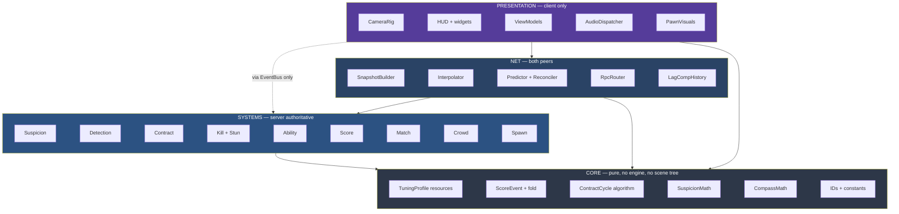

# TDD Chapter 1 — Architecture

> **Context restated for a reader who has read nothing else.** Project Sottovoce is a 4–6
> player social-stealth game in Godot 4.7.1 (Forward+, GDScript). A dedicated headless server is
> authoritative over everything that decides an outcome: suspicion, detection, contracts,
> kills, stuns and score. Clients predict only their own pawn and interpolate everything else.
> The map holds 60–90 server-simulated NPCs, including 8–12 identical **clones** of each of
> four playable **personas** — the crowd is gameplay state, not decoration.
>
> **Implements:** `SYS-EVENTBUS`, `SYS-TUNING`. **Constrains:** every other system.

---

## 1. The four layers



### 1.1 Layer definitions

| Layer | Contains | May depend on | Runs on | Test style |
|---|---|---|---|---|
| **Core** | Tuning resources, pure algorithms, immutable data types, ID constants | **Nothing** | Both | Pure unit tests, no engine |
| **Systems** | Gameplay simulation. Every rule that decides an outcome. | Core | **Server only** | Unit + headless integration |
| **Net** | Replication, RPC, prediction, reconciliation, interpolation, lag compensation | Core, Systems | Both (different halves) | Headless 3-client harness |
| **Presentation** | Camera, HUD, widgets, view models, audio dispatch, pawn visuals, VFX | Core, and Systems **only via `EventBus`** | **Client only** | View-model unit tests |

### 1.2 The dependency rule

> **Dependencies point downward only. Presentation depends on Systems; Systems must never
> depend on Presentation. There are no cycles anywhere in the graph.**

Two distinct constraints are bundled in that sentence, and both matter:

**(a) Direction.** A file in `scripts/systems/` may not `preload`, reference, or name any class
in `scripts/ui/`, `scripts/camera/` or `scripts/audio/`. The reverse is permitted *in
direction*.

**(b) Mechanism.** Even though the direction permits it, Presentation does **not** hold direct
references to Systems nodes. All access is mediated by `EventBus` and view models (ADR-0006).

Why both: the direction rule keeps the graph acyclic and makes the server buildable without any
presentation code at all — which is what makes the headless server possible. The mechanism rule
keeps the HUD from breaking when a gameplay node moves in the scene tree, and makes every widget
unit-testable by constructing a view model.

**The single test that proves the direction rule holds:** the headless server export excludes
`scripts/ui/`, `scripts/camera/`, `scripts/audio/` and `assets/` entirely and still runs a full
match. If it does not, a dependency has leaked upward.

### 1.3 What goes in Core, precisely

Core is the layer people get wrong, so the boundary is stated as a test:

> **A Core file must be `class_name`-declared, must not extend `Node`, must not call
> `get_node`, `get_tree`, `Engine.*` or any autoload, and must be constructible and fully
> exercisable from a unit test with no scene.**

| In Core | Not in Core |
|---|---|
| `SuspicionMath.integrate(state, inputs, dt) -> float` | The node that calls it every tick |
| `ContractCycle` (the list, the insert/remove algorithm, the validity invariant) | The system that reacts to a death |
| `ScoreEvent`, `ScoreLog.fold()` | The system that appends events |
| `CompassMath.pulse_period(distance) -> float` | The widget that draws it |
| `TuningProfile` and its sub-resources | The `Tuning` autoload that loads them |
| `Ids` (the `SYS-`/`TUN-`/`SCORE-` `StringName` constants) | — |

This boundary is what makes the highest-risk logic in the project — the contract cycle, the
suspicion integrator, the score fold, the compass curve — testable in milliseconds with no
engine, which is the single largest lever on defect rate available here.

---

## 2. Autoload inventory

Autoloads are global singletons. Every one is a permanent, invisible dependency for the whole
project, so each needs a justification and each is a cost.

| # | Autoload | Script | Justification | State? |
|---|---|---|---|---|
| 1 | `Tuning` | `scripts/autoload/tuning.gd` | Every system reads gameplay constants (ADR-0005: no literals anywhere). A singleton is the only alternative to threading a `TuningProfile` reference through every constructor. Also owns hot reload and the server→client profile sync. | Yes — the loaded profile |
| 2 | `EventBus` | `scripts/presentation/event_bus.gd` | The one-way Systems→Presentation channel (ADR-0006). **Signal declarations and documentation comments only — no `var`, no `func`.** A stateful event bus is a global variable in disguise. | **No — enforced by test** |
| 3 | `Net` | `scripts/net/net.gd` | Owns the `ENetMultiplayerPeer`, peer lifecycle, role (`server`/`client`), and RTT statistics. Needed by systems (authority checks) and presentation (connection UI). | Yes — peer table, RTT |
| 4 | `GameState` | `scripts/autoload/game_state.gd` | The client's read-only mirror of match phase, local peer id, and lobby roster. Presentation needs this constantly; making it an autoload avoids every widget doing a scene-tree lookup. **Client-side it is written only by `Net`.** | Yes — read-only mirror |
| 5 | `Log` | `scripts/autoload/log.gd` | Structured logging plus the `TEL-` telemetry sink ([`../10_gdd/07_balance.md`](../10_gdd/07_balance.md) §8). Called from everywhere; must not require a reference. | Yes — sink buffer |
| 6 | `Audio` | `scripts/presentation/audio/audio.gd` | Maps `SFX-` IDs to buses, positions and ducking rules ([`../10_gdd/06_ui_audio.md`](../10_gdd/06_ui_audio.md) §6). Subscribes to `EventBus`; called directly only by presentation. | Yes — bus state, duck stack |
| 7 | `Strings` | `scripts/autoload/strings.gd` | String-table lookup (ASM-0023: no literal user-facing text anywhere). | Yes — loaded table |
| 8 | `DebugConsole` | `scripts/debug/debug_console.gd` | Tunable overrides, state dumps, the lag-comp visualiser ([`12_build_and_ci.md`](12_build_and_ci.md) §5). **Stripped from release exports** by an export filter. | Yes — command registry |

**Eight autoloads.** Every addition requires an ADR.

### 2.0 Why autoloads live in `scripts/autoload/`, not `scripts/core/`

An autoload **must** extend `Node`. Core's contract (§1.3) is that it never does — that is
what makes Core unit-testable with no engine. The two cannot both hold in one folder.

So the split is: **`TuningProfile` resources stay in `scripts/core/tuning/`** (pure data,
unit-testable), while **the `Tuning` autoload that loads them lives in `scripts/autoload/`**.
Same for `GameState`, `Log` and `Strings`.

This contradiction survived the whole documentation phase and was caught in M0 by
`test_core_is_pure.gd` on its first run — which is the architecture guards doing exactly the
job they exist for.

### 2.1 What was deliberately rejected as an autoload

Recorded so these do not get added later by someone who did not know they were considered:

| Rejected | Why | What to do instead |
|---|---|---|
| `MatchManager` / `GameManager` | A god-object attractor. Every "where should this go?" answer becomes "the manager", and within a milestone it is 900 lines. | `MatchDirector` is a **node** in the server scene, with a bounded lifetime tied to the match. |
| `PlayerRegistry` | Player state is owned by the systems that simulate it and mirrored by `GameState`. A second global registry would be a second source of truth. | `Net.peers` for identity; systems own gameplay state. |
| `ScoreManager` | Score is an event log folded on demand (ADR-0004). A global score singleton would invite direct mutation, which is exactly what the ADR forbids. | `ScoreSystem` node on the server; `ScoreMirror` on the client. |
| `SuspicionManager` | Same reasoning — server-only, per-match lifetime. | `SuspicionSystem` node. |
| `Utils` / `Helpers` | Unnamed grab-bags never shrink. | Named static classes in Core (`SuspicionMath`, `CompassMath`, `Geometry2DExt`). |
| `Signals` (a second bus for gameplay) | System-to-system communication uses direct typed calls, because gameplay **ordering matters** and a bus makes ordering invisible (ADR-0006 rule 5). | Direct references, wired by `MatchDirector`. |

---

## 3. Scene-tree topology

The client and the server run **different root scenes**. This is deliberate: it is what allows
the server export to contain no presentation code, and it makes "is this server-only?" a
question answerable by looking at which scene the node is in.

### 3.1 Server (headless, `--server`)

```
/root
└── ServerRoot                          server_root.tscn
    ├── MatchDirector                   SYS-MATCH — owns phase, wires systems, per-match lifetime
    ├── Systems                          (plain Node container; ordering is explicit, see §4)
    │   ├── ContractSystem               SYS-CONTRACT
    │   ├── SpawnSystem                  SYS-SPAWN
    │   ├── SuspicionSystem              SYS-SUSPICION
    │   ├── DetectionSystem              SYS-DETECTION
    │   ├── AbilitySystem                SYS-ABILITY
    │   ├── KillSystem                   SYS-KILL
    │   ├── StunSystem                   SYS-STUN
    │   └── ScoreSystem                  SYS-SCORE  (owns the append-only ScoreEvent log)
    ├── World
    │   ├── MapVetraio                   MAP-VETRAIO — collision, navmesh, anchors, spawns
    │   ├── Pawns
    │   │   └── Pawn_<peer_id>           authoritative pawn; PawnStateMachine, no visuals
    │   └── Crowd                        SYS-CROWD
    │       ├── CrowdDirector            group slots, gawk tokens, clone distribution
    │       └── Npcs
    │           └── Npc_<index>          NpcBrain (HFSM) + NavigationAgent3D
    └── NetServer
        ├── RpcRouter                    validates authority on every inbound message
        ├── SnapshotBuilder              per-client delta + culling + quantisation
        └── LagCompHistory               500 ms ring buffer of pawn and NPC transforms
```

### 3.2 Client

```
/root
└── ClientRoot                          client_root.tscn
    ├── World
    │   ├── MapVetraio                   same scene, visuals enabled
    │   ├── Pawns
    │   │   ├── LocalPawn                predicted; runs the SAME PawnStateMachine as the server
    │   │   └── RemotePawn_<peer_id>     interpolated only; no state machine
    │   └── Crowd
    │       └── NpcView_<index>          interpolated transform + AnimationTree. NO brain, NO agent
    ├── NetClient
    │   ├── InputSender                  60 Hz InputCommand
    │   ├── Predictor                    runs PawnStateMachine locally against unacked input
    │   ├── Reconciler                   replays the input buffer on divergence
    │   └── SnapshotInterpolator         100 ms buffer, per-entity receive-timestamp based
    ├── Mirrors                          read-only replicated gameplay state
    │   ├── SuspicionMirror              own value + own tier + others' tiers as rendered
    │   ├── ContractMirror               bearing, distance bucket, lock fraction, portrait state
    │   ├── ScoreMirror                  local fold over received ScoreEvents
    │   └── MatchMirror                  phase, time remaining, multiplier
    └── Presentation
        ├── CameraRig                    SYS-CAMERA — spring arm, FOV by speed state
        ├── ViewModels                   CompassVM, TierVM, ScoreFeedVM, MatchVM, PortraitVM
        ├── HUD                          SYS-HUD
        │   ├── CompassWidget
        │   ├── ContractPortrait
        │   ├── TierIndicator
        │   ├── ScoreFeed                SYS-SCOREFEED
        │   ├── AbilitySlots
        │   ├── MatchTimer
        │   └── Crosshair
        └── AudioListener3D
```

### 3.3 The three topology rules

| # | Rule | Enforced by |
|---|---|---|
| 1 | **`Systems/` exists only in `server_root.tscn`.** A client never instantiates a system. | `test_client_has_no_systems.gd` asserts the client scene tree contains no node extending `GameSystem` |
| 2 | **`NpcView` has no brain, no navigation agent and no `step()`.** Clients do not simulate the crowd (ADR-0007). | `test_npcview_is_inert.gd` |
| 3 | **`Mirrors/` nodes are write-only from `NetClient` and read-only from everything else.** | Mirrors expose getters and no setters; writes go through a `_apply_snapshot()` method callable only by `NetClient` |

### 3.4 Why the local pawn shares its state machine with the server

`LocalPawn` and the server's `Pawn_<peer_id>` run **the same `PawnStateMachine` and the same
`PawnState` classes** (ADR-0008). This is required by prediction: reconciliation replays
buffered inputs through the identical code path the server used, so any divergence in the state
machine is a divergence in prediction.

The consequence for the code: `PawnState.step()` must be a pure function of
`(ctx, input, delta)` with no randomness, no wall clock, no scene-tree lookups and no autoload
access other than `Tuning`. That constraint is checked by grep in CI
([`06_player_pawn.md`](06_player_pawn.md) §7).

---

## 4. System ordering

Systems are ticked in an explicit, fixed order by `MatchDirector`. **Ordering is not left to
scene-tree order**, because scene-tree order is an invisible dependency that breaks when
somebody drags a node.

```mermaid
flowchart LR
    A["1. Ingest inputs<br/>RpcRouter -> pawns"] --> B["2. Pawn movement<br/>PawnStateMachine.step()"]
    B --> C["3. Crowd<br/>CrowdDirector + NpcBrain"]
    C --> D["4. Suspicion<br/>needs final positions + crowd"]
    D --> E["5. Detection<br/>needs final suspicion tiers"]
    E --> F["6. Abilities<br/>validate, apply, expire"]
    F --> G["7. Kill / Stun<br/>lag-comp rewind, contest resolve"]
    G --> H["8. Contract<br/>repair cycle after deaths"]
    H --> I["9. Score<br/>append ScoreEvents"]
    I --> J["10. Snapshot<br/>build + send"]
```



### 4.1 Why this order, at the three places it matters

| Boundary | Why |
|---|---|
| **Crowd (3) before Suspicion (4)** | `TUN-SUSPICION-GAIN-OPEN` depends on whether any NPC is within `TUN-SUSPICION-OPEN-RADIUS` 6 m, and blend-pocket validity depends on NPC positions. Suspicion computed against last tick's crowd would let a player accrue "alone" suspicion inside a pocket that has already re-formed. |
| **Suspicion (4) before Detection (5)** | Detection renders per-observer state from **tier**. One tick of lag here means the silhouette tint disagrees with the tier indicator, which is an information-channel defect ([`../10_gdd/03_social_stealth.md`](../10_gdd/03_social_stealth.md) §11). |
| **Kill/Stun (7) before Contract (8)** | The cycle must be repaired in the same tick the death resolves, so no player is ever contractless at a tick boundary — the invariant proved in [`../10_gdd/03_social_stealth.md`](../10_gdd/03_social_stealth.md) §7.4. |

---

## 5. Interfaces

The base contracts every layer is built on. Full per-system signatures are in their own
chapters; these are the shapes that define the architecture.

```gdscript
## Base class for every server-authoritative gameplay system.
## Systems are ticked explicitly by MatchDirector in the order defined in TDD-01 §4.
## A system NEVER references anything in scripts/ui/, scripts/camera/ or scripts/audio/.
class_name GameSystem
extends Node

## Wired once by MatchDirector before the first tick. Systems receive their
## dependencies explicitly rather than looking them up, so the dependency graph
## is visible in one file.
func setup(ctx: MatchContext) -> void:
    pass

## Advance one server tick. dt is always 1.0 / TUN-NET-SERVER-TICK (33.3 ms).
## Never called on a client.
func tick(ctx: MatchContext, dt: float) -> void:
    pass

## Called when the match ends. Systems must release all per-match state here.
func teardown() -> void:
    pass
```

```gdscript
## Everything a system needs, passed explicitly. Constructed by MatchDirector.
## This is the project's dependency-injection seam: if it is not on MatchContext,
## a system cannot reach it.
class_name MatchContext
extends RefCounted

var tick: int                              ## Monotonic server tick since match start.
var phase: MatchPhase                      ## LOBBY | COUNTDOWN | PLAYING | FINAL | RESULTS
var pawns: Dictionary                      ## peer_id -> PawnServer
var crowd: CrowdDirector
var cycle: ContractCycle                   ## Core type; see TDD-10
var score_log: ScoreLog                    ## Core type; append-only
var lag_comp: LagCompHistory
var map: MapData
```

**AS BUILT, 2026-08-25.** The fields arrive with the systems that own them, so the sketch above
is a plan rather than an inventory. What is actually on it, and why each is here rather than
reachable through the system that fills it — *a system whose answers come from another system's
field cannot be asked a question in a test*:

| Field | Written by | Read by |
|---|---|---|
| `tick`, `phase`, `map`, `rng`, `match_seed` | `MatchDirector`, `server_root` | everything |
| `pawns` — peer -> `CharacterBody3D` | `PawnHost` | crowd LOD, startle, the snapshot |
| `pawn_contexts` — peer -> `PawnContext` | `PawnHost`, **on the line beside `pawns`** | suspicion, blend, detection |
| `slots` — peer -> wire slot | `Net` at the handshake | anything that names a player on the wire |
| `lag_comp` | `LagCompRecorder` | nothing until `SYS-KILL` |
| `crowd_hash` | `CrowdDirector`, top of the `crowd` stage | suspicion, blend, startle, gawk |
| `crowd` — `NpcPool` | `server_root` | the crowd systems and the snapshot |
| `formations` | `CrowdDirector.setup()` | `SYS-BLEND`, for the fifth slot |
| `announced_contracts` | `ContractSystem`, **adopted by reference** | `SYS-DETECTION`, and the Compass at US-0057 |
| `render_states` | `SYS-DETECTION` | `SnapshotBuilder`, four stages later |

**`cycle` and `score_log` are still absent.** The cycle lives on `ContractSystem` because
detection needs the *announced* view rather than the graph's, and `ScoreLog` is US-0064's.
`GameSystem` and `MatchContext` are also in `scripts/systems/` rather than `scripts/core/`, where
§6's file table puts them: `GameSystem extends Node` and a context holding live pawns is server
state, not a value type.

```gdscript
## Base class for every HUD widget. A widget's ENTIRE input is its view model.
## A widget that calls get_node() outside its own subtree is a defect (ADR-0006).
class_name Widget
extends Control

## Assigned once at construction by the HUD root. Never looked up.
var vm: ViewModel

func _ready() -> void:
    assert(vm != null, "Widget requires a view model; see ADR-0006")

## Called at display rate. Reads ONLY from vm.
func refresh(_delta: float) -> void:
    pass
```

```gdscript
## Base class for view models. A view model subscribes to EventBus and exposes
## plain data. It owns presentation-only state (animation phase, interpolated
## values, formatted strings) so widgets stay pure.
class_name ViewModel
extends RefCounted

signal changed

func _init() -> void:
    _subscribe()

## Connect to EventBus signals here. Never to a gameplay node.
func _subscribe() -> void:
    pass
```

---

## 6. Files this chapter creates

| Path | Purpose |
|---|---|
| `project.godot` | Engine config; Forward+; the eight autoloads in §2 |
| `scenes/server_root.tscn` | Server topology (§3.1) |
| `scenes/client_root.tscn` | Client topology (§3.2) |
| `scripts/systems/game_system.gd` | `GameSystem` base class. **Not Core** — it extends `Node`, and `test_core_is_pure.gd` refuses that; §1.3 draws the line where the guard does (US-0027) |
| `scripts/systems/match_context.gd` | `MatchContext`. **Not Core** — it holds live pawns, which is server state rather than a value type |
| `scripts/core/match_phase.gd` | `MatchPhase` enum. Pure, and Core, because the phase gates rules |
| `scripts/core/system_order.gd` | `SystemOrder` — §4's order as a list. Pure so a guard can compare it against the diagram above |
| `scripts/core/game_state.gd` | `GameState` autoload |
| `scripts/core/log.gd` | `Log` autoload — structured log + `TEL-` sink |
| `scripts/core/strings.gd` | `Strings` autoload |
| `scripts/core/ids.gd` | `Ids` — `StringName` constants for every ID namespace |
| `scripts/presentation/event_bus.gd` | `EventBus` autoload (signals only) |
| `scripts/presentation/widget.gd` | `Widget` base class |
| `scripts/presentation/view_model.gd` | `ViewModel` base class |
| `scripts/server/match_director.gd` | `MatchDirector` — ordering (§4), lifetime |
| `scripts/net/net.gd` | `Net` autoload |
| `scripts/debug/debug_console.gd` | `DebugConsole` autoload (debug builds only) |

---

## 7. Test hooks

| Test | Asserts |
|---|---|
| `test_layer_dependencies.gd` | No file under `scripts/systems/` or `scripts/core/` references any identifier from `scripts/ui/`, `scripts/camera/` or `scripts/audio/`. Implemented as a source scan. |
| `test_core_is_pure.gd` | No file under `scripts/core/` extends `Node`, or contains `get_node`, `get_tree`, `Engine.`, or an autoload name other than in a comment. |
| `test_eventbus_is_stateless.gd` | `event_bus.gd` contains only `signal` declarations, comments and blank lines. |
| `test_client_has_no_systems.gd` | Instantiating `client_root.tscn` produces no node extending `GameSystem`. |
| `test_npcview_is_inert.gd` | `NpcView` has no `NavigationAgent3D` child and no `step`/`tick` method. |
| `test_headless_server_runs_without_presentation.gd` | A server export with `scripts/ui/`, `scripts/camera/`, `scripts/audio/` and `assets/` excluded completes a full simulated match. **The definitive proof of §1.2(a).** |
| `test_system_tick_order.gd` | `MatchDirector` ticks systems in exactly the §4 order; asserted against a recorded call sequence. |
| `test_autoload_inventory.gd` | `project.godot` declares exactly the eight autoloads in §2 — no more, no fewer. Adding one fails CI until the ADR and this table are updated. |
| `test_widgets_have_view_models.gd` | Every node extending `Widget` in `client_root.tscn` has a non-null `vm` after `_ready`. |

---

## 8. Performance budget contribution

Against `TUN-PERF-FRAME-BUDGET` 16.6 ms (client) and `TUN-PERF-SERVER-TICK-BUDGET` 8.0 ms
(server, per 33 ms tick).

| Item | Budget | Notes |
|---|---|---|
| Autoload access (`Tuning` property lookups) | **≤ 0.10 ms** | ADR-0005's acknowledged cost. The crowd steering layer is the one permitted exception and caches its values at LOD transitions. |
| `EventBus` signal dispatch | **≤ 0.05 ms** | Event-driven, not per-frame. At ~30 events/s this is negligible; it is budgeted so that a regression (a signal emitted per frame per NPC) is caught. |
| View-model updates | **≤ 0.15 ms** | Part of `TUN-PERF-UI-BUDGET` 1.0 ms. |
| `MatchDirector` orchestration overhead | **≤ 0.05 ms** (server) | Ten virtual calls per tick. |
| **Architecture total (client)** | **≤ 0.30 ms** of 16.6 ms | |
| **Architecture total (server)** | **≤ 0.15 ms** of 8.0 ms | |

**The architectural decision with the largest performance consequence is not in this chapter** —
it is ADR-0007 (server-simulated crowd), which spends 2.0 ms of client frame budget and 63 % of
the bandwidth budget. Chapter 8 owns that.

---

## 9. Open questions

| # | Question | Position | Needed by |
|---|---|---|---|
| 1 | Should `GameState` exist, or should presentation read match phase from `MatchMirror` like everything else? `GameState` is the least-justified autoload — it exists for convenience. | Keep for now; it is also needed pre-match (lobby, connection UI) when no `MatchMirror` exists. Revisit at M2 when the mirror set is real. | M2 |
| 2 | `MatchContext` is passed to every system's `tick()`. It will accrete fields. What is the ceiling before it becomes a god-object? | Review at every milestone exit. If it exceeds ~12 fields, split into `WorldContext` and `MatchContext`. | M4 |
| 3 | Should `Audio` subscribe to `EventBus` directly, or should an `AudioViewModel` mediate as it does for widgets? Direct subscription is simpler but makes `Audio` the one presentation component without a view model. | Direct for MVP. The audio dispatcher is a pure event→bus mapping with no interpolated state, so a view model would be an empty shell. | M5 |
