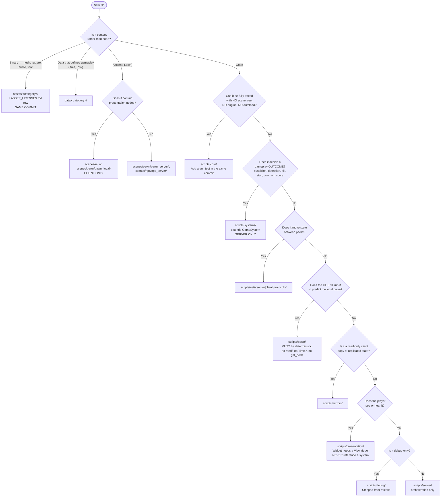

# TDD Chapter 2 — Project Structure

> **Context restated.** Project Sottovoce is a Godot 4.7.1 / GDScript social-stealth game with a
> dedicated headless server that is authoritative over all gameplay outcomes. The code is
> organised in four layers — Core (pure, no engine), Systems (server-only simulation), Net
> (replication and prediction), Presentation (client-only) — with dependencies pointing
> downward only ([`01_architecture.md`](01_architecture.md) §1).
>
> **This chapter's job:** make "where does this file go?" answerable in under ten seconds,
> without asking anyone. That matters more than usual here because agents work in this repo
> across sessions with no memory, and a misplaced file breaks the layer rule silently.

---

## 1. The full tree

```
/
├── project.godot                  Engine config. Forward+, the 8 autoloads, input map, layers.
├── .godot-version                 Pinned engine version. CI installs exactly this (ADR-0001).
├── .gitattributes                 LFS patterns for binaries; LF normalisation.
├── .gitignore
├── CLAUDE.md                      Repo-root agent brief. Copied from docs/30_bible/CLAUDE.md_SEED.md.
├── export_presets.cfg             Windows/Linux client + headless server presets.
│
├── .ci/                           CI support files, not shipped.
│   ├── banned_terms.txt           IP guardrail grep list (docs/00_meta/IP_GUARDRAILS.md §6.1).
│   ├── ip_guard_exclude.txt       The two files exempt from the grep. Adding a third needs an ADR.
│   └── check_asset_inventory.sh   Bidirectional asset-licence check.
│
├── .github/workflows/
│   └── ci.yml                     import, lint, test, ip-guard, asset-inventory, export.
│
├── addons/
│   └── gut/                       GUT test framework. Dev-only; excluded from every export.
│
├── assets/                        ALL non-code content. Every third-party file needs a row
│   │                              in docs/00_meta/ASSET_LICENSES.md, same commit.
│   ├── greybox/                   Primitives and greybox materials (ASM-0029). Licence-exempt.
│   ├── procedural/                Generated at import by our own tool scripts. Licence-exempt.
│   ├── personas/                  Meshes, materials, rigs. One folder per persona.
│   │   ├── vetraio/ cantatrice/ lucerna/ pesatore/
│   ├── archetypes/                Non-playable NPC filler (porter, watercarrier, child, ...).
│   ├── animations/                Shared clips. Clone-parity set lives here (ANIMATION_SPEC §6).
│   ├── maps/vetraio/              MAP-VETRAIO geometry, once past greybox.
│   ├── audio/                     One subfolder per bus: info/, ambience/, music/, ui/.
│   ├── ui/                        Fonts, icons, ninepatches.
│   │   └── icons/                 Small, frequently-changed PNGs — deliberately NOT in LFS.
│   └── vfx/
│
├── data/                          Resources that DEFINE gameplay. Text, diffable, no LFS.
│   ├── tuning/
│   │   ├── default/               THE shipping values. One .tres per TUNABLES.md section.
│   │   │   ├── movement.tres suspicion.tres compass.tres combat.tres contract.tres
│   │   │   ├── crowd.tres match.tres scoring.tres camera.tres net.tres feature_flags.tres
│   │   │   └── abilities/         cinderfall.tres whisperbolt.tres second_face.tres lunge.tres
│   │   │                          stillness.tres cold_read.tres second_wind.tres
│   │   └── local/                 GITIGNORED. Solo experimentation; refused in networked matches
│   │                              by profile-hash comparison (ADR-0005 rule 6).
│   ├── personas/                  PersonaData .tres — silhouette class, mesh ref, anim set.
│   ├── maps/                      MapData .tres — spawns, anchors, circuits, zones, blend props.
│   └── strings/en.csv             THE string table. No literal user-facing text anywhere (ASM-0023).
│
├── scenes/
│   ├── server_root.tscn           Server topology (TDD-01 §3.1). No presentation nodes.
│   ├── client_root.tscn           Client topology (TDD-01 §3.2).
│   ├── boot.tscn                  Entry point. Branches on --server.
│   ├── pawn/                      pawn_server.tscn, pawn_local.tscn, pawn_remote.tscn
│   ├── npc/                       npc_server.tscn (brain+agent), npc_view.tscn (inert)
│   ├── map/                       map_vetraio.tscn + blend props, spawn markers, zone volumes
│   └── ui/                        main_menu, lobby, hud, results, options + widget scenes
│
├── scripts/
│   ├── core/                      LAYER 1. Pure. No Node, no get_node, no autoloads.
│   │   ├── ids.gd                 StringName constants for every ID namespace.
│   │   ├── game_system.gd match_context.gd match_phase.gd
│   │   ├── math/                  suspicion_math.gd compass_math.gd geometry_ext.gd
│   │   ├── contract/              contract_cycle.gd — the Hamiltonian cycle + its invariant
│   │   ├── score/                 score_event.gd score_log.gd (append + fold)
│   │   └── tuning/                one *_tuning.gd Resource per TUNABLES section (pure data)
│   │
│   ├── autoload/                  The eight Node singletons. NOT Core: an autoload must
│   │                              extend Node, and Core never does. See TDD-01 §2.0.
│   ├── systems/                   LAYER 2. SERVER ONLY. Each extends GameSystem.
│   │   ├── contract_system.gd spawn_system.gd suspicion_system.gd detection_system.gd
│   │   ├── ability_system.gd kill_system.gd stun_system.gd score_system.gd
│   │   └── crowd/                 crowd_director.gd npc_brain.gd steering.gd spatial_hash.gd
│   │
│   ├── net/                       LAYER 3. Both peers, different halves.
│   │   ├── net.gd                 (autoload) peer lifecycle, role, RTT
│   │   ├── server/                rpc_router.gd snapshot_builder.gd lag_comp_history.gd
│   │   ├── client/                input_sender.gd predictor.gd reconciler.gd interpolator.gd
│   │   └── protocol/              input_command.gd snapshot.gd message ids + payload structs
│   │
│   ├── pawn/                      Shared by server and client — prediction requires identical code.
│   │   ├── pawn_state_machine.gd pawn_context.gd pawn_state.gd
│   │   ├── states/                one file per state (14 of them, ADR-0008)
│   │   └── traversal/             probe_resolver.gd
│   │
│   ├── mirrors/                   CLIENT. Read-only replicated gameplay state.
│   │   └── suspicion_mirror.gd contract_mirror.gd score_mirror.gd match_mirror.gd
│   │
│   ├── presentation/              LAYER 4. CLIENT ONLY. Excluded from the server export.
│   │   ├── event_bus.gd           (autoload) SIGNALS ONLY — no var, no func.
│   │   ├── widget.gd view_model.gd
│   │   ├── view_models/           compass_vm.gd tier_vm.gd score_feed_vm.gd match_vm.gd portrait_vm.gd
│   │   ├── ui/                    one script per widget
│   │   ├── camera/                camera_rig.gd
│   │   ├── audio/                 audio.gd (autoload) + audio_event_map.gd
│   │   └── pawn_visuals/          persona_visuals.gd anim_driver.gd
│   │
│   ├── server/                    match_director.gd server_main.gd
│   └── debug/                     debug_console.gd + commands/. Stripped from release exports.
│
├── test/                          GUT tests. Mirrors scripts/ one-for-one.
│   ├── unit/core/ unit/pawn/ unit/systems/ unit/presentation/
│   ├── integration/               Headless 3-client harness (TEST_PLAN §4).
│   ├── metrics/                   Map geometry assertions (GDD-05 §7.3).
│   └── arch/                      Layer-rule and inventory guards (TDD-01 §7).
│
├── tools/                         Editor scripts. Never shipped.
│   ├── local_playtest.gd          One-click 3-client local playtest (TDD-12 §5).
│   └── tuning_docs_sync.gd        Bidirectional TUNABLES.md <-> .tres ID check.
│
└── docs/                          This corpus.
```

---

## 2. Folder responsibilities, one line each

### 2.1 Code

| Folder | Owns | Never contains |
|---|---|---|
| `scripts/core/` | Pure algorithms, immutable data, tuning resource definitions, ID constants | Anything extending `Node`; any `get_node`, `get_tree`, `Engine.*`, or autoload reference |
| `scripts/systems/` | Server-authoritative gameplay rules — every rule that decides an outcome | Any reference to `scripts/presentation/`, `scripts/mirrors/`, or a widget |
| `scripts/net/` | Serialisation, RPC routing, prediction, reconciliation, interpolation, lag compensation | Gameplay rules — Net moves state, it never decides state |
| `scripts/pawn/` | The state machine shared by server and predicted client | Randomness, wall-clock reads, scene lookups (prediction determinism, ADR-0008) |
| `scripts/mirrors/` | Client-side read-only copies of replicated gameplay state | Any simulation; any setter callable outside `NetClient` |
| `scripts/presentation/` | Camera, HUD, view models, audio dispatch, pawn visuals | Any direct reference to a system or a gameplay node (ADR-0006) |
| `scripts/server/` | `MatchDirector` (tick ordering, lifetime) and the headless entry point | Gameplay rules — it orchestrates, it does not decide |
| `scripts/debug/` | Debug console, tunable overrides, visualisers | Anything gameplay depends on — it is stripped from release |

### 2.2 Content

| Folder | Owns | Note |
|---|---|---|
| `data/tuning/default/` | **The shipping gameplay values.** One `.tres` per TUNABLES section | The single source of runtime truth; TUNABLES.md is the single source of *documented* truth, kept in sync by `tuning_docs_sync.gd` |
| `data/tuning/local/` | Personal experimentation | **Gitignored.** Refused in networked matches by hash comparison |
| `data/personas/` | `PersonaData` — silhouette class, mesh, animation set | Four files. Adding a fifth is a scope-fence question |
| `data/maps/` | `MapData` — spawns, idle anchors, circuits, zone volumes, blend props | Authoring data, not geometry. **Art cannot move these** (GDD-05 §7.3) |
| `data/strings/en.csv` | Every user-facing string | Includes every audio caption and every bonus name |
| `assets/greybox/`, `assets/procedural/` | Authored-in-repo placeholder content | Licence-exempt; the exemption list requires an ADR to extend |
| `assets/*` (all others) | Third-party or team-authored content | **Every file needs a row in `ASSET_LICENSES.md` in the same commit** |
| `assets/ui/icons/` | Small, frequently-changed PNGs | Deliberately excluded from LFS — churn cost exceeds diff cost |

### 2.3 Tests

| Folder | Contains |
|---|---|
| `test/unit/` | Mirrors `scripts/` one-for-one. A test file's path is its subject's path with `test_` prefixed |
| `test/integration/` | The headless 3-client harness; join/leave, prediction, full-match runs |
| `test/metrics/` | Map geometry assertions — boundary bands, dead ends, widths, density, circuit separation |
| `test/arch/` | The layer-rule guards, autoload inventory, EventBus statelessness, docs-sync |

`test/arch/` is separated deliberately: those tests protect the *architecture* rather than
behaviour, they run as source scans rather than by executing code, and they are the ones most
likely to be deleted by someone who does not understand why they exist. Keeping them in one
folder with a `README` makes that harder.

---

## 3. The file-placement decision flowchart



### 3.1 The three questions that resolve most cases

If the flowchart feels heavy, these three in order resolve the large majority:

1. **"Can I test this without an engine?"** → `scripts/core/`. This is the most valuable
   question in the project, because Core is where the highest-risk logic belongs (the contract
   cycle, the suspicion integrator, the score fold, the compass curve) and where it is cheapest
   to verify.
2. **"Does the server have to be the one who decides this?"** → `scripts/systems/`. If a client
   could lie about it and gain an advantage, the answer is yes.
3. **"Does the player see or hear it?"** → `scripts/presentation/`, and it needs a view model.

---

## 4. Naming conventions for files

Full ID grammar in [`../30_bible/NAMING_AND_IDS.md`](../30_bible/NAMING_AND_IDS.md); the
file-level rules:

| Kind | Convention | Example |
|---|---|---|
| Script | `snake_case.gd`, matching its `class_name` | `SuspicionSystem` → `suspicion_system.gd` |
| Scene | `snake_case.tscn`, matching its root node | `PawnServer` → `pawn_server.tscn` |
| Resource | `snake_case.tres`, matching what it configures | `cinderfall.tres` |
| Test | subject's path with `test_` prefix | `scripts/core/math/suspicion_math.gd` → `test/unit/core/math/test_suspicion_math.gd` |
| Pawn state | `state_<name>.gd` in `scripts/pawn/states/` | `state_blend_walk.gd` |
| NPC state | `npc_state_<name>.gd` | `npc_state_startle.gd` |
| Widget | `<name>_widget.gd` + `<name>_vm.gd` | `compass_widget.gd`, `compass_vm.gd` |

---

## 5. Where things do *not* go

Recorded because each of these is a mistake someone will make.

| Temptation | Why wrong | Correct home |
|---|---|---|
| A `utils.gd` or `helpers.gd` | Unnamed grab-bags never shrink | A named static class in `scripts/core/math/` or `scripts/core/` |
| Gameplay constants in a script | ADR-0005 — no literals anywhere | `data/tuning/default/*.tres` + a `TUN-` row in TUNABLES.md |
| A user-facing string in a script or scene | ASM-0023 | `data/strings/en.csv` |
| Suspicion logic in the pawn | The pawn is predicted; suspicion is server-authoritative and must not be predicted (ADR-0002 point 5) | `scripts/systems/suspicion_system.gd` |
| Compass math in the widget | The widget must be a pure renderer; the curve is Core and unit-tested against the TUNABLES §4.2 table | `scripts/core/math/compass_math.gd` |
| A `get_node("../../Player")` in a widget | ADR-0006; breaks when the tree moves | `EventBus` → view model |
| NPC brain logic on the client | ADR-0007 — clients do not simulate the crowd | `scripts/systems/crowd/` (server only) |
| A new autoload | Eight is the inventory; each is a permanent global dependency | An ADR, then TDD-01 §2 |
| Test files next to source | Godot would export them | `test/`, mirroring the path |
| A "temporary" asset with no licence row | It will not be temporary | `ASSET_LICENSES.md`, same commit, or delete it |

---

## 6. Export filtering

The layer rule is enforced at build time as well as by tests. Export presets
([`12_build_and_ci.md`](12_build_and_ci.md) §3) exclude:

| Preset | Excludes |
|---|---|
| **Server (headless)** | `scripts/presentation/`, `scripts/mirrors/`, `scenes/ui/`, `assets/` (except collision-relevant map data), `addons/gut/`, `scripts/debug/`, `test/`, `tools/`, `docs/` |
| **Client (release)** | `scripts/server/`, `addons/gut/`, `scripts/debug/`, `test/`, `tools/`, `docs/`, `data/tuning/local/` |
| **Client (debug)** | As release, but keeps `scripts/debug/` |

**The server exclusion list is the architecture's proof.** If the server build fails to run a
match with `scripts/presentation/` excluded, a dependency has leaked upward and
[`01_architecture.md`](01_architecture.md) §1.2 has been violated. That is checked by
`test_headless_server_runs_without_presentation.gd`.

---

## 7. Interfaces

This chapter defines no runtime interfaces. Its contract is structural and is expressed as
tests (§9).

The one code artefact it owns is the ID constant table, because every layer references it and
it must live in Core:

```gdscript
## Compile-time constants for every ID namespace in the project.
## StringName so comparisons are pointer-equal and allocation-free on the hot path.
## IDs are immutable once merged (NAMING_AND_IDS.md §2).
class_name Ids
extends RefCounted

# --- Score event kinds (docs/10_gdd/07_balance.md §3) ---
const SCORE_CONTRACT   : StringName = &"SCORE-CONTRACT"
const SCORE_SILENT     : StringName = &"SCORE-SILENT"
const SCORE_PATIENT    : StringName = &"SCORE-PATIENT"
const SCORE_MASKED     : StringName = &"SCORE-MASKED"
const SCORE_FOCUS      : StringName = &"SCORE-FOCUS"
const SCORE_FROMABOVE  : StringName = &"SCORE-FROMABOVE"
const SCORE_BLENDED    : StringName = &"SCORE-BLENDED"
const SCORE_POISONED   : StringName = &"SCORE-POISONED"   ## Dormant in MVP (ASM-0016)
const SCORE_LONGHUNT   : StringName = &"SCORE-LONGHUNT"
const SCORE_VENDETTA   : StringName = &"SCORE-VENDETTA"
const SCORE_VARIETY    : StringName = &"SCORE-VARIETY"
const SCORE_RECKLESS   : StringName = &"SCORE-RECKLESS"
const SCORE_STUN       : StringName = &"SCORE-STUN"
const SCORE_DEATH      : StringName = &"SCORE-DEATH"      ## 0-point life delimiter (ADR-0004)

# --- Personas, abilities, passives, maps, archetypes ---
const PERSONA_VETRAIO  : StringName = &"PERSONA-VETRAIO"
# ... (full list generated and checked against GLOSSARY.md Appendix A by test_ids_match_glossary.gd)
```

---

## 8. Files this chapter creates

| Path | Purpose |
|---|---|
| The tree in §1 | Every folder, with a `.gdkeep` where empty |
| `scripts/core/ids.gd` | ID constants (§7) |
| `test/arch/README.md` | Why the architecture guards exist and why they must not be deleted |
| `tools/tuning_docs_sync.gd` | Bidirectional TUNABLES.md ↔ `.tres` ID check |
| `export_presets.cfg` | The three presets in §6 |

---

## 9. Test hooks

| Test | Asserts |
|---|---|
| `test_folder_structure.gd` | Every folder in §1 exists; no script sits outside a defined folder |
| `test_file_naming.gd` | Every `.gd` file's name matches its `class_name` in snake_case; every `.tscn` matches its root node |
| `test_no_utils_files.gd` | No file named `utils`, `helpers`, `common`, `misc` or `shared` exists |
| `test_no_gameplay_literals.gd` | No bare numeric literal (excluding 0, 1, −1 and array indices) under `scripts/systems/` or `scripts/pawn/` (ADR-0005) |
| `test_no_literal_strings.gd` | No user-facing string literal outside `data/strings/` (ASM-0023) |
| `test_ids_match_glossary.gd` | Every constant in `ids.gd` appears in GLOSSARY.md Appendix A, and vice versa |
| `test_tuning_docs_sync.gd` | Every `TUN-` ID in TUNABLES.md has exactly one `@export` docstring, and vice versa (ADR-0005 compliance) |
| `test_test_mirrors_source.gd` | Every file under `scripts/core/` and `scripts/systems/` has a corresponding test file |
| `test_export_excludes.gd` | The server preset excludes every path in §6; parsed from `export_presets.cfg` |
| `test_local_tuning_ignored.gd` | `data/tuning/local/` is matched by `.gitignore` |

---

## 10. Performance budget contribution

**None at runtime.** Project structure has no frame cost.

Two build-time costs are worth recording so they are noticed if they grow:

| Item | Budget | Why it matters |
|---|---|---|
| Headless import (cold, CI) | ≤ 90 s | Runs on every push; above ~2 min it stops being a fast gate |
| Full test suite (unit + arch) | ≤ 45 s | Must stay fast enough to run before every commit, or it will not be |

The architecture-guard tests (§9) are source scans over a few hundred files and contribute
< 2 s. They are cheap precisely because Core is pure and the scans do not need to execute code.

---

## 11. Open questions

| # | Question | Position | Needed by |
|---|---|---|---|
| 1 | Should `scripts/pawn/` be a subfolder of `core/` given its determinism requirement? It is *nearly* pure — it reads `Tuning` and touches `CharacterBody3D`. | Keep separate. It extends `Node`, so it fails the Core purity test, and weakening that test to accommodate it would weaken the most valuable rule in the project. | M1 |
| 2 | `data/` versus `assets/` for `.tres` files — the split is "defines gameplay" vs "is content", which is clear for tuning and murky for `PersonaData` (which references meshes). | `PersonaData` is in `data/` because it is authored by design, not by art, and it is diffable text. The mesh it points at is in `assets/`. | — |
| 3 | Should `test/metrics/` (map geometry assertions) live with the map data instead? It is arguably content validation rather than code testing. | Keep in `test/`. It runs in CI as a test and fails the build; putting it elsewhere would make that surprising. | M1 |
| 4 | The server export excludes `assets/` — but the map's collision and navmesh live in `scenes/map/`, which references meshes. Does the server need any mesh data at all? | Needs resolving at M2. Likely answer: collision shapes and the navmesh bake are separate resources under `data/maps/`, so the server needs no visual mesh. If that proves false, the exclusion list narrows and the §6 proof weakens. | M2 |
