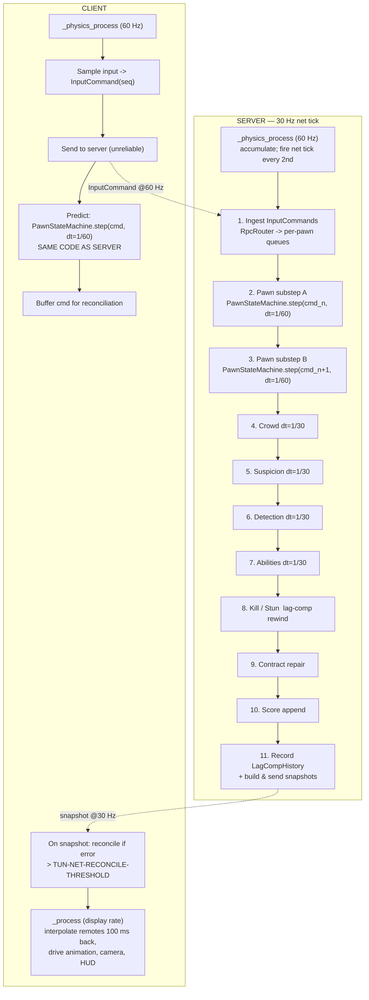

# TDD Chapter 3 — Core Loop and Tick Model

> **Context restated.** Project Sottovoce runs a dedicated headless server that is
> authoritative over every gameplay outcome. Clients predict only their own pawn and
> interpolate everything else 100 ms in the past. The pawn's state machine code is **shared**
> between server and client, because prediction reconciliation replays buffered inputs through
> the identical code path the server used ([`01_architecture.md`](01_architecture.md) §3.4).
>
> **This chapter defines the clocks.** Getting them wrong produces the worst class of bug in
> this project: prediction divergence that appears as the game breaking its own rules,
> intermittently, only under load.

---

## 1. The three clocks

| Clock | Rate | Drives | Exists on |
|---|---|---|---|
| **Display** | Variable (uncapped, target 60+ fps) | Rendering, animation, UI, camera smoothing, snapshot interpolation | Client only |
| **Physics** | 60 Hz fixed | Pawn integration, collision, traversal probes | Both |
| **Net tick** | `TUN-NET-SERVER-TICK` **30 Hz** fixed | **Every gameplay decision.** Suspicion, detection, contracts, abilities, kills, stuns, score, crowd AI, snapshot build | Both (authoritative on server, mirrored on client) |

`project.godot` sets `physics/common/physics_ticks_per_second = 60` on both builds. **The net
tick is every second physics tick.**

### 1.1 A clarification of ASM-0020

ASM-0020 states that the 30 Hz server tick is the authority clock for *all* gameplay. That
remains true, with one refinement this chapter makes precise:

> **All gameplay *decisions* happen at 30 Hz. Pawn *integration* substeps at 60 Hz, two
> substeps per net tick, one per received `InputCommand`.**

> **THERE ARE THEREFORE TWO TICK DOMAINS, AND MIXING THEM HALVES A DURATION.**
> `Tuning.ticks()` converts seconds at 30 Hz. Anything incremented inside `step()` —
> `ctx.state_timer_ticks`, the action buffers — advances at 60, and must be compared against
> `Tuning.step_ticks()` instead. US-0016 found four merged call sites that had used the wrong
> one: the stun freeze ran 1.0 s instead of 2.0, the kill animation 0.7 s instead of 1.4, and
> Jog escalated to Run in 0.18 s instead of 0.35. Nothing failed, because both are plausible
> integers. `test_step_counters_use_step_ticks.gd` now refuses the 30 Hz conversion anywhere
> under `scripts/pawn/`.

This is not a contradiction, it is the mechanism. `TUN-NET-CLIENT-INPUT-RATE` is 60 Hz, so the
server receives two input commands per net tick and must apply each with `dt = 1/60` to
reproduce what the client predicted. If the server integrated once at `dt = 1/30` while the
client predicted twice at `dt = 1/60`, the two would diverge on every acceleration curve — and
`TUN-SPEED-ACCEL` is 18 m/s², so the divergence is immediate and permanent.

Everything that is not pawn integration — suspicion accumulation, tier evaluation, detection,
cooldowns, contract repair, score — runs **once per net tick**, exactly as ASM-0020 requires.

### 1.2 The tick diagram



---

## 2. What runs where

### 2.1 `_physics_process` — 60 Hz, both peers

| Runs here | Why |
|---|---|
| `PawnStateMachine.step()` (server: 2× per net tick; client: 1× per call) | Must match between prediction and authority |
| Traversal probe raycasts | Physics queries are only valid in the physics step |
| `CharacterBody3D.move_and_slide()` | Engine requirement |
| Net-tick accumulation (`if physics_frame % 2 == 0: net_tick()`) | The net tick is derived from the physics clock, never from wall time |
| Client: input sampling and send | One command per physics frame = 60 Hz |

### 2.2 The net tick — 30 Hz, server-authoritative

Everything in `MatchDirector`'s ordered list ([`01_architecture.md`](01_architecture.md) §4).
Restated with the reason each one is at 30 Hz and not 60:

| System | Why 30 Hz is correct |
|---|---|
| `SuspicionSystem` | 33 ms of granularity on a value that changes at most 49/s is 1.6 points — imperceptible, and it makes suspicion frame-rate-independent by construction |
| `DetectionSystem` | Per-observer render state; the client interpolates the visual transition over `TUN-UI-TIER-TRANSITION-TIME` 0.25 s anyway |
| `AbilitySystem` | Cooldowns measured in tens of seconds |
| `KillSystem` / `StunSystem` | `TUN-KILL-CONTEST-WINDOW` is 0.4 s = 12 ticks. Ample resolution |
| `ContractSystem` | Event-driven; ticks only to service `TUN-CONTRACT-REPAIR-DEBOUNCE` |
| `ScoreSystem` | Event-driven |
| `CrowdSystem` | LOD-reduced further (§2.4) |

### 2.3 `_process` — display rate, client only

| Runs here | Never runs here |
|---|---|
| Snapshot interpolation of remote pawns and NPCs | Any gameplay decision |
| Animation tree updates, blend weights | Any timer that affects a rule |
| Camera spring arm, FOV lerp, occlusion | Any suspicion or cooldown accumulation |
| HUD, view models, Compass pulse phase | Anything replicated |
| Audio dispatch and ducking | |

> **The rule: if it can change the outcome of a match, it does not run in `_process`.**

The Compass is the instructive case. Its *pulse phase* advances in `_process` at display rate,
because it is an animation. Its *period* comes from `ContractMirror`, updated at 30 Hz from the
server. A 144 Hz client and a 60 Hz client see the same cadence, smoothed differently.

### 2.4 Crowd LOD tick rates

`NpcBrain` runs on the net tick, decimated by distance to the nearest player
([`08_crowd_system.md`](08_crowd_system.md) §4):

| Band | Distance | AI rate | Every N net ticks |
|---|---|---|---|
| Near | ≤ `TUN-PERF-CROWD-LOD-NEAR` 20 m | 30 Hz | 1 |
| Mid | ≤ `TUN-PERF-CROWD-LOD-MID` 45 m | 10 Hz | 3 |
| Far | ≤ `TUN-PERF-CROWD-LOD-FAR` 70 m | 2 Hz | 15 |

**LOD changes the rate, never the logic** (ADR-0003). An NPC at 60 m runs the same state
machine, less often. A crowd whose *behaviour* changed with observer distance would be a crowd
that lies, and the crowd is a gameplay information channel.

`CrowdDirector` runs on its own timer at `TUN-CROWD-DIRECTOR-INTERVAL` 2.0 s, off the per-tick
path entirely.

---

## 3. Determinism boundaries

We do **not** need cross-platform bit-determinism — the architecture is server-authoritative
with reconciliation, not lockstep (ADR-0002). What we *do* need is that the client's prediction
reproduces the server's result **given the same inputs on the same machine architecture**, so
that reconciliation converges instead of fighting.

### 3.1 Must be deterministic

| Code | Constraint |
|---|---|
| `PawnState.step()` and everything it calls | Pure function of `(ctx, input, dt)`. **No `randf`, no `Time.*`, no `get_node`, no autoload except `Tuning`.** |
| `SuspicionMath`, `CompassMath` | Pure static functions of their arguments |
| `ContractCycle` insert/remove | Deterministic given the same RNG stream (server-only; never predicted) |
| `ScoreLog.fold()` | Pure function of `(events, tuning)` |
| Traversal probe resolution | Deterministic given the same physics state; §3.3 |

### 3.2 Must not be predicted

Explicitly excluded from client prediction, because they are non-deterministic or
authority-only:

| Thing | Why |
|---|---|
| Suspicion value and tier | Server-authoritative (ADR-0002 point 5). A client-side estimate would drift, and a HUD that disagrees with the server about your own tier is worse than no HUD |
| Detection / other players' render state | Depends on all players' state |
| Contract assignment | Uses server RNG |
| Kill and stun resolution | Lag-compensated against server history (ADR-0010) |
| Ability effects | Server-validated; the client plays the *tell* immediately and the *effect* on confirmation |
| Score | Event-sourced on the server |
| NPC positions | Server-simulated (ADR-0007) |

### 3.3 The two known determinism hazards

| Hazard | Risk | Mitigation |
|---|---|---|
| **Physics query results** (traversal probes) | `intersect_ray` results depend on the physics state at query time. If the client's world differs from the server's — e.g. an NPC has moved — a probe could resolve differently and produce a different traversal | Probes query **static world geometry only** (collision layer `WORLD`). NPCs and players are on separate layers and are excluded from probe masks. Static geometry is identical on both peers by construction |
| **Float accumulation order** | Summing suspicion sources in a different order yields different last-bit results | Suspicion is server-only and never predicted, so this cannot cause divergence. It is listed because it *would* matter if anyone later predicts suspicion — which they must not |

### 3.4 Randomness policy

| Use | Source | Seeded? |
|---|---|---|
| Contract assignment, spawn selection | `MatchContext.rng` — a `RandomNumberGenerator` seeded from `match_seed` | Yes, server-only |
| Clone persona roster | Derived from `match_seed` + NPC index (ASM-0025) | Yes, identical on all peers |
| Compass cone wobble | Deterministic function of `(contract_id, tick)` — **not** RNG | N/A — reproducible everywhere |
| NPC startle propagation | `MatchContext.rng` | Yes, server-only |
| Cosmetic VFX jitter | `randf()` freely | No — presentation only, never gameplay |

**`randf()` is banned outside `scripts/presentation/`.** Checked by grep in CI.

---

## 4. Time sources

The single most common source of subtle bugs in a networked game is reading the wrong clock.
This table is normative.

| Source | Type | Use for | **Never use for** |
|---|---|---|---|
| `MatchContext.tick` | `int`, monotonic from match start | **All gameplay timestamps.** `ScoreEvent.tick`, cooldown expiry, lag-comp indexing, `TUN-*` duration comparisons, telemetry | — |
| `_physics_process(delta)` | `float`, always 1/60 | Pawn integration only | Any gameplay timer |
| `_process(delta)` | `float`, variable | Animation, interpolation, camera, UI, Compass pulse phase | **Anything replicated or rule-affecting** |
| `Time.get_ticks_msec()` | `int`, wall clock | Profiling, RTT measurement, log timestamps | **Any gameplay logic** |
| `Time.get_unix_time_from_system()` | `int` | Log file names, telemetry match records | Anything else |
| `Engine.get_physics_frames()` | `int` | Deriving the net tick | Gameplay timestamps (use `MatchContext.tick`) |

### 4.1 Durations are ticks, not seconds

Every `TUN-` duration is authored in seconds (because that is how designers think) and
**converted once, at load, into ticks**:

```gdscript
## Converted at TuningProfile load. Systems compare integers, never floats.
## Removes an entire class of accumulated-float-drift bug from cooldowns and windows.
func seconds_to_ticks(seconds: float) -> int:
    return int(round(seconds * Tuning.net.server_tick_hz))
```

`TUN-KILL-ANIM-DURATION` 1.4 s → **42 ticks**. `TUN-STUN-FREEZE` 4.0 s → **120 ticks**.
`TUN-STUN-LOCKOUT` 12.0 s → **360 ticks**.

A cooldown is `expiry_tick = current_tick + duration_ticks`, and "is it ready?" is
`current_tick >= expiry_tick`. Integer comparison, no accumulation, no drift, trivially
serialisable, and identical on every peer.

---

## 5. Interfaces

```gdscript
## Drives the fixed net tick from the physics clock and ticks systems in order.
## Lives on the server; a reduced form runs on the client to advance mirrors.
class_name MatchDirector
extends Node

const PHYSICS_PER_NET_TICK: int = 2   ## 60 Hz physics / 30 Hz net tick

var _physics_accum: int = 0
var _ctx: MatchContext
var _systems: Array[GameSystem]       ## Ordered per TDD-01 §4. Order is explicit, never scene order.

func _physics_process(delta: float) -> void:
    _step_pawns(delta)                # 60 Hz — every physics frame
    _physics_accum += 1
    if _physics_accum >= PHYSICS_PER_NET_TICK:
        _physics_accum = 0
        _net_tick()

## Advances every gameplay system exactly once, in the declared order.
func _net_tick() -> void:
    _ctx.tick += 1
    var dt: float = 1.0 / Tuning.net.server_tick_hz
    for system in _systems:
        system.tick(_ctx, dt)
```

```gdscript
## One sampled frame of player intent. Sent at TUN-NET-CLIENT-INPUT-RATE (60 Hz).
## Fixed layout; see NETWORK_PROTOCOL.md. Sequence numbers are never reused within a match.
class_name InputCommand
extends RefCounted

var seq: int                 ## Monotonic per client. Used for ack and reconciliation.
var move: Vector2            ## Quantised to 8 bits per axis.
var look_yaw: float          ## Quantised to TUN-NET-QUANT-YAW (1 deg).
var look_pitch: float
## Bitfield: SLOW RUN SPRINT TRAVERSE KILL STUN BLEND ABILITY1 ABILITY2 SCAN
## then RUN_FULL, appended in US-0016. GDD-02 §1.3 requires "partial pull = jog,
## full pull = run", and the ten above cannot express it: the ladder escalates on
## a sustained RUN, so a half-pulled trigger would be dragged up to Run against
## the player's intent. A key press has strength 1.0 and is always full.
## THE ORDER IS THE WIRE FORMAT. Append only; reordering remaps every button
## between builds and nothing crashes, because every value is a valid bitfield.
var buttons: int

## The client's tick when sampled. ADVISORY ONLY — used for diagnostics.
## NEVER used to order events or resolve contests: it is client-supplied and forgeable.
## Contest resolution uses the server receive tick (ADR-0010).
var client_tick: int
```

```gdscript
## Pure, deterministic pawn step. The SAME function runs on the server and in
## client prediction. Any divergence here is a prediction bug.
##
## MUST NOT call: randf, randi, Time.*, get_node, get_tree, or any autoload
## other than Tuning. Enforced by test_pawn_determinism_grep.gd.
func step(ctx: PawnContext, input: InputCommand, delta: float) -> StringName
```

---

## 6. The reconciliation loop

Stated here because it is where the clocks meet; full detail in
[`04_networking.md`](04_networking.md) §4.

```
CLIENT, every physics frame (60 Hz):
    cmd = sample_input(); cmd.seq = next_seq()
    send_unreliable(cmd)
    predicted_state = PawnStateMachine.step(local_ctx, cmd, 1.0/60.0)
    input_buffer.push(cmd, predicted_state)     # up to TUN-NET-INPUT-BUFFER-SIZE (32)

CLIENT, on snapshot arrival (30 Hz):
    authoritative = snapshot.local_pawn         # includes last_acked_seq
    input_buffer.discard_up_to(snapshot.last_acked_seq)
    error = authoritative.position.distance_to(input_buffer.state_at(snapshot.last_acked_seq).position)

    if error > TUN-NET-RECONCILE-THRESHOLD (0.10 m):
        local_ctx = authoritative                       # snap the simulation state
        for cmd in input_buffer:                        # replay everything unacked
            PawnStateMachine.step(local_ctx, cmd, 1.0/60.0)
        visual_offset = old_visual_position - local_ctx.position
        # The SIMULATION snaps; the VISUAL blends over TUN-NET-RECONCILE-SMOOTH-TIME (0.12 s),
        # so a correction is never a visible pop.
    else:
        smooth_silently(error)
```

**The critical detail:** reconciliation snaps the *simulation* and blends the *visual*. If the
simulation blended, subsequent predictions would run from a position the server never had, and
the error would compound rather than converge.

---

## 7. Files this chapter creates

| Path | Purpose |
|---|---|
| `scripts/server/match_director.gd` | The net-tick driver and system ordering (§5) |
| `scripts/net/protocol/input_command.gd` | `InputCommand` (§5) |
| `scripts/core/tuning/tuning.gd` | Extended with `seconds_to_ticks()` and tick-converted duration fields (§4.1) |
| `scripts/net/client/predictor.gd` | Prediction step |
| `scripts/net/client/reconciler.gd` | The §6 loop |
| `project.godot` | `physics/common/physics_ticks_per_second = 60` |

---

## 8. Test hooks

| Test | Asserts |
|---|---|
| `test_net_tick_rate.gd` | Exactly 30 net ticks occur per 60 physics frames, with no drift over 10 000 frames |
| `test_pawn_determinism.gd` | The same `InputCommand` sequence from the same `PawnContext` produces bit-identical results across two runs |
| `test_pawn_determinism_grep.gd` | No file under `scripts/pawn/` contains `randf`, `randi`, `Time.`, `get_node`, `get_tree`, or an autoload other than `Tuning` |
| `test_no_gameplay_in_process.gd` | No file under `scripts/systems/` defines `_process` |
| `test_randf_confined.gd` | `randf`/`randi` appear only under `scripts/presentation/` |
| `test_durations_are_ticks.gd` | Every `TUN-` duration exposed to systems is an `int` tick count, not a float |
| `test_tick_conversion.gd` | `seconds_to_ticks` round-trips every `TUN-` duration within one tick |
| `test_substep_matches_server.gd` | A client predicting two 1/60 substeps lands within `TUN-NET-RECONCILE-THRESHOLD` of a server that applied the same two commands |
| `test_reconcile_converges.gd` | Given a synthetic 150 ms RTT and a forced 0.5 m divergence, the client converges within `TUN-NET-RECONCILE-SMOOTH-TIME` with no visual discontinuity |
| `test_frame_rate_independence.gd` | A match simulated at 30, 60 and 144 fps client display rates produces identical suspicion, score and contract state |

`test_frame_rate_independence.gd` is the chapter's most valuable test: it is the direct proof
that ASM-0020's decision — putting all gameplay on the net tick — actually holds.

---

## 9. Performance budget contribution

| Item | Budget | Notes |
|---|---|---|
| **Server**, per 33 ms net tick | | Against `TUN-PERF-SERVER-TICK-BUDGET` 8.0 ms |
| Pawn substeps (6 pawns × 2) | ≤ 0.30 ms | |
| Tick orchestration | ≤ 0.05 ms | |
| **Client**, per 16.6 ms frame | | Against `TUN-PERF-FRAME-BUDGET` 16.6 ms |
| Input sample + send | ≤ 0.05 ms | |
| Local pawn prediction step | ≤ 0.10 ms | |
| Reconciliation replay (worst case, 32 buffered commands) | ≤ 0.60 ms | Rare — only above `TUN-NET-RECONCILE-THRESHOLD`. Budgeted at worst case because a reconciliation storm under packet loss is exactly when frame time matters |
| Interpolation of remotes + NPCs | ≤ 0.40 ms | Counted in `TUN-PERF-NET-BUDGET` 1.5 ms; detailed in [`04_networking.md`](04_networking.md) |
| **Chapter total (client, typical)** | **≤ 0.55 ms** | |
| **Chapter total (client, reconciling)** | **≤ 1.15 ms** | |

---

## 10. Open questions

| # | Question | Position | Needed by |
|---|---|---|---|
| 1 | Should the server run physics at 30 Hz instead of 60, halving pawn-step cost? It would require the client to predict at 30 Hz too, making input latency worse by up to 16 ms against an 80 ms budget. | Keep 60. The budget has room (0.30 ms of 8.0 ms) and input latency is the scarcer resource. | M2 |
| 2 | Is a 32-command input buffer (`TUN-NET-INPUT-BUFFER-SIZE`, ~0.53 s at 60 Hz) enough? At 400 ms RTT it would overflow. | Enough for the target population. On overflow the client force-accepts the server state with a visible correction, which is the correct degradation. Revisit if telemetry shows overflow. | M2 |
| 3 | Should NPC LOD bands be evaluated per net tick or on the `CrowdDirector`'s 2 s timer? Per-tick is 90 distance checks at 30 Hz; the 2 s timer risks a player sprinting past an NPC still in Far LOD. | Per net tick, but as a squared-distance check against a cached player position array — ~90 float compares, well inside budget. | M3 |
| 4 | `InputCommand.client_tick` is advisory and forgeable. Should it be sent at all? | Keep for diagnostics; it is 2 bytes and it makes desync investigation far easier. The rule that it never orders events is enforced by `test_no_client_time_in_kill.gd` (ADR-0010 compliance). | M4 |
