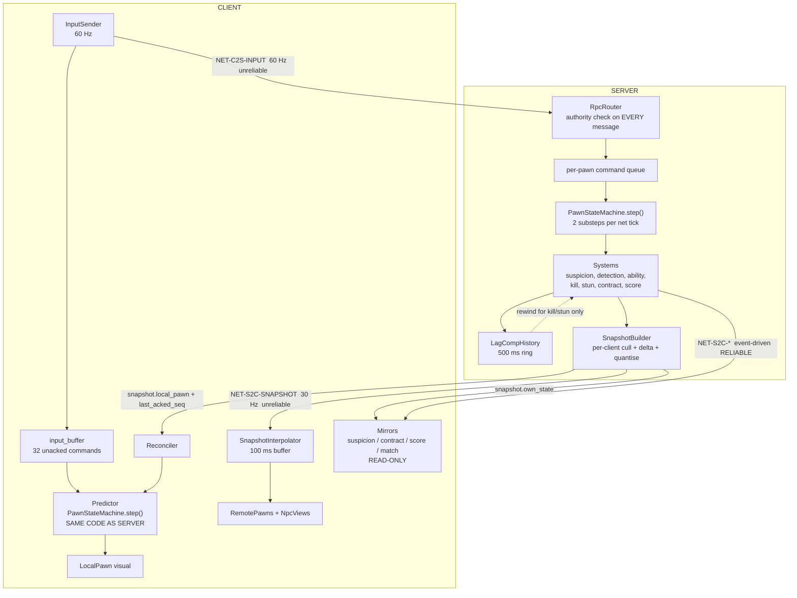

# TDD Chapter 4 — Networking

> **Context restated.** Project Sottovoce is a 4–6 player social-stealth game. The map holds
> 60–90 server-simulated NPCs including 8–12 identical **clones** of each playable **persona** —
> the crowd is gameplay state, not decoration, because NPC positions determine blend-pocket
> validity, open-ground suspicion, and line of sight. The game is decided at 2.5 m
> (`TUN-KILL-RANGE`) and 3.0 m (`TUN-STUN-RANGE`) inside a 0.4 s contest window, so small
> positional errors change outcomes. A dedicated headless server is authoritative over
> everything that decides an outcome; clients predict only their own pawn.
>
> **Implements:** `SYS-NET-REPLICATION`, `SYS-NET-PREDICTION`, `SYS-NET-LAGCOMP`.

---

## 1. The model in one diagram



---

## 2. The authority matrix

**Who owns each piece of state, who may write it, and how it reaches the client.** This table is
the chapter's core contract; every RPC in §6 must be consistent with it.

| State | Owner | Client may write? | Client-predicted? | Replication |
|---|---|---|---|---|
| Local pawn position / velocity | **Server** | No — sends *intent* only | **Yes** | Snapshot, per-tick, full |
| Local pawn state-machine state | **Server** | No | **Yes** | Snapshot, per-tick |
| Remote pawn transform | **Server** | No | No — interpolated 100 ms back | Snapshot, per-tick, quantised |
| NPC transform + anim state | **Server** | No | No — interpolated | Snapshot, delta + culled + quantised (ADR-0007) |
| NPC persona (which clone is which) | **Server** | No | Derived locally from `match_seed` (ASM-0025) | Seed once at match start |
| **Suspicion value** | **Server** | No | **No — never predicted** | Snapshot, own value only |
| **Suspicion tier (own)** | **Server** | No | No | Snapshot |
| **Render state of other players** (plain / tinted / hard) | **Server** | No | No | Snapshot, computed **per observer** |
| **Contract assignment** | **Server** | No | No | `NET-S2C-CONTRACT-ASSIGNED`, reliable |
| **Compass bearing / distance / lock** | **Server** | No | No | Snapshot |
| Contract portrait revealed flag | **Server** | No | No | Snapshot (ASM-0030) |
| **Kill resolution** | **Server** | No | No — client plays the *animation* on request, the *death* on confirmation | `NET-S2C-KILL-RESULT`, reliable |
| **Stun resolution** | **Server** | No | No | `NET-S2C-STUN-RESULT`, reliable |
| **Ability activation** | **Server** validates | Requests only | **Tell only** (§4.4) | `NET-S2C-ABILITY-STARTED`, reliable |
| Ability cooldowns | **Server** | No | Displayed optimistically, corrected | Snapshot, own only |
| **Score / ScoreEvents** | **Server** | No | No | `NET-S2C-SCORE-EVENT`, reliable |
| Match phase / clock | **Server** | No | Clock interpolated locally between ticks | Snapshot + `NET-S2C-PHASE-CHANGED` |
| Loadout / persona | Client **chooses in lobby**, server **owns after start** | Lobby only | N/A | `NET-C2S-LOADOUT` → `NET-S2C-LOBBY-STATE` |
| Ready flag | Client | Lobby only | N/A | Reliable |
| Tuning profile | **Server** | No | N/A | Hash in `NET-S2C-WELCOME`; full profile on mismatch |
| Camera orientation | **Client** | Yes | N/A | Sent in `InputCommand` as intent; server uses it for facing-cone checks |

### 2.1 The three rules the matrix encodes

1. **A client sends intent, never outcome.** There is no message anywhere in §6 by which a
   client asserts that something happened. `NET-C2S-INPUT` says "I am holding the kill button",
   never "I killed player 3".
2. **Nothing gameplay-relevant is predicted except pawn movement.** Suspicion, detection, tier,
   contracts, cooldown authority and score all arrive from the server. A client-side suspicion
   estimate "just for the HUD" would drift, and a HUD that disagrees with the server about your
   own tier is worse than no HUD (ADR-0002 point 5).
3. **Render state is computed per observer.** The same player at the same suspicion is `PLAIN`
   to four observers and `HARD` to one. This is a per-client field in the snapshot, not a
   broadcast property ([`../10_gdd/03_social_stealth.md`](../10_gdd/03_social_stealth.md) §2.1).

---

## 3. Transport

| Property | Value |
|---|---|
| Peer | `ENetMultiplayerPeer`, dedicated server (`create_server`), clients `create_client` |
| Topology | Star. No peer-to-peer traffic ever |
| Port | 27015 default, `--port` override |
| Max peers | `TUN-LOBBY-MAX-PLAYERS` 6 |
| Timeout | `TUN-NET-TIMEOUT` 10.0 s → treated as a disconnect, contract cycle repaired |

### 3.1 Channels

Separate ENet channels so that a burst of reliable traffic cannot head-of-line block the
snapshot stream:

| Channel | Mode | Carries | Why separate |
|---|---|---|---|
| **0 — `STATE`** | Unreliable, unordered | `NET-S2C-SNAPSHOT`, `NET-C2S-INPUT` | Highest volume. Old data is worthless; retransmission would deliver a stale snapshot after a fresh one |
| **1 — `EVENT`** | Reliable, ordered | Kills, stuns, score, contracts, ability starts, phase changes | Must arrive, must arrive in order. A `SCORE-EVENT` lost is a score that never existed |
| **2 — `SESSION`** | Reliable, ordered | Handshake, lobby, tuning sync, join/leave | Low volume, correctness-critical |

**The channel split matters most under packet loss.** Without it, a retransmitted score event
would delay every subsequent snapshot, and the visible symptom would be remote players
stuttering whenever anyone scored — a networking bug that looks like a gameplay bug.

---

## 4. Client prediction and reconciliation

### 4.1 What is predicted

**Only the local pawn's movement and state machine.** Nothing else, ever.

### 4.2 The loop

```
CLIENT, every physics frame (60 Hz):
    cmd = sample_input()
    cmd.seq = next_seq()
    send(CHANNEL_STATE, NET-C2S-INPUT, cmd)                 # unreliable
    PawnStateMachine.step(local_ctx, cmd, 1.0/60.0)         # predict
    input_buffer.push(cmd, snapshot_of(local_ctx))          # cap TUN-NET-INPUT-BUFFER-SIZE 32

CLIENT, on snapshot (30 Hz):
    input_buffer.discard_up_to(snap.last_acked_seq)
    predicted = input_buffer.state_at(snap.last_acked_seq)
    error = snap.local_pawn.position.distance_to(predicted.position)

    if error > TUN-NET-RECONCILE-THRESHOLD (0.10 m):
        local_ctx.apply(snap.local_pawn)                    # SIMULATION snaps
        for cmd in input_buffer:                            # replay all unacked
            PawnStateMachine.step(local_ctx, cmd, 1.0/60.0)
        visual_offset = previous_visual_pos - local_ctx.position
        # VISUAL blends over TUN-NET-RECONCILE-SMOOTH-TIME (0.12 s)
    else:
        visual_offset += error * smoothing_factor           # silent correction
```

**The simulation snaps; the visual blends.** If the simulation blended, later predictions would
run from a position the server never had and the error would compound instead of converging.
This is the single most important sentence in the chapter.

### 4.3 Input buffer overflow

At 60 Hz, `TUN-NET-INPUT-BUFFER-SIZE` 32 covers ~530 ms of unacked input. Above that RTT the
buffer overflows.

**Behaviour on overflow:** the client force-accepts the server state with a visible correction
and clears the buffer. This is deliberate — degrading loudly at 500 ms+ RTT is better than
silently accumulating error, and a player at that latency has a broken experience regardless.

### 4.4 Abilities are half-predicted, deliberately

Abilities are **not** predicted, with one carefully-scoped exception:

| Part | Predicted? | Why |
|---|---|---|
| The **tell** (animation start, wind-up audio, morph begin) | **Yes**, immediately on input | The tell is the legibility law's requirement ([`../10_gdd/04_abilities.md`](../10_gdd/04_abilities.md) §1). Delaying it by RTT would make `ABIL-LUNGE` unreactable for its intended counter — and `TUN-LUNGE-STUNNABLE` depends on defenders seeing the wind-up |
| The **effect** (cloud spawn, projectile, morph completion, dash) | **No** — awaits `NET-S2C-ABILITY-STARTED` | Server validates cooldown, suspicion, range and legality |
| **Denial** | — | `NET-S2C-ABILITY-DENIED` cancels the local tell with a distinct `SFX-ABILITY-DENIED` |

**The risk this creates, stated honestly:** a client can make its own character *appear* to
begin an ability that the server refuses. The tell plays locally and is cancelled ~RTT later.
This is visible only to the acting client, never to others, so it cannot mislead an opponent —
it can only briefly mislead the person who pressed the button. That trade is correct.

**The corresponding requirement:** `NET-S2C-ABILITY-STARTED` must be sent to **all** clients in
range immediately on validation, on the reliable channel, because the tell is what other players
must react to. Failure mode 7 in [`../10_gdd/04_abilities.md`](../10_gdd/04_abilities.md) §11 —
"Lunge is unstunnable in practice" — is a latency bug in this message, not a balance issue, and
the diagnosis instruction there points at this paragraph.

---

## 5. Snapshot interpolation

### 5.1 Model

Every remote entity — pawns and NPCs — is rendered `TUN-NET-INTERP-BUFFER` **100 ms** in the
past, interpolated between the two snapshots that bracket `now − 100 ms`.

| Property | Value | Note |
|---|---|---|
| Buffer | 100 ms, **fixed, not adaptive** | ASM-0021. Adaptive changes remote timing between sessions, which would confound balance testing |
| Extrapolation | **None** | An extrapolated player who was about to stop is a player who appears to walk through a wall. In a game where 30 cm changes outcomes, guessing is worse than lagging |
| Interpolation basis | **Received timestamps**, never an assumed fixed interval | Required because far NPCs arrive at 10 Hz and near ones at 30 Hz (§7.3). Assuming a fixed interval would make the two rates fight |
| Buffer underrun | Hold last known transform, freeze animation phase | Visible as a brief stall — correct and honest |

### 5.2 Why 100 ms is nearly free here

A remote player at `TUN-SPEED-BLENDWALK` 1.4 m/s has moved **14 cm** in 100 ms. Most players
spend most of a match at or below stroll, because that is what the game rewards. At
`TUN-SPEED-SPRINT` 6.2 m/s it is 62 cm — but a sprinting player is Exposed within 1.2 s and is
not someone you are trying to precisely time a kill against.

**The design and the netcode reinforce each other:** the game is about slowness, and slowness is
exactly what makes interpolation cheap.

---

## 6. The message catalogue

Duplicated as a standalone lookup reference in
[`../30_bible/NETWORK_PROTOCOL.md`](../30_bible/NETWORK_PROTOCOL.md) — deliberately, because it
is consulted constantly.

**Legend** — *Ch*: channel (S=STATE, E=EVENT, X=SESSION). *Rel*: reliability.
**Every C2S row must have a non-empty authority check** (ADR-0002 compliance).

> **`NET-C2S-INPUT` IS HAND-PACKED, AND ITS LAYOUT IS NOT QUITE THE ONE ABOVE.**
> Until US-0095 it went out as six loose RPC arguments, which Godot variant-encodes at **56
> bytes** — the M2 gate measured upstream at 253 % of budget because of it. `InputCodec` now packs
> it into **12 bytes**: `seq:u16`, `move:2×i8`, `yaw:u16`, `pitch:i16`, `buttons:u16`,
> `acked_tick:u16`.
>
> **Yaw is `u16` and pitch is `i16`, where this table said `u8` and `i8`, and the wire cost is
> identical.** A `PackedByteArray` argument costs 8 bytes of Variant wrapper plus the payload
> rounded up to four, so a 10-byte and a 12-byte payload **both cost 20**. The narrower fields
> save nothing and cost two things that were measured rather than argued:
>
> - `pitch:i8` would **stair-step the camera** — `camera_rig.gd` reads `look_pitch` directly to
>   place the arm, and 180° in 256 steps is 0.7° a step.
> - `yaw:u8` would make a **slow mouse drag stick**: the sampler accumulates look, and at 1.4° a
>   step any frame moving less than 0.7° rounds back where it started.
>
> **The client quantises at SAMPLE time, not at send time.** It predicts with the command it holds
> and the server simulates with the command it received; a single rounding step between them is a
> divergence on every frame that the reconciler would absorb silently.

> **`peer_id:u8` IN EVERY ROW BELOW IS A SLOT, NOT THE ENGINE'S PEER ID.** Godot hands out
> **random 32-bit** peer ids — a test client was welcomed as `1526710570` — and this catalogue
> declares a byte in seven places. The catalogue is right: six players fit in three bits, and the
> byte is what §7's bandwidth budget was written against.
>
> `scripts/net/protocol/slot_table.gd` maps one onto the other, and **slot 0 is reserved to mean
> nobody**, so a record that was never filled in decodes as *absent* rather than as player one.
> The engine's id never reaches the wire.
>
> Found by hand in US-0025, before anything was serialised, and answered in US-0029. Written down
> here because a reader wiring `peer_id` from `multiplayer.get_remote_sender_id()` would produce
> a payload that fits, transmits, and is wrong.

### 6.1 Client → Server

| ID | Ch | Rel | Rate | Payload | Authority check |
|---|---|---|---|---|---|
| `NET-C2S-HELLO` | X | Reliable | Once | `protocol_version:u16`, `build_hash:u64`, `tuning_hash:u64` | Version and build must match server; else reject with reason. **The tuning hash can never refuse a peer** — it is carried so the server can answer a mismatch with `NET-S2C-TUNING-SYNC` rather than sending 6 KB on every join or never noticing (US-0025) |
| `NET-C2S-LOADOUT` | X | Reliable | Lobby only | `persona:u8`, `ability_a:u8`, `ability_b:u8`, `passive:u8` | **Rejected unless phase == LOBBY.** IDs must be within the MVP set; abilities must differ |
| `NET-C2S-READY` | X | Reliable | Lobby only | `ready:bool` | Rejected unless phase == LOBBY |
| `NET-C2S-INPUT` | S | Unreliable | **60 Hz** | `seq:u16`, `move:2×i8`, `yaw:u8`, `pitch:i8`, `buttons:u16`, `acked_tick:u16` — **hand-packed into 12 bytes, see below** | Sender must own a living pawn. `seq` must be newer than last processed (stale/replayed commands dropped). Applies to the **sender's** pawn only — the pawn is looked up from the peer id, never from the payload |
| `NET-C2S-ABILITY-REQUEST` | E | Reliable | On demand | `slot:u8`, `aim_origin:3×f32`, `aim_dir:3×f32` | Slot must be equipped; cooldown must be expired **on the server**; `TUN-ABILITY-GLOBAL-COOLDOWN` respected; aim clamped to the ability's range server-side |
| `NET-C2S-BLEND-REQUEST` | E | Reliable | On demand | `target_id:u16` (blend prop or group slot) | Target must exist, be within `TUN-BLEND-GROUP-JOIN-RADIUS`, and have capacity (`TUN-BLEND-PROP-CAPACITY` 1) |
| `NET-C2S-SKIP-RESULTS` | X | Reliable | Once | — | Phase must be RESULTS. Skip requires **unanimous** consent |
| `NET-C2S-PING` | S | Unreliable | 1 Hz | `client_time:u32` | None needed — echo only |

**Note what is absent:** there is no `NET-C2S-KILL`, no `NET-C2S-STUN`, no
`NET-C2S-POSITION`, no `NET-C2S-SUSPICION`. Kill and stun are **buttons in the input bitfield**,
evaluated by the server against the lag-compensated world. A client cannot express the concept
"I killed someone" in this protocol.

### 6.2 Server → Client

| ID | Ch | Rel | Rate | Payload |
|---|---|---|---|---|
| `NET-S2C-WELCOME` | X | Reliable | Once | `peer_id:u8`, `tuning_hash:u64`, `map_id:u8`, `phase:u8` |
| `NET-S2C-TUNING-SYNC` | X | Reliable | On mismatch | Full serialised `TuningProfile`. Client adopts it — **corrected, never kicked** (ADR-0005 rule 4) |
| `NET-S2C-LOBBY-STATE` | X | Reliable | On change | `players[]{peer_id, persona, ready}`. **Loadouts deliberately excluded** ([`../10_gdd/06_ui_audio.md`](../10_gdd/06_ui_audio.md) §4.1) |
| `NET-S2C-MATCH-START` | X | Reliable | Once | `match_seed:u64`, `start_tick:u32`, `crowd_count:u8` |
| `NET-S2C-SNAPSHOT` | S | Unreliable | **30 Hz** | §6.3 |
| `NET-S2C-CONTRACT-ASSIGNED` | E | Reliable | On change | `contract_peer:u8`, `reason:u8`. **Contains no persona, position or identity hint** — see §6.4 |
| `NET-S2C-KILL-RESULT` | E | Reliable | On event | `killer:u8`, `victim:u8`, `tick:u32`, `bonus_group:u16` |
| `NET-S2C-STUN-RESULT` | E | Reliable | On event | `stunner:u8`, `target:u8`, `tick:u32`, `valid:bool`, `lockout_ticks:u16` |
| `NET-S2C-ABILITY-STARTED` | E | Reliable | On event | `peer:u8`, `ability:u8`, `origin:3×f32`, `dir:3×f32`, `tick:u32`. **Broadcast to all clients within tell radius** — this is the legibility law on the wire |
| `NET-S2C-ABILITY-DENIED` | E | Reliable | On event | `slot:u8`, `reason:u8`. To the requester only |
| `NET-S2C-PREY-WARNING` | E | Reliable | On event | **`tick:u32` only.** §6.4 |
| `NET-S2C-SCORE-EVENT` | E | Reliable | On event | `event_id:u32`, `tick:u32`, `kind:u8`, `actor:u8`, `subject:u8`, `base:i16`, `mult:u8`, `group:u16` |
| `NET-S2C-PHASE-CHANGED` | E | Reliable | On change | `phase:u8`, `tick:u32`, `multiplier:u8` |
| `NET-S2C-MATCH-END` | E | Reliable | Once | Full `ScoreEvent` log for the results fold |
| `NET-S2C-PLAYER-JOINED` | X | Reliable | On change | `peer_id:u8`, `persona:u8` |
| `NET-S2C-PLAYER-LEFT` | X | Reliable | On change | `peer_id:u8`, `persona:u8` |
| `NET-S2C-PONG` | S | Unreliable | 1 Hz | `client_time:u32`, `server_tick:u32` |

### 6.3 Snapshot payload

```
NET-S2C-SNAPSHOT (per client, per tick)
├── header
│   ├── server_tick        u32
│   ├── last_acked_seq     u16      # this client's last processed InputCommand
│   └── flags              u8
├── own_pawn                        # FULL state — the prediction authority
│   ├── position           3×f32
│   ├── velocity           3×f32
│   ├── state_id           u8
│   ├── state_timer_ticks  u16
│   └── grounded           bool
├── own_gameplay                     # NEVER predicted (§2 rule 2)
│   ├── suspicion          u8       # 0..100, quantised to 1 point
│   ├── tier               u2
│   ├── active_sources     u8       # bitfield: SPRINT ROOF CLIMB OPEN RUN — drives the HUD source list
│   ├── cooldown_a_tick    u16
│   ├── cooldown_b_tick    u16
│   └── blend_state        u4
├── compass                          # §6.4 governs what is NOT here
│   ├── bearing            u8       # quantised to TUN-NET-QUANT-YAW (1 deg), wobble ALREADY APPLIED server-side
│   ├── distance_bucket    u8       # 0.5 m buckets to 60 m — never an exact distance
│   ├── lock_fraction      u8       # 0..255
│   └── portrait_revealed  bool     # ASM-0030
├── match
│   ├── phase              u8
│   ├── ticks_remaining    u16
│   └── multiplier         u8
├── remote_pawns[]                   # visible players only
│   ├── peer_id            u8
│   ├── position           3×i16    # TUN-NET-QUANT-POS 1 cm, map-local
│   ├── yaw                u8
│   ├── state_id           u8
│   ├── anim_phase         u6
│   └── render_state       u2       # PLAIN | TINTED | HARD — COMPUTED PER OBSERVER
└── npcs[]                           # delta + culled + LOD (§7)
    ├── index              u8
    ├── position_xz        2×i16     # 1 cm, map-local
    ├── height             u8        # 5 cm — nothing reads a crowd member's y
    ├── yaw                u8
    └── anim_state         u3 + phase u5    # 8 bytes per NPC, measured (US-0029)
```

### 6.4 What the protocol deliberately does not carry

The design's information rules are enforced **at the payload level**, not in the UI. A rule that
lives only in a widget can be broken by a different widget; a rule that lives in the wire format
cannot be broken at all.

| Not sent | Would break | Enforced by |
|---|---|---|
| Contract's **persona** | The crowd's entire value — it would collapse 78 candidates to ~12 ([`../10_gdd/03_social_stealth.md`](../10_gdd/03_social_stealth.md) §8.5) | `NET-S2C-CONTRACT-ASSIGNED` carries `peer_id` only; the client cannot map peer→persona for a player it has not seen |
| Contract's **exact position** | Deletes the search | `compass.bearing` + `distance_bucket` only |
| Contract's **elevation** | The Compass is 2D by design | No z component anywhere in `compass` |
| Contract's **suspicion or tier** | You see the consequence, never the value | Not in the payload |
| **Direction of the prey warning** | `TUN-COMPASS-WARN-GIVES-DIRECTION` is `false`. The panicked scan of a crowd is the game's best moment | `NET-S2C-PREY-WARNING` carries **only a tick**. There is no field to leak |
| Other players' **suspicion values** | Anonymity | `render_state` is 2 bits and per-observer |
| Other players' **cooldowns or loadouts** | Kit-reading is a skill ([`../10_gdd/04_abilities.md`](../10_gdd/04_abilities.md) §5.1) | Not in the payload |
| A **global kill feed** | Would reveal how the contract cycle shifted, for free | `NET-S2C-KILL-RESULT` is sent only to the killer and the victim |
| NPCs beyond `TUN-NET-NPC-CULL-RADIUS` | — | Culled server-side (§7.2) |

> **The design rule this section expresses:** if the client never receives it, no future UI
> change, mod, or bug can reveal it. The prey warning carrying nothing but a tick is the purest
> example — there is no field to accidentally render.

---

## 7. Bandwidth budget

Against `TUN-NET-BANDWIDTH-BUDGET-DOWN` **96 kbit/s** and `-UP` **16 kbit/s** per client.

### 7.1 Downstream, worst case (6 players, 90 NPCs, all moving)

**Every size below is MEASURED from `Snapshot.serialise()`, not estimated.**
`test_snapshot_size.gd` recomputes this table on every run and fails if a record grows.

| Component | Calculation | Bytes/s |
|---|---|---|
| Near NPCs (≤ 45 m; ~45 visible, 30 Hz, 55 % changed) | 45 × 0.55 × **8 B** × 30 | 5 940 |
| Far NPCs (45–70 m; ~30 visible, 10 Hz, 70 % changed) | 30 × 0.70 × **8 B** × 10 | 1 680 |
| Remote pawns (5 × **10 B** × 30 Hz) | | 1 500 |
| Header + own pawn + gameplay + compass + match + counts (**55 B** × 30 Hz) | | 1 650 |
| Reliable events (score, kill, stun, ability — est. 2/s × 40 B) | | 80 |
| ENet + UDP/IP overhead (~28 B × 30 packets/s) | | 840 |
| **Total** | | **11 690 B/s ≈ 93.5 kbit/s** |

**97 % of budget on those inputs — AND FOUR OF THE INPUTS HAVE NOW BEEN MEASURED AGAINST A REAL
CROWD, WHICH TAKES IT TO 112 %.** See §7.1.1. The table above is kept as written because it is
what the *record sizes* were re-derived against and those are still right; what was never
measured until US-0048 is the two change fractions, and they are the numbers the total turns on.

Thin either way — thinner than the 13 % this section claimed before the format was built and
measured — which is why the ADR-0007 fallback (replicate near NPCs, seed-derive far ones)
remains designed, documented and unbuilt.

### 7.1.1 The same table on measured crowd counts — 112 %, not 97 %

`test_crowd_bandwidth.gd` (US-0048) walks the real crowd — real `NpcBrain`s deciding who strolls
and who stands, navigation modelled as a straight line — and counts, **per observer**, how many
NPC records actually change per tick. It charges the budget to the **most expensive observer**,
because a budget met on average is a budget missed by somebody.

| §7.1 assumes | Measured | |
|---|---|---|
| ~45 near NPCs | **41.0** | — the head-counts were very nearly right |
| ~30 far NPCs | **29.2** | — likewise |
| **55 % of near changed per tick** | **77.6 %** | — **wrong by 41 %** |
| **70 % of far changed per tick** | **76.1 %** | — wrong by 9 % |
| 93.5 kbit/s, 97 % | **108.0 kbit/s, 112 %** | |

**THE RECORD WAS NEVER THE PROBLEM AND THE MULTIPLIER ALWAYS WAS.** This table was re-derived
twice against measured record sizes — US-0029 shrank the NPC record 10 B → 8 B on the strength of
it — and on both occasions `0.55` went unquestioned, because it looks like an assumption about
the *network* and is not one.

**IT IS THE CROWD'S IDLE DUTY CYCLE, AND IT COULD NOT HAVE BEEN KNOWN BEFORE US-0040.** A
strolling NPC covers `TUN-CROWD-NPC-SPEED-STROLL` / 30 = **4.7 cm per tick against a 1 cm position
quantum**, so *every NPC that is walking at all changes its record every tick*. The only NPCs that
do not are the ones standing at an anchor for `TUN-CROWD-IDLE-DURATION-MIN..MAX`. So the fraction
is not a delta rate to be tuned — it is "what proportion of the crowd is walking right now", and
it follows from two crowd tunables that had no values until US-0040 gave them the GDD's own.

**AND 112 % IS A LOWER BOUND.** A straight line is shorter than a navmesh path, so a modelled NPC
arrives sooner and stands still longer than a real one. Real navigation moves this number up.

**WHAT THIS DOES NOT SAY.** No NPC is on the wire — `SnapshotBuilder` never calls `add_npc`, which
the test asserts rather than assumes — so this is the **format** measured against a real crowd,
not the wire measured at all. US-0030's four culling criteria are what would close that, and
culling is also the first place to look for the missing 12 %: the worst observer has **70.2 of 78
NPCs** replicated to them, because `TUN-NET-NPC-CULL-RADIUS` is 70 m on a 120 × 120 m map.

### 7.1.2 And what the wire actually costs, now that the crowd is on it — 155 %

US-0030 put the crowd on the wire and culled it positionally. `test_crowd_wire_cost.gd` prices
the real `SnapshotBuilder`'s serialised output at the most expensive of `MAP-VETRAIO`'s six spawn
points:

| | |
|---|---|
| | Culled only | + rate LOD | **+ NPC delta** |
|---|---|---|---|
| Mean snapshot | 591 B | 447 B | **420 B** |
| Against `TUN-NET-BANDWIDTH-BUDGET-DOWN` 96 | 148.6 kbit/s, **155 %** | 114.0, **119 %** | **107.6, 112 %** |

**THE FINAL COLUMN IS CHARGED AGAINST A LAGGING ACK, AND WAS 111 % WHEN IT WAS NOT.**
`NpcDelta`'s baseline advances on acknowledgement, so acking the tick you have just built measures
a connection that does not exist — and the delta it was measuring **never converged in a running
game at all**. Re-measured at a three-tick ack (100 ms, the order of `TUN-NET-INTERP-BUFFER`) the
figure is 112 %, and the sensitivity is now guarded: 415 B at an instant ack, 414 B at three ticks,
426 B at ten. Restoring the defect moves the three-tick figure to **460 B**, and both guards fire.
§7.1.3.

**AND THE REMAINING 12 % IS PRICED NOW: NEITHER CANDIDATE CAN DELIVER IT.**
`test_cull_radius_price.gd` sweeps `TUN-NET-NPC-CULL-RADIUS` through the real builder, adopting
each value so the delta and the rate-LOD stagger respond to it. **The curve is flat:**

| Cull radius | Of budget | NPCs reachable over six spawn points |
|---|---|---|
| 70.0 m, shipped | 113 % | 284 |
| 67.5 m | 104 % | 266 |
| 65.0 m | 112 % | 251 |
| 62.5 m | 113 % | 241 |
| 60.0 m, invariant 17's floor | 110 % | 221 |

**THE KNOB TURNS AND THE BYTES DO NOT MOVE.** Culling from 70 m to the floor removes **22 % of
the reachable crowd and about 3 % of the bytes**, because everything it removes lies beyond
`TUN-NET-NPC-RATE-LOD-RADIUS` and is already sent at a third of the rate, while the worst-case
snapshot is dominated by the **near** crowd the radius never touches.

> **THE FIRST VERSION OF THAT SWEEP REPORTED THE BUDGET CLOSING AT 65 m, AND IT WAS WRONG TWICE
> OVER.** It scaled the rate-LOD radius to the cull radius's *shipped fraction*, so every row was
> a function of whatever was in the profile — 65 m read 97 % against a profile of 70 and 101 %
> against a profile of 65. And it carried the crowd forward between rows, 180 ticks each, so the
> radius fell and the crowd walked at the same time. **That was the entire gradient.** §7.1.2's
> original conclusion — *culling was not the lever* — was right all along.

**THE OTHER CANDIDATE IS NOT ONE, AND THAT IS THE FINDING.** This section has named ADR-0007's
seed-derived far crowd as the alternative since US-0031. ADR-0007 sets that boundary at **"≥ 70 m
so it stays outside every gameplay radius"** — which is exactly where the cull already sits, so
every NPC the fallback would stop replicating is one the builder already refuses to send.
**Measured: zero records past 70 m, summed over all six spawn points.** The fallback is still
worth building — it would put a crowd back on the horizon where a client currently draws empty
street — but it is a **rendering** change, not a bandwidth one. The two "candidates" were always
one lever: a boundary. They differ only in what the client draws beyond it.

**SO THE DECISION IS A `TUN-` CHANGE AND IT IS NOT MADE HERE.** 65 m closes the budget and keeps
invariant 17, but it cuts the margin over `TUN-COMPASS-RANGE-MAX` from 10 m to 5 m — and the
compass is the one system that reaches far enough to care that an NPC it points past was never
replicated. That is the owner's.

**THE SWEEP'S ABSOLUTE FIGURES SIT ~2 POINTS ABOVE `test_crowd_wire_cost.gd`'s** — 114 % against
112 % at the same radius — because it settles the crowd for 200 ticks rather than 300 and prices a
slightly different arrangement of the same walking crowd. That file owns the headline number; the
sweep owns the **shape**, and all five of its rows come from one crowd so they are comparable with
each other, which is the only property a sweep needs.

**112 % MEASURED AGAINST §7.1.1's 112 % PROJECTED, BY TWO INDEPENDENT ROUTES.** One walks a
modelled crowd and counts which records change; the other serialises the real builder's output and
weighs it. They were built for different questions and they agree to one point, which is the
strongest thing either of them says.

**CULLING WAS NOT THE LEVER, AND THAT IS WORTH KNOWING BEFORE THE NEXT ONE IS CHOSEN.**
`TUN-NET-NPC-CULL-RADIUS` is 70 m and `MAP-VETRAIO` is 120 × 120 m, so most of the district is
within reach of most of it. Culling is still correct — it is a per-observer rule the protocol
requires and US-0030's criteria are met by it — but the money is not there.

**RATE LOD IS BUILT AND IT WAS WORTH 36 POINTS.** §7.2 has specified "NPCs beyond 45 m at 10 Hz"
since M0 and neither number had a `TUN-` ID, because there was no crowd for the rule to apply to;
they are `TUN-NET-NPC-RATE-LOD-RADIUS` and `TUN-NET-NPC-RATE-LOD-HZ` now, with this document's own
values, and invariants 30 and 31 hold them against the cull radius and the snapshot rate.

**THE STAGGER IS THE HALF THAT WOULD HAVE SILENTLY NOT HAPPENED.** Sending the whole slowed band on
the same tick divides the *mean* by the stride and leaves the *peak* exactly where it was — one
snapshot in three carrying the entire crowd, which is the size that has to meet an MTU and the
jitter a client actually feels. **The kbit/s figure is identical either way.** Far NPCs are
staggered by `(tick + index) % stride`, the same shape `CrowdBands` uses for brain steps, and the
worst tick carries about a third of the band rather than all of it.

**THE NPC DELTA WAS WORTH EIGHT POINTS AND NEEDED NO PROTOCOL CHANGE.** It is small because
**0.776 of visible NPC records change every tick anyway** — a delta can only drop the quarter that
do not.

**AND THE PROTOCOL CHANGE IT WAS THOUGHT TO NEED TURNED OUT TO BE ALREADY PAID FOR.** Remote pawns
needed `present_slots` because *absent* used to mean "gone". For the crowd, **absent already meant
"no update this tick"** — culling and rate LOD both omit NPCs a client must keep drawing — so the
delta slots in with no wire change at all. **What the protocol still cannot say is that an NPC has
LEFT** by *silence*, and it could not before this either. Departure is carried by a **value**
instead — one final out-of-range record — and `CrowdWire.is_farewell()` is that convention, held in
one class because both client-side readers must agree on it. §7.1.3.

**IT CANNOT REUSE `SnapshotDelta`, AND THE REASON IS RATE LOD.** That class keeps one baseline per
*tick*, which is right for pawns because every pawn is offered every tick. An NPC past the rate-LOD
radius is offered on one tick in three, so it is missing from almost every tick's baseline through
no fault of the client — a tick-keyed comparison would call it "new" every time and send it, which
is a delta that saves nothing while reporting that it works. `NpcDelta` keys **per NPC** and
advances on the **ack**, never on transmission.

**WHAT IS LEFT IS 11 %, AND NEITHER CANDIDATE IS PRICED.** ADR-0007's seed-derived far crowd, and a
smaller `TUN-NET-NPC-CULL-RADIUS` — which is a tuning change with a gameplay consequence, since the
radius is pinned above `TUN-COMPASS-RANGE-MAX` by invariant 17 for a reason.

---

### 7.1.3 What watching it for eight seconds found

`tools/crowd_probe.tscn` drives a real client against a real server, samples every **drawn** NPC
for eight seconds and reports the numbers a screenshot cannot carry. Four defects came out of it
and none was reachable by any test in this repository.

**THE DELTA NEVER CONVERGED, AND IT WAS INERT IN EVERY REAL GAME.** `NpcDelta` stamps each sent
record with the tick that carried it, and an ack promotes entries stamped at or before the acked
tick. An ack lags by at least one tick, so a record is re-sent while its first copy is still in
flight — and **overwriting the stamp on each re-send means the entry always leads the ack, is never
promoted, and the NPC is sent every tick for the rest of the match**. Measured on a running server:
a motionless NPC at a constant **7.6122 m, sent on twelve consecutive ticks**.

Every unit test acknowledged synchronously, one tick after the send, which is the single timing
that hides it. The in-flight entry now keeps the **earliest** tick that carried the current value,
because the client only has to receive it once.

**A DEPARTING NPC BECAME A STATUE, BECAUSE ABSENCE CANNOT SAY "GONE".** The last position a client
is told is inside the cull radius by definition, so its own distance check can never fire however
far the NPC walks. Eight seconds with a stationary player produced **zero drops** — which reads
like good news. The server now sends **one final record** carrying the real, out-of-range position;
the client reads an out-of-range record as a goodbye, because the server would never send one
otherwise. Eight bytes per departure, no protocol change.

**AND THE CULL BOUNDARY CHATTERED.** A single threshold is not stable against a crowd, because
nothing in one is ever exactly still — RVO shoves a standing body at up to 0.1 m/s so a walking
group does not walk through an idle cluster. Leaving is decided at `TUN-NET-NPC-CULL-RADIUS`;
re-admission one margin inside it.

**AND THE FOURTH WAS THE CLIENT REPLAYING THE GOODBYE FOREVER.** Four to six NPCs per spawn point
were created and freed roughly **once per snapshot**, each last seen at **70.01–70.05 m** against a
70.00 m radius. It survived one round of investigation as an open finding, because the two cases
that reproduce deterministically — an NPC parked on the line, and one walking straight out through
it — are both quiet in `test_cull_jitter.gd`, and both are **server-side**.

**IT WAS NOT ON THE SERVER AT ALL.** `SnapshotAssembler` carries the crowd forward, which is
correct and necessary: absence means "no update", so a client must inherit every NPC this tick did
not mention. The farewell is the one record for which that is false — the server discards a culled
NPC's baseline as it sends it, and will never mention that NPC again — so the assembler cached the
goodbye and re-presented it in **every later snapshot**. `NpcView` reads a fresh out-of-range
record as a departure, so each replay made it create a body for an index it no longer held and free
it again.

**THE CONSTANT DISTANCE WAS THE TELL, AND IT WAS MISREAD AS A TIGHT BAND.** 70.01–70.05 m is not a
population of NPCs hovering near the line; it is a handful of records, each frozen at the single
value the server sent once. Measured on the fixed instrument: one NPC re-presented at a constant
**70.0231 m on 199 consecutive ticks**.

**NEITHER CLASS WAS WRONG ABOUT ITS OWN JOB**, which is why every test of either passed. The rule
"a received record beyond the cull radius is the server saying goodbye" was known only to
`NpcView`, and the assembler sits **between** the wire and the view. It is `CrowdWire.is_farewell()`
now — one class both of them call, so they cannot come apart.

`tools/cull_trace.tscn` is the instrument. It boots the real `server_root.tscn`, drives six real
`NpcView`s through six real `SnapshotAssembler`s on round-tripped bytes, and prints the **server's**
own view of every NPC around each drop, which is the half `crowd_probe.tscn` cannot see. Across six
spawn points over 240 ticks it measured **485 drops for 5 real departures** before, and **7 drops
for 7 departures** after.

> **THE FIRST VERSION OF THAT TOOL FED THE VIEWS RAW WIRE SNAPSHOTS AND REPORTED A CLEAN BOUNDARY**
> — two drops in 240 ticks, both correct. **No client uses that path**: `Net` deserialises,
> assembles, and only then emits `snapshot_received`. A diagnostic wired past the defect reports
> the same thing as a fixed one.

**ONE CASE REMAINS UNCOVERED AND IS BOUNDED RATHER THAN FIXED.** The farewell is a single record on
an unreliable channel, and the server drops its baseline as it sends it, so a lost farewell is
never retried: that NPC stays drawn at the boundary. It is not permanent — the client's second rule
frees anything whose last-known position passes the radius plus `NpcView.drop_margin()`, so the
observer moving about 0.6 m away clears it — and the case only arises for an NPC at 70 m, which is
outside every gameplay radius. Recorded here rather than solved with a retry the protocol has
nowhere to put.

---

**§7.2's RATE-LOD NUMBERS HAVE NO `TUN-` IDS.** The 45 m boundary and the 10 Hz far rate are bare
numbers in prose here, because rate LOD is US-0031's unticked criterion and nothing has ever had
to read them. The test takes the boundary from `TUN-PERF-CROWD-LOD-MID`, which carries the same
45 m; **if those ever diverge, rate LOD needs its own tunable and the test is measuring the wrong
one.** Recorded rather than invented — never-do #1 forbids the constant, and US-0031 owns the
feature.

> **THIS TABLE WAS RE-DERIVED IN US-0029, AND THE FIRST VERSION OF IT DID NOT SURVIVE
> MEASUREMENT.** It budgeted 7 bytes per NPC against a §4 record whose index and position alone
> were seven, and 18 bytes for a header block that came to 53. Built and measured, the district's
> worst case projected to **108.3 kbit/s against a 96 budget — 113 %**, where this section
> concluded 87 %.
>
> The answer was to shrink the crowd record rather than to move the budget: the crowd is 90 of the
> ~96 replicated entities, so it is the only place the money is. An NPC's `y` became a 5 cm byte
> and its animation `u3 + u5`, taking the record from 10 bytes to 8 — see §6.3. Nothing a player
> can perceive changed: nothing reads a crowd member's height, and 32 animation phase steps are
> finer than a walk cycle can be read at 45–70 m.
>
> **The lesson is the arithmetic, not the bytes.** A budget table whose per-record sizes were
> never measured against the format they describe is a budget that reports whatever its author
> expected. `test_snapshot_size.gd` now measures every record and recomputes this total on every
> run, and `test_the_npc_record_is_the_one_the_budget_was_re_derived_against` fails the moment a
> record grows.

### 7.2 The four mechanisms that make it fit

| # | Mechanism | Saving | Detail |
|---|---|---|---|
| 1 | **Distance culling** | **measured: 6–14 %, not the 0–50 % assumed** | **BUILT, US-0030**, and it was not the lever — a 70 m radius on a 120 × 120 m map leaves most of the district in reach of most of it. NPCs beyond `TUN-NET-NPC-CULL-RADIUS` 70 m are not sent. 70 m > `TUN-COMPASS-RANGE-MAX` 60 m, so a culled NPC can never affect anything the client can perceive (invariant §17.17) |
| 2 | **Quantisation** | ~60 % vs. floats | Player position 3×i16 at 1 cm; **NPC position 2×i16 plus a 5 cm height byte**; yaw u8 at 1°; NPC anim 3+5 bits. **8 bytes per NPC** including index, measured |
| 3 | **Delta encoding** | ~40 % | **Built, US-0031.** Only entities whose **quantised** state changed since the client's last ack. A standing idle NPC costs nothing, and 40–60 % of the crowd is idle at any moment. Measured against players: a settled snapshot for two motionless clients is **55 B — the fixed block, with not one remote record** |
| 3b | **Delta encoding, NPCs** | **measured: 7 % of the as-built figure** | **BUILT, US-0031.** `NpcDelta`, keyed per NPC and advanced on the ack. No protocol change: *absent* already meant "no update". 119 % → 111 % |
| 4 | **Rate LOD** | **measured: 24 % of the as-built figure** | **BUILT, US-0031.** `TUN-NET-NPC-RATE-LOD-RADIUS` / `-HZ`, staggered by index so the peak falls with the mean. 155 % → 119 %. It is scoped to NPCs on purpose: a *player* at 46 m interpolated at 10 Hz would be visibly coarse, and the justification below does not hold for them. NPCs beyond 45 m at 10 Hz. Interpolation error at walking speed is < 15 cm — far below every gameplay radius, and those NPCs are outside all of them anyway |

### 7.2.1 The far band stutters, and the margin was only half of why

**THE ARITHMETIC LEAVES NOTHING IN HAND.** `TUN-NET-INTERP-BUFFER` is 100 ms, and an NPC beyond
`TUN-NET-NPC-RATE-LOD-RADIUS` is sent at `TUN-NET-NPC-RATE-LOD-HZ` — one record every 100 ms. So
the render clock sits **exactly on** the newest sample with nothing spare, and `SnapshotInterpolator`
refuses to extrapolate by design (US-0034, and rightly: an extrapolated player who was about to stop
walks through a wall). Any jitter in arrival therefore leaves a far NPC **held** until the next
record lands, and then catching up.

**MEASURED, AFTER THE OWNER REPORTED IT AS "MICRO RUBBERBANDING ON SOME NPCs".** The *some* is the
band. `tools/crowd_probe.tscn` counts a near-zero frame followed by an outsized one, for bodies that
are actually walking. **These four figures are superseded and kept only to be corrected** — the
detector that produced them could not see the worst-affected NPCs at all, for the reason below:

| | Walking NPCs | Hold-then-catch-up |
|---|---|---|
| Inside `TUN-NET-NPC-RATE-LOD-RADIUS`, at `S1` | 7 | **0.13 %** |
| Beyond it, at `S1` | 1 | **1.68 %** |
| Inside, at `S4` | 1 | **0.15 %** |
| Beyond it, at `S4` | 3 | **3.08 %** |

**ADR-0007 ASKED FOR THE FIX IN WRITING** — "10 Hz far-NPC updates require the interpolation buffer
to stretch for those entities" — and only the timestamp half of that note was ever built.

**BOTH HALVES ARE BUILT NOW, AND THE ONE THIS SECTION NAMED WAS THE SMALLER ONE.** The owner
reported it a second time — *"NPCs which are far away don't walk smoothly but stutter a bit"* —
which is what unblocked it: the stretch had been reverted for want of evidence, and that is the
evidence.

**THE STRETCH IS REAL AND IT WAS NOT THE CAUSE.** Built, it took a synthetic far-band stream from
**5.01 % to 0.00 %** in `test_far_band_interpolation.gd` and moved the live figure by **0.01 of a
point**. A fix that measures perfectly and changes nothing live is a fix aimed at the wrong
mechanism.

**THE CAUSE IS `SnapshotAssembler`, AND IT IS THE SAME CLASS AS THE FAREWELL DEFECT.** That class
carries the crowd forward, which is right on the wire — absence means "no update", so every
consumer is handed the whole crowd every tick. `NpcView` then pushed **all of it** into the
interpolator, re-stamping a three-tick-old position with this tick's time. The interpolator has no
way to tell that apart from an observation and honours it exactly: **two ticks drawn motionless,
then three ticks of ground covered in one.** A staircase, not an underrun. The further away the
NPC the worse it is, because rate LOD is what opens the gap.

| | Far band, synthetic | Far band, live |
|---|---|---|
| Carried-forward records pushed | **13.20 %** | **2.17 %** |
| Skipped as not-news | **0.00 %** | **0.03 %** |

The live pair is a matched A/B: same seed, same spawn point (`12, 0, 36`), first client on a fresh
server both times, 7 and 8 walking far NPCs. The near band is the control and does not move —
0.01 % against 0.02 %.

**AND THE 1.68 % THIS SECTION PUBLISHED WAS MEASURING THE WRONG BODIES.** `FramePacing` decided
whether a body was walking from its **median** frame step — and a staircase's median step is
**zero**, so the NPCs stuttering worst failed the "is this walking?" test and were excluded as
standing. It counted 2 walking far NPCs where the corrected instrument counts 7. The reference is
the **mean** now: a staircase and a smooth walk cover the same ground, so both read as a stroll,
while a genuinely idle NPC still reads as ~0. **The guard added to stop counting idle NPCs was
what hid the defect** — the same shape as trap 3, in an instrument rather than a test.

**THE TWO FIXES ARE BOTH REQUIRED AND ONLY ONE IS VISIBLE.** Dropping the duplicates leaves an
honest 10 Hz track, and a 10 Hz track under a 100 ms buffer is exactly the underrun this section
described from the start. `CrowdWire.crowd_extra_delay()` is what covers it, derived as one
far-band send interval so retuning `TUN-NET-NPC-RATE-LOD-HZ` carries it.

**IT IS APPLIED TO THE WHOLE CROWD RATHER THAN THE FAR BAND, AND THAT IS THE DECISION.** Banding it
would put a discontinuity at `TUN-NET-NPC-RATE-LOD-RADIUS` — an NPC crossing it would have its
whole time base shift by one interval and jump — and a delay that varies with distance is a delay
that drifts as the player walks, which is an adaptive buffer by accident and ASM-0021 refuses
those. The price is the near crowd drawn 100 ms staler, affordable because **nothing reads a drawn
NPC's position**: pawn and NPC share no collision layer and every gameplay radius resolves
server-side. `NpcView.drop_margin()` reads the **total** lag, not the buffer, or a deeper view
would start dropping NPCs the server still holds.


---

### 7.3 Upstream

| Component | Calculation | Bytes/s |
|---|---|---|
| `NET-C2S-INPUT` (**20 B** × 60 Hz, measured — 12 B packed + 8 B Variant wrapper) | | 1 200 |
| Overhead (28 B × 60 packets/s) | | 1 680 |
| Occasional reliable requests | | ~20 |
| **Total** | | **2 900 B/s ≈ 23.2 kbit/s** |

**145 % of the 16 kbit/s budget, down from 253 %**, and **what remains is packet overhead, not
payload** — which is where this section started, for the wrong reason.

> **HAND-SERIALISED IN US-0095, AND THE GATE'S OWN PROJECTION WAS TOO OPTIMISTIC.** US-0038
> recorded "hand-packed only → 18.4 kbit/s, 115 %". That counted the payload as reaching the wire
> raw; a `PackedByteArray` RPC argument costs **8 bytes of Variant wrapper plus the payload
> rounded up to four**. The real figure is 145 %. **A projection is not a measurement** — and that
> one was a projection made one layer above the thing it described, which is the same mistake this
> section made one layer below.
>
> **At 60 packets a second, ENet's 28-byte header alone is 13.4 kbit/s — 84 % of the whole budget
> before a single byte of payload.** Even a zero-length command would leave under five bytes of
> room per packet. So the payload was the right thing to fix first and cannot be the last.

> **THIS TABLE WAS RE-DERIVED AT THE M2 GATE (US-0038), AND ITS DIAGNOSIS WAS BACKWARDS.** It
> read *"2 240 B/s ≈ 18 kbit/s — slightly over, and the cause is packet overhead, not payload:
> 28 bytes of header carrying 9 bytes of input."*
>
> **`NET-C2S-INPUT` is not hand-serialised.** `Snapshot` packs its own bytes, which is why §7.1's
> figures can be measured. Input goes out as **RPC arguments**, and Godot encodes those as
> Variants — an `int` is 8 bytes, a `Vector2` 12, a `float` 8 or 12. The 9-byte figure is what
> §6.1's hand-packed layout *would* cost, and that layout exists only in this document.
>
> Measured by `test_upstream_bandwidth.gd`:
>
> | | Payload | Total | Of budget |
> |---|---|---|---|
> | This table's old assumption | 9 B | 18.0 kbit/s | 112 % |
> | **Measured** | **56 B** | **40.5 kbit/s** | **253 %** |
> | Coalescing only | 56 B | 33.8 kbit/s | 211 % |
> | Hand-packed only | 10 B | 18.4 kbit/s | 115 % |
> | Hand-packed **and** coalesced | 10 B | 11.7 kbit/s | **73 %** |
>
> **The lesson is §7.1's, in the other direction.** There the per-record sizes were unreachable
> from §4's own field list. Here the arithmetic is *correct for the format it assumes* — the
> implementation simply never used that format, and nobody had measured which one was on the wire.
> **A budget is a claim about an implementation; an unmeasured one describes the document.**

**Mitigation — step one is DONE, step two is now the right move.**

1. **Hand-serialise `InputCommand`** — done, US-0095. 253 % → 145 %, and it cost nothing a player
   can feel.
2. **Coalesce two commands per packet** — **now correct, and it was not before.** Against a
   56-byte payload it would have left the miss at 211 % while spending up to 16 ms of added input
   latency against an 80 ms budget: a bad trade. Against a packed command the payload doubles per
   packet but the packet rate halves, so the dominant overhead term halves and the total lands at
   **14.6 kbit/s — 91 %, under budget.** Measure the latency cost before committing, as this
   section has always said.

§7.3 proposed coalescing from the start and was right about the mechanism and wrong about the
term: overhead did not dominate until the payload was fixed.

> Recorded as open question 2. The naive implementation misses the budget; the fix is known,
> cheap, and has a real cost that must be measured against `TUN-FEEL-INPUT-TO-ANIM-MAX`.

---

## 8. Lag compensation

Full rationale in ADR-0010; the implementation contract:

### 8.1 Rewind amount

```gdscript
## Time the world is rewound when validating an action from `peer`.
## Clamped at both ends. The ceiling is the important half: it caps how far into
## the past a high-ping player may reach, putting the cost of a bad connection on
## the player who has one.
func rewind_ticks(peer: int) -> int:
    var rtt_half_ms: float = Net.rtt_ms(peer) * 0.5
    var raw_ms: float = rtt_half_ms + Tuning.net.interp_buffer_ms      # 100 ms
    var clamped: float = clampf(raw_ms, Tuning.net.lagcomp_min_ms,    # 100 ms
                                        Tuning.net.lagcomp_max_ms)     # 200 ms
    return int(round(clamped / 1000.0 * Tuning.net.server_tick_hz))
```

### 8.2 What is rewound

| Entity | Rewound? | Why |
|---|---|---|
| Player positions and yaw | **Yes** | The primary error source |
| **NPC positions** | **Yes** | NPCs determine LOS occlusion and blend membership. Validating against a *current* crowd when the attacker acted against a *past* one reintroduces the error we are fixing |
| Cinderfall cloud volumes | **Yes** | A cloud that had not yet appeared must not retroactively block; one that has expired must still have blocked |
| Blend membership | **Derived** from rewound NPC positions | Not stored historically |
| Suspicion tier | **No** — current | Rewinding would let a player kill based on a tier the victim had already left |
| Contract assignment | **No** — current | A rewound contract could let you kill someone no longer yours |
| Cooldowns | **No** — current | Rewinding permits double-spends |

### 8.3 History buffer

`TUN-NET-LAGCOMP-HISTORY` 500 ms = 15 entries at 30 Hz. 2.5× the maximum rewind, so the buffer is
never the binding constraint (invariant §17.16).

**Measured at 20 B per record, not the 16 B this section budgeted — 28.1 KB rather than 23 KB**
for 96 entities × 15 ticks, read from `LagCompHistory.bytes()` by
`test_lag_comp_history.gd` (US-0035). The extra four bytes are the **entity id, stored rather than
implied by array position**. A dense array indexed by wire slot would hit 16 B exactly and would
name the wrong player after a rejoin, because slots are reused the moment somebody leaves — the
inheritance failure US-0037 exists to prevent. 28 KB is not a number worth trading that for.

> The figure is amended here rather than the criterion reworded in US-0035, which leaves it
> unticked. Same discipline as §7.1: **a budget nobody measured against the implementation reports
> whatever its author expected.** That table said 87 % of the downstream budget and was at 113 %.

**Recorded from `MatchDirector.tick_completed`, which is the same signal `SnapshotBuilder` uses,
and that is not an implementation detail.** A rewind resolves against a tick a client observed in
a snapshot; if the two were stamped on different timelines, every rewind would reach one tick
further into the past than §8.1 permits, and nothing would fail until M4.

> **Both were on `net_ticked` until US-0035**, which fires *before* the tick's stage loop — so a
> snapshot stamped tick N carried the world from the end of N−1, while two comments in the code
> claimed the opposite. It was internally consistent (measured client reconciliation error:
> **0.00000 m**), so the only symptom was that `RemotePawns`, deriving `server_time` from
> `server_tick`, drew every remote **133 ms** in the past against a `TUN-NET-INTERP-BUFFER` of
> 100. `test_tick_completed_is_last.gd` now asserts the emission order.

**Optimisation:** only entities within `TUN-CINDERFALL-RADIUS + TUN-KILL-RANGE` ≈ 7.5 m of the
action are rewound — typically fewer than 10, not 96.

### 8.4 Contest resolution

Two kill initiations on the same victim within `TUN-KILL-CONTEST-WINDOW` 0.4 s are resolved by
**server receive tick**, never by any client-supplied number. (`InputCommand` no longer carries a client clock at all — those two bytes became `acked_tick` in US-0031.)

This is a real trade: a low-ping player wins a genuine tie. The alternative — comparing
client-claimed timestamps — is trivially forgeable and would hand the contest window to whoever
lies best. Server receive order is the only ordering the server can actually trust.
`TEL-CONTEST-RESOLVED` logs both peers' RTT so the skew is measurable rather than assumed.

---

## 9. Anti-cheat posture

[`../00_meta/SCOPE_FENCE.md`](../00_meta/SCOPE_FENCE.md) OUT #9 defers all anti-cheat beyond
server authority. What that buys, and what it does not:

| Attack | Prevented? | By what |
|---|---|---|
| Teleport / speed hack | **Yes** | Server simulates movement from input; position is never client-supplied |
| Kill anyone at any range | **Yes** | No message expresses "I killed X"; kill is a button validated server-side |
| Score injection | **Yes** | `ScoreEvent`s are appended server-side only |
| Suspicion spoofing | **Yes** | Never client-writable, never predicted |
| Infinite abilities | **Yes** | Cooldown authority is server-side |
| Reveal contract's persona | **Yes** | Not in any payload (§6.4) |
| Reveal prey-warning direction | **Yes** | The message carries only a tick |
| Wallhack on other players | **Partially** | Clients receive positions of players within snapshot range regardless of LOS. A modified client could render them. **Mitigated by relevance culling being positional, not visual** — but not eliminated |
| See culled NPCs | **Yes** | Not sent |
| Aimbot | **N/A** | There is no aiming skill to automate; `TUN-KILL-FACING-CONE` is 60° |
| Input automation (perfect stun timing) | **No** | Would require behavioural detection, which is explicitly out of scope |

**The honest gap is the player-position wallhack.** Full visual relevance culling (send only
players with LOS) was considered and rejected for MVP: it would require a per-observer LOS test
against every player every tick, and — worse — it would make a player *pop in* when LOS is
established, which is a far more damaging artefact in a game about spotting people than the
cheat it prevents. Recorded as open question 4.

---

## 10. Interfaces

```gdscript
## Validates every inbound client message. THE authority chokepoint: no client
## message reaches a system without passing through here.
class_name RpcRouter
extends Node

## Returns false and logs if the sender lacks authority. Every C2S handler
## calls this FIRST. There is no path around it.
##
## PUBLIC, and the @rpc handlers are NOT on this node — US-0030. Godot addresses
## an RPC by node path and the receiving peer looks up the same path, so
## /root/ServerRoot/NetServer/RpcRouter is unreachable from a client. The
## handlers live on the `Net` autoload, which is at /root/Net on every peer, and
## each of them calls this first. Anything `Net` creates in _ready() shares a
## path too — see PingClock.
func authorise(peer: int, msg: StringName) -> bool
```

```gdscript
## Builds a per-client snapshot: cull, delta, quantise.
class_name SnapshotBuilder
extends Node

## Per-client because render_state and compass data are per-observer.
func build_for(peer: int, ctx: MatchContext) -> PackedByteArray

## NPCs whose quantised state changed since this client's last ack.
func _npc_deltas(peer: int, ctx: MatchContext) -> Array[NpcDelta]

## Positional culling at TUN-NET-NPC-CULL-RADIUS. NOT visual culling — see §9.
func _relevant_npcs(peer: int, ctx: MatchContext) -> PackedInt32Array
```

```gdscript
## 500 ms ring of transforms, for kill/stun validation only (ADR-0010).
class_name LagCompHistory
extends RefCounted

func record(tick: int, ctx: MatchContext) -> void

## Rewinds ONLY entities within `radius` of `around` — typically < 10, not 96.
func rewind(tick: int, around: Vector3, radius: float) -> RewoundWorld
```

```gdscript
## Interpolates remote entities TUN-NET-INTERP-BUFFER (100 ms) in the past.
## Interpolates on RECEIVED TIMESTAMPS, never an assumed interval, because far
## NPCs arrive at 10 Hz and near ones at 30 Hz.
class_name SnapshotInterpolator
extends Node

func push(snapshot: Snapshot) -> void
func sample(entity_id: int, render_time_ms: float) -> EntityState
```

---

## 11. Files this chapter creates

| Path | Purpose |
|---|---|
| `scripts/net/net.gd` | `Net` autoload — peer lifecycle, role, RTT |
| `scripts/net/server/rpc_router.gd` | Authority chokepoint |
| `scripts/net/protocol/authority.gd` | Pure. **The authority column of §6.1 as a table** — who may say what, and when |
| `scripts/net/protocol/sequence_gate.gd` | Pure. Drops stale and replayed input, across the `u16` wrap |
| `scripts/net/server/snapshot_builder.gd` | Cull, delta, quantise. **All three are real as of US-0030/US-0031**, crowd included |
| `scripts/net/server/npc_delta.gd` | **Exists**, US-0031. Not in the original table. Per-NPC baselines, advanced on the ack — it could not be `SnapshotDelta`, which keys per **tick** and would call a rate-LOD'd NPC "new" on every tick it was not offered |
| `scripts/net/server/lag_comp_history.gd` | 500 ms ring. **Pure** — plain arrays in, a `RewoundWorld` out |
| `scripts/net/server/rewound_world.gd` | What a rewind returns. Positions and yaw and **nothing else**, per §8.2 |
| `scripts/net/server/lag_comp_recorder.gd` | Walks the world once a tick and feeds the ring. Separate from it so the ring can be asked a question without standing a world up |
| `scripts/net/client/input_sender.gd` | 60 Hz sampling and send |
| `scripts/net/client/predictor.gd` | Local prediction |
| `scripts/net/client/reconciler.gd` | The §4.2 loop |
| `scripts/net/client/snapshot_assembler.gd` | **Was missing from this table.** A delta in, a whole snapshot out. Delta encoding stops here: every consumer above it is handed the same complete object it was handed before US-0031. It also carries the **crowd** forward, keyed per NPC rather than per tick, and **stops carrying one the moment it is handed that NPC's farewell** |
| `scripts/net/protocol/crowd_wire.gd` | **Exists**, US-0045. Pure, and one function. The crowd block cannot say "gone" by silence, so departure is a **value** — an out-of-range record — and both `SnapshotAssembler` and `NpcView` must read it the same way. When only one of them did, a single farewell was replayed every tick for the rest of the match. Section 7.1.3 |
| `scripts/net/client/snapshot_interpolator.gd` | Timestamp-based interpolation. **Named for its class**, not for the chapter's shorthand — `test_file_naming.gd` requires the two to match (US-0034) |
| `scripts/net/client/render_clock.gd` | The client's view of server time; forward-only, never smoothed (US-0034) |
| `scripts/net/protocol/input_command.gd` | `InputCommand` |
| `scripts/net/protocol/snapshot.gd` | Snapshot serialise / deserialise |
| `scripts/net/protocol/slot_table.gd` | peer id -> `u8` slot. **The engine's 32-bit peer ids never reach the wire** (US-0029) |
| `scripts/net/protocol/messages.gd` | `NET-` ID constants, the channel each message travels on, and the messages §6.4 forbids |
| `scripts/net/protocol/handshake.gd` | Pure. Admit, reject or correct — the `NET-C2S-HELLO` decision with no socket |
| `scripts/net/rtt_table.gd` | Pure. The **client's** smoothed RTT. The server reads ENet's own statistic instead |
| `scripts/net/protocol/quantise.gd` | Position / yaw / phase quantisation helpers |

---

## 12. Test hooks

| Test | Asserts |
|---|---|
| `test_no_client_authority.gd` | **Source scan, BUILT US-0026:** every `@rpc("any_peer")` handler calls `_authorise` and calls it **first**. `PRE_AUTHORITY` is the only way past it and each entry carries its argument |
| `test_authority.gd` | Every C2S entry in §6.1 has a rule and every rule has an entry, in both directions. Warmup is not playing; a forbidden message is refused even from a fully authorised player |
| `test_sequence_gate.gd` | Stale, replayed and reordered input dropped — **including across the `u16` wrap**, which arrives 18 minutes into a match |
| `test_client_cannot_assert_outcome.gd` | **BUILT US-0026.** No C2S row in NETWORK_PROTOCOL §2 carries an outcome field, and none of the five forbidden messages has acquired a row. Parsed from the **catalogue**, not from code — a field caught there has not been implemented yet |
| `test_prediction_reconciliation.gd` | At synthetic 150 ms RTT with a forced divergence, the client converges within `TUN-NET-RECONCILE-SMOOTH-TIME` with no visual discontinuity |
| `test_reconcile_snaps_sim_blends_visual.gd` | After reconciliation the simulation position equals the server's exactly, while the visual is offset and decaying |
| `test_input_buffer_overflow.gd` | At 600 ms RTT the buffer force-accepts rather than accumulating unbounded error |
| `test_interpolation_timestamps.gd` | Mixed 30 Hz and 10 Hz entity streams both interpolate correctly with no stutter at the LOD boundary |
| `test_snapshot_size.gd` | Worst-case snapshot (6 players, 90 NPCs, all moving) is within `TUN-NET-BANDWIDTH-BUDGET-DOWN` |
| `test_crowd_bandwidth.gd` | **BUILT, US-0048.** §7.1's arithmetic recomputed on **measured** crowd counts rather than assumed ones — `test/unit/net/protocol/`. Reports **112 %** and goes `pending`, because nothing in that file can fix it. The two change fractions were the wrong inputs, not the record size |
| `test_crowd_wire_cost.gd` | **BUILT, US-0030/US-0031.** What the shipped builder actually charges a client, in serialised bytes — `test/unit/net/server/`. **112 %** at a three-tick ack, and it agrees with the projection above by an independent route. The two files answer different questions on purpose |
| `test_snapshot_culling.gd` | **BUILT, US-0030.** Nothing beyond `TUN-NET-NPC-CULL-RADIUS` reaches a client; the cull is **positional, not visual** (asserted by turning the observer through 180°); the pool's own index survives it. Falsified against two planted defects |
| `test_npc_rate_lod.gd` | **BUILT, US-0031.** A far NPC is sent one tick in `stride`, the stride is derived from the two tunables rather than declared, **the band is staggered so no tick carries all of it**, and a distant *player* is still sent every tick |
| `test_cull_jitter.gd` | **BUILT, US-0030/US-0045.** An NPC parked on the cull radius and one walking straight out through it are each sent a bounded number of times. **Both cases are server-side, and both stayed quiet through the churn 7.1.3 describes** — recorded in the file itself, because a test that was green over a live defect should say which half of the system it cannot see |
| `test_npc_delta.gd` | **BUILT, US-0031.** A standing NPC is dropped and a walking one is not, in the same tick; **an unacknowledged record is re-sent**; a peer that left leaves no baseline behind |
| `test_upstream_bandwidth.gd` | Upstream within `TUN-NET-BANDWIDTH-BUDGET-UP` — **currently expected to FAIL without input coalescing (§7.3)** |
| `test_npc_cull_radius.gd` | `TUN-NET-NPC-CULL-RADIUS >= TUN-COMPASS-RANGE-MAX` (invariant §17.17) |
| `test_payload_omissions.gd` | The snapshot and `NET-S2C-CONTRACT-ASSIGNED` contain **no** persona, exact position, elevation or tier field for the contract; `NET-S2C-PREY-WARNING` has exactly one field |
| `test_render_state_per_observer.gd` | With one player at suspicion 100, five observers receive `PLAIN` and only their hunter/prey receives `HARD` |
| `test_lagcomp_rewind.gd` | Kill valid at 150 ms rewind, invalid at 0; invalid at 250 ms (proving the clamp); NPC-occluded LOS clear in the past; unspawned Cinderfall does not block |
| `test_lagcomp_no_exploit.gd` | Rewound validation cannot resolve against a stale contract, stale tier, or spent cooldown |
| `test_no_client_time_in_kill.gd` | `KillSystem` and `StunSystem` never read `InputCommand.acked_tick` — the field that replaced `client_tick`, still client-supplied and still forbidden from ordering anything |
| `test_channel_separation.gd` | Reliable event floods do not delay snapshot delivery |
| `test_join_leave_stable.gd` | 3 clients joining and leaving repeatedly for 5 minutes leaves the cycle valid and no orphaned entities |

---

## 13. Performance budget contribution

Against `TUN-PERF-NET-BUDGET` **1.5 ms** (client) and `TUN-PERF-SERVER-TICK-BUDGET` 8.0 ms.

| Item | Budget | Notes |
|---|---|---|
| **Client** | | |
| Snapshot deserialise + dequantise | ≤ 0.35 ms | ~96 entities |
| Interpolation sampling | ≤ 0.40 ms | Per rendered frame |
| Reconciliation (typical, no replay) | ≤ 0.10 ms | |
| Reconciliation (worst, 32-command replay) | ≤ 0.60 ms | Budgeted at worst case — a reconciliation storm under packet loss is exactly when frame time matters |
| Input sample, serialise, send | ≤ 0.05 ms | |
| **Client total (typical)** | **≤ 0.90 ms** of 1.5 ms | |
| **Client total (worst)** | **≤ 1.40 ms** of 1.5 ms | |
| **Server**, per 33 ms tick | | |
| Input ingest + validate (6 clients × 2) | ≤ 0.10 ms | |
| Snapshot build (6 clients, cull + delta + quantise) | ≤ 1.20 ms | **The server's largest single cost after the crowd** |
| LagCompHistory record | ≤ 0.15 ms | 96 transforms into a ring |
| Rewind (per kill/stun, < 10 entities) | ≤ 0.05 ms | Rare |
| **Server total** | **≤ 1.50 ms** of 8.0 ms | |

---

## 14. Open questions

| # | Question | Position | Needed by |
|---|---|---|---|
| 1 | Downstream is at 87 % of budget with 13 % headroom (§7.1). Is that enough margin for real network conditions? | Probably not for a comfortable margin. The ADR-0007 fallback (replicate near, seed-derive far) is designed but unbuilt. Trigger is `test_crowd_bandwidth.gd` failing or a real playtest exceeding 90 kbit/s at the 95th percentile | M3 |
| 2 | **Upstream misses budget** (18 vs 16 kbit/s) due to packet overhead, not payload (§7.3). Coalesce two input commands per packet? | Yes, but measure the latency cost against `TUN-FEEL-INPUT-TO-ANIM-MAX` 80 ms first. Up to 16 ms added for the first command of each pair | M2 |
| 3 | Should `TUN-NET-SNAPSHOT-RATE` drop to 15 Hz for far NPCs, beyond the existing 10 Hz LOD? Would buy ~30 % of the downstream budget | Untested. The hook exists. Do not use it before measuring — it interacts with interpolation error at exactly the distances where players are trying to distinguish clones | M3 |
| 4 | **Player positions are sent without LOS culling**, so a modified client could wallhack players (§9). Add visual relevance culling? | **No for MVP.** Per-observer LOS against every player every tick is expensive, and pop-in when LOS is established is a worse artefact in *this* game than the cheat it prevents. Revisit only with a population and evidence of actual cheating | Post-M6 |
| 5 | Ability tells are predicted locally but effects are not (§4.4). Does the ~RTT gap between a local tell and the confirmed effect feel wrong at 100 ms+? | Measure at M5. If it does, the fallback is to delay the local tell to match — costing responsiveness to gain consistency | M5 |
