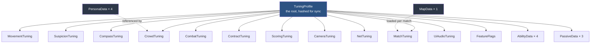
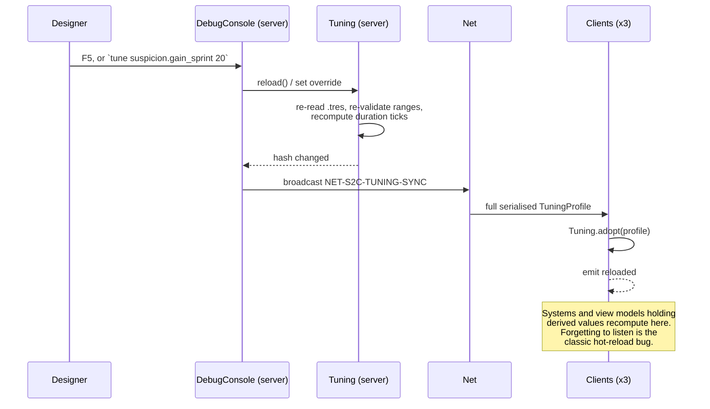
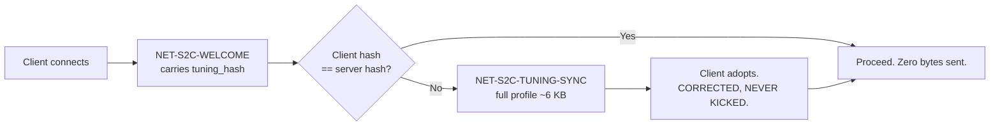

# TDD Chapter 5 — Data Architecture

> **Context restated.** Project Sottovoce has roughly 180 gameplay constants
> ([`../50_tuning/TUNABLES.md`](../50_tuning/TUNABLES.md)), and its central design claim — that
> a patient player beats an aggressive one — is a *quantitative* claim that can only be
> validated by playing, measuring, adjusting and playing again. The balance loop is the
> project's main risk-reduction activity, so anything that adds friction between "I have a
> hypothesis about `TUN-SUSPICION-GAIN-SPRINT`" and "six people are playing with the new value"
> is a direct cost to design quality.
>
> **Implements:** `SYS-TUNING`, `SYS-MAP` (the `MapData` authoring schema, §3.5),
> `SYS-PROFILE` (the stubbed persistence seam, §4.4).
> **Constrains:** every system, via ADR-0005.

---

## 1. The rule

> **No gameplay constant may appear as a literal in any script. Every one lives in a typed
> `Resource`, is documented in TUNABLES.md with a `TUN-` ID, and is server-authoritative at
> runtime.**

### 1.1 What counts as a gameplay constant

The test: **if changing this number would change how the game plays or feels, it is a tunable.**

| Is a tunable | Is not |
|---|---|
| `TUN-SPEED-SPRINT` 6.2 m/s | Collision layer index `WORLD = 1` |
| `TUN-SUSPICION-DECAY-BASE` 8.0/s | Array capacity, dictionary initial size |
| `TUN-COMPASS-PULSE-EXP` 2.2 | `TAU`, `deg_to_rad` conversions |
| `TUN-KILL-ANIM-DURATION` 1.4 s | String-table key names |
| `TUN-CAM-FOV-SPRINT` 72° | Node path constants |
| `TUN-UI-SCOREFEED-STAGGER` 0.12 s | Quantisation bit widths (protocol, not gameplay) |

**When in doubt, make it a tunable.** The cost is one line; the cost of the alternative is a
number that two code paths disagree about.

---

## 2. The resource taxonomy



| Resource | Count | Owns | Loaded |
|---|---|---|---|
| `TuningProfile` | 1 | Every gameplay number. Hashed for client/server sync | At boot; re-synced at match start |
| `AbilityData` | 4 | One ability's full specification | Sub-resource of the profile |
| `PassiveData` | 3 | One passive | Sub-resource of the profile |
| `PersonaData` | 4 | Silhouette class, mesh, animation set, identity hue | At boot |
| `MapData` | 1 | Spawns, idle anchors, circuits, zone volumes, blend props | Per match |
| `FeatureFlags` | 1 | Flag-gated incomplete work (ADR-0009) | Sub-resource of the profile |

**`PersonaData` and `MapData` sit outside `TuningProfile` deliberately.** They are *content
definitions* rather than *balance values*: they change when art or level design changes, not
when a designer is tuning, and they are far larger. Keeping them separate keeps the profile
small enough to hash and re-send cheaply (§6).

---

## 3. `TuningProfile` and its sub-resources

### 3.1 Field naming is mechanical

`TUN-<DOMAIN>-<NAME>` → `<Domain>Tuning.<name_lowercased_underscored>`.

| TUNABLES ID | Field |
|---|---|
| `TUN-SUSPICION-DECAY-BASE` | `SuspicionTuning.decay_base` |
| `TUN-COMPASS-PULSE-EXP` | `CompassTuning.pulse_exp` |
| `TUN-KILL-CONTEST-WINDOW` | `CombatTuning.kill_contest_window` |
| `TUN-SCORE-BLENDED` | `ScoringTuning.blended` |

**No judgement, no exceptions.** This is what makes `test_tuning_docs_sync.gd` possible: the
mapping is a pure string transform in both directions, so a missing field or an undocumented
ID is mechanically detectable.

### 3.2 Shape

```gdscript
## The root of all gameplay values. Server-authoritative; clients adopt the
## server's profile at match start (see §6).
class_name TuningProfile
extends Resource

@export var movement: MovementTuning
@export var suspicion: SuspicionTuning
@export var compass: CompassTuning
@export var combat: CombatTuning
@export var contract: ContractTuning
@export var crowd: CrowdTuning
@export var match_rules: MatchTuning
@export var scoring: ScoringTuning
@export var camera: CameraTuning
@export var net: NetTuning
@export var ui_audio: UiAudioTuning
@export var flags: FeatureFlags
@export var abilities: Dictionary          ## StringName(ABIL-*) -> AbilityData
@export var passives: Dictionary           ## StringName(PASV-*) -> PassiveData

## Stable hash over every exported value, for client/server comparison.
## Excludes resource paths and Godot metadata so that an identical set of
## values in a different file produces an identical hash.
func compute_hash() -> int
```

```gdscript
class_name SuspicionTuning
extends Resource

## Suspicion decayed per second at or below decay_speed_ceiling. TUN-SUSPICION-DECAY-BASE
@export_range(6.0, 12.0, 0.1) var decay_base: float = 8.0

## Speed at or below which decay applies. MUST equal MovementTuning.stroll.
## This single threshold is the design thesis expressed as one conditional. TUN-SUSPICION-DECAY-SPEED-CEILING
@export_range(1.0, 4.0, 0.1) var decay_speed_ceiling: float = 2.2

## Grace period after the last gain before decay resumes. Closes the
## tap-sprint exploit. TUN-SUSPICION-DECAY-DELAY
@export_range(0.3, 1.2, 0.05) var decay_delay: float = 0.6

## Gained per second while sprinting. The single most important number in the
## game: Noticed in 1.2 s, Exposed in 2.8 s. TUN-SUSPICION-GAIN-SPRINT
@export_range(20.0, 32.0, 0.5) var gain_sprint: float = 25.0

# ... every remaining TUNABLES §3 row, same pattern
```

**Every `@export` obeys three rules:**

1. An `@export_range` matching the **Range** column in TUNABLES.md.
2. A docstring whose **last token is the `TUN-` ID** — this is what the docs-sync check greps.
3. A one-line rationale, copied from TUNABLES.md, so a developer reading the resource never has
   to open the document to know why the number is what it is.

### 3.3 `AbilityData`

Data-driven so that adding an ability touches ≤ 3 files
([`09_ability_system.md`](09_ability_system.md) §5).

```gdscript
class_name AbilityData
extends Resource

@export var id: StringName                      ## ABIL-CINDERFALL etc. Immutable once merged.
@export var display_key: StringName             ## String-table key. NEVER a literal (ASM-0023).

# --- Timing (authored in seconds; converted to ticks at load, TDD-03 §4.1) ---
@export_range(0.0, 3.0, 0.05)  var cast_time: float
@export_range(0.0, 30.0, 0.5)  var duration: float
@export_range(10.0, 120.0, 1.0) var cooldown: float

# --- Cost ---
@export_range(0.0, 100.0, 1.0) var suspicion_cost: float
@export var forces_exposed: bool = false
@export_range(0.0, 5.0, 0.1)   var exposed_tail: float = 0.0

# --- Effect ---
@export var effect_script: Script               ## extends AbilityEffect. The only per-ability code.
@export_range(0.0, 20.0, 0.5)  var range_min: float
@export_range(0.0, 20.0, 0.5)  var range_max: float
@export_range(0.0, 12.0, 0.5)  var radius: float

# --- Tell (legibility law: at least two channels, at least one environmental or audio) ---
@export var tell_sfx: StringName                ## SFX- ID
@export_range(0.0, 30.0, 0.5)  var tell_audio_radius: float
@export var tell_vfx: PackedScene
@export_range(0.0, 20.0, 0.5)  var startle_radius: float = 0.0   ## Environmental tell

# --- Counterplay ---
@export var stunnable_during: bool = false
@export var breaks_on_sprint: bool = false
@export var breaks_on_damage: bool = false
```

**`test_ability_has_tell.gd` asserts every `AbilityData` fills at least two tell channels, with
at least one of `tell_audio_radius > 0` or `startle_radius > 0`** — the "survives the victim not
looking" requirement from [`../10_gdd/04_abilities.md`](../10_gdd/04_abilities.md) §6.2. The
legibility law is enforced by the data schema, not by review.

### 3.4 `PersonaData`

```gdscript
class_name PersonaData
extends Resource

@export var id: StringName                      ## PERSONA-VETRAIO etc.
@export var display_key: StringName

## Silhouette class. The four MVP personas MUST be mutually distinct here —
## identification at 40 m is a shape problem, not a costume problem (ASM-0003).
@export_enum("LOW_BROAD", "FLOOR_TRIANGLE", "TALL_THIN", "ROUND_MID") var silhouette: int

@export var mesh: PackedScene
@export var animation_library: AnimationLibrary

## Identity hue. Reserved by the colour-language law: nothing decorative may
## use these hues (ART_BIBLE §3).
@export var identity_hue: Color

## Clips reachable while Anonymous. EVERY one must exist in the clone's library
## or anonymity leaks. Asserted by test_clone_animation_parity.gd.
@export var anonymous_clip_names: PackedStringArray
```

### 3.5 `MapData`

Authoring data, kept deliberately separate from geometry so that **the art pass cannot move it**
([`../10_gdd/05_level_design.md`](../10_gdd/05_level_design.md) §7.3).

```gdscript
class_name MapData
extends Resource

@export var id: StringName                      ## MAP-VETRAIO
@export var playable_bounds: AABB
@export var soft_bound_4p: AABB                 ## Inner 90x90 m (GDD-05 §6)

@export var spawn_points: Array[SpawnPoint]     ## 6, TUN-SPAWN-POINT-COUNT
@export var idle_anchors: Array[IdleAnchor]     ## Position + archetype filter + prop type
@export var circuits: Array[CircuitData]        ## 4 walking-group routes
@export var blend_props: Array[BlendProp]       ## 5 concealment + ~12 static
@export var zones: Array[ZoneVolume]            ## Density band + audio zone + telemetry name
@export var theatre_spaces: Array[AABB]         ## >= 2 (GDD-05 §5)
```

---

## 4. Loading and access

### 4.1 The `Tuning` autoload

```gdscript
## Global access to gameplay values. The only autoload a pawn state may touch
## (TDD-03 §3.1), because prediction must be deterministic.
extends Node

signal reloaded                                 ## EVT-TUNING-RELOADED

var movement: MovementTuning
var suspicion: SuspicionTuning
# ... one property per sub-resource

var _profile: TuningProfile
var _duration_ticks: Dictionary                 ## StringName -> int, precomputed (TDD-03 §4.1)

func _ready() -> void:
    _load(DEFAULT_PROFILE_PATH)

## Adopt a profile received from the server. Corrected, never kicked (ADR-0005 rule 4).
func adopt(profile: TuningProfile) -> void:
    _profile = profile
    _rebind()
    _precompute_ticks()
    reloaded.emit()

## Debug builds only. Re-reads .tres from disk and re-emits `reloaded`.
func reload() -> void
```

### 4.2 Access pattern

```gdscript
# Correct — read through the autoload at point of use.
if speed > Tuning.suspicion.decay_speed_ceiling:
    ...

# Correct — durations as precomputed integer ticks (TDD-03 §4.1).
cooldown_expiry_tick = ctx.tick + Tuning.ticks(&"TUN-CINDERFALL-COOLDOWN")

# WRONG — a literal.
if speed > 2.2:
    ...

# WRONG — caching across ticks defeats hot reload.
var _decay := Tuning.suspicion.decay_base   # in _ready(), never refreshed
```

### 4.3 `SYS-PROFILE` — the stubbed persistence seam

There is no persistence in MVP (`SCOPE_FENCE` OUT #2), but the interface exists so that adding a
real store later is a single class rather than a hunt through call sites.

```gdscript
## The full surface a real store would need. MVP ships MemoryProfileStore,
## which returns defaults and discards writes (ASM-0026).
##
## A no-op implementing the FULL surface is more useful than a minimal stub,
## because it forces call sites to be written correctly now.
class_name IProfileStore
extends RefCounted

func get_input_bindings() -> Dictionary:          return {}
func set_input_bindings(_b: Dictionary) -> void:  pass
func get_audio_levels() -> Dictionary:            return {}
func set_audio_levels(_l: Dictionary) -> void:    pass
func get_accessibility() -> Dictionary:           return {}
func set_accessibility(_a: Dictionary) -> void:   pass
func get_last_loadout() -> Dictionary:            return {}
func set_last_loadout(_l: Dictionary) -> void:    pass
```

**No file I/O and no network** — a stub that touches disk is not a stub. Nothing in
`scripts/systems/` may depend on it: it is a presentation and settings concern, and a gameplay
system reading a profile would be a client-authoritative input by another route.

**Known accepted limitation:** rebinds and options do not persist across sessions in MVP. Stated
in [`../10_gdd/02_player_controller.md`](../10_gdd/02_player_controller.md) §1.4 so playtesters
are not surprised.

### 4.4 The one permitted caching exception

ADR-0005 acknowledges that autoload property access costs measurably in the crowd's inner loop.
**The crowd steering layer, and only it, may cache tuning values**, refreshed on LOD transition
and on `reloaded`:

```gdscript
## PERMITTED CACHING EXCEPTION — ADR-0005 §Consequences.
## Steering runs for up to 90 agents per tick; per-agent autoload lookups
## measured above the 0.2 ms threshold that ADR-0005 names as its revisit trigger.
## Refreshed on LOD transition and on Tuning.reloaded.
var _cached_flee_speed: float
var _cached_group_spacing: float
```

Any other cache requires a new ADR. `test_no_tuning_caching.gd` scans for assignments from
`Tuning.*` into member variables outside this file.

---

## 5. Hot reload

**The feature this whole chapter exists for.** In a live 3-client playtest, one keypress
re-tunes the running game.



| Property | Value |
|---|---|
| Availability | **Debug builds only.** Stripped from release with `DebugConsole` |
| Scope | Server broadcasts; all clients adopt. A playtest never has mixed values |
| Validation | Ranges and the 20 cross-field invariants (TUNABLES §17) re-checked on reload. **A failing invariant rejects the reload and keeps the previous profile** — a half-applied tuning change is worse than none |
| Cost of forgetting to listen | A system holding a derived value silently keeps the old one. This is the known failure mode, and it is why `EVT-TUNING-RELOADED` handling is a Definition-of-Done checklist item |

### 5.1 What must listen to `reloaded`

| Component | Recomputes |
|---|---|
| `Tuning` itself | Duration→tick table |
| Crowd steering | Its cached values (§4.3) |
| `CameraRig` | FOV ladder |
| `CompassVm` | Pulse curve constants |
| `CrowdDirector` | Target crowd count, LOD band radii |
| `SnapshotBuilder` | Cull radius, quantisation steps |

---

## 6. Server authority and the profile hash



**Why corrected rather than kicked** (ADR-0005 rule 4): a hash mismatch is far more often a
stale build than an attack, and kicking makes that diagnosis harder for exactly the person best
placed to fix it. There is no security cost — the server simulates everything that matters, so a
client with wrong values is wrong only about its own predictions, which reconciliation corrects
anyway.

**`data/tuning/local/` overrides** (gitignored, ADR-0005 rule 6) change the hash, so a client
experimenting locally is silently re-synced on joining a networked match. Local overrides work
for solo testing and cannot leak into a multiplayer session.

---

## 7. Interfaces

```gdscript
## Precomputed second→tick conversion (TDD-03 §4.1). Systems compare integers,
## never accumulated floats.
func Tuning.ticks(tun_id: StringName) -> int

## Stable hash over exported values only; excludes paths and Godot metadata,
## so identical values in a different file hash identically.
func TuningProfile.compute_hash() -> int

## Validates every @export_range plus the 20 cross-field invariants in
## TUNABLES §17. Returns an empty array when valid.
func TuningProfile.validate() -> Array[String]

## Full serialise/deserialise for NET-S2C-TUNING-SYNC.
func TuningProfile.serialise() -> PackedByteArray
static func TuningProfile.deserialise(bytes: PackedByteArray) -> TuningProfile
```

---

## 8. Files this chapter creates

| Path | Purpose |
|---|---|
| `scripts/core/tuning/tuning.gd` | The autoload |
| `scripts/core/tuning/tuning_profile.gd` | Root resource, hash, validate, serialise |
| `scripts/core/tuning/*_tuning.gd` | One per TUNABLES section (11 files) |
| `scripts/core/tuning/feature_flags.gd` | Flag-gated work (ADR-0009) |
| `scripts/core/data/ability_data.gd` | `AbilityData` |
| `scripts/core/data/passive_data.gd` | `PassiveData` |
| `scripts/core/data/persona_data.gd` | `PersonaData` |
| `scripts/core/data/map_data.gd` | `MapData` + `SpawnPoint`, `IdleAnchor`, `CircuitData`, `BlendProp`, `ZoneVolume` |
| `data/tuning/default/*.tres` | The shipping values |
| `data/tuning/default/abilities/*.tres` | 4 abilities + 3 passives |
| `data/personas/*.tres` | 4 personas |
| `data/maps/vetraio.tres` | `MAP-VETRAIO` authoring data |
| `tools/tuning_docs_sync.gd` | Bidirectional TUNABLES.md ↔ `.tres` ID check |

---

## 9. Test hooks

| Test | Asserts |
|---|---|
| `test_tuning_ranges.gd` | Every field is inside its `@export_range`, **plus all 20 cross-field invariants** in TUNABLES §17 |
| `test_tuning_docs_sync.gd` | Every `TUN-` ID in TUNABLES.md has exactly one `@export` docstring, and every `@export` has a `TUN-` ID. **The primary defence against `RISK-AGENT-DRIFT`** |
| `test_tuning_ranges_match_docs.gd` | Every `@export_range` matches the Range column in TUNABLES.md |
| `test_no_gameplay_literals.gd` | No bare numeric literal (excluding 0, 1, −1, array indices) under `scripts/systems/` or `scripts/pawn/` |
| `test_no_tuning_caching.gd` | No assignment from `Tuning.*` into a member variable, outside the §4.3 exception file |
| `test_tuning_hash_stable.gd` | The same values in two different `.tres` files produce the same hash; a single changed value changes it |
| `test_tuning_serialise_roundtrip.gd` | `deserialise(serialise(p))` equals `p` field-for-field |
| `test_tuning_reload_rejects_invalid.gd` | A reload whose profile fails `validate()` is rejected and the previous profile is retained |
| `test_ability_has_tell.gd` | Every `AbilityData` fills ≥ 2 tell channels with ≥ 1 environmental/audio (legibility law) |
| `test_persona_silhouettes_distinct.gd` | The four MVP personas have four different `silhouette` values |
| `test_clone_animation_parity.gd` | Every clip in `PersonaData.anonymous_clip_names` exists in the clone's animation library |
| `test_mapdata_completeness.gd` | 6 spawns, 4 circuits, ≥ 2 theatre spaces, ≥ 5 concealment props |
| `test_no_literal_strings.gd` | Every `display_key` resolves in `data/strings/en.csv`; no user-facing literal anywhere |

---

## 10. Performance budget contribution

| Item | Budget | Notes |
|---|---|---|
| `Tuning` property access (client, per frame) | ≤ 0.10 ms | ADR-0005's acknowledged cost; the §4.3 exception exists because the crowd exceeded it |
| `Tuning` property access (server, per tick) | ≤ 0.10 ms | |
| Profile load at boot | ≤ 40 ms | One-time |
| `compute_hash()` | ≤ 2 ms | Once per match start and per reload |
| `serialise()` / `deserialise()` | ≤ 8 ms | Only on hash mismatch. ~6 KB |
| Hot reload (debug only) | ≤ 60 ms | Includes re-validation and tick recomputation. A visible hitch is acceptable — it happens between rounds |

---

## 11. Open questions

| # | Question | Position | Needed by |
|---|---|---|---|
| 1 | Should `MapData` be inside `TuningProfile` so map authoring is hot-reloadable too? | No. It would inflate the profile from ~6 KB to ~60 KB, making the sync-on-mismatch path expensive for the common case of a stale build. Map iteration happens in the editor, not in a live match | M1 |
| 2 | `AbilityData.effect_script` is a `Script` reference, which couples data to code. Is that acceptable in a "data-driven" design? | Yes, and it is the honest boundary: an ability's *numbers* are data, its *behaviour* is code. Pretending behaviour can be data would mean building a scripting language, which is scope we do not have. See [`09_ability_system.md`](09_ability_system.md) §5 | — |
| 3 | Should hot reload be available in release builds behind a host-only flag, so playtests can run on release builds? | Not for MVP. It is a live-mutation surface with no authentication, and MVP playtests are facilitated in person on debug builds | M6 |
| 4 | The §4.3 caching exception is currently justified by an estimate, not a measurement. | Measure at M3 when 90 NPCs exist. If per-agent autoload access is under the 0.2 ms ADR-0005 threshold, **remove the exception** rather than keeping an unneeded special case | M3 |
