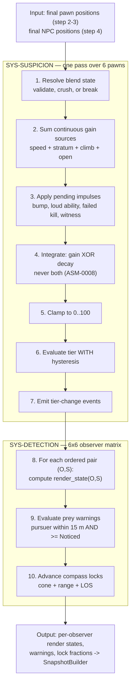

# TDD Chapter 7 — Suspicion, Blend and Detection

> **Context restated.** In Project Sottovoce every player has a hidden **suspicion** value in
> [0, 100] driving three tiers — **Anonymous** (< 30), **Noticed** (30–69), **Exposed** (≥ 70).
> Suspicion rises with speed, roof presence, climbing, being alone, bumping NPCs and loud
> abilities; it decays at 8/s **only** at stroll speed or slower. Tier is not a broadcast: a
> player at 100 suspicion looks completely ordinary to everyone except their hunter and their
> prey. Blend actions crush suspicion to 0 over 1.2 s. Standing still among ≥ 4 NPCs must be
> the strongest defensive play in the game.
>
> **Implements:** `SYS-SUSPICION`, `SYS-BLEND`, `SYS-DETECTION`, and the server half of
> `SYS-COMPASS` (lock progression and reveal, §4.5 — the client half is
> [`11_ui_architecture.md`](11_ui_architecture.md) §2.2).

---

## 1. The per-tick pipeline

All three systems run **once per 30 Hz net tick**, in this order, positions 5 and 6 of
`MatchDirector`'s sequence ([`01_architecture.md`](01_architecture.md) §4).



### 1.1 The two ordering guarantees, and why each is load-bearing

| Guarantee | Consequence of violating it |
|---|---|
| **Crowd (step 4) resolves before suspicion (step 5)** | `TUN-SUSPICION-GAIN-OPEN` depends on whether any NPC is within 6 m, and blend-pocket validity depends on NPC positions. Computing suspicion against last tick's crowd would let a player accrue "alone" suspicion inside a pocket that has already re-formed — the player believes they are blended and is not. **This is the most damaging silent failure in the game** ([`../10_gdd/03_social_stealth.md`](../10_gdd/03_social_stealth.md) §13 failure mode 7) |
| **Suspicion (step 5) resolves before detection (step 6)** | Detection renders per-observer state *from tier*. One tick of lag means the silhouette tint disagrees with the tier indicator, which is an information-channel defect in a game made of information channels |

Both are asserted by `test_system_tick_order.gd`.

---

## 2. `SYS-SUSPICION`

### 2.1 The integrator

Pure Core function, unit-testable with no engine. This is the highest-value test target in the
project after the contract cycle.

```gdscript
## Pure. Advances one player's suspicion by one tick.
## Gain and decay are MUTUALLY EXCLUSIVE (ASM-0008): above stroll speed there
## is no concurrent decay, so the ladder's costs are the full costs, not
## net-of-decay ones. Without this, a cheap gain against -8/s decay would be
## NEGATIVE and the entire speed ladder would invert.
class_name SuspicionMath
extends RefCounted

static func integrate(s: SuspicionState, t: SuspicionTuning, dt: float) -> float:
    # Blend overrides everything: linear crush toward zero.
    if s.blending:
        var crush := (Tuning.suspicion.max_value / t.blend_crush_time) * dt
        return move_toward(s.value, 0.0, crush)

    var gain := 0.0
    match s.speed_state:
        SpeedState.RUN:    gain += t.gain_run        # 14.0
        SpeedState.SPRINT: gain += t.gain_sprint     # 25.0
        SpeedState.CLIMB:  gain += t.gain_climb      # 12.0
    if s.stratum == Stratum.ROOF:
        gain += t.gain_roof                          # 18.0 — for PRESENCE, not movement
    if s.nearest_npc_distance > t.open_radius:       #  6.0 m
        gain += t.gain_open                          #  6.0

    var decay := 0.0
    if gain == 0.0 \
       and s.speed <= t.decay_speed_ceiling \
       and s.ticks_since_gain >= Tuning.ticks(&"TUN-SUSPICION-DECAY-DELAY"):
        decay = t.decay_base                         #  8.0
        if s.has_stillness and s.speed <= t.stillness_speed_ceiling:
            decay *= t.stillness_mult                # 1.40

    return clampf(s.value + (gain - decay) * dt, 0.0, t.max_value)
```

**`TUN-SUSPICION-DECAY-DELAY` (0.6 s, 18 ticks) closes MOST of the tap-sprint exploit.** Without
it, a player alternating sprint and stroll at 4 Hz gains 25/s half the time and loses 8/s the
other half, netting +8.5/s while travelling at ~4.2 m/s average. With it they pay the full sprint
rate for every sprint tick.

**MEASURED 2026-08-21, AND "STRICTLY WORSE THAN COMMITTING" IS NOT TRUE AT THE SHIPPED VALUES:**
2.024 pts/m without the delay, **2.976 with it, against a run's 3.111**. The delay adds 47 % and
leaves tap-sprinting **4.3 % cheaper per metre** than committing. GDD-03 §3.3 property 2 carries
the two candidate closures — neither of which is the integrator's, and the likely one is that a
real pawn cannot alternate at 4 Hz through `TUN-SPEED-RUN-RESOLVE` and the sprint double-tap.
`test_suspicion_tapsprint.gd` reports the gap rather than failing, and asserts the 47 % the delay
demonstrably buys.

### 2.1.1 Two amendments from US-0051, which built it

**`evaluate_tier` LETS A RISE SKIP A RUNG AND A FALL NOT.** The sketch above walks one rung per
tick in both directions, so a stunned player — `TUN-STUN-FORCES-EXPOSED` sets the scalar to 100
outright — would read **Noticed** for a tick before reaching Exposed. A rule that *forces* a tier
is not kept if it lands a tick late, and the same is true of `ABIL-WHISPERBOLT`'s wind-up.
**Nothing forces a tier downward**: the only ways down are decay and a blend crush, and a crush
takes 1.2 s — 36 ticks — so passing through Noticed on the way down is a real moment rather than
an artefact.

**`gain_rate()` IS PUBLIC, AND THAT IS WHAT KEEPS THE DELAY HONEST.** The owner has to know
whether a tick counted as a gain in order to advance `ticks_since_gain`, and a caller that
re-derived it could disagree with the integrator about what a gain was — arming the decay delay
on a different tick from the one that earned it. One function, one answer.

**AND GDD-03 §3.5's WORKED TIMELINE IS STALE, WHICH IS WHY NO TEST REPRODUCES IT.** US-0051's
test note asks for the 45-second timeline to within 0.1 points at every timestamp. That timeline
is driven by a **jog at +4/s**, and `TUN-SUSPICION-GAIN-JOG` is *deprecated with no successor*
(TUNABLES §19, 2026-08-12) along with the Jog rung itself. Re-run on the current ladder the same
actions cost +14/s and the player reaches **Exposed at 7.9 s** rather than brushing Noticed —
which inverts what the example teaches. Re-authoring a worked example is design prose and is the
owner's; the integrator is tested against §3.3, which is unambiguous and current.

### 2.1.2 The ladder lives in exactly one place, as of 2026-08-25

`scripts/pawn/` carried a **second, complete implementation** of everything in §2.1 from M1 —
`PawnState.suspicion_rate()` and twelve overrides, with a roof toll, a decay, a climb rate, a
mantle rate and a blend crush. **Nothing in the shipped game ever called any of it**, and four
unit-test files asserted it in detail, which is exactly what made it look maintained.

It was not merely a duplicate. It **disagreed**, because a pawn state cannot see the crowd and
has no memory between ticks:

| | `scripts/pawn/` | `SuspicionMath` |
|---|---|---|
| Standing alone in an empty plaza | **−8/s** (decays) | **+6/s** (`TUN-SUSPICION-GAIN-OPEN`) |
| Tap-sprinting | free — no `TUN-SUSPICION-DECAY-DELAY` | the delay applies |
| `PASV-STILLNESS` | absent | `TUN-PASV-STILLNESS-MULT` |
| Decay above stroll | applied | refused (`TUN-SUSPICION-DECAY-SPEED-CEILING`) |

Opposite signs on the mechanic that makes an empty plaza dangerous. It is deleted, and
`test/arch/test_pawn_holds_no_suspicion_rule.gd` refuses a `suspicion_rate`, a write to
`suspicion`/`tier`/`active_sources`, and any `Tuning.suspicion` field other than
`TUN-BLEND-BREAK-ON-SPEED` — which is a state *transition* rather than a rate.

**`StunnedState.enter()` WAS THE WORST OF IT, BECAUSE IT WAS A WRITE.**
`ctx.suspicion = Tuning.suspicion.max_value` sat in code replayed during prediction
reconciliation — a client deciding its own gameplay state — and it *set* the value once where
TUNABLES §17 asks for it to be **held** at Exposed for `TUN-STUN-FREEZE`, so the decay it
re-armed began eating the punishment on the next tick. `SuspicionSystem` holds it after the
integrator now, which is a ceiling rather than a nudge.

**AND ONE DOCUMENTED RULE HAD TO BE CARRIED ACROSS.** GDD-02 §6.1 prices a **mantle** at
"+11.4 (climb rate × duration)" and a vault at nothing, and `PawnStateId.VAULT` is *both* — so
the state alone cannot say which. `SuspicionState.mantling` is that bit, and it sets the `CLIMB`
source rather than claiming a sixth: hauling yourself onto a ledge is climbing to anyone
watching, and the HUD word is honest for either.

### 2.2 Impulses

Instant sources are applied **outside** the integrator, once, at the event
([`../10_gdd/03_social_stealth.md`](../10_gdd/03_social_stealth.md) §3.2):

| Impulse | Value | Debounce |
|---|---|---|
| NPC bump | `TUN-SUSPICION-GAIN-NPC-BUMP` +15 | `TUN-SUSPICION-GAIN-NPC-BUMP-COOLDOWN` 0.8 s — one shove into a group is not five stacked charges |
| Loud ability | +40 | Per activation |
| Failed kill | +30 | Per attempt |
| Witnessed kill | +25 | Per kill, if any **player** had LOS at initiation |
| Invalid stun | +20 | Per attempt |

Impulses are drained at pipeline step 3, so ordering within a tick is deterministic regardless of
the order events fired.

### 2.2.1 Three amendments from US-0052, which built the system

**THE QUEUE IS THE SYSTEM'S, NOT `PawnContext`'s.** That object lives in `scripts/pawn/`, which
is replayed during prediction reconciliation — a client replaying twenty commands would walk a
queue of gameplay impulses twenty times, which is never-do #3 with a queue in front of it.
`SuspicionImpulses` holds them, which also makes the debounce a thing a test can *ask about*
rather than infer from a value.

**AN IMPULSE RE-ARMS `TUN-SUSPICION-DECAY-DELAY`.** `ticks_since_gain` means *ticks since this
player last did something suspicious*, and a shove is unambiguously that. Without the re-arm, a
bump taken by a player whose decay was already running is refunded from the tick it lands on —
and two players sitting at 15, one from running and one from a shove, would decay differently.
A decay curve that carried information about *how* the value was earned is a channel nothing in
the design intends.

**THE ORDER TWO IMPULSES ARRIVE IN CANNOT MATTER, AND THAT IS ARITHMETIC RATHER THAN
DISCIPLINE.** Every impulse is positive and the sum is clamped once, so `min(max, a + b)` is the
answer whichever came first. `SuspicionImpulses` refuses a negative value outright: a
*reduction* is decay's job or a blend's, and both have rules — the speed ceiling, the delay, the
linear crush — that an impulse would route around.

### 2.2.2 The active-source bitfield is the same decision as the gain

`active_sources` is a `u8` on the wire (NETWORK_PROTOCOL §4) and prints under the tier as the
words that answer *"why am I visible?"* — GDD-03 §13's failure mode 3 is **suspicion is opaque**,
and a player who cannot attribute their suspicion cannot learn from it.

**`SuspicionSources.of()` IS THE ONLY PLACE THOSE CONDITIONS ARE APPLIED**, and
`SuspicionMath.gain_rate()` returns the sum of the rates of exactly the bits it sets. Computing
the list separately would drift from the value it explains the first time a condition was
retuned — with no error, and with the symptom being a player who reads "sprinting" while the
number climbs because they are alone, and who then learns to stop reading the channel at all.
`test_suspicion_sources.gd` sweeps every combination of state × roof × alone × blending and
asserts the two agree, then asserts the sweep reached every bit.

### 2.3 Hysteresis

```gdscript
## Tier is entered at its threshold and exited TUN-SUSPICION-HYSTERESIS (5.0) below it.
## Without this, a player hovering at exactly 30.0 — which happens constantly,
## because 30.0 is where a slow climb crosses — flickers at 30 Hz. The visible
## result is a strobing tint; the ACTUAL result is that the tint stops being
## trustworthy information, and this game is an information economy. An unreliable
## channel is worse than a missing one.
static func evaluate_tier(value: float, current: int, t: SuspicionTuning) -> int:
    match current:
        Tier.ANONYMOUS:
            return Tier.NOTICED if value >= t.tier_noticed else Tier.ANONYMOUS
        Tier.NOTICED:
            if value >= t.tier_exposed:                        return Tier.EXPOSED
            if value <  t.tier_noticed - t.hysteresis:         return Tier.ANONYMOUS
            return Tier.NOTICED
        Tier.EXPOSED:
            if value < t.tier_exposed - t.hysteresis:          return Tier.NOTICED
            return Tier.EXPOSED
    return current
```

---

## 3. `SYS-BLEND`

### 3.1 Validation, every tick

A blend is not a state you enter and keep — it is a **condition re-validated every tick**. This
matters because the crowd moves: a pocket that had 5 NPCs can drop to 3 when a Startle scatters
it, and the player must stop being blended at that instant.

```gdscript
## Re-validated EVERY tick. A blend that silently keeps working after its
## conditions lapse is the "I thought I was hidden" bug class.
func _validate(ctx: MatchContext, pawn: PawnServer) -> bool:
    match pawn.blend_type:
        BlendType.POCKET:
            return ctx.crowd.npcs_within(pawn.position, Tuning.blend.pocket_radius) \
                   >= Tuning.blend.pocket_min_npc                       # 3.5 m, >= 4
        BlendType.GROUP:
            var slot := ctx.crowd.group_slot_of(pawn)
            return slot != null \
                   and pawn.position.distance_to(slot.position) <= Tuning.blend.group_slot_tolerance
        BlendType.PROP_STATIC, BlendType.PROP_CONCEAL:
            return pawn.velocity.length() <= 0.01
    return false

## Break conditions, checked before validation. Any true -> blend ends.
func _should_break(pawn: PawnServer) -> bool:
    return pawn.velocity.length() > Tuning.blend.break_on_speed \
        or pawn.took_damage_this_tick \
        or pawn.state_id == &"Stunned"
```

### 3.1.1 Four amendments from US-0053, which built it

**`BlendSystem` IS NOT A `GameSystem`, AND §5's SIGNATURE IS AMENDED.** `MatchDirector` permits
**one system per stage** and refuses a second with a log error. §1's diagram draws blend
resolution as *step 1 inside the `SYS-SUSPICION` box*, and TDD-01 §4.1's rationale for
*crowd before suspicion* is already written as "…**and blend-pocket validity depends on NPC
positions**" — so the blend belongs to stage 4 rather than to a stage of its own. It is a pure
`RefCounted` that `SuspicionSystem` owns and resolves first, which is the same shape as
`ContractCycle` under `ContractSystem` and `SnapshotDelta` under `SnapshotBuilder`, and it keeps
the decision askable in a test with no director present.

**ENTERING IS NOT YET BLENDED AND LEAVING IS NO LONGER BLENDED.** §4.1 says entry is 0.35 s
during which "you are vulnerable and visibly transitioning", so the crush cannot have started —
a player would otherwise be paid for a commitment they have not finished making. `BlendRecord`
carries a four-value phase (`OUT ENTERING HELD LEAVING`); **the phase is not on the wire**, which
carries the *kind* only, because `EVT-BLEND-STATE-CHANGED` and `blend_state:u4` both name the
five kinds and nothing else.

**A BREAK IS NOT AN EXIT.** US-0053's sixth criterion says a scattered pocket ends the blend
**that tick**, so a break has no 0.30 s of standing up. A blend that is being *left*, by
contrast, is no longer re-validated: the crowd walking off during those 0.30 s must not convert a
clean exit into a break.

**THE SLOT WALKS AND THE PLAYER KEEPS UP — NOTHING MOVES THE PAWN.** The group blend *judges*
rather than steers. Driving a blended player toward their formation slot would put the server in
charge of a position the client predicts, and every tick of the blend would be a reconciliation;
it would also take the agency GDD-03 §4.1.2 trades for mobility without charging for it.

### 3.2 The blend-score grace window

`TUN-BLEND-SCORE-GRACE` 1.0 s (30 ticks). A player may initiate a kill up to one second after
leaving a blend and still earn `SCORE-BLENDED` (+200).

```gdscript
## Set on blend exit; decremented each tick. KillSystem reads it at initiation.
## This is what makes the blend-then-strike play legible and reliable rather
## than frame-perfect — the single most valuable bonus in the game must not
## depend on 33 ms of timing.
BlendRecord.grace_ticks = Tuning.ticks(&"TUN-BLEND-SCORE-GRACE")
```

**IT ARMS ON ANY EXIT FROM `HELD`, INCLUDING A BREAK** (US-0053). The alternative — only a
deliberate exit qualifies — hands a hunter a way to deny +200 by sprinting past a pocket and
scattering it, which *pays* the reckless approach the whole design exists to charge for. A player
who was blended a second ago was blended. An interrupted **entry** arms nothing: pressing the key
near a crowd and being scattered 0.1 s later is not a blend, and crediting it would make the
bonus reachable by tapping.

### 3.3 Concealment prop capacity

`TUN-BLEND-PROP-CAPACITY` is 1. The prop is a **claimable resource**, so occupancy is
server-owned state and a second player's request is refused with distinct feedback rather than
silently failing.

`TUN-BLEND-PROP-EXIT-VULN` 0.5 s prevents door-flickering to dodge a kill attempt.

---

## 4. `SYS-DETECTION`

### 4.1 The render-state rule

For every ordered pair of players (observer **O**, subject **S**) — 30 pairs at 6 players:

```gdscript
## THE anonymity rule. Computed server-side, per observer, every tick.
## A client NEVER computes another player's render state.
func render_state(o: PawnServer, s: PawnServer, cycle: ContractCycle) -> int:
    if s.tier == Tier.ANONYMOUS:
        return RenderState.PLAIN
    if cycle.contract_of(o.peer_id) == s.peer_id:
        return RenderState.HARD if s.tier == Tier.EXPOSED else RenderState.TINTED
    if cycle.contract_of(s.peer_id) == o.peer_id and s.tier == Tier.EXPOSED:
        return RenderState.HARD                    # your pursuer, if reckless
    return RenderState.PLAIN
```

**Three consequences that must be preserved:**

1. **Suspicion is not a broadcast.** A player at 95 suspicion is `PLAIN` to everyone except
   their hunter and, if Exposed, their prey. At 6 players, four of five observers see nothing.
   This is what stops the game collapsing into "everyone converges on the visible player".
2. **The relationship determines the channel.** The same player at the same suspicion is
   rendered differently to different observers *simultaneously*. This is a per-observer field in
   the snapshot, not a material swap on a shared mesh.
3. **Exposed cuts both ways.** Visible to your hunter *and* to your prey. Recklessness is
   punished twice by one mechanic.

`test_render_state_per_observer.gd` asserts all three.

#### 4.1.1 Three amendments from US-0055, which built it

**IT READS THE ANNOUNCED CONTRACT, NEVER THE GRAPH'S.** `SYS-CONTRACT` repairs the cycle in the
tick a death resolves and holds the *announcement* for `TUN-CONTRACT-REASSIGN-DELAY`. Rendering
from `cycle.contract_of()` would put a tint on a player the hunter has not been given yet — the
silhouette arriving before the Compass, and the breath worth nothing.
`MatchContext.announced_contracts` is that view, and it is `ContractSystem`'s own map adopted by
reference rather than mirrored, so the two cannot drift.

**THE MATRIX COSTS NO RAYCASTS AT ALL.** §4.3's ladder is written as though the render state
needed one; it does not. §2.1's rule is `tier × relationship` and nothing else, and §2.3 draws
the Exposed outline *through* geometry — so occlusion must not gate it. The 2–6 raycasts §4.3
budgets belong to the Compass lock and `SCORE-FOCUS`, which are US-0058's and US-0064's.
`DetectionSystem.raycasts_last_tick` publishes the number rather than assuming it.

**A NOTICED PURSUER IS `PLAIN` TO THEIR PREY**, which §4.1's sketch does not say either way and
§9 question 1 answers: a tint at Noticed would let prey track a merely-Noticed hunter
continuously, making the 15 m warning radius meaningless. `HARD` at Exposed is the whole of what
prey ever see.

### 4.2 Line of sight

**One query, used by everything**, so that `SCORE-FOCUS`, the Compass lock and Cinderfall
occlusion can never disagree:

```gdscript
## The ONLY line-of-sight query in the project.
## Blocked by: world geometry, active Cinderfall volumes.
## NOT blocked by: NPCs, other players, corpses.
func has_los(from: Vector3, to: Vector3, at_tick: int = -1) -> bool
```

> **NPCs do not block line of sight.** Counterintuitive and deliberate. If NPCs occluded LOS, a
> dense crowd would be *mechanically* opaque and the skill of picking a person out of a crowd
> would be replaced by a visibility calculation. The crowd must hide you by being **confusing**,
> never by being **solid**. That is the difference between social stealth and cover shooting.

`at_tick >= 0` rewinds for kill/stun validation (ADR-0010); otherwise the query is current.

**THE REWOUND FORM IS REFUSED RATHER THAN FAKED** (US-0056). Geometry does not move, so a rewound
query against the world alone answers exactly as a current one — and would *look* correct while
the players it is really about sat at today's positions. `RewoundWorld` carries those and
`SYS-KILL` (US-0060) is what pairs the two. Until then `has_los` returns false, logs, and counts
the refusal in `rewinds_refused`, because a caller quietly receiving `false` for a whole match
would look like a world with no line of sight in it.

**THE MASK IS THE RULE, NOT A FILTER.** The query masks `WORLD` (layer 1) alone, and NPCs,
players and corpses all sit on `PAWN`/`NPC` — so it cannot see them however a caller writes it.
`test_los_single_query.gd` refuses a second raycast anywhere under `scripts/systems/`,
`scripts/net/` or `scripts/server/`, and asserts the chokepoint still casts, so the guard cannot
pass by the query having been deleted.

**AND CINDERFALL IS A SPHERE, NOT A BODY.** `TUN-CINDERFALL-BLOCKS-LOS` is honoured by testing
the *segment* against `TUN-CINDERFALL-RADIUS` — a cloud between two players touches neither, which
is the point of area denial. Putting a `StaticBody3D` on the `WORLD` layer for four seconds would
also block the traversal probes, so a player could vault a cloud.

### 4.3 Cost control

30 ordered pairs × (distance + LOS raycast) per tick would be 30 raycasts at 30 Hz. Reduced by
early-outs, cheapest first:

```
for each ordered pair (O, S):
    if S.tier == ANONYMOUS:                    continue   # ~70% of pairs, no raycast
    if not (contract(O)==S or contract(S)==O): continue   # ~60% of the remainder
    if distance > COMPASS_RANGE_MAX (60 m):    continue
    # only now consider a raycast, and only for lock progression
```

In practice **2–6 raycasts per tick**, not 30, because most players are Anonymous most of the
time — which is the game working.

### 4.4 The prey warning

```gdscript
## The prey's ONLY warning, and the single most important feedback in the game.
func _evaluate_warning(prey: PawnServer, pursuer: PawnServer, tick: int) -> bool:
    if pursuer.tier < Tier.NOTICED:                                    return false
    if prey.position.distance_to(pursuer.position) > Tuning.compass.warn_radius:  return false
    if tick - prey.last_warning_tick < Tuning.ticks(&"TUN-COMPASS-WARN-COOLDOWN"): return false
    prey.last_warning_tick = tick
    return true
```

**The payload is a tick and nothing else** ([`04_networking.md`](04_networking.md) §6.4). There
is no direction field, no distance field, no identity field. `TUN-COMPASS-WARN-GIVES-DIRECTION`
is `false`, and the protocol makes it *unimplementable* rather than merely disabled — there is
no field to accidentally render.

**The tier gate has three consequences:**

1. A competent hunter never triggers it. An Anonymous hunter can stand at conversational
   distance behind you indefinitely. The most dangerous approaches are silent.
2. The warning's *absence* is also information — but unreliable information, which is perfect.
3. It is the **same threshold as the stun gate** (`TUN-STUN-MIN-TIER`, TUNABLES invariant
   §17.8). "I was warned about them" and "I can stun them" are the same condition. Two
   thresholds would be unlearnable; one makes the warning functionally an instruction: *turn
   around and stun*.

### 4.5 Compass lock progression

```gdscript
func _advance_lock(hunter: PawnServer, target: PawnServer, dt: float) -> void:
    var can_lock := _within_cone(hunter, target, Tuning.compass.lock_cone) \
        and hunter.position.distance_to(target.position) <= Tuning.compass.lock_range \
        and has_los(hunter.eye_position(), target.center_position())

    var rate := 1.0 / Tuning.compass.lock_fill_time                    # 1.6 s
    if hunter.has_passive(Ids.PASV_COLDREAD):
        rate *= Tuning.passives.cold_read_mult                         # 1.30

    if can_lock:
        hunter.lock_fraction = minf(hunter.lock_fraction + rate * dt, 1.0)
        if hunter.lock_fraction >= 1.0 and _reveal_off_cooldown(hunter):
            _grant_reveal(hunter, target)                              # 1.5 s silhouette
            hunter.portrait_revealed = true                            # PERMANENT for this contract (ASM-0030)
    else:
        # Drains 1.4x faster than it fills: peeking repeatedly is strictly worse
        # than committing to one clear view — which pushes the hunter toward
        # standing still and watching, which also keeps their suspicion at zero.
        hunter.lock_fraction = maxf(
            hunter.lock_fraction - rate * Tuning.compass.lock_decay_rate * dt, 0.0)
```

**Why 1.6 s specifically:** deliberately longer than one NPC stride cycle (~1.1 s at
`TUN-CROWD-NPC-SPEED-STROLL`). A lock cannot be completed through the incidental gaps in a
walking group — the target must be genuinely, continuously visible. A shorter fill would let
hunters lock through crowds, which would make the crowd cosmetic.

---

## 5. Interfaces

**`SuspicionSystem` AS BUILT** (US-0052). It has no `value_of`/`tier_of`: the value and the tier
live on `PawnContext`, which is what `SnapshotBuilder` reads, and a copy held in the system would
be a second authority for the number the whole social layer is judged against.

```gdscript
class_name SuspicionSystem extends GameSystem
signal tier_changed(peer: int, tier: int, sources: int)
var impulses := SuspicionImpulses.new()          ## queue() / bump() / drain()
func stage() -> StringName                        ## &"suspicion"
func tick(ctx: MatchContext, dt: float) -> void
func report_npc_bump(peer: int, ctx: MatchContext) -> bool   ## no caller — see below

## **NOT a GameSystem** — see §3.1.1. One system per stage, and the blend is step 1
## of the suspicion pass. `SuspicionSystem.blend` is the instance.
class_name BlendSystem extends RefCounted
signal blend_changed(peer: int, kind: int)                ## EVT-BLEND-STATE-CHANGED, server half
func request(peer: int, ctx: MatchContext) -> int         ## the kind taken, or NONE — never silence
func report_damage(peer: int, ctx: MatchContext) -> void  ## breaks; never absorbs
func forget(peer: int, ctx: MatchContext) -> void         ## releases the formation slot too
func resolve(ctx: MatchContext) -> void                   ## step 1 of the suspicion pass
func is_crushing(peer: int) -> bool                       ## feeds SuspicionState.blending
func wire_kind(peer: int) -> int                          ## the snapshot's blend_state:u4
func grace_ticks_remaining(peer: int) -> int              ## read by KillSystem for SCORE-BLENDED

class_name DetectionSystem extends GameSystem
func render_state(observer: int, subject: int) -> int
func has_los(from: Vector3, to: Vector3, at_tick: int = -1) -> bool
func lock_fraction(hunter: int) -> float
func warning_fired_this_tick(prey: int) -> bool
```

---

## 6. Files this chapter creates

**AUDITED 2026-08-25 AGAINST THE REPOSITORY.** Three of the six paths in the original table were
wrong — the suspicion files live under `scripts/core/suspicion/` and `scripts/systems/suspicion/`
rather than loose in `core/math/` and `systems/`. A table that names a path nothing occupies is
trap 14's shape, and the claim is worse than the absence because it stops anybody checking.

| Path | Purpose | State |
|---|---|---|
| `scripts/core/suspicion/suspicion_math.gd` | Pure integrator + tier evaluation (§2) | **Built**, US-0051 |
| `scripts/core/suspicion/suspicion_state.gd` | `SuspicionState` input struct | **Built**, US-0051 |
| `scripts/core/suspicion/suspicion_sources.gd` | The `active_sources` bitfield (§2.2.2) | **Built**, US-0052 |
| `scripts/core/suspicion/suspicion_impulses.gd` | The impulse queue and the bump debounce (§2.2) | **Built**, US-0052 |
| `scripts/systems/suspicion/suspicion_system.gd` | `SYS-SUSPICION` | **Built**, US-0052 |
| `scripts/core/blend/blend_kind.gd` | The five kinds, as `blend_state:u4` | **Built**, US-0053 |
| `scripts/core/blend/blend_record.gd` | One player's blend: kind, phase, grace | **Built**, US-0053 |
| `scripts/systems/blend/blend_system.gd` | `SYS-BLEND` | **Built**, US-0053 |
| `scripts/systems/detection/detection_system.gd` | `SYS-DETECTION` and the one LOS query | **Built**, US-0055/0056 |
| `scripts/systems/detection/cinderfall_volumes.gd` | The only occluder that is not geometry | **Built**, US-0056 |
| `scripts/core/detection/render_state.gd` | `RenderState` enum and the anonymity rule | **Built**, US-0055 |
| `scripts/core/detection/render_matrix.gd` | Per-observer states for one tick | **Built**, US-0055 |

---

## 7. Test hooks

**AUDITED 2026-08-25.** Twenty-three rows, of which **eight are files that exist**. Two named
tests were never written under those names and their property is asserted elsewhere; the other
thirteen belong to systems M4 has not built. Recorded here rather than left as claims, because
trap 14's whole cost is that the claim stops anybody checking.

| Test | Asserts | State |
|---|---|---|
| `test_suspicion_math.gd` | ~~Reproduces the GDD-03 §3.5 worked 45 s timeline~~ — **the timeline is stale** (§2.1.1). Asserts §3.3's eight properties instead | **Built**, US-0051 |
| `test_suspicion_exclusive.gd` | Gain and decay never both apply in one tick | **Never written.** It is `test_suspicion_math.gd`'s first two tests |
| `test_suspicion_tapsprint.gd` | 4 Hz sprint/stroll alternation yields **higher** suspicion per metre than continuous running | **Built** and `pending`: 4.3 % cheaper, not higher (§2.1) |
| `test_suspicion_additive.gd` | Sprint + roof + open = 49/s → Exposed in 1.4 s | **Never written.** It is `test_suspicion_math.gd`'s `test_sources_sum_additively` |
| `test_suspicion_sources.gd` | `gain_rate()` equals the sum of the bits `of()` sets, over every combination | **Built**, US-0052 |
| `test_roof_toll.gd` | The 18/s toll applies regardless of speed, is added rather than swapped, and blocks decay | **Built** US-0020, re-authored against `SuspicionMath` 2026-08-25 |
| `test_pawn_holds_no_suspicion_rule.gd` | `scripts/pawn/` declares no rate, writes no mirrored field and reads no threshold | **Built**, arch guard, 2026-08-25 |
| `test_suspicion_hysteresis.gd` | No tier oscillates faster than 1 Hz under any input pattern | **Built**, US-0051 |
| `test_suspicion_impulse_debounce.gd` | Five NPC bumps in 0.5 s apply one impulse; five spaced a cooldown apart apply five | **Built**, US-0052 |
| `test_suspicion_system.gd` | The world is read from this tick's hash; the value reaches the pawn; a crossing is announced once | **Built**, US-0052 |
| `test_suspicion_is_never_predicted.gd` | No client file computes a suspicion value or writes a mirrored field | **Built**, US-0052 |
| `test_suspicion_is_wired_into_the_server.gd` | The system is in `server_root.tscn` **and registered** | **Built**, US-0052 |
| `test_blend_revalidated.gd` | A pocket dropping below 4 NPCs breaks the blend **that tick** | **Built**, US-0053 |
| `test_blend_grace.gd` | A kill initiated 0.9 s after blend exit earns `SCORE-BLENDED`; at 1.1 s it does not | **Built**, US-0053 |
| `test_blend_prop_capacity.gd` | A second player's request on an occupied prop is refused with feedback | US-0054 |
| `test_blend_group_slot.gd` | The reserved fifth slot is claimable once; drifting past 0.8 m breaks it; nothing moves the pawn | **Built**, US-0053 |
| `test_blend_not_cover.gd` | A blended pawn can be killed and stunned normally | **Never written as such.** Its live half is `test_blend_revalidated.gd`'s damage and stun cases: the blend *breaks* rather than absorbing. The rest needs `SYS-KILL` |
| `test_render_state_per_observer.gd` | One player at suspicion 100: bystanders get `PLAIN`, hunter gets `HARD`, prey gets `HARD` | **Built**, US-0055 |
| `test_detection_system.gd` | The pass reaches every ordered pair, reads the *announced* contract, and spends no raycast | **Built**, US-0055 |
| `test_los_ignores_npcs.gd` | A wall of 10 NPCs between two players does not block LOS | **Built**, US-0056 |
| `test_los_single_query.gd` | **Source scan:** nothing under `systems/`, `net/` or `server/` raycasts but `DetectionSystem` | **Built**, US-0056. The *consumers* half waits for US-0058 and US-0064 |
| `test_warning_tier_gate.gd` | An Anonymous pursuer at 2 m fires no warning; a Noticed pursuer at 14 m does | US-0059 |
| `test_warning_payload_empty.gd` | `NET-S2C-PREY-WARNING` has exactly one field | US-0059. The **signal**'s arity is already guarded by `test/arch/test_prey_warning_signal_arity.gd` |
| `test_warning_thresholds_match.gd` | `TUN-COMPASS-WARN-MIN-TIER == TUN-STUN-MIN-TIER` (invariant §17.8) | US-0059 |
| `test_lock_through_crowd.gd` | A lock cannot complete through a walking group's incidental gaps | US-0058 |
| `test_lock_decay_faster.gd` | A broken lock drains 1.4× faster than it filled | US-0058 |
| `test_portrait_permanent.gd` | Portrait stays revealed after the 1.5 s reveal ends, and resets on reassignment | US-0058 |

---

## 8. Performance budget contribution

Against `TUN-PERF-GAMEPLAY-BUDGET` 2.0 ms (client mirror) and
`TUN-PERF-SERVER-TICK-BUDGET` 8.0 ms.

| Item | Budget | Notes |
|---|---|---|
| **Server**, per tick | | |
| Suspicion integration (6 pawns) | ≤ 0.05 ms | Pure arithmetic |
| Nearest-NPC query (6 pawns) | ≤ 0.15 ms | Spatial hash from `CrowdDirector`, not a physics query |
| Blend validation (6 pawns) | ≤ 0.10 ms | Same spatial hash |
| Render-state matrix (30 pairs, early-outs) | ≤ 0.08 ms | Most pairs exit on the tier check |
| LOS raycasts (2–6 typical) | ≤ 0.20 ms | |
| Lock progression | ≤ 0.03 ms | |
| **Server total** | **≤ 0.61 ms** of 8.0 ms | |
| **Client**, per frame | | |
| Mirror application + tier transition lerp | ≤ 0.05 ms | Client computes nothing here |
| **Client total** | **≤ 0.05 ms** | |

**The nearest-NPC query is the item to watch, and US-0052 built it against the shared hash rather
than a physics query** — `test_suspicion_is_wired_into_the_server.gd` refuses `intersect_shape`,
`intersect_ray` and `PhysicsServer3D` anywhere in the system, because a shape query would be a
second answer to a question the grid already holds, six times a tick, against a world the grid
was built from at the top of the same tick. **Neither server row is measured yet**: the whole
suspicion stage is well inside `test_server_tick_budget.gd`'s 2.27 ms maximum for six pawns and
the full crowd, and separating 0.05 ms out of that needs a profiler this project does not have.

A naive O(pawns × NPCs) scan is 540 distance checks per tick. The spatial hash from [`08_crowd_system.md`](08_crowd_system.md) §6 reduces
this to a handful of bucket lookups, and it is shared with blend validation and Startle
propagation.

---

## 9. Open questions

| # | Question | Position | Needed by |
|---|---|---|---|
| 1 | Should the **Noticed** tint be visible to the prey as well as the hunter, giving a graduated warning instead of a cliff? | **No** for MVP. It would let prey track a Noticed hunter continuously, making the 15 m warning radius meaningless and handing prey a tracking tool | M4 |
| 2 | `TUN-SUSPICION-GAIN-WITNESSED-KILL` (+25) is an addition beyond the brief, added to give theatre spaces mechanical weight. | Keep, measure at M4. It can be set to 0 to disable with no other change | M4 |
| 3 | LOS uses a single centre-to-centre ray. Should it sample multiple points (head, torso, feet) so a player half-behind cover is partially occluded? | Single ray for MVP. Multi-sample triples the cost for a nuance that mostly affects lock progression, where the 1.6 s fill already forgives brief breaks | M5 |
| 4 | Should `PawnContext`'s server-authoritative fields (`suspicion`, `tier`, `active_sources`, `blend_state`) move to a separate mirrored object, so predicting them is structurally impossible rather than merely forbidden? | **Still open, and US-0052 bought most of the value without moving them.** `PredictedState` has nowhere to put gameplay state and `test_suspicion_is_never_predicted.gd` asserts both that and the absence of any client-side write. What a separate object would additionally buy is that a *server* system could not write them from the wrong stage, which nothing has yet tried to do | M4 |
| 5 | Nothing calls `SuspicionSystem.report_npc_bump()`, because `npc_server.tscn` and `pawn_server.tscn` both mask `WORLD` only — a pawn and an NPC pass through each other and there is no contact to report. Should the crowd be solid? | **The owner's**, and it is a feel decision rather than a systems one: it changes how movement through a dense pocket reads. Charging `TUN-SUSPICION-GAIN-NPC-BUMP` for an overlap the player felt nothing from would be an impulse with no tell, which design law 3 forbids as firmly for a cost as for an ability | M4 |
