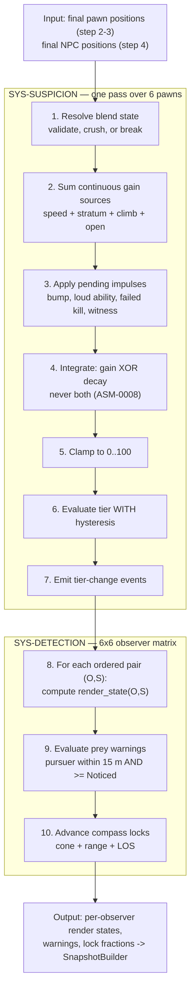

# TDD Chapter 7 — Suspicion, Blend and Detection

> **Context restated.** In Project Sottovoce every player has a hidden **suspicion** value in
> [0, 100] driving three tiers — **Anonymous** (< 30), **Noticed** (30–69), **Exposed** (≥ 70).
> Suspicion rises with speed, roof presence, climbing, being alone, bumping NPCs and loud
> abilities; it decays at 8/s **only** at stroll speed or slower. Tier is not a broadcast: a
> player at 100 suspicion looks completely ordinary to everyone except their hunter and their
> prey. Blend actions crush suspicion to 0 over 1.2 s. Standing still among ≥ 4 NPCs must be
> the strongest defensive play in the game.
>
> **Implements:** `SYS-SUSPICION`, `SYS-BLEND`, `SYS-DETECTION`, and the server half of
> `SYS-COMPASS` (lock progression and reveal, §4.5 — the client half is
> [`11_ui_architecture.md`](11_ui_architecture.md) §2.2).

---

## 1. The per-tick pipeline

All three systems run **once per 30 Hz net tick**, in this order, positions 5 and 6 of
`MatchDirector`'s sequence ([`01_architecture.md`](01_architecture.md) §4).



### 1.1 The two ordering guarantees, and why each is load-bearing

| Guarantee | Consequence of violating it |
|---|---|
| **Crowd (step 4) resolves before suspicion (step 5)** | `TUN-SUSPICION-GAIN-OPEN` depends on whether any NPC is within 6 m, and blend-pocket validity depends on NPC positions. Computing suspicion against last tick's crowd would let a player accrue "alone" suspicion inside a pocket that has already re-formed — the player believes they are blended and is not. **This is the most damaging silent failure in the game** ([`../10_gdd/03_social_stealth.md`](../10_gdd/03_social_stealth.md) §13 failure mode 7) |
| **Suspicion (step 5) resolves before detection (step 6)** | Detection renders per-observer state *from tier*. One tick of lag means the silhouette tint disagrees with the tier indicator, which is an information-channel defect in a game made of information channels |

Both are asserted by `test_system_tick_order.gd`.

---

## 2. `SYS-SUSPICION`

### 2.1 The integrator

Pure Core function, unit-testable with no engine. This is the highest-value test target in the
project after the contract cycle.

```gdscript
## Pure. Advances one player's suspicion by one tick.
## Gain and decay are MUTUALLY EXCLUSIVE (ASM-0008): above stroll speed there
## is no concurrent decay, so the ladder's costs are the full costs, not
## net-of-decay ones. Without this, jog at +4/s against -8/s decay would be
## NEGATIVE and the entire speed ladder would invert.
class_name SuspicionMath
extends RefCounted

static func integrate(s: SuspicionState, t: SuspicionTuning, dt: float) -> float:
    # Blend overrides everything: linear crush toward zero.
    if s.blending:
        var crush := (Tuning.suspicion.max_value / t.blend_crush_time) * dt
        return move_toward(s.value, 0.0, crush)

    var gain := 0.0
    match s.speed_state:
        SpeedState.JOG:    gain += t.gain_jog        #  4.0
        SpeedState.RUN:    gain += t.gain_run        # 14.0
        SpeedState.SPRINT: gain += t.gain_sprint     # 25.0
        SpeedState.CLIMB:  gain += t.gain_climb      # 12.0
    if s.stratum == Stratum.ROOF:
        gain += t.gain_roof                          # 18.0 — for PRESENCE, not movement
    if s.nearest_npc_distance > t.open_radius:       #  6.0 m
        gain += t.gain_open                          #  6.0

    var decay := 0.0
    if gain == 0.0 \
       and s.speed <= t.decay_speed_ceiling \
       and s.ticks_since_gain >= Tuning.ticks(&"TUN-SUSPICION-DECAY-DELAY"):
        decay = t.decay_base                         #  8.0
        if s.has_stillness and s.speed <= t.stillness_speed_ceiling:
            decay *= t.stillness_mult                # 1.40

    return clampf(s.value + (gain - decay) * dt, 0.0, t.max_value)
```

**`TUN-SUSPICION-DECAY-DELAY` (0.6 s, 18 ticks) closes the tap-sprint exploit.** Without it, a
player alternating sprint and stroll at 4 Hz would gain 25/s half the time and lose 8/s the
other half, netting +8.5/s while travelling at ~4.2 m/s average — better than running at 14/s.
The delay makes stop-start movement strictly worse than committing.
`test_suspicion_tapsprint.gd` asserts exactly this.

### 2.2 Impulses

Instant sources are applied **outside** the integrator, once, at the event
([`../10_gdd/03_social_stealth.md`](../10_gdd/03_social_stealth.md) §3.2):

| Impulse | Value | Debounce |
|---|---|---|
| NPC bump | `TUN-SUSPICION-GAIN-NPC-BUMP` +15 | `TUN-SUSPICION-GAIN-NPC-BUMP-COOLDOWN` 0.8 s — one shove into a group is not five stacked charges |
| Loud ability | +40 | Per activation |
| Failed kill | +30 | Per attempt |
| Witnessed kill | +25 | Per kill, if any **player** had LOS at initiation |
| Invalid stun | +20 | Per attempt |

Impulses queue on `PawnContext` and are drained at pipeline step 3, so ordering within a tick is
deterministic regardless of the order events fired.

### 2.3 Hysteresis

```gdscript
## Tier is entered at its threshold and exited TUN-SUSPICION-HYSTERESIS (5.0) below it.
## Without this, a player hovering at exactly 30.0 — which happens constantly,
## because 30.0 is where jog's slow climb crosses — flickers at 30 Hz. The visible
## result is a strobing tint; the ACTUAL result is that the tint stops being
## trustworthy information, and this game is an information economy. An unreliable
## channel is worse than a missing one.
static func evaluate_tier(value: float, current: int, t: SuspicionTuning) -> int:
    match current:
        Tier.ANONYMOUS:
            return Tier.NOTICED if value >= t.tier_noticed else Tier.ANONYMOUS
        Tier.NOTICED:
            if value >= t.tier_exposed:                        return Tier.EXPOSED
            if value <  t.tier_noticed - t.hysteresis:         return Tier.ANONYMOUS
            return Tier.NOTICED
        Tier.EXPOSED:
            if value < t.tier_exposed - t.hysteresis:          return Tier.NOTICED
            return Tier.EXPOSED
    return current
```

---

## 3. `SYS-BLEND`

### 3.1 Validation, every tick

A blend is not a state you enter and keep — it is a **condition re-validated every tick**. This
matters because the crowd moves: a pocket that had 5 NPCs can drop to 3 when a Startle scatters
it, and the player must stop being blended at that instant.

```gdscript
## Re-validated EVERY tick. A blend that silently keeps working after its
## conditions lapse is the "I thought I was hidden" bug class.
func _validate(ctx: MatchContext, pawn: PawnServer) -> bool:
    match pawn.blend_type:
        BlendType.POCKET:
            return ctx.crowd.npcs_within(pawn.position, Tuning.blend.pocket_radius) \
                   >= Tuning.blend.pocket_min_npc                       # 3.5 m, >= 4
        BlendType.GROUP:
            var slot := ctx.crowd.group_slot_of(pawn)
            return slot != null \
                   and pawn.position.distance_to(slot.position) <= Tuning.blend.group_slot_tolerance
        BlendType.PROP_STATIC, BlendType.PROP_CONCEAL:
            return pawn.velocity.length() <= 0.01
    return false

## Break conditions, checked before validation. Any true -> blend ends.
func _should_break(pawn: PawnServer) -> bool:
    return pawn.velocity.length() > Tuning.blend.break_on_speed \
        or pawn.took_damage_this_tick \
        or pawn.state_id == &"Stunned"
```

### 3.2 The blend-score grace window

`TUN-BLEND-SCORE-GRACE` 1.0 s (30 ticks). A player may initiate a kill up to one second after
leaving a blend and still earn `SCORE-BLENDED` (+200).

```gdscript
## Set on blend exit; decremented each tick. KillSystem reads it at initiation.
## This is what makes the blend-then-strike play legible and reliable rather
## than frame-perfect — the single most valuable bonus in the game must not
## depend on 33 ms of timing.
ctx.blend_grace_ticks = Tuning.ticks(&"TUN-BLEND-SCORE-GRACE")
```

### 3.3 Concealment prop capacity

`TUN-BLEND-PROP-CAPACITY` is 1. The prop is a **claimable resource**, so occupancy is
server-owned state and a second player's request is refused with distinct feedback rather than
silently failing.

`TUN-BLEND-PROP-EXIT-VULN` 0.5 s prevents door-flickering to dodge a kill attempt.

---

## 4. `SYS-DETECTION`

### 4.1 The render-state rule

For every ordered pair of players (observer **O**, subject **S**) — 30 pairs at 6 players:

```gdscript
## THE anonymity rule. Computed server-side, per observer, every tick.
## A client NEVER computes another player's render state.
func render_state(o: PawnServer, s: PawnServer, cycle: ContractCycle) -> int:
    if s.tier == Tier.ANONYMOUS:
        return RenderState.PLAIN
    if cycle.contract_of(o.peer_id) == s.peer_id:
        return RenderState.HARD if s.tier == Tier.EXPOSED else RenderState.TINTED
    if cycle.contract_of(s.peer_id) == o.peer_id and s.tier == Tier.EXPOSED:
        return RenderState.HARD                    # your pursuer, if reckless
    return RenderState.PLAIN
```

**Three consequences that must be preserved:**

1. **Suspicion is not a broadcast.** A player at 95 suspicion is `PLAIN` to everyone except
   their hunter and, if Exposed, their prey. At 6 players, four of five observers see nothing.
   This is what stops the game collapsing into "everyone converges on the visible player".
2. **The relationship determines the channel.** The same player at the same suspicion is
   rendered differently to different observers *simultaneously*. This is a per-observer field in
   the snapshot, not a material swap on a shared mesh.
3. **Exposed cuts both ways.** Visible to your hunter *and* to your prey. Recklessness is
   punished twice by one mechanic.

`test_render_state_per_observer.gd` asserts all three.

### 4.2 Line of sight

**One query, used by everything**, so that `SCORE-FOCUS`, the Compass lock and Cinderfall
occlusion can never disagree:

```gdscript
## The ONLY line-of-sight query in the project.
## Blocked by: world geometry, active Cinderfall volumes.
## NOT blocked by: NPCs, other players, corpses.
func has_los(from: Vector3, to: Vector3, at_tick: int = -1) -> bool
```

> **NPCs do not block line of sight.** Counterintuitive and deliberate. If NPCs occluded LOS, a
> dense crowd would be *mechanically* opaque and the skill of picking a person out of a crowd
> would be replaced by a visibility calculation. The crowd must hide you by being **confusing**,
> never by being **solid**. That is the difference between social stealth and cover shooting.

`at_tick >= 0` rewinds for kill/stun validation (ADR-0010); otherwise the query is current.

### 4.3 Cost control

30 ordered pairs × (distance + LOS raycast) per tick would be 30 raycasts at 30 Hz. Reduced by
early-outs, cheapest first:

```
for each ordered pair (O, S):
    if S.tier == ANONYMOUS:                    continue   # ~70% of pairs, no raycast
    if not (contract(O)==S or contract(S)==O): continue   # ~60% of the remainder
    if distance > COMPASS_RANGE_MAX (60 m):    continue
    # only now consider a raycast, and only for lock progression
```

In practice **2–6 raycasts per tick**, not 30, because most players are Anonymous most of the
time — which is the game working.

### 4.4 The prey warning

```gdscript
## The prey's ONLY warning, and the single most important feedback in the game.
func _evaluate_warning(prey: PawnServer, pursuer: PawnServer, tick: int) -> bool:
    if pursuer.tier < Tier.NOTICED:                                    return false
    if prey.position.distance_to(pursuer.position) > Tuning.compass.warn_radius:  return false
    if tick - prey.last_warning_tick < Tuning.ticks(&"TUN-COMPASS-WARN-COOLDOWN"): return false
    prey.last_warning_tick = tick
    return true
```

**The payload is a tick and nothing else** ([`04_networking.md`](04_networking.md) §6.4). There
is no direction field, no distance field, no identity field. `TUN-COMPASS-WARN-GIVES-DIRECTION`
is `false`, and the protocol makes it *unimplementable* rather than merely disabled — there is
no field to accidentally render.

**The tier gate has three consequences:**

1. A competent hunter never triggers it. An Anonymous hunter can stand at conversational
   distance behind you indefinitely. The most dangerous approaches are silent.
2. The warning's *absence* is also information — but unreliable information, which is perfect.
3. It is the **same threshold as the stun gate** (`TUN-STUN-MIN-TIER`, TUNABLES invariant
   §17.8). "I was warned about them" and "I can stun them" are the same condition. Two
   thresholds would be unlearnable; one makes the warning functionally an instruction: *turn
   around and stun*.

### 4.5 Compass lock progression

```gdscript
func _advance_lock(hunter: PawnServer, target: PawnServer, dt: float) -> void:
    var can_lock := _within_cone(hunter, target, Tuning.compass.lock_cone) \
        and hunter.position.distance_to(target.position) <= Tuning.compass.lock_range \
        and has_los(hunter.eye_position(), target.center_position())

    var rate := 1.0 / Tuning.compass.lock_fill_time                    # 1.6 s
    if hunter.has_passive(Ids.PASV_COLDREAD):
        rate *= Tuning.passives.cold_read_mult                         # 1.30

    if can_lock:
        hunter.lock_fraction = minf(hunter.lock_fraction + rate * dt, 1.0)
        if hunter.lock_fraction >= 1.0 and _reveal_off_cooldown(hunter):
            _grant_reveal(hunter, target)                              # 1.5 s silhouette
            hunter.portrait_revealed = true                            # PERMANENT for this contract (ASM-0030)
    else:
        # Drains 1.4x faster than it fills: peeking repeatedly is strictly worse
        # than committing to one clear view — which pushes the hunter toward
        # standing still and watching, which also keeps their suspicion at zero.
        hunter.lock_fraction = maxf(
            hunter.lock_fraction - rate * Tuning.compass.lock_decay_rate * dt, 0.0)
```

**Why 1.6 s specifically:** deliberately longer than one NPC stride cycle (~1.1 s at
`TUN-CROWD-NPC-SPEED-STROLL`). A lock cannot be completed through the incidental gaps in a
walking group — the target must be genuinely, continuously visible. A shorter fill would let
hunters lock through crowds, which would make the crowd cosmetic.

---

## 5. Interfaces

```gdscript
class_name SuspicionSystem extends GameSystem
func tick(ctx: MatchContext, dt: float) -> void
func queue_impulse(peer: int, kind: StringName, amount: float) -> void
func value_of(peer: int) -> float                 ## server only
func tier_of(peer: int) -> int

class_name BlendSystem extends GameSystem
func request_blend(peer: int, target_id: int) -> bool     ## validates capacity and range
func release_blend(peer: int) -> void
func is_blended(peer: int) -> bool
func grace_ticks_remaining(peer: int) -> int              ## read by KillSystem for SCORE-BLENDED

class_name DetectionSystem extends GameSystem
func render_state(observer: int, subject: int) -> int
func has_los(from: Vector3, to: Vector3, at_tick: int = -1) -> bool
func lock_fraction(hunter: int) -> float
func warning_fired_this_tick(prey: int) -> bool
```

---

## 6. Files this chapter creates

| Path | Purpose |
|---|---|
| `scripts/core/math/suspicion_math.gd` | Pure integrator + tier evaluation (§2) |
| `scripts/core/suspicion_state.gd` | `SuspicionState` input struct |
| `scripts/systems/suspicion_system.gd` | `SYS-SUSPICION` |
| `scripts/systems/blend_system.gd` | `SYS-BLEND` |
| `scripts/systems/detection_system.gd` | `SYS-DETECTION` |
| `scripts/core/render_state.gd` | `RenderState` enum |

---

## 7. Test hooks

| Test | Asserts |
|---|---|
| `test_suspicion_math.gd` | Reproduces the GDD-03 §3.5 worked 45 s timeline to within 0.1 points at every listed timestamp |
| `test_suspicion_exclusive.gd` | Gain and decay never both apply in one tick |
| `test_suspicion_tapsprint.gd` | 4 Hz sprint/stroll alternation yields **higher** suspicion per metre than continuous running |
| `test_suspicion_additive.gd` | Sprint + roof + open = 49/s → Exposed in 1.4 s |
| `test_suspicion_hysteresis.gd` | No tier oscillates faster than 1 Hz under any input pattern |
| `test_suspicion_impulse_debounce.gd` | Five NPC bumps in 0.5 s apply one impulse |
| `test_blend_revalidated.gd` | A pocket dropping below 4 NPCs breaks the blend **that tick** |
| `test_blend_grace.gd` | A kill initiated 0.9 s after blend exit earns `SCORE-BLENDED`; at 1.1 s it does not |
| `test_blend_prop_capacity.gd` | A second player's request on an occupied prop is refused with feedback |
| `test_blend_not_cover.gd` | A blended pawn can be killed and stunned normally |
| `test_render_state_per_observer.gd` | One player at suspicion 100: four observers get `PLAIN`, hunter gets `HARD`, prey gets `HARD` |
| `test_los_ignores_npcs.gd` | A wall of 10 NPCs between two players does not block LOS |
| `test_los_single_query.gd` | **Source scan:** `SCORE-FOCUS`, lock progression and Cinderfall occlusion all call `DetectionSystem.has_los` |
| `test_warning_tier_gate.gd` | An Anonymous pursuer at 2 m fires no warning; a Noticed pursuer at 14 m does |
| `test_warning_payload_empty.gd` | `NET-S2C-PREY-WARNING` has exactly one field |
| `test_warning_thresholds_match.gd` | `TUN-COMPASS-WARN-MIN-TIER == TUN-STUN-MIN-TIER` (invariant §17.8) |
| `test_lock_through_crowd.gd` | A lock cannot complete through a walking group's incidental gaps |
| `test_lock_decay_faster.gd` | A broken lock drains 1.4× faster than it filled |
| `test_portrait_permanent.gd` | Portrait stays revealed after the 1.5 s reveal ends, and resets on reassignment |

---

## 8. Performance budget contribution

Against `TUN-PERF-GAMEPLAY-BUDGET` 2.0 ms (client mirror) and
`TUN-PERF-SERVER-TICK-BUDGET` 8.0 ms.

| Item | Budget | Notes |
|---|---|---|
| **Server**, per tick | | |
| Suspicion integration (6 pawns) | ≤ 0.05 ms | Pure arithmetic |
| Nearest-NPC query (6 pawns) | ≤ 0.15 ms | Spatial hash from `CrowdDirector`, not a physics query |
| Blend validation (6 pawns) | ≤ 0.10 ms | Same spatial hash |
| Render-state matrix (30 pairs, early-outs) | ≤ 0.08 ms | Most pairs exit on the tier check |
| LOS raycasts (2–6 typical) | ≤ 0.20 ms | |
| Lock progression | ≤ 0.03 ms | |
| **Server total** | **≤ 0.61 ms** of 8.0 ms | |
| **Client**, per frame | | |
| Mirror application + tier transition lerp | ≤ 0.05 ms | Client computes nothing here |
| **Client total** | **≤ 0.05 ms** | |

**The nearest-NPC query is the item to watch.** A naive O(pawns × NPCs) scan is 540 distance
checks per tick. The spatial hash from [`08_crowd_system.md`](08_crowd_system.md) §6 reduces
this to a handful of bucket lookups, and it is shared with blend validation and Startle
propagation.

---

## 9. Open questions

| # | Question | Position | Needed by |
|---|---|---|---|
| 1 | Should the **Noticed** tint be visible to the prey as well as the hunter, giving a graduated warning instead of a cliff? | **No** for MVP. It would let prey track a Noticed hunter continuously, making the 15 m warning radius meaningless and handing prey a tracking tool | M4 |
| 2 | `TUN-SUSPICION-GAIN-WITNESSED-KILL` (+25) is an addition beyond the brief, added to give theatre spaces mechanical weight. | Keep, measure at M4. It can be set to 0 to disable with no other change | M4 |
| 3 | LOS uses a single centre-to-centre ray. Should it sample multiple points (head, torso, feet) so a player half-behind cover is partially occluded? | Single ray for MVP. Multi-sample triples the cost for a nuance that mostly affects lock progression, where the 1.6 s fill already forgives brief breaks | M5 |
| 4 | Should `PawnContext`'s server-authoritative fields (`suspicion`, `tier`, `blend_state`) move to a separate mirrored object, so predicting them is structurally impossible rather than merely forbidden? | Probably yes. Deferred to the M4 review alongside TDD-06 open question 3 | M4 |
