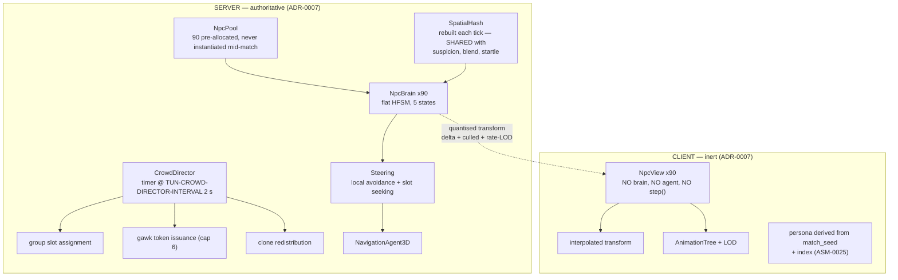

# TDD Chapter 8 — Crowd System

> **Context restated.** Project Sottovoce's district holds 60–90 AI civilians, including 8–12
> identical **clones** of each of the four playable **personas**, plus five non-playable filler
> archetypes. **The crowd is gameplay state, not decoration:** NPC positions determine
> blend-pocket validity (≥ 4 within 3.5 m), the open-ground suspicion source (none within 6 m →
> +6/s), walking-group joinability, and NPC-bump impulses. A player at blend-walk moves at
> exactly NPC stroll speed and must be indistinguishable from the clones around them.
>
> **This is the hardest performance requirement in the project:** 90 agents inside
> `TUN-PERF-CROWD-BUDGET` **2.0 ms/frame**, in GDScript.
>
> **Implements:** `SYS-CROWD`, `SYS-NPC-AI`, `SYS-CORPSE`.

---

## 1. Architecture



### 1.1 The division, restated

| | Server | Client |
|---|---|---|
| Brain (HFSM) | ✅ | ❌ never |
| Navigation / steering | ✅ | ❌ |
| Position authority | ✅ | interpolated |
| Persona assignment | seed broadcast once | derived locally (ASM-0025) |
| Animation | state id only | full `AnimationTree` |
| Spatial hash | ✅ | ❌ |

Clients do not simulate the crowd (ADR-0007) because any client/server divergence in an NPC
position becomes a *gameplay* divergence — a player who believes they are blended and is not.

---

## 2. Pooling

**All 90 NPCs are allocated during the match countdown and never instantiated or freed during
play.** Instantiating a `CharacterBody3D` with a `NavigationAgent3D` mid-match is a frame spike,
and a frame spike in a game decided at 2.5 m is a lost kill.

```gdscript
class_name NpcPool
extends Node

## Allocated during COUNTDOWN, before the first PLAYING tick.
## Sized to TUN-CROWD-COUNT-MAX (90) regardless of the active count, so that
## player-count scaling never allocates.
func preallocate(count: int) -> void

## Activate `count` NPCs with personas derived from the match seed (ASM-0025).
## Inactive NPCs are hidden and skipped by every system — never freed.
func activate(count: int, seed: int, map: MapData) -> void
```

**Persona assignment is deterministic from the seed**, so every peer derives the same roster
without replicating it:

```gdscript
## Identical on every peer. Verified by test_clone_roster_parity.gd, which
## hashes the derived roster on three peers and asserts equality.
static func persona_for(index: int, seed: int, in_use: PackedStringArray) -> StringName:
    var r := RandomNumberGenerator.new()
    r.seed = hash(seed) ^ (index * 2654435761)
    # Clone quota first: TUN-CROWD-CLONES-PER-PERSONA-MIN..MAX of each persona,
    # then filler archetypes for the remainder.
    ...
```

---

## 3. The behaviour machine

Five states, two interrupt sources. Flat HFSM per ADR-0003 — not a behaviour tree, because five
behaviours over 90 agents in GDScript cannot afford per-tick tree traversal, and because the
crowd is not required to be intelligent, only **legible**.

```gdscript
## One integer compare, one timer decrement, one small call per agent per tick.
## This is what makes 2.0 ms plausible in GDScript.
##
## MUST NOT allocate: no Array/Dictionary construction in step().
## Asserted by test_npc_no_alloc.gd.
class_name NpcBrain
extends RefCounted

enum State { STROLL, IDLE, WALKING_GROUP, STARTLE, GAWK }

var state: State = State.STROLL
var timer_ticks: int = 0
var has_propagated: bool = false      ## Startle propagates at most once per agent

func step(ctx: CrowdContext, dt: float) -> void
```

### 3.1 Startle is a global interrupt

```gdscript
## Entered from ANY state and always wins. Deliberate: a startle wave must be
## RELIABLE, because players read it as directional information about where
## something happened. An unreliable information channel is worse than none.
func _check_interrupts(ctx: CrowdContext) -> bool:
    if ctx.startle_flag:
        _enter(State.STARTLE)
        return true
    return false
```

**Accepted consequence:** an NPC gawking at a corpse who is then startled abandons the corpse,
destroying a standing information object. This reads correctly (people scatter) and the corpse
itself persists for `TUN-CORPSE-LIFETIME` 20 s regardless.

### 3.2 Startle propagation

```
on violence at P:                      # kill, stun, whisperbolt release
    for npc in hash.query(P, TUN-CROWD-STARTLE-RADIUS-VIOLENCE 12 m):
        npc.startle(away_from = P)

on sprinting player at P:              # evaluated once per second, not per tick
    for npc in hash.query(P, TUN-CROWD-STARTLE-RADIUS-SPRINT 5 m):
        npc.startle(away_from = P)

on npc.startle(dir):
    if not has_propagated:
        has_propagated = true          # caps the cascade at TWO hops
        for other in hash.query(pos, 5 m):
            if ctx.rng.randf() < TUN-CROWD-STARTLE-PROPAGATION 0.4:
                other.startle(away_from = pos)
```

**Why probabilistic propagation rather than a bigger radius:** a hard-edged 12 m circle of
fleeing NPCs reads as a *radius*. A decaying probabilistic wave reads as a **direction**,
because propagation continues furthest along the way NPCs were already fleeing. A player 30 m
away who cannot see the violence sees the wave and can infer roughly where it started. That
inference is the entire point. The `has_propagated` flag caps it at two hops so a startle in a
dense market cannot cascade across the district.

### 3.3 Gawk arbitration

Token-based, issued by the director, capped at `TUN-CROWD-GAWK-MAX` 6.

```gdscript
## The cap exists for a NON-OBVIOUS reason: without it, a corpse in a dense
## market pocket would recruit every nearby NPC, dropping the pocket below
## TUN-BLEND-POCKET-MIN-NPC (4) and destroying it as a blend location — which
## would make the site of a kill SAFER to stand in afterwards. Exactly backwards.
func _issue_gawk_tokens(corpse: Corpse, ctx: CrowdContext) -> void:
    var remaining := Tuning.crowd.gawk_max                     # 6
    for npc in ctx.hash.query_sorted(corpse.position, Tuning.crowd.gawk_radius):
        if remaining == 0:
            break
        if npc.brain.state == NpcBrain.State.STARTLE:
            continue                                           # fleeing beats gawking
        npc.brain.grant_gawk(corpse)
        remaining -= 1
```

Because `TUN-CROWD-GAWK-DURATION` 6 s < `TUN-CORPSE-LIFETIME` 20 s, a corpse produces **two
distinct information phases**: a visible cluster for 6 s ("something happened *just now*",
readable at 25 m), then a bare body for 14 s ("someone died here", readable only up close).

---

## 4. LOD strategy

### 4.1 Update-rate LOD (server)

```gdscript
## Distance to the NEAREST player, evaluated per tick as a squared-distance
## compare against a cached player position array — ~90 float compares.
func lod_band(npc_pos: Vector3, players: PackedVector3Array) -> int:
    var d2 := _nearest_distance_squared(npc_pos, players)
    if d2 <= NEAR_SQ: return Lod.NEAR      # 20 m -> every tick        (30 Hz)
    if d2 <= MID_SQ:  return Lod.MID       # 45 m -> every 3rd tick    (10 Hz)
    return Lod.FAR                          # 70 m -> every 15th tick   ( 2 Hz)
```

**LOD changes the rate, never the logic** (ADR-0003). An NPC at 60 m runs the *same* state
machine, less often. A crowd whose behaviour changed with observer distance would be a crowd
that lies, and the crowd is an information channel.

Effective brain updates per tick, typical distribution:

| Band | NPCs | Rate | Updates/tick |
|---|---|---|---|
| Near | ~20 | every tick | 20.0 |
| Mid | ~35 | every 3rd | 11.7 |
| Far | ~35 | every 15th | 2.3 |
| **Total** | 90 | | **≈ 34** |

**A 2.6× reduction** — the difference between fitting the budget and not.

### 4.2 Animation LOD (client)

| Band | Distance | Animation |
|---|---|---|
| Near | ≤ 20 m | Full `AnimationTree`, all blends, 60 Hz |
| Mid | ≤ 45 m | Reduced blend tree, 30 Hz |
| Far | ≤ 70 m | Single clip, 15 Hz, no blending |

> **The fairness constraint:** animation LOD must **never** change an NPC's silhouette or gait
> inside `TUN-COMPASS-RANGE-MAX` 60 m, because that is a distance at which a player is trying to
> distinguish clones from players. LOD may reduce *fidelity*; it may not change what the crowd
> *says*.

This is why `TUN-PERF-CROWD-LOD-MID` is 45 m rather than a cheaper 25 m: the Mid band must still
produce a correct silhouette and a correct walk cycle. `test_anim_lod_silhouette.gd` compares
rendered silhouettes at each band boundary and asserts they match within a pixel threshold.

---

## 5. Clone-parity enforcement

The mechanism that keeps anonymity real. Four independent layers, because a single check would
be deleted eventually by someone who did not understand it.

| # | Layer | Catches |
|---|---|---|
| 1 | **Data**: `PersonaData.anonymous_clip_names` declares the parity set | Authoring drift |
| 2 | **Test**: `test_clone_animation_parity.gd` asserts every clip in that set exists in the clone's `AnimationLibrary`, for all four personas | A player animation added without a clone equivalent |
| 3 | **Runtime assert (debug)**: when a player pawn enters an Anonymous-reachable state, assert the clip it plays is in the parity set | A state playing an off-list clip |
| 4 | **Director**: `TUN-CROWD-CLONE-LOCAL-MIN` 2 clones of each in-use persona within 25 m of every player | **Local** depletion — global sufficiency with a local hole |

### 5.1 Why layer 4 is the one that actually matters

Layers 1–3 catch authoring mistakes, which are visible in review. Layer 4 catches the failure
that is *invisible*:

> All 12 Lucerna clones drift to the north plaza. The Lucerna player in the south market is now
> unique — and has no way to know it. Every rule in the game still works; the crowd count is
> still 78; nothing is broken. They are simply, silently, findable.

```gdscript
## Runs on the director's 2 s timer. Re-ROUTES existing clones toward
## under-served regions; NEVER respawns or re-personas them, because a clone
## popping into existence is a worse tell than the depletion it fixes.
##
## Deliberately slow (TUN-CROWD-DIRECTOR-INTERVAL 2.0 s): visible re-routing is
## itself an information leak — a stream of Lucerna suddenly walking toward a
## market says a Lucerna player is there.
func _rebalance_clones(ctx: CrowdContext) -> void:
    for player in ctx.players:
        for persona in ctx.personas_in_use:
            var near := ctx.hash.count_persona(player.position, 25.0, persona)
            if near < Tuning.crowd.clone_local_min:            # 2
                _retarget_nearest_idle_clone(persona, toward = player.position)
```

**`test_clone_local_min.gd`** runs a 3-minute headless match with players deliberately clustered
in one zone and asserts every player always had ≥ 2 clones of their persona within 25 m.

---

## 6. The spatial hash

One structure, rebuilt once per tick, **shared by four consumers**. This is the chapter's most
important optimisation because the naive alternative is O(pawns × NPCs) in three separate places.

| Consumer | Query | Naive cost |
|---|---|---|
| `SuspicionSystem` — nearest NPC within 6 m | 6 queries | 540 distance checks |
| `BlendSystem` — count within 3.5 m | 6 queries | 540 |
| Startle propagation | 1–10 queries on events | 90 each |
| Gawk token issuance | 1 query per corpse | 90 each |

```gdscript
## Uniform grid, cell size == TUN-SUSPICION-OPEN-RADIUS, so the most frequent
## query (nearest-NPC-within-6 m) touches at most 4 cells.
## Rebuilt each tick: 90 inserts, no allocation after warm-up.
class_name SpatialHash
extends RefCounted

## READ FROM TUNING, NOT DECLARED. The requirement is that this equals
## TUN-SUSPICION-OPEN-RADIUS; a literal 6.0 stops satisfying it the first time
## the radius is retuned, and nothing would say so.
var cell_size: float

func setup(bounds: AABB, capacity: int) -> void
func rebuild(positions: PackedVector3Array, identities: Array, count: int) -> void
func query(centre: Vector3, radius: float) -> PackedInt32Array
func count_within(centre: Vector3, radius: float) -> int
func count_persona(centre: Vector3, radius: float, persona: StringName) -> int
func nearest_distance(centre: Vector3, within: float) -> float
```

Cell size is deliberately equal to `TUN-SUSPICION-OPEN-RADIUS` so the hottest query is a 2×2
cell lookup rather than a radius sweep.

### 6.1 Three amendments from US-0042, which built it

**`rebuild()` takes plain arrays, not `NpcServer` nodes.** Same split as
[`04_networking.md`](04_networking.md) §8's lag-comp ring: the structure is pure and
`CrowdDirector` is what walks the world. A hash whose contents arrive through a node cannot be
*asked a question* in a test — every assertion collapses to "there is nothing here", which stays
true with the indexing deleted.

**`nearest_distance()` takes a bound and returns `INF` outside it.** An unbounded nearest must
widen its search until it finds somebody, and in the one case that matters — a player genuinely
alone — that is a full scan of the crowd, per pawn, per tick. That is precisely the
O(pawns × NPCs) cost this section exists to remove, arriving exactly when the district is
emptiest. No consumer needs more: `TUN-SUSPICION-GAIN-OPEN` asks whether anybody is within
`TUN-SUSPICION-OPEN-RADIUS`, and "further than that" is the whole answer.

**Every distance is horizontal.** A player on the 3.5 m Loggia balcony is not in a blend pocket
with the crowd below — but they are equally not *alone*, and the rule that charges them for being
up there is `TUN-SUSPICION-GAIN-ROOF`. A 3D radius would charge it twice, quietly, from a system
that never mentions elevation.

**Measured:** a rebuild of 90 NPCs costs **0.0561 ms**, 37 % of §11.2's 0.15 ms line, over a
thousand rebuilds.

---

## 7. Navmesh

| Property | Value | Reason |
|---|---|---|
| Agent radius | 0.4 m | Matches NPC capsule |
| Agent height | 1.8 m | |
| Max slope | 35° | Above the 30° stair angle, so stairs are navigable |
| Min navigable width | 1.4 m | Matches doorway width in the metrics bible |
| Baked from | `MAP-VETRAIO` street stratum only | |
| **Excluded** | **Roofs, balconies, the canal, the Campanile** | NPCs cannot reach them — **which is precisely why those places cost suspicion.** The navmesh boundary and the `TUN-SUSPICION-GAIN-ROOF` rule describe the same design fact |
| Rebake | Never at runtime | Static geometry only |

Every street-level area a player can reach must be on the navmesh, or a player standing there is
alone by construction (level-design Pillar B). `test_navmesh_coverage.gd` samples the playable
street area on a 2 m grid and asserts navmesh coverage.

---

## 8. Interfaces

```gdscript
class_name CrowdDirector extends Node
func setup(ctx: MatchContext, map: MapData, seed: int) -> void
func tick(ctx: MatchContext, dt: float) -> void          ## per net tick: LOD + brains
func _rebalance(ctx: MatchContext) -> void               ## on the 2 s timer only
func startle_at(position: Vector3, radius: float) -> void
func register_corpse(corpse: Corpse) -> void
func npcs_within(position: Vector3, radius: float) -> int
func group_slot_of(pawn: PawnServer) -> GroupSlot

class_name NpcBrain extends RefCounted
func step(ctx: CrowdContext, dt: float) -> void
func startle(away_from: Vector3) -> void
func grant_gawk(corpse: Corpse) -> void

class_name NpcView extends Node3D                        ## CLIENT — inert
func apply_interpolated(state: EntityState) -> void
func set_lod_band(band: int) -> void
```

---

## 9. Files this chapter creates

**The third column is what is actually on disk**, checked at the 2026-08-16 checkpoint. A file
table that describes an intention reads exactly like one that describes a repository, and this
corpus has already shipped three claims of the second kind that were the first.

| Path | Purpose | State |
|---|---|---|
| `scenes/npc/npc_server.tscn` | Capsule + agent | **Exists.** No brain node — `NpcBrain` is a `RefCounted` the pool owns, not a child |
| `scenes/npc/npc_view.tscn` | Mesh + `AnimationTree`, inert | Not written. US-0046 |
| `scripts/systems/crowd/crowd_director.gd` | `SYS-CROWD` | **Exists**, US-0041; the 2 s timer and the player-facing slot API added in US-0043. Clone redistribution is US-0047's |
| `scripts/systems/crowd/npc_pool.gd` | Pre-allocation, seeded activation | **Exists**, US-0039 |
| `scripts/systems/crowd/npc_brain.gd` | The five-state HFSM | **Exists**, US-0040 |
| ~~`scripts/systems/crowd/npc_states/*.gd`~~ | ~~5 state handlers~~ | **Will not be written.** ADR-0003 chose a flat table over per-state objects: five handler files for five behaviours is five virtual calls per agent per tick, and §3's whole argument is that the crowd needs to be legible rather than clever. The directory was created empty in M0 and is removed |
| `scripts/systems/crowd/steering.gd` | Avoidance + slot seeking; the §11 caching exception | **Exists**, US-0041 |
| `scripts/systems/crowd/crowd_formations.gd` | The four walking groups and their slots | **Exists**, US-0043. Split from `CrowdDirector`, which §8 puts it on, because one file holding the tick, the brains, the steering *and* the formations passes 400 lines |
| `scripts/systems/crowd/crowd_circuit.gd` | A closed route, parametrised by **distance** | **Exists**, US-0043. Not in the original table |
| `scripts/systems/crowd/walking_group.gd` | One formation: slots, occupants, the joinable one | **Exists**, US-0043. Not in the original table |
| `scripts/systems/crowd/repath_queue.gd` | The §12 Q2 stagger, capped at `TUN-PERF-CROWD-REPATH-PER-TICK` | **Exists**, US-0041. Not in the original table |
| `scripts/systems/crowd/crowd_placement.gd` | Where the ninety start | **Exists**, US-0041. Not in the original table, and there is no spawn-distribution story anywhere in M3 |
| `scripts/systems/crowd/crowd_context.gd` | What one brain can see | **Exists**, US-0040. Not in the original table |
| `scripts/systems/crowd/spatial_hash.gd` | Shared grid | **Exists**, US-0042 |
| `scripts/systems/crowd/corpse.gd` | `SYS-CORPSE`: one body, two information phases | **Exists**, US-0044 |
| `scripts/systems/crowd/corpse_register.gd` | Every body, and who is looking at it | **Exists**, US-0044. Not in the original table |
| `scripts/systems/crowd/crowd_alarm.gd` | Startle waves and the sprinter sweep | **Exists**, US-0044. Not in the original table |
| `scripts/presentation/npc_view.gd` | Client-side view | Not written. US-0045/0046 |
| `scripts/core/crowd_roster.gd` | The derived roster | **Exists**, US-0039. In Core, not here, because both peers derive it |

---

## 10. Test hooks

**Fourteen of these nineteen rows named a file that does not exist**, audited at the 2026-08-16
checkpoint. Some are covered under another name, some are genuinely future work, and the
difference matters: trap 14 in `CLAUDE.md` exists because *the claim is worse than the absence* —
a table saying "X asserts Y" is what stops anybody checking by hand.

| Named test | Asserts | Where it actually lives |
|---|---|---|
| `test_crowd_perf.gd` | 90 NPCs headless within `TUN-PERF-CROWD-BUDGET`. **The chapter's gate** | `test/integration/test_crowd_perf.gd`, written ahead of US-0045 so LOD has a number to move. It measures the **server**; §11.1's client half is animation-dominated and there is no `NpcView`, so that is not estimated |
| `test_npc_no_alloc.gd` | `NpcBrain.step()` allocates nothing after warm-up | `test/arch/test_npc_brain_no_alloc.gd`, and `test_spatial_hash_no_alloc.gd` beside it |
| `test_npc_transition_table.gd` | Every (state, event) pair is handled or explicitly `IGNORED` — the classic silent-FSM bug | `test/unit/systems/crowd/test_npc_brain.gd` |
| `test_startle_global_interrupt.gd` | Startle is entered from all four other states | `test_npc_brain.gd`; the wave that produces it is `test_startle_wave.gd`, US-0044 |
| `test_startle_propagation.gd` | No cascade beyond 2 hops in a 90-NPC dense cluster | `test/unit/systems/crowd/test_startle_wave.gd`, US-0044. **Two explicit rounds** rather than §3.2's recursion, which caps each agent but not the wave |
| `test_startle_directional.gd` | A wave from an off-centre origin is measurably lopsided | `test_alarm_reaches_the_crowd.gd`, US-0044: 13 of 13 startled NPCs sent away from the violence. **The direction lives in the flee vectors, not in the shape of the set** — and the *human observer* half of the criterion is unticked, because NPC meshes are US-0046 |
| `test_gawk_pocket_preservation.gd` | A corpse beside a 6-anchor pocket never drops it below `TUN-BLEND-POCKET-MIN-NPC` | `test/unit/systems/crowd/test_gawk_and_corpses.gd`, US-0044 — **with the counterfactual**: it asserts more NPCs were eligible than the cap allows, or it proves nothing about the cap |
| `test_gawk_corpse_phases.gd` | Cluster disperses at 6 s; corpse persists to 20 s | `test_gawk_and_corpses.gd`, US-0044 |
| `test_clone_roster_parity.gd` | Three peers derive identical rosters from one seed | `test/unit/core/test_crowd_roster.gd` — the roster is pure, so parity is asked directly rather than across peers |
| `test_clone_animation_parity.gd` | Every `anonymous_clip_names` entry exists in the clone library | Not written. **US-0046**, and there are no clips |
| `test_clone_local_min.gd` | Over a 3-minute clustered match, every player always had ≥ 2 same-persona clones within 25 m | Not written. **US-0047**. `SpatialHash.count_persona()` is the query it needs and exists |
| `test_anim_lod_silhouette.gd` | Silhouettes match across LOD band boundaries | Not written. **US-0045**, and it needs a rendered frame |
| `test_lod_changes_rate_not_logic.gd` | **Source scan:** no distance check inside `NpcBrain.step()` | Not written. **US-0045**. There is no LOD at all yet |
| `test_npc_speed_matches_blendwalk.gd` | `TUN-CROWD-NPC-SPEED-STROLL == TUN-SPEED-BLENDWALK` | Invariant 1 in `test/unit/core/tuning/test_tuning_ranges.gd`. **And measured on a walking crowd** by `test_crowd_moves.gd`, which is the half a tuning check cannot see |
| `test_flee_slower_than_sprint.gd` | `TUN-CROWD-NPC-SPEED-FLEE < TUN-SPEED-SPRINT` | Invariant 14, same file |
| `test_navmesh_coverage.gd` | Every street-level playable point is on the navmesh; no roof or balcony is | `test/integration/test_navmesh_coverage.gd`, **and** a same-named unit test of `MapData`'s declarations. Both exist and they check different things |
| `test_circuit_separation.gd` (US-0043's own note) | Circuit periods, the empty plaza, and the 8 m separation rule | `test/unit/core/map/test_circuit_separation.gd`. **The separation rule is missed by 0.51 m and reported rather than failed** — CIRC-A and CIRC-B share the z=45 spine, so it is geometry rather than timing |
| `test_npcview_is_inert.gd` | `NpcView` has no agent, no brain, no `step()` | Not written. **US-0045/0046** |
| `test_no_midmatch_instantiate.gd` | No NPC is instantiated or freed between match start and end | Partly: `test/integration/test_npc_pool.gd` asserts `body_count()` never falls and that `activate()` refuses to grow |
| `test_spatial_hash_correctness.gd` | Hash queries match brute-force results for 1000 random queries | `test/unit/systems/crowd/test_spatial_hash.gd` |

---

## 11. Performance budget contribution

### 11.1 Client — against `TUN-PERF-CROWD-BUDGET` 2.0 ms/frame

Clients run **no brain and no navigation** (ADR-0007), so client cost is animation-dominated:

| Item | Budget |
|---|---|
| `AnimationTree` updates (LOD-weighted: ~20 full, ~35 reduced, ~35 single-clip) | ≤ 1.20 ms |
| Transform interpolation (90 entities) | ≤ 0.40 ms |
| LOD band evaluation | ≤ 0.10 ms |
| Visibility / culling | ≤ 0.20 ms |
| **Client total** | **≤ 1.90 ms of 2.0 ms** |

**Only 0.10 ms of margin.** This is the tightest budget in the project and the reason
`RISK-CROWD-PERF` is tracked at medium probability.

### 11.2 Server — against `TUN-PERF-SERVER-TICK-BUDGET` 8.0 ms per 33 ms tick

| Item | Budget | **Measured, US-0048, 78 NPCs, no LOD** |
|---|---|---|
| Spatial hash rebuild (90 inserts) | ≤ 0.15 ms | **0.054 ms** |
| LOD band evaluation (90 squared-distance compares) | ≤ 0.05 ms | none exists yet (US-0045) |
| `NpcBrain.step()` × ~34 effective | ≤ 0.50 ms | **0.046 ms for all 78** |
| Steering + avoidance × ~34 | ≤ 0.60 ms | **5.69 ms per physics frame** — see §11.2.1 |
| `NavigationAgent3D` path queries (amortised) | ≤ 0.40 ms | inside the 0.54 ms tick below |
| `CrowdDirector` rebalance (2 s timer, amortised) | ≤ 0.05 ms | inside the same |
| Everything inside `CrowdDirector.tick()` | — | **mean 0.54 ms, p95 0.81, max 1.12** |
| **Server total** | **≤ 1.75 ms of 8.0 ms** | **≈ 12 ms per net tick** |

### 11.2.1 The measured cost is movement, and it is not where the budget put it

`test_crowd_perf.gd` (US-0048, built before US-0045 on purpose) measures the crowd on the real
map with `TUN-CROWD-COUNT-DEFAULT-6P` NPCs. Three things the table above got wrong:

**The decisions are almost free and the movement is not.** Everything inside the crowd stage —
hash rebuild, brains, goals, the repath queue, the formations — costs **0.54 ms a tick**, inside
budget. Crowd *movement* costs **5.69 ms per physics frame** (2.97 avoidance + 2.72 bodies), and
there are two physics frames per net tick, so the crowd's real cost is about **12 ms per tick**
against a 1.75 ms line. Movement is outside `tick()` by necessity: `move_and_slide()` integrates
by the physics delta, so driving bodies from the 30 Hz tick would halve every NPC's speed
(US-0041).

**§4.1's LOD would save almost nothing as specified.** It bands the *brain* rate, and the brains
are **0.046 ms** — under 1 % of the crowd's cost and a tenth of what this table budgets for a
third as many of them. The lever that matters is avoidance and body movement, which no band in
§4.1 touches. US-0045 should be designed against these numbers rather than against the table.

**The server keeps up anyway, and that is the load-bearing fact.** Physics is paced to
`TUN-NET-CLIENT-INPUT-RATE`; with the full crowd a physics frame still takes **16.77 ms of wall
clock**, against 16.41 with avoidance off and 16.58 with no crowd at all. 5.69 ms of a 16.7 ms
frame is a third of it, with headroom left. `TUN-PERF-SERVER-TICK-BUDGET` 8.0 ms is not being
met; the frame deadline is.

**And the instrument had to be checked before the number was believed.** The first version of the
test asserted on `Performance.TIME_PHYSICS_PROCESS` alone and reported **31 ms per frame**, a 17×
miss — while the wall clock, unmeasured at the time, was a flat 16.7 ms in every configuration.
The monitor is not evidence on its own. Trap 3's family, in a profiler.

### 11.3 The fallback ladder if `test_crowd_perf.gd` fails

Ordered. **Note that reducing crowd count is listed first only because it is the fastest lever
to *test with*, not because it is the best fix** — crowd density is the game's substrate, and
cutting it trades the design's identity for frame time.

| # | Lever | Cost |
|---|---|---|
| 1 | Coarsen LOD bands (Mid 45 → 35 m) | Risks the §4.2 silhouette-fairness constraint. Measure before committing |
| 2 | Reduce animation fidelity in Mid band | Must not change silhouette or gait |
| 3 | Drop Far-band animation entirely (impostors) | Beyond `TUN-COMPASS-RANGE-MAX`, so no gameplay information is lost |
| 4 | Move `Steering` to C# or `GDExtension` | ADR-0001's named response. Steering is the numeric inner loop; the FSM is not |
| 5 | Reduce `TUN-CROWD-COUNT-MAX` below 90 | **Last.** Never below `TUN-CROWD-COUNT-MIN` 60, which is a hard design floor |

---

## 12. Open questions

| # | Question | Position | Needed by |
|---|---|---|---|
| 1 | Client crowd budget has 0.10 ms of margin (§11.1). Is that survivable on the reference machine? | Unknown until 90 NPCs exist. `test_crowd_perf.gd` is an M3 exit criterion, and the §11.3 ladder is the response | M3 |
| 2 | Does `NavigationAgent3D` amortise well at 90 agents, or does path recalculation spike? | Mitigate by staggering repath requests across ticks (max 3 per tick) and giving Far-band agents longer path validity | M3 |
| 3 | ~~Should the spatial hash be double-buffered so systems read last tick's hash while this tick's rebuilds?~~ **Closed, US-0042.** | No. Ordering guarantee (TDD-07 §1.1) requires suspicion to see *this* tick's crowd. Rebuild was budgeted at 0.15 ms and **measures 0.0561 ms**, so correctness costs almost nothing | M3 |
| 4 | `_rebalance_clones` re-routes toward under-served regions. Could that itself become a detectable pattern — clones converging on players? | Real risk. The 2 s interval and "nearest idle clone" selection are the mitigations. Watch for players reporting that clones "follow them". If it appears, retarget via circuit reassignment rather than direct pathing | M4 |
| 5 | Startle propagation uses `ctx.rng`, so it is server-only and unpredictable by clients. Startle is visual-only, so this is fine — but if a future mechanic makes startle gameplay-relevant, it becomes a determinism problem. | Noted. Startle currently affects only NPC positions, which are replicated anyway | — |
