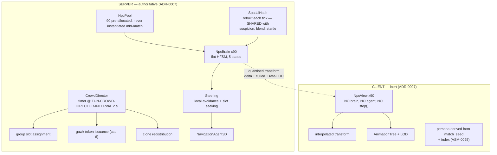

# TDD Chapter 8 — Crowd System

> **Context restated.** Project Sottovoce's district holds 60–90 AI civilians, including 8–12
> identical **clones** of each of the four playable **personas**, plus five non-playable filler
> archetypes. **The crowd is gameplay state, not decoration:** NPC positions determine
> blend-pocket validity (≥ 4 within 3.5 m), the open-ground suspicion source (none within 6 m →
> +6/s), walking-group joinability, and NPC-bump impulses. A player at blend-walk moves at
> exactly NPC stroll speed and must be indistinguishable from the clones around them.
>
> **This is the hardest performance requirement in the project:** 90 agents inside
> `TUN-PERF-CROWD-BUDGET` **2.0 ms/frame**, in GDScript.
>
> **Implements:** `SYS-CROWD`, `SYS-NPC-AI`, `SYS-CORPSE`.

---

## 1. Architecture



### 1.1 The division, restated

| | Server | Client |
|---|---|---|
| Brain (HFSM) | ✅ | ❌ never |
| Navigation / steering | ✅ | ❌ |
| Position authority | ✅ | interpolated |
| Persona assignment | seed broadcast once | derived locally (ASM-0025) |
| Animation | state id only | full `AnimationTree` |
| Spatial hash | ✅ | ❌ |

Clients do not simulate the crowd (ADR-0007) because any client/server divergence in an NPC
position becomes a *gameplay* divergence — a player who believes they are blended and is not.

---

## 2. Pooling

**All 90 NPCs are allocated during the match countdown and never instantiated or freed during
play.** Instantiating a `CharacterBody3D` with a `NavigationAgent3D` mid-match is a frame spike,
and a frame spike in a game decided at 2.5 m is a lost kill.

```gdscript
class_name NpcPool
extends Node

## Allocated during COUNTDOWN, before the first PLAYING tick.
## Sized to TUN-CROWD-COUNT-MAX (90) regardless of the active count, so that
## player-count scaling never allocates.
func preallocate(count: int) -> void

## Activate `count` NPCs with personas derived from the match seed (ASM-0025).
## Inactive NPCs are hidden and skipped by every system — never freed.
func activate(count: int, seed: int, map: MapData) -> void
```

**Persona assignment is deterministic from the seed**, so every peer derives the same roster
without replicating it:

```gdscript
## Identical on every peer. Verified by test_clone_roster_parity.gd, which
## hashes the derived roster on three peers and asserts equality.
static func persona_for(index: int, seed: int, in_use: PackedStringArray) -> StringName:
    var r := RandomNumberGenerator.new()
    r.seed = hash(seed) ^ (index * 2654435761)
    # Clone quota first: TUN-CROWD-CLONES-PER-PERSONA-MIN..MAX of each persona,
    # then filler archetypes for the remainder.
    ...
```

---

## 3. The behaviour machine

Five states, two interrupt sources. Flat HFSM per ADR-0003 — not a behaviour tree, because five
behaviours over 90 agents in GDScript cannot afford per-tick tree traversal, and because the
crowd is not required to be intelligent, only **legible**.

```gdscript
## One integer compare, one timer decrement, one small call per agent per tick.
## This is what makes 2.0 ms plausible in GDScript.
##
## MUST NOT allocate: no Array/Dictionary construction in step().
## Asserted by test_npc_no_alloc.gd.
class_name NpcBrain
extends RefCounted

enum State { STROLL, IDLE, WALKING_GROUP, STARTLE, GAWK }

var state: State = State.STROLL
var timer_ticks: int = 0
var has_propagated: bool = false      ## Startle propagates at most once per agent

func step(ctx: CrowdContext, dt: float) -> void
```

### 3.1 Startle is a global interrupt

```gdscript
## Entered from ANY state and always wins. Deliberate: a startle wave must be
## RELIABLE, because players read it as directional information about where
## something happened. An unreliable information channel is worse than none.
func _check_interrupts(ctx: CrowdContext) -> bool:
    if ctx.startle_flag:
        _enter(State.STARTLE)
        return true
    return false
```

**Accepted consequence:** an NPC gawking at a corpse who is then startled abandons the corpse,
destroying a standing information object. This reads correctly (people scatter) and the corpse
itself persists for `TUN-CORPSE-LIFETIME` 20 s regardless.

### 3.2 Startle propagation

```
on violence at P:                      # kill, stun, whisperbolt release
    for npc in hash.query(P, TUN-CROWD-STARTLE-RADIUS-VIOLENCE 12 m):
        npc.startle(away_from = P)

on sprinting player at P:              # evaluated once per second, not per tick
    for npc in hash.query(P, TUN-CROWD-STARTLE-RADIUS-SPRINT 5 m):
        npc.startle(away_from = P)

on npc.startle(dir):
    if not has_propagated:
        has_propagated = true          # caps the cascade at TWO hops
        for other in hash.query(pos, 5 m):
            if ctx.rng.randf() < TUN-CROWD-STARTLE-PROPAGATION 0.4:
                other.startle(away_from = pos)
```

**Why probabilistic propagation rather than a bigger radius:** a hard-edged 12 m circle of
fleeing NPCs reads as a *radius*. A decaying probabilistic wave reads as a **direction**,
because propagation continues furthest along the way NPCs were already fleeing. A player 30 m
away who cannot see the violence sees the wave and can infer roughly where it started. That
inference is the entire point. The `has_propagated` flag caps it at two hops so a startle in a
dense market cannot cascade across the district.

### 3.3 Gawk arbitration

Token-based, issued by the director, capped at `TUN-CROWD-GAWK-MAX` 6.

```gdscript
## The cap exists for a NON-OBVIOUS reason: without it, a corpse in a dense
## market pocket would recruit every nearby NPC, dropping the pocket below
## TUN-BLEND-POCKET-MIN-NPC (4) and destroying it as a blend location — which
## would make the site of a kill SAFER to stand in afterwards. Exactly backwards.
func _issue_gawk_tokens(corpse: Corpse, ctx: CrowdContext) -> void:
    var remaining := Tuning.crowd.gawk_max                     # 6
    for npc in ctx.hash.query_sorted(corpse.position, Tuning.crowd.gawk_radius):
        if remaining == 0:
            break
        if npc.brain.state == NpcBrain.State.STARTLE:
            continue                                           # fleeing beats gawking
        npc.brain.grant_gawk(corpse)
        remaining -= 1
```

Because `TUN-CROWD-GAWK-DURATION` 6 s < `TUN-CORPSE-LIFETIME` 20 s, a corpse produces **two
distinct information phases**: a visible cluster for 6 s ("something happened *just now*",
readable at 25 m), then a bare body for 14 s ("someone died here", readable only up close).

---

## 4. LOD strategy

### 4.1 Update-rate LOD (server)

```gdscript
## Distance to the NEAREST player, evaluated per tick as a squared-distance
## compare against a cached player position array — ~90 float compares.
func lod_band(npc_pos: Vector3, players: PackedVector3Array) -> int:
    var d2 := _nearest_distance_squared(npc_pos, players)
    if d2 <= NEAR_SQ: return Lod.NEAR      # 20 m -> every tick        (30 Hz)
    if d2 <= MID_SQ:  return Lod.MID       # 45 m -> every 3rd tick    (10 Hz)
    return Lod.FAR                          # 70 m -> every 15th tick   ( 2 Hz)
```

**LOD changes the rate, never the logic** (ADR-0003). An NPC at 60 m runs the *same* state
machine, less often. A crowd whose behaviour changed with observer distance would be a crowd
that lies, and the crowd is an information channel.

Effective brain updates per tick, typical distribution:

| Band | NPCs | Rate | Updates/tick |
|---|---|---|---|
| Near | ~20 | every tick | 20.0 |
| Mid | ~35 | every 3rd | 11.7 |
| Far | ~35 | every 15th | 2.3 |
| **Total** | 90 | | **≈ 34** |

**A 2.6× reduction** — the difference between fitting the budget and not.

**Measured on `MAP-VETRAIO`, and the first measurement was of an empty district.** US-0045
reported "6 of 78 brains step per tick" and said it was because six players spread over 120 ×
120 m put fewer NPCs inside 20 m than the table assumes. **There were no players at all** —
`test_crowd_perf.gd` ran with `MatchContext.pawns` empty, `CrowdLod.band_of` answered Far for
everything, and 6 is 78 divided by the Far stride of 15. Found in US-0047, fixed in US-0041's
last line, and the corrected figures are the opposite of what was published:

| | §4.1's table | **Measured**, 78 NPCs, six players at the spawn points |
|---|---|---|
| Near | ~20 | **30** |
| Mid | ~35 | **48** |
| Far | ~35 | **0** |
| Effective steps/tick | ≈ 34 of 90 | **46 of 78** |

**THERE IS NO FAR BAND ON THIS MAP AT MATCH START.** Six spawn points on a 120 × 120 m district
put every NPC within `TUN-PERF-CROWD-LOD-MID` 45 m of somebody, so the reduction is 78 → 46
— **1.7×, not §4.1's 2.6×** — and the Far band, with its stride of 15 and its longer path
validity, exists only when players cluster and leave part of the district unwatched. It is worth
**less** than §4.1 claims for a second reason too: US-0048 measured the brains at 0.046 ms before
LOD was built, so the whole banded subsystem is a fifth of a millisecond either way.

**Two things LOD nearly changed that are not rates**, both caught by US-0045's own tests:

1. **A banded brain's timers.** Stepped every fifteenth tick and decremented by one, an 8–25 s
   idle pause becomes 120–375 s. `NpcBrain.step()` takes a `stride` for exactly this, and the
   only symptom would have been a distant crowd standing unusually still — which reads as
   atmosphere.
2. **Events raised on a tick the brain did not think.** Clearing `CrowdContext` every tick
   regardless wipes a `startle_flag` before anybody reads it, so **LOD would silently drop
   startles and gawk tokens for two thirds of the crowd**. Startle is the one interrupt the
   design requires to be *reliable*.

Both are behaviour changes wearing a rate change's name, which is precisely what ADR-0003
forbids. `test_lod_changes_rate_not_logic.gd` is the source scan; `test_crowd_lod.gd` holds the
two above.

### 4.2 Animation LOD (client)

| Band | Distance | Animation |
|---|---|---|
| Near | ≤ 20 m | Full `AnimationTree`, all blends, 60 Hz |
| Mid | ≤ 45 m | Reduced blend tree, 30 Hz |
| Far | ≤ 70 m | Single clip, 15 Hz, no blending |

> **The fairness constraint:** animation LOD must **never** change an NPC's silhouette or gait
> inside `TUN-COMPASS-RANGE-MAX` 60 m, because that is a distance at which a player is trying to
> distinguish clones from players. LOD may reduce *fidelity*; it may not change what the crowd
> *says*.

This is why `TUN-PERF-CROWD-LOD-MID` is 45 m rather than a cheaper 25 m: the Mid band must still
produce a correct silhouette and a correct walk cycle. `test_anim_lod_silhouette.gd` compares
rendered silhouettes at each band boundary and asserts they match within a pixel threshold.

---

## 5. Clone-parity enforcement

The mechanism that keeps anonymity real. Four independent layers, because a single check would
be deleted eventually by someone who did not understand it.

| # | Layer | Catches |
|---|---|---|
| 1 | **Data**: `PersonaData.anonymous_clip_names` declares the parity set | Authoring drift. **Built, US-0046** — `data/personas/*.tres`, and the set is one `const` rather than four copies |
| 2 | **Test**: `test_clone_animation_parity.gd` asserts every clip in that set exists in the clone's `AnimationLibrary`, for all four personas | A player animation added without a clone equivalent. **Half-built, US-0046**: the declaration is asserted, the library **reported**, because no clip exists on either rig |
| 3 | **Runtime assert (debug)**: when a player pawn enters an Anonymous-reachable state, assert the clip it plays is in the parity set | A state playing an off-list clip |
| 4 | **Director**: `TUN-CROWD-CLONE-LOCAL-MIN` 2 clones of each in-use persona within `TUN-CROWD-CLONE-LOCAL-RADIUS` of every player | **Local** depletion — global sufficiency with a local hole. **Built, US-0047** — `scripts/systems/crowd/clone_balance.gd`, on the 2 s director pass |

### 5.1 Why layer 4 is the one that actually matters

Layers 1–3 catch authoring mistakes, which are visible in review. Layer 4 catches the failure
that is *invisible*:

> All 12 Lucerna clones drift to the north plaza. The Lucerna player in the south market is now
> unique — and has no way to know it. Every rule in the game still works; the crowd count is
> still 78; nothing is broken. They are simply, silently, findable.

```gdscript
## Runs on the director's 2 s timer. Re-ROUTES existing clones toward
## under-served regions; NEVER respawns or re-personas them, because a clone
## popping into existence is a worse tell than the depletion it fixes.
##
## Deliberately slow (TUN-CROWD-DIRECTOR-INTERVAL 2.0 s): visible re-routing is
## itself an information leak — a stream of Lucerna suddenly walking toward a
## market says a Lucerna player is there.
func _rebalance_clones(ctx: CrowdContext) -> void:
    for player in ctx.players:
        for persona in ctx.personas_in_use:
            var near := ctx.hash.count_persona(player.position, 25.0, persona)
            if near < Tuning.crowd.clone_local_min:            # 2
                _retarget_nearest_idle_clone(persona, toward = player.position)
```

### 5.1.1 What was built, and the three places the sketch was not enough

US-0047 built this as `CloneBalance`, called from `CrowdDirector._rebalance_clones` on the same
2 s pass the formations use. The shape above survived; three things had to be added, and each
was found by measuring rather than by reading.

**FETCHING ALONE CANNOT HOLD A FLOOR, AND MEASURED IT LEFT A PLAYER AT ZERO.** A clone crosses
the 25 m radius in about **eighteen seconds**; a hole opens the instant somebody walks out of
one. A rule that can only *fetch* is therefore eighteen seconds behind every churn in the crowd
— over a 3-minute clustered match it left a player with **zero** clones of an in-use persona.
So each pass now **holds** first: a clone of a thin persona that is already inside the region is
given an anchor on this side of it, which costs no travel time at all. Fetching recovers from a
hole; holding is what stops one opening. Holding is also the cheaper half by far, and it is the
half the sketch does not contain.

**IDLE CLONES ARE RESERVED WITHOUT BEING WOKEN.** Holding only the clones that are *walking*
leaves a two-second window every pass: an idle clone near the edge finishes its pause, picks a
far anchor and is outside before anybody looks again. That measured **91 readings of 12 960**
under the floor. A reservation an idle clone simply *finds waiting* when its own pause ends
costs it nothing and closes the window; cutting the pause short instead would be motion the
region did not need, and motion is what reads.

**THE DESTINATION IS KEPT A PASS'S WALK INSIDE THE BOUNDARY.** An anchor at 24.8 m is inside one
player's radius and outside their neighbour's, and it leaves the region the moment either of
them takes a step. The margin is `TUN-CROWD-NPC-SPEED-STROLL` × `TUN-CROWD-DIRECTOR-INTERVAL`
— about 2.8 m, one pass of walking, which is exactly how long nobody is looking. Derived from
two existing tunables rather than chosen, so retuning either moves it. This one change took the
breach count from 75 to **2**.

**AND THE STREAM IS PREVENTED BY ACCOUNTING, NOT BY A THROTTLE.** Eighteen seconds is nine
passes, so a rule counting only *arrived* clones sends nine to fix a hole one deep — which is
precisely the "stream of Lucerna walking toward a market" the story warns about. A clone already
walking into the region counts toward the minimum while it is on its way. Measured: **8 fetched
on the first pass of a starved district, 0 over the next five.** No cap was needed once the
arithmetic was right, and a cap would have hidden the fact that it was not.

### 5.1.2 Measured, and the one reading that is not "always"

`test/unit/systems/crowd/test_clone_local_min.gd`, 78 NPCs, six players clustered in one zone,
5 400 net ticks, sampled every third of a second — 12 960 readings of (player × persona).

| | Without the pass | With it |
|---|---|---|
| Worst count of an in-use persona within 25 m | **0** | 1 |
| Readings under `TUN-CROWD-CLONE-LOCAL-MIN` | many | **2 of 12 960** |
| … of those, after the crowd settles (20 s) | — | **0** |

**Both breaches are in the first twenty seconds, and they are `CrowdPlacement`'s rather than
this rule's.** The crowd is dealt round-robin over the map's idle anchors with **no persona
awareness at all**, so a match can begin with a local hole; nothing that re-routes rather than
teleporting can close one before a clone has walked. US-0047's fourth criterion says *always*,
so it is **left unticked** with these numbers rather than rounded up. Making it literally true
needs persona-aware initial placement, which is `CrowdPlacement`'s and has no story.

**A UNIT TEST RUNS THE THREE-MINUTE MATCH, DELIBERATELY.** The integration suite is at 152 s of
its 180 s budget and 5 400 ticks of *physics* would not fit. The crowd in that test is real —
real `NpcBrain`s, real pool bodies, the real `SpatialHash` — and only the navigation is modelled,
as a straight line at stroll speed. That model is optimistic about travel time and cannot
flatter the rule, which is the shipped code unchanged. `test_director_runs_layer_four.gd` is the
other half: it asks the real `CrowdDirector` whether it calls any of this, because every
assertion about `CloneBalance` would stay green with the director never calling it.


### 5.1.3 The opening arrangement, and three spawn points that cannot satisfy rule 3

**LAYER 4 CLOSES A HOLE IN ABOUT EIGHTEEN SECONDS, SO A MATCH THAT *BEGINS* WITH ONE IS EIGHTEEN
SECONDS IT CANNOT COVER.** That is where US-0047's two breaches of 12 960 came from, and they
were `CrowdPlacement`'s: it deals round-robin over idle anchors with no persona awareness, while
`CrowdRoster` derives identities with no idea where anybody stands. Both are seeded and both are
correct; **nothing joined them.** US-0096's `CrowdSeating` is that join — a **permutation** of the
placement, so the multiset of positions is unchanged and every property `CrowdPlacement` was
tested for survives by construction.

**Filler is the currency, and it is what makes the pass terminate.** About thirty of seventy-eight
are archetypes with no local requirement anywhere, so a spawn point short of Lucerna trades a
nearby filler for a distant one. Both ends of the trade need the same guard — the give side had it
first and the take side did not, which left the last spawn points processed picking over a
district already stripped: **7 feasible shortfalls went to 2, then to 0 once the take side
refused to conscript somebody else's minimum.**

**AND THE MAP CANNOT SATISFY RULE 3 AT THREE OF ITS SIX SPAWN POINTS.** Four personas at
`TUN-CROWD-CLONE-LOCAL-MIN` need **eight clone seats** inside the radius:

| Spawn point | NPC seats within 25 m |
|---|---|
| (12, 36) · (20, 70) · (88, 14) | 12 · 15 · 10 |
| (6, 97.5) | **3** |
| (100, 70) | **6** |
| (114, 97.5) | **0** |

A permutation cannot conjure a seat that is not there, so a player spawning at the thinnest of them
begins the match all but alone *and* on open ground for `TUN-SUSPICION-GAIN-OPEN` — uniquely
identifiable, before they can move. `test_crowd_seating.gd` asserts what the code owes — **zero
shortfalls where there is room** — and prints the census, exactly as `test_circuit_separation.gd`
reports US-0043's 0.51 m.

> **THE CENSUS MOVED AND THE FINDING DID NOT.** The figures above are US-0096's. After US-0041's
> follow-up nudged the eight anchors that sat inside market stalls onto walkable ground, the same
> test reads **S1 12, S2 15, S3 4, S4 1, S5 6, S6 8** — different numbers, same three spawn points
> short. A shortfall that survives two re-authorings of the anchor grid is the zone's density, not
> the grid's.
>
> **AND IT IS NO LONGER GDD-03 §6.3 RULE 3's, AS OF 2026-08-21.** It is **GDD-05 §2.7 rule 8's** —
> see §5.1.5.


### 5.1.4 What the floor actually guarantees, and why it is not "always"

§5.1.2 published **2 readings of 12 960** under the floor and called the rule all but exact.
That number was true of one anchor arrangement and of nothing else. Fixing an unrelated
level-data bug — `Fondaco` received **zero** idle anchors because its grid cell was wider than
the zone (US-0096) — moved the crowd from 62 anchors to 67 and took the same code, on the same
scenario, from 2 breaches to **248**.

**THE GUARANTEE WAS MARGINAL AND THE CORPUS DID NOT SAY SO.** That is the finding, and it is
worth more than the number it replaces.

**THE CAUSE IS THE JOURNEY, NOT THE SUPPLY.** Four hypotheses were measured and three died:

| Hypothesis | Measurement | |
|---|---|---|
| Stale reservations mask the breach | pending 3, inbound-shaped **0** | no |
| The spatial hash is lying | **0** disagreements against brute force | no |
| Holds counted as journeys | fixed; the numbers did not move | no |
| The pass never sees the breach | **the pass saw 41** | no |

The pass saw 41 short pairs and acted on 3, because `near + _inbound >= _least` credited clones
that had set off but not arrived. **A clone credited at departure satisfies the minimum in
expectation while the player is short in fact for eighteen seconds**, and with six players three
metres apart sharing one region, one clone in flight credits all six at once.

**THE FLOOR IS NOW DECIDED ON ARRIVALS AND THE FETCH TARGETS ONE ABOVE IT**, so an arrival lands
before the next departure takes the region back under. That halved it: **219 breaches after
settling to 100**, and 3 fetches to 6.

**WHAT IS LEFT IS PHYSICS.** Supply is not the constraint — the clustered region holds **23.9
NPCs and 4.27 clones of each persona on average** against a floor of 2 — so the residual is
transient troughs where clones happen to leave together, with help already walking. Of 21 short
pairs the pass saw, **18 already had a clone on its way and 6 were dispatched**.

So the rule's guarantee is not "the floor never breaks". It is **"a breach is never ignored"**,
and that is what `test_clone_local_min.gd` now asserts, alongside a worst that never falls more
than one below the floor and a breach rate under 1 % of readings. US-0047's *always* criterion
stays unticked, as it always was.

---

### 5.1.5 Rule 3 is scoped past the placement instant, and what that does and does not buy

**2026-08-21.** GDD-03 §6.3 rule 3 required the local minimum "of every player", at all times —
and all times includes the tick the match places somebody. **Three of six spawn points cannot seat
eight clones at any arrangement**, so the rule was violated at the first tick of every match by the
level rather than by the crowd, and it stayed a *reported* release blocker for two milestones
because no code change could close it. **An unsatisfiable blocker stops being a decision and becomes
a fact of the corpus**, which is the failure mode worth recording here.

**THE RULE NOW BINDS FROM `CloneParity.grace_seconds()` AFTER PLACEMENT**, and the opening
arrangement is GDD-05 §2.7 rule 8's. `CloneParity` is in Core, pure but for `Tuning`, because three
readers need one number: this chapter's tests, `test_spawn_points.gd`, and whatever `SYS-SUSPICION`
does about a freshly-placed player in M4.

| | | |
|---|---|---|
| `walk_seconds()` | `TUN-CROWD-CLONE-LOCAL-RADIUS / TUN-CROWD-NPC-SPEED-STROLL` | **17.86 s** |
| `grace_seconds()` | `TUN-CROWD-DIRECTOR-INTERVAL` + the walk | **19.86 s**, 596 ticks, 4.1 % of a match |
| `seats_required()` | `TUN-CROWD-CLONE-LOCAL-MIN` × the playable personas | **8** |

**IT IS DERIVED AND DELIBERATELY NOT A TUNABLE.** Every term is already tuned and a fourth number
could be set to a value the first three contradict — a grace shorter than the walk would bind the
rule before anybody could satisfy it. Same reasoning as `CloneBalance._anchors_for`'s 2.8 m margin.

**ONE NUMBER SERVES BOTH ENDS OF THE RULE, AND THAT IS INVARIANT 1 RATHER THAN LUCK.** It is how
long a fetched clone takes to reach the player *and* how long the player takes to reach the crowd,
because `TUN-CROWD-NPC-SPEED-STROLL` is forced equal to `TUN-SPEED-BLENDWALK`. So a player placed in
a thin corner never has to **run** to buy back anonymity, which design law 1 would charge them for.
`test_clone_parity_scope.gd` asserts that equality alongside the grace, because the derivation would
keep computing after the two diverged and would no longer mean what this section says.

**AND `test_clone_local_min.gd` NOW ASSERTS THE WINDOW THE RULE BINDS IN.** It carried a `settle` of
`interval * 10` — 600 ticks, which was within four of the derivation and is now `grace_ticks()`;
**a multiplier that agrees with the answer is not one that follows it.** The measured split, over a
clustered three-minute match:

| | Readings under the floor |
|---|---|
| Whole run | 71 of 12 960 |
| **After the grace — asserted** | **47 of 11 544, 0.41 %** |

The whole population is printed beside the assertion, the same choice §11.2.2's perf gate makes, so
nothing looks dropped. **The residual is still the journey** — §5.1.4's finding is untouched, the
guarantee is still "a breach is never ignored", and US-0047's *always* criterion stays unticked.

**WHAT THE SCOPE DOES NOT BUY IS ANY CHANGE AT `S4`.** A player placed there still sees one NPC
within 25 m and is still uniquely identifiable for the grace. The exposure is identical; only its
owner moved, from a design law no map could satisfy to a level rule with a census and a tool.

---

### 5.2 `NpcPool.position_of()` reads the body, and did not until US-0031

It returned a cached `PackedVector3Array` that only `set_position` writes — and `set_position` is
called at **placement and never again**. `Steering` moves the bodies directly from
`NavigationAgent3D`'s avoidance callback, on the physics frame.

**Nothing had ever read it, so nothing was wrong.** The moment `SnapshotBuilder._fill_crowd`
became its first consumer, a live server would have replicated all seventy-eight NPCs **at their
spawn anchors, forever**: no error, no failing test, and the only symptom a playtester saying the
crowd looked like statues.

**It was found by a number being too good.** The NPC delta measured 25 % of the bandwidth budget
where the measured change fraction says 78 % of records move every tick — a delta can only drop
what does not move, so a saving that large is arithmetically impossible. **A result better than
the mechanism can explain is a broken measurement**, and this time the program under it was broken
too.

The body is the authority. `_positions` survives as the placement record and nothing reads it.

---

## 6. The spatial hash

One structure, rebuilt once per tick, **shared by four consumers**. This is the chapter's most
important optimisation because the naive alternative is O(pawns × NPCs) in three separate places.

| Consumer | Query | Naive cost |
|---|---|---|
| `SuspicionSystem` — nearest NPC within 6 m | 6 queries | 540 distance checks |
| `BlendSystem` — count within 3.5 m | 6 queries | 540 |
| Startle propagation | 1–10 queries on events | 90 each |
| Gawk token issuance | 1 query per corpse | 90 each |

```gdscript
## Uniform grid, cell size == TUN-SUSPICION-OPEN-RADIUS, so the most frequent
## query (nearest-NPC-within-6 m) touches at most 4 cells.
## Rebuilt each tick: 90 inserts, no allocation after warm-up.
class_name SpatialHash
extends RefCounted

## READ FROM TUNING, NOT DECLARED. The requirement is that this equals
## TUN-SUSPICION-OPEN-RADIUS; a literal 6.0 stops satisfying it the first time
## the radius is retuned, and nothing would say so.
var cell_size: float

func setup(bounds: AABB, capacity: int) -> void
func rebuild(positions: PackedVector3Array, identities: Array, count: int) -> void
func query(centre: Vector3, radius: float) -> PackedInt32Array
func count_within(centre: Vector3, radius: float) -> int
func count_persona(centre: Vector3, radius: float, persona: StringName) -> int
func nearest_distance(centre: Vector3, within: float) -> float
```

Cell size is deliberately equal to `TUN-SUSPICION-OPEN-RADIUS` so the hottest query is a 2×2
cell lookup rather than a radius sweep.

### 6.1 Three amendments from US-0042, which built it

**`rebuild()` takes plain arrays, not `NpcServer` nodes.** Same split as
[`04_networking.md`](04_networking.md) §8's lag-comp ring: the structure is pure and
`CrowdDirector` is what walks the world. A hash whose contents arrive through a node cannot be
*asked a question* in a test — every assertion collapses to "there is nothing here", which stays
true with the indexing deleted.

**`nearest_distance()` takes a bound and returns `INF` outside it.** An unbounded nearest must
widen its search until it finds somebody, and in the one case that matters — a player genuinely
alone — that is a full scan of the crowd, per pawn, per tick. That is precisely the
O(pawns × NPCs) cost this section exists to remove, arriving exactly when the district is
emptiest. No consumer needs more: `TUN-SUSPICION-GAIN-OPEN` asks whether anybody is within
`TUN-SUSPICION-OPEN-RADIUS`, and "further than that" is the whole answer.

**Every distance is horizontal.** A player on the 3.5 m Loggia balcony is not in a blend pocket
with the crowd below — but they are equally not *alone*, and the rule that charges them for being
up there is `TUN-SUSPICION-GAIN-ROOF`. A 3D radius would charge it twice, quietly, from a system
that never mentions elevation.

**Measured:** a rebuild of 90 NPCs costs **0.0561 ms**, 37 % of §11.2's 0.15 ms line, over a
thousand rebuilds.

---

## 7. Navmesh

| Property | Value | Reason |
|---|---|---|
| Agent radius | 0.4 m | Matches NPC capsule |
| Agent height | 1.8 m | |
| Max slope | 35° | Above the 30° stair angle, so stairs are navigable |
| Min navigable width | 1.4 m | Matches doorway width in the metrics bible |
| Baked from | `MAP-VETRAIO` street stratum only | |
| **Excluded** | **Roofs, balconies, the canal, the Campanile** | NPCs cannot reach them — **which is precisely why those places cost suspicion.** The navmesh boundary and the `TUN-SUSPICION-GAIN-ROOF` rule describe the same design fact |
| Rebake | Never at runtime | Static geometry only |

Every street-level area a player can reach must be on the navmesh, or a player standing there is
alone by construction (level-design Pillar B). `test_navmesh_coverage.gd` samples the playable
street area on a 2 m grid and asserts navmesh coverage.

---

## 8. Interfaces

```gdscript
class_name CrowdDirector extends Node
func setup(ctx: MatchContext, map: MapData, seed: int) -> void
func tick(ctx: MatchContext, dt: float) -> void          ## per net tick: LOD + brains
func _rebalance(ctx: MatchContext) -> void               ## on the 2 s timer only
func startle_at(position: Vector3, radius: float) -> void
func register_corpse(corpse: Corpse) -> void
func npcs_within(position: Vector3, radius: float) -> int
func group_slot_of(pawn: PawnServer) -> GroupSlot

class_name NpcBrain extends RefCounted
func step(ctx: CrowdContext, dt: float) -> void
func startle(away_from: Vector3) -> void
func grant_gawk(corpse: Corpse) -> void

class_name NpcView extends Node3D                        ## CLIENT — inert
func apply_interpolated(state: EntityState) -> void
func set_lod_band(band: int) -> void
```

---

## 9. Files this chapter creates

**The third column is what is actually on disk**, checked at the 2026-08-16 checkpoint. A file
table that describes an intention reads exactly like one that describes a repository, and this
corpus has already shipped three claims of the second kind that were the first.

| Path | Purpose | State |
|---|---|---|
| `scenes/npc/npc_server.tscn` | Capsule + agent | **Exists.** No brain node — `NpcBrain` is a `RefCounted` the pool owns, not a child |
| `scenes/npc/npc_view.tscn` | Mesh + `AnimationTree`, inert | Not written. US-0046 |
| `scripts/systems/crowd/crowd_director.gd` | `SYS-CROWD` | **Exists**, US-0041; the 2 s timer and the player-facing slot API added in US-0043, clone redistribution hung off the same timer in US-0047 |
| `scripts/systems/crowd/npc_pool.gd` | Pre-allocation, seeded activation | **Exists**, US-0039 |
| `scripts/systems/crowd/npc_brain.gd` | The five-state HFSM | **Exists**, US-0040 |
| ~~`scripts/systems/crowd/npc_states/*.gd`~~ | ~~5 state handlers~~ | **Will not be written.** ADR-0003 chose a flat table over per-state objects: five handler files for five behaviours is five virtual calls per agent per tick, and §3's whole argument is that the crowd needs to be legible rather than clever. The directory was created empty in M0 and is removed |
| `scripts/systems/crowd/steering.gd` | Avoidance + slot seeking; the §11 caching exception | **Exists**, US-0041 |
| `scripts/systems/crowd/crowd_formations.gd` | The four walking groups and their slots | **Exists**, US-0043. Split from `CrowdDirector`, which §8 puts it on, because one file holding the tick, the brains, the steering *and* the formations passes 400 lines |
| `scripts/systems/crowd/crowd_circuit.gd` | A closed route, parametrised by **distance** | **Exists**, US-0043. Not in the original table |
| `scripts/systems/crowd/walking_group.gd` | One formation: slots, occupants, the joinable one | **Exists**, US-0043. Not in the original table |
| `scripts/systems/crowd/repath_queue.gd` | The §12 Q2 stagger, capped at `TUN-PERF-CROWD-REPATH-PER-TICK` | **Exists**, US-0041. Not in the original table |
| `scripts/systems/crowd/crowd_placement.gd` | Where the ninety start | **Exists**, US-0041. Not in the original table, and there is no spawn-distribution story anywhere in M3 |
| `scripts/systems/crowd/crowd_context.gd` | What one brain can see | **Exists**, US-0040. Not in the original table |
| `scripts/systems/crowd/spatial_hash.gd` | Shared grid | **Exists**, US-0042 |
| `scripts/systems/crowd/corpse.gd` | `SYS-CORPSE`: one body, two information phases | **Exists**, US-0044 |
| `scripts/systems/crowd/corpse_register.gd` | Every body, and who is looking at it | **Exists**, US-0044. Not in the original table |
| `scripts/systems/crowd/crowd_alarm.gd` | Startle waves and the sprinter sweep | **Exists**, US-0044. Not in the original table |
| `scripts/systems/crowd/crowd_bands.gd` | Which band each NPC is in, and the path tolerance a band buys | **Exists**, US-0045 as logic and US-0041's last line as the side effect; split from `CrowdDirector` in US-0041 when the file passed 400 lines again. Not in the original table |
| `scripts/systems/crowd/crowd_seating.gd` | Which NPC stands at which starting position: the join between the roster and the placement | **Exists**, US-0096. Not in the original table — nothing joined `CrowdPlacement`'s slots to `CrowdRoster`'s identities, so a match could open with every clone of a persona on the wrong side of the district |
| `scripts/systems/crowd/clone_balance.gd` | §5 layer 4: hold and fetch clones against `TUN-CROWD-CLONE-LOCAL-MIN` | **Exists**, US-0047. Not in the original table — §5.1 sketched it as a method on the director, and it is its own object so a test can ask it a question without standing a director up |
| `tools/crowd_probe.tscn` | The district with the crowd in it, as a picture, plus the count and the spread | **Exists**, US-0045. Refuses `--headless`. A screenshot alone cannot tell a crowd from one NPC near the camera, so it prints both numbers |
| `tools/anchor_census.tscn` | Grades a set of idle anchors: zones wanted-vs-placed, clone seats per spawn point, and every relocation legal under GDD-05 §2.7 rules 1, 4, 5, 6 and 8 | **Exists**, US-0096. Not in the original table, and not a system — a level-data instrument. Run it after any change to the anchor grid or to `BLOCKS`; it is what found `Fondaco` receiving **zero** anchors. **A scene since 2026-08-21**: as a `-s` script it had no autoloads, so `CrowdRoster` failed to compile on `Tuning` and took the ground check down with it, and the tool recommended seven spawn sites **inside a building** |
| `scripts/presentation/npc_view.gd` | Client-side view | **Exists.** One `GreyboxBody` per NPC index, interpolated `TUN-NET-INTERP-BUFFER` in the past like `RemotePawns`. **Absence means "no update", never "gone"** — the opposite rule, because culling, rate LOD and the delta all omit NPCs a client must keep drawing. It culls by distance instead, one margin wider than the server. **Nothing wears a persona**: the roster needs `match_seed` and no client is told it until `SYS-MATCH` |
| `scripts/core/crowd_roster.gd` | The derived roster | **Exists**, US-0039. In Core, not here, because both peers derive it |
| `scripts/core/clone_parity.gd` | **When rule 3 binds**, and the seat count that makes it satisfiable: `grace_seconds()`, `walk_seconds()`, `seats_required()` | **Exists**, 2026-08-21. Not in the original table. In Core rather than here because three readers need one number — §5's tests, `test_spawn_points.gd`, and M4's `SYS-SUSPICION`; and **not** on `CloneBalance`, which was at 399 of its 400 lines and owns the journey rather than the rule |

---

## 10. Test hooks

**Fourteen of these nineteen rows named a file that does not exist**, audited at the 2026-08-16
checkpoint. Some are covered under another name, some are genuinely future work, and the
difference matters: trap 14 in `CLAUDE.md` exists because *the claim is worse than the absence* —
a table saying "X asserts Y" is what stops anybody checking by hand.

| Named test | Asserts | Where it actually lives |
|---|---|---|
| `test_crowd_perf.gd` | 90 NPCs headless within `TUN-PERF-CROWD-BUDGET`. **The chapter's gate** | `test/integration/test_crowd_perf.gd`, written ahead of US-0045 so LOD has a number to move. It measures the **server**; §11.1's client half is animation-dominated and there is no `NpcView`, so that is not estimated |
| `test_npc_no_alloc.gd` | `NpcBrain.step()` allocates nothing after warm-up | `test/arch/test_npc_brain_no_alloc.gd`, and `test_spatial_hash_no_alloc.gd` beside it |
| `test_npc_transition_table.gd` | Every (state, event) pair is handled or explicitly `IGNORED` — the classic silent-FSM bug | `test/unit/systems/crowd/test_npc_brain.gd` |
| `test_startle_global_interrupt.gd` | Startle is entered from all four other states | `test_npc_brain.gd`; the wave that produces it is `test_startle_wave.gd`, US-0044 |
| `test_startle_propagation.gd` | No cascade beyond 2 hops in a 90-NPC dense cluster | `test/unit/systems/crowd/test_startle_wave.gd`, US-0044. **Two explicit rounds** rather than §3.2's recursion, which caps each agent but not the wave |
| `test_startle_directional.gd` | A wave from an off-centre origin is measurably lopsided | `test_alarm_reaches_the_crowd.gd`, US-0044: 13 of 13 startled NPCs sent away from the violence. **The direction lives in the flee vectors, not in the shape of the set** — and the *human observer* half of the criterion is unticked, because NPC meshes are US-0046 |
| `test_gawk_pocket_preservation.gd` | A corpse beside a 6-anchor pocket never drops it below `TUN-BLEND-POCKET-MIN-NPC` | `test/unit/systems/crowd/test_gawk_and_corpses.gd`, US-0044 — **with the counterfactual**: it asserts more NPCs were eligible than the cap allows, or it proves nothing about the cap |
| `test_gawk_corpse_phases.gd` | Cluster disperses at 6 s; corpse persists to 20 s | `test_gawk_and_corpses.gd`, US-0044 |
| `test_clone_roster_parity.gd` | Three peers derive identical rosters from one seed | `test/unit/core/test_crowd_roster.gd` — the roster is pure, so parity is asked directly rather than across peers |
| `test_clone_animation_parity.gd` | Every `anonymous_clip_names` entry exists in the clone library | Not written. **US-0046**, and there are no clips |
| `test_clone_local_min.gd` | Over a 3-minute clustered match, every player always had ≥ 2 same-persona clones within 25 m | `test/unit/systems/crowd/test_clone_local_min.gd`, US-0047 — a **unit** test, because 5 400 ticks of physics do not fit the integration budget; see §5.1.2. **47 of 11 544 readings under the floor after the grace — 0.41 % — never below 1**, with 71 of 12 960 over the whole run printed beside it. Two earlier figures this row carried are retracted: 2 of 12 960 was a property of one anchor arrangement (§5.1.4) and 100 of 12 960 predates the stall-anchor nudge. **The assertion is on the window rule 3 binds in** as of 2026-08-21 — §5.1.5. What it guarantees is that **a breach is never ignored**, so the *always* criterion is reported rather than ticked. Its counterfactual runs first and requires the starvation to actually happen |
| `test_crowd_seating.gd` | The opening arrangement satisfies the local minimum at every spawn point that has room, and is a permutation of the placement | `test/unit/systems/crowd/test_crowd_seating.gd`, US-0096. Not in the original table. **It prints a seat census**, because three of six spawn points cannot hold the minimum at any arrangement — see §5.1.3 |
| `test_director_runs_layer_four.gd` | The shipped `CrowdDirector` really calls layer 4, on the 2 s timer, and `CrowdIntent` really prefers the reservation | `test/unit/systems/crowd/test_director_runs_layer_four.gd`, US-0047. Not in the original table. **A criterion can be true of a class and false of the game**, which is what happened to US-0039's pool |
| `test_far_band_path_validity.gd` | A Far agent tolerates more path drift than a Near one, and the multiplier is the band's own stride | `test/unit/systems/crowd/test_far_band_path_validity.gd`, US-0041's last line. Not in the original table. **Its first version passed while the Far band got nothing**: the seed agreed with the answer, so genuinely-Far agents compared equal and were skipped — measured Near 5.0, Mid 15.0, **Far 5.0** |
| `test_anim_lod_silhouette.gd` | Silhouettes match across LOD band boundaries | Not written. **US-0045**, and it needs a rendered frame |
| `test_lod_changes_rate_not_logic.gd` | **Source scan:** no distance check inside `NpcBrain.step()` | `test/arch/test_lod_changes_rate_not_logic.gd`, US-0045 — and it also asserts the `stride` reaches the brain, which a distance scan cannot see |
| `test_npc_speed_matches_blendwalk.gd` | `TUN-CROWD-NPC-SPEED-STROLL == TUN-SPEED-BLENDWALK` | Invariant 1 in `test/unit/core/tuning/test_tuning_ranges.gd`. **And measured on a walking crowd** by `test_crowd_moves.gd`, which is the half a tuning check cannot see |
| `test_flee_slower_than_sprint.gd` | `TUN-CROWD-NPC-SPEED-FLEE < TUN-SPEED-SPRINT` | Invariant 14, same file |
| `test_navmesh_coverage.gd` | Every street-level playable point is on the navmesh; no roof or balcony is | `test/integration/test_navmesh_coverage.gd`, **and** a same-named unit test of `MapData`'s declarations. Both exist and they check different things |
| `test_circuit_separation.gd` (US-0043's own note) | Circuit periods, the empty plaza, and the 8 m separation rule | `test/unit/core/map/test_circuit_separation.gd`. **This row said "missed by 0.51 m" until 2026-08-21 and was stale**: the four routes were re-authored against the floor table and the closest simultaneous approach is now **21.20 m** against a rule of 8. Separation is held by **distance rather than timing** — the four sit in disjoint zones, so no retune of a period can break it |
| `test_npcview_is_inert.gd` | `NpcView` has no agent, no brain, no `step()` | Not written. **US-0045/0046** |
| `test_no_midmatch_instantiate.gd` | No NPC is instantiated or freed between match start and end | Partly: `test/integration/test_npc_pool.gd` asserts `body_count()` never falls and that `activate()` refuses to grow |
| `test_spatial_hash_correctness.gd` | Hash queries match brute-force results for 1000 random queries | `test/unit/systems/crowd/test_spatial_hash.gd` |
| `test_clone_parity_scope.gd` | **The conditions rule 3's scope rests on**: the grace is one pass plus one walk, a player can blend-walk the radius inside it, the two walks are one walk (invariant 1), and the grace is a window rather than an exemption | `test/unit/core/crowd/test_clone_parity_scope.gd`, 2026-08-21. Not in the original table. Falsified against a halved grace: two of five go red. Same shape as `test_the_district_is_enclosed.gd` — **a scope is only honest while the thing it defers to is true**, and that stops being true quietly |

---

## 11. Performance budget contribution

### 11.1 Client — against `TUN-PERF-CROWD-BUDGET` 2.0 ms/frame

Clients run **no brain and no navigation** (ADR-0007), so client cost is animation-dominated:

| Item | Budget |
|---|---|
| `AnimationTree` updates (LOD-weighted: ~20 full, ~35 reduced, ~35 single-clip) | ≤ 1.20 ms |
| Transform interpolation (90 entities) | ≤ 0.40 ms |
| LOD band evaluation | ≤ 0.10 ms |
| Visibility / culling | ≤ 0.20 ms |
| **Client total** | **≤ 1.90 ms of 2.0 ms** |

**Only 0.10 ms of margin.** This is the tightest budget in the project and the reason
`RISK-CROWD-PERF` is tracked at medium probability.

### 11.2 Server — against `TUN-PERF-SERVER-TICK-BUDGET` 8.0 ms per 33 ms tick

**The measured column is 78 NPCs with six players standing at the map's spawn points.** It was
an *empty* district until US-0041 — see §11.2.1, and read every figure the corpus published
before then as a best case.

| Item | Budget | **Measured, 78 NPCs, six players** |
|---|---|---|
| Spatial hash rebuild (90 inserts) | ≤ 0.15 ms | **0.055 ms** |
| LOD band evaluation (90 squared-distance compares) | ≤ 0.05 ms | inside the tick below |
| `NpcBrain.step()` × ~34 effective | ≤ 0.50 ms | **0.046 ms for all 78 unbanded; 46 of 78 step** |
| Steering + avoidance × ~34 | ≤ 0.60 ms | **not measurable** — see §11.2.1 |
| `NavigationAgent3D` path queries (amortised) | ≤ 0.40 ms | inside the tick below |
| `CrowdDirector` rebalance (2 s timer) | ≤ 0.05 ms | **0.71 ms on the tick it fires** — 14× the row, and the row was written before any of it existed. See §11.2.2 |
| Everything inside `CrowdDirector.tick()` | — | **mean 0.52 ms, p95 0.59–0.64, max 1.26–1.29** |
| **Server total** | **≤ 1.75 ms of 8.0 ms** | **inside it, max included**, since §11.2.2; movement is still unmeasured |

> **RE-MEASURED 2026-08-21, AND THE FIGURES ABOVE STAND.** A checkpoint on 2026-08-20 recorded these
> as stale, claiming a local p95 of 0.89-0.95 and an unexplained regression. **That was retracted the
> next day and is wrong.** Extracted with `git archive` and measured on a quiet machine, the commit
> that first published them reads **mean 0.521, p95 0.575** and `HEAD` twenty-three PRs later reads
> **mean 0.536-0.559, p95 0.590-0.807**. The 0.89-0.95 readings were transient machine state, taken
> in a session that was repeatedly starting and killing headless servers.
>
> **THE ONLY REAL MOVEMENT IS +7 TO +10 %, AND IT IS ACCOUNTED FOR.** Ordinary ticks went 0.497 to
> 0.530 and the 2 s pass 1.215 to 1.340, bisected across seven commits with no step anywhere.
> `MAP-VETRAIO` gained anchors over the same span — 62 to 67 when the Fondaco's missing row was
> fixed, **+8 %** — and both figures track it.

### 11.2.2 Why the gate asserts the ordinary ticks and not the whole population

**THE DISTRIBUTION IS BIMODAL BY CONSTRUCTION.** 2 of 90 sampled ticks carry the director's 2 s pass
at about 1.34 ms; the other 88 cost about 0.53. A p95 over 90 samples is the **~4.5th highest
reading**, which lands exactly on the boundary between those two populations — so whether it reports
the pass or the ordinary tail is decided by timing noise rather than by cost.

Measured across three consecutive local runs of identical code:

| Run | mean | p95 |
|---|---|---|
| 1 | 0.531 | 0.586 |
| 2 | 0.538 | 0.598 |
| 3 | 0.545 | **0.723** |

**A 3 % swing in the mean against a 38 % swing in the p95.** On CI, which runs about 2.4x slower
(mean 1.08-1.29 against 0.53 local), the same estimator read 1.067, then 1.249, then **1.815 — which
failed a build with no regression behind it.**

So `test_the_server_crowd_tick_against_the_budget` asserts the **ordinary-tick** p95, which is
stable, and prints the whole-population figure beside it. **This is a small loosening and it is
deliberate**: the ordinary-tick p95 is by definition no larger than the whole-population one, and it
is chosen because the statistic it replaces cannot tell a regression from a reordering. A gate that
fails without a cause is how a guard gets widened until it means nothing.

The pass is not unguarded. `test_the_two_second_pass_is_what_the_max_is` partitions the samples
**while they are taken**, attributes the gap, and asserts that an ordinary tick never exceeds the
budget on its own. What no test asserts is a percentile of the pass itself — two samples cannot
support one, and it says so.

### 11.2.2 The spike was the 2 s pass, and it was this chapter's own new code

**A MAX OVER BUDGET WITH p95 UNDER IT IS ONE EXPENSIVE TICK, NOT A SLOW CROWD.** Once
`test_crowd_perf.gd` had six players in it (§11.2.1) the tick max came in at **2.16–2.43 ms
against a 1.75 ms budget** while p95 sat at 0.67–0.71. There is exactly one thing that happens on
some ticks and not others — the director's 2 s pass — and ninety sampled ticks contain one or two
of them.

**Partitioning the samples while they are taken settles it, and the two subsets sum to the
whole**, which is what makes the attribution checkable rather than a story about a number:

| | Before | After |
|---|---|---|
| 2 s pass ticks | **1.925 ms** mean | **1.21 ms** |
| Ordinary ticks | 0.500 ms | 0.498 ms |
| The pass's own cost | **1.425 ms** | **0.71 ms** |
| Whole-tick max | 2.16–2.43 ms | **1.26–1.29 ms** |

**AND THE PASS WAS ASKED THE SAME QUESTION TWENTY-FOUR TIMES FOR SIX ANSWERS.** `CloneBalance`
loops six players by four personas. Which anchors sit inside a region, who is standing in it, and
how many of each identity that is are all properties of the *region* — none of them depend on the
persona being served. Two hoists, no behaviour change:

- **The anchor list is per player.** `_anchor_near` rescanned all 62 anchors for every clone it
  held, inside the innermost loop.
- **One grid query and one identity tally per player**, replacing four `SpatialHash.query()` walks
  and four `count_persona()` walks over the same eighty cells of the same region.

A third change — squared distances throughout, matching what `SpatialHash` already does —
**bought nothing measurable** (0.710 → 0.712 ms, inside run-to-run noise). It is kept because it
is correct and cheaper in principle, and recorded because a change that was expected to help and
did not is worth as much as one that did.

**§11.2's 0.05 ms row for the rebalance is still missed by 14×, and that row is amended rather
than chased.** It was written before formations, corpses or clone balancing existed, and nothing
derives it; **the number that matters is the total, which is now inside budget with the max
included.** An A/B against `personas_in_use` puts layer 4 at about **0.46 ms of the 0.71**, so the
pre-existing formations and corpse sweep are the other 0.25.

---

### 11.2.1 The measured cost is movement, and it is not where the budget put it

**EVERY NUMBER IN §11.2 USED TO BE THE CROWD NOBODY WAS WATCHING, AND IS NOT ANY MORE.**
Found in US-0047 and fixed in US-0041: `test_crowd_perf.gd` stood up the full 78-NPC crowd
and **no pawns**, so `MatchContext.pawns` was empty, `CrowdLod.band_of` answered Far for
everything, and two subsystems did nothing in the measurement — `CloneBalance` counts
against player positions and the sprinter sweep reads pawn velocity. Six pawns now stand at
the map's own spawn points, and the observer count is printed on every run, because the
reason this went unnoticed for two stories is that nothing said the scenario was empty.

**The cost went up by about a fifth and stayed inside the budget.**

| | Empty district | **Six players at the spawn points** |
|---|---|---|
| `CrowdDirector.tick()` mean | 0.439 ms | **0.54–0.57 ms** |
| p95 | 0.521 ms | **0.67–0.71 ms** (budget 1.75) |
| max over 90 ticks | 0.686 ms | **2.16–2.43 ms** |
| Brains stepping | 6 of 78 | **46 of 78** |

**THE MAX EXCEEDS THE BUDGET ON A SINGLE TICK AND THE GATE IS ASSERTED ON p95.** That is the
right statistic for a gate — one tick in ninety is a warm-up, not a frame rate — but it is
recorded here rather than left for somebody to discover, because a max above the line is the
shape of a spike and §12 Q2 is a question about spikes. Nothing has yet isolated *what* the
outlier is; the honest statement is that the crowd is comfortably inside its budget at p95 and
that one tick in ninety is not.

`test_crowd_perf.gd` (US-0048, built before US-0045 on purpose) measures the crowd on the real
map with `TUN-CROWD-COUNT-DEFAULT-6P` NPCs. Three things the table above got wrong:

**The decisions are almost free.** Everything inside the crowd stage — hash rebuild, brains,
goals, the repath queue, the formations and the 2 s pass — costs **0.54–0.57 ms a tick, p95
0.67–0.71**, with six players at the map's spawn points. Comfortably inside §11.2's 1.75 ms and
reproducible across runs. **The 0.44 ms this section used to quote was an empty district** and is
the same measurement error §11.2.1 records; the *max* is 2.16–2.43 ms, which is over the budget
on one tick in ninety and is not something this paragraph should round away.

**CROWD MOVEMENT COULD NOT BE MEASURED, AND THE FIGURE FIRST PUBLISHED HERE WAS WRONG.** Movement
runs outside `tick()` by necessity — `move_and_slide()` integrates by the physics delta, so
driving bodies from the 30 Hz tick would halve every NPC's speed (US-0041) — and the only
instrument for it, `Performance.TIME_PHYSICS_PROCESS`, gives **incoherent answers**: 31 ms a
frame in one arrangement, 5.69 in another, 24–28 in a third, all **inside a frame the wall clock
says takes 16.73 ms**. A cost larger than the interval containing it is not a slow frame; it is a
broken reading. **The 5.69 ms figure this section carried between US-0048 and US-0045 should not
be quoted.**

What *is* coherent, reproducible and load-bearing is the wall clock: a physics frame with the
full crowd takes **16.73 ms**, against 16.56 with no crowd at all and a 16.67 ms deadline. The
server keeps up. Getting a trustworthy per-item movement cost needs a profiler this project does
not have — recorded as owed rather than estimated.

**§4.1's LOD would save almost nothing as specified.** It bands the *brain* rate, and the brains
are **0.046 ms** — under 1 % of the crowd's cost and a tenth of what this table budgets for a
third as many of them. The lever that matters is avoidance and body movement, which no band in
§4.1 touches. US-0045 should be designed against these numbers rather than against the table.

**§4.1's LOD is still worth building, for reasons that are not this table.** It bands the
*brain* rate and the brains are 0.046 ms, so the saving is a fifth of a millisecond. What it
actually buys is US-0041's far-band path validity, and a band number other systems can read.
US-0045 says so rather than claiming a performance win it does not deliver.

**And the instrument had to be checked three times before it was discarded.** The monitor
reported 31 ms, then 5.69, then 24–28 for arrangements whose wall clock never moved off 16.7 ms.
**A reading that cannot be cross-checked reports whatever it reports** — trap 3's family, in a
profiler, and the reason the assertion in `test_crowd_perf.gd` is on the wall clock alone.

### 11.3 The fallback ladder if `test_crowd_perf.gd` fails

Ordered. **Note that reducing crowd count is listed first only because it is the fastest lever
to *test with*, not because it is the best fix** — crowd density is the game's substrate, and
cutting it trades the design's identity for frame time.

| # | Lever | Cost |
|---|---|---|
| 1 | Coarsen LOD bands (Mid 45 → 35 m) | Risks the §4.2 silhouette-fairness constraint. Measure before committing |
| 2 | Reduce animation fidelity in Mid band | Must not change silhouette or gait |
| 3 | Drop Far-band animation entirely (impostors) | Beyond `TUN-COMPASS-RANGE-MAX`, so no gameplay information is lost |
| 4 | Move `Steering` to C# or `GDExtension` | ADR-0001's named response. Steering is the numeric inner loop; the FSM is not |
| 5 | Reduce `TUN-CROWD-COUNT-MAX` below 90 | **Last.** Never below `TUN-CROWD-COUNT-MIN` 60, which is a hard design floor |

---

## 12. Open questions

| # | Question | Position | Needed by |
|---|---|---|---|
| 1 | Client crowd budget has 0.10 ms of margin (§11.1). Is that survivable on the reference machine? | Unknown until 90 NPCs exist. `test_crowd_perf.gd` is an M3 exit criterion, and the §11.3 ladder is the response | M3 |
| 2 | Does `NavigationAgent3D` amortise well at 90 agents, or does path recalculation spike? | **Both halves built.** `RepathQueue` staggers the director's target changes at `TUN-PERF-CROWD-REPATH-PER-TICK` (US-0041); `CrowdBands` scales `path_max_distance` — the recalculation the queue does *not* control — by the band's own stride, measured at Near 5.0 m, Mid 15.0, Far 75.0 (US-0041's last line). **Whether it was ever a spike is still unmeasured**: `test_crowd_perf.gd` runs with no players, so every agent is Far there. See §11.2.1 | M3 |
| 3 | ~~Should the spatial hash be double-buffered so systems read last tick's hash while this tick's rebuilds?~~ **Closed, US-0042.** | No. Ordering guarantee (TDD-07 §1.1) requires suspicion to see *this* tick's crowd. Rebuild was budgeted at 0.15 ms and **measures 0.0561 ms**, so correctness costs almost nothing | M3 |
| 4 | `_rebalance_clones` re-routes toward under-served regions. Could that itself become a detectable pattern — clones converging on players? | Real risk. The 2 s interval and "nearest idle clone" selection are the mitigations. Watch for players reporting that clones "follow them". If it appears, retarget via circuit reassignment rather than direct pathing | M4 |
| 5 | Startle propagation uses `ctx.rng`, so it is server-only and unpredictable by clients. Startle is visual-only, so this is fine — but if a future mechanic makes startle gameplay-relevant, it becomes a determinism problem. | Noted. Startle currently affects only NPC positions, which are replicated anyway | — |
