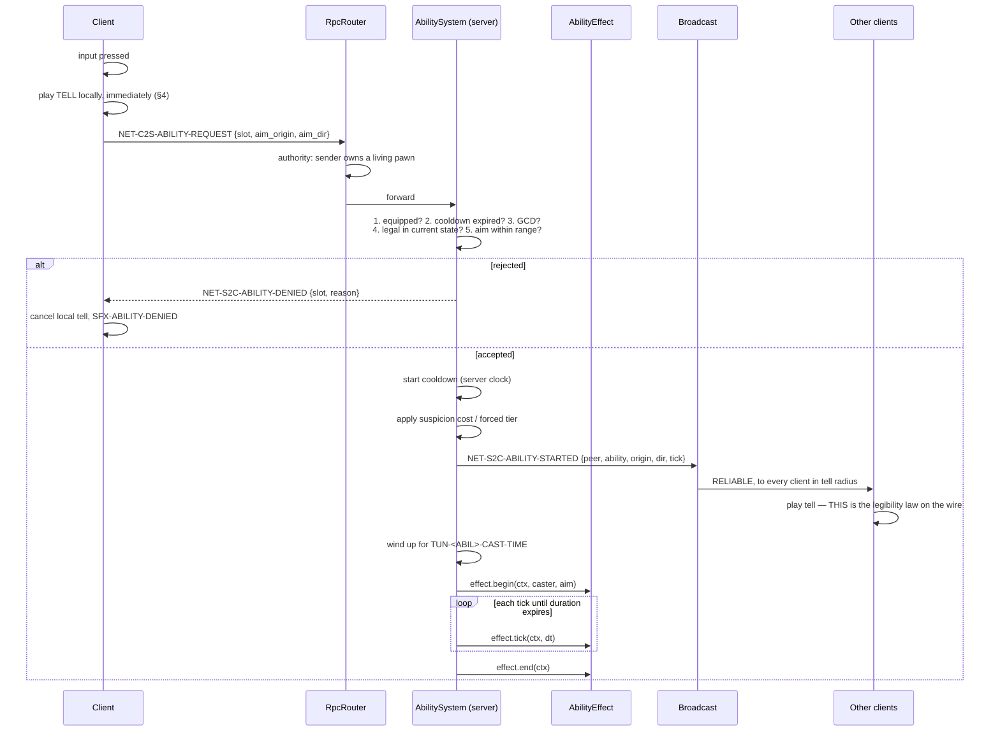

# TDD Chapter 9 — Ability System

> **Context restated.** Players equip **two abilities and one passive**, chosen in the lobby and
> locked for the whole match including across deaths. The MVP set is **Cinderfall**
> (area denial, blocks line of sight and forbids kill initiation in a 5 m radius for 4 s),
> **Whisperbolt** (ranged kill at 3–12 m after a 1.0 s wind-up during which the thrower is
> forced Exposed), **Second Face** (adopt the nearest visible clone's persona for 15 s), and
> **Lunge** (a 6 m committed dash that auto-initiates a kill, stunnable throughout).
> Passives: **Stillness**, **Cold Read**, **Second Wind**.
>
> **The governing law:** every ability must have a **tell** — a perceivable signal reaching the
> victim in time to react. No invisible instant-wins.
>
> **Implements:** `SYS-ABILITY`, `SYS-LOADOUT`.

---

## 1. The pipeline



**Two amendments to this diagram, both made by the code that implements it.**

**The tell is emitted BEFORE `effect.begin`** (US-0066). Drawn the other way round it would be a
tell that arrives after the thing it warns about, which is a notification. The two are adjacent
lines in `AbilitySystem._commit` for an ability with no wind-up.

**And there is a cast phase** (US-0067). `TUN-CINDERFALL-CAST-TIME` 0.45 s and
`TUN-SECONDFACE-CAST-TIME` had no reader until Cinderfall needed one: this diagram began the
effect on the press tick, so the wind-up existed as a tunable and as an animation length and as
nothing else. `LiveAbility` holds a cast that is **pending** until `begins_at` and **live**
afterwards, and the distinction is observable — `AbilitySystem.is_effect_active` answers false
during the wind-up, because a Second Face that has not been put on yet is not a disguise and
`SCORE-MASKED` must not pay for one. **An ability with no `cast_time` begins on the press tick**,
so this costs nothing where it is not wanted.

**The duration runs from the burst, not from the press.** A 0.45 s throw followed by a 4.0 s
cloud is 4.0 s of cloud, which is what `TUN-CINDERFALL-DURATION`'s row promises and what GDD-04
§3.1's counterplay is priced against.

**And a caster killed during the wind-up drops nothing.** The cooldown and the suspicion were
spent at the press and stay spent, so a victim who read the tell and acted is paid for reading
it. **A stun does not cancel a cast** — nothing in GDD-04 gives it that power, and §3.1 names
patience as the counter; it is US-0067's one open question rather than a decision taken here.

### 1.1 The five validations

Every one is server-side. A client cannot bypass any of them, because the request message
carries no outcome — only intent.

| # | Check | Rejection reason |
|---|---|---|
| 1 | Slot is equipped in this match's locked loadout | `NOT_EQUIPPED` |
| 2 | `ctx.tick >= cooldown_expiry_tick[peer][slot]` | `ON_COOLDOWN` |
| 3 | `ctx.tick >= global_cooldown_expiry[peer]` (`TUN-ABILITY-GLOBAL-COOLDOWN` 0.5 s) | `GLOBAL_COOLDOWN` |
| 4 | Pawn state permits it (not `Stunned`, `Dead`, `KillAnim`, `Respawning`) | `ILLEGAL_STATE` |
| 5 | Aim clamped server-side to `[range_min, range_max]`; LOS required where the ability requires it | `OUT_OF_RANGE` / `NO_LOS` |

**Aim is clamped, not rejected.** A client sending an aim point beyond `TUN-CINDERFALL-THROW-RANGE`
8 m gets the cloud at 8 m, not a denial. Rejecting would punish a player for a rounding
difference between their predicted aim and the server's; clamping produces the outcome they
almost certainly intended.

---

## 2. Cooldown authority

**Cooldowns are integer tick deadlines on the server. The client displays an optimistic mirror
and is corrected.**

```gdscript
## Cooldowns start at ACTIVATION, never at effect end. Integer ticks, so there
## is no accumulated float drift and no divergence between peers (TDD-03 §4.1).
func _start_cooldown(peer: int, slot: int, data: AbilityData, tick: int) -> void:
    _cooldown_expiry[peer][slot] = tick + Tuning.ticks(data.cooldown_id)
    _global_expiry[peer] = tick + Tuning.ticks(&"TUN-ABILITY-GLOBAL-COOLDOWN")

## Reset on death. Death already costs TUN-RESPAWN-DELAY 5 s and all
## SCORE-VARIETY progress for that life; carrying cooldowns through death
## would compound the punishment and push players toward passivity
## (GDD-04 §5). The suicide-to-reroll exploit this opens is monitored via
## TEL-SUICIDE-SUSPECTED rather than pre-emptively closed.
func on_death(peer: int) -> void:
    _cooldown_expiry[peer].fill(0)
    _global_expiry[peer] = 0
```

The client's own cooldowns arrive in every snapshot (`cooldown_a_tick`, `cooldown_b_tick`), so a
mispredicted cooldown self-corrects within 33 ms. **Other players' cooldowns are never sent** —
kit-reading is a skill ([`../10_gdd/04_abilities.md`](../10_gdd/04_abilities.md) §5.1).

---

## 3. The effect interface

The only per-ability code. Everything else — timing, cost, cooldown, tell radius, counterplay
flags — is `AbilityData` ([`05_data_architecture.md`](05_data_architecture.md) §3.3).

```gdscript
## One subclass per ability. SERVER-ONLY: effects mutate authoritative state.
## Presentation reacts to NET-S2C-ABILITY-STARTED, never to this class.
class_name AbilityEffect
extends RefCounted

## Called after all five validations pass. Apply immediate state here.
func begin(ctx: MatchContext, caster: PawnServer, aim: AimData) -> void:
    pass

## Called once per net tick while the effect is live. Return false to end early.
func tick(ctx: MatchContext, dt: float) -> bool:
    return false

## Called on expiry, early end, or caster death. MUST be idempotent —
## a caster who dies mid-effect triggers both paths.
func end(ctx: MatchContext) -> void:
    pass
```

### 3.1 The four MVP effects

| Ability | `begin()` | `tick()` | `end()` |
|---|---|---|---|
| **Cinderfall** | Spawn a `CinderVolume` at the clamped aim point; register it with `DetectionSystem` as an LOS blocker and with `KillSystem` as a kill-initiation blocker; `CrowdDirector.startle_at(pos, 9 m)` | Decrement lifetime | Deregister the volume from both systems |
| **Whisperbolt** | Force Exposed; begin wind-up timer; broadcast the tell | On wind-up completion, spawn a server-side projectile; on impact, validate LOS against the **lag-compensated** world and resolve a kill if the target is the caster's contract | Apply `TUN-WHISPERBOLT-EXPOSED-TAIL` 1.5 s; on miss apply +30 |
| **Second Face** | Query `CrowdDirector` for the nearest **visible clone**; set `caster.apparent_persona`; broadcast morph | Check break conditions: sprint, damage, stun | Broadcast un-morph. **Ends *after* kill resolution** so `SCORE-MASKED` still applies |
| **Lunge** | Apply +40 suspicion; set `caster.lunge_target_dir` (locked, unsteerable); transition the pawn to a dash | Advance the dash; on arrival, if the caster's **contract** is within `TUN-KILL-RANGE` and cone, auto-initiate the kill | On whiff apply `TUN-LUNGE-WHIFF-STAGGER` 1.2 s |

### 3.2 Two implementation details that carry design weight

**Cinderfall blocks the caster too.** `TUN-CINDERFALL-BLOCKS-KILL` applies to *everyone* inside
the radius, including whoever threw it. That single symmetry is what makes Cinderfall purely
defensive — without it the dominant play is "cloud, then kill inside it", and a kill nobody can
see is a legibility-law violation wearing an ability's clothes.

```gdscript
## KillSystem consults this BEFORE the contest window. No exception for the caster.
func blocks_kill_initiation(position: Vector3) -> bool:
    for volume in _active_cinder_volumes:
        if position.distance_to(volume.centre) <= volume.radius:
            return true
    return false
```

**Second Face does not choose.** `TUN-SECONDFACE-PERSONA-SOURCE` is `nearest_clone`, which makes
it a *positional* ability wearing a transformation ability's clothes: its value depends entirely
on where you stand when you cast it. Cast beside a lone Lucerna and you become the fifth Lucerna
in an area with four; cast inside a Pesatore cluster and you vanish.

```gdscript
## Falls back to a random OTHER persona when no clone is visible — which is
## exactly what happens inside a Cinderfall cloud, and is the designed
## mitigation for the Cinderfall + Second Face combination flagged in
## GDD-04 §7.1. You do not control what you become.
func _pick_persona(ctx: MatchContext, caster: PawnServer) -> StringName:
    var clone := ctx.crowd.nearest_visible_clone(caster.eye_position(), max_distance = 25.0)
    if clone != null:
        return clone.persona
    return _random_other_persona(ctx.rng, caster.persona)
```

**Second Face never affects the Compass.** A hunter's bearing points at their contract whether or
not they recognise them. Second Face fools **people**, never **systems** — and every fooled
person had a chance to see the 0.8 s morph. Asserted by
`test_secondface_compass_unaffected.gd`.

---

## 4. Tell prediction — the one predicted part

Abilities are **not** predicted, with one carefully-scoped exception
([`04_networking.md`](04_networking.md) §4.4):

| Part | Predicted? | Why |
|---|---|---|
| The **tell** — animation start, wind-up audio, morph begin | **Yes**, immediately on input | Delaying it by RTT would make `ABIL-LUNGE` unreactable for its intended counter, and `TUN-LUNGE-STUNNABLE` depends on defenders seeing the wind-up |
| The **effect** — cloud, projectile, morph completion, dash | **No** | Awaits `NET-S2C-ABILITY-STARTED` |

**The risk, stated honestly:** a client can make its own character *appear* to begin an ability
the server refuses. The tell plays locally and cancels ~RTT later. This is visible only to the
acting client, never to others, so it cannot mislead an opponent — only briefly mislead the
person who pressed the button.

**The corresponding hard requirement:** `NET-S2C-ABILITY-STARTED` is sent to **all** clients in
tell radius, immediately on validation, on the reliable channel.
[`../10_gdd/04_abilities.md`](../10_gdd/04_abilities.md) §11 failure mode 7 —
"Lunge is unstunnable in practice" — is a latency bug in this message, not a balance issue, and
the diagnosis instruction there points here.

---

## 5. Adding an ability in ≤ 3 files

The chapter's design target, and the reason `AbilityData` is as wide as it is.

| # | File | Contents |
|---|---|---|
| **1** | `data/tuning/default/abilities/<name>.tres` | Every number: cast time, duration, cooldown, suspicion cost, ranges, radius, tell radii, counterplay flags |
| **2** | `scripts/systems/ability/effects/<name>_effect.gd` | `begin` / `tick` / `end` |
| **3** | `data/strings/en.csv` | Display name, description, tell description, denial reasons |

Plus, mechanically, one line in `Ids` and one row in the `abilities` dictionary — both
generated, not hand-authored.

### 5.1 What is *not* required

| Not needed | Because |
|---|---|
| A new RPC | `NET-C2S-ABILITY-REQUEST` carries `slot`, not an ability identity |
| A new snapshot field | Cooldowns are indexed by slot, not by ability |
| UI changes | `AbilitySlots` renders from `AbilityData` |
| Audio wiring | `tell_sfx` is a `SFX-` ID resolved by the `Audio` autoload |
| A new pawn state | Effects manipulate the existing state machine. **AMENDED 2026-09-01 (ADR-0017): this row read "only Lunge needs a dash, which already exists" and NO DASH EXISTS** — trap 14's shape in a technical table, and the claim is exactly what stopped anybody checking. `Staggered` was added for the three `TUN-*-STAGGER` rules, one of which is Lunge's whiff; whether the **dash itself** needs a state is US-0070's to answer, and the row no longer answers it for them |

### 5.2 The checklist that is still required

Adding an ability is cheap in *code* and deliberately not cheap in *design*:

- [ ] Fill the twelve-field template ([`../10_gdd/04_abilities.md`](../10_gdd/04_abilities.md) §2). A blank field blocks.
- [ ] Two tell channels, ≥ 1 environmental or audio — **enforced by `test_ability_has_tell.gd`**, not by review.
- [ ] Anti-synergy audit against every existing ability and passive. With *n* abilities this is *n* pairs plus 3 passive interactions — quadratic, which is itself an argument for a small set.
- [ ] A row in the information-economy master table ([`../10_gdd/03_social_stealth.md`](../10_gdd/03_social_stealth.md) §11.1), all six columns.
- [ ] `TUN-` rows in TUNABLES §8 with ranges and rationales.
- [ ] An ADR — every post-MVP ability is outside the scope fence.

---

## 6. Passives

Passives have no input, no cooldown and no tell. That is permissible **only** because none of
them changes what another player perceives. A passive that altered your visibility would need a
tell and would therefore not be a passive.

Implemented as queries at the point of use rather than as state:

```gdscript
## PASV-STILLNESS — read by SuspicionMath.integrate()
if s.has_stillness and s.speed <= t.stillness_speed_ceiling:
    decay *= t.stillness_mult                    # 1.40

## PASV-COLDREAD — read by DetectionSystem._advance_lock()
if hunter.has_passive(Ids.PASV_COLDREAD):
    rate *= Tuning.passives.cold_read_mult       # 1.30

## PASV-SECONDWIND — read by StunSystem when applying lockout.
## Reduces TUN-STUN-LOCKOUT only. Deliberately does NOT reduce TUN-STUN-FREEZE:
## being stunned must always be catastrophic in the moment; the passive only
## shortens the exile afterwards.
var lockout := Tuning.ticks(&"TUN-STUN-LOCKOUT")
if target.has_passive(Ids.PASV_SECONDWIND):
    lockout -= Tuning.ticks(&"TUN-PASV-SECONDWIND-REDUCTION")
```

`test_secondwind_freeze_unchanged.gd` asserts the freeze duration is identical with and without
the passive — this is the kind of rule that gets "helpfully" generalised by someone tidying up.

---

## 7. Loadout locking

```gdscript
## Set once at COUNTDOWN, immutable until the match ends — including across
## every respawn (ASM-0015).
##
## If loadouts could change on death, kit knowledge would decay to nothing
## every ~90 s, and the deduction it enables — the most social skill in the
## game — would disappear. It would also make death a counter-pick opportunity,
## inverting the incentive the respawn delay creates.
func lock_loadouts(ctx: MatchContext) -> void:
    for peer in ctx.pawns:
        _locked[peer] = _lobby_selection[peer].duplicate()
    _lobby_selection.clear()          # cleared so there is nothing left to read
```

---

## 8. Interfaces

```gdscript
class_name AbilitySystem extends GameSystem
func tick(ctx: MatchContext, dt: float) -> void
func request(ctx: MatchContext, peer: int, slot: int, aim: AimData) -> int   ## returns a DenyReason, or OK
func cooldown_remaining_ticks(peer: int, slot: int) -> int
func is_effect_active(peer: int, ability: StringName) -> bool
func blocks_kill_initiation(position: Vector3) -> bool                       ## Cinderfall volumes
func lock_loadouts(ctx: MatchContext) -> void
func on_death(peer: int) -> void
```

---

## 9. Files this chapter creates

| Path | Purpose |
|---|---|
| `scripts/systems/ability_system.gd` | `SYS-ABILITY` |
| `scripts/systems/ability/ability_effect.gd` | Base class |
| `scripts/systems/ability/effects/cinderfall_effect.gd` | + `cinder_volume.gd` |
| `scripts/systems/ability/effects/whisperbolt_effect.gd` | + `whisperbolt_projectile.gd` |
| `scripts/systems/ability/effects/second_face_effect.gd` | |
| `scripts/systems/ability/effects/lunge_effect.gd` | |
| `scripts/systems/ability/aim_data.gd` | `AimData` |
| `scripts/systems/ability/deny_reason.gd` | `DenyReason` enum |
| `scripts/systems/loadout_system.gd` | `SYS-LOADOUT` |

---

## 10. Test hooks

| Test | Asserts |
|---|---|
| `test_ability_validation.gd` | All five §1.1 checks reject correctly, each with the right `DenyReason` |
| `test_ability_aim_clamped.gd` | An out-of-range aim is clamped, not denied |
| `test_cooldown_authority.gd` | A client spoofing a ready cooldown is denied; the server clock governs |
| `test_cooldown_reset_on_death.gd` | Both slots and the GCD reset |
| `test_global_cooldown.gd` | Two abilities cannot resolve within `TUN-ABILITY-GLOBAL-COOLDOWN` |
| `test_cinderfall_self_block.gd` | The caster cannot initiate a kill inside their own cloud |
| `test_cinderfall_blocks_los.gd` | The volume blocks `DetectionSystem.has_los`, lock progression and `SCORE-FOCUS` |
| `test_cinderfall_startle.gd` | NPCs within 9 m startle |
| `test_whisperbolt_exposed.gd` | Forced Exposed for wind-up + tail, **on hit and on miss** |
| `test_whisperbolt_min_range.gd` | Release below `TUN-WHISPERBOLT-RANGE-MIN` is refused (invariant §17.11) |
| `test_whisperbolt_stunnable.gd` | A caster at 3.0 m can be stunned mid-wind-up |
| `test_whisperbolt_lagcomp.gd` | Impact validates against the rewound world (ADR-0010) |
| `test_secondface_nearest_clone.gd` | Persona comes from the nearest visible clone; falls back to random when none is visible |
| `test_secondface_compass_unaffected.gd` | A hunter's bearing to a disguised contract is unchanged |
| `test_secondface_breaks.gd` | Breaks on sprint, on damage; ends **after** kill resolution so `SCORE-MASKED` applies |
| `test_lunge_stunnable.gd` | Stunnable through the full wind-up and dash |
| `test_lunge_unsteerable.gd` | Direction locks at wind-up |
| `test_lunge_contract_only.gd` | Auto-kill triggers only against the caster's contract |
| `test_ability_has_tell.gd` | Every `AbilityData` fills ≥ 2 tell channels with ≥ 1 environmental/audio |
| `test_ability_started_broadcast.gd` | `NET-S2C-ABILITY-STARTED` reaches every client within tell radius on the reliable channel |
| `test_secondwind_freeze_unchanged.gd` | `TUN-STUN-FREEZE` is identical with and without the passive |
| `test_loadout_lock.gd` | A death does not reopen selection; `_lobby_selection` is empty after lock |
| `test_no_other_cooldowns_sent.gd` | The snapshot contains no other player's cooldown data |
| `test_add_ability_file_count.gd` | A synthetic fifth ability is fully functional with exactly three files changed |

---

## 11. Performance budget contribution

| Item | Budget | Notes |
|---|---|---|
| **Server**, per 33 ms tick | | Against `TUN-PERF-SERVER-TICK-BUDGET` 8.0 ms |
| Cooldown checks (6 pawns × 2 slots) | ≤ 0.02 ms | Integer compares |
| Active effect ticks (typically 0–3) | ≤ 0.15 ms | |
| `blocks_kill_initiation` scan (≤ 6 volumes) | ≤ 0.02 ms | Called only on kill initiation |
| Whisperbolt projectile step | ≤ 0.05 ms | At most 6 in flight |
| **Server total** | **≤ 0.24 ms** | |
| **Client**, per frame | | Against `TUN-PERF-UI-BUDGET` and VFX |
| Tell playback and cooldown UI | ≤ 0.10 ms | |

---

## 12. Open questions

| # | Question | Position | Needed by |
|---|---|---|---|
| 1 | `AbilityData.effect_script` couples data to code. Is that acceptable in a data-driven design? | Yes, and it is the honest boundary: an ability's *numbers* are data, its *behaviour* is code. Pretending behaviour can be data means building a scripting language, which is scope we do not have. **Answered a second time by US-0067, in the other direction: the coupling stops at the wire.** `NET-S2C-TUNING-SYNC` is `var_to_bytes_with_objects`, so a `Script` field would be *sent as a script* — and the engine said so, refusing the round-trip with *"Class CinderfallEffect hides a global script class"* the moment `cinderfall.tres` gained one. `TuningProfile._wireable` strips `effect_script` and `tell_vfx`: **numbers travel, code does not** | **Closed** |
| 2 | Should cooldowns persist across death to close suicide-to-reroll? | Not yet. Monitor `TEL-SUICIDE-SUSPECTED`. Preserving cooldowns is the fix if needed; a death penalty is not, because it would harm the low-skill player far more than the exploiter | M5 |
| 3 | Second Face inside a Cinderfall cloud is the one combination flagged as concerning ([`../10_gdd/04_abilities.md`](../10_gdd/04_abilities.md) §7.1). Should it be forbidden pre-emptively? | **No.** Clever combinations should exist until proven dominant. The `nearest_clone` fallback already means you do not control what you become inside a cloud. Monitor `TEL-SECONDFACE-IN-CLOUD`; the fix is a one-line validation if it exceeds ~20 % of uses | M5 |
| 4 | Ability tells are predicted but effects are not (§4). Does the ~RTT gap feel wrong at 100 ms+? | Measure at M5. The fallback is delaying the local tell to match — costing responsiveness to gain consistency | M5 |
| 5 | Whisperbolt's projectile is server-side with a client-side visual. Should the visual be predicted from the release point, or spawned on confirmation? | Spawn on confirmation. A predicted projectile that the server refuses would be a *visible* lie to other players, which is worse than a 1-RTT delay on a 0.55 s flight | M5 |
