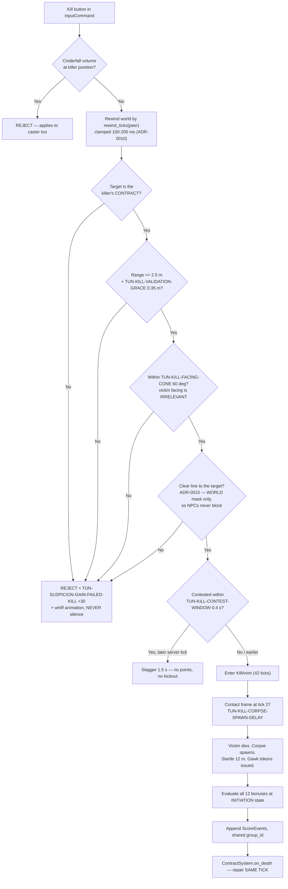

# TDD Chapter 10 — Scoring and Match State

> **Context restated.** Project Sottovoce is decided by **score**, not kills. Twelve stackable
> bonuses price restraint: a full patient blend kill is worth 750 against a sprinting tackle's
> 100 (**re-priced 2026-08-26, ADR-0013** — was 650 against 50, before `SCORE-RECKLESS` was
> neutralised and the stealth ladder was moved to the reference's weights). Several bonuses evaluate over time windows (`SCORE-PATIENT` 10 s, `SCORE-FOCUS` 6 s,
> `SCORE-LONGHUNT` 20/45 s), one depends on the player's history within the current life
> (`SCORE-VARIETY`), and a late-match phase doubles everything. Contracts form a single directed
> **Hamiltonian cycle**, so **a contract can only be killed by its holder** — there is no
> kill-stealing and no third-party interruption.
>
> **Implements:** `SYS-SCORE`, `SYS-CONTRACT`, `SYS-KILL`, `SYS-STUN`, `SYS-MATCH`,
> `SYS-SPAWN`, `SYS-RESULTS`.

---

## 1. Scoring is event sourcing

Per ADR-0004. **Every scoreable action appends an immutable `ScoreEvent` to a server-owned,
append-only log. The scoreboard, the score feed and the results screen are all folds over that
log.**

```gdscript
## An immutable record of one scoreable action. NEVER mutated after construction.
## ~40 bytes; a match produces ~600, so memory is a non-issue and no pruning exists.
class_name ScoreEvent
extends RefCounted

var event_id: int          ## monotonic, server-assigned
var tick: int              ## server tick at which it occurred
var kind: StringName       ## SCORE-CONTRACT, SCORE-BLENDED, ... (Ids)
var actor_id: int          ## peer who earned it
var subject_id: int        ## peer it was earned against, or 0
var base_points: int       ## pre-multiplier, from ScoringTuning
var multiplier: float      ## 1.0, or TUN-MATCH-FINALPHASE-MULT — FROZEN AT APPEND (§1.2)
var group_id: int          ## events from one kill share this, for feed grouping
```

### 1.1 Why, restated in one paragraph

A running integer (`player.score += bonus`) fails four requirements simultaneously: it cannot
produce the per-bonus breakdown the results screen needs, it cannot supply telemetry that
measures per-bonus frequency, it makes the score order-dependent on which system happened to run
first, and it is nearly impossible to unit-test. The classic mitigation — a running total *plus*
a parallel stats dictionary — creates two sources of truth that diverge, and the visible symptom
is a results screen that adds up to a different number than the scoreboard.

### 1.2 The multiplier is frozen at append time

```gdscript
## Resolved from the event's tick when the event is created, not at fold time.
## Consequence: a kill INITIATED at 7:29.5 and LANDING at 7:31 scores at 1.0x,
## because every bonus condition in the game is judged at INITIATION.
## Consistent with SCORE-SILENT, SCORE-PATIENT, SCORE-BLENDED and the rest.
func _multiplier_for(tick: int) -> float:
    return Tuning.match_rules.finalphase_mult if _is_final_phase(tick) else 1.0
```

Freezing also makes the fold a pure sum, with no clock access.

### 1.3 The fold is pure

```gdscript
## No autoload, no scene, no clock. This is what makes the most bug-prone part
## of the design the most testable part.
static func fold(events: Array[ScoreEvent]) -> Dictionary
```

**AMENDED 2026-08-28 (US-0064): THE `tuning` ARGUMENT IS GONE, AND THIS SECTION
CONTRADICTED ITSELF.** §1.2 freezes the multiplier at append and the struct above
carries `base_points` already rounded — so the points are frozen twice over, and a
fold that re-read `ScoringTuning` could produce **a different total from the one
the score feed already showed the player** the moment a value was retuned. That is
two sources of truth, which is the entire argument §1.1 makes against a running
total plus a parallel stats dictionary; it applies unchanged to a parallel points
table. The prose and the struct were right and only the signature was wrong.

**AND `ScoreEvent` IS CONSTRUCTED FROM A `ScoreAward`, WHICH IS NEW.** The struct
above is eight fields, and `ScoreEvent.new(id, tick, kind, actor, subject, points,
rules, group)` is a call site where transposing the actor and the subject is
invisible — it appears twelve times per kill in US-0065. `.gdlintrc` caps a
signature at six and says in as many words that the limit is a design signal, not
a style preference. `ScoreAward` is the record that answers it: **an award is a
claim a system makes, an event is what the log made of that claim**, and the seam
between them is the append. `ScoreLog.append(award, rules, group)` is the only
entry point and the only place a `TUN-SCORE-` float becomes an integer.

### 1.4 `SCORE-VARIETY` is computed at append time

The one exception to "the fold does the work", and it is justified rather than convenient:

```gdscript
## n = bonus types on THIS kill not yet earned in the current life.
## Excludes itself, SCORE-CONTRACT and SCORE-RECKLESS (ASM-0017).
## Life boundaries come from SCORE-DEATH marker events (0 points), which are
## real events with real semantics — the results screen reads deaths from them.
##
## Computed at APPEND time so the fold stays stateless. Making the fold stateful
## to accommodate one bonus would cost more than this exception does.
func _variety_count(actor: int, kinds_this_kill: Array[StringName]) -> int:
    var since_death := _log.events_for_actor_since_last_death(actor)
    var already := {}
    for e in since_death:
        already[e.kind] = true
    var n := 0
    for k in kinds_this_kill:
        if k in [Ids.SCORE_VARIETY, Ids.SCORE_CONTRACT, Ids.SCORE_RECKLESS]:
            continue
        if not already.has(k):
            n += 1
    return n
```

> **Known finding, carried from [`../50_tuning/BALANCE_MODEL.md`](../50_tuning/BALANCE_MODEL.md) §4:**
> at the modelled ~1.0 kills per life, every bonus on a kill is necessarily "first time this
> life", so Variety currently behaves as a flat +50 per bonus type rather than a reward for
> varying approach. It is ratio-neutral between archetypes, so this is a truth-in-naming problem
> rather than a balance one. The recommended fix — **reset on contract instead of on death** — is
> a one-line change here (`events_for_actor_since_last_contract`) and changes no tuning value.
> Gated on `TEL-KILLS-PER-LIFE`.

---

## 2. Bonus evaluation

All twelve are evaluated **at kill initiation**, against the lag-compensated world where
relevant.

| Bonus | Evaluated from | Source |
|---|---|---|
| `SCORE-CONTRACT` | Kill validated | `KillSystem` |
| `SCORE-SILENT` | `suspicion <= 29` at initiation | `SuspicionSystem` |
| `SCORE-PATIENT` | Speed history ring: max speed over the last 300 ticks (10 s) ≤ `TUN-SCORE-PATIENT-SPEED` | `PawnContext.speed_history` |
| `SCORE-MASKED` | `AbilitySystem.is_effect_active(peer, ABIL-SECONDFACE)` | `AbilitySystem` |
| `SCORE-FOCUS` | `los_unbroken_ticks >= 180` (6 s), with `TUN-SCORE-FOCUS-BREAK-GRACE` 0.4 s of tolerance | `DetectionSystem` |
| `SCORE-FROMABOVE` | `killer.y - victim.y >= 3.0` at initiation | Geometry |
| `SCORE-BLENDED` | `BlendSystem.grace_ticks_remaining(peer) > 0` | `BlendSystem` |
| `SCORE-LONGHUNT` | `tick - hunt_start_tick`, where `hunt_start_tick = max(assignment, first_lock)` | `ContractSystem` |
| `SCORE-VENDETTA` | `victim == killer.last_killed_by` and killer has not died since | `ScoreSystem` |
| `SCORE-VARIETY` | §1.4 | `ScoreSystem` |
| `SCORE-RECKLESS` | `suspicion >= 70` at initiation | `SuspicionSystem` |
| `SCORE-STUN` | Valid stun resolved | `StunSystem` |

### 2.1 Two windows that need real buffers

```gdscript
## SCORE-PATIENT: a ring of the last TUN-SCORE-PATIENT-WINDOW (10 s = 300 ticks)
## of speed samples. Sized so it cannot be gamed by decelerating at the last
## moment — the whole window must be clean.
var speed_history: PackedFloat32Array   # ring, 300 entries, ~1.2 KB per pawn

## SCORE-FOCUS: LOS may lapse up to TUN-SCORE-FOCUS-BREAK-GRACE (0.4 s = 12 ticks)
## without resetting. Without the grace the bonus is UNEARNABLE in a crowd —
## which is exactly where it should be earned.
func _tick_focus(hunter: PawnServer, has_los: bool) -> void:
    if has_los:
        hunter.los_grace_ticks = Tuning.ticks(&"TUN-SCORE-FOCUS-BREAK-GRACE")
        hunter.los_unbroken_ticks += 1
    elif hunter.los_grace_ticks > 0:
        hunter.los_grace_ticks -= 1
        hunter.los_unbroken_ticks += 1      # grace preserves the streak
    else:
        hunter.los_unbroken_ticks = 0
```

---

## 3. `SYS-KILL`



**Contest resolution uses the server receive tick, never a client-supplied number** (`client_tick` became `acked_tick` in US-0031 and is equally forbidden here)
(ADR-0010). A low-ping player wins a genuine tie; the alternative is trivially forgeable.
`TEL-CONTEST-RESOLVED` logs both RTTs so the skew is measurable.

### 3.1 What US-0060 built, and the four places the flowchart needed a decision

**2026-08-26.** The diagram above is what shipped. Four things it does not say:

**THE TARGET IS THE NEAREST BODY IN RANGE AND CONE, NOT THE CONTRACT.** The flowchart's
`D` asks whether the target *is* the contract, which presumes a target chosen elsewhere.
`KillRules.resolve()` chooses the nearest living player inside both gates and then asks
`D` of them — so a stranger standing between you and your contract absorbs the press and
earns `TUN-SUSPICION-GAIN-FAILED-KILL`, which is `TUN-KILL-INVALID-TARGET-PENALTY`'s own
sentence: *you cannot safely test whether a stranger is your contract.* Nearest rather than
first, because iteration order over peers is join order and a first-match rule would resolve
the same geometry differently in two matches.

**THE RANGE IS THREE-DIMENSIONAL AND THE CONE IS HORIZONTAL.** Two different questions:
"can I reach you" is a distance and "am I facing you" is a bearing, and this game has no aim
pitch to put in a cone. A horizontal reach would put the roof stratum — 3.5 m up — inside
`TUN-KILL-RANGE` of the street below it.

**THE CONTRACT READ IS THE ANNOUNCED ONE, NEVER THE GRAPH'S.** `SYS-CONTRACT` repairs the
cycle in the tick a death resolves and holds the announcement for
`TUN-CONTRACT-REASSIGN-DELAY`. Reading the graph would let a killer kill somebody they have
not been told about — which does not merely break the breath, it *pays* pressing the button
at random during it.

**AND A SAME-TICK CONTEST TIE BREAKS ON ARRIVAL ORDER.** §8.4 resolves contests by server
receive **tick**, and twelve ticks is ample resolution for a 0.4 s window — but two
initiations do land on one tick, and the two obvious tie-breaks are both wrong. Iterating
`ctx.pawns` is *join* order, which hands the earliest-joined player every tie for the whole
match; a seeded coin makes the most decisive moment in the game random.
`MatchDirector.enqueue_input` stamps a monotonic `InputCommand.received_ordinal`, because
that is the one point in the process that sees packets in the order the socket delivered
them. It is server-side scratch and is never serialised.

### 3.2 What is NOT in the kill path, and one contradiction

**THERE WAS NO LINE-OF-SIGHT CHECK, AND AS OF 2026-08-27 THERE IS ONE.** US-0060 shipped
without it — the flowchart had none, and adding one was a gameplay rule no criterion asked for,
so it was reported instead of invented. **The `S` node above is
[ADR-0015](../00_meta/adr/ADR-0015-a-kill-needs-a-clear-line.md)**, and this section's original
report follows so the reasoning is not lost.

**THE CITATION IN THAT REPORT WAS WRONG, TWICE OVER.** It attributed the opposing claim to
*"[`04_networking.md`](04_networking.md) §10's test table"*; §10 is an interfaces section and
holds no test table. The phrase is an **unticked** acceptance criterion in `ADR-0010`, and it
describes an **NPC-occluded** line — which
[`07_suspicion_and_detection.md`](07_suspicion_and_detection.md) forbids by masking `has_los` to
`WORLD` alone. It was never evidence for a gate.

**WHAT SETTLED IT WAS A MEASUREMENT US-0054 CREATED.** A market stall is 2.0 m deep and its two
derived lean spots sit `NAV_AGENT_RADIUS` clear of each long face, so **the twelve blend spots
form six pairs at 2.80 m against a 2.85 m reach** — mutually killable through the stall they are
hiding behind. The stalls are the only geometry on `MAP-VETRAIO` thin enough for it; the nearest
miss is the 2.6 m Mercato west wall at 3.40 m, which is one of the masses GDD-05 §2.7 rule 6
leans on to occlude a spawn pair.

**SIGHT FILTERS TARGET SELECTION RATHER THAN GATING THE RESULT**, which is the shape range and
cone already have — so a stranger standing in the open still absorbs the press and still earns
`TUN-KILL-INVALID-TARGET-PENALTY`. **`SYS-STUN` gains no such gate**, because that would be a
weakening and never-do #13 forbids it; the asymmetry is the range advantage's, and it is
asserted so that reversing it is deliberate.

*The original report, kept:* **As built, a kill through a market stall at 2.4 m is legal.**

**AND THE CONTEST LOSER'S STAGGER IS AN INITIATION LOCKOUT, NOT A MOVEMENT ONE.**
[`../10_gdd/02_player_controller.md`](../10_gdd/02_player_controller.md) §3's normative
diagram declares fifteen states and **none of them is a stagger**, so there is nothing to
transition into — while three separate rules need one: `TUN-KILL-CONTEST-STAGGER`,
`TUN-STUN-INVALID-STAGGER` and `TUN-LUNGE-WHIFF-STAGGER`. What is built matches §5's
"losing a race should cost tempo, not the match": the loser cannot initiate for 1.5 s, takes
no suspicion, no points and no lockout. A sixteenth state amends a normative diagram and is
the owner's.

### 3.3 File and test state

| File | Holds | State |
|---|---|---|
| `scripts/core/combat/kill_verdict.gd` | Why a press did or did not land | **Built**, US-0060 |
| `scripts/core/combat/kill_rules.gd` | Target selection, range, cone, against a `RewoundWorld` | **Built**, US-0060 |
| `scripts/core/combat/kill_contest.gd` | Who was first | **Built**, US-0060 |
| `scripts/core/combat/rewind_clamp.gd` | How far back a validation may reach | **Built**, US-0060 |
| `scripts/core/combat/rewound_world.gd` | The world as it was | **Built**, US-0035; **moved into Core** by US-0060 |
| `scripts/systems/combat/kill_system.gd` | The sequencing and the consequences | **Built**, US-0060 |
| `scripts/pawn/states/dead_state.gd` | The victim's state, with no exit until `SYS-SPAWN` | **Built**, US-0060 |
| `scripts/systems/combat/stun_system.gd` | §4's sequencing and consequences. **Not a `GameSystem`** — §4.1 | **Built**, US-0061 |
| `scripts/core/combat/stun_verdict.gd` | Why a press did or did not land, and which refusals cost | **Built**, US-0061 |
| `scripts/core/combat/stun_rules.gd` | Target selection, range, cone, against a `RewoundWorld` | **Built**, US-0061 |
| `scripts/core/combat/combat_lockouts.gd` | The per-player stagger and the per-pair exile | **Built**, US-0061 |
| `scripts/pawn/states/stun_anim_state.gd` | The stunner's 0.7 s commitment — **interruptible, unlike `KillAnim`** | **Built**, US-0061 |

---

## 4. `SYS-STUN`

```gdscript
func validate(ctx: MatchContext, stunner: int, target: int) -> bool:
    # THE gate: an Anonymous pursuer is unstunnable. Patience is genuinely safe.
    if ctx.suspicion.tier_of(target) < Tier.NOTICED:
        return false
    # Valid only against your OWN pursuer.
    if ctx.cycle.contract_of(target) != stunner:
        return false
    var rewound := ctx.lag_comp.rewind(ctx.tick - rewind_ticks(stunner),
                                        ctx.pawns[stunner].position, 7.5)
    if rewound.distance(stunner, target) > Tuning.combat.stun_range:      # 3.0 m
        return false
    return _within_cone(stunner, target, Tuning.combat.stun_facing_cone)  # 120 deg
```

`TUN-STUN-RANGE` 3.0 m deliberately exceeds `TUN-KILL-RANGE` 2.5 m (invariant §17.6): **a hunter
who closes to kill range has already entered stun range.** Recklessness is punished by geometry
before it is punished by scoring.

On an invalid stun — a non-pursuer — the target is **not affected at all**: 0 points,
`TUN-STUN-INVALID-STAGGER` 2.0 s (longer than the 0.7 s a valid stun costs, so flailing is
strictly worse than doing nothing), and `TUN-STUN-INVALID-SUSPICION` +20.

### 4.1 What US-0061 built, and the five places the sketch needed a decision

**THE SKETCH ABOVE IS SUPERSEDED IN FOUR OF ITS SIX LINES**, and the differences are all the
same kind: it reads state through paths that either do not exist or are the wrong authority.

| The sketch | As built | Why |
|---|---|---|
| `ctx.suspicion.tier_of(target)` | `PawnContext.tier`, compared against a tier **derived from `TUN-STUN-MIN-TIER`** | There is no `ctx.suspicion`; the pawn owns the value (TDD-07 §2). Deriving the floor rather than writing `!= ANONYMOUS` is what keeps the gate honest if the tunable ever moves |
| `ctx.cycle.contract_of(target) != stunner` | a reverse lookup on `ctx.announced_contracts` | **The graph is the wrong authority.** During `TUN-CONTRACT-REASSIGN-DELAY` a killer has been told nothing, so nobody may stun them for a hunt they have not been asked to start |
| a literal `7.5` rewind radius | `StunRules.reach(t)` | Derived, so retuning the range moves the radius with it. Unlike a kill, no cinder cloud gates a stun, so there is no cloud to gather |
| `rewound.distance(...) > stun_range` | `StunRules.in_reach`, which adds `TUN-KILL-VALIDATION-GRACE` | The grace absorbs quantisation and sub-tick timing and is **shared with the kill on purpose** — a second tunable for the same physical error is one that gets retuned alone, and the day it drifted the range advantage would quietly narrow |

**`SYS-STUN` IS NOT A `GameSystem`, AND §7's INTERFACE IS AMENDED TO SAY SO.** `MatchDirector`
permits one system per stage and TDD-01 §4's box 7 is a single node reading *"Kill / Stun"*, so
this is a plain object `KillSystem` owns and ticks — `SuspicionSystem`/`BlendSystem`'s shape
(TDD-07 §3.1.1). A new `stun` stage was considered and rejected for the same reason the blend
stage was: it would amend a normative diagram six documents reference, to express an ordering
that diagram already expresses.

**THE KILL RESOLVES FIRST WITHIN A TICK, AND THAT IS WHERE ADR-0013 IS DECIDED.**
`KillSystem.tick` judges its own presses and *then* calls the stun, so a hunter and their prey
who press in the **same tick** resolve for the hunter. A stun aimed at a pursuer already in
`KillAnim` returns `TARGET_COMMITTED` and **costs the prey nothing** — the press was correct and
merely late, and charging for correct play at the last instant is the shape of weakening stun
that never-do #13 forbids. It is an explicit verdict rather than a failed transition, because
`KillAnimState` would decline the state change silently while the exile still armed.

**EVERY REFUSAL COSTS THE SAME AND LOOKS THE SAME, WHICH IS A RULE RATHER THAN A SIMPLIFICATION.**
`NET-S2C-STUN-RESULT` carries `valid:bool` and a target slot of **zero on every rejection**. A
refusal that reported its reason would turn the stun button into a free identity probe: press it
at a stranger and read whether the answer means *not your pursuer* or *your pursuer, being
careful*. `StunVerdict.PENALISED` therefore includes `TOO_CALM` and `NO_TARGET` as well as
`WRONG_TARGET` — §10.3's stated case is a non-pursuer, but its stated *reason* is that mashing
must never be optimal, and a press at empty air would otherwise be free.

**AND THE `stun_ready` HINT NEEDED THE TIER GATE TOO, WHICH IS AN ANONYMITY LEAK RATHER THAN A
COSMETIC BUG.** The first version gated the hint on relationship, range and cone alone — so it
would have lit up for an **Anonymous** pursuer standing in a crowd, saying *that one is hunting
you* for free, with no lock and no warning. Found by a test, not by review.

**THE TWO LOCKOUTS LIVE ON `MatchContext` IN ONE CLASS.** A stagger is per player and blocks
every initiation; an exile is per **(hunter, target)** pair and blocks one kill. `SYS-STUN`
writes both and `SYS-KILL` reads both, so `CombatLockouts` is adopted by reference rather than
mirrored — `announced_contracts`' lesson. `KillSystem._locked_until` moved into it, which is why
the contest stagger and the flail stagger are now the same mechanism.

---

## 5. `SYS-CONTRACT`

The cycle algorithm and its validity proof are in
[`../10_gdd/03_social_stealth.md`](../10_gdd/03_social_stealth.md) §7. The implementation
contract:

```gdscript
## The Hamiltonian cycle over living players. Core type: pure, no engine,
## unit-testable. contract_of(cycle[i]) == cycle[(i+1) % n].
class_name ContractCycle
extends RefCounted

var _order: PackedInt32Array
var _recent: Dictionary                    ## peer -> recent contracts (anti-repeat)

func contract_of(peer: int) -> int
func pursuer_of(peer: int) -> int

## Removing a node from a cycle YIELDS A CYCLE. The victim's pursuer
## automatically inherits the victim's contract — the repair IS the removal,
## and no player is contractless at any tick boundary.
func on_death(victim: int) -> void

## Constrained insertion. The self-assignment filter is the ONLY hard
## constraint; anti-repeat and killer-adjacency are preferences dropped in a
## fixed order when unsatisfiable. A constraint system that can FAIL is a crash
## waiting for a playtest.
func on_respawn(player: int, killer: int, rng: RandomNumberGenerator) -> void

func on_join(peer: int, rng: RandomNumberGenerator) -> void
func on_disconnect(peer: int) -> void      ## identical to on_death

## Debug-only invariant check: distinct ids, no fixed point at n >= 2,
## exactly one cycle.
func assert_valid() -> void
```

**Repair happens in the same tick the death resolves** — `MatchDirector` orders
Kill/Stun (7) before Contract (8) precisely so that the invariant never lapses at a tick
boundary.

`TUN-CONTRACT-REPAIR-DEBOUNCE` 0.25 s batches multiple deaths in one pass, so a double kill
produces one rebuild rather than two conflicting ones.

### 5.1 What US-0049 and US-0050 built, and how the two rules above coexist

**2026-08-21.** The sketch above is amended in four places by the code that now exists.

**A REMOVAL IS NOT A REBUILD, WHICH IS WHY "SAME TICK" AND "BATCHED" ARE NOT IN CONFLICT.**
Deleting a node from a cycle leaves a cycle, so removals apply **immediately** and cannot
conflict with one another. What the debounce governs is the **announcement** and the
**insertions** — the operations that *choose* something. The graph is never behind.

**THE KILLER AND THE INHERITING PURSUER ARE THE SAME PLAYER, BY CONSTRUCTION**, since a contract
can only be killed by its holder. So the player who inherits is the one who earned the breath.

**A KILL ANNOUNCES TWICE, AND THE FIRST BEAT WAS MISSING.** `TUN-CONTRACT-REASSIGN-DELAY` was
implemented as *hold the new contract* and left the old one standing — so for three seconds a
hunter's Compass pointed at the corpse they had just made. The clear is immediate and the name
arrives after the breath; slot 0 is "nobody" on the wire, so both beats are one message kind and
the Compass has one rule instead of two. **Nobody is ever pointed at a player who is not living**,
and that is asserted every tick rather than at the settled state, which is how it was found.

**`assert_valid()` RETURNS A STRING, NOT `void`.** GDScript strips `assert()` from release builds,
so the sketch's debug-only check would not exist in the shipped game. Empty means sound.

**AND THE METHOD NAMES ARE `remove` / `insert` / `apply`**, not `on_death` / `on_respawn` /
`on_join` / `on_disconnect`: the Core type does not know what a death *is*. `ContractSystem` owns
those four verbs, and a join is the same call as a respawn with the constraints vacuous.

---

## 6. `SYS-MATCH` and `SYS-SPAWN`

```gdscript
class_name MatchSystem extends GameSystem

## Phase transitions are driven by tick counts, never wall time.
func tick(ctx: MatchContext, dt: float) -> void:
    match ctx.phase:
        MatchPhase.PLAYING:
            if ctx.ticks_remaining == Tuning.ticks(&"TUN-MATCH-FINALPHASE-DURATION") \
                                   + Tuning.ticks(&"TUN-MATCH-FINALPHASE-WARNING"):
                _broadcast_warning()          # rule change ANNOUNCED, never sprung
            if ctx.ticks_remaining == Tuning.ticks(&"TUN-MATCH-FINALPHASE-DURATION"):
                _enter_final_phase(ctx)       # multiplier only — NOTHING else changes
```

```gdscript
## Constraints in priority order. Falls back to the farthest available point
## when unsatisfiable, because a spawn system that can FAIL is a crash waiting
## for a playtest (ASM-0014).
func choose_spawn(ctx: MatchContext, player: int, killer: int) -> SpawnPoint:
    var candidates := _all_spawns()
    candidates = _filter(candidates, func(s): return s.distance_to(killer) >= 40.0)
    candidates = _filter(candidates, func(s): return s.min_distance_to_any_player() >= 12.0)
    if candidates.is_empty():
        return _farthest_from(killer)         # never fails
    return candidates.pick_random(ctx.rng)
```

### 6.1 What US-0062 built, and the four places the sketch needed a decision

**`SYS-SPAWN` IS NOT A `GameSystem` EITHER.** TDD-01 §4's diagram has **no spawn box at all**
and its stage 8 is *"Contract — repair cycle after deaths"*; a respawn is a repair after a
death, so `ContractSystem` owns and ticks it — `KillSystem`/`StunSystem`'s shape, for the third
time. **And it ticks first**, so the placement and the cycle insertion land in one tick and
nobody ever stands on the map holding no contract.

**THE SKETCH RETURNS A `SpawnPoint` AND THERE IS NO SUCH TYPE.** `MapData.spawn_points` is an
`Array[Vector3]`, so `SpawnRules.choose` returns an **index** into it. An index rather than a
position because the caller wants both — the point to stand on and, for `fallbacks`, which one
was chosen.

**`pick_random(ctx.rng)` IS NOT A GODOT SIGNATURE.** `Array.pick_random()` takes no argument
and draws from the **global** RNG, which is never-do #8 and non-deterministic: two servers
replaying one seed would place the same death differently. It is `rng.randi_range` over the
legal set.

**AND THE FALLBACK IS DETERMINISTIC WITH NO RANDOMNESS AT ALL.** It runs when the lobby is
packed tightly enough to veto every point, and the least bad answer is a property of the world
rather than a draw — a random pick would make the worst moment in a match the one place a seed
cannot reproduce. With no killer (a join) it maximises clearance from the nearest living player
instead, which is the same question asked of a lobby rather than of one person.

**`TUN-RESPAWN-DELAY` IS THE `Respawning` STATE AND `TUN-RESPAWN-INVULN` IS NOT.** GDD-02
§3.1's row gives `Respawning` an exit condition of the delay and a FATAL priority, so the
invulnerability is a separate, shorter window that begins **after** it — held in
`CombatLockouts` as a third shape, because both combat systems read it and neither reads pawn
states for permission. `KillVerdict` and `StunVerdict` each gained `TARGET_PROTECTED`, and it
**costs the presser nothing**.

**BOTH RESPAWN EDGES ARE COMPLETIONS RATHER THAN INTERRUPTIONS.** `Dead` and `Respawning` are
both FATAL and both decline every interruption, so an interrupting request at FATAL priority is
refused and the pawn stays dead forever. `PawnStateMachine.transition`'s `interrupting` flag is
what `step()` already passes false for, because *a state asking to leave is completion*; the
server holds these two clocks because the position a respawn lands at is chosen from the live
lobby at the moment the timer expires, and a client cannot know it (never-do #3).

---

## 7. Results

The results screen is a `group_by(kind)` over the same log the totals fold from, so **the two
cannot disagree** — the failure this architecture exists to prevent.

```gdscript
## Per-player breakdown for the results screen. Derived from the SAME log as
## the scoreboard, so a mismatch is structurally impossible.
static func breakdown(events: Array[ScoreEvent], tuning: ScoringTuning) -> Dictionary
```

`NET-S2C-MATCH-END` ships the full log (~600 events, ~24 KB) so the client folds locally and the
results screen needs no additional protocol.

---

## 8. Interfaces

```gdscript
class_name ScoreLog extends RefCounted
func append(e: ScoreEvent) -> void                     ## SERVER ONLY. The only entry point.
func events_for_actor_since_last_death(actor: int) -> Array[ScoreEvent]
static func fold(events: Array[ScoreEvent], t: ScoringTuning) -> Dictionary
static func breakdown(events: Array[ScoreEvent], t: ScoringTuning) -> Dictionary

class_name KillSystem extends GameSystem
func try_initiate(ctx: MatchContext, killer: int) -> int      ## KillResult
func resolve_contest(ctx: MatchContext, victim: int) -> int   ## winning peer

## AMENDED US-0061. **NOT a GameSystem** — see §4.1: one system per stage, and
## TDD-01 §4's box 7 is "Kill / Stun". `KillSystem.stun` is the instance.
class_name StunSystem extends RefCounted
func report_input(peer: int, command: InputCommand) -> void   ## edge-detected here
func tick(ctx: MatchContext) -> void                          ## called BY KillSystem.tick
func ready_for(peer: int, ctx: MatchContext) -> bool           ## the stun_ready bit
static func lockout_ticks(has_second_wind: bool) -> int

## The exile and the stagger, on MatchContext and read by BOTH combat systems.
class_name CombatLockouts extends RefCounted
func remaining(hunter: int, target: int, now: int) -> int      ## TDD-10 §7's lockout_remaining
func is_exiled(hunter: int, target: int, now: int) -> bool
func is_staggered(peer: int, now: int) -> bool
```

---

## 9. Files this chapter creates

| Path | Purpose |
|---|---|
| `scripts/core/score/score_event.gd` · `score_log.gd` | Core, pure, unit-testable |
| `scripts/core/contract/contract_cycle.gd` | Core, pure — the cycle and its invariant |
| `scripts/systems/score_system.gd` | `SYS-SCORE` |
| `scripts/systems/kill_system.gd` | `SYS-KILL` |
| `scripts/systems/combat/stun_system.gd` | `SYS-STUN` — **path corrected US-0061**, it is under `combat/` |
| `scripts/core/combat/stun_verdict.gd` · `stun_rules.gd` · `combat_lockouts.gd` | Core, pure — the verdicts, the geometry and the two timers |
| `scripts/systems/contract_system.gd` | `SYS-CONTRACT` |
| `scripts/systems/match_system.gd` | `SYS-MATCH` |
| `scripts/systems/spawn/spawn_system.gd` | `SYS-SPAWN` — **path corrected US-0062**, it is under `spawn/`. Not a `GameSystem`; see §6.1 |
| `scripts/core/spawn/spawn_rules.gd` | Core, pure — the two constraints and the never-failing fallback |
| `scripts/pawn/states/respawning_state.gd` | The five seconds, and the exit `Dead` never had |
| `scripts/mirrors/score_mirror.gd` | Client-side fold |

---

## 10. Test hooks

| Test | Asserts |
|---|---|
| `test_score_fold.gd` | Every bonus in isolation; the maximal stack; the final-phase multiplier; Variety across a death boundary; a Reckless kill netting 50; an empty log folding to zeroes. **Reproduces every reference value in GDD-07 §3.2 exactly** |
| `test_score_no_direct_mutation.gd` | **Source scan:** no assignment to a player's score outside `ScoreLog.fold()` |
| `test_score_event_immutable.gd` | `ScoreEvent` has no setter and no mutating method |
| `test_score_fold_pure.gd` | `fold()` references no autoload, scene or clock |
| `test_multiplier_frozen.gd` | A kill initiated pre-boundary and landing post-boundary scores at 1.0× |
| `test_results_matches_scoreboard.gd` | `breakdown()` totals equal `fold()` totals for 100 random logs |
| `test_patient_window.gd` | One tick above `TUN-SCORE-PATIENT-SPEED` anywhere in the 10 s window denies the bonus |
| `test_focus_grace.gd` | LOS lapsing 0.3 s preserves the streak; 0.5 s resets it |
| `test_kill_contract_only.gd` | A kill on a non-contract player is rejected with +30 suspicion and a whiff — **never silence** |
| `test_kill_facing_cone.gd` | The victim's facing is irrelevant; killing a target facing away succeeds |
| `test_kill_contest.gd` | Earlier server tick wins; loser staggers with no points and no lockout |
| `test_kill_blocked_by_cinderfall.gd` | Including the caster's own cloud |
| `test_stun_range_exceeds_kill.gd` | **Not the two tunables** — `TuningInvariants` already compares those, and would pass over a `StunRules` reading the wrong field. It sweeps the two *rules* in centimetres and asserts no killable distance is outside stun reach. **Built**, US-0061, and it found that the band a player experiences is 2.85–3.35 m rather than §10.1's 2.5–3.0 once the shared grace is added — same width, and only because the grace *is* shared |
| ~~`test_stun_tier_gate.gd`~~ | An Anonymous pursuer is unstunnable at any range | **Written as `test_stun_system.gd`**, swept over five ranges: one sample cannot tell a tier gate from a range gate that is tighter than the sample |
| `test_stun_invalid.gd` | 0 points, stagger, +20 suspicion, target unaffected — **and that a careful pursuer and a stranger are indistinguishable**, which is the assertion that stops the stun button being an identity probe. **Built**, US-0061 |
| `test_combat_lockouts.gd` | The exile binds one pair and no other hunt; both timers extend rather than shorten; a departing peer leaves nothing behind **in either direction**. **Built**, US-0061 |
| `test_secondwind_freeze_unchanged.gd` | `PASV-SECONDWIND` shortens the exile to exactly §10.4's 8 s floor and cannot reach the freeze. **Built**, US-0061 |
| `test_stun_reads_one_yaw.gd` | The pursuer's facing is irrelevant — **source-scanned**, because a behavioural test passes a rule that reads the yaw and happens to ignore it. **Built**, US-0061 |
| `test_contract_cycle_fuzz.gd` | Invariant I holds across 10 000 randomised event sequences: kills, respawns, joins, disconnects, batched |
| `test_contract_never_self.gd` | No relaxation path ever drops the self-assignment filter |
| `test_contract_repair_same_tick.gd` | No player is contractless at any tick boundary |
| `test_contract_degenerate.gd` | n = 2 raises `TEL-DEGENERATE-CYCLE`; n = 1 issues no contract without erroring |
| `test_spawn_constraints.gd` | 40 m from killer, 12 m from any player, fallback never fails **and is deterministic**, and the pick is seeded. **Built**, US-0062 |
| `test_spawn_anticamp.gd` | From any camping position ≥ 3 spawns remain valid (GDD-05 §2.7). **Built**, US-0062, swept over **3 721 positions on a 2 m grid** rather than §2.7's four hand-picked ones: the answer is the same, 3, and the worst position is (0, 58), which is none of them. **It opens with a counterfactual** — measured, a `clear_of_killer` that always returns true leaves the whole file green |
| `test_death_zero_points.gd` | Dying appends a `SCORE-DEATH` marker worth 0 |
| `test_refold_historical.gd` | An archived log re-folds under alternative `ScoringTuning`, enabling the BALANCE_MODEL §8 procedure |

---

## 11. Performance budget contribution

| Item | Budget | Notes |
|---|---|---|
| **Server**, per 33 ms tick | | Against `TUN-PERF-SERVER-TICK-BUDGET` 8.0 ms |
| Focus / patient window bookkeeping (6 pawns) | ≤ 0.05 ms | Ring writes |
| Kill / stun validation (rare, incl. rewind) | ≤ 0.10 ms | < 10 entities rewound |
| Contract repair (event-driven) | ≤ 0.02 ms | |
| Score append + Variety lookup | ≤ 0.05 ms | |
| Match phase check | ≤ 0.01 ms | |
| **Server total** | **≤ 0.23 ms** | |
| **Client** | | |
| `ScoreMirror` incremental fold | ≤ 0.05 ms | Event-driven |
| Results full fold (once) | ≤ 15 ms | One-time, on a screen with no gameplay |
| **Memory** | ~24 KB/match | ~600 events × 40 B. No pruning needed |

---

## 12. Open questions

| # | Question | Position | Needed by |
|---|---|---|---|
| 1 | Change `SCORE-VARIETY`'s reset from death to contract (§1.4)? | Measure `TEL-KILLS-PER-LIFE` first. The fix is one line and changes no tuning value; applying it blind would trade a known problem for an unmeasured one | M5 |
| 2 | `speed_history` is 300 floats per pawn (~1.2 KB × 6). Could `SCORE-PATIENT` use a running max with decay instead? | Keep the ring. A running max cannot answer "was the whole window clean", which is exactly what the bonus asserts | — |
| 3 | Contest resolution by server receive tick advantages low ping (§3). Acceptable? | Yes — the alternative is forgeable. `TEL-CONTEST-RESOLVED` makes the skew measurable rather than assumed; revisit only with data | M4 |
| 4 | Should `NET-S2C-MATCH-END` ship the full log (~24 KB) or a pre-folded summary? | Full log. It makes the results screen a pure client-side fold with no extra protocol, and it is the same data telemetry archives anyway | M5 |
| 5 | `SCORE-VENDETTA` requires the victim to learn their killer's identity, which is an open *design* question in GDD-01 §12 and GDD-03 §14. If that answer changes, this bonus changes with it. | Implement assuming identity is revealed (name only, no position). The dependency is recorded so it is not discovered late | M4 |
