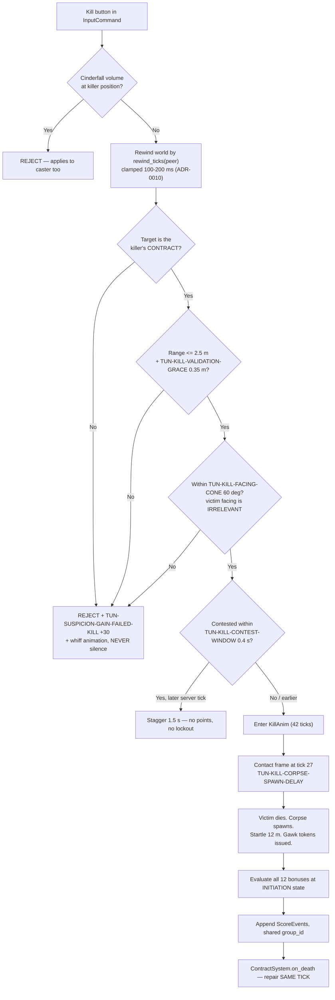

# TDD Chapter 10 — Scoring and Match State

> **Context restated.** Project Sottovoce is decided by **score**, not kills. Twelve stackable
> bonuses price restraint: a full patient blend kill is worth 650 against a sprinting tackle's
> 50. Several bonuses evaluate over time windows (`SCORE-PATIENT` 10 s, `SCORE-FOCUS` 6 s,
> `SCORE-LONGHUNT` 20/45 s), one depends on the player's history within the current life
> (`SCORE-VARIETY`), and a late-match phase doubles everything. Contracts form a single directed
> **Hamiltonian cycle**, so **a contract can only be killed by its holder** — there is no
> kill-stealing and no third-party interruption.
>
> **Implements:** `SYS-SCORE`, `SYS-CONTRACT`, `SYS-KILL`, `SYS-STUN`, `SYS-MATCH`,
> `SYS-SPAWN`, `SYS-RESULTS`.

---

## 1. Scoring is event sourcing

Per ADR-0004. **Every scoreable action appends an immutable `ScoreEvent` to a server-owned,
append-only log. The scoreboard, the score feed and the results screen are all folds over that
log.**

```gdscript
## An immutable record of one scoreable action. NEVER mutated after construction.
## ~40 bytes; a match produces ~600, so memory is a non-issue and no pruning exists.
class_name ScoreEvent
extends RefCounted

var event_id: int          ## monotonic, server-assigned
var tick: int              ## server tick at which it occurred
var kind: StringName       ## SCORE-CONTRACT, SCORE-BLENDED, ... (Ids)
var actor_id: int          ## peer who earned it
var subject_id: int        ## peer it was earned against, or 0
var base_points: int       ## pre-multiplier, from ScoringTuning
var multiplier: float      ## 1.0, or TUN-MATCH-FINALPHASE-MULT — FROZEN AT APPEND (§1.2)
var group_id: int          ## events from one kill share this, for feed grouping
```

### 1.1 Why, restated in one paragraph

A running integer (`player.score += bonus`) fails four requirements simultaneously: it cannot
produce the per-bonus breakdown the results screen needs, it cannot supply telemetry that
measures per-bonus frequency, it makes the score order-dependent on which system happened to run
first, and it is nearly impossible to unit-test. The classic mitigation — a running total *plus*
a parallel stats dictionary — creates two sources of truth that diverge, and the visible symptom
is a results screen that adds up to a different number than the scoreboard.

### 1.2 The multiplier is frozen at append time

```gdscript
## Resolved from the event's tick when the event is created, not at fold time.
## Consequence: a kill INITIATED at 7:29.5 and LANDING at 7:31 scores at 1.0x,
## because every bonus condition in the game is judged at INITIATION.
## Consistent with SCORE-SILENT, SCORE-PATIENT, SCORE-BLENDED and the rest.
func _multiplier_for(tick: int) -> float:
    return Tuning.match_rules.finalphase_mult if _is_final_phase(tick) else 1.0
```

Freezing also makes the fold a pure sum, with no clock access.

### 1.3 The fold is pure

```gdscript
## No autoload, no scene, no clock. This is what makes the most bug-prone part
## of the design the most testable part.
static func fold(events: Array[ScoreEvent], tuning: ScoringTuning) -> Dictionary
```

### 1.4 `SCORE-VARIETY` is computed at append time

The one exception to "the fold does the work", and it is justified rather than convenient:

```gdscript
## n = bonus types on THIS kill not yet earned in the current life.
## Excludes itself, SCORE-CONTRACT and SCORE-RECKLESS (ASM-0017).
## Life boundaries come from SCORE-DEATH marker events (0 points), which are
## real events with real semantics — the results screen reads deaths from them.
##
## Computed at APPEND time so the fold stays stateless. Making the fold stateful
## to accommodate one bonus would cost more than this exception does.
func _variety_count(actor: int, kinds_this_kill: Array[StringName]) -> int:
    var since_death := _log.events_for_actor_since_last_death(actor)
    var already := {}
    for e in since_death:
        already[e.kind] = true
    var n := 0
    for k in kinds_this_kill:
        if k in [Ids.SCORE_VARIETY, Ids.SCORE_CONTRACT, Ids.SCORE_RECKLESS]:
            continue
        if not already.has(k):
            n += 1
    return n
```

> **Known finding, carried from [`../50_tuning/BALANCE_MODEL.md`](../50_tuning/BALANCE_MODEL.md) §4:**
> at the modelled ~1.0 kills per life, every bonus on a kill is necessarily "first time this
> life", so Variety currently behaves as a flat +50 per bonus type rather than a reward for
> varying approach. It is ratio-neutral between archetypes, so this is a truth-in-naming problem
> rather than a balance one. The recommended fix — **reset on contract instead of on death** — is
> a one-line change here (`events_for_actor_since_last_contract`) and changes no tuning value.
> Gated on `TEL-KILLS-PER-LIFE`.

---

## 2. Bonus evaluation

All twelve are evaluated **at kill initiation**, against the lag-compensated world where
relevant.

| Bonus | Evaluated from | Source |
|---|---|---|
| `SCORE-CONTRACT` | Kill validated | `KillSystem` |
| `SCORE-SILENT` | `suspicion <= 29` at initiation | `SuspicionSystem` |
| `SCORE-PATIENT` | Speed history ring: max speed over the last 300 ticks (10 s) ≤ `TUN-SCORE-PATIENT-SPEED` | `PawnContext.speed_history` |
| `SCORE-MASKED` | `AbilitySystem.is_effect_active(peer, ABIL-SECONDFACE)` | `AbilitySystem` |
| `SCORE-FOCUS` | `los_unbroken_ticks >= 180` (6 s), with `TUN-SCORE-FOCUS-BREAK-GRACE` 0.4 s of tolerance | `DetectionSystem` |
| `SCORE-FROMABOVE` | `killer.y - victim.y >= 3.0` at initiation | Geometry |
| `SCORE-BLENDED` | `BlendSystem.grace_ticks_remaining(peer) > 0` | `BlendSystem` |
| `SCORE-LONGHUNT` | `tick - hunt_start_tick`, where `hunt_start_tick = max(assignment, first_lock)` | `ContractSystem` |
| `SCORE-VENDETTA` | `victim == killer.last_killed_by` and killer has not died since | `ScoreSystem` |
| `SCORE-VARIETY` | §1.4 | `ScoreSystem` |
| `SCORE-RECKLESS` | `suspicion >= 70` at initiation | `SuspicionSystem` |
| `SCORE-STUN` | Valid stun resolved | `StunSystem` |

### 2.1 Two windows that need real buffers

```gdscript
## SCORE-PATIENT: a ring of the last TUN-SCORE-PATIENT-WINDOW (10 s = 300 ticks)
## of speed samples. Sized so it cannot be gamed by decelerating at the last
## moment — the whole window must be clean.
var speed_history: PackedFloat32Array   # ring, 300 entries, ~1.2 KB per pawn

## SCORE-FOCUS: LOS may lapse up to TUN-SCORE-FOCUS-BREAK-GRACE (0.4 s = 12 ticks)
## without resetting. Without the grace the bonus is UNEARNABLE in a crowd —
## which is exactly where it should be earned.
func _tick_focus(hunter: PawnServer, has_los: bool) -> void:
    if has_los:
        hunter.los_grace_ticks = Tuning.ticks(&"TUN-SCORE-FOCUS-BREAK-GRACE")
        hunter.los_unbroken_ticks += 1
    elif hunter.los_grace_ticks > 0:
        hunter.los_grace_ticks -= 1
        hunter.los_unbroken_ticks += 1      # grace preserves the streak
    else:
        hunter.los_unbroken_ticks = 0
```

---

## 3. `SYS-KILL`



**Contest resolution uses the server receive tick, never a client-supplied number** (`client_tick` became `acked_tick` in US-0031 and is equally forbidden here)
(ADR-0010). A low-ping player wins a genuine tie; the alternative is trivially forgeable.
`TEL-CONTEST-RESOLVED` logs both RTTs so the skew is measurable.

---

## 4. `SYS-STUN`

```gdscript
func validate(ctx: MatchContext, stunner: int, target: int) -> bool:
    # THE gate: an Anonymous pursuer is unstunnable. Patience is genuinely safe.
    if ctx.suspicion.tier_of(target) < Tier.NOTICED:
        return false
    # Valid only against your OWN pursuer.
    if ctx.cycle.contract_of(target) != stunner:
        return false
    var rewound := ctx.lag_comp.rewind(ctx.tick - rewind_ticks(stunner),
                                        ctx.pawns[stunner].position, 7.5)
    if rewound.distance(stunner, target) > Tuning.combat.stun_range:      # 3.0 m
        return false
    return _within_cone(stunner, target, Tuning.combat.stun_facing_cone)  # 120 deg
```

`TUN-STUN-RANGE` 3.0 m deliberately exceeds `TUN-KILL-RANGE` 2.5 m (invariant §17.6): **a hunter
who closes to kill range has already entered stun range.** Recklessness is punished by geometry
before it is punished by scoring.

On an invalid stun — a non-pursuer — the target is **not affected at all**: 0 points,
`TUN-STUN-INVALID-STAGGER` 2.0 s (longer than the 0.7 s a valid stun costs, so flailing is
strictly worse than doing nothing), and `TUN-STUN-INVALID-SUSPICION` +20.

---

## 5. `SYS-CONTRACT`

The cycle algorithm and its validity proof are in
[`../10_gdd/03_social_stealth.md`](../10_gdd/03_social_stealth.md) §7. The implementation
contract:

```gdscript
## The Hamiltonian cycle over living players. Core type: pure, no engine,
## unit-testable. contract_of(cycle[i]) == cycle[(i+1) % n].
class_name ContractCycle
extends RefCounted

var _order: PackedInt32Array
var _recent: Dictionary                    ## peer -> recent contracts (anti-repeat)

func contract_of(peer: int) -> int
func pursuer_of(peer: int) -> int

## Removing a node from a cycle YIELDS A CYCLE. The victim's pursuer
## automatically inherits the victim's contract — the repair IS the removal,
## and no player is contractless at any tick boundary.
func on_death(victim: int) -> void

## Constrained insertion. The self-assignment filter is the ONLY hard
## constraint; anti-repeat and killer-adjacency are preferences dropped in a
## fixed order when unsatisfiable. A constraint system that can FAIL is a crash
## waiting for a playtest.
func on_respawn(player: int, killer: int, rng: RandomNumberGenerator) -> void

func on_join(peer: int, rng: RandomNumberGenerator) -> void
func on_disconnect(peer: int) -> void      ## identical to on_death

## Debug-only invariant check: distinct ids, no fixed point at n >= 2,
## exactly one cycle.
func assert_valid() -> void
```

**Repair happens in the same tick the death resolves** — `MatchDirector` orders
Kill/Stun (7) before Contract (8) precisely so that the invariant never lapses at a tick
boundary.

`TUN-CONTRACT-REPAIR-DEBOUNCE` 0.25 s batches multiple deaths in one pass, so a double kill
produces one rebuild rather than two conflicting ones.

---

## 6. `SYS-MATCH` and `SYS-SPAWN`

```gdscript
class_name MatchSystem extends GameSystem

## Phase transitions are driven by tick counts, never wall time.
func tick(ctx: MatchContext, dt: float) -> void:
    match ctx.phase:
        MatchPhase.PLAYING:
            if ctx.ticks_remaining == Tuning.ticks(&"TUN-MATCH-FINALPHASE-DURATION") \
                                   + Tuning.ticks(&"TUN-MATCH-FINALPHASE-WARNING"):
                _broadcast_warning()          # rule change ANNOUNCED, never sprung
            if ctx.ticks_remaining == Tuning.ticks(&"TUN-MATCH-FINALPHASE-DURATION"):
                _enter_final_phase(ctx)       # multiplier only — NOTHING else changes
```

```gdscript
## Constraints in priority order. Falls back to the farthest available point
## when unsatisfiable, because a spawn system that can FAIL is a crash waiting
## for a playtest (ASM-0014).
func choose_spawn(ctx: MatchContext, player: int, killer: int) -> SpawnPoint:
    var candidates := _all_spawns()
    candidates = _filter(candidates, func(s): return s.distance_to(killer) >= 40.0)
    candidates = _filter(candidates, func(s): return s.min_distance_to_any_player() >= 12.0)
    if candidates.is_empty():
        return _farthest_from(killer)         # never fails
    return candidates.pick_random(ctx.rng)
```

---

## 7. Results

The results screen is a `group_by(kind)` over the same log the totals fold from, so **the two
cannot disagree** — the failure this architecture exists to prevent.

```gdscript
## Per-player breakdown for the results screen. Derived from the SAME log as
## the scoreboard, so a mismatch is structurally impossible.
static func breakdown(events: Array[ScoreEvent], tuning: ScoringTuning) -> Dictionary
```

`NET-S2C-MATCH-END` ships the full log (~600 events, ~24 KB) so the client folds locally and the
results screen needs no additional protocol.

---

## 8. Interfaces

```gdscript
class_name ScoreLog extends RefCounted
func append(e: ScoreEvent) -> void                     ## SERVER ONLY. The only entry point.
func events_for_actor_since_last_death(actor: int) -> Array[ScoreEvent]
static func fold(events: Array[ScoreEvent], t: ScoringTuning) -> Dictionary
static func breakdown(events: Array[ScoreEvent], t: ScoringTuning) -> Dictionary

class_name KillSystem extends GameSystem
func try_initiate(ctx: MatchContext, killer: int) -> int      ## KillResult
func resolve_contest(ctx: MatchContext, victim: int) -> int   ## winning peer

class_name StunSystem extends GameSystem
func try_stun(ctx: MatchContext, stunner: int) -> int
func lockout_remaining_ticks(hunter: int, target: int) -> int
```

---

## 9. Files this chapter creates

| Path | Purpose |
|---|---|
| `scripts/core/score/score_event.gd` · `score_log.gd` | Core, pure, unit-testable |
| `scripts/core/contract/contract_cycle.gd` | Core, pure — the cycle and its invariant |
| `scripts/systems/score_system.gd` | `SYS-SCORE` |
| `scripts/systems/kill_system.gd` | `SYS-KILL` |
| `scripts/systems/stun_system.gd` | `SYS-STUN` |
| `scripts/systems/contract_system.gd` | `SYS-CONTRACT` |
| `scripts/systems/match_system.gd` | `SYS-MATCH` |
| `scripts/systems/spawn_system.gd` | `SYS-SPAWN` |
| `scripts/mirrors/score_mirror.gd` | Client-side fold |

---

## 10. Test hooks

| Test | Asserts |
|---|---|
| `test_score_fold.gd` | Every bonus in isolation; the maximal stack; the final-phase multiplier; Variety across a death boundary; a Reckless kill netting 50; an empty log folding to zeroes. **Reproduces every reference value in GDD-07 §3.2 exactly** |
| `test_score_no_direct_mutation.gd` | **Source scan:** no assignment to a player's score outside `ScoreLog.fold()` |
| `test_score_event_immutable.gd` | `ScoreEvent` has no setter and no mutating method |
| `test_score_fold_pure.gd` | `fold()` references no autoload, scene or clock |
| `test_multiplier_frozen.gd` | A kill initiated pre-boundary and landing post-boundary scores at 1.0× |
| `test_results_matches_scoreboard.gd` | `breakdown()` totals equal `fold()` totals for 100 random logs |
| `test_patient_window.gd` | One tick above `TUN-SCORE-PATIENT-SPEED` anywhere in the 10 s window denies the bonus |
| `test_focus_grace.gd` | LOS lapsing 0.3 s preserves the streak; 0.5 s resets it |
| `test_kill_contract_only.gd` | A kill on a non-contract player is rejected with +30 suspicion and a whiff — **never silence** |
| `test_kill_facing_cone.gd` | The victim's facing is irrelevant; killing a target facing away succeeds |
| `test_kill_contest.gd` | Earlier server tick wins; loser staggers with no points and no lockout |
| `test_kill_blocked_by_cinderfall.gd` | Including the caster's own cloud |
| `test_stun_range_exceeds_kill.gd` | Invariant §17.6 |
| `test_stun_tier_gate.gd` | An Anonymous pursuer is unstunnable at any range |
| `test_stun_invalid.gd` | 0 points, 2.0 s stagger, +20 suspicion, target unaffected |
| `test_contract_cycle_fuzz.gd` | Invariant I holds across 10 000 randomised event sequences: kills, respawns, joins, disconnects, batched |
| `test_contract_never_self.gd` | No relaxation path ever drops the self-assignment filter |
| `test_contract_repair_same_tick.gd` | No player is contractless at any tick boundary |
| `test_contract_degenerate.gd` | n = 2 raises `TEL-DEGENERATE-CYCLE`; n = 1 issues no contract without erroring |
| `test_spawn_constraints.gd` | 40 m from killer, 12 m from any player, fallback never fails |
| `test_spawn_anticamp.gd` | From any camping position ≥ 3 spawns remain valid (GDD-05 §2.7) |
| `test_death_zero_points.gd` | Dying appends a `SCORE-DEATH` marker worth 0 |
| `test_refold_historical.gd` | An archived log re-folds under alternative `ScoringTuning`, enabling the BALANCE_MODEL §8 procedure |

---

## 11. Performance budget contribution

| Item | Budget | Notes |
|---|---|---|
| **Server**, per 33 ms tick | | Against `TUN-PERF-SERVER-TICK-BUDGET` 8.0 ms |
| Focus / patient window bookkeeping (6 pawns) | ≤ 0.05 ms | Ring writes |
| Kill / stun validation (rare, incl. rewind) | ≤ 0.10 ms | < 10 entities rewound |
| Contract repair (event-driven) | ≤ 0.02 ms | |
| Score append + Variety lookup | ≤ 0.05 ms | |
| Match phase check | ≤ 0.01 ms | |
| **Server total** | **≤ 0.23 ms** | |
| **Client** | | |
| `ScoreMirror` incremental fold | ≤ 0.05 ms | Event-driven |
| Results full fold (once) | ≤ 15 ms | One-time, on a screen with no gameplay |
| **Memory** | ~24 KB/match | ~600 events × 40 B. No pruning needed |

---

## 12. Open questions

| # | Question | Position | Needed by |
|---|---|---|---|
| 1 | Change `SCORE-VARIETY`'s reset from death to contract (§1.4)? | Measure `TEL-KILLS-PER-LIFE` first. The fix is one line and changes no tuning value; applying it blind would trade a known problem for an unmeasured one | M5 |
| 2 | `speed_history` is 300 floats per pawn (~1.2 KB × 6). Could `SCORE-PATIENT` use a running max with decay instead? | Keep the ring. A running max cannot answer "was the whole window clean", which is exactly what the bonus asserts | — |
| 3 | Contest resolution by server receive tick advantages low ping (§3). Acceptable? | Yes — the alternative is forgeable. `TEL-CONTEST-RESOLVED` makes the skew measurable rather than assumed; revisit only with data | M4 |
| 4 | Should `NET-S2C-MATCH-END` ship the full log (~24 KB) or a pre-folded summary? | Full log. It makes the results screen a pure client-side fold with no extra protocol, and it is the same data telemetry archives anyway | M5 |
| 5 | `SCORE-VENDETTA` requires the victim to learn their killer's identity, which is an open *design* question in GDD-01 §12 and GDD-03 §14. If that answer changes, this bonus changes with it. | Implement assuming identity is revealed (name only, no position). The dependency is recorded so it is not discovered late | M4 |
