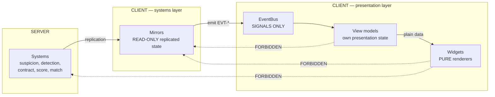

# TDD Chapter 11 — UI Architecture

> **Context restated.** In Project Sottovoce the HUD is not decoration — it is the game's
> primary information channel. The **Compass** is how you hunt (a ±12° direction cone and a
> distance-mapped pulse, never a position). The **prey warning** is how you survive (a red flash
> and a sting when your pursuer is within 15 m *and* at least Noticed — carrying no direction).
> The **score feed** is how you learn, naming each bonus at the instant it is earned.
>
> **The consequence:** a UI bug here is a gameplay bug. A Compass showing a stale bearing is not
> a cosmetic defect; it is the game lying to the player about the only thing it tells them.
>
> **Implements:** `SYS-HUD`, `SYS-SCOREFEED`, the client half of `SYS-COMPASS` (§2.2),
> `SYS-LOBBY` and `SYS-RESULTS` (§5, screen flow), and the dispatch side of `SYS-AUDIO` and
> `SYS-MUSIC` (§4, bus subscription — the sound design itself is
> [`../30_bible/AUDIO_BIBLE.md`](../30_bible/AUDIO_BIBLE.md)).

---

## 1. One-way data flow

Per ADR-0006. **Data flows in exactly one direction: gameplay systems → the event bus → view
models → widgets.**



### 1.1 The four rules

| # | Rule | Enforced by |
|---|---|---|
| 1 | **No widget reads a gameplay node.** A widget's entire input is its view model | `test_ui_no_gameplay_refs.gd` — source scan for `get_node` outside a widget's own subtree, and for any `scripts/systems/` or `scripts/mirrors/` identifier under `scripts/presentation/` |
| 2 | **No gameplay system reads a widget.** | Layer rule ([`01_architecture.md`](01_architecture.md) §1.2); the server export contains no UI at all |
| 3 | **`EventBus` holds no state.** Signal declarations and comments only — no `var`, no `func` | `test_eventbus_is_stateless.gd` |
| 4 | **Input flows the other way and does not use the bus.** Widget → input handler → network, as a direct call chain | Mixing input into the bus would make it bidirectional, which is the failure this ADR exists to prevent |

### 1.2 Facts and moments

Two kinds of thing cross the bus, and the distinction determines who consumes them.

| | **Facts** | **Moments** |
|---|---|---|
| Meaning | State has a new value | Something happened |
| Examples | `EVT-SUSPICION-TIER-CHANGED`, `EVT-CONTRACT-ASSIGNED`, `EVT-MATCH-PHASE-CHANGED` | `EVT-SCORE-EVENT-APPENDED`, `EVT-PREY-WARNING-TRIGGERED`, `EVT-ABILITY-STARTED` |
| Consumed by | View models holding current state | View models with queues, and `Audio` |
| Missable? | No — late subscribers can request the current value | Yes — a missed moment is missed |

Both are **past-tense**: the bus reports what *has happened*, never what *should happen*. Signal
names follow `past_tense_fact` — `contract_assigned`, never `assign_contract` or `on_contract`.

---

## 2. View models

A view model **owns presentation state** so that widgets stay pure: interpolated values,
animation phase, formatted strings, queues.

```gdscript
class_name ViewModel
extends RefCounted

signal changed

func _init() -> void:
    _subscribe()

## Connect to EventBus here. NEVER to a gameplay node.
func _subscribe() -> void:
    pass

## Advance presentation-only state at display rate.
func update(_delta: float) -> void:
    pass
```

### 2.1 The five MVP view models

| View model | Owns | Fed by |
|---|---|---|
| `CompassVm` | **Pulse phase accumulator**, smoothed bearing, lock fill, portrait reveal flag | Snapshot → `ContractMirror` |
| `TierVM` | Current tier, transition lerp, active-source list | `EVT-SUSPICION-TIER-CHANGED` |
| `ScoreFeedVM` | Line queue with per-line lifetimes and stagger | `EVT-SCORE-EVENT-APPENDED` |
| `MatchVM` | Phase, locally-interpolated clock, multiplier flag | `EVT-MATCH-PHASE-CHANGED` + snapshot |
| `AbilitySlotVM` | Cooldown fractions, ready flags | Snapshot |

### 2.2 `CompassVm` — the important one

The Compass is the game's central instrument, and its correctness requirements are unusual for a
UI component.

```gdscript
class_name CompassVm
extends ViewModel

var bearing_rad: float          ## smoothed toward the authoritative value
var pulse_phase: float          ## 0..1, advances at DISPLAY rate
var lock_fraction: float
var portrait_persona: StringName   ## &"" until a lock completes (ASM-0030)

## Advances at display rate so the pulse is smooth at any frame rate, but its
## PERIOD comes from the 30 Hz authoritative distance. A 144 Hz client and a
## 60 Hz client see the same CADENCE, smoothed differently.
func update(delta: float) -> void:
    var period := CompassMath.pulse_period(_distance_m)   ## Core, unit-tested
    pulse_phase += delta / period
    if pulse_phase >= 1.0:
        pulse_phase -= 1.0
        EventBus.compass_pulsed.emit()                     ## Audio subscribes here
    bearing_rad = lerp_angle(bearing_rad, _target_bearing, delta * SMOOTH_RATE)
    changed.emit()
```

**Three things `CompassVm` must never do**, each corresponding to a rule the protocol already
enforces ([`04_networking.md`](04_networking.md) §6.4) — belt and braces, because the protocol
protects against leaks and this protects against *invention*:

| Never | Why |
|---|---|
| Compute distance from a world position | It does not have one, and must not acquire one. It has a `distance_bucket` |
| Apply its own wobble | Wobble is applied **server-side** and is deterministic per contract, so every peer sees the same cone. A client-side wobble would be a second, unlearnable lie |
| Extrapolate the bearing forward | The Compass must never contain information newer than the simulation |

### 2.3 `ScoreFeedVM` — the teacher

```gdscript
## Bonuses from one kill share a group_id and arrive as a SEQUENCE staggered by
## TUN-UI-SCOREFEED-STAGGER (0.12 s). Four bonuses arriving simultaneously is
## ONE event; arriving 0.12 s apart they are four, each individually readable —
## and the sequence is more satisfying, which is a real effect and not a small one.
func _on_score_event(e: ScoreEvent) -> void:
    var delay := _count_in_group(e.group_id) * Tuning.ui_audio.scorefeed_stagger
    _pending.append(FeedLine.new(
        text  = Strings.get(_bonus_key(e.kind)),      ## NEVER a literal (ASM-0023)
        value = int(e.base_points * e.multiplier),
        show_at = _now + delay,
        lifetime = Tuning.ui_audio.scorefeed_duration,
        is_penalty = e.base_points < 0))              ## distinct treatment, not a small positive
```

---

## 3. Widgets

```gdscript
class_name Widget
extends Control

var vm: ViewModel      ## assigned at construction by the HUD root. NEVER looked up.

func _ready() -> void:
    assert(vm != null, "Widget requires a view model (ADR-0006)")
    vm.changed.connect(_on_changed)

func _on_changed() -> void:
    queue_redraw()
```

**A widget contains no gameplay logic, no thresholds and no formatting decisions that depend on
rules.** `TierIndicator` does not know that 30 is the Noticed threshold — it receives a tier
enum. `CompassWidget` does not know the pulse curve — it receives a phase.

This is what makes the readability test (`TUN-UI-READABILITY-TARGET` 0.5 s) automatable: a
widget can be instantiated with a synthetic view model, screenshotted in every state, and
checked without a running match.

### 3.1 The widget inventory

| Widget | View model | Draws |
|---|---|---|
| `CompassWidget` | `CompassVm` | Cone arc, pulse ring, lock arc |
| `ContractPortrait` | `CompassVm` | Unknown silhouette, or the revealed persona (ASM-0030) |
| `TierIndicator` | `TierVM` | Shape + colour + word, plus the active-source list |
| `ScoreFeed` | `ScoreFeedVM` | Up to `TUN-UI-SCOREFEED-MAX-LINES` 4 lines |
| `AbilitySlots` | `AbilitySlotVM` | Two icons, radial sweeps, key labels |
| `MatchTimer` | `MatchVM` | `M:SS`, final-phase bar, ×2 marker |
| `Crosshair` | `AbilitySlotVM` + snapshot | Dot; ring when a kill or stun would succeed |

### 3.2 The crosshair must not lie

The one widget with a hard correctness requirement, because
[`../10_gdd/02_player_controller.md`](../10_gdd/02_player_controller.md) failure mode 7 is
"kill feels unresponsive":

```gdscript
## The ring appears IF AND ONLY IF pressing kill would succeed.
## Fed by a server-computed flag in the snapshot, NOT by a client-side range
## check — a client-side check would disagree with lag-compensated server
## validation, and a lying crosshair is worse than no crosshair.
var kill_ready: bool      ## from snapshot.own_gameplay
var stun_ready: bool
```

`test_crosshair_truth.gd` asserts agreement with server-side validity across 500 randomised
poses.

---

## 4. The event catalogue

Full payload schemas in
[`../30_bible/SIGNAL_AND_EVENT_BUS.md`](../30_bible/SIGNAL_AND_EVENT_BUS.md). The shape:

```gdscript
## EventBus.gd — SIGNAL DECLARATIONS AND COMMENTS ONLY.
## No var. No func. A stateful event bus is a global variable in disguise.
extends Node

## --- Facts ---
signal suspicion_tier_changed(tier: int, active_sources: int)
signal contract_assigned(reason: int)
signal contract_portrait_revealed(persona: StringName)
signal match_phase_changed(phase: int, multiplier: float)
signal ability_cooldown_changed(slot: int, remaining_ticks: int)
signal blend_state_changed(blend_type: int)

## --- Moments ---
signal score_event_appended(event: ScoreEvent)
signal prey_warning_triggered()          ## NO PARAMETERS. There is no direction to pass.
signal ability_started(peer: int, ability: StringName, origin: Vector3)
signal compass_pulsed()
signal kill_resolved(killer: int, victim: int)
signal stun_resolved(stunner: int, target: int, valid: bool)
signal tuning_reloaded()
```

> **`prey_warning_triggered()` takes no parameters, deliberately.** The protocol already carries
> nothing but a tick ([`04_networking.md`](04_networking.md) §6.4); the signal signature makes
> it *impossible* for a future widget to render a direction that does not exist. A rule enforced
> at three layers — protocol, signal, and widget — is a rule that survives refactoring.

---

## 5. Menu and screen flow

Screens are separate scenes swapped by a thin `ScreenStack`; the HUD is not a screen and is
never unloaded during a match.

```
boot.tscn ──> MainMenu ──> Lobby ──> (match: HUD is live) ──> Results ──> Lobby
                  └──> Options ──┘
```

| Screen | Notes |
|---|---|
| `MainMenu` | Host / Join (direct IP) / Options / Quit |
| `Lobby` | **An information surface, not a menu.** Every ability's cooldown, suspicion cost and *tell* is shown, because loadouts lock for the whole match. Personas visible to all; loadouts visible to none |
| `HUD` | Live during `PLAYING` and `FINAL`. Never unloaded — reloading it mid-match would drop view-model state including the pulse phase |
| `Results` | `TUN-MATCH-RESULTS-DURATION` 25 s, unanimous skip only. A pure client-side fold over the log shipped in `NET-S2C-MATCH-END` |
| `Options` | Video, audio buses, input rebinding, accessibility |

---

## 6. Accessibility implementation

Design in [`../10_gdd/02_player_controller.md`](../10_gdd/02_player_controller.md) §9. What it
costs architecturally:

| Provision | Implementation |
|---|---|
| Colourblind palettes | A `Palette` resource injected into every widget. Widgets never name a colour literal |
| Tier readable in monochrome | `TierIndicator` draws **shape + word** as well as colour; passes a greyscale render test |
| Audio captions | `Audio` emits `EVT-CAPTION` for every event flagged `Cap` in the audio table; `CaptionOverlay` renders them positionally where the sound is positional — **and centred for the prey warning**, matching the mono sting |
| Visual Compass pulse | Already the primary channel; audio is reinforcement. A deaf player loses no Compass information |
| Hold/toggle | Handled in the input layer, not in widgets |
| Motion reduction | Locks camera FOV and adds a persistent speed-state indicator to `TierIndicator` — a *different* channel replacing the FOV warning, not a removed one |
| Adjustable feed duration | `TUN-UI-SCOREFEED-DURATION` raisable to 8 s via options |

---

## 7. Interfaces

```gdscript
class_name HudRoot extends Control
## Constructs view models, injects them into widgets, owns their lifetime.
## The ONLY place a widget and a view model are connected.
func build(mirrors: MirrorSet) -> void
func _process(delta: float) -> void      ## update() on each view model

class_name ScreenStack extends Node
func push(screen: PackedScene) -> void
func pop() -> void
func replace(screen: PackedScene) -> void
```

---

## 8. Files this chapter creates

| Path | Purpose |
|---|---|
| `scripts/presentation/event_bus.gd` | Signals only |
| `scripts/presentation/view_model.gd` · `widget.gd` | Base classes |
| `scripts/presentation/view_models/*.gd` | 5 view models |
| `scripts/presentation/ui/*.gd` | 7 widgets |
| `scripts/presentation/ui/hud_root.gd` · `screen_stack.gd` | Wiring |
| `scripts/presentation/ui/caption_overlay.gd` | Accessibility captions |
| `scripts/presentation/palette.gd` | Colourblind palettes |
| `scenes/ui/*.tscn` | Screens and widget scenes |

---

## 9. Test hooks

| Test | Asserts |
|---|---|
| `test_ui_no_gameplay_refs.gd` | No `scripts/presentation/` file references `scripts/systems/` or `scripts/mirrors/`; no `get_node` outside a widget's own subtree |
| `test_eventbus_is_stateless.gd` | `event_bus.gd` contains only signals, comments and blank lines |
| `test_eventbus_signals_documented.gd` | Every signal has a row in `SIGNAL_AND_EVENT_BUS.md` with a matching arity |
| `test_widgets_have_view_models.gd` | Every `Widget` in `client_root.tscn` has a non-null `vm` after `_ready` |
| `test_compass_vm.gd` | Pulse period matches the TUNABLES §4.2 sampled table at **every listed distance**, within 1 ms |
| `test_compass_no_wobble_clientside.gd` | `CompassVm` applies no wobble of its own |
| `test_compass_no_position.gd` | `CompassVm` has no field holding a world position |
| `test_prey_warning_signal_arity.gd` | `prey_warning_triggered` takes **zero** parameters |
| `test_scorefeed_stagger.gd` | Four bonuses from one kill appear 0.12 s apart, penalties visually distinct |
| `test_scorefeed_cap.gd` | Never more than `TUN-UI-SCOREFEED-MAX-LINES` simultaneous lines |
| `test_crosshair_truth.gd` | Ring state agrees with server kill validity across 500 randomised poses |
| `test_tier_monochrome.gd` | All three tiers are distinguishable in a greyscale render |
| `test_no_colour_literals.gd` | No widget names a colour literal; all come from `Palette` |
| `test_hud_readability.gd` | Every HUD state renders parseably; screenshots archived for the manual 0.5 s test |
| `test_captions_for_flagged_events.gd` | Every audio event flagged `Cap` emits `EVT-CAPTION` on the same frame |
| `test_no_literal_strings_ui.gd` | No user-facing literal in any widget |

---

## 10. Performance budget contribution

Against `TUN-PERF-UI-BUDGET` **1.0 ms**.

| Item | Budget |
|---|---|
| View-model updates (5, at display rate) | ≤ 0.15 ms |
| `CompassWidget` redraw (arc + pulse + lock) | ≤ 0.25 ms |
| `ScoreFeed` (≤ 4 lines) | ≤ 0.15 ms |
| Remaining widgets | ≤ 0.20 ms |
| Caption overlay | ≤ 0.05 ms |
| Event-bus dispatch | ≤ 0.05 ms |
| **Total** | **≤ 0.85 ms of 1.0 ms** |

Widgets redraw **on `changed`**, not every frame. `CompassWidget` is the exception — it animates
continuously — which is why it carries the largest single allocation.

---

## 11. Open questions

| # | Question | Position | Needed by |
|---|---|---|---|
| 1 | Should `Audio` have a view model like widgets do, rather than subscribing to `EventBus` directly? | Direct for MVP. The dispatcher is a pure event→bus mapping with no interpolated state, so a view model would be an empty shell. Revisit if ducking acquires state | M5 |
| 2 | The HUD is never unloaded mid-match, so a scene reload during a match loses view-model state including pulse phase. Should view models be able to rehydrate? | Not needed in MVP — there is no mid-match reload path. If hot-reloading UI is ever wanted for iteration, this becomes real | M5 |
| 3 | Should `test_hud_readability.gd` do automated legibility scoring, or only archive screenshots for the manual 0.5 s test? | Archive only. Automated legibility scoring is a research problem; the manual test with real people is the actual measure ([`../30_bible/UI_UX_SPEC.md`](../30_bible/UI_UX_SPEC.md) §9) | M5 |
| 4 | The stun lockout has no HUD indication when you are the stunned player ([`../10_gdd/06_ui_audio.md`](../10_gdd/06_ui_audio.md) open question 6). Being unable to act with no visible reason is the worst kind of opacity. | Add to `TierIndicator` at M5. Small addition, real cost if omitted | M5 |
