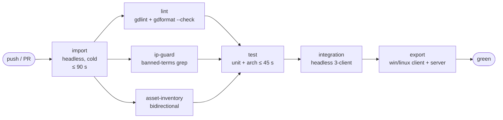

# TDD Chapter 12 — Build, CI and Tooling

> **Context restated.** Project Sottovoce is a Godot 4.7.1 / GDScript game with a dedicated
> headless server, targeting Windows and Linux desktop at 1080p/60. Development is trunk-based
> on `main`, which must always be green and always playtestable, because the game can only be
> validated with 4–6 humans and a spontaneous "can we try this tonight?" must always be yes.
>
> **The tooling thesis:** the balance loop is the project's main risk-reduction activity, so the
> highest-value tools are the ones that shorten *edit → six people playing*. That is what §5
> and §6 are for.
>
> **Implements:** `SYS-DEBUG` (§5), `SYS-TELEMETRY` (§9, the `TelemetrySink` interface —
> the event catalogue is [`../10_gdd/07_balance.md`](../10_gdd/07_balance.md) §8).

---

## 1. CI pipeline



All six jobs are **required checks** on `main` (ADR-0009) — see §1.3 for how far
that is currently *enforced* as opposed to merely agreed.

| Job | Fails on | Typical |
|---|---|---|
| `import` | Any import error or script parse failure | ~70 s cold, ~15 s cached |
| `lint` | Any `gdlint` violation; any file `gdformat` would change | ~20 s |
| `ip-guard` | **Any banned term anywhere in the repo** | ~5 s |
| `asset-inventory` | An asset with no licence row, **or a stale row** | ~5 s |
| `test` | Any architecture, unit **or integration** test failure | ~60 s |
| `integration` | Headless 3-client harness failure | ~180 s |
| `export` | Export failure, or a preset missing an exclusion | ~120 s |

> **The `integration` row is not built yet.** There are seven jobs on `main` and that is not one
> of them: the 3-client harness is US-0036, in M2, and it needs the networking that does not
> exist. What *does* run is `test/integration/` as a third step inside `test`, added in US-0016
> — scene-booting tests on one peer, no harness. `.ci/run_gut.sh` skips the directory when it is
> empty, so this cost nothing until there was something to run.
>
> It was worth adding early. Unit tests prove `step()` is correct; they cannot prove anything
> ever *calls* it, and a broken boot path has now survived a fully green suite twice — once with
> 92 tests passing, once with 222.

### 1.1 `ip-guard`

```bash
# .ci/ip_guard.sh — HARD failure, not a warning.
# Exactly two files are exempt (they necessarily contain the terms):
#   docs/00_meta/IP_GUARDRAILS.md
#   .ci/banned_terms.txt
# Adding a third requires an ADR.
grep -rIn --exclude-dir=.git \
     --exclude-from=.ci/ip_guard_exclude.txt \
     -i -f .ci/banned_terms.txt . && exit 1 || exit 0
```

It scans **everything** — code, docs, commit messages via a separate hook, asset filenames,
branch names. Renaming later does not work: names leak into history, filenames, screenshots and
playtester vocabulary.

Its file list comes from `.ci/repo_files.sh`, which refuses to return an empty one. See §1.5:
this guard spent two milestones reporting "clean" over zero files outside a work tree.

### 1.2 `asset-inventory`

Checked **in both directions**. A stale row is as much a defect as a missing one: it means
someone deleted an asset and left a claim about it, which makes the whole register untrustworthy.

Same enumeration, same refusal (§1.5) — with one asymmetry worth keeping straight. An empty
*repository* scan is always a broken scan; an empty *asset* list is legitimate, since today every
path under `assets/` is a `.gdkeep`. The emptiness check therefore belongs to the whole-tree
enumeration and only there.

### 1.3 Enforcement status — read this before trusting the word "required"

GitHub's **branch protection and rulesets both require GitHub Pro on a private
repository.** On the current plan the API returns:

```
403  Upgrade to GitHub Pro or make this repository public to enable this feature.
```

So the six checks are **required by agreement, not by the server**. What is
actually enforced today:

| Control | Enforced by | Real? |
|---|---|---|
| Squash-only merges, no merge commits, no rebase | GitHub repo settings | **Yes** — server-side, free |
| Branch auto-deleted on merge | GitHub repo settings | **Yes** — server-side, free |
| CI runs on every push and PR | `ci.yml` triggers | **Yes** |
| CI failure *blocks the merge* | — | **No.** Red can be merged |
| Direct push to `main` refused | `.githooks/pre-push` | **Client-side only** |

`.githooks/pre-push` is a guard rail, not a gate. It is bypassable with
`--no-verify`, it lives on the client, and **a fresh clone does not run it until
`core.hooksPath` is set**:

```bash
git config core.hooksPath .githooks
```

That single command is a required step in any new clone. It stops the accidental
push and the automated one — the actual risk on a solo repo — and it stops
nothing done deliberately.

**Promote this to real enforcement when the plan allows.** Either GitHub Pro, or
making the repository public — but public is gated on the originality review in
`docs/00_meta/IP_GUARDRAILS.md`, so it is not a shortcut. The ruleset JSON is
ready to apply unchanged.

### 1.3.1 Actions stopped running on 2026-08-06

Worse than unenforced: **absent**. Zero workflow runs in twenty-four hours, across a PR open, a
force-push, a close-and-reopen and a rebase. `actions/permissions` reports `enabled`, the
workflow reports `active`, and no run is created for any event.

The likeliest cause is the free plan's Actions minutes being exhausted for the billing period —
this repository burned a great deal of CI in a single day — but that is **unconfirmed**: the
billing endpoint needs a `user` OAuth scope this project's token does not carry.

US-0020, US-0021 and US-0022 — PRs #33, #35 and #36 — were all merged on local evidence, with the
project owner's explicit authorisation, verified from a `git archive HEAD` extraction running
exactly what the `test` job runs. Each PR body records that CI did not run.

That is the substitute, and it is a weaker one: it proves the suites pass on this machine, with
this Godot build, in this shell. **Three consecutive merges is where a substitute stops being a
stopgap.** The last observed run was `31039868975` at 2026-08-05T19:32Z; nothing since, on any
trigger. Before trusting a green tick on anything merged after that timestamp, check that a run
exists at all — `gh run list` returning stale rows looks identical to a healthy pipeline that
simply has not fired yet.

**Check whether Actions is producing runs before relying on it as a gate.** A pipeline that
silently stops firing looks identical to a pipeline with nothing to do, and §1.4's lesson applies
here too — the green was the defect, and so is the absence of red.

### 1.4 Why the test job counts its own scripts

On 2026-08-04 CI reported **All tests passed** for a commit whose three new
architecture guards never executed.

The import cache key hashed only `project.godot` and `**/*.import`. Adding `.gd`
files changed neither, so the key was byte-identical to the previous run: the
`import` job got a cache hit and therefore never saved its fresh result, and
`test` restored a `.godot` whose script registry predated the new files. Godot
lists only what it has imported, so GUT scanned `test/arch/`, found six scripts
instead of nine, ran them, and exited `0`.

Two fixes, because there were two faults:

1. **The key now covers every input Godot imports** — `.gd`, `.tscn` and `.tres`
   as well. This costs a cold import on most commits and is worth it.
2. **`.ci/run_gut.sh` compares the script count GUT reports against the number of
   `test_*.gd` files on disk** and fails on a mismatch. The `test` job also
   re-runs the import before the suites, so a stale cache can never decide which
   files a suite can see.

The second matters more than the first. The cache bug was one bug; *a suite that
silently runs the wrong tests and reports success* is a category, and nothing in
GUT's exit code distinguishes it from a real pass. **Do not relax that check** —
the green was the defect, not the red.

### 1.5 Why the guards count their own file list

It was a category, and on 2026-08-05 the second member turned up.

`ip-guard` and `asset-inventory` both enumerated with `git ls-files`. That
command fails outside a git work tree — and §8 of `.claude/commands/save.md`
verifies every checkpoint from a `git archive HEAD | tar -x` extraction, which is
not one. git wrote `fatal: not a git repository` to stderr, the read loop
received nothing, `status` was still `0` at the end, and both guards printed
**clean** and exited `0` having examined **zero of 739 files**.

Measured, not argued: in that extraction a planted banned term under `scripts/`
and an unlicensed file under `assets/` were both waved through.

So for two milestones the checkpoint procedure ran two guards that could not
fail, in the one place their result was most likely to be believed — a clean
checkout. Both had passed every time anyone tested them, because everyone tested
them in the work tree.

The fix is `.ci/repo_files.sh`, sourced by both:

1. **Enumeration falls back to `find`** when there is no work tree, so the guards
   actually work where the checkpoint procedure runs them. A guard that cannot
   run in the documented verification environment is a guard that is skipped
   there.
2. **An empty or implausible list is a hard failure.** Zero files, or a list not
   containing `project.godot`, refuses in `run_gut.sh`'s voice rather than
   reporting success. This repository tracks hundreds of files; an empty scan is
   always a broken scan, never a clean one, and the two must never again look
   alike.

`test_ci_guards_refuse_empty_scan.gd` holds the line: only `repo_files.sh` may
call `git ls-files`, every guard must load through it, and both refusals must
still be there. **Do not relax it** — same reason as §1.4.

---

## 2. Headless import

```bash
godot --headless --editor --quit-after 200
```

Runs first because everything else depends on a clean import, and because import errors are the
most common cause of "works on my machine". The `.godot/` cache is keyed on `.godot-version`
plus a hash of `project.godot` and all `.import` files.

---

## 3. Export presets

| Preset | Platform | Excludes |
|---|---|---|
| **Server** | Linux x86_64, headless | `scripts/presentation/`, `scripts/mirrors/`, `scenes/ui/`, `assets/` (except map collision + navmesh), `addons/gut/`, `scripts/debug/`, `test/`, `tools/`, `docs/` |
| **Client (release)** | Windows + Linux x86_64 | `scripts/server/`, `addons/gut/`, `scripts/debug/`, `test/`, `tools/`, `docs/`, `data/tuning/local/` |
| **Client (debug)** | Windows + Linux x86_64 | As release, but **keeps** `scripts/debug/` |

> **The server preset's exclusion list is the architecture's proof.** If the server build cannot
> run a full match with all presentation code excluded, a dependency has leaked upward and
> [`01_architecture.md`](01_architecture.md) §1.2 has been violated.

**Status 2026-08-04.** `export_presets.cfg` exists with five presets: server, two release
clients (Windows + Linux) and two debug clients. All five exclude `addons/gut/`; the three
release presets exclude `scripts/debug/`, which is the only thing keeping the `DebugConsole`
autoload out of players' hands. Every release preset also excludes `data/tuning/local/`, which
this table did not originally require — a playtester's local override must never ship.

Two things here are **not** yet true:

| Owed | Why not yet |
|---|---|
| The server preset excluding `assets/` except map collision and navmesh | There are no assets. The exclusion cannot be written meaningfully until the greybox map exists (US-0012 part 2). |
| `test_headless_server_runs_without_presentation.gd` | `test_server_root_has_no_presentation.gd` asserts the *static* half — no visual node in the scene, and the presets excluding the layers. Proving the server **runs** without presentation needs an actual export, which needs a map to run. |

`test_export_excludes.gd` parses `export_presets.cfg` and asserts every path above is listed —
in particular that `addons/gut/` is excluded from all three, because a test framework inside a
shipped build is both a size cost and an attack surface.

---

## 4. The `--server` entry point

```gdscript
## scripts/server/boot.gd — the ONLY branch between client and server topology.
func _ready() -> void:
    var args := OS.get_cmdline_user_args()
    if "--server" in args:
        _start_server(_parse_port(args), _parse_max_players(args))
    else:
        get_tree().change_scene_to_file("res://scenes/client_root.tscn")

func _start_server(port: int, max_players: int) -> void:
    get_tree().change_scene_to_file("res://scenes/server_root.tscn")
```

```bash
# Dedicated server
./sottovoce_server --headless -- --server --port 27015 --max-players 6

# Client
./sottovoce --  --connect 192.168.1.50:27015
```

| Flag | Default | Purpose |
|---|---|---|
| `--server` | — | Server topology, headless |
| `--port` | 27015 | |
| `--max-players` | 6 | `TUN-LOBBY-MAX-PLAYERS` |
| `--connect <ip:port>` | — | Skip the menu; join directly. **The playtest flag** |
| `--tuning <path>` | `default` | Alternative profile (server only) |
| `--seed <int>` | random | Deterministic clone roster, for reproducing a bug |
| `--record <path>` | — | Dump the `ScoreEvent` log and telemetry on match end |

---

## 5. The debug console

Debug builds only, stripped by the export filter. Opened with `` ` ``.

| Command | Effect |
|---|---|
| `tune <path> <value>` | Live tunable override, e.g. `tune suspicion.gain_sprint 20`. **Server broadcasts to all clients** — a playtest never has mixed values |
| `tune reload` | Re-read `.tres` from disk (§5 of [`05_data_architecture.md`](05_data_architecture.md)) |
| `tune diff` | Show every value differing from the shipped default |
| `show suspicion` | Overlay every player's suspicion, tier and active sources |
| `show cycle` | Draw the contract cycle as a graph |
| `show lagcomp` | **Draw the rewound world at the last kill/stun validation** — the only practical way to diagnose a disputed kill (ADR-0010) |
| `show crowd` | LOD bands, blend-pocket validity, spatial-hash cells |
| `show budget` | Per-system frame time against `TUN-PERF-*` |
| `noprediction` | Disable client prediction. **The only way to tell a feel bug from a prediction bug** (ADR-0002) |
| `netsim <ms> <loss%>` | Synthetic latency and packet loss |
| `spawn npc <persona> <n>` | |
| `set phase final` | Jump to the Final Contract phase |
| `dump scorelog` | Write the `ScoreEvent` log as JSON |

`noprediction` and `show lagcomp` are the two that earn the console's existence: both diagnose
classes of bug that are otherwise nearly undiagnosable from a player report.

---

## 6. One-click 3-client local playtest

The tool with the highest ratio of value to effort in the project.

```gdscript
## tools/local_playtest.gd — editor tool script, bound to a toolbar button.
##
## Launches a headless server plus N client instances on localhost, each
## auto-connecting and auto-readying. Turns "let me test the netcode" from a
## five-minute setup into a keypress, which is the difference between testing
## multiplayer every day and testing it before milestones.
@tool
extends EditorScript

const CLIENTS := 3

func _run() -> void:
    var exe := OS.get_executable_path()
    OS.create_process(exe, ["--headless", "--path", _project_path(),
                            "--", "--server", "--port", "27015"])
    for i in CLIENTS:
        OS.create_process(exe, ["--path", _project_path(),
                                "--", "--connect", "127.0.0.1:27015",
                                "--window-position", _tile_position(i)])
```

Windows are auto-tiled so all three clients are visible simultaneously — necessary for observing
prediction artefacts and for checking that the same player is rendered `PLAIN` on one client and
`HARD` on another.

---

## 7. Test layout

```
test/
├── unit/            mirrors scripts/ one-for-one; no scene, no engine where possible
├── integration/     headless 3-client harness
├── metrics/         map geometry assertions
└── arch/            layer rules, inventories, docs-sync  ← see test/arch/README.md
```

`test/arch/` is separated deliberately: those tests protect the *architecture* rather than
behaviour, they run as source scans rather than by executing code, and they are the ones most
likely to be deleted by someone who does not understand why they exist.

```bash
godot --headless -s addons/gut/gut_cmdln.gd -gdir=res://test/unit  -gexit
godot --headless -s addons/gut/gut_cmdln.gd -gdir=res://test/arch  -gexit
godot --headless -s addons/gut/gut_cmdln.gd -gdir=res://test/integration -gexit
```

### 7.1 The integration harness

```gdscript
## Spawns a real server and three real clients IN-PROCESS, then drives them
## with scripted InputCommand sequences. This exercises the actual netcode
## rather than a mock, which is the only way prediction bugs surface.
class_name IntegrationHarness
extends Node

func start(player_count: int, seed: int) -> void
func drive(peer: int, commands: Array[InputCommand]) -> void
func advance_ticks(n: int) -> void
func simulate_latency(peer: int, rtt_ms: float, loss: float) -> void
func assert_all_peers_agree(field: StringName) -> void
```

---

## 8. Lint configuration

```
# .gdlintrc
class-definitions-order: [tools, signals, enums, consts, exports, pub-vars, prv-vars, onreadys]
function-name: "^_?[a-z][a-z0-9]*(_[a-z0-9]+)*$"
class-name: "^[A-Z][a-zA-Z0-9]*$"
max-file-lines: 400
max-line-length: 100
max-public-methods: 20
function-arguments-number: 6
```

`gdformat --check` runs in CI; `gdformat` runs on a pre-commit hook. **Formatting is never a
review topic.**

Project-specific rules beyond `gdlint`, implemented as `test/arch/` source scans because
`gdlint` cannot express them:

| Rule | Test |
|---|---|
| Max function length 40 lines | `test_function_lengths.gd` |
| No gameplay literals in systems/pawn | `test_no_gameplay_literals.gd` |
| No `randf` outside presentation | `test_randf_confined.gd` |
| No autoload except `Tuning` in `scripts/pawn/` | `test_pawn_determinism_grep.gd` |
| No `get_node` outside a widget's subtree | `test_ui_no_gameplay_refs.gd` |
| Typed declarations everywhere | `test_typing_coverage.gd` |

---

## 9. Interfaces

```gdscript
class_name DebugConsole extends CanvasLayer
func register(name: String, callable: Callable, help: String) -> void
func execute(line: String) -> String

class_name TelemetrySink extends RefCounted
func emit_event(id: StringName, fields: Dictionary) -> void
func flush_to(path: String) -> void        ## --record
```

---

## 10. Files this chapter creates

| Path | Purpose |
|---|---|
| `.github/workflows/ci.yml` | The six jobs |
| `.github/actions/setup-godot/action.yml` | Installs the pinned engine; used by `import`, `test`, `export` |
| `.githooks/pre-push` | Refuses a direct push to `main` (§1.3) |
| `.ci/run_gut.sh` | Runs a GUT suite and fails if it ran fewer scripts than exist (§1.4) |
| `.ci/repo_files.sh` | Sourced file enumeration; refuses to hand back an empty list (§1.5) |
| `.ci/banned_terms.txt` · `ip_guard_exclude.txt` · `ip_guard.sh` | IP enforcement |
| `.ci/check_asset_inventory.sh` | Bidirectional asset check |
| `.gdlintrc` · `.gdformatrc` | Lint config |
| `.godot-version` | Pinned engine version |
| `export_presets.cfg` | Three presets |
| `scenes/boot.tscn` + `scripts/server/boot.gd` | `--server` branch. In `server/`, not the `scripts/` root: a script at the root belongs to no layer, and the layer rule is enforced by folder membership |
| `scripts/server/server_main.gd` | Headless entry |
| `scripts/debug/debug_console.gd` + `commands/*.gd` | The console |
| `tools/local_playtest.gd` | One-click 3-client |
| `tools/tuning_docs_sync.gd` | TUNABLES ↔ `.tres` check |
| `test/integration/integration_harness.gd` | The harness |
| `test/arch/README.md` | Why the architecture guards exist |

---

## 11. Test hooks

| Test | Asserts |
|---|---|
| `test_export_excludes.gd` | Every §3 exclusion is present; `addons/gut/` excluded from all presets |
| `test_headless_server_runs_without_presentation.gd` | A server export with all presentation excluded completes a full match. **The architecture's proof** |
| `test_server_flag.gd` | `--server` produces server topology; its absence produces client topology |
| `test_cli_args.gd` | Every §4 flag parses, with defaults |
| `test_debug_stripped.gd` | A release export contains no `scripts/debug/` symbol |
| `test_ci_required_checks.gd` | `ci.yml` defines all six jobs and each is required |
| `test_banned_terms_sync.gd` | `.ci/banned_terms.txt` matches IP_GUARDRAILS §2.1–2.3 exactly |
| `test_ip_guard_exclusions.gd` | Exactly two files are exempt |
| `test_ci_guards_refuse_empty_scan.gd` | Only `repo_files.sh` calls `git ls-files`; both guards load through it; both refusals survive (§1.5) |
| `test_gut_excluded.gd` | No GUT symbol in any release export |
| `test_import_time.gd` | Cold headless import ≤ 90 s |
| `test_suite_time.gd` | Unit + arch suites ≤ 45 s combined |
| `test_local_playtest_launches.gd` | The tool script launches 1 server + 3 clients and all connect |

---

## 12. Performance budget contribution

**No runtime cost** — all tooling is stripped from release builds. Build-time budgets, recorded
so they are noticed if they grow:

| Item | Budget | Why it matters |
|---|---|---|
| Cold headless import | ≤ 90 s | Runs on every push; above ~2 min it stops being a fast gate |
| Unit + arch suites | ≤ 45 s | Must be fast enough to run before every commit, or it will not be |
| Integration suite | ≤ 180 s | Runs on PR only |
| Full CI, cached | ≤ 6 min | Above ~10 min, people stop waiting and start merging optimistically |
| Debug console overhead (debug builds) | ≤ 0.05 ms/frame | Must not distort the profiling it exists to support |

---

## 13. Open questions

| # | Question | Position | Needed by |
|---|---|---|---|
| 1 | Should the integration suite run on every push, or only on PR? At ~180 s it is the slowest job. | PR only for now. If netcode regressions slip to `main`, promote it to every push and accept the cost | M2 |
| 2 | The banned-terms grep is case-insensitive and substring-based, so short terms could false-positive on legitimate words. | Terms are ≥ 4 characters and reviewed for collisions. If a false positive appears, fix the term list rather than weakening the check | M0 |
| 3 | Should `data/tuning/local/` overrides be usable in a hosted local playtest (all peers on one machine)? Currently the hash check refuses them. | Refuse. The value of "a playtest never has mixed values" exceeds the convenience, and `tune` broadcasts from the server anyway | M2 |
| 4 | Godot version upgrades are pinned in `.godot-version`. What is the upgrade process? | A deliberate, tested operation with an ADR — never background drift. Upgrade on a branch, run the full suite plus a 6-player playtest, then merge | Ongoing |
| 5 | Should CI produce a downloadable playtest build on every green `main`? | Yes, and it is cheap — but it needs a distribution channel the project does not yet have. Revisit at M4 when external playtests begin | M4 |
