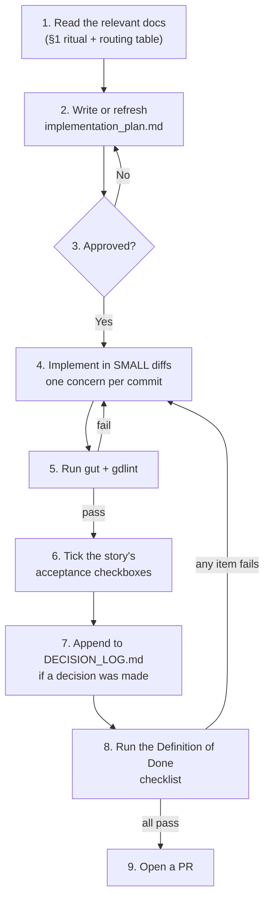

# Agent Playbook

> **Who this is for:** any AI agent working in this repository, and any human who wants to know
> what the agent is supposed to be doing. It is an operational document, not an essay.
>
> **The premise:** an agent starts every session with no memory of the last one. The corpus is
> built for that — every document restates its context and declares its `depends_on` chain. This
> playbook is the procedure that turns "no memory" into "no problem".

---

## 1. The context-recovery ritual

**On every fresh session, before touching anything, read exactly these four files:**

| # | File | Why |
|---|---|---|
| 1 | `/CLAUDE.md` | The six design laws, the never-do list, the routing table |
| 2 | `docs/00_meta/GLOSSARY.md` | Every term has exactly one meaning. Reading this removes guessing |
| 3 | `docs/50_tuning/TUNABLES.md` | Every number in the game, with its ID and rationale |
| 4 | The story file in `docs/40_backlog/stories/US-####-*.md` you were asked to implement | The acceptance criteria you will be judged against |

Then follow `/CLAUDE.md`'s routing table to the **one or two** documents governing the system you
are touching.

### 1.1 Do not read the whole corpus

It is ~200 000 words. Reading it all costs an enormous amount of context and buys almost nothing,
because each document is written to be readable on its own. **Read the `depends_on` chain of the
document you need, and stop.**

If you find yourself needing a fifth or sixth document, that is a signal the story is
under-specified — say so.

---

## 2. The mandatory loop



### 2.1 Step 2 — `implementation_plan.md`

Before writing code, write a plan at the repo root (gitignored) containing:

```markdown
# US-#### <title>

## What I read
- <the four ritual files>
- <the routing-table documents>

## What I am going to change
| File | New / modified | Why |

## Tunables involved
| TUN- ID | Current value | Am I changing it? (default: NO) |

## Tests I will write
| Test | Asserts |

## What I am NOT doing
<explicit scope boundaries — the things a reader might expect that are out of scope>

## Open questions
<anything the story does not answer. If this section is non-empty, ASK before implementing.>
```

**The "What I am NOT doing" section is the most valuable one.** Most agent scope creep is
invisible to the agent because it feels like being helpful.

### 2.2 Step 4 — small diffs

| Rule | Reason |
|---|---|
| One concern per commit | A commit that both adds a feature and reformats a file cannot be reviewed or reverted |
| Never mix a refactor with a behaviour change | If the behaviour breaks, nobody can tell which half did it |
| Never reformat a file you are not otherwise changing | `gdformat` runs on a pre-commit hook; formatting is never a review topic |
| Land incomplete work **inert**, not on a branch | Unregistered, unreferenced, or behind a `FeatureFlags` flag that names its removal story (ADR-0009) |

### 2.3 Step 5 — the gates

```bash
.ci/run_gut.sh test/unit unit
.ci/run_gut.sh test/arch arch
gdlint scripts/ test/ tools/
gdformat --check scripts/ test/ tools/
```

**If a test in `test/arch/` fails, do not weaken the test.** Those tests protect the
architecture, and every one of them exists because the thing it prevents is invisible in review.
A failing arch test means either your change is wrong or an ADR is needed — never that the test
is wrong.

### 2.4 Step 6 — tick the checkboxes

Story acceptance criteria are checkboxes. Tick them **in the same commit that makes them true**,
never in advance and never in a batch at the end. A ticked box that is not true is worse than an
unticked one, because it stops anyone from checking.

### 2.5 Step 7 — the decision log

Append one line to `docs/00_meta/DECISION_LOG.md` for any decision that:

- constrains how future features must be built,
- rejects an obvious alternative for a non-obvious reason,
- would make a reasonable engineer ask "why did they do it that way?" in six months.

If it also meets the ADR bar (`DECISION_LOG.md` header), write the ADR too.

---

## 3. The stop-and-ask rule

**Halt and ask rather than guessing when any of these is true.** Guessing here is not
resourceful; it is expensive, because the wrong guess is usually discovered several commits
later.

| # | Situation | Why you must stop |
|---|---|---|
| 1 | The work needs something outside `SCOPE_FENCE.md`'s IN list | Scope changes are the stakeholder's call, and the fence requires an ADR naming what is cut to pay for it |
| 2 | **Two documents contradict each other** | Do not pick one. The contradiction itself is the finding, and it needs recording |
| 3 | A change would alter a `TUN-` value | Tuning changes need a `TEL-` measurement justifying them (`GDD-07` §8.5), not an opinion |
| 4 | A change would alter any merged `SYS-`, `SCORE-`, `ABIL-`, `NET-` or `US-` ID | IDs are immutable once merged; renaming breaks every cross-reference in the corpus |
| 5 | A `test/arch/` test fails and the fix would be to weaken it | See §2.3 |
| 6 | The design intent is genuinely ambiguous **and** the readings imply materially different work | If the readings converge, pick one and note it. If they diverge, ask |
| 7 | You are about to violate a never-do item "just this once" | There is no just-this-once. Either it is wrong, or the rule needs an ADR |
| 8 | A story has no `SYS-` ID | You are building something the design does not describe |
| 9 | Implementing the story would require a new autoload, a new RPC, or a new pawn state | Each has a fixed inventory documented in the TDD; growing one is a design decision |
| 10 | You cannot make a change without exceeding 400 lines in a file | The limit is a design signal, not a style preference. The file wants splitting |

### 3.1 How to ask

State, in this order: **what you were doing**, **the specific ambiguity or conflict**, **the
options you see with their consequences**, and **your recommendation**. Then stop.

Do not ask open-ended questions ("how should I handle this?"). Do not ask questions you can
answer by reading one more document.

---

## 4. Working across sessions

### 4.1 Leaving a session

Before finishing, make sure the next session (which remembers nothing) can pick up:

- [ ] `implementation_plan.md` reflects what is actually done and what remains.
- [ ] Every partially-complete piece is either committed inert or noted in the plan.
- [ ] Story checkboxes match reality.
- [ ] `DECISION_LOG.md` has any decisions you made.
- [ ] The branch is pushed. Work that exists only locally does not exist.

### 4.2 Joining a session mid-story

1. Run the §1 ritual.
2. Read `implementation_plan.md` — it is the previous session's handoff.
3. Run the tests **before changing anything**, so you know the starting state.
4. `git log --oneline -20` on the branch, to see what was actually done rather than what was
   planned.

### 4.3 The drift check

`RISK-AGENT-DRIFT` is the risk that documentation and code diverge until the docs become
confidently wrong — worse than absent. Two mechanical defences, both of which are your
responsibility:

| Defence | What you do |
|---|---|
| `test_tuning_docs_sync.gd` | Never disable it. If it fails, the doc and the resource disagree, and one of them is a lie |
| The docs-sync DoD item | If your change makes a document wrong, fix the document **in the same commit**. Not in a follow-up |

---

## 5. Anti-patterns

Specific behaviours that look like good work and are not.

| Anti-pattern | Why it is harmful | Instead |
|---|---|---|
| **Helpfully expanding scope** | The story's acceptance criteria are the contract. Extra work is unreviewed work | Note it in "What I am NOT doing"; file a follow-up story |
| **Adding a `utils.gd`** | Unnamed grab-bags never shrink | A named static class in `scripts/core/` |
| **Caching a `Tuning` value** | Defeats hot reload, which is the balance loop's main tool | Read at point of use. The one exception is documented in ADR-0005 |
| **Predicting gameplay state "just for the HUD"** | It will drift, and a drifting HUD is worse than a lagging one | Read the mirror |
| **Weakening a test to make it pass** | Deletes the thing that would have caught the bug | Fix the code, or write an ADR |
| **Writing a comment that restates the code** | Noise. The next reader learns nothing | Comment *why*, never *what* |
| **"Temporarily" hardcoding a number** | It will not be temporary | `.tres` + a `TUN-` row. It is one line |
| **Fixing formatting in an unrelated file** | Pollutes the diff and hides the real change | Leave it; `gdformat` handles it |
| **Implementing an open question's "probably"** | Open questions are open because someone must decide | Ask, or implement the stated position and flag it |
| **Marking a doc `locked`** | No document passes `draft` until an implementation milestone has exercised it (ASM-0028) | Leave the status alone |

---

## 6. What good looks like

A completed story leaves behind:

- A small number of commits, each with one concern and a message explaining *why*.
- Tests that would have caught the bug the story was about, written **before or alongside** the
  fix.
- Zero new tunable literals; every number in a `.tres` with a `TUN-` row.
- Story checkboxes all ticked, each true.
- A `DECISION_LOG.md` line if anything was decided.
- Documentation updated in the same commit if the change made it wrong.
- No `test/arch/` test weakened, skipped or deleted.
- An `implementation_plan.md` that matches what was actually built.

---

## 7. Acceptance criteria for this document

- [ ] The §1 ritual names exactly four files, and all four exist.
- [ ] Every stop-and-ask condition in §3 is objective — a reader can tell whether it applies
      without judgement.
- [ ] The §2 loop matches the Definition of Done checklist with no contradictions.
- [ ] `implementation_plan.md` is in `.gitignore`.
- [ ] `test_claude_md_synced.gd` asserts `/CLAUDE.md` matches `CLAUDE.md_SEED.md`.
