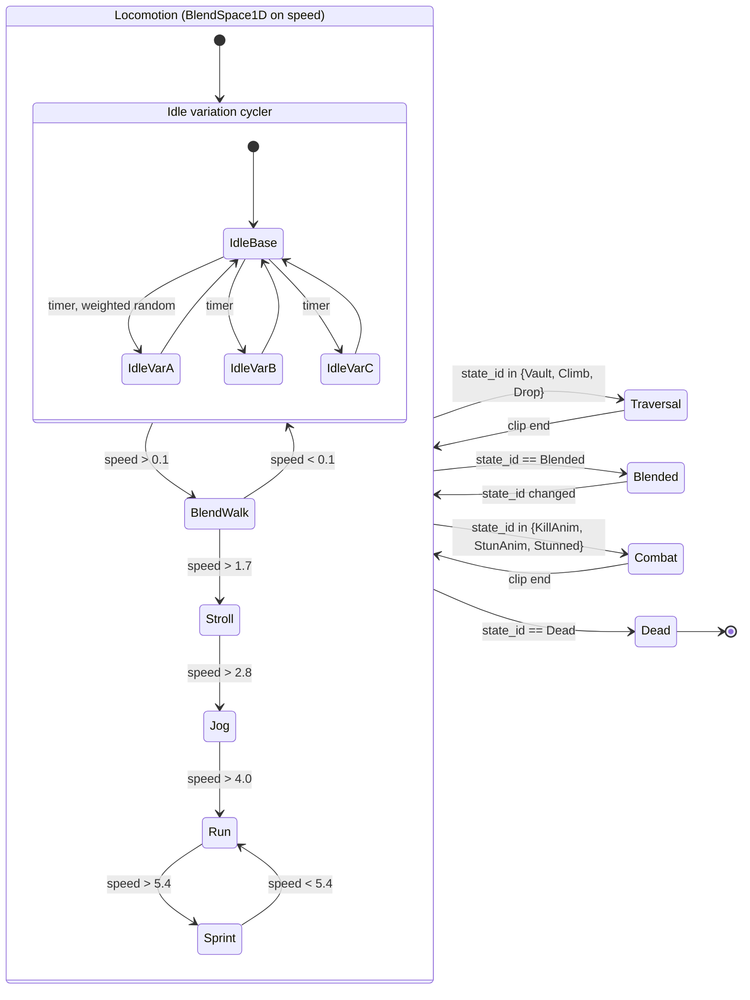

# Animation Specification

> **Context restated.** Project Sottovoce's core promise is that a player at blend-walk is
> indistinguishable from the 8–12 **clones** of their persona walking the same streets. That
> promise is delivered almost entirely by animation. The suspicion system, the crowd density,
> the render-state rule and the Compass's imprecision all exist to *support* it — and any one of
> them can be perfect while a single extra animation quietly destroys it.
>
> **The law this document exists to enforce:**
>
> > **Any animation a player can perform while Anonymous that their clones cannot is an
> > anonymity leak, and is a release blocker.**

---

## 1. The clone-parity boundary

The boundary is precise, and it is **not** "clones must do everything players do".

> **Parity is required for every animation reachable while Anonymous, and for nothing else.**

| Reachable while Anonymous | Parity required? | Why |
|---|---|---|
| Idle + all idle variations | **Yes, identical** | The state a player spends most of their life in |
| Blend-walk | **Yes, identical** | The safest movement in the game |
| Stroll | **Yes, identical** | The travel speed |
| Turn in place | **Yes, identical** | Happens constantly while scanning |
| All four blend-action idles | **Yes, identical** | These *are* clone behaviours; the player is imitating them |
| Jog, run, sprint | No | Already Noticed — anonymity is spent |
| Climb, vault, mantle, drop | No | Same |
| Kill, stun, ability casts | No | Explicitly non-civilian; the tell is the point |
| Death, respawn | No | |

**The boundary is exactly the suspicion cliff at `TUN-SPEED-STROLL` 2.2 m/s.** Anything free is
imitated; anything that costs is exposed. That correspondence is not a coincidence — it is the
same design fact expressed in two systems.

### 1.1 Why this is the most dangerous constraint in the project

Every other rule in the corpus fails *loudly*. This one fails **silently**:

> A designer adds a charming idle variation — the Vetraio wipes their hands on their apron. It
> ships. It is only on the player rig, because that is where the animator was working. Nothing
> breaks. No test fails. The crowd count is still 78. Suspicion still works.
>
> Three weeks later, skilled playtesters are picking humans out of crowds reliably and cannot
> articulate why. The design looks broken. The balance model looks wrong. The actual cause is
> one 40-frame clip.

That is why enforcement is automated (§6) rather than left to review — human review will miss
it, every time.

---

## 2. The parity set

`PersonaData.anonymous_clip_names` declares this list. Every entry must exist, identically
named, in both the player rig's `AnimationLibrary` and the clone's.

**14 clips per persona.**

| # | Clip ID | Duration | Loop | Notes |
|---|---|---|---|---|
| 1 | `ANIM-IDLE-BASE` | 3.2 s | ✅ | The default standing loop |
| 2 | `ANIM-IDLE-VAR-A` | 4.1 s | ✅ | Weight shift |
| 3 | `ANIM-IDLE-VAR-B` | 5.4 s | ✅ | Look around — **the one players most want to add to and must not** |
| 4 | `ANIM-IDLE-VAR-C` | 3.8 s | ✅ | Persona-specific gesture (see §2.1) |
| 5 | `ANIM-TURN-L` | 0.7 s | ❌ | In-place turn, > 45° |
| 6 | `ANIM-TURN-R` | 0.7 s | ❌ | |
| 7 | `ANIM-BLENDWALK-LOOP` | 1.15 s | ✅ | **Stride cycle. Must match NPC stroll exactly** |
| 8 | `ANIM-BLENDWALK-START` | 0.35 s | ❌ | |
| 9 | `ANIM-BLENDWALK-STOP` | 0.40 s | ❌ | |
| 10 | `ANIM-STROLL-LOOP` | 0.78 s | ✅ | |
| 11 | `ANIM-BLEND-SIT` | 2.6 s | ✅ | Bench blend action |
| 12 | `ANIM-BLEND-LEAN` | 3.1 s | ✅ | Stall-counter blend action |
| 13 | `ANIM-BLEND-STAND` | 3.4 s | ✅ | Crowd-pocket blend action |
| 14 | `ANIM-BLEND-GROUP` | 1.15 s | ✅ | Walking-group formation walk. **Shares timing with `ANIM-BLENDWALK-LOOP`** |

### 2.1 Per-persona gesture (`ANIM-IDLE-VAR-C`)

Each persona has **one** distinctive idle gesture, and it exists on the clone rig too:

| Persona | Gesture |
|---|---|
| Vetraio | Inspects a pane held to the light |
| Cantatrice | Adjusts a sleeve, hums |
| Lucerna | Trims a wick |
| Pesatore | Checks a ledger |

**This is the only place persona-specific animation is permitted inside the parity set**, and it
is permitted precisely because the clones have it. It is also what makes crowd pockets read as a
market rather than a queue.

### 2.2 The stride-cycle constraint

`ANIM-BLENDWALK-LOOP` is **1.15 s**, and this number is load-bearing in two directions:

| Depends on it | Why |
|---|---|
| `TUN-SPEED-BLENDWALK` = `TUN-CROWD-NPC-SPEED-STROLL` = 1.4 m/s | TUNABLES invariant §17.1. If the *speeds* match but the *stride cycles* differ, a player is identifiable by gait — foot-plant timing is extremely visible in peripheral vision |
| `TUN-COMPASS-LOCK-FILL-TIME` 1.6 s | Deliberately **longer** than one stride cycle, so a lock cannot complete through the incidental gaps in a walking group ([`../10_gdd/03_social_stealth.md`](../10_gdd/03_social_stealth.md) §8.4) |

Changing the stride cycle therefore changes the Compass lock's behaviour. It is a tunable-class
number living in an animation, which is unusual and worth flagging in the clip's metadata.

---

## 3. The full animation list

Beyond the parity set. These are player-only and need no clone equivalent.

### 3.1 Locomotion

| Clip | Duration | Loop | State | Root motion |
|---|---|---|---|---|
| `ANIM-JOG-LOOP` | 0.62 s | ✅ | Jog | ❌ |
| `ANIM-RUN-LOOP` | 0.54 s | ✅ | Run | ❌ |
| `ANIM-SPRINT-LOOP` | 0.44 s | ✅ | Sprint | ❌ |
| `ANIM-BACKPEDAL-LOOP` | 0.95 s | ✅ | any, moving backward | ❌ |

### 3.2 Traversal

| Clip | Duration | Loop | Matches tunable | Root motion |
|---|---|---|---|---|
| `ANIM-VAULT` | **0.55 s** | ❌ | `TUN-TRAVERSE-VAULT-DURATION` | ✅ |
| `ANIM-MANTLE` | **0.95 s** | ❌ | `TUN-TRAVERSE-MANTLE-DURATION` | ✅ |
| `ANIM-CLIMB-LOOP` | 1.0 s | ✅ | speed from `TUN-SPEED-CLIMB` | ❌ |
| `ANIM-CLIMB-MOUNT` | 0.5 s | ❌ | | ✅ |
| `ANIM-CLIMB-TOP` | 0.8 s | ❌ | | ✅ |
| `ANIM-DROP-FALL` | — | ✅ | | ❌ |
| `ANIM-DROP-LAND-SOFT` | 0.35 s | ❌ | ≤ `TUN-TRAVERSE-DROP-SAFE-HEIGHT` | ❌ |
| `ANIM-DROP-LAND-HARD` | **0.80 s** | ❌ | `TUN-TRAVERSE-DROP-STAGGER` | ❌ |
| `ANIM-LEDGE-GRAB` | 0.4 s | ❌ | | ✅ |

### 3.3 Combat and abilities

| Clip | Duration | Matches tunable | Notes |
|---|---|---|---|
| `ANIM-KILL` | **1.40 s** | `TUN-KILL-ANIM-DURATION` | **Contact frame at 0.90 s** = `TUN-KILL-CORPSE-SPAWN-DELAY`. See §4.1 |
| `ANIM-KILL-VICTIM` | 1.40 s | | Victim's paired reaction |
| `ANIM-KILL-WHIFF` | 0.7 s | | **Must exist.** A rejected kill is never silence |
| `ANIM-STUN-DELIVER` | **0.70 s** | `TUN-STUN-ANIM-DURATION` | |
| `ANIM-STUN-RECEIVE` | **4.00 s** | `TUN-STUN-FREEZE` | Held, then recovery |
| `ANIM-STUN-INVALID` | **2.00 s** | `TUN-STUN-INVALID-STAGGER` | Deliberately graceless — flailing should look like flailing |
| `ANIM-CINDERFALL-THROW` | **0.45 s** | `TUN-CINDERFALL-CAST-TIME` | |
| `ANIM-WHISPERBOLT-WINDUP` | **1.00 s** | `TUN-WHISPERBOLT-WINDUP` | **The most important tell in the game.** Static, unmistakable throwing pose |
| `ANIM-WHISPERBOLT-RELEASE` | 0.3 s | | |
| `ANIM-SECONDFACE-MORPH-IN` | **0.80 s** | `TUN-SECONDFACE-CAST-TIME` | |
| `ANIM-SECONDFACE-MORPH-OUT` | **0.60 s** | `TUN-SECONDFACE-BREAK-TELL-DURATION` | Fires at a moment the player did not choose — **the more important of the two** |
| `ANIM-LUNGE-WINDUP` | **0.25 s** | `TUN-LUNGE-WINDUP` | |
| `ANIM-LUNGE-DASH` | 0.67 s | derived | |
| `ANIM-LUNGE-WHIFF` | **1.20 s** | `TUN-LUNGE-WHIFF-STAGGER` | |
| `ANIM-DEATH` | 1.2 s | | Into the corpse pose |
| `ANIM-BUMP-REACT` | 0.4 s | | **NPC clip.** The visible tell of an NPC bump |
| `ANIM-STARTLE-FLEE` | 0.5 s | | **NPC clip** |
| `ANIM-GAWK` | 4.0 s | | **NPC clip**, looping |

**Bold durations are driven by a tunable and must match it.** `test_anim_durations_match_tunables.gd`
asserts every one, because an animation that outlasts its tunable produces a window where the
player is visually committed but mechanically free — which reads as the game being unresponsive.

---

## 4. Root-motion policy

> **Root motion is used for traversal only. Never for locomotion, never for combat.**

| Category | Root motion | Reason |
|---|---|---|
| Locomotion (walk, stroll, jog, run, sprint) | **❌ Never** | Speed comes from `MovementTuning`, and prediction replays that integration. Root motion would make the *animation* authoritative over position, which would diverge between server and client |
| Traversal (vault, mantle, climb mount/top, ledge grab) | **✅ Yes, for placement** | These are fixed-displacement manoeuvres against static geometry. Root motion gives exact foot and hand placement *within* a displacement the simulation decides — see §4.2 |
| Combat (kill, stun, abilities) | **❌ Never** | The killer must remain exactly where the server says. A kill animation that moved the killer would need lag-compensated reconciliation of the animation itself |
| Death | ❌ | Corpse position is server-authoritative |

### 4.0 Which layer owns position — clarified in US-0019

"The displacement is identical on every peer because the geometry is" is true of the geometry
and not automatically of the *clip*. An animation advanced by frame time, on a client that is
interpolating, is not the same source of truth as one advanced by tick count on a headless
server — and pawn position is replayed during reconciliation, where anything frame-driven
diverges (TDD-03 §3.1).

**So the simulation owns position and the animation is matched to it.**
`TraversalResolver.plan()` commits a start, a target and an arc peak once, at the instant of the
press, from that tick's probe reading; the traversal state interpolates them by tick. Root
motion aligns hands and feet *within* that displacement rather than deciding it.

This does not relax §4's table. Root motion still appears on traversal clips and nowhere else,
for exactly the reason given: those manoeuvres are fixed displacements against static geometry.
It says which layer is authoritative when the two disagree, which the table did not.

### 4.1 The kill animation's contact frame

`ANIM-KILL` is 1.40 s with its **contact frame at 0.90 s**. That is not an art decision — it is
`TUN-KILL-CORPSE-SPAWN-DELAY`, and three systems read it:

| System | Uses it for |
|---|---|
| `SYS-KILL` | When the victim actually dies and the corpse spawns |
| `SYS-PAWN` | `KillAnim.is_interruptible()` returns false **after** this frame — a last-second stun is a genuine save before it and cosmetic after |
| `SYS-CROWD` | When the Startle wave and Gawk tokens fire |

**If the animator moves the contact frame, gameplay changes.** The clip's metadata must carry a
comment saying so, and `test_anim_durations_match_tunables.gd` covers it.

---

## 5. The state machine graph

Mirrors the pawn state machine ([`../10_gdd/02_player_controller.md`](../10_gdd/02_player_controller.md) §3)
but is **driven by it**, never the reverse. The `AnimationTree` reads `PawnContext.state_id`; it
never decides a state.

### 5.1 The idle cycler runs identically on clones

The weighted-random idle variation cycler is **the same node graph with the same weights** on the
player rig and the clone rig, seeded per-instance. If players cycled variations on a different
schedule from clones — even with the same clips — the *rhythm* would be a discriminator.

This is the subtlest form of the parity failure and the one most likely to be introduced by
someone "improving" the player's idle feel.

---

## 6. Blend times

| Transition | Blend | Reason |
|---|---|---|
| Within locomotion (`BlendSpace1D`) | continuous | Speed-driven |
| Idle ↔ blend-walk | 0.18 s | |
| Locomotion → traversal | 0.10 s | Snappy — traversal must feel immediate |
| Traversal → locomotion | 0.15 s | |
| Locomotion → combat | **0.05 s** | Near-instant. The kill and stun tells must not be softened by a blend |
| Combat → locomotion | 0.20 s | |
| Any → `Blended` | 0.35 s | = `TUN-BLEND-ENTRY-TIME`; the transition is visibly a commitment |
| `Blended` → any | 0.30 s | = `TUN-BLEND-EXIT-TIME` |
| Any → death | 0.08 s | |

**Combat transitions are 0.05 s deliberately.** `TUN-FEEL-INPUT-TO-ANIM-MAX` is 80 ms total, and
a generous blend would consume most of it. The tell must start on the frame the ability does.

---

## 7. The clone-parity enforcement mechanism

Four independent layers. Four, because a single check gets deleted eventually by someone who does
not know why it exists.

| # | Layer | Catches | Where |
|---|---|---|---|
| 1 | **Data** — `PersonaData.anonymous_clip_names` | Authoring drift | `data/personas/*.tres` |
| 2 | **Test** — `test_clone_animation_parity.gd` | A player animation with no clone equivalent | CI, every push |
| 3 | **Runtime assert (debug)** — on entering an Anonymous-reachable state, assert the clip played is in the parity set | A state playing an off-list clip | Debug builds |
| 4 | **Director** — `TUN-CROWD-CLONE-LOCAL-MIN` 2 clones of each in-use persona within 25 m | **Local depletion** — global sufficiency with a local hole | `CrowdDirector` |

### 7.1 The parity table

Generated from `PersonaData` and asserted by layer 2. This is the artefact an animator checks
against.

| Player clip | Clone clip | Vetraio | Cantatrice | Lucerna | Pesatore |
|---|---|---|---|---|---|
| `ANIM-IDLE-BASE` | same | ✅ | ✅ | ✅ | ✅ |
| `ANIM-IDLE-VAR-A` | same | ✅ | ✅ | ✅ | ✅ |
| `ANIM-IDLE-VAR-B` | same | ✅ | ✅ | ✅ | ✅ |
| `ANIM-IDLE-VAR-C` | same | ✅ | ✅ | ✅ | ✅ |
| `ANIM-TURN-L` / `-R` | same | ✅ | ✅ | ✅ | ✅ |
| `ANIM-BLENDWALK-LOOP` | same | ✅ | ✅ | ✅ | ✅ |
| `ANIM-BLENDWALK-START` / `-STOP` | same | ✅ | ✅ | ✅ | ✅ |
| `ANIM-STROLL-LOOP` | same | ✅ | ✅ | ✅ | ✅ |
| `ANIM-BLEND-SIT` | same | ✅ | ✅ | ✅ | ✅ |
| `ANIM-BLEND-LEAN` | same | ✅ | ✅ | ✅ | ✅ |
| `ANIM-BLEND-STAND` | same | ✅ | ✅ | ✅ | ✅ |
| `ANIM-BLEND-GROUP` | same | ✅ | ✅ | ✅ | ✅ |
| *(everything in §3)* | **none required** | — | — | — | — |

### 7.2 Adding an animation — the checklist

- [ ] Is it reachable while **Anonymous**? If yes, **it must be authored on the clone rig in the
      same commit**, and added to `anonymous_clip_names`.
- [ ] If its duration is driven by a `TUN-` value, does it match exactly?
- [ ] Does it need root motion? (Traversal only — §4.)
- [ ] Does it have a blend time in §6?
- [ ] Does it change a contact frame any system reads? (§4.1)
- [ ] Run `test_clone_animation_parity.gd` and `test_anim_durations_match_tunables.gd`.

---

## 8. MVP scope

Deliberately bounded, and the bound falls out of §1 rather than from a budget:

| Set | Clips | × personas | Total |
|---|---|---|---|
| Parity set (§2) | 14 | 4 | **56** |
| Locomotion (§3.1) | 4 | 4 | 16 |
| Traversal (§3.2) | 9 | 4 | 36 |
| Combat + abilities (§3.3, player) | 15 | 4 | 60 |
| NPC-only (bump, startle, gawk) | 3 | 9 archetypes | 27 |
| **Total** | | | **~195 clips** |

**The parity set is the expensive half in practice**, because those 56 clips must exist twice
(player rig and clone rig) and must match. That is the real cost of the anonymity promise, and it
is worth knowing before anyone proposes a fifth persona: **+14 clips × 2 rigs, minimum.**

MVP quality bar (per `SCOPE_FENCE` §5): blends may pop, timing may be rough. **Clone parity may
not be rough** — it is the one animation property with no acceptable MVP-quality degradation.

---

## 9. Acceptance criteria

- [ ] `PersonaData.anonymous_clip_names` lists exactly the §2 clips for all four personas.
- [ ] `test_clone_animation_parity.gd` passes for all four personas.
- [ ] `test_anim_durations_match_tunables.gd` passes for every bold duration in §3.
- [ ] `ANIM-KILL`'s contact frame is at `TUN-KILL-CORPSE-SPAWN-DELAY`, verified in the clip metadata.
- [ ] `ANIM-BLENDWALK-LOOP` stride cycle is identical on player and clone rigs.
- [ ] The idle-variation cycler graph and weights are identical on both rigs.
- [ ] Root motion appears only on traversal clips (`test_root_motion_policy.gd`).
- [ ] `ANIM-KILL-WHIFF` exists — a rejected kill is never silence.
- [ ] The `AnimationTree` reads `state_id` and never writes it.
- [ ] Debug builds assert that Anonymous-state clips are in the parity set.

---

## 10. Open questions

| # | Question | Position | Needed by |
|---|---|---|---|
| 1 | Should the four blend-action idles be persona-specific, or shared across personas? Shared quarters the cost (4 clips instead of 16) but makes a blending player's *pose* identical regardless of persona — which is fine, since clones would share it too. | **Shared for MVP.** Revisit only if it reads as robotic in a dense pocket | M3 |
| 2 | `ANIM-BLENDWALK-LOOP`'s 1.15 s stride cycle is a gameplay-relevant number living in an animation, and `TUN-COMPASS-LOCK-FILL-TIME` is tuned against it. Should it be a tunable that the animation is authored to match? | Yes in principle, but Godot has no clean way to retime a clip from a resource. For now: flag it in the clip metadata and cover it with a test | M3 |
| 3 | Does animation LOD ([`../20_tdd/08_crowd_system.md`](../20_tdd/08_crowd_system.md) §4.2) risk breaking parity at band boundaries — a Mid-band clone using a reduced blend tree while a Near-band player uses the full one? | **Real risk.** The mitigation is that LOD must never change silhouette or gait inside `TUN-COMPASS-RANGE-MAX`, asserted by `test_anim_lod_silhouette.gd`. Worth re-measuring at M3 with real clips | M3 |
| 4 | Should players see their *own* character with the full idle-variation set, or a reduced one, given they are looking at their own back constantly? | Full set, identical. Any divergence between what you see of yourself and what others see of you is a bug factory | — |
