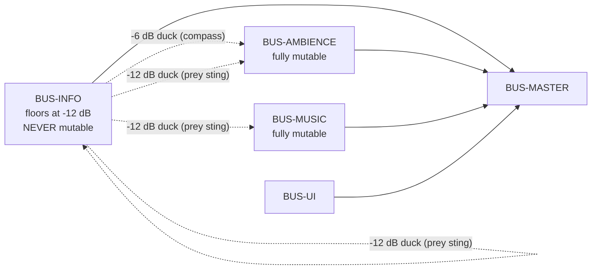

# Audio Bible

> **Context restated.** In Project Sottovoce, sound is not atmosphere with gameplay layered on
> top — it is a **primary information channel**. The Compass pulse is how you hunt. The prey
> warning is how you survive. Footsteps are the one channel in the entire information economy
> that **cannot be blocked**, only muffled. Players at blend-walk must be audibly
> indistinguishable from the NPC clones around them.
>
> **The structural decision this document is built on:** every sound is either **information** or
> **atmosphere**, they are routed to separate buses, and a player who mutes atmosphere entirely
> loses **zero** gameplay information.

---

## 1. The information / atmosphere split

| | **Information** | **Atmosphere** |
|---|---|---|
| Definition | Carries a fact a player can act on | Carries mood only |
| Bus | `BUS-INFO` | `BUS-AMBIENCE`, `BUS-MUSIC` |
| Mutable by the player? | **No** — slider floors at −12 dB | **Yes, fully** |
| Ducks for anything? | Only higher-priority information | Ducks for all information |
| Has a caption? | **Yes, mandatory** | No |
| Examples | Compass pulse, prey sting, ability tells, footsteps, tier transitions, score stings | Crowd murmur, furnace roar, water, bells, wind, music |

### 1.1 The guarantee

> **A player who mutes ambience and music entirely loses no gameplay information whatsoever.**

That is an accessibility requirement and a competitive-integrity one: nobody should gain an
advantage by turning the atmosphere off, and nobody should have to endure it to stay competitive.

`test_no_captioned_events_on_atmosphere_buses.gd` asserts no event flagged `Cap` is routed to
`BUS-AMBIENCE` or `BUS-MUSIC` — which is the mechanical form of the guarantee.

### 1.2 The rejected feature that defines the split

**Ambient NPC dialogue barks** were proposed for atmosphere and rejected
([`../10_gdd/01_vision.md`](../10_gdd/01_vision.md) §2, Law 2). They generate audio carrying no
information, competing for attention with audio that does. In a game where sound is a primary
channel, atmospheric sound is not neutral — **it is noise on the wire.**

---

## 2. The diegetic / non-diegetic split

A second, independent axis. A sound can be information *and* diegetic (footsteps), or information
*and* non-diegetic (the Compass pulse).

| | Diegetic — exists in the world | Non-diegetic — exists only for you |
|---|---|---|
| Heard by others? | **Yes** — this is what makes it diegetic | No |
| Occluded by geometry? | Yes | No |
| Examples | Footsteps, startle cries, Cinderfall crack, Lunge shout, gawk murmur, furnace, bells | Compass pulse, prey sting, tier transitions, score stings, music |
| Rule | If another player can hear it, it is a **public information channel** and needs a row in the master table ([`../10_gdd/03_social_stealth.md`](../10_gdd/03_social_stealth.md) §11.1) | If only you can hear it, it must be about **you** |

### 2.1 The load-bearing consequence

**The Compass pulse is non-diegetic**, so a hunter's Compass never gives them away.

If it were audible to others, standing near a hunter would reveal them — converting the Compass
from a private instrument into a public liability, and breaking the information economy in a way
that is very hard to see coming. Worth stating explicitly because "the Compass ticks, so it
should be audible in the world" is an intuitive and completely wrong instinct.

---

## 3. Bus architecture



### 3.1 Ducking priority

Highest first. A higher-priority sound ducks everything below it.

| # | Sound | Ducks | Amount |
|---|---|---|---|
| 1 | `SFX-WARN-PREY-STING` | **Everything, including other information** | `TUN-AUDIO-STING-DUCK` −12 dB |
| 2 | `SFX-TIER-EXPOSED` | Ambience, music | −8 dB |
| 3 | `SFX-COMPASS-PULSE` | Ambience, music | `TUN-AUDIO-COMPASS-DUCK` −6 dB |
| 4 | All other information | Ambience | −4 dB |
| 5 | Ambience | — | — |
| 6 | Music | — | — |

**The prey sting is the only sound permitted to duck other information.** It is the single most
important sound in the game, and a player receiving it simultaneously with three score-feed
stings must still hear it.

### 3.2 The compass-pulse ducking exception

Below ~0.30 s period (inside ~2 m), per-tick ducking would make ambience audibly pump at 3+ Hz.
Above that rate the duck smooths to a sustained −4 dB instead.

---

## 4. The audio event table

Full table in [`../10_gdd/06_ui_audio.md`](../10_gdd/06_ui_audio.md) §6. Reproduced here as the
**authoring reference** — what each sound must *be*, rather than when it fires.

**Legend** — *D* diegetic · *Cap* captioned · *R* audible radius.

### 4.1 Compass and detection — `BUS-INFO`

| ID | D | Cap | R | Character |
|---|---|---|---|---|
| `SFX-COMPASS-PULSE` | ✗ | ✓ | — | **Short, dry, pitched tick.** Closer to a metronome or a fingernail on glass than a musical tone. Pitch rises a perfect fifth across the full range — *redundant with cadence, never the carrier* |
| `SFX-COMPASS-LOCK-FILL` | ✗ | ✓ | — | Rising sustained tone, tracks fill fraction |
| `SFX-COMPASS-LOCK-COMPLETE` | ✗ | ✓ | — | Resolves the fill tone. Satisfying — it is the hardest skill in the game paying off |
| `SFX-COMPASS-LOCK-BREAK` | ✗ | ✓ | — | **Deliberately unpleasant.** A broken lock cost 1.6 s of standing still |
| `SFX-CONTRACT-ASSIGNED` | ✗ | ✓ | — | Unmistakable. Failure mode 18 in GDD-03 is players not noticing reassignment |
| `SFX-WARN-PREY-STING` | ✗ | ✓ | — | §5 |

### 4.2 Suspicion

| ID | D | Cap | R | Character |
|---|---|---|---|---|
| `SFX-TIER-NOTICED` | ✗ | ✓ | — | Short, low, unobtrusive. Noticed is transient |
| `SFX-TIER-EXPOSED` | ✗ | ✓ | — | **The full "exposed" motif** (§6) + screen vignette |
| `SFX-TIER-CLEARED` | ✗ | ✓ | — | Release. The sound of safety |

### 4.3 Kill and stun

| ID | D | Cap | R | Character |
|---|---|---|---|---|
| `SFX-KILL-INITIATE` | ✓ | ✓ | 12 m | Cloth and breath. A kill is a **public event** |
| `SFX-KILL-CONTACT` | ✓ | ✓ | 15 m | |
| `SFX-KILL-WHIFF` | ✓ | ✓ | 10 m | **Must never be silence.** A rejected kill that makes no sound reads as a bug |
| `SFX-STUN-SUCCESS` | ✓ | ✓ | **18 m** | The loudest non-ability event. A stun is a **public humiliation** |
| `SFX-STUN-INVALID` | ✓ | ✓ | 10 m | **Deliberately comic.** Flailing should sound like flailing |
| `SFX-STUN-RECEIVED` | ✗ | ✓ | — | Muffled, dulled — the audio equivalent of losing camera control |

### 4.4 Abilities — each is a **tell**

| ID | D | Cap | R | Character |
|---|---|---|---|---|
| `SFX-CINDERFALL-BURST` | ✓ | ✓ | **25 m** | Sharp crack. The tell |
| `SFX-WHISPERBOLT-DRAW` | ✓ | ✓ | 14 m | **Rising metallic draw across the full 1.0 s.** Must telegraph *duration*, not just occurrence |
| `SFX-WHISPERBOLT-MISS` | ✓ | ✓ | 12 m | Blade on stone — **distinct from impact**, so bystanders learn the outcome |
| `SFX-SECONDFACE-MORPH-IN` | ✓ | ✓ | 8 m | Soft cloth rush. **The quietest tell in the game, deliberately** |
| `SFX-SECONDFACE-MORPH-OUT` | ✓ | ✓ | 8 m | The more important of the two — fires at a moment the player did not choose |
| `SFX-LUNGE-WINDUP` | ✓ | ✓ | **20 m** | Sharp intake. 0.25 s to warn a defender |

### 4.5 Movement — §7

### 4.6 Crowd

| ID | D | Cap | R | Character |
|---|---|---|---|---|
| `SFX-NPC-BUMP` | ✓ | ✓ | 12 m | Captioned: it is a public tell worth +15 suspicion |
| `SFX-CROWD-STARTLE` | ✓ | ✓ | **30 m** | Layered cries. **The loudest diegetic event in the game** |
| `SFX-CROWD-GAWK-MURMUR` | ✓ | ✓ | 20 m | Rising murmur — **audible before the cluster is visible** |

### 4.7 Score

| ID | Character |
|---|---|
| `SFX-SCORE-BONUS-LARGE` | **Pitched up per position in a stack, so a four-bonus kill *ascends*.** The most satisfying sound in the game and the cheapest to build |
| `SFX-SCORE-PENALTY` | Must not read as a small positive |

---

## 5. The prey warning sting

The single most important sound in the game.

| Property | Specification |
|---|---|
| Character | The "exposed" motif's first two notes, **inverted (rising)** — related but distinct, so a player distinguishes "I am exposed" from "someone near me is" without conscious effort |
| Texture | Short, dry, close-miked. It should feel like it happened **inside your head**, not in the district |
| Ducking | −12 dB on everything, including other information |
| **Positional?** | **NO.** Mono, centred, authored and routed as such |
| Caption | `⚠ You are being hunted` — **no direction**, matching the audio exactly |

### 5.1 Why the mono requirement gets its own test

`TUN-COMPASS-WARN-GIVES-DIRECTION` is `false`. The panicked scan of a crowd — not knowing which
of eleven figures is looking back — is the best moment in the game.

Rendering this sting positionally would hand over the direction the design deliberately
withholds, and it is **the easiest rule in the corpus to break by accident**: attaching an
`AudioStreamPlayer3D` instead of an `AudioStreamPlayer` is a one-word mistake that silently
deletes a core design property.

Hence three layers of enforcement:

| Layer | Mechanism |
|---|---|
| Protocol | `NET-S2C-PREY-WARNING` carries a tick and nothing else |
| Signal | `prey_warning_triggered()` takes zero parameters |
| Audio | `test_prey_sting_nonpositional.gd` asserts the emitter has no 3D position component |

---

## 6. The "you are exposed" motif

A three-note descending figure, used in **exactly three places and nowhere else**, so that it
acquires a single unambiguous meaning.

| Where | Variant |
|---|---|
| `SFX-TIER-EXPOSED` | Full motif, non-diegetic, + vignette |
| `SFX-WARN-PREY-STING` | First two notes, **inverted** |
| `MUS-STEM-EXPOSED` | The motif as a sustained bass figure |

Everything else uses unrelated material.

> **A motif that means one thing is worth more than five motifs that mean nothing.**

---

## 7. Footsteps — the unblockable channel

Footsteps are the one information channel geometry cannot stop, only muffle. Their radius by
speed is **the speed ladder restated in a second currency**.

| Speed | Radius | × blend-walk |
|---|---|---|
| Blend-walk | 4 m | 1.0× |
| Stroll | 6 m | 1.5× |
| Jog | 10 m | 2.5× |
| Run | 14 m | 3.5× |
| **Sprint** | **18 m** | **4.5×** |

### 7.1 Materials

| Material | Zones | Character |
|---|---|---|
| `MAT-STONE` | Piazza del Vetro, Loggia, Piazza Secca | Bright, clear, long-carrying |
| `MAT-GRAVEL` | Via delle Lampe, Fondaco yards | Crunchy, very legible at speed |
| `MAT-WOOD` | Bridges, stall platforms, balconies | Hollow, resonant — **the loudest material**, so the Ponte Corto crossing is *audibly* a commitment |
| `MAT-TILE` | Roof stratum | Sharp, brittle, occasional slip — **a roof runner is audible from the street below** |
| `MAT-WATER` | Canal steps, fountain | Splash. Rare, therefore highly identifying |

### 7.2 The parity requirement

> **NPC footsteps use the same clips, the same radii and the same stride timing as players.**

They must, or a player at blend-walk would be *audibly* distinguishable from the clones around
them — an audio anonymity leak exactly equivalent to the animation-parity constraint, and just as
invisible to review.

`test_footstep_parity.gd` asserts identical clips and radii per speed.

This also means the blend-walk footstep interval is locked to `ANIM-BLENDWALK-LOOP`'s 1.15 s
stride cycle. A third system now depends on that number.

---

## 8. Crowd ambience layers — `BUS-AMBIENCE`

Four layers, each driven by **actual NPC counts**, so ambience honestly reflects density rather
than painting a zone mood.

| Layer | Driven by | Content |
|---|---|---|
| `AMB-CROWD-NEAR` | NPCs within **6 m** (= `TUN-SUSPICION-OPEN-RADIUS`) | Close murmur, cloth, footfalls |
| `AMB-CROWD-MID` | NPCs within 25 m | Market hubbub, carts |
| `AMB-ZONE` | Current zone | Furnace roar, water, arcade reverb |
| `AMB-DISTRICT` | Always | **Quarter-hour bells** (a diegetic match clock), gulls, distant city |

### 8.1 `AMB-CROWD-NEAR` is quietly informational

It rises and falls with exactly the quantity governing the open-ground suspicion source, so a
player can *hear* whether they are alone.

It is nonetheless routed to `BUS-AMBIENCE`, because the tier indicator already carries that
information explicitly — and the guarantee "muting ambience loses nothing" is worth more than the
redundancy. Flagged as an open question in
[`../10_gdd/06_ui_audio.md`](../10_gdd/06_ui_audio.md) §10.2.

---

## 9. Occlusion

Deliberately simple. Complexity buys realism, and realism is not what this game needs from audio.

```
for each diegetic source:
    if raycast(listener, source) hits world geometry:
        low-pass at TUN-AUDIO-OCCLUSION-LOWPASS (900 Hz), -6 dB
    if inside an active Cinderfall volume:
        -3 dB                       # the cloud muffles, never silences
    # NPCs never occlude audio
```

| Rule | Reason |
|---|---|
| One raycast per source, no portals | Frame budget, and the precision would not change a single player decision |
| **NPCs do not occlude** | Matches the line-of-sight rule. The crowd hides you by being **confusing**, never **solid** — in vision or in sound |
| Occlusion muffles, never silences | Footsteps are the floor of the information economy; full occlusion removes the floor |
| Non-diegetic is never occluded | It is not in the world |

---

## 10. Music — `BUS-MUSIC`

Four stems, always playing, cross-faded by state. A **stem** system, not a cue system: the
driving state (own suspicion tier) can change several times in ten seconds, and any transition
longer than the state's dwell time would desynchronise the music from the game.

| Stem | Active when | Content |
|---|---|---|
| `MUS-STEM-BASE` | Always | Sparse plucked strings, near-ambient. The district's own music |
| `MUS-STEM-NOTICED` | Own tier = Noticed | One sustained low string. **Barely a change** — Noticed is transient and should not be dramatised |
| `MUS-STEM-EXPOSED` | Own tier = Exposed | The motif as a sustained bass figure + rhythmic pulse |
| `MUS-STEM-FINALPHASE` | Final Contract | Full ensemble, faster. **Replaces** rather than layers |

Cross-fade **0.8 s in, 1.6 s out** — fast to arrive, slow to leave, so tension outlasts its cause.
Constant tempo and key across all stems so they layer without alignment work. 32-bar loops,
sample-aligned.

### 10.1 What music is deliberately not keyed to

| Not keyed to | Why |
|---|---|
| Compass proximity | The Compass already carries proximity precisely. Doubling it would be redundant or — worse — a second, less precise proximity channel players might trust |
| Other players' states | Music must never leak information about anyone but you |
| Kills anywhere on the map | A global kill feed by another route |
| **Being hunted** | Tempting and rejected: it would be a permanent, free, directionless proximity sensor, gutting the 15 m prey warning |

> **Music reacts to your own suspicion tier and the match phase. Nothing else. Both are things
> you already know.**

---

## 11. MVP audio standards

Per [`../00_meta/SCOPE_FENCE.md`](../00_meta/SCOPE_FENCE.md) §5: one sound per event, no variation
layers, no reverb zones. Placeholder tones generated procedurally in-engine, so
[`../00_meta/ASSET_LICENSES.md`](../00_meta/ASSET_LICENSES.md) stays empty.

**What may not be placeholder-quality:**

| Must be right in MVP | Why |
|---|---|
| Compass pulse character | Heard ~1 500 times per match. If it fatigues, players mute the game — and it is unmutable |
| Prey sting **mono routing** | A design property, not a polish item |
| Footstep radii and **parity** | Gameplay values and an anonymity leak respectively |
| The information/atmosphere bus split | The accessibility guarantee depends on it |
| Captions on every `Cap` event | Same |

---

## 12. Acceptance criteria

- [ ] Every event in §4 exists with its stated bus, diegetic flag, caption flag and radius.
- [ ] `BUS-INFO` cannot be muted; its slider floors at −12 dB.
- [ ] **With ambience and music muted, no gameplay information is lost** — verified manually and by `test_no_captioned_events_on_atmosphere_buses.gd`.
- [ ] `SFX-WARN-PREY-STING` is mono/centred with no 3D emitter (`test_prey_sting_nonpositional.gd`).
- [ ] Player and NPC footsteps use identical clips and radii (`test_footstep_parity.gd`).
- [ ] Blend-walk footstep interval matches `ANIM-BLENDWALK-LOOP`'s stride cycle.
- [ ] The "exposed" motif appears in exactly three places.
- [ ] Ducking follows the §3.1 priority order.
- [ ] `SFX-KILL-WHIFF` exists and plays on every rejected kill.
- [ ] NPCs never occlude audio.
- [ ] Music stems key only to own tier and match phase (`grep` finds no other-player reference in the music controller).
- [ ] Every `Cap` event emits `EVT-CAPTION` on the same frame as the sound.

---

## 13. Open questions

| # | Question | Position | Needed by |
|---|---|---|---|
| 1 | Will the Compass pulse fatigue at ~1 500 repetitions per match? | The tick must be dry and short — no tail, no resonance, no pitch bend. Test with two consecutive matches, not one | M4 |
| 2 | Should `AMB-CROWD-NEAR` be reclassified as information? It is genuinely actionable. | Keep as atmosphere; the tier indicator carries it explicitly and the mute guarantee is worth more | M5 |
| 3 | Is `MUS-STEM-NOTICED` (deliberately barely audible) worth building at all? | Build `BASE`, `EXPOSED`, `FINALPHASE` first; `NOTICED` last, and only if the transition feels unmarked without it | M5 |
| 4 | `SFX-KILL-INITIATE` at 12 m is generous — a patient kill in a dense market is often heard. | Keep. A kill is meant to be public; the counter is to kill somewhere quiet, which is a positional decision the level design supports | M4 |
| 5 | Should occluded footsteps keep their full radius with heavier filtering, or lose radius too? | Currently −6 dB and low-pass, radius unchanged. If players report being unable to track anyone indoors, reduce radius as well | M5 |
