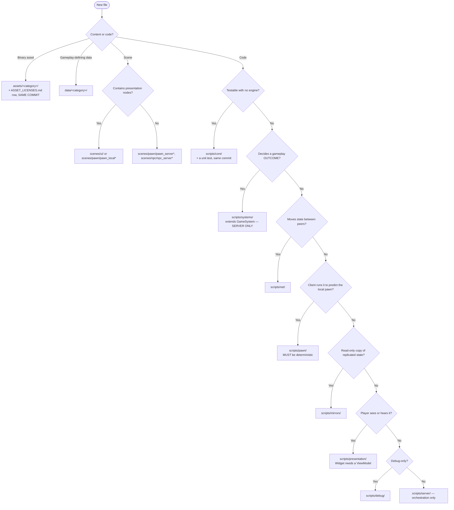

# Project Structure — Quick Reference

> **This is the lookup version.** The full tree with per-folder purpose lines and the export
> filtering rules is [`../20_tdd/02_project_structure.md`](../20_tdd/02_project_structure.md).
> This document answers one question fast: **where does this file go?**

---

## 1. The three questions

In order. Most files are placed by question 1 or 3.

| # | Ask | If yes |
|---|---|---|
| **1** | *Can I test this without an engine — no scene tree, no autoloads, no `Node`?* | `scripts/core/` |
| **2** | *Does the server have to be the one who decides this? (Could a client lie about it and gain an advantage?)* | `scripts/systems/` |
| **3** | *Does the player see or hear it?* | `scripts/presentation/` — and it needs a view model |

Question 1 is the most valuable one in the project. Core is where the highest-risk logic belongs
— the contract cycle, the suspicion integrator, the score fold, the compass curve — and where it
is cheapest to verify.

---

## 2. The decision flowchart

---

## 3. Folder cheat sheet

| Folder | Owns | Never contains |
|---|---|---|
| `scripts/core/` | Pure algorithms, immutable data, tuning resources, ID constants | Anything extending `Node`; `get_node`, `get_tree`, `Engine.*`, any autoload |
| `scripts/systems/` | Every rule that decides an outcome | Any reference to `presentation/` or `mirrors/` |
| `scripts/net/` | Serialisation, RPC, prediction, interpolation, lag comp | Gameplay rules — Net *moves* state, never *decides* it |
| `scripts/pawn/` | The state machine shared by server and predicted client | `randf`, `Time.*`, scene lookups, autoloads other than `Tuning` |
| `scripts/mirrors/` | Client read-only copies of replicated state | Any simulation; any setter callable outside `NetClient` |
| `scripts/presentation/` | Camera, HUD, view models, audio, pawn visuals | Any direct reference to a system or gameplay node |
| `scripts/server/` | `MatchDirector`, headless entry | Gameplay rules — it orchestrates |
| `scripts/debug/` | Console, overrides, visualisers | Anything gameplay depends on |
| `data/tuning/default/` | **The shipping gameplay values** | — |
| `data/strings/en.csv` | Every user-facing string | — |
| `test/arch/` | Architecture guards (source scans) | Behaviour tests |

---

## 4. Where things do *not* go

Each of these is a mistake someone will make.

| Temptation | Correct home |
|---|---|
| `utils.gd` / `helpers.gd` / `common.gd` | A **named** static class in `scripts/core/` |
| A gameplay constant in a script | `data/tuning/default/*.tres` + a `TUN-` row |
| A user-facing string in a script or scene | `data/strings/en.csv` |
| Suspicion logic in the pawn | `scripts/systems/suspicion_system.gd` — it is server-authoritative and must not be predicted |
| Compass math in the widget | `scripts/core/math/compass_math.gd` — it is unit-tested against the TUNABLES §4.2 table |
| `get_node("../../Player")` in a widget | `EventBus` → view model |
| NPC brain logic on the client | `scripts/systems/crowd/` — server only |
| A ninth autoload | An ADR first |
| Test files beside their source | `test/`, mirroring the path |
| A "temporary" asset with no licence row | `ASSET_LICENSES.md`, same commit — or delete it |

---

## 5. Naming

| Kind | Convention | Example |
|---|---|---|
| Script | `snake_case.gd` = `class_name` | `SuspicionSystem` → `suspicion_system.gd` |
| Scene | `snake_case.tscn` = root node | `PawnServer` → `pawn_server.tscn` |
| Resource | `snake_case.tres` | `cinderfall.tres` |
| Test | subject path, `test_` prefixed | `test/unit/core/math/test_suspicion_math.gd` |
| Pawn state | `state_<name>.gd` | `state_blend_walk.gd` |
| NPC state | `npc_state_<name>.gd` | `npc_state_startle.gd` |
| Ability effect | `<name>_effect.gd` | `cinderfall_effect.gd` |
| Widget pair | `<name>_widget.gd` + `<name>_vm.gd` | `compass_widget.gd`, `compass_vm.gd` |

---

## 6. The dependency rule, in one line

> **Presentation → Net → Systems → Core.** Never the reverse, never a cycle.

**The proof:** the headless server export excludes `scripts/presentation/`, `scripts/mirrors/`,
`scenes/ui/` and `assets/` entirely and still runs a full match. If it cannot, a dependency has
leaked upward. Asserted by `test_headless_server_runs_without_presentation.gd`.

---

## 7. Enforcement

| Test | Asserts |
|---|---|
| `test_folder_structure.gd` | Every declared folder exists; no script outside one |
| `test_file_naming.gd` | File name matches `class_name` |
| `test_layer_dependencies.gd` | No upward reference |
| `test_core_is_pure.gd` | Core has no `Node`, no lookups, no autoloads |
| `test_no_utils_files.gd` | No `utils`/`helpers`/`common`/`misc`/`shared` |
| `test_test_mirrors_source.gd` | Every Core and Systems file has a test |
| `test_export_excludes.gd` | Export presets exclude what §6 requires |
