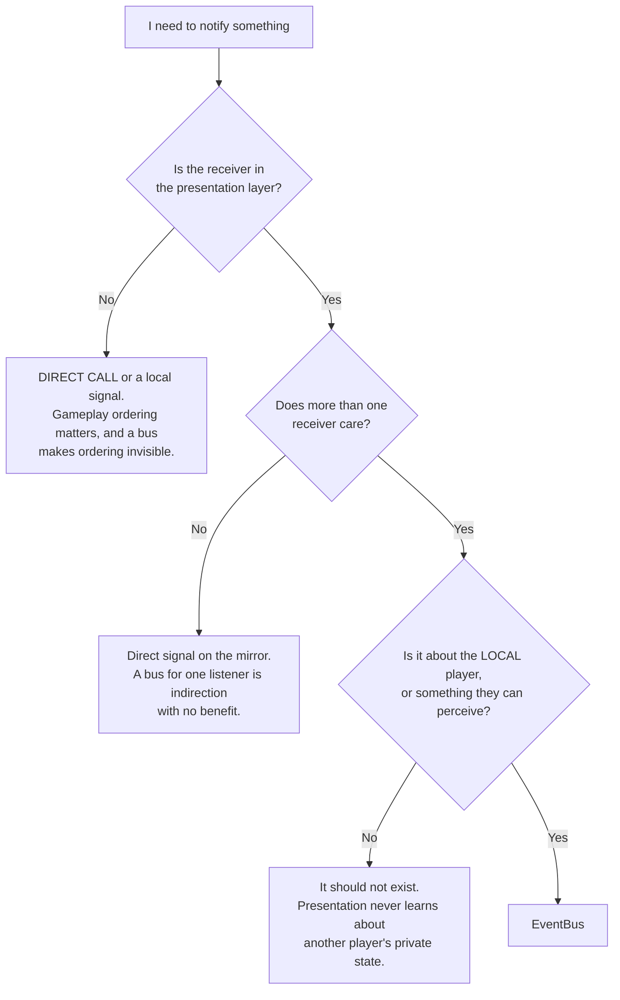

# Signal and Event Bus Catalogue

> **The one-line rule:** `EventBus` carries **facts about the local player's own game, from
> systems to presentation, one way only**. Everything else uses a direct typed call.

---

## 1. Bus or direct signal?



### 1.1 The three prohibitions

| Never | Why |
|---|---|
| **System-to-system via the bus** | Gameplay ordering is explicit and matters ([`../20_tdd/01_architecture.md`](../20_tdd/01_architecture.md) §4). A bus hides ordering, and hidden ordering breaks under load |
| **Input via the bus** | Input flows widget → handler → network as a direct chain. Putting it on the bus makes the bus bidirectional, which is the failure ADR-0006 exists to prevent |
| **State on the bus** | `EventBus.gd` contains **signal declarations and comments only** — no `var`, no `func`. A stateful event bus is a global variable in disguise. Asserted by `test_eventbus_is_stateless.gd` |

---

## 2. Facts and moments

| | **Facts** | **Moments** |
|---|---|---|
| Meaning | State has a new value | Something happened |
| Missable? | No — a late subscriber can read current state from the mirror | **Yes** — a missed moment is missed |
| Consumed by | View models holding current state | View models with queues, and `Audio` |
| Example | `suspicion_tier_changed` | `score_event_appended` |

Both are **past tense**. The bus reports what *has happened*, never what *should happen*.

---

## 3. The catalogue

`EVT-` IDs are the documentation identity; the GDScript signal name is the `snake_case` form.

### 3.1 Facts

| EVT- ID | Signal | Payload | Emitted when | Consumers |
|---|---|---|---|---|
| `EVT-SUSPICION-TIER-CHANGED` | `suspicion_tier_changed(tier: int, active_sources: int)` | tier 0–2; `active_sources` bitfield SPRINT ROOF CLIMB OPEN RUN | Own tier crosses a hysteresis boundary | `TierVM`, `Audio`, music controller |
| `EVT-SUSPICION-VALUE-CHANGED` | `suspicion_value_changed(value: float)` | 0–100 | Own value changes by ≥ 1.0 | `TierVM` (debug overlay only — **the number is never shown in the shipping HUD**) |
| `EVT-CONTRACT-ASSIGNED` | `contract_assigned(reason: int)` | `START` `KILL` `RESPAWN` `REPAIR` | A new contract is issued | `CompassVM`, `Audio` |
| `EVT-CONTRACT-PORTRAIT-REVEALED` | `contract_portrait_revealed(persona: StringName)` | `PERSONA-*` | A Compass lock completes (ASM-0030) | `CompassVM` |
| `EVT-COMPASS-UPDATED` | `compass_updated(bearing: float, distance_bucket: int, lock: float)` | bearing rad; bucket index; lock 0–1 | Every snapshot (30 Hz) | `CompassVM` |
| `EVT-MATCH-PHASE-CHANGED` | `match_phase_changed(phase: int, multiplier: float)` | phase enum; 1.0 or 2.0 | Phase transition | `MatchVM`, `Audio`, music controller |
| `EVT-ABILITY-COOLDOWN-CHANGED` | `ability_cooldown_changed(slot: int, remaining_ticks: int)` | slot 0–1 | Cooldown starts, expires, or is corrected | `AbilitySlotVM` |
| `EVT-BLEND-STATE-CHANGED` | `blend_state_changed(blend_type: int)` | `NONE` `POCKET` `GROUP` `PROP_STATIC` `PROP_CONCEAL` | Own blend begins or ends | `TierVM`, `Audio` |
| `EVT-KILL-READY-CHANGED` | `kill_ready_changed(kill: bool, stun: bool)` | | Server-computed validity changes | `Crosshair` |
| `EVT-TUNING-RELOADED` | `tuning_reloaded()` | — | Hot reload or server sync | Everything holding a derived value |

### 3.2 Moments

| EVT- ID | Signal | Payload | Emitted when | Consumers |
|---|---|---|---|---|
| `EVT-SCORE-EVENT-APPENDED` | `score_event_appended(event: ScoreEvent)` | The immutable event | A `ScoreEvent` arrives | `ScoreFeedVM`, `ScoreMirror`, `Audio` |
| `EVT-PREY-WARNING-TRIGGERED` | `prey_warning_triggered()` | **NONE** | Pursuer within 15 m **and** ≥ Noticed | `TierVM`, `Audio`, `CaptionOverlay` |
| `EVT-ABILITY-STARTED` | `ability_started(peer: int, ability: StringName, origin: Vector3)` | | Any ability starts within tell radius | VFX, `Audio`, `CaptionOverlay` |
| `EVT-ABILITY-DENIED` | `ability_denied(slot: int, reason: int)` | `DenyReason` | Own request refused | `AbilitySlotVM`, `Audio` |
| `EVT-COMPASS-PULSED` | `compass_pulsed()` | — | Each pulse period elapses | `Audio` |
| `EVT-KILL-RESOLVED` | `kill_resolved(killer: int, victim: int)` | | You killed, or you died | `ScoreFeedVM`, `Audio`, death card |
| `EVT-STUN-RESOLVED` | `stun_resolved(stunner: int, target: int, valid: bool)` | | You stunned, or were stunned | `TierVM`, `Audio` |
| `EVT-CAPTION` | `caption(key: StringName, direction: Vector2)` | String key; zero vector = non-positional | Any audio event flagged `Cap` | `CaptionOverlay` |
| `EVT-CONNECTION-CHANGED` | `connection_changed(state: int, reason: int)` | | Connect, disconnect, timeout | Menus |

### 3.3 `EVT-PREY-WARNING-TRIGGERED` takes no parameters

Deliberate, and the third of three layers enforcing the same rule:

| Layer | Enforcement |
|---|---|
| **Protocol** | `NET-S2C-PREY-WARNING` carries a tick and nothing else — there is no direction field to leak |
| **Signal** | Zero parameters — there is nothing a widget *could* render |
| **Widget** | The flash is non-directional and the sting is mono/centred |

`TUN-COMPASS-WARN-GIVES-DIRECTION` is `false`, and the panicked scan of a crowd is the best
moment in the game. A rule enforced at three layers survives refactoring; a rule enforced in one
widget does not. `test_prey_warning_signal_arity.gd` asserts the arity.

---

## 4. What the bus deliberately does not carry

| Not carried | Would break |
|---|---|
| Another player's suspicion value or tier | Anonymity — you see the *consequence* (render state), never the value |
| Another player's cooldowns or loadout | Kit-reading is a skill |
| The contract's persona before a lock completes | The crowd's entire value (ASM-0030) |
| Any world position of the contract | The Compass gives bearing and a distance bucket only |
| Kills that did not involve you | There is no global kill feed |
| NPC state changes | 90 agents × 30 Hz would be 2 700 signals/s for zero player-facing value |

---

## 5. Subscription rules

```gdscript
## View models subscribe in _subscribe(), called from _init().
## They connect to EventBus and NOTHING ELSE — never to a gameplay node.
func _subscribe() -> void:
    EventBus.suspicion_tier_changed.connect(_on_suspicion_tier_changed)
    EventBus.tuning_reloaded.connect(_on_tuning_reloaded)
```

| Rule | Reason |
|---|---|
| Subscribe in `_init()` / `_ready()`, disconnect in `_exit_tree()` | Leaked connections keep dead view models alive |
| Handlers are named `_on_<signal_name>` | Convention |
| A handler must not emit another bus signal | Cascades make ordering unanalysable |
| A handler must not block | It runs on the main thread |
| **Anything holding a derived tuning value must handle `tuning_reloaded`** | Forgetting is the classic hot-reload bug, and it is a Definition-of-Done item |

---

## 6. Adding a signal

1. Confirm it passes the §1 flowchart — most candidates do not.
2. Add the declaration to `event_bus.gd` with a `##` docstring.
3. Add a row to §3 here with the payload schema.
4. Add its `EVT-` ID to `GLOSSARY.md` Appendix A and `scripts/core/ids.gd`.
5. Run `test_eventbus_signals_documented.gd` (arity must match this document).

---

## 7. Acceptance criteria

- [ ] `event_bus.gd` contains only `signal` declarations, comments and blank lines.
- [ ] Every signal in `event_bus.gd` has a row in §3 with a matching arity.
- [ ] Every row in §3 exists in `event_bus.gd`.
- [ ] `prey_warning_triggered` has zero parameters.
- [ ] No file under `scripts/systems/` references `EventBus`.
- [ ] No bus handler emits another bus signal.
- [ ] Every view model holding a derived tuning value handles `tuning_reloaded`.
