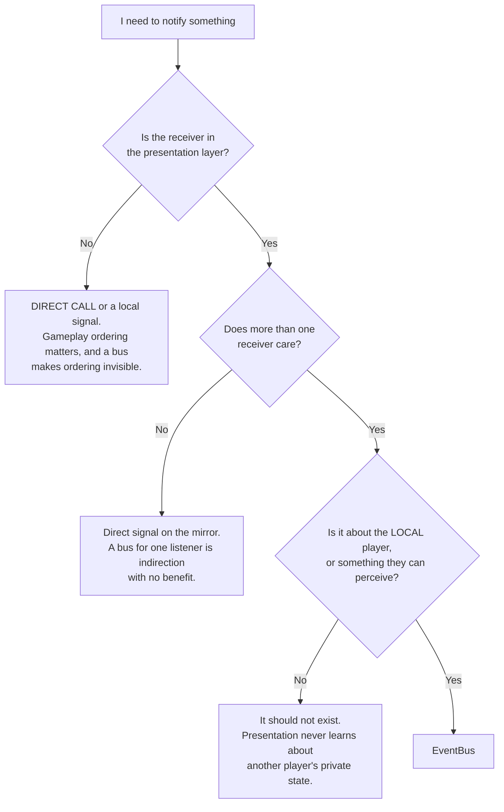

# Signal and Event Bus Catalogue

> **The one-line rule:** `EventBus` carries **facts about the local player's own game, from
> systems to presentation, one way only**. Everything else uses a direct typed call.

---

## 1. Bus or direct signal?



### 1.1 The three prohibitions

| Never | Why |
|---|---|
| **System-to-system via the bus** | Gameplay ordering is explicit and matters ([`../20_tdd/01_architecture.md`](../20_tdd/01_architecture.md) §4). A bus hides ordering, and hidden ordering breaks under load |
| **Input via the bus** | Input flows widget → handler → network as a direct chain. Putting it on the bus makes the bus bidirectional, which is the failure ADR-0006 exists to prevent |
| **State on the bus** | `EventBus.gd` contains **signal declarations and comments only** — no `var`, no `func`. A stateful event bus is a global variable in disguise. Asserted by `test_eventbus_is_stateless.gd` |

---

## 2. Facts and moments

| | **Facts** | **Moments** |
|---|---|---|
| Meaning | State has a new value | Something happened |
| Missable? | No — a late subscriber can read current state from the mirror | **Yes** — a missed moment is missed |
| Consumed by | View models holding current state | View models with queues, and `Audio` |
| Example | `suspicion_tier_changed` | `score_event_appended` |

Both are **past tense**. The bus reports what *has happened*, never what *should happen*.

---

## 3. The catalogue

`EVT-` IDs are the documentation identity; the GDScript signal name is the `snake_case` form.

### 3.1 Facts

| EVT- ID | Signal | Payload | Emitted when | Consumers |
|---|---|---|---|---|
| `EVT-SUSPICION-TIER-CHANGED` | `suspicion_tier_changed(tier: int, active_sources: int)` | tier 0–2; `active_sources` bitfield SPRINT ROOF CLIMB OPEN RUN | Own tier crosses a hysteresis boundary | `TierVM`, `Audio`, music controller |
| `EVT-SUSPICION-VALUE-CHANGED` | `suspicion_value_changed(value: float)` | 0–100 | Own value changes by ≥ 1.0 | `TierVM` (debug overlay only — **the number is never shown in the shipping HUD**) |
| `EVT-CONTRACT-ASSIGNED` | `contract_assigned(reason: int)` | `START` `KILL` `RESPAWN` `REPAIR` `ESCAPE` | A new contract is issued. **`NET-S2C-CONTRACT-ASSIGNED` carries a contract slot and the bridge DROPS it** — GDD-03 §8.5 forbids a client learning anything about its contract it has not earned by looking, so the payload is the reason alone | `PortraitWidget` (**wired 2026-09-02**; it had subscribed since US-0073 and the signal had no emitter, so an earned portrait stayed lit across every reassignment), `CompassVm`, `Audio` |
| `EVT-CONTRACT-PORTRAIT-REVEALED` | `contract_portrait_revealed(persona: StringName)` | `PERSONA-*` | A Compass lock completes (ASM-0030) | `CompassVm` |
| `EVT-COMPASS-UPDATED` | `compass_updated(bearing: float, distance_bucket: int, lock: float)` | bearing rad; bucket index; lock 0–1 | Every snapshot (30 Hz) | `CompassVm` |
| `EVT-PURSUIT-CHANGED` | `pursuit_changed(hunting: float, hunted: float)` | two fractions, `[0, 1]` each | Either pursuit bar changes. **Two values, because a Hamiltonian cycle makes every player a hunter and a prey simultaneously** — US-0097's criterion asks for one `pursuit_fraction` and one byte cannot carry two chases that mean opposite things. `hunting` drains toward losing your contract; `hunted` drains toward escaping. **Neither names anybody** | `ChaseVm`, `Audio` (US-0075) |
| `EVT-MATCH-PHASE-CHANGED` | `match_phase_changed(phase: int, multiplier: float)` | phase enum; 1.0 or 2.0 | Phase transition | `MatchVM`, `Audio`, music controller |
| `EVT-ABILITY-COOLDOWN-CHANGED` | `ability_cooldown_changed(slot: int, remaining_ticks: int)` | slot 0–1 | Cooldown starts, expires, or is corrected. **The one signal here derived from the snapshot rather than relayed** — both cooldowns are in the own-gameplay block — and **per slot, not per pair**, so a widget is never told about the ability that did not change | `AbilitySlotVM` |
| `EVT-BLEND-STATE-CHANGED` | `blend_state_changed(blend_type: int)` | `NONE` `POCKET` `GROUP` `PROP_STATIC` `PROP_CONCEAL` | Own blend begins or ends | `TierVM`, `Audio` |
| `EVT-KILL-READY-CHANGED` | `kill_ready_changed(kill: bool, stun: bool)` | | Server-computed validity changes | `Crosshair` |
| `EVT-TUNING-RELOADED` | `tuning_reloaded()` | — | Hot reload or server sync | Everything holding a derived value |

### 3.2 Moments

| EVT- ID | Signal | Payload | Emitted when | Consumers |
|---|---|---|---|---|
| `EVT-SCORE-EVENT-APPENDED` | `score_event_appended(event: RefCounted)` | A **`ScoreReport`**, not a `ScoreEvent`. **Amended US-0074.** A `ScoreEvent` is server-side, immutable and built by one constructor that derives its own multiplier from its own tick; a client cannot build one faithfully and must not try, because re-deriving what a kill was worth is a client deciding gameplay state. What crosses the wire is `ScoreWire`'s decoding: kind, points already multiplied, and the feed group. The parameter is typed `RefCounted` because `EventBus` may hold no `class` | `NET-S2C-SCORE-EVENT` arrives, forwarded by `HudBridge` | `ScoreFeedVm` (**built US-0074**), `Audio` (US-0075) |
| `EVT-PREY-WARNING-TRIGGERED` | `prey_warning_triggered(bearing: float, bucket: int)` | A **world** bearing in radians, wobble already applied, and a `Quantise.BUCKET_STEP` distance bucket. **Nothing that names anybody** | Pursuer within 15 m **and** ≥ Noticed | `CompassVm`, `Audio`, `CaptionOverlay` |
| `EVT-ABILITY-STARTED` | `ability_started(caster_slot: int, ability: StringName, origin: Vector3, at: Vector3)` | a **wire slot**, never a peer id | Any ability starts within tell radius. **`at` is where the ability landed, added 2026-09-03** — see §3.4. The payload names **nobody but its caster**, which is asserted structurally rather than remembered | `CinderfallView`, `Audio`, `CaptionOverlay` |
| `EVT-ABILITY-DENIED` | `ability_denied(slot: int, reason: int)` | `DenyReason` | Own request refused | `AbilitySlotVM`, `Audio` |
| `EVT-COMPASS-PULSED` | `compass_pulsed()` | — | Each pulse period elapses | `Audio` |
| `EVT-KILL-RESOLVED` | `kill_resolved(killer_slot: int, victim_slot: int)` | **wire slots**, never peer ids | You killed, or you died | `ScoreFeedVM`, `Audio`, death card |
| `EVT-STUN-RESOLVED` | `stun_resolved(stunner_slot: int, target_slot: int, valid: bool)` | **wire slots**, never peer ids. The lockout `NET-S2C-STUN-RESULT` carries is dropped until a widget draws one | You stunned, or were stunned | `TierVM`, `Audio` |
| `EVT-CAPTION` | `caption(key: StringName, direction: Vector2)` | String key; zero vector = non-positional | Any audio event flagged `Cap`. **STILL NO EMITTER, and the blocker is real**: captions are produced by the audio dispatcher (US-0075), which has no sound file in the repository to dispatch | `CaptionOverlay` |
| `EVT-CONNECTION-CHANGED` | `connection_changed(state: int, reason: int)` | | Connect, disconnect, timeout. **STILL NO EMITTER, deliberately**: `Net` already carries `handshake_completed`, `handshake_rejected` and `peer_left`, and the only documented consumer is a menu system that does not exist (US-0078, M6). Wiring it now would be a third copy of connection state with no reader | Menus |

### 3.4 `EVT-ABILITY-STARTED` says where it landed, and may never say who

**AMENDED 2026-09-03.** This signal carried the caster, the ability and the **origin** only,
and the bridge dropped the aim outright — *"a tell says something happened there, and forwarding
where it was pointed would let a VFX author draw an arrow at the target"*.

**That rule was written when nothing drew anything, and it made the one ability that changes
the world undrawable.** A cinder cloud lands up to `TUN-CINDERFALL-THROW-RANGE` **8 m** from the
thrower, so a consumer given only the origin puts cover where there is none and leaves none
where there is cover. `ABIL-CINDERFALL` blocks line of sight and forbids kill initiation, and a
player standing inside an invisible one is told nothing at all about why the reticle has stopped
offering — **a larger information failure than the one the old rule prevented.**

**The replacement is a property rather than an omission, and it is stronger.** The payload
carries two *points* and names **nobody**: no slot, peer, persona or tier of a target appears in
it, which is what never-do #12 is actually about. `test_the_tell_payload_names_nobody_but_its_caster`
asserts the argument list itself, so a later author cannot add a target quietly.

**And the wire needed no new field.** `NET-S2C-ABILITY-STARTED`'s `dir` was a *unit* vector; it
now carries the **granted** distance in its length, which is the same convention
`AbilityRules.aim` already reads the client's request with. Three floats either way.

### 3.3 `EVT-PREY-WARNING-TRIGGERED` says where, and may never say who

**AMENDED 2026-08-26 (ADR-0013, built US-0059).** This signal took **zero parameters** until
then, as the middle of three layers enforcing directionlessness: the protocol carried only a
tick, the signal had nothing to pass, and the widget's flash was non-directional. The reference
marks a revealed pursuer with bearing and range, so `TUN-COMPASS-WARN-GIVES-DIRECTION` is `true`
and two fields exist. The old argument — that the panicked scan of a crowd is the best moment in
the game — is preserved in GDD-01 Law 5 rather than deleted, because the cost is real and was
knowingly paid.

**The three layers still stand; what they enforce has changed to the stronger rule:**

| Layer | Enforcement |
|---|---|
| **Protocol** | `NET-S2C-PREY-WARNING` carries `bearing:u8`, `bucket:u8` and **no field that names a player**. `test_warning_names_nobody.gd` checks the RPC signature, the field count and this document's sibling catalogue row |
| **Signal** | Two parameters, neither identifying. `test_prey_warning_signal_arity.gd` refuses `persona`, `slot`, `peer`, `name`, `identity`, `colour` or `portrait` on this line |
| **Widget** | The sting stays mono and centred with no 3D emitter — the reference's proximity cue is non-positional too, and the direction belongs to the marker |

**The bearing is a WORLD angle.** A widget rotates it by the local yaw every rendered frame,
which is the decision `SYS-COMPASS` made in US-0057 and for the same reason: a camera-relative
angle computed server-side lags the mouse by the round trip, on a marker whose whole job is to
point.

**Nothing emits this signal yet.** `EventWire.prey_warned` carries the message on the client and
`EventBus` is signals-only — no `var`, no `func`, `test_eventbus_is_stateless.gd` — so the
bridge belongs to the first presentation node that wants it, which is US-0073's HUD.

---

## 4. What the bus deliberately does not carry

| Not carried | Would break |
|---|---|
| Another player's suspicion value or tier | Anonymity — you see the *consequence* (render state), never the value |
| Another player's cooldowns or loadout | Kit-reading is a skill |
| The contract's persona before a lock completes | The crowd's entire value (ASM-0030) |
| Any world position of the contract | The Compass gives bearing and a distance bucket only |
| Kills that did not involve you | There is no global kill feed |
| NPC state changes | 90 agents × 30 Hz would be 2 700 signals/s for zero player-facing value |

---

## 5. Subscription rules

```gdscript
## View models subscribe in _subscribe(), called from _init().
## They connect to EventBus and NOTHING ELSE — never to a gameplay node.
func _subscribe() -> void:
    EventBus.suspicion_tier_changed.connect(_on_suspicion_tier_changed)
    EventBus.tuning_reloaded.connect(_on_tuning_reloaded)
```

| Rule | Reason |
|---|---|
| Subscribe in `_init()` / `_ready()`, disconnect in `_exit_tree()` | Leaked connections keep dead view models alive |
| Handlers are named `_on_<signal_name>` | Convention |
| A handler must not emit another bus signal | Cascades make ordering unanalysable |
| A handler must not block | It runs on the main thread |
| **Anything holding a derived tuning value must handle `tuning_reloaded`** | Forgetting is the classic hot-reload bug, and it is a Definition-of-Done item |

---

## 6. Adding a signal

1. Confirm it passes the §1 flowchart — most candidates do not.
2. Add the declaration to `event_bus.gd` with a `##` docstring.
3. Add a row to §3 here with the payload schema.
4. Add its `EVT-` ID to `GLOSSARY.md` Appendix A and `scripts/core/ids.gd`.
5. Run `test_eventbus_signals_documented.gd` (arity must match this document).

---

## 7. Acceptance criteria

- [ ] `event_bus.gd` contains only `signal` declarations, comments and blank lines.
- [ ] Every signal in `event_bus.gd` has a row in §3 with a matching arity.
- [ ] Every row in §3 exists in `event_bus.gd`.
- [ ] `prey_warning_triggered` has zero parameters.
- [ ] No file under `scripts/systems/` references `EventBus`.
- [ ] No bus handler emits another bus signal.
- [ ] Every view model holding a derived tuning value handles `tuning_reloaded`.
