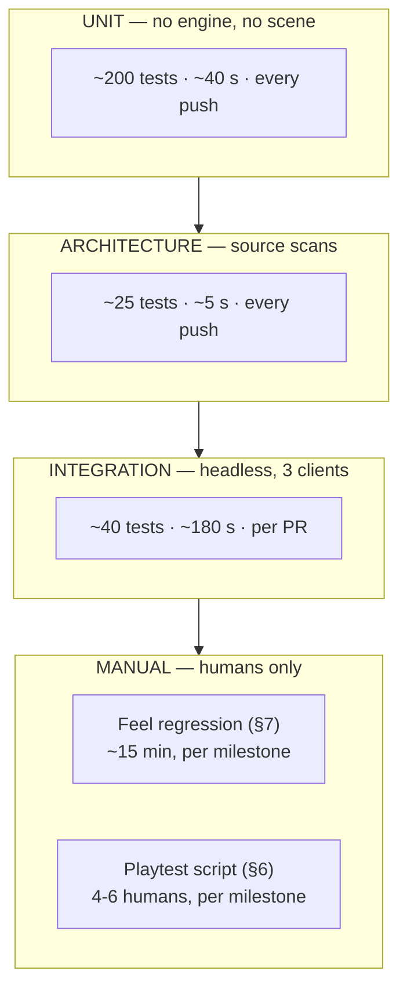

# Test Plan

> **The premise.** Most of this game's defects are invisible in review. A clone missing one idle
> animation, a blend pocket that silently stops validating, a prey sting attached to a 3D
> emitter, a suspicion value predicted client-side — each of these *works*, breaks nothing
> loudly, and quietly destroys a core design property. The test suite exists to catch the class
> of bug that human review structurally cannot.
>
> **The second premise.** Some of this game's most important properties cannot be tested by
> automation at all. Whether the crowd *feels* dense, whether patience *feels* rewarded, whether
> being hunted is frightening — these need humans. §6 and §7 are as load-bearing as §2–§5.

---

## 1. The pyramid



| Layer | Count | Runtime | Frequency | Catches |
|---|---|---|---|---|
| **Unit** | ~200 | ≤ 40 s | Every push, and before every commit | Logic errors in Core |
| **Architecture** | ~25 | ≤ 5 s | Every push | Structural erosion |
| **Integration** | ~40 | ≤ 180 s — **measured 183.5 s on 2026-08-27, and this budget is ENFORCED NOWHERE** | Every PR | Netcode, ordering, multi-peer agreement |
| **Manual** | 2 protocols | ~45 min | Every milestone | Everything that matters and cannot be automated |

---

## 2. Unit tests

The highest-value layer, because **Core is pure** ([`../20_tdd/01_architecture.md`](../20_tdd/01_architecture.md) §1.3):
no scene tree, no engine, no autoloads. The most bug-prone logic in the project runs in
milliseconds.

### 2.1 The four Core suites that matter most

| Suite | Subject | Why it is first |
|---|---|---|
| `test_contract_cycle_fuzz.gd` | The Hamiltonian cycle | 10 000 randomised event sequences — kills, respawns, joins, disconnects, batched. Asserts invariant I holds, no self-assignment on any relaxation path, no player contractless at a tick boundary. **A cycle bug is unrecoverable mid-match and nearly impossible to reproduce from a report** |
| `test_suspicion_math.gd` | The integrator | Reproduces the GDD-03 §3.5 worked 45-second timeline to within 0.1 points at every listed timestamp. If the doc and the code disagree, one is wrong and this says which |
| `test_score_fold.gd` | The score fold | Every bonus in isolation, the maximal stack, the final-phase multiplier, Variety across a death boundary, a Reckless kill netting 50, an empty log folding to zeroes. Reproduces every reference value in GDD-07 §3.2 exactly |
| `test_compass_curve.gd` | The pulse curve | Asserts the period at every distance in the TUNABLES §4.2 sampled table within 1 ms. The curve is the game's signature feel and a silent drift would be invisible until playtest |

### 2.2 Coverage requirement

**Every file in `scripts/core/` and `scripts/systems/` has a corresponding test file**
(`test_test_mirrors_source.gd`). Not a coverage percentage — a *file-for-file* requirement, which
is checkable and un-gameable.

---

## 3. Architecture tests

Source scans that protect the architecture rather than behaviour. They live in `test/arch/` with
a `README` explaining why, because **they are the tests most likely to be deleted by someone who
does not understand them.**

| Test | Prevents |
|---|---|
| `test_layer_dependencies.gd` | A system referencing presentation — would break the headless server |
| `test_core_is_pure.gd` | Core acquiring a `Node` or an autoload — would end unit-testability |
| `test_eventbus_is_stateless.gd` | The bus becoming a global variable |
| `test_no_gameplay_literals.gd` | A hardcoded constant two code paths disagree about |
| `test_pawn_determinism_grep.gd` | Nondeterminism in predicted code — the hardest bug class to diagnose from a report |
| `test_randf_confined.gd` | Gameplay randomness outside the seeded server RNG |
| `test_no_client_authority.gd` | An RPC letting a client assert an outcome |
| `test_ui_no_gameplay_refs.gd` | A widget reading a gameplay node |
| `test_tuning_docs_sync.gd` | **Documentation drifting from code** — the primary defence against `RISK-AGENT-DRIFT` |
| `test_autoload_inventory.gd` | A ninth autoload appearing without an ADR |
| `test_id_grammar.gd` · `test_ids_match_glossary.gd` | ID drift |
| `test_protocol_docs_sync.gd` | The two copies of the message catalogue diverging |
| `test_claude_md_synced.gd` | The root brief drifting from its seed |

> **If an architecture test fails, the fix is never to weaken the test.** It means either the
> change is wrong, or an ADR is needed. This is a stop-and-ask condition in
> [`AGENT_PLAYBOOK.md`](AGENT_PLAYBOOK.md) §3.

---

## 4. Integration tests — the headless 3-client harness

```gdscript
## Spawns a real server and three real clients IN-PROCESS, then drives them with
## scripted InputCommand sequences. Exercises the ACTUAL netcode rather than a
## mock, which is the only way prediction bugs surface.
class_name IntegrationHarness
extends Node

func start(player_count: int, seed: int) -> void
func drive(peer: int, commands: Array[InputCommand]) -> void
func advance_ticks(n: int) -> void
func simulate_latency(peer: int, rtt_ms: float, loss: float) -> void
func assert_all_peers_agree(field: StringName) -> void
```

### 4.1 What only integration can catch

| Test | Catches |
|---|---|
| `test_prediction_reconciliation.gd` | Client and server diverging under latency |
| `test_reconcile_snaps_sim_blends_visual.gd` | The reconciliation that compounds error instead of converging |
| `test_frame_rate_independence.gd` | Gameplay differing at 30 / 60 / 144 fps. **The direct proof that ASM-0020 holds** |
| `test_render_state_per_observer.gd` | Anonymity leaking — one player at suspicion 100 must be `PLAIN` to four observers and `HARD` to one |
| `test_clone_roster_parity.gd` | Three peers deriving different clone rosters from one seed |
| `test_join_leave_stable.gd` | Cycle corruption across 5 minutes of churn |
| `test_lagcomp_rewind.gd` | Kills validating against the wrong world state |
| `test_crowd_bandwidth.gd` | Exceeding the 96 kbit/s budget |
| `test_channel_separation.gd` | Reliable floods stalling the snapshot stream |

### 4.2 Latency matrix

Every netcode test runs at four profiles, because bugs hide at specific latencies:

| Profile | RTT | Loss |
|---|---|---|
| LAN | 5 ms | 0 % |
| Good | 40 ms | 0.1 % |
| Typical | 90 ms | 1 % |
| Poor | 180 ms | 3 % |

---

## 5. Metrics tests

Map geometry assertions, run against **both greybox and art geometry**, because the art pass must
not change gameplay ([`../10_gdd/05_level_design.md`](../10_gdd/05_level_design.md) §7.3).

| Test | Asserts |
|---|---|
| `test_map_metrics.gd` | No traversable surface in a boundary band — geometry at 1.10 m would resolve as vault or mantle by sub-centimetre position, which reads as the game being broken |
| `test_map_dead_ends.gd` | No dead end > 8 m |
| `test_map_widths.gd` | Alleys ≥ 2.6 m |
| `test_map_density.gd` | Every zone samples inside its NPC band at ≥ 5 points |
| `test_map_sightlines.gd` | Named sightlines within ± 2 m |
| `test_circuit_separation.gd` | No two circuits within 8 m simultaneously |
| `test_spawn_anticamp.gd` | ≥ 3 valid spawns remain from any camping position |
| `test_navmesh_coverage.gd` | Every street-level playable point navigable; no roof or balcony is |

---

## 6. The playtest script

Run at every milestone from M4. 4–6 humans, ~30 minutes of play plus 15 of questions.

### 6.1 Protocol

| Step | Detail |
|---|---|
| Brief | **60 seconds maximum.** "You have a target. Someone has you. Walk slowly to stay hidden." Nothing else — if the game needs more explanation than that, the onboarding is the finding |
| Play | 3 matches back-to-back |
| Observe | Facilitator records `TEL-MEAN-SPEED` per match and watches for **the turn** (§7.1) |
| Questions | §6.2, asked individually, written not spoken aloud in the group |
| Log | Answers + telemetry into `docs/40_backlog/playtests/YYYY-MM-DD.md` |

### 6.2 The twelve questions

Asked after **every** session. Numbered so answers are comparable across milestones.

| # | Question | Diagnoses |
|---|---|---|
| 1 | Did you ever walk past your target without recognising them? | USP claim 1; whether the crowd works |
| 2 | What did you do when you thought someone was hunting you? | Whether the prey warning produces *action* or just anxiety |
| 3 | Did standing still ever feel like the right move? | Pillar 2. If no, Law 4 is broken |
| 4 | Rate 1–5: how intense was the moment you realised you were being followed? | §8.3's asymmetry |
| 5 | Rate 1–5: how satisfying was your best kill? | Must score **below** Q4 — if hunting beats being hunted, the design has inverted |
| 6 | Could you tell how visible you were at any moment? | Legibility of the tier indicator |
| 7 | Did you understand why you died? | **The single most important question.** Below 4/5 means the legibility pillar is failing |
| 8 | Name any bonus you earned. | Whether the score feed teaches |
| 9 | Did anything feel unfair? | Netcode, stun frustration, spawn issues |
| 10 | Did you change how you played between match 1 and match 3? How? | Whether **the turn** happens |
| 11 | Was there ever a moment you had no idea what to do? | Dead time in the micro-loop |
| 12 | Would you play this again tonight? | The only retention signal available pre-population |

### 6.3 Reading the answers

| Signal | Meaning |
|---|---|
| Q5 > Q4 | **Hunting is beating being hunted.** The asymmetry has inverted; the whole emotional design is off |
| Q7 < 4/5 | Legibility failure. Fix before any content work |
| Q8 blank | The score feed is not landing — the game has no teacher |
| Q10 "no change" | **The turn is not happening.** The most serious possible finding |
| Q3 "no" | Patience does not feel viable, regardless of what the scoring says |
| Q12 < 70 % yes | Stop and diagnose before building anything else |

---

## 7. Feel-regression tests

Properties automation cannot catch, checked manually at every milestone by one person in ~15
minutes. **Each has a specific observable, not a vibe.**

### 7.1 The turn

> Between minute 1 and minute 4 of a match, mean player speed must visibly drop.

The single most diagnostic observation available. It is the moment players learn that patience
pays, and if it does not happen the score feed is not teaching. Check `TEL-MEAN-SPEED` by match
minute; confirm by watching.

### 7.2 The checklist

> **SCORED BY WHAT IS RUNNABLE AT THE M4 GATE (2026-08-27): THREE OF FOURTEEN, AND ALL THREE WERE
> JUDGED AT M1.** Runnable: 9 (the crowd feels alive), 11 (slowing is instant), 12 (traversal is
> forgiving, 10/10). **Eleven are blocked, and not one of them on M4 work** — rows 1, 13 and 14 on
> M5 scoring; 4, 5 and 6 on the M5 HUD and audio; 8 and 10 on animation clips that do not exist on
> either rig; 2, 3 and 7 on needing a second human *and* feedback. Row 1 is **the turn**, which
> `TEL-MEAN-SPEED` cannot measure because it has no emitter. The first full run is `US-0098`.

| # | Property | Observable | Fails if |
|---|---|---|---|
| 1 | **The turn** | Mean speed drops minute 1 → 4 | Flat |
| 2 | Blend-walk feels safe | Tester walks through a crowd and is not found | They feel exposed at any speed |
| 3 | Sprint feels expensive | Sprinting produces visible consequence within ~2 s | It feels free |
| 4 | The Compass is legible | Tester estimates distance within ~10 m from cadence alone, eyes closed | They cannot |
| 5 | The pulse inflection lands | The last 15 m *feels* categorically different from 40 m | It feels linear |
| 6 | The prey warning startles | Tester physically reacts the first time | It reads as weather |
| 7 | Stun feels decisive | Stunning a chaser ends the encounter | It feels like a 4 s delay |
| 8 | The kill commits | 1.4 s feels like a held breath, not a lag spike | It feels unresponsive |
| 9 | The crowd feels alive | Tester looks at NPCs unprompted after minute 4 | They stop looking |
| 10 | Startle waves read directionally | Tester infers roughly where violence happened | It reads as a circle |
| 11 | Slowing down is instant | Any speed → blend-walk with no perceived delay | Any lag |
| 12 | Traversal is forgiving | Ten deliberately sloppy vaults all resolve | Any misses |
| 13 | The score feed is peripheral | Tester names a bonus without having looked at it | They must look |
| 14 | Results teach | Tester can say what the winner did differently | They cannot |

### 7.3 Why these are not automated

Each has an automatable *proxy* — frame timings, telemetry, screenshot diffs — and each proxy can
pass while the property fails. `TUN-FEEL-INPUT-TO-ANIM-MAX` can measure 78 ms while the game
still feels sluggish because of animation blend curves. **The proxies are necessary and
insufficient**, and pretending otherwise is how a game ships technically correct and unpleasant.

---

## 8. What is deliberately not tested

| Not tested | Why |
|---|---|
| Coverage percentage | A file-for-file requirement is checkable and un-gameable; a percentage invites tests written to raise it |
| UI screenshot pixel-diffs | Would fail on every legitimate art change and be disabled within a month |
| Automated legibility scoring | A research problem. §9 of [`UI_UX_SPEC.md`](UI_UX_SPEC.md) archives states for humans instead |
| Performance on non-reference hardware | One reference machine; broader profiling is post-MVP |
| Anti-cheat beyond server authority | Out of scope by `SCOPE_FENCE` OUT #9 |

---

## 9. Running the suites

```bash
# Before every commit — must stay under 45 s or it will not be run
godot --headless -s addons/gut/gut_cmdln.gd -gdir=res://test/unit -gexit
godot --headless -s addons/gut/gut_cmdln.gd -gdir=res://test/arch -gexit

# Before every PR
godot --headless -s addons/gut/gut_cmdln.gd -gdir=res://test/integration -gexit
godot --headless -s addons/gut/gut_cmdln.gd -gdir=res://test/metrics -gexit
```

---

## 10. Acceptance criteria

- [ ] Every file in `scripts/core/` and `scripts/systems/` has a test file.
- [ ] Unit + arch suites complete in ≤ 45 s.
- [ ] Integration suite completes in ≤ 180 s and runs at all four latency profiles.
      **BOTH HALVES ARE FALSE AS OF 2026-08-27 AND NEITHER IS ENFORCED.** The suite is at
      **183.5 s** — `test_the_m4_loop_resolves.gd` cost 13.1 s and is the first test ever to run
      M4's systems together, so the overrun bought something. **No job checks the number**: it is
      asserted here, in §3's diagram and in TDD-12 §17, and measured by nothing, which the M4 gate
      found as its fourth drift instance. Either enforce it or raise it. The four-profile half was
      already known false (US-0036: only the harness's own agreement test has a wire to give a
      latency to).
- [ ] `test/arch/README.md` exists and explains why those tests must not be deleted.
- [ ] The four §2.1 Core suites pass and reproduce their documented reference values exactly.
- [ ] Metrics tests run against both greybox and art geometry.
- [ ] The playtest script is run at every milestone from M4, logged to `docs/40_backlog/playtests/`.
- [ ] All twelve questions asked every session, individually and in writing.
- [ ] The feel-regression checklist is run at every milestone by one named person.
- [ ] No test is skipped or weakened without an ADR.

---

## 11. Open questions

| # | Question | Position | Needed by |
|---|---|---|---|
| 1 | Three external playtests (M6 exit) is ~18 player-matches — almost certainly too few to test the balance model's key prediction. | Raise the count, or accept that prediction 4 stays open past M6. Flagged in GDD-07 §10 failure mode 10 | M6 |
| 2 | Can the integration harness run three clients in-process without the shared process masking a real desync? | Add one out-of-process run per milestone as a cross-check | M2 |
| 3 | Q4/Q5 (intensity ratings) rely on self-report, which is unreliable. Worth adding a physiological or behavioural proxy? | Not for MVP. The *ordering* of the two answers is more robust than either absolute value, and ordering is what we actually care about | M6 |
| 4 | Feel-regression is one person's judgement and will drift as they habituate. | Rotate the runner each milestone and keep the written observables, which are the anchor | M4 |
