# Epics

> An epic groups stories that share a **system boundary and a test surface**, so that finishing
> one leaves something demonstrable. Epics do not cross milestones — if work spans two, it is two
> epics, because a half-finished epic across a milestone boundary is indistinguishable from
> being behind.

---

## 1. Index

| Epic | Milestone | Stories | Systems | Demonstrable when done |
|---|---|---|---|---|
| [`EPIC-SCAFFOLD`](#2-epic-scaffold) | M0 | US-0001–0005 | — | `git clone`, import, CI green |
| [`EPIC-DATA`](#3-epic-data) | M0 | US-0006–0011 | `SYS-TUNING`, `SYS-EVENTBUS` | Every tunable loads and hot-reloads |
| [`EPIC-BOOT`](#4-epic-boot) | M0 | US-0012 | `SYS-MAP` | Greybox map loads, `--server` branches |
| [`EPIC-PAWN-STATES`](#5-epic-pawn-states) | M1 | US-0013–0016 | `SYS-PAWN`, `SYS-INPUT` | A capsule walks the speed ladder |
| [`EPIC-TRAVERSAL`](#6-epic-traversal) | M1 | US-0017–0020 | `SYS-TRAVERSAL` | Vault, mantle, climb, drop, gap-jump |
| [`EPIC-CAMERA`](#7-epic-camera) | M1 | US-0021–0024 | `SYS-CAMERA` | FOV ladder, occlusion, crowd-scan |
| [`EPIC-TRANSPORT`](#8-epic-transport) | M2 | US-0025–0028 | `SYS-NET-REPLICATION` | 3 clients connect; server simulates |
| [`EPIC-SNAPSHOT`](#9-epic-snapshot) | M2 | US-0029–0031 | `SYS-NET-REPLICATION` | Remote pawns move, within budget |
| [`EPIC-PREDICTION`](#10-epic-prediction) | M2 | US-0032–0038 | `SYS-NET-PREDICTION`, `SYS-NET-LAGCOMP` | Local pawn feels local at 180 ms RTT |
| [`EPIC-CROWD-CORE`](#11-epic-crowd-core) | M3 | US-0039–0042 | `SYS-CROWD`, `SYS-NPC-AI` | 90 NPCs walk the district in budget |
| [`EPIC-CROWD-BEHAVIOUR`](#12-epic-crowd-behaviour) | M3 | US-0043–0045 | `SYS-CROWD`, `SYS-CORPSE` | Groups, startle waves, gawk clusters |
| [`EPIC-ANONYMITY`](#13-epic-anonymity) | M3 | US-0046–0048 | `SYS-CROWD` | A player is unfindable in a crowd |
| [`EPIC-CONTRACT`](#14-epic-contract) | M4 | US-0049–0050 | `SYS-CONTRACT` | Everyone hunts one, is hunted by one |
| [`EPIC-SUSPICION`](#15-epic-suspicion) | M4 | US-0051–0054 | `SYS-SUSPICION`, `SYS-BLEND` | Speed costs anonymity; blending restores it |
| [`EPIC-DETECTION`](#16-epic-detection) | M4 | US-0055–0059 | `SYS-DETECTION`, `SYS-COMPASS` | You can hunt, and be warned |
| [`EPIC-COMBAT`](#17-epic-combat) | M4 | US-0060–0063 | `SYS-KILL`, `SYS-STUN`, `SYS-SPAWN` | **The loop closes** |
| [`EPIC-SCORING`](#18-epic-scoring) | M5 | US-0064–0065 | `SYS-SCORE` | Every bonus fires and folds |
| [`EPIC-ABILITIES`](#19-epic-abilities) | M5 | US-0066–0071 | `SYS-ABILITY`, `SYS-LOADOUT` | Four abilities, three passives |
| [`EPIC-HUD`](#20-epic-hud) | M5 | US-0072–0074 | `SYS-HUD`, `SYS-SCOREFEED` | The game is playable without a debug overlay |
| [`EPIC-AUDIO`](#21-epic-audio) | M5 | US-0075–0076 | `SYS-AUDIO`, `SYS-MUSIC` | Every event sounds; muting ambience loses nothing |
| [`EPIC-RESULTS`](#22-epic-results) | M5 | US-0077 | `SYS-RESULTS` | The teaching moment exists |
| [`EPIC-MATCHFLOW`](#23-epic-matchflow) | M6 | US-0078–0079 | `SYS-LOBBY`, `SYS-MATCH` | A full 8-minute match, lobby to lobby |
| [`EPIC-TOOLING`](#24-epic-tooling) | M6 | US-0080–0082 | `SYS-TELEMETRY`, `SYS-DEBUG` | Balance is measurable |
| [`EPIC-ACCESS`](#25-epic-access) | M6 | US-0083–0085 | — | Playable without colour or sound |
| [`EPIC-BALANCE`](#26-epic-balance) | M6 | US-0086–0088 | — | Three external playtests logged |

**26 epics · 88 stories · 7 milestones.**

Each milestone ends with an explicit **gate story** (US-0038, US-0048, US-0063, US-0088) so the
exit criterion is somebody's deliverable rather than an assumption.

---

## 2. `EPIC-SCAFFOLD` — M0

Project skeleton and the CI that guards it.

**Why first:** the architecture guards in `test/arch/` are cheapest to satisfy when there is no
code to violate them. Landing them after the code means retrofitting.

**Done when:** a fresh clone imports, lints, tests and exports on Windows and Linux, with all six
CI jobs required on `main`.

---

## 3. `EPIC-DATA` — M0

`Ids`, the eight autoloads, the string table, and every `TuningProfile` sub-resource.

**Why here:** retrofitting 269 constants across 40 files is a multi-day refactor with a long
tail of misses, and `test_tuning_docs_sync.gd` — the primary defence against `RISK-AGENT-DRIFT` —
cannot exist until the resources do.

**Done when:** every `TUN-` ID resolves to exactly one `@export`, the 20 cross-field invariants
are asserted at load, and hot reload propagates server→clients.

---

## 4. `EPIC-BOOT` — M0

`boot.tscn`, the `--server` branch, and the greybox map loading.

**Done when:** `--server` produces server topology with no presentation nodes, its absence
produces a client, and `MAP-VETRAIO` loads with navmesh and metrics tests passing.

---

## 5. `EPIC-PAWN-STATES` — M1

All 14 `PawnState` classes, the centralised transition table, the speed ladder, input and
buffering.

**Why the states come before traversal:** traversal states are entered *from* locomotion states.
Building traversal first would mean building it against a stub.

**Done when:** a capsule moves through the full ladder, `→ BlendWalk` is instant from every
state, and the transition table matches the GDD diagram edge for edge.

---

## 6. `EPIC-TRAVERSAL` — M1

Probes, the seven-case resolver, forgiveness windows, and the vault / climb / drop states.

**Done when:** all seven resolution cases work **including case 7's silence**, a traverse 0.20 s
early or 0.25 s late resolves, and probes mask `WORLD` only.

> **Two drafts extend this epic beyond US-0017–0020, and both are unbuilt.** US-0093 replaces
> case 7's silence with a speed-scaled hop; US-0094 replaces the planned climb with a steered
> wall cling, **which reverses GDD-02 §7's "assisted, not simulated" principle** and needs the
> owner's sign-off in the GDD before any code. Neither is scheduled: both change what
> `INPUT-TRAVERSE` does, and the M1 feel gate counts traverse presses.

---

## 7. `EPIC-CAMERA` — M1

Spring arm, FOV ladder, occlusion, crowd-scan. The shoulder swap was deprecated in US-0092 with the offset it moved — the pawn is centred.

**Why it closes M1:** the camera is what makes the pawn *feel* like anything. The M1 gate is
subjective, and it cannot be judged without it.

**Done when:** FOV matches the ladder within 1°, NPCs do not occlude, and measured
input→animation is ≤ 80 ms.

---

## 8. `EPIC-TRANSPORT` — M2

`Net`, ENet peers, three channels, `RpcRouter` with authority checks, the net tick, server-side
pawn simulation.

**Done when:** three clients connect to a headless server, the server simulates their pawns from
input commands, and **every C2S message has a non-empty authority check**.

---

## 9. `EPIC-SNAPSHOT` — M2

Snapshot format, serialisation, culling, quantisation, delta encoding.

**Done when:** remote pawns move smoothly on all clients and `test_snapshot_size.gd` is within
the downstream budget.

---

## 10. `EPIC-PREDICTION` — M2

Predictor, reconciler, interpolator, lag-comp recording, join/leave, the integration harness.

**The riskiest epic in the project** (`RISK-NETCODE`). Expect it to break the ≤ 2-day branch
target; it is hard to land in individually-inert pieces.

**Done when:** reconciliation converges at all four latency profiles with no visible snap, and
gameplay is identical at 30 / 60 / 144 fps.

---

## 11. `EPIC-CROWD-CORE` — M3

Pool, seeded personas, the five-state HFSM, navmesh, steering, spatial hash.

**Done when:** 90 NPCs walk the district within `TUN-PERF-CROWD-BUDGET`, and three peers derive
identical rosters from one seed.

---

## 12. `EPIC-CROWD-BEHAVIOUR` — M3

Group circuits, startle propagation, gawk tokens, corpses, LOD.

**Done when:** startle waves read **directionally** to a human, gawk never drops a pocket below
four NPCs, and LOD changes rate without changing logic.

---

## 13. `EPIC-ANONYMITY` — M3

Clone-parity enforcement (all four layers) and local-minimum rebalancing.

**Why it is its own epic:** it is the core design promise, its failure is silent, and it needs to
be someone's explicit deliverable rather than a property everyone assumes.

**Done when:** parity tests pass for all four personas, and over a 3-minute clustered match every
player always had ≥ 2 same-persona clones within 25 m.

---

## 14. `EPIC-CONTRACT` — M4

`ContractCycle` and its repair events.

**Done when:** the Hamiltonian invariant survives 10 000 randomised event sequences, no player is
ever contractless at a tick boundary, and no relaxation path ever self-assigns.

---

## 15. `EPIC-SUSPICION` — M4

The integrator, impulses, hysteresis, and all four blend actions.

**Done when:** the GDD's worked 45-second timeline reproduces to within 0.1 points at every
timestamp, tap-sprinting is strictly worse than committing, and a pocket dropping below four NPCs
breaks the blend **that tick**.

---

## 16. `EPIC-DETECTION` — M4

Per-observer render state, the single LOS query, the Compass, the lock, the prey warning.

**Done when:** one player at suspicion 100 is `PLAIN` to four observers and `HARD` to one, the
pulse matches the sampled table at every distance, and the warning payload has exactly one field.

---

## 17. `EPIC-COMBAT` — M4 **(the hinge)**

Kill, stun, spawn. **Finishing this closes the loop and makes the game playable end-to-end.**

**Done when:** a kill validates against the lag-compensated world, an Anonymous pursuer is
unstunnable at any range, stunning a non-pursuer is strictly worse than doing nothing, and the
spawn system cannot fail.

---

## 18. `EPIC-SCORING` — M5

`ScoreEvent`, the pure fold, and all twelve bonuses.

**Why before the HUD:** the fold is pure and unit-testable; the HUD is not. Landing it first
means a feed showing a wrong number is unambiguously a UI bug.

**Done when:** every reference value in GDD-07 §3.2 reproduces exactly, and no code path mutates
a score outside the fold.

---

## 19. `EPIC-ABILITIES` — M5

The pipeline, four abilities, three passives, loadout locking.

**Done when:** every ability fills two tell channels with at least one environmental or audio, a
synthetic fifth ability works with exactly three files changed, and Second Face never affects the
Compass.

---

## 20. `EPIC-HUD` — M5

Compass widget, the remaining widgets, the score feed.

**Done when:** every HUD state passes the 0.5 s readability test in all four palettes, and the
crosshair agrees with server kill validity across 500 poses.

---

## 21. `EPIC-AUDIO` — M5

Dispatcher, event map, buses, ducking, music stems.

**Done when:** **muting ambience and music loses zero gameplay information**, the prey sting has
no 3D emitter, and player and NPC footsteps are identical.

---

## 22. `EPIC-RESULTS` — M5

The results screen and its per-bonus breakdown.

**Done when:** the breakdown is derived from the same fold as the totals, so the two cannot
disagree.

---

## 23. `EPIC-MATCHFLOW` — M6

Lobby, ready-up, loadout lock, the match state machine, Final Contract.

**Done when:** a full 8-minute match runs lobby → countdown → play → final → results → lobby, and
loadouts are immutable across every respawn.

---

## 24. `EPIC-TOOLING` — M6

Telemetry sink, `TEL-` events, debug console, the one-click playtest tool.

**Why it is M6 rather than earlier:** telemetry is only useful once there is something to
measure, and the balance pass depends on it. The playtest tool is arguably earlier-value; it is
here because it is small.

**Done when:** every `TEL-` event emits with the tuning profile hash, and archived logs can be
re-folded under candidate values.

---

## 25. `EPIC-ACCESS` — M6

Palettes, captions, hold/toggle, motion reduction.

**Done when:** a player using the monochrome palette with all sound muted can complete a match
without losing gameplay information.

---

## 26. `EPIC-BALANCE` — M6

Three external playtests, telemetry analysis, balance pass 1.

**Done when:** three external sessions are logged with all twelve questions, and each of the
balance model's eight predictions is confirmed, refuted, or explicitly left open with a reason.

---

## 27. Dependency graph

```mermaid
flowchart LR
    SCAF[SCAFFOLD] --> DATA[DATA]
    DATA --> BOOT[BOOT]
    BOOT --> PS[PAWN-STATES]
    PS --> TRAV[TRAVERSAL]
    PS --> CAM[CAMERA]
    TRAV --> TRANS[TRANSPORT]
    CAM --> TRANS
    TRANS --> SNAP[SNAPSHOT]
    SNAP --> PRED[PREDICTION]
    PRED --> CC[CROWD-CORE]
    CC --> CB[CROWD-BEHAVIOUR]
    CB --> ANON[ANONYMITY]
    ANON --> CON[CONTRACT]
    CON --> SUS[SUSPICION]
    SUS --> DET[DETECTION]
    DET --> COMB[COMBAT]
    COMB --> SCOR[SCORING]
    COMB --> ABIL[ABILITIES]
    SCOR --> HUD
    ABIL --> HUD
    HUD --> AUD[AUDIO]
    SCOR --> RES[RESULTS]
    AUD --> MF[MATCHFLOW]
    RES --> MF
    MF --> TOOL[TOOLING]
    TOOL --> ACC[ACCESS]
    ACC --> BAL[BALANCE]
    style COMB fill:#2c5282,color:#fff
```

`EPIC-COMBAT` is highlighted: it is the point at which the game exists.

---

## 28. Acceptance criteria

- [ ] Every story belongs to exactly one epic.
- [ ] No epic spans milestones.
- [ ] Every epic has a demonstrable done-condition that is not "the code is written".
- [ ] Every `SYS-` ID appears in at least one epic (verified by `COVERAGE_MATRIX.md`).
- [ ] The dependency graph is acyclic.
- [ ] `EPIC-COMBAT` is reachable without any M5 or M6 epic.
