# Roadmap — M0 to M6

> **The ordering principle: M4 as early as possible.** M4 is the milestone where the game
> becomes playable end-to-end — contracts, compass, suspicion, kill, stun, respawn. Until then
> nothing can be evaluated, because this design's central claims are about *how a match feels*
> and no amount of documentation settles them.
>
> Everything before M4 is scaffolding for the question. Everything after is refinement of the
> answer. **If M4 is not reachable, nothing downstream is worth building** — which is why
> "M5/M6 work in progress while M4 is unreached" is a scope tripwire.

---

## 1. Overview

```mermaid
gantt
    title Milestone dependencies (sequence, not calendar)
    dateFormat X
    axisFormat %s
    section Scaffolding
    M0 Foundation      :m0, 0, 1
    M1 Pawn            :m1, after m0, 1
    M2 Net             :m2, after m1, 1
    M3 Crowd           :m3, after m2, 1
    section The question
    M4 The Loop        :crit, m4, after m3, 1
    section The answer
    M5 Depth           :m5, after m4, 1
    M6 Playable MVP    :m6, after m5, 1
```

| Milestone | Exit criterion — must be **demonstrable**, not believed | Stories | Risk first measurable |
|---|---|---|---|
| **M0** Foundation | Project scaffolded, CI green, event bus + tuning resources in place, greybox map loads | US-0001–0012 | — |
| **M1** Pawn | One player can walk / blend / run / sprint / climb / vault with camera and full state machine, locally | US-0013–0024 | — |
| **M2** Net | 3 clients + headless server, replicated movement, prediction & interpolation, join/leave stable | US-0025–0038 | `RISK-NETCODE`, `RISK-BANDWIDTH` |
| **M3** Crowd | 80 NPCs with clones, blend groups, startle/gawk, ≤ 2 ms/frame | US-0039–0048 | `RISK-CROWD-PERF`, `RISK-ANONYMITY-LEAK`, `RISK-ANIM-SCOPE` |
| **M4** The Loop | Contracts, compass, suspicion, kill, stun, respawn — **the game is playable end-to-end** | US-0049–0063 | `RISK-NOT-FUN-SOLO` |
| **M5** Depth | 4 abilities, scoring with all bonuses, HUD, results screen, audio events | US-0064–0077 | — |
| **M6** Playable MVP | Lobby, 8-min match flow, balance pass 1, **3 external playtests completed and logged** | US-0078–0088 | `RISK-POPULATION`, `RISK-BALANCE-UNFALSIFIABLE` |

Each milestone ends with an explicit **gate story** — US-0038, US-0048, US-0063, US-0088 — so the
exit criterion is somebody's named deliverable rather than a shared assumption.

---

## 2. M0 — Foundation

**Exit:** project scaffolded, CI green, event bus and tuning resources in place, greybox map loads.

> **M0 COMPLETE — 2026-08-05.** All twelve stories are `status: done`. The exit
> criterion holds: the project is scaffolded, CI is green on seven jobs, the event
> bus and tuning resources are in place, and the greybox `MAP-VETRAIO` loads in
> both topologies. At M0 exit: 54 architecture guards and 69 unit tests, both counted.
>
> **Nothing moves yet** — there is no pawn. That is M1.
>
> Two deliverables below are still only half-true, and are recorded rather than
> rounded up:
>
> - The seven CI jobs are **required by agreement, not by the server** — branch
>   protection needs GitHub Pro on a private repo
>   ([`../20_tdd/12_build_and_ci.md`](../20_tdd/12_build_and_ci.md) §1.3). Four
>   acceptance criteria in US-0002/3/4/5 stay unticked for this reason.
> - The **navmesh bake** is declared and asserted as exclusions in `MapData`, but
>   the runtime bake needs a live scene tree that no test starts. Recorded in
>   US-0012.

| Delivers | |
|---|---|
| `project.godot`, `.godot-version`, export presets | Engine pinned; three presets with their exclusion lists |
| Seven CI jobs on `main` | version · import · lint · ip-guard · asset-inventory · test · export. *Required by agreement, not by the server; see §1.3 of TDD-12.* |
| The full folder tree + `test/arch/` guards | The layer rule is enforced from commit one |
| `Ids`, all eight autoloads, the string table | |
| `TuningProfile` + every sub-resource + `data/tuning/default/*.tres` | **All 269 values, from TUNABLES.md** |
| `boot.tscn` with the `--server` branch; greybox `MAP-VETRAIO` loads | |

### 2.1 Why the tuning layer lands first

It is tempting to hardcode values now and externalise later. That inverts the cost: retrofitting
269 constants across 40 files is a multi-day refactor with a long tail of missed values, and
every day before it happens is a day someone writes another literal.

More importantly, `test_tuning_docs_sync.gd` is the primary defence against `RISK-AGENT-DRIFT`,
and it only works if the resources exist.

### 2.2 Explicitly not in M0

No gameplay. No pawn movement. No networking. M0 produces a project that **imports, lints, tests
and exports** — and does nothing else.

---

## 3. M1 — Pawn

**Exit:** one player can walk / blend / run / sprint / climb / vault with camera and the full
state machine, locally.

| Delivers | Status 2026-08-12 |
|---|---|
| All `PawnState` classes + centralised transition table | ADR-0008. **Partial by design, and one rung shorter** — 14 declared since US-0090 retired `Jog`, every edge asserted against the §3 diagram, but `Respawning`, `StunAnim` and `Dead` belong to `SYS-SPAWN` and `SYS-COMBAT` and are M4. Eleven implemented |
| The speed ladder, wired to `MovementTuning` | Done, US-0015. **Four rungs since US-0090** — blend-walk, stroll, run, sprint. `INPUT-RUN` held past `TUN-SPEED-RUN-RESOLVE` is Run; a double-tap is Sprint; a sustained hold no longer sprints |
| Input map, `InputCommand`, dual input buffering | Done, US-0016 |
| Traversal probes + the 7-case resolver + forgiveness windows | Done, US-0017–0020 |
| Camera rig: spring arm, FOV ladder, occlusion, crowd-scan | Done, US-0021–0023 — but it shipped with the **vertical inverted** through all three (#48) and framing **nothing at all**, because the pawn did not render until US-0091. The shoulder offset was retired in US-0092. Crowd-scan's audio duck is still **not** done: `Audio` is a stub until US-0075 |
| `test_feel_latency.gd` measuring input→animation | **Built, and it cannot reach the animation.** US-0024 measures three of five stages; `ANIMATE` has no clip and `PRESENT` no display. A tripwire fails the day a clip lands |
| A body on screen, and light on it | Done, US-0091. **Neither existed before 2026-08-12** — `PersonaVisuals` was empty and the project had no light or environment at all |

> **M1'S EXIT CRITERION IS MET AND THE FEEL GATE IS PASSED — 2026-08-13.** One
> player walks, blends, runs, sprints, climbs and vaults with the camera and the
> state machine, locally. The gate was judged at the controls and all three of its
> lines passed: slowing is instant from every state (including the two committed
> traversals that correctly *refuse* to slow), the FOV ladder is perceptible
> without discomfort, and **ten of ten sloppy vaults resolved**.
>
> **US-0024 STAYS `in-progress`, AND THAT IS NOT A FORMALITY.** Two of its four
> criteria are untrue and cannot be made true here: input→animation needs an
> animation, and "with prediction active" needs US-0032, in M2. Ticking either to
> close the milestone would make the backlog unreadable as a status view. M1 is
> **11 done + 1 open on two blocked criteria**, and M2 may begin.
>
> **Getting the gate runnable took nine fixes across six PRs**, every one found by
> a person looking at the game and none reachable by any test. The last three were
> the vault line itself: the district's floor sat 0.1 m high so no stall was
> vaultable, Shift + Space sprinted, and a stall's far lip gap-jumped instead of
> letting the player step off. **The ten-of-ten arrived without touching the
> forgiveness windows**, which is the strongest thing the gate says about them.
>
> **A tenth followed the gate rather than blocking it** (#63, 2026-08-14). The
> action buffer armed from held state, so one finger on Space bought a fresh
> traverse every physics frame — harmless for nine stories, because the extra
> resolves had nothing to do, until **US-0093 gave them something**: the hop lifts
> the pawn far enough that the lip it just left re-classifies as a gap jump, which
> plans an interpolation and zeroes the velocity mid-air. It arms on the edge now.
> Same lesson as the nine: found by holding a key rather than tapping it, and no
> suite here presses a key for longer than one frame.
>
> **US-0093 IS BUILT AND MERGED** (#62). Both traversal stories were held behind
> the gate because they change what `INPUT-TRAVERSE` does and the gate's second
> line counts traverse presses; the gate passed, so the hold expired. **US-0094 is
> still a draft** and still needs the owner's sign-off on reversing §7's
> "assisted, not simulated" before any code.
>
> **Status 2026-08-12 — 11 of 12, and the twelfth is not code.** US-0013 to
> US-0023 are done and US-0024 is `in-progress` with everything buildable built.
> Fourteen states declared, eleven implemented, every edge asserted against the §3
> diagram in both directions.
>
> **Three further M1 stories were added and finished on 2026-08-12**, all from the
> owner playing the game: US-0090 (the ladder loses its Jog rung and `INPUT-RUN`
> resolves into Run or Sprint — **judged good at the controls**), US-0091 (a
> greybox body and a light), US-0092 (the pawn is centred). None of them changes
> what blocks the gate.
>
> **The pawn walks and traverses.** A key press reaches the speed ladder through
> the real input map; the probes see the district; all seven §7.2 cases resolve
> from real geometry; and vault, mantle, climb, drop and gap jump all perform.
> The vault and the climb are asserted end to end through the real driver.
>
> It was walking through the *air* until US-0017. The capsule was centred on the
> body origin while `MapData.spawn_points` and the probe heights were both
> measured from the ground, so the pawn spawned buried and fell — and US-0016's
> movement test could not tell falling from walking, because it asserted only
> that the pawn had *travelled*. The probes noticed: they reported no floor under
> a pawn standing in the middle of Vetraio.
>
> **The camera is real as of US-0021** — spring arm, occlusion that pulls in
> rather than sideways, and NPCs that do not push it. `DebugFollowCamera` is
> deleted. **The pawn is centred as of US-0092**: the lateral offset never
> changed the composition, because the rig aimed at the pawn's own axis.
>
> **The lens is a channel as of US-0022.** FOV is bound to the speed STATE, not
> to velocity — the rung is a consequence of the decision, and a rig deriving it
> from `ctx.velocity` would widen during every acceleration ramp while the pawn
> was still labelled Stroll and still paying Stroll's rate. Motion-reduction's
> lock exists; the mode, and the speed indicator that compensates for the channel
> it removes, are US-0084.
>
> **Crowd-scan lands in US-0023 and grants nothing**, which is the point. 48°,
> look at 0.45x, pace capped at blend-walk — and the cap is on the SPEED, never
> the STATE, because routing it through the slow path would drop a scanning
> player into BlendWalk, whose suspicion decays. A button that launders suspicion
> is the mechanical advantage §4.3 exists to refuse. The audio half is blocked on
> there being any audio at all (US-0075).
>
> **PLAYING THE GAME HAS FOUND SIX DEFECTS**, none reachable by any
> test. The camera's vertical had been inverted since US-0021, and nothing in the
> project captured the mouse, so the cursor stayed free and the camera stopped
> turning at the window edge (both #48). Then a pair of sim pedals turned out to
> be playing the game: Windows presents any HID device with axes as a joypad, the
> shipped bindings answer every device, and pedals rest their axes at full
> deflection — so the pawn walked and the camera spun with nobody at the
> controls. Three stories of camera work passed a green suite with the vertical
> the wrong way round, and no suite anywhere has a window, a display or an input
> device to find the next two with. And then the fourth: movement was computed on
> fixed world axes rather than in the camera's frame, so A and D were swapped at
> the spawn heading and travel never followed the camera at all — through nine
> stories, behind tests that asked whether the pawn moved and never whether it
> moved where the player was looking.
>
> The last two came from a different direction — the owner asking to *see* the
> character. **The pawn had never rendered and nothing had ever been lit**, so the
> spring arm, the FOV ladder and crowd-scan were all built around an invisible
> capsule with every suite green. And once there was a body, one screenshot showed
> that `TUN-CAM-SHOULDER-OFFSET` had never changed the framing at all: the rig
> aimed at the pawn's own axis, so the pawn re-centred however far the camera
> slid.
>
> That is the argument for a subjective gate existing at all, and it is worth
> remembering the next time one looks like a formality. **Six defects, no test
> could reach any of them, and every one was found by a person looking at the
> game.**
>
> **Two traversal stories are written and unbuilt** — US-0093 (a speed-scaled hop
> on the no-match case) and US-0094 (a steered wall cling, which reverses §7's
> "assisted, not simulated" and needs the owner's sign-off first). Both change
> what `INPUT-TRAVERSE` does, which is what the gate's second line counts, so
> both wait for it. Neither is an M1 exit criterion.
>
> **The feel gate below is judgeable and has not been judged**, and that is now
> the only thing between M1 and its exit. Three of its four lines need a human at
> the controls; US-0024 carries the procedure. **The fourth cannot be judged at
> all** — input→animation needs an animation. `test_feel_latency.gd` measures the
> three stages that exist (16.7 ms slowing, 33.3 ms from rest, against an 80 ms
> budget) and declares the two it cannot reach, and a tripwire in
> `test_feel_chain.gd` goes red the day a clip lands.
>
> [ADR-0012](../00_meta/adr/ADR-0012-slow-is-always-available.md) amended the §3
> diagram during US-0015: `Any → Blend-walk` and `Any → Idle` were declared in §2.2
> but never drawn, because Mermaid cannot express a wildcard edge.
>
> **US-0016 found four merged durations running at half length**, including the
> stun freeze, which design law 5 forbids weakening. `Tuning.ticks()` converts at
> the 30 Hz net tick; counters inside `step()` advance at 60. See TDD-03 §1.1.

### 3.1 The M1 feel gate

M1 is the first milestone with a **subjective** exit condition, and it must be taken seriously:

- Slowing down is **instant** from every state, at every speed.
- Ten deliberately sloppy vaults all resolve.
- Input→animation ≤ `TUN-FEEL-INPUT-TO-ANIM-MAX` 80 ms, measured.
- The FOV ladder is perceptible without being nauseating.

**If the pawn does not feel good at M1, it will not feel good at M6.** Everything after this adds
systems around it; nothing after this improves it.

### 3.2 Explicitly not in M1

No suspicion, no networking, no NPCs. Single player, local, no rules.

---

## 4. M2 — Net

**Exit:** 3 clients + headless server, replicated movement, prediction and interpolation,
join/leave stable.

> **M2 HAS STARTED, 2026-08-14.** US-0025 is built: a server listens on three
> ENet channels, a client dials in with `--connect`, and the handshake completes.
> Verified across two real processes by hand — **no automated test here can reach
> it**, because `Net` is an autoload and an RPC resolves by node path, so one
> process cannot hold both ends. That round trip belongs to US-0036's harness,
> and US-0025's last criterion stays unticked rather than being rounded up.
>
> Two things it decided that the corpus had left open, both recorded in the
> story: **`build_hash` is derived from the protocol surface**, not from a build
> stamp, because a stamp rejects builds that differ in a shader and accepts ones
> that differ in the wire format; and **`NET-C2S-HELLO` now carries the client's
> tuning hash**, because a server that never learns it could only send
> `NET-S2C-TUNING-SYNC` always or never, and the catalogue says *on mismatch*.
>
> It also found one the snapshot will have to answer: **Godot's peer ids are
> 32-bit random numbers and the protocol declares `peer_id:u8`.** Nothing is
> broken until something is hand-serialised, which is US-0029.

| Delivers | |
|---|---|
| `Net` autoload, ENet peer lifecycle, three channels | **Done, US-0025** |
| `RpcRouter` with authority checks on **every** C2S message | **Done, US-0026.** Plus the two §12 guards that had been promised since M0 and never written |
| `MatchDirector` net tick — 30 Hz from the 60 Hz physics clock | |
| Server-side pawn simulation; the **same** state machine as M1 | |
| Snapshot format, `SnapshotBuilder` (cull + quantise + delta) | |
| `Predictor`, `Reconciler`, `SnapshotInterpolator` | |
| `LagCompHistory` (recording only — no consumers until M4) | |
| The integration harness + four-profile latency matrix | |

### 4.1 The M2 gate

- `test_prediction_reconciliation.gd` passes at **all four** latency profiles.
- `test_frame_rate_independence.gd` passes at 30 / 60 / 144 fps.
- Three clients, five minutes of join/leave churn, no orphaned entities.
- **`test_upstream_bandwidth.gd` is expected to FAIL** until input coalescing lands — that is
  planned, not a surprise (`RISK-BANDWIDTH`).

### 4.2 Why lag compensation records but does not resolve

`LagCompHistory` is built at M2 and consumed at M4, because kill and stun do not exist yet.
Building it early means the ring buffer is proven before anything depends on it, and the M4 work
is validation logic rather than infrastructure.

### 4.3 Explicitly not in M2

No gameplay rules replicated — there are none yet. No NPCs. Movement only.

---

## 5. M3 — Crowd

**Exit:** 80 NPCs with clones, blend groups, startle/gawk, ≤ 2 ms/frame.

| Delivers | |
|---|---|
| `NpcPool` — 90 pre-allocated, never instantiated mid-match | |
| Seeded persona assignment; identical roster on every peer | |
| `NpcBrain` — the five-state HFSM with Startle as a global interrupt | |
| Navmesh, navigation agents, steering | |
| `SpatialHash` — shared by four consumers | |
| `CrowdDirector` — group slots, four circuits, clone redistribution | |
| Startle propagation, gawk tokens, corpses | |
| LOD bands: update-rate (server) and animation (client) | |
| **Clone-parity enforcement: all four layers** | |

### 5.1 The M3 gate — the project's hardest

- **`test_crowd_perf.gd` passes with 90 NPCs.** The 0.10 ms margin is the tightest in the corpus.
- `test_clone_animation_parity.gd` and `test_footstep_parity.gd` pass for all four personas.
- `test_clone_local_min.gd`: over a 3-minute clustered match, every player always had ≥ 2
  same-persona clones within 25 m.
- `test_crowd_bandwidth.gd` within 96 kbit/s down.
- Startle waves read **directionally** to a human observer, not as a circle.

### 5.2 Why the crowd precedes the loop

The crowd is not a feature added to the game — it is the substrate the game runs on. Blend
validity, open-ground suspicion, and line of sight all query it. Building suspicion before the
crowd exists would mean building it against a stub and rewriting it.

### 5.3 Explicitly not in M3

No suspicion, no contracts, no compass. NPCs walk, cluster, flee and gawk. Players cannot
interact with them beyond collision.

---

## 6. M4 — The Loop **(the critical milestone)**

**Exit:** contracts, compass, suspicion, kill, stun, respawn — **the game is playable end-to-end**.

| Delivers | |
|---|---|
| `ContractCycle` + repair on kill / death / disconnect / join | |
| `SuspicionMath` + `SuspicionSystem`: sources, impulses, hysteresis | |
| `BlendSystem`: pockets, groups, static props, concealment props | |
| `DetectionSystem`: per-observer render state, one LOS query | |
| `SYS-COMPASS`: bearing, pulse curve, lock, reveal, portrait | |
| The prey warning — **directionless** | |
| `KillSystem`: validation, contest window, lag-compensated | |
| `StunSystem`: tier gate, lockout, anti-spam | |
| `SpawnSystem`: constraints with a never-failing fallback | |

### 6.1 The M4 gate — the whole project's hinge

Beyond the automated tests, **the first real playtest happens here**, and it answers the only
question that matters:

| Check | Fails if |
|---|---|
| **The turn** — mean speed drops between minute 1 and minute 4 | Flat. This is the most serious possible finding |
| Playtest Q7 "did you understand why you died?" | Below 4/5 |
| Playtest Q12 "would you play again tonight?" | Below 70 % |
| Q5 (best kill) rated **below** Q4 (realising you were followed) | Inverted — the emotional design is wrong |
| `TEL-FIRST-CONTACT-OUTCOME` | Above 40 % correct identification — the crowd is not working |

### 6.2 What M4 does *not* have, and why that is fine

No abilities, no scoring, no HUD beyond a debug overlay, no audio. **The loop must be interesting
without any of them.** If it needs abilities to be fun, the abilities are carrying a design that
does not work — and finding that out at M4 costs one milestone rather than three.

---

## 7. M5 — Depth

**Exit:** 4 abilities, scoring with all bonuses, HUD, results screen, audio events.

| Delivers | |
|---|---|
| `ScoreEvent`, `ScoreLog`, the pure fold | |
| All twelve bonuses, evaluated at initiation | |
| `AbilitySystem` + Cinderfall, Whisperbolt, Second Face, Lunge | |
| Three passives | |
| The full HUD: Compass, portrait, tier, feed, abilities, timer, crosshair | |
| Audio dispatcher, the event table, reactive music stems | |
| Results screen with the per-bonus breakdown | |

### 7.1 The M5 gate

- `test_score_fold.gd` reproduces every GDD-07 §3.2 reference value exactly.
- Every ability passes `test_ability_has_tell.gd`.
- Every HUD state passes the 0.5 s readability test in all four palettes.
- With ambience and music muted, **no gameplay information is lost**.
- Playtest Q8: players can name a bonus they earned.

### 7.2 Why scoring lands before the HUD

The score fold is pure and unit-testable; the HUD is not. Landing scoring first means the HUD is
built against a system already proven correct, and a feed showing the wrong number is
unambiguously a UI bug.

---

## 8. M6 — Playable MVP

**Exit:** lobby, 8-minute match flow, balance pass 1, **3 external playtests completed and
logged**.

| Delivers | |
|---|---|
| Lobby: direct IP, ready-up, persona + loadout selection, loadout lock | |
| The full match state machine including Final Contract | |
| Telemetry sink; every `TEL-` event emitting | |
| Debug console + one-click 3-client playtest tool | |
| Accessibility: four palettes, captions, hold/toggle, motion reduction | |
| Balance pass 1, driven by measurement | |

### 8.1 The M6 gate

- Three **external** playtests (not the team), fully logged with all twelve questions.
- Every `TEL-` event emitting and archived with the tuning profile hash.
- The balance model's eight predictions checked against real data; each confirmed, refuted, or
  explicitly left open.
- `COVERAGE_MATRIX.md` gap-free.
- p99 frame time ≤ 16.6 ms in the standard scenario, on Windows **and** Linux.

### 8.2 Balance pass 1 is measurement-driven

**No tuning value changes without a `TEL-` measurement justifying it**, recorded in
`DECISION_LOG.md`. The levers are pre-ordered in GDD-07 §4.8, and the first three close the
patient/aggressive gap without touching the thesis bonuses.

The re-fold procedure lets archived matches be re-scored under candidate values as a pure
function — screening candidates cheaply before anyone plays a session to test them.

---

## 9. Cross-milestone rules

| Rule | |
|---|---|
| **`main` is always green and always playtestable** | A spontaneous "can we try this tonight?" must always be yes |
| Every milestone ends with the DoD milestone checklist | [`../30_bible/DEFINITION_OF_DONE.md`](../30_bible/DEFINITION_OF_DONE.md) §5 |
| Every milestone re-scores the risk register | |
| Documents promote `draft` → `review` when a milestone exercises them without contradiction | ASM-0028 |
| A tag is pushed per milestone | `m0-foundation`, `m4-the-loop`, … |
| **No M5/M6 work while M4 is unreached** | A scope tripwire |

---

## 10. What is not on this roadmap

Everything in [`../00_meta/SCOPE_FENCE.md`](../00_meta/SCOPE_FENCE.md) §2. Restating the ones most
likely to be argued for mid-project:

| Not here | Because |
|---|---|
| A second map | One map iterated ten times teaches more than three built once. Map 2 begins after M6 playtests |
| Progression | Actively harmful pre-balance — unlocks create power asymmetry that masks whether the loop is fun |
| Bots | The only real answer to `RISK-POPULATION`, and a research-grade problem. Gated on the fill-time metric |
| Matchmaking | A multiplier on a population that does not exist yet |
| Cosmetics | **Design-blocked**, not deferred — they are an anonymity leak by construction |
| Team modes | The contract graph stops being a Hamiltonian cycle, and a teammate is a free information channel. A second game's worth of balance work |

---

## 11. Acceptance criteria for this roadmap

- [ ] Every milestone's exit criterion is demonstrable by someone who did not write it.
- [ ] Every story in `stories/` names exactly one milestone.
- [ ] No story implements anything on the OUT list.
- [ ] Every milestone has at least one gate that is not an automated test.
- [ ] Risk-register triggers map to the milestone where they first become measurable.
- [ ] M4 is reachable without any M5 or M6 work.
