# Roadmap — M0 to M6

> **The ordering principle: M4 as early as possible.** M4 is the milestone where the game
> becomes playable end-to-end — contracts, compass, suspicion, kill, stun, respawn. Until then
> nothing can be evaluated, because this design's central claims are about *how a match feels*
> and no amount of documentation settles them.
>
> Everything before M4 is scaffolding for the question. Everything after is refinement of the
> answer. **If M4 is not reachable, nothing downstream is worth building** — which is why
> "M5/M6 work in progress while M4 is unreached" is a scope tripwire.

---

## 1. Overview

```mermaid
gantt
    title Milestone dependencies (sequence, not calendar)
    dateFormat X
    axisFormat %s
    section Scaffolding
    M0 Foundation      :m0, 0, 1
    M1 Pawn            :m1, after m0, 1
    M2 Net             :m2, after m1, 1
    M3 Crowd           :m3, after m2, 1
    section The question
    M4 The Loop        :crit, m4, after m3, 1
    section The answer
    M5 Depth           :m5, after m4, 1
    M6 Playable MVP    :m6, after m5, 1
```

| Milestone | Exit criterion — must be **demonstrable**, not believed | Stories | Risk first measurable |
|---|---|---|---|
| **M0** Foundation | Project scaffolded, CI green, event bus + tuning resources in place, greybox map loads | US-0001–0012 | — |
| **M1** Pawn | One player can walk / blend / jog / sprint / climb / vault with camera and full state machine, locally | US-0013–0024 | — |
| **M2** Net | 3 clients + headless server, replicated movement, prediction & interpolation, join/leave stable | US-0025–0038 | `RISK-NETCODE`, `RISK-BANDWIDTH` |
| **M3** Crowd | 80 NPCs with clones, blend groups, startle/gawk, ≤ 2 ms/frame | US-0039–0048 | `RISK-CROWD-PERF`, `RISK-ANONYMITY-LEAK`, `RISK-ANIM-SCOPE` |
| **M4** The Loop | Contracts, compass, suspicion, kill, stun, respawn — **the game is playable end-to-end** | US-0049–0063 | `RISK-NOT-FUN-SOLO` |
| **M5** Depth | 4 abilities, scoring with all bonuses, HUD, results screen, audio events | US-0064–0077 | — |
| **M6** Playable MVP | Lobby, 8-min match flow, balance pass 1, **3 external playtests completed and logged** | US-0078–0088 | `RISK-POPULATION`, `RISK-BALANCE-UNFALSIFIABLE` |

Each milestone ends with an explicit **gate story** — US-0038, US-0048, US-0063, US-0088 — so the
exit criterion is somebody's named deliverable rather than a shared assumption.

---

## 2. M0 — Foundation

**Exit:** project scaffolded, CI green, event bus and tuning resources in place, greybox map loads.

> **M0 COMPLETE — 2026-08-05.** All twelve stories are `status: done`. The exit
> criterion holds: the project is scaffolded, CI is green on seven jobs, the event
> bus and tuning resources are in place, and the greybox `MAP-VETRAIO` loads in
> both topologies. At M0 exit: 54 architecture guards and 69 unit tests, both counted.
>
> **Nothing moves yet** — there is no pawn. That is M1.
>
> Two deliverables below are still only half-true, and are recorded rather than
> rounded up:
>
> - The six CI jobs are **required by agreement, not by the server** — branch
>   protection needs GitHub Pro on a private repo
>   ([`../20_tdd/12_build_and_ci.md`](../20_tdd/12_build_and_ci.md) §1.3). Four
>   acceptance criteria in US-0002/3/4/5 stay unticked for this reason.
> - The **navmesh bake** is declared and asserted as exclusions in `MapData`, but
>   the runtime bake needs a live scene tree that no test starts. Recorded in
>   US-0012.

| Delivers | |
|---|---|
| `project.godot`, `.godot-version`, export presets | Engine pinned; three presets with their exclusion lists |
| Six CI jobs on `main` | import · lint · test · ip-guard · asset-inventory · export — plus a version-resolve job. *Required by agreement; see §1.3 of TDD-12.* |
| The full folder tree + `test/arch/` guards | The layer rule is enforced from commit one |
| `Ids`, all eight autoloads, the string table | |
| `TuningProfile` + every sub-resource + `data/tuning/default/*.tres` | **All 269 values, from TUNABLES.md** |
| `boot.tscn` with the `--server` branch; greybox `MAP-VETRAIO` loads | |

### 2.1 Why the tuning layer lands first

It is tempting to hardcode values now and externalise later. That inverts the cost: retrofitting
269 constants across 40 files is a multi-day refactor with a long tail of missed values, and
every day before it happens is a day someone writes another literal.

More importantly, `test_tuning_docs_sync.gd` is the primary defence against `RISK-AGENT-DRIFT`,
and it only works if the resources exist.

### 2.2 Explicitly not in M0

No gameplay. No pawn movement. No networking. M0 produces a project that **imports, lints, tests
and exports** — and does nothing else.

---

## 3. M1 — Pawn

**Exit:** one player can walk / blend / jog / sprint / climb / vault with camera and the full
state machine, locally.

| Delivers | |
|---|---|
| All 14 `PawnState` classes + centralised transition table | ADR-0008 |
| The speed ladder, wired to `MovementTuning` | |
| Input map, `InputCommand`, dual input buffering | |
| Traversal probes + the 7-case resolver + forgiveness windows | |
| Camera rig: spring arm, FOV ladder, occlusion, crowd-scan | |
| `test_feel_latency.gd` measuring input→animation | |

> **Status 2026-08-05 — 3 of 12.** US-0013, US-0014 and US-0015 are done. Fifteen
> states declared, 121 edges asserted against the §3 diagram in both directions,
> and the six locomotion states integrate motion from an `InputCommand`.
>
> **Nothing drives them yet.** No real input reaches the ladder, so the game still
> launches to a static map. US-0016 connects a keyboard to it.
>
> **The feel gate below is untested and untestable so far.** It is subjective and
> needs a human at the controls; the mechanical half — slowing reaches BlendWalk
> in one tick from all six states at all six speeds, velocity falling on that same
> tick — is asserted, and that is all that is asserted.
>
> [ADR-0012](../00_meta/adr/ADR-0012-slow-is-always-available.md) amended the §3
> diagram during US-0015: `Any → Blend-walk` and `Any → Idle` were declared in §2.2
> but never drawn, because Mermaid cannot express a wildcard edge.

### 3.1 The M1 feel gate

M1 is the first milestone with a **subjective** exit condition, and it must be taken seriously:

- Slowing down is **instant** from every state, at every speed.
- Ten deliberately sloppy vaults all resolve.
- Input→animation ≤ `TUN-FEEL-INPUT-TO-ANIM-MAX` 80 ms, measured.
- The FOV ladder is perceptible without being nauseating.

**If the pawn does not feel good at M1, it will not feel good at M6.** Everything after this adds
systems around it; nothing after this improves it.

### 3.2 Explicitly not in M1

No suspicion, no networking, no NPCs. Single player, local, no rules.

---

## 4. M2 — Net

**Exit:** 3 clients + headless server, replicated movement, prediction and interpolation,
join/leave stable.

| Delivers | |
|---|---|
| `Net` autoload, ENet peer lifecycle, three channels | |
| `RpcRouter` with authority checks on **every** C2S message | |
| `MatchDirector` net tick — 30 Hz from the 60 Hz physics clock | |
| Server-side pawn simulation; the **same** state machine as M1 | |
| Snapshot format, `SnapshotBuilder` (cull + quantise + delta) | |
| `Predictor`, `Reconciler`, `SnapshotInterpolator` | |
| `LagCompHistory` (recording only — no consumers until M4) | |
| The integration harness + four-profile latency matrix | |

### 4.1 The M2 gate

- `test_prediction_reconciliation.gd` passes at **all four** latency profiles.
- `test_frame_rate_independence.gd` passes at 30 / 60 / 144 fps.
- Three clients, five minutes of join/leave churn, no orphaned entities.
- **`test_upstream_bandwidth.gd` is expected to FAIL** until input coalescing lands — that is
  planned, not a surprise (`RISK-BANDWIDTH`).

### 4.2 Why lag compensation records but does not resolve

`LagCompHistory` is built at M2 and consumed at M4, because kill and stun do not exist yet.
Building it early means the ring buffer is proven before anything depends on it, and the M4 work
is validation logic rather than infrastructure.

### 4.3 Explicitly not in M2

No gameplay rules replicated — there are none yet. No NPCs. Movement only.

---

## 5. M3 — Crowd

**Exit:** 80 NPCs with clones, blend groups, startle/gawk, ≤ 2 ms/frame.

| Delivers | |
|---|---|
| `NpcPool` — 90 pre-allocated, never instantiated mid-match | |
| Seeded persona assignment; identical roster on every peer | |
| `NpcBrain` — the five-state HFSM with Startle as a global interrupt | |
| Navmesh, navigation agents, steering | |
| `SpatialHash` — shared by four consumers | |
| `CrowdDirector` — group slots, four circuits, clone redistribution | |
| Startle propagation, gawk tokens, corpses | |
| LOD bands: update-rate (server) and animation (client) | |
| **Clone-parity enforcement: all four layers** | |

### 5.1 The M3 gate — the project's hardest

- **`test_crowd_perf.gd` passes with 90 NPCs.** The 0.10 ms margin is the tightest in the corpus.
- `test_clone_animation_parity.gd` and `test_footstep_parity.gd` pass for all four personas.
- `test_clone_local_min.gd`: over a 3-minute clustered match, every player always had ≥ 2
  same-persona clones within 25 m.
- `test_crowd_bandwidth.gd` within 96 kbit/s down.
- Startle waves read **directionally** to a human observer, not as a circle.

### 5.2 Why the crowd precedes the loop

The crowd is not a feature added to the game — it is the substrate the game runs on. Blend
validity, open-ground suspicion, and line of sight all query it. Building suspicion before the
crowd exists would mean building it against a stub and rewriting it.

### 5.3 Explicitly not in M3

No suspicion, no contracts, no compass. NPCs walk, cluster, flee and gawk. Players cannot
interact with them beyond collision.

---

## 6. M4 — The Loop **(the critical milestone)**

**Exit:** contracts, compass, suspicion, kill, stun, respawn — **the game is playable end-to-end**.

| Delivers | |
|---|---|
| `ContractCycle` + repair on kill / death / disconnect / join | |
| `SuspicionMath` + `SuspicionSystem`: sources, impulses, hysteresis | |
| `BlendSystem`: pockets, groups, static props, concealment props | |
| `DetectionSystem`: per-observer render state, one LOS query | |
| `SYS-COMPASS`: bearing, pulse curve, lock, reveal, portrait | |
| The prey warning — **directionless** | |
| `KillSystem`: validation, contest window, lag-compensated | |
| `StunSystem`: tier gate, lockout, anti-spam | |
| `SpawnSystem`: constraints with a never-failing fallback | |

### 6.1 The M4 gate — the whole project's hinge

Beyond the automated tests, **the first real playtest happens here**, and it answers the only
question that matters:

| Check | Fails if |
|---|---|
| **The turn** — mean speed drops between minute 1 and minute 4 | Flat. This is the most serious possible finding |
| Playtest Q7 "did you understand why you died?" | Below 4/5 |
| Playtest Q12 "would you play again tonight?" | Below 70 % |
| Q5 (best kill) rated **below** Q4 (realising you were followed) | Inverted — the emotional design is wrong |
| `TEL-FIRST-CONTACT-OUTCOME` | Above 40 % correct identification — the crowd is not working |

### 6.2 What M4 does *not* have, and why that is fine

No abilities, no scoring, no HUD beyond a debug overlay, no audio. **The loop must be interesting
without any of them.** If it needs abilities to be fun, the abilities are carrying a design that
does not work — and finding that out at M4 costs one milestone rather than three.

---

## 7. M5 — Depth

**Exit:** 4 abilities, scoring with all bonuses, HUD, results screen, audio events.

| Delivers | |
|---|---|
| `ScoreEvent`, `ScoreLog`, the pure fold | |
| All twelve bonuses, evaluated at initiation | |
| `AbilitySystem` + Cinderfall, Whisperbolt, Second Face, Lunge | |
| Three passives | |
| The full HUD: Compass, portrait, tier, feed, abilities, timer, crosshair | |
| Audio dispatcher, the event table, reactive music stems | |
| Results screen with the per-bonus breakdown | |

### 7.1 The M5 gate

- `test_score_fold.gd` reproduces every GDD-07 §3.2 reference value exactly.
- Every ability passes `test_ability_has_tell.gd`.
- Every HUD state passes the 0.5 s readability test in all four palettes.
- With ambience and music muted, **no gameplay information is lost**.
- Playtest Q8: players can name a bonus they earned.

### 7.2 Why scoring lands before the HUD

The score fold is pure and unit-testable; the HUD is not. Landing scoring first means the HUD is
built against a system already proven correct, and a feed showing the wrong number is
unambiguously a UI bug.

---

## 8. M6 — Playable MVP

**Exit:** lobby, 8-minute match flow, balance pass 1, **3 external playtests completed and
logged**.

| Delivers | |
|---|---|
| Lobby: direct IP, ready-up, persona + loadout selection, loadout lock | |
| The full match state machine including Final Contract | |
| Telemetry sink; every `TEL-` event emitting | |
| Debug console + one-click 3-client playtest tool | |
| Accessibility: four palettes, captions, hold/toggle, motion reduction | |
| Balance pass 1, driven by measurement | |

### 8.1 The M6 gate

- Three **external** playtests (not the team), fully logged with all twelve questions.
- Every `TEL-` event emitting and archived with the tuning profile hash.
- The balance model's eight predictions checked against real data; each confirmed, refuted, or
  explicitly left open.
- `COVERAGE_MATRIX.md` gap-free.
- p99 frame time ≤ 16.6 ms in the standard scenario, on Windows **and** Linux.

### 8.2 Balance pass 1 is measurement-driven

**No tuning value changes without a `TEL-` measurement justifying it**, recorded in
`DECISION_LOG.md`. The levers are pre-ordered in GDD-07 §4.8, and the first three close the
patient/aggressive gap without touching the thesis bonuses.

The re-fold procedure lets archived matches be re-scored under candidate values as a pure
function — screening candidates cheaply before anyone plays a session to test them.

---

## 9. Cross-milestone rules

| Rule | |
|---|---|
| **`main` is always green and always playtestable** | A spontaneous "can we try this tonight?" must always be yes |
| Every milestone ends with the DoD milestone checklist | [`../30_bible/DEFINITION_OF_DONE.md`](../30_bible/DEFINITION_OF_DONE.md) §5 |
| Every milestone re-scores the risk register | |
| Documents promote `draft` → `review` when a milestone exercises them without contradiction | ASM-0028 |
| A tag is pushed per milestone | `m0-foundation`, `m4-the-loop`, … |
| **No M5/M6 work while M4 is unreached** | A scope tripwire |

---

## 10. What is not on this roadmap

Everything in [`../00_meta/SCOPE_FENCE.md`](../00_meta/SCOPE_FENCE.md) §2. Restating the ones most
likely to be argued for mid-project:

| Not here | Because |
|---|---|
| A second map | One map iterated ten times teaches more than three built once. Map 2 begins after M6 playtests |
| Progression | Actively harmful pre-balance — unlocks create power asymmetry that masks whether the loop is fun |
| Bots | The only real answer to `RISK-POPULATION`, and a research-grade problem. Gated on the fill-time metric |
| Matchmaking | A multiplier on a population that does not exist yet |
| Cosmetics | **Design-blocked**, not deferred — they are an anonymity leak by construction |
| Team modes | The contract graph stops being a Hamiltonian cycle, and a teammate is a free information channel. A second game's worth of balance work |

---

## 11. Acceptance criteria for this roadmap

- [ ] Every milestone's exit criterion is demonstrable by someone who did not write it.
- [ ] Every story in `stories/` names exactly one milestone.
- [ ] No story implements anything on the OUT list.
- [ ] Every milestone has at least one gate that is not an automated test.
- [ ] Risk-register triggers map to the milestone where they first become measurable.
- [ ] M4 is reachable without any M5 or M6 work.
