# Roadmap — M0 to M6

> **The ordering principle: M4 as early as possible.** M4 is the milestone where the game
> becomes playable end-to-end — contracts, compass, suspicion, kill, stun, respawn. Until then
> nothing can be evaluated, because this design's central claims are about *how a match feels*
> and no amount of documentation settles them.
>
> Everything before M4 is scaffolding for the question. Everything after is refinement of the
> answer. **If M4 is not reachable, nothing downstream is worth building** — which is why
> "M5/M6 work in progress while M4 is unreached" is a scope tripwire.

---

## 1. Overview

```mermaid
gantt
    title Milestone dependencies (sequence, not calendar)
    dateFormat X
    axisFormat %s
    section Scaffolding
    M0 Foundation      :m0, 0, 1
    M1 Pawn            :m1, after m0, 1
    M2 Net             :m2, after m1, 1
    M3 Crowd           :m3, after m2, 1
    section The question
    M4 The Loop        :crit, m4, after m3, 1
    section The answer
    M5 Depth           :m5, after m4, 1
    M6 Playable MVP    :m6, after m5, 1
```

| Milestone | Exit criterion — must be **demonstrable**, not believed | Stories | Risk first measurable |
|---|---|---|---|
| **M0** Foundation | Project scaffolded, CI green, event bus + tuning resources in place, greybox map loads | US-0001–0012 | — |
| **M1** Pawn | One player can walk / blend / run / sprint / climb / vault with camera and full state machine, locally | US-0013–0024 | — |
| **M2** Net | 3 clients + headless server, replicated movement, prediction & interpolation, join/leave stable | US-0025–0038 | `RISK-NETCODE`, `RISK-BANDWIDTH` |
| **M3** Crowd | 80 NPCs with clones, blend groups, startle/gawk, ≤ 2 ms/frame | US-0039–0048 | `RISK-CROWD-PERF`, `RISK-ANONYMITY-LEAK`, `RISK-ANIM-SCOPE` |
| **M4** The Loop | Contracts, compass, suspicion, kill, stun, respawn — ~~**the game is playable end-to-end**~~ **the loop RESOLVES end-to-end on the server; no player can perceive any of it** | US-0049–0063 | `RISK-NOT-FUN-SOLO` — **not measurable until M6, see US-0063** |
| **M5** Depth | **3 abilities** (`ABIL-WHISPERBOLT` deferred 2026-08-27 to pay for escape — `SCOPE_FENCE.md` OUT #18), scoring with all bonuses, **the escape verb**, HUD, results screen, audio events | US-0064–0077 less US-0068, US-0097 | — |
| **M6** Playable MVP | Lobby, 8-min match flow, balance pass 1, **the first human playtest (US-0098, split out of the M4 gate by ADR-0016)**, **3 external playtests completed and logged** | US-0078–0088, US-0098 | `RISK-POPULATION`, `RISK-BALANCE-UNFALSIFIABLE`, **`RISK-NOT-FUN-SOLO` — moved here from M4** |

> **THE M4 ROW'S ORIGINAL WORDING WAS NEVER TRUE OF M4'S STORY LIST, AND THE M4 GATE IS WHAT
> FOUND IT (2026-08-27).** *"Playable end-to-end"* requires a match (`SYS-MATCH`, US-0079, **M6**),
> a lobby (US-0078, M6), a HUD (US-0072/0073, M5) and a score (US-0064/0074, M5). US-0049–0063
> contains none of them. So **six of US-0063's ten criteria cannot be run at M4 by construction**,
> and two more need telemetry that does not exist — 28 of GDD-07 §8's 29 events have no emitter.
>
> **DECIDED 2026-08-27 BY [ADR-0016](../00_meta/adr/ADR-0016-split-the-m4-gate.md): THE GATE IS
> SPLIT.** US-0063 is the M4 technical exit and is **done** — the fifteen systems are registered
> in the shipped server, the tick is 2.16 ms of an 8.0 ms budget, and
> `test_the_m4_loop_resolves.gd` drives the loop from a press to a respawn through the real
> `MatchDirector` for the first time. The human playtest is **`US-0098`, at M6**.
>
> **Running it now was rejected as worse than not running it**: Q7 would score near zero against a
> build that does not tell a player they died, and that number would be quoted later as a
> legibility failure of a design that has no legibility layer yet.
>
> **The cost is recorded rather than softened**: `RISK-NOT-FUN-SOLO` is first measurable at M6, two
> milestones later than planned. **Nothing downstream is blocked** — M5 is the work that unblocks
> the playtest either way. ADR-0016 prices one lever that would pull it earlier: moving `SYS-MATCH`
> (US-0079) to M5, where the results screen (US-0077) already sits without a match to end.

Each milestone ends with an explicit **gate story** — US-0038, US-0048, US-0063, US-0088 — so the
exit criterion is somebody's named deliverable rather than a shared assumption.

---

## 2. M0 — Foundation

**Exit:** project scaffolded, CI green, event bus and tuning resources in place, greybox map loads.

> **M0 COMPLETE — 2026-08-05.** All twelve stories are `status: done`. The exit
> criterion holds: the project is scaffolded, CI is green on seven jobs, the event
> bus and tuning resources are in place, and the greybox `MAP-VETRAIO` loads in
> both topologies. At M0 exit: 54 architecture guards and 69 unit tests, both counted.
>
> **Nothing moves yet** — there is no pawn. That is M1.
>
> Two deliverables below are still only half-true, and are recorded rather than
> rounded up:
>
> - The seven CI jobs are **required by agreement, not by the server** — branch
>   protection needs GitHub Pro on a private repo
>   ([`../20_tdd/12_build_and_ci.md`](../20_tdd/12_build_and_ci.md) §1.3). Four
>   acceptance criteria in US-0002/3/4/5 stay unticked for this reason.
> - ~~The **navmesh bake** is declared and asserted as exclusions in `MapData`, but
>   the runtime bake needs a live scene tree that no test starts.~~ **Settled in
>   US-0041 (2026-08-15):** the bake is a *build-time* operation, not a runtime
>   one, so the generator does it and the mesh is committed. US-0012's criterion
>   was ticked for two milestones while its own note called the bake owed.

| Delivers | |
|---|---|
| `project.godot`, `.godot-version`, export presets | Engine pinned; three presets with their exclusion lists |
| Seven CI jobs on `main` | version · import · lint · ip-guard · asset-inventory · test · export. *Required by agreement, not by the server; see §1.3 of TDD-12.* |
| The full folder tree + `test/arch/` guards | The layer rule is enforced from commit one |
| `Ids`, all eight autoloads, the string table | |
| `TuningProfile` + every sub-resource + `data/tuning/default/*.tres` | **All 269 values, from TUNABLES.md** |
| `boot.tscn` with the `--server` branch; greybox `MAP-VETRAIO` loads | |

### 2.1 Why the tuning layer lands first

It is tempting to hardcode values now and externalise later. That inverts the cost: retrofitting
269 constants across 40 files is a multi-day refactor with a long tail of missed values, and
every day before it happens is a day someone writes another literal.

More importantly, `test_tuning_docs_sync.gd` is the primary defence against `RISK-AGENT-DRIFT`,
and it only works if the resources exist.

### 2.2 Explicitly not in M0

No gameplay. No pawn movement. No networking. M0 produces a project that **imports, lints, tests
and exports** — and does nothing else.

---

## 3. M1 — Pawn

**Exit:** one player can walk / blend / run / sprint / climb / vault with camera and the full
state machine, locally.

| Delivers | Status 2026-08-12 |
|---|---|
| All `PawnState` classes + centralised transition table | ADR-0008. **Partial by design, and one rung shorter** — 14 declared since US-0090 retired `Jog`, every edge asserted against the §3 diagram, but `Respawning`, `StunAnim` and `Dead` belong to `SYS-SPAWN` and `SYS-COMBAT` and are M4. Eleven implemented |
| The speed ladder, wired to `MovementTuning` | Done, US-0015. **Four rungs since US-0090** — blend-walk, stroll, run, sprint. `INPUT-RUN` held past `TUN-SPEED-RUN-RESOLVE` is Run; a double-tap is Sprint; a sustained hold no longer sprints |
| Input map, `InputCommand`, dual input buffering | Done, US-0016 |
| Traversal probes + the 7-case resolver + forgiveness windows | Done, US-0017–0020 |
| Camera rig: spring arm, FOV ladder, occlusion, crowd-scan | Done, US-0021–0023 — but it shipped with the **vertical inverted** through all three (#48) and framing **nothing at all**, because the pawn did not render until US-0091. The shoulder offset was retired in US-0092. Crowd-scan's audio duck is still **not** done: `Audio` is a stub until US-0075 |
| `test_feel_latency.gd` measuring input→animation | **Built, and it cannot reach the animation.** US-0024 measures three of five stages; `ANIMATE` has no clip and `PRESENT` no display. A tripwire fails the day a clip lands |
| A body on screen, and light on it | Done, US-0091. **Neither existed before 2026-08-12** — `PersonaVisuals` was empty and the project had no light or environment at all |

> **M1'S EXIT CRITERION IS MET AND THE FEEL GATE IS PASSED — 2026-08-13.** One
> player walks, blends, runs, sprints, climbs and vaults with the camera and the
> state machine, locally. The gate was judged at the controls and all three of its
> lines passed: slowing is instant from every state (including the two committed
> traversals that correctly *refuse* to slow), the FOV ladder is perceptible
> without discomfort, and **ten of ten sloppy vaults resolved**.
>
> **US-0024 STAYS `in-progress`, AND THAT IS NOT A FORMALITY.** Two of its four
> criteria are untrue and cannot be made true here: input→animation needs an
> animation, and "with prediction active" needs US-0032, in M2. Ticking either to
> close the milestone would make the backlog unreadable as a status view. M1 is
> **11 done + 1 open on two blocked criteria**, and M2 may begin.
>
> **Getting the gate runnable took nine fixes across six PRs**, every one found by
> a person looking at the game and none reachable by any test. The last three were
> the vault line itself: the district's floor sat 0.1 m high so no stall was
> vaultable, Shift + Space sprinted, and a stall's far lip gap-jumped instead of
> letting the player step off. **The ten-of-ten arrived without touching the
> forgiveness windows**, which is the strongest thing the gate says about them.
>
> **A tenth followed the gate rather than blocking it** (#63, 2026-08-14). The
> action buffer armed from held state, so one finger on Space bought a fresh
> traverse every physics frame — harmless for nine stories, because the extra
> resolves had nothing to do, until **US-0093 gave them something**: the hop lifts
> the pawn far enough that the lip it just left re-classifies as a gap jump, which
> plans an interpolation and zeroes the velocity mid-air. It arms on the edge now.
> Same lesson as the nine: found by holding a key rather than tapping it, and no
> suite here presses a key for longer than one frame.
>
> **US-0093 IS BUILT AND MERGED** (#62). Both traversal stories were held behind
> the gate because they change what `INPUT-TRAVERSE` does and the gate's second
> line counts traverse presses; the gate passed, so the hold expired. **US-0094 is
> still a draft** and still needs the owner's sign-off on reversing §7's
> "assisted, not simulated" before any code.
>
> **Status 2026-08-12 — 11 of 12, and the twelfth is not code.** US-0013 to
> US-0023 are done and US-0024 is `in-progress` with everything buildable built.
> Fourteen states declared, eleven implemented, every edge asserted against the §3
> diagram in both directions.
>
> **Three further M1 stories were added and finished on 2026-08-12**, all from the
> owner playing the game: US-0090 (the ladder loses its Jog rung and `INPUT-RUN`
> resolves into Run or Sprint — **judged good at the controls**), US-0091 (a
> greybox body and a light), US-0092 (the pawn is centred). None of them changes
> what blocks the gate.
>
> **The pawn walks and traverses.** A key press reaches the speed ladder through
> the real input map; the probes see the district; all seven §7.2 cases resolve
> from real geometry; and vault, mantle, climb, drop and gap jump all perform.
> The vault and the climb are asserted end to end through the real driver.
>
> It was walking through the *air* until US-0017. The capsule was centred on the
> body origin while `MapData.spawn_points` and the probe heights were both
> measured from the ground, so the pawn spawned buried and fell — and US-0016's
> movement test could not tell falling from walking, because it asserted only
> that the pawn had *travelled*. The probes noticed: they reported no floor under
> a pawn standing in the middle of Vetraio.
>
> **The camera is real as of US-0021** — spring arm, occlusion that pulls in
> rather than sideways, and NPCs that do not push it. `DebugFollowCamera` is
> deleted. **The pawn is centred as of US-0092**: the lateral offset never
> changed the composition, because the rig aimed at the pawn's own axis.
>
> **The lens is a channel as of US-0022.** FOV is bound to the speed STATE, not
> to velocity — the rung is a consequence of the decision, and a rig deriving it
> from `ctx.velocity` would widen during every acceleration ramp while the pawn
> was still labelled Stroll and still paying Stroll's rate. Motion-reduction's
> lock exists; the mode, and the speed indicator that compensates for the channel
> it removes, are US-0084.
>
> **Crowd-scan lands in US-0023 and grants nothing**, which is the point. 48°,
> look at 0.45x, pace capped at blend-walk — and the cap is on the SPEED, never
> the STATE, because routing it through the slow path would drop a scanning
> player into BlendWalk, whose suspicion decays. A button that launders suspicion
> is the mechanical advantage §4.3 exists to refuse. The audio half is blocked on
> there being any audio at all (US-0075).
>
> **PLAYING THE GAME HAS FOUND SIX DEFECTS**, none reachable by any
> test. The camera's vertical had been inverted since US-0021, and nothing in the
> project captured the mouse, so the cursor stayed free and the camera stopped
> turning at the window edge (both #48). Then a pair of sim pedals turned out to
> be playing the game: Windows presents any HID device with axes as a joypad, the
> shipped bindings answer every device, and pedals rest their axes at full
> deflection — so the pawn walked and the camera spun with nobody at the
> controls. Three stories of camera work passed a green suite with the vertical
> the wrong way round, and no suite anywhere has a window, a display or an input
> device to find the next two with. And then the fourth: movement was computed on
> fixed world axes rather than in the camera's frame, so A and D were swapped at
> the spawn heading and travel never followed the camera at all — through nine
> stories, behind tests that asked whether the pawn moved and never whether it
> moved where the player was looking.
>
> The last two came from a different direction — the owner asking to *see* the
> character. **The pawn had never rendered and nothing had ever been lit**, so the
> spring arm, the FOV ladder and crowd-scan were all built around an invisible
> capsule with every suite green. And once there was a body, one screenshot showed
> that `TUN-CAM-SHOULDER-OFFSET` had never changed the framing at all: the rig
> aimed at the pawn's own axis, so the pawn re-centred however far the camera
> slid.
>
> That is the argument for a subjective gate existing at all, and it is worth
> remembering the next time one looks like a formality. **Six defects, no test
> could reach any of them, and every one was found by a person looking at the
> game.**
>
> **Two traversal stories are written and unbuilt** — US-0093 (a speed-scaled hop
> on the no-match case) and US-0094 (a steered wall cling, which reverses §7's
> "assisted, not simulated" and needs the owner's sign-off first). Both change
> what `INPUT-TRAVERSE` does, which is what the gate's second line counts, so
> both wait for it. Neither is an M1 exit criterion.
>
> **The feel gate below is judgeable and has not been judged**, and that is now
> the only thing between M1 and its exit. Three of its four lines need a human at
> the controls; US-0024 carries the procedure. **The fourth cannot be judged at
> all** — input→animation needs an animation. `test_feel_latency.gd` measures the
> three stages that exist (16.7 ms slowing, 33.3 ms from rest, against an 80 ms
> budget) and declares the two it cannot reach, and a tripwire in
> `test_feel_chain.gd` goes red the day a clip lands.
>
> [ADR-0012](../00_meta/adr/ADR-0012-slow-is-always-available.md) amended the §3
> diagram during US-0015: `Any → Blend-walk` and `Any → Idle` were declared in §2.2
> but never drawn, because Mermaid cannot express a wildcard edge.
>
> **US-0016 found four merged durations running at half length**, including the
> stun freeze, which design law 5 forbids weakening. `Tuning.ticks()` converts at
> the 30 Hz net tick; counters inside `step()` advance at 60. See TDD-03 §1.1.

### 3.1 The M1 feel gate

M1 is the first milestone with a **subjective** exit condition, and it must be taken seriously:

- Slowing down is **instant** from every state, at every speed.
- Ten deliberately sloppy vaults all resolve.
- Input→animation ≤ `TUN-FEEL-INPUT-TO-ANIM-MAX` 80 ms, measured.
- The FOV ladder is perceptible without being nauseating.

**If the pawn does not feel good at M1, it will not feel good at M6.** Everything after this adds
systems around it; nothing after this improves it.

### 3.2 Explicitly not in M1

No suspicion, no networking, no NPCs. Single player, local, no rules.

---

## 4. M2 — Net

**Exit:** 3 clients + headless server, replicated movement, prediction and interpolation,
join/leave stable.

> **M2 IS COMPLETE, as of 2026-08-15.** US-0025 to US-0038 are all built and the
> gate is run and judged — see §4.1. **The loop is closed and it
> is under CI**: three real clients and a real server, peers joining and leaving,
> input up, snapshots back, prediction and reconciliation live at four latency
> profiles. **Next is M3, the crowd, at US-0039**, which retires six criteria that
> are unticked only for want of NPCs.
>
> **What M2 does not contain is a game.** No suspicion, no crowd, no abilities,
> no kill, no stun, no score, no match end. §4.3 said "movement only" and that is
> exactly what is replicated.
>
> Three decisions the corpus had left open, each recorded in its story:
> **`build_hash` is derived from the protocol surface**, not a build stamp,
> because a stamp rejects builds differing in a shader and accepts ones differing
> in the wire format; **`NET-C2S-HELLO` carries the client's tuning hash**,
> because a server that never learns it could only send `NET-S2C-TUNING-SYNC`
> always or never; and **peer ids never reach the wire** — Godot hands out random
> 32-bit ids against a declared `peer_id:u8`, so `SlotTable` maps one to the
> other and slot 0 is reserved to mean nobody.
>
> **The bandwidth budget in TDD-04 §7.1 was wrong and has been re-derived.** Its
> per-record sizes were never reachable from §4's own field list; measured, the
> projection was 113 % of budget where the document concluded 87 %. The **crowd
> record was shrunk from 10 B to 8 B** rather than the budget moved, and it now
> closes at 97 %. `test_snapshot_size.gd` recomputes the whole table every run.

| Delivers | |
|---|---|
| `Net` autoload, ENet peer lifecycle, three channels | **Done, US-0025** |
| `RpcRouter` with authority checks on **every** C2S message | **Done, US-0026.** Plus the two §12 guards that had been promised since M0 and never written |
| `MatchDirector` net tick — 30 Hz from the 60 Hz physics clock | **Done, US-0027.** Derived by counting frames, not by accumulating time; the order is parsed from §4's diagram |
| Server-side pawn simulation; the **same** state machine as M1 | **Done, US-0028** — and the same `PawnMotion`, extracted because stepping the machine is only half a tick |
| Snapshot format, `SnapshotBuilder` (cull + quantise + delta) | **All four built — US-0029 the format, US-0030 the builder and the cull, US-0031 the delta and rate LOD.** The crowd half landed in M3, once there was a crowd to cull. **The downstream budget is still missed, and every figure it was missed by has been measured rather than projected**: 155 % culled, 119 % with rate LOD, **111 % with the NPC delta**, against 96 kbit/s. §7.1's own projection on measured crowd counts is 112 %, and the two agree to one point by independent routes. **The record was never the problem** — §7.1's head-counts were nearly right and its two change fractions were not (0.776 and 0.761 measured against 0.55 and 0.70). What is left is ADR-0007 or a smaller cull radius, neither priced. TDD-04 §7.1.1 and §7.1.2 |
| `Predictor`, `Reconciler`, `SnapshotInterpolator` | **All three done, US-0032 to US-0034.** Remote entities render 100 ms in the past between stamped samples; the local pawn predicts and **the simulation snaps while the visual blends**, converging at four latency profiles |
| `LagCompHistory` (recording only — no consumers until M4) | **Done, US-0037's sibling, US-0035.** 15 frames at 30 Hz, recorded from `tick_completed`; the ring is pure and the recorder walks the world. **Building it found the snapshot on the wrong signal** — both were on `net_ticked`, which fires *before* the stage loop, so a snapshot stamped tick N carried the world from N−1 while two comments said otherwise. Two criteria unticked: NPCs need M3, and memory measured 28.1 KB against §8.3's 23 |
| Join / leave stability under churn | **Done, US-0037.** 120 joins and 120 departures return five counters to baseline; two criteria unticked — a real timeout needs two processes, and match-end below minimum players is `SYS-MATCH`'s in M4 |
| The integration harness + four-profile latency matrix | **Done, US-0036.** Three real clients and a real server in one process, at LAN/GOOD/TYPICAL/POOR; 87.7 s against a 180 s budget. Only the wire is synthetic. `test_frame_rate_independence.gd` cannot exist headless and is recorded rather than rounded up |

### 4.1 The M2 gate

- `test_prediction_reconciliation.gd` passes at **all four** latency profiles. **Met.**
- ~~`test_frame_rate_independence.gd` passes at 30 / 60 / 144 fps.~~ **THIS LINE CANNOT PASS AS
  WRITTEN.** A headless process has no display rate to vary, so the test as specified cannot
  exist here. The property it was to prove — that gameplay does not ride the render clock — is
  guarded structurally by `test_no_gameplay_in_process.gd`, which forbids `_process` anywhere
  server-side outright. That is **stronger** in one direction (it cannot be true only by accident
  today) and **weaker** in another (a client-side visual reading gameplay state per frame would
  still slip past). US-0038 must either accept the substitute explicitly or amend this line. It
  may not tick it.
- ~~Three clients, five minutes of join/leave churn~~, no orphaned entities. **Met as 120 join /
  leave cycles, not as five minutes** — 18 000 physics frames would outlast the 180 s the whole
  integration suite is allowed. What five minutes buys is repetition, and nothing here accumulates
  with time rather than with cycles. Recorded in US-0037 rather than rounded up.
- ~~**`test_upstream_bandwidth.gd` is expected to FAIL** until input coalescing lands.~~ **THE
  TEST DID NOT EXIST**, which is worse than failing: "expected to FAIL" reads like something that
  runs and goes red, and nothing ran. Written at the gate (US-0038), it reports **253 % of
  budget, not the 112 % §7.3 predicted** — the payload is 56 bytes, not 9, because
  `NET-C2S-INPUT` is sent as RPC arguments and Godot variant-encodes them. **And coalescing does
  not fix it**: it halves only the packet overhead, leaving 211 %, while costing up to 16 ms of
  input latency. Hand-serialising the command reaches 115 % on its own. `RISK-BANDWIDTH` is
  re-scored up.

**A gate whose lines were quietly reinterpreted is not a gate.** Two of these four were written
before anyone knew the suite would run headless in CI, and both are answered here rather than at
the moment somebody wants them green.

> **JUDGED 2026-08-15, US-0038. M2 IS COMPLETE.** Six of nine story criteria met.
>
> The **churn** line is ticked at 120 cycles rather than five minutes, because that substitution
> loses nothing — what five minutes buys is repetition, and nothing in the lifecycle path
> accumulates with time rather than cycles.
>
> The **frame-rate** line is *not* ticked and its structural substitute is accepted explicitly:
> good enough for M2's transport criterion, not good enough to claim the frame-rate case is
> closed. The difference between these two judgements is the whole point of running a gate.
>
> Also not ticked: **downstream "measured"** — every record size in the 93.5 kbit/s projection is
> measured, but the entity counts are §7.1's assumptions and there is no crowd until M3 — and the
> **feel check at 180 ms RTT**, which is the owner's and needs a windowed client. The objective
> half is measured: response is 33.3 ms at every latency profile.
>
> The gate also **retired US-0037's last open criterion**: a hard-killed client (the timeout path)
> produced the same `peer left` → `pawn freed` sequence a clean disconnect takes, across four real
> processes.

### 4.2 Why lag compensation records but does not resolve

`LagCompHistory` is built at M2 and consumed at M4, because kill and stun do not exist yet.
Building it early means the ring buffer is proven before anything depends on it, and the M4 work
is validation logic rather than infrastructure.

### 4.3 Explicitly not in M2

No gameplay rules replicated — there are none yet. No NPCs. Movement only.

---

## 5. M3 — Crowd

**Exit:** 80 NPCs with clones, blend groups, startle/gawk, ≤ 2 ms/frame.

> **2026-08-21, M4 HAS STARTED — THE OWNER SIGNED OFF THE LEVEL: *"it looks and feels great."***
> That judgement closes three milestones of level work: the piazza connected, the four routes
> re-authored, the district walled, the interior massed, §2.7 rule 6 closed at 0 of 15 spawn pairs
> and rule 8 down from three short spawns to one.
>
> **US-0049 is `done`, seven of seven.** `ContractCycle` is GDD-03 §7's Hamiltonian cycle as a
> pure Core type, and **the repair is the removal** — deleting a node from a cycle leaves a cycle,
> so the victim's pursuer inherits by construction and nobody is contractless for an instant.
>
> **And the anti-repeat rule was inert twice**, in ways the 10 000-event fuzz could not find:
> `remove()` cleared the history whose only reader is the *return*, and `open()` never recorded the
> deal it had just made. 26 of 40 seeds avoided a repeat contract; 40 of 40 after. A rule that is
> present and never reached errors nowhere. GDD-03 §7.6.
>
> **2026-08-21, LATEST — THE CLONE-MINIMUM CONTRADICTION IS DECIDED, AND ONE RELEASE BLOCKER
> BECAME A LEVEL RULE.** GDD-03 §6.3 rule 3 required `TUN-CROWD-CLONE-LOCAL-MIN` clones of each
> in-use persona near every player **at all times**, which includes the tick the match places
> somebody — and three of six spawn points seat **4, 1 and 6** of the eight that needs. No
> arrangement of a crowd can conjure a seat that is not there, so the rule was broken at the first
> tick of every match by the level, and it was re-reported through two milestones without moving.
>
> **The owner scoped it.** Rule 3 binds from `CloneParity.grace_seconds()` after placement —
> **19.86 s**, one director pass plus one blend-walk of the local radius, derived from three
> existing tunables and deliberately not a fourth. The opening arrangement is now **GDD-05 §2.7
> rule 8**, measured every run by `test_spawn_points.gd`.
>
> **S4's exposure is unchanged and the risk score does not move.** What moved is that the fix is a
> level pass with a census and a tool instead of a design law nothing could satisfy. TDD-08 §5.1.5.
>
> **2026-08-21, LATER — THE LEVEL IS SOUND: THE ISLAND, THE ROUTES AND THE WALLS ARE ALL DONE.**
> `US-0043` is `done`, six of six, after being open since M3 began.
>
> - **The piazza is connected.** The two alley mouths §2.1 has always drawn are built at x = 45 and
>   x = 69. `PiazzaDelVetro` reaches every other street; unreachable idle anchors fell **24 → 8**.
> - **The four routes are re-authored against the geometry**, each a closed rectangle on real floor,
>   spatially disjoint by more than 8 m, walking its declared period at exactly stroll: 84 m / 60 s,
>   84 / 60, 81 / 58, 100 / 71. Furthest spawn from a circuit 21.47 m of 25.
> - **The district has walls**, derived from the floor table rather than listed —
>   `VetraioGround.parapets()` fences every edge bordering neither floor nor block. NPCs falling out
>   of the world went **19 in 45 s → 0 in 50 s**, and `test_the_district_is_enclosed.gd` samples
>   2574 edge points to keep it that way.
>
> **WHAT STILL BLOCKS THE M3 EXIT IS NOT THE LEVEL.** It is the same three things as before:
> **no animation clips on either rig**, no clone meshes on the wire, and gate lines needing an owner
> at a windowed client. The level-data items that remain — 8 idle anchors inside market stalls, the
> clone-minimum contradiction at S3/S4/S5, and §2.7 rule 6's nine unoccluded spawn pairs — are all
> reported by tests and none of them is a code defect.
>
> **AND THE CROWD-PERF "REGRESSION" WAS RETRACTED**: there was never one. See §11.2.2.
>
> The two earlier reports follow, kept because each was true when written.
>
> **2026-08-21 — THE ISLAND IS FIXED; THE ROUTES ARE NOT.** The two alley mouths GDD-05 §2.1 has
> always drawn are built, at x = 45 and x = 69, both 2.6 m wide. `PiazzaDelVetro` now reaches every
> other street, unreachable idle anchors fall **24 → 8** (all eight inside market stalls, US-0041's
> unfiltered grid), the navmesh goes 195 → 219 polygons and the anchor count is unchanged at 67.
> `test_the_district_is_one_connected_island` turned green by itself.
>
> **What still blocks the exit is the four procession routes.** 14–28 % of each runs through
> building masses, which the floor could not fix and re-authoring must. The original report follows.
>
> **2026-08-20 — M3'S EXIT CRITERION CANNOT BE MET AS WRITTEN, AND THE REASON IS THE MAP.**
> "80 NPCs with clones, blend groups, startle/gawk" reads as satisfied and is not: **Piazza del
> Vetro is a disconnected navmesh island**. There is no floor at all between it (z 0-30) and the
> Loggia (z 36-54) for x 30-90 - a 60 x 6 m void, 90 of 90 sampled points with nothing under them.
> `PiazzaDelVetro reaches 0 of 8` other street floors while every other street reaches every other,
> and **24 of 67 idle anchors are unreachable**.
>
> So the district's densest zone holds a crowd that can never mix with the rest of the map, two of
> the four processions (`CIRC-A`, `CIRC-D`) are routed along a path that cannot be walked, and any
> NPC that draws an unreachable anchor stands where it gave up. GDD-05 calls the piazza "the dense
> heart"; this is level data disagreeing with the design, and **the fix is a floor whose shape is a
> design decision** - it changes sightlines, the anti-camp spread and every circuit length.
> Reported rather than re-authored. GDD-05 §2.5.
>
> **NOTHING HAD EVER CHECKED FOR AN ISLAND.** `test_navmesh_coverage.gd` samples 2011 street points
> and asks whether each is *on* the mesh, and every point on an isolated island passes that.
> Coverage is not connectivity. Found from the controls, not from a test.
>
> **AND `test_crowd_perf.gd`'s GATE STATISTIC WAS BADLY CHOSEN (corrected 2026-08-21).** An earlier
> version of this note claimed the published p95 of 0.59-0.64 ms was stale and that the crowd had
> silently grown 50 % more expensive. **That is retracted**: measured from a clean extraction, the
> commit that published it reads mean 0.521 / p95 0.575 and `HEAD` reads mean 0.536-0.559 / p95
> 0.590-0.807. The high readings were transient machine state.
>
> The real defect was in the statistic. The distribution is bimodal — 2 of 90 ticks carry the 2 s
> director pass — so a p95 over 90 samples sits on the boundary between the two populations and
> swings 38 % while the mean holds to 3 %. On CI, ~2.4x slower, it read 1.815 once and **failed a
> build with no regression behind it.** The gate asserts the ordinary-tick p95 now. TDD-08 §11.2.2.

> **Status after the M3 gate, 2026-08-19: EVERY STORY IS BUILT, THE GATE IS RUN, AND A CLIENT
> DRAWS THE CROWD.** Four of US-0048's ten lines are met — including **server tick p99 at 2.15 ms
> of 8.0**, measured by booting the real `server_root.tscn` for the first time. **One is a measured
> miss: downstream bandwidth at 112 % of budget**, where this corpus said 97 % since US-0029. Five
> are blocked on animation clips and a human at a windowed client. **The `m3-crowd` tag is not
> pushed; that is the owner's call.**
>
> **`NpcView` LANDED AFTER THE GATE AND CHANGED WHAT SEVERAL STORIES ARE BLOCKED BY.** The district
> is no longer empty: a client draws 66–72 NPCs across ~108 m, at **1.400 m/s against a documented
> stroll of 1.400** — invariant 1 verified through interpolation, which nothing had ever done.
> **Building it found three server defects and watching it found three more**, none reachable by
> any test here. What still blocks the animation-parity and client-LOD lines is no longer "no
> client draws a clone"; it is that **there is no mesh and no `AnimationTree`**, and no animation
> clip on either rig.
>
> **AND THE ONE DEFECT LEFT OPEN AT THAT CHECKPOINT IS CLOSED**: four to six NPCs per spawn point
> created and freed about once per snapshot at 70.01–70.05 m. It was **not on the server**, which
> is why both deterministic cases stayed quiet — `SnapshotAssembler` cached the single farewell
> record and re-presented it in every later snapshot, and `NpcView` read each replay as a fresh
> departure. **485 drops for 5 real departures across six spawn points; 7 for 7 after.** Neither
> class was wrong about its own job, and the rule they disagreed about is one class now.
> TDD-04 §7.1.3.
>
> **Status at the 2026-08-18 checkpoint: NINE OF TEN STORIES DONE, PLUS US-0096, AND ONLY THE GATE IS LEFT.**
> US-0039, US-0040, US-0041 and US-0042 are `done`; US-0043 to US-0047 are built bar their open
> criteria. **US-0048, the gate, is the last story in the milestone, and eight of its ten lines are
> blocked** on clone meshes on the wire, animation clips, and an owner at a windowed client — all
> of which are US-0046's or nobody's. The two that pass are `test_crowd_perf.gd` and
> `test_clone_local_min.gd`. A headless server holds 78 walking NPCs on a baked navmesh,
> indexed by a shared grid, with clone-parity layer 4 holding a local minimum around every player.
>
> **What the crowd cannot do yet, said plainly.** All five states are reachable and the server
> half of LOD is live. **No NPC is on the wire** (US-0030's four culling criteria and US-0031's
> two are still waiting on that); there are **no clone meshes or animations** (US-0046), which
> blocks the client half of LOD, the animation-parity layer and the two criteria that need a
> human to look at something; and there is **no violence** to startle anybody, since kill and
> stun are M4. **The crowd is drawn on a client as of US-0045's `NpcView`** — what is still
> missing is a mesh, an `AnimationTree` and a persona, so every NPC is a grey capsule and none
> wears an identity.
>
> **`test_crowd_perf.gd` EXISTS, HAS BEEN RUN, AND SPENT TWO STORIES MEASURING THE WRONG
> SCENARIO.** It stood up the full crowd and **no players**, so every NPC banded Far,
> `CloneBalance` did nothing and the sprinter sweep did nothing — found in US-0047, fixed in
> US-0041. With six players at the map's own spawn points the crowd stage costs **0.52 ms a tick,
> p95 0.59–0.64, max 1.26–1.29** — inside §11.2's 1.75 ms with the max included, and reproducible
> across runs; the empty district's 0.44 ms was a best case. **The max was 2.16–2.43 ms until the
> spike was isolated to the 2 s director pass** (§11.2.2): `CloneBalance` asked the grid and the
> anchor list once per *persona* rather than once per *player*, twenty-four times for six answers. **Effective brain steps are 46 of 78, not the 6 of 78 US-0045 published**, and
> there is **no Far band at all** at match start, so LOD's reduction is 1.7× rather than §4.1's
> 2.6×. **Crowd *movement* could not be
> measured**: `Performance.TIME_PHYSICS_PROCESS` gave 31, then 5.69, then 24–28 ms for
> arrangements whose wall clock never moved off 16.73 ms, and a cost larger than the frame
> containing it is a broken instrument rather than a slow frame. What is coherent is that a
> physics frame with the full crowd takes **16.73 ms against a 16.67 ms deadline and 16.56 ms
> with no crowd at all** — the server keeps up. §11.2.1 carries the correction; the 5.69 ms
> figure it briefly published should not be quoted.
>
> The rest of the gate still cannot be attempted: three of its lines depend on stories not
> started, and one — startle waves reading directionally to a human observer — needs a windowed
> client and an owner at the controls.

| Delivers | |
|---|---|
| `NpcPool` — 90 pre-allocated, never instantiated mid-match | **Done, US-0039; wired by US-0040.** Ninety real `CharacterBody3D` nodes, not array slots, because the cost this moves off the hot path is the body; `activate()` allocates nothing and **refuses to grow** rather than spiking. A running server logs `NpcPool: 90 bodies allocated` — the criterion was ticked on tests alone at first, unticked at a checkpoint, and re-ticked only once the server did it |
| Seeded persona assignment; identical roster on every peer | **Done, US-0039.** `CrowdRoster` is pure and in Core, so parity is asked directly rather than by standing three peers up. **The clone quota derives from existing tunables** and reproduces TUNABLES' 10/11/12 exactly — TUNABLES called those numbers "chosen" and BALANCE_MODEL called them "derived", which was circular |
| `NpcBrain` — the five-state HFSM with Startle as a global interrupt | **Done, US-0040.** All 35 state-event pairs present, deliberate no-ops written as `IGNORED` — the silent no-op is the classic FSM bug. `step()` is three operations and allocates nothing, **scanned rather than measured** because a flaky memory probe gets a wider threshold until it means nothing. `CrowdDirector` ticks them at the `crowd` stage as of US-0041, and translates the five `CrowdContext` flags `step()` deliberately does not read into `handle()` calls |
| Navmesh, navigation agents, steering | **Done bar one blocked line, US-0041.** The navmesh is **baked at build time and committed** — TDD-08 §7's "never rebaked at runtime" — closing a bake US-0012 ticked while its own note called it owed. 195 polygons; 2011 street points sampled, 17 uncovered. `CrowdDirector` ticks every active brain at the `crowd` stage and `Steering` moves the bodies; **the crowd walks at 1.400 m/s against a documented stroll of 1.400**, which is the number that matters, because invariant 1 makes it the same speed a blending player moves at. Repath is capped at `TUN-PERF-CROWD-REPATH-PER-TICK` 3 and FIFO, so nobody starves. **Far-band path validity is no longer blocked** — US-0045 built the bands, and nothing has yet given a Far agent a larger `path_max_distance`. Unstarted, and the cheapest open crowd item |
| `SpatialHash` — shared by four consumers | **Done, US-0042.** A counting sort over buffers sized once, so a rebuild allocates nothing: **0.0561 ms for 90 NPCs against a 0.15 ms budget**. The cell size is read from `TUN-SUSPICION-OPEN-RADIUS` rather than declared as 6.0, because the criterion is that the two are the *same number*. Agreement with brute force is asserted over 1000 random queries — and each comparison counts how often it found anybody, because two empty answers agree. `nearest_distance` takes a **bound**, deviating from TDD-08 §6: unbounded, it degenerates to a full scan exactly when the district is emptiest |
| `CrowdDirector` — group slots, four circuits, clone redistribution | **Done bar two level-data findings, US-0043.** Four formations walk their circuits, `WALKING_GROUP` is reachable (a real server logs `processions formed: 16 NPCs across 4 of 4 circuits`), the joinable slot is never given to an NPC, and a player can claim, hold, travel with and release one. The 2 s timer is derived from the tick. **Two criteria stay unticked and both are the level's, not the code's**: the routes are 150–237 m so their declared 55–75 s periods imply 2.6–3.2 m/s, and CIRC-A and CIRC-B share the z=45 spine so they pass within **0.51 m** against a rule of 8 m. **Clone redistribution landed in US-0047**, on this same 2 s timer |
| Startle propagation, gawk tokens, corpses | **Done bar one observer, US-0044.** Two explicit rounds rather than §3.2's recursion, which caps each *agent* but not the wave; `has_propagated` clears on leaving `STARTLE`, or an NPC would propagate once per **match**. **A sprinting player startles the crowd in a live match** — the sweep runs once a second on the director's own tick, at `TUN-CROWD-STARTLE-SPRINT-INTERVAL`; violence has an entry point and no caller until `SYS-KILL` at M4. Gawk is capped at six, nearest first, fleeing skipped, and **a gawker walks to the body** — without which the cap would be vacuous, since an NPC that never left a pocket could not depopulate it. **The one unticked criterion needs a human at a windowed client**, and NPC meshes are US-0046 |
| LOD bands: update-rate (server) and animation (client) | **Server half done, US-0045; client half still blocked, but no longer on the same thing.** `NpcView` exists and draws the crowd; what animation LOD has nothing to band is the **mesh and the `AnimationTree`**, and there are no animation clips on either rig. US-0046's. Bands at 20/45/70 m, strides 1/3/15, staggered by index, **and each agent's `path_max_distance` scaled by its own stride** (US-0041's last line) — Near 5.0 m, Mid 15.0, Far 75.0, which is the one path query `RepathQueue` does not stagger. **This story published "6 of 78 effective brain steps" and that was an empty district**: with six players it is **46 of 78 — 30 Near, 48 Mid, no Far** — so the reduction is 1.7×, not §4.1's 2.6× and not the 13× the empty run implied. The saving is a fifth of a millisecond either way, because the brains were 0.046 ms to begin with. Built for ADR-0003 and to unblock US-0041's far-band path validity, not for the frame time §4.1 promises. It nearly changed behaviour twice: a banded brain's timers run 15× slow without a `stride`, and events cleared on a tick the brain did not think would have **silently dropped startles for two thirds of the crowd** |
| **Clone-parity enforcement: all four layers** | **Three of four, US-0046, US-0047 and US-0096.** **US-0096 seats the opening arrangement** — `CrowdPlacement` deals by slot and `CrowdRoster` derives by index, and nothing joined them, so a match could open with every clone of a persona on the wrong side of the district. `CrowdSeating` is that join, as a permutation. **And it found the map cannot satisfy GDD-03 §6.3 rule 3**: four personas at the minimum need eight clone seats within 25 m, and three of six spawn points offer **3, 6 and zero** — (114, 97.5) sees no NPC at all, so a player spawning there starts alone, uniquely identifiable, and on open ground. Reported like US-0043's circuits; **re-authoring the idle anchors is the owner's.** Layer 1 is `PersonaData.anonymous_clip_names` — the fourteen-clip set as a `const`, not four copies. **Layer 4 is built, US-0047**: `CloneBalance` on the 2 s director pass, holding the clones already near a player and fetching one when a persona is short. **Its first published figure was wrong and is retracted**: "12 958 of 12 960" held for one anchor arrangement and nothing else, and fixing US-0096's anchor hole took the same code to 248 breaches. Deciding the floor on clones that have **arrived** rather than departed brought it to **100 of 12 960**, and what the rule can actually guarantee is *"a breach is never ignored"* — of 21 short pairs the pass saw, 18 already had a clone walking and 6 were dispatched. Supply is not the constraint: 4.27 clones of each persona against a floor of 2. The *always* criterion stays unticked, because a fetched clone needs **eighteen seconds** to cross 25 m and no re-routing rule can beat a walk. TDD-08 §5.1.4. Layers 2 and 3 are **half-built and honest about it**: the declaration half of the parity test asserts, the library half reports, because there are **no animation clips in this project on either rig**; layer 3's check exists with no call site, because a call site needs an `AnimationTree`. **And the four greybox personas were built here** — `SCOPE_FENCE` IN #3 makes them an M3 deliverable and no story's criteria owned them. Their first render found Lucerna's pole floating detached, which no assertion would have caught |

### 5.1 The M3 gate — the project's hardest

- **`test_crowd_perf.gd` passes with 90 NPCs.** The 0.10 ms margin is the tightest in the corpus.
- `test_clone_animation_parity.gd` and `test_footstep_parity.gd` pass for all four personas.
- `test_clone_local_min.gd`: over a 3-minute clustered match, every player always had ≥ 2
  same-persona clones within 25 m. **THIS LINE IS NOT ACHIEVABLE AS WRITTEN AND THE GATE MUST NOT
  TICK IT.** A fetched clone crosses 25 m in ~18 s, so a player who loses one is short for that
  walk however promptly help is sent — measured at 100 readings of 12 960, never below 1, with
  supply at 4.27 clones per persona against a floor of 2. The test passes on what the rule can
  guarantee: **a breach is never ignored**. US-0047 and TDD-08 §5.1.4.
- `test_crowd_bandwidth.gd` within 96 kbit/s down.
- Startle waves read **directionally** to a human observer, not as a circle.

### 5.2 Why the crowd precedes the loop

The crowd is not a feature added to the game — it is the substrate the game runs on. Blend
validity, open-ground suspicion, and line of sight all query it. Building suspicion before the
crowd exists would mean building it against a stub and rewriting it.

### 5.3 Explicitly not in M3

No suspicion, no contracts, no compass. NPCs walk, cluster, flee and gawk. Players cannot
interact with them beyond collision.

---

## 6. M4 — The Loop **(the critical milestone)**

**Exit:** contracts, compass, suspicion, kill, stun, respawn — ~~**the game is playable
end-to-end**~~ **the loop RESOLVES end-to-end on the server. COMPLETE 2026-08-27.**

> **THE ORIGINAL EXIT WORDING WAS NEVER TRUE OF M4'S STORY LIST**, and running the gate is what
> found it — see §6.1. *Playable end-to-end* needs a match (US-0079, M6), a lobby (US-0078, M6), a
> HUD (US-0072/0073, M5) and a score (US-0064/0074, M5); US-0049–0063 contains none of them.

| Delivers | |
|---|---|
| `ContractCycle` + repair on kill / death / disconnect / join | |
| `SuspicionMath` + `SuspicionSystem`: sources, impulses, hysteresis | |
| `BlendSystem`: pockets, groups, static props, concealment props | |
| `DetectionSystem`: per-observer render state, one LOS query | |
| `SYS-COMPASS`: bearing, pulse curve, lock, reveal, portrait | |
| The prey warning — ~~**directionless**~~ **directional** (ADR-0013) | **Done, seven of nine**, US-0059 |
| `KillSystem`: validation, contest window, lag-compensated | **Done**, US-0060 |
| `StunSystem`: tier gate, lockout, anti-spam | **Done, ten of eleven**, US-0061 |
| `SpawnSystem`: constraints with a never-failing fallback | **Done**, US-0062. §6.0 |

### 6.0 Progress, 2026-08-27 — **all fifteen stories built, the gate run and split, nothing visible to a player**

Recorded here because a "Delivers" table with no state beside it reads as a promise kept.

| | State |
|---|---|
| `ContractCycle` + repair on kill / death / disconnect / join | **Done** (US-0049, US-0050). `open()` waits for a COUNTDOWN phase `SYS-MATCH` does not provide; the live path is `report_join`. **`report_death` has its first caller as of US-0060** |
| `SuspicionMath` + `SuspicionSystem`: sources, impulses, hysteresis | **Done** (US-0051, US-0052). The impulse queue has two live callers now — a failed kill and a witnessed one — and the NPC bump still has none, because pawn and NPC both mask `WORLD` and there is no contact to report |
| `BlendSystem`: pockets, groups, static props, concealment props | **Done, five of six** (US-0053, US-0054). All four kinds are live; the twelve lean spots are derived from the stall table rather than hand-listed. The open criterion is *the occupant can see nothing*, which needs a client that renders a blend at all — US-0073, M5 |
| `DetectionSystem`: per-observer render state, one LOS query | **Done** (US-0055, US-0056). `has_los` has two callers — the Compass lock and the witnessed-kill check — and **the rewound form is still refused**, because kill validation turns out to ask no line-of-sight question at all |
| `SYS-COMPASS`: bearing, pulse curve, lock, reveal, portrait | **Done, server-side** (US-0057, US-0058). Nothing draws any of it: `CompassVm` and the HUD are US-0072/0073, M5 |
| The prey warning — **directional** (ADR-0013) | **Done, seven of nine** (US-0059). It rides `SYS-DETECTION`'s existing pair pass for no extra cost and no raycast. The two open criteria are the client-side rotation (US-0072's Compass widget) and the audio sting (`Audio.play()` is a stub until US-0075, and there is no call site to guard) |
| `KillSystem`: validation, contest window, lag-compensated | **Done** (US-0060), eight of ten criteria. NPCs are not rewound and the contest stagger is an initiation lockout — both reported with reasons in the story |
| `StunSystem`: tier gate, lockout, anti-spam | **Done, ten of eleven** (US-0061). **Not a `GameSystem`** — §4's box 7 is one node reading "Kill / Stun", so `KillSystem` owns and ticks it, and the kill resolving first is where ADR-0013's contested initiation is decided. The open criterion needs `ABIL-LUNGE`, which is M5 |
| `SpawnSystem`: constraints with a never-failing fallback | **Done, seven of eight** (US-0062). **`Dead` has an exit and all fifteen pawn states now exist.** Not a `GameSystem` — §4's diagram has no spawn box and stage 8 is *"repair cycle after deaths"*, so `SYS-CONTRACT` owns it and ticks it first. The open criterion resets ability cooldowns, and there are none until M5 |

**THE WHOLE COMBAT EXCHANGE NOW RESOLVES ON THE SERVER, AND A PLAYER STILL CANNOT PERCEIVE
ANY OF IT.** A kill is validated against the lag-compensated world, commits the killer for
1.4 s, kills the victim at the 0.9 s contact frame, repairs the cycle, spawns a corpse,
startles the crowd and charges the witnesses. A prey inside 15 m of a careless pursuer gets a
bearing and a distance bucket. A stun freezes that pursuer for 4 s and exiles them for 12.
**And there is no HUD, no Compass, no reticle, no marker, no whiff, no freeze animation and
no score** — there are no animation clips in this project on either rig, and the HUD is
US-0072/0073/0074 in M5. Every one of those three stories reaches the client as a state change and a
log line.

**AND `Dead` HAS AN EXIT AS OF US-0062**, which was the last thing standing between the loop
and a match that does not degrade: a player killed at any point since US-0060 stayed dead for
the rest of it. **All fifteen pawn states now exist.**

**NOTHING IS LEFT IN M4.** The gate is run and split ([ADR-0016](../00_meta/adr/ADR-0016-split-the-m4-gate.md)),
US-0063 is done, and the human playtest is US-0098 at M6.

**The exit criterion is amended rather than met**, and the distinction matters: the game is still
not playable end-to-end and the first real playtest still cannot happen. What changed is that the
*criterion* no longer claims M4 delivers something M4 never contained. The blockers are named — a
match, a lobby, a HUD, a score — and every one of them is a story in M5 or M6.

**START M5 AT THE HUD (US-0072/0073).** It is the cheapest unblocking available: four unticked
criteria across M4 stories, eleven of the fourteen feel-regression rows, and Q7.

### 6.1 The M4 gate — run, and split

**RUN 2026-08-27. One of ten criteria met, six unrunnable at M4 by construction, and
[ADR-0016](../00_meta/adr/ADR-0016-split-the-m4-gate.md) split it.** US-0063 is now the M4
*technical* exit and is **done**; the human playtest is **[US-0098](stories/US-0098-first-human-playtest.md), at M6**.

**The table below is US-0098's now**, kept here because it is what M4 was *supposed* to answer and
the reader should see what moved:

| Check | Fails if | Blocked at M4 by |
|---|---|---|
| **The turn** — mean speed drops between minute 1 and minute 4 | Flat. The most serious possible finding | **`TEL-MEAN-SPEED` has no emitter** — 28 of GDD-07 §8's 29 events do not. So the turn is *unmeasured*, not flat |
| Playtest Q7 "did you understand why you died?" | Below 4/5 | No HUD, no marker, no feed, no clips. **It would score near zero and the number would be quoted later** |
| Playtest Q12 "would you play again tonight?" | Below 70 % | No match to finish (US-0079, M6) |
| Q5 rated **below** Q4 | Inverted — the emotional design is wrong | Same |
| `TEL-FIRST-CONTACT-OUTCOME` | Above 40 % correct identification | **No emitter** |

**What US-0063 asserts instead, and does:** the fifteen systems are registered in the shipped
server; the tick is **2.16 ms of an 8.0 ms budget** with all of them live;
`test_the_m4_loop_resolves.gd` drives press → death → repair → respawn through the real
`MatchDirector` — the first test ever to run M4's systems together; and the telemetry gap is
counted rather than assumed.

### 6.2 What M4 does *not* have, and why that is fine

No abilities, no scoring, no HUD beyond a debug overlay, no audio. **The loop must be interesting
without any of them.** If it needs abilities to be fun, the abilities are carrying a design that
does not work — and finding that out at M4 costs one milestone rather than three.

> **THAT SENTENCE IS NOT A LICENCE TO PLAYTEST M4, AND ADR-0016 IS WHERE THAT WAS SETTLED.** *"No
> HUD beyond a debug overlay"* means the **polished** HUD is not required. What M4 actually has is
> **no player-facing channel at all**: no Compass, no tier indicator, no reticle, no whiff, no
> marker, no feed, and no animation clips on either rig. A player cannot see their own suspicion,
> cannot see their contract's direction, and is not told they died. The twelve questions all assume
> a channel that does not exist yet.

---

## 7. M5 — Depth

**Exit:** **3 abilities** — Cinderfall, Second Face, Lunge — scoring with all bonuses, **the escape verb**, HUD, results screen, audio events. `ABIL-WHISPERBOLT` (US-0068) was deferred to post-MVP on 2026-08-27 as the cut paying for escape; see `SCOPE_FENCE.md` OUT #18.

| Delivers | |
|---|---|
| `ScoreEvent`, `ScoreLog`, the pure fold | |
| All twelve kill bonuses, evaluated at initiation — **plus `SCORE-ESCAPE` and `SCORE-CLOSECALL`, which are not** | The two escape bonuses fold when a chase timer empties, not at a kill. US-0097 |
| `AbilitySystem` + Cinderfall, Whisperbolt, Second Face, Lunge | |
| Three passives | |
| The full HUD: Compass, portrait, tier, feed, abilities, timer, crosshair | |
| Audio dispatcher, the event table, reactive music stems | |
| Results screen with the per-bonus breakdown | |
| **The escape verb** — pursuit timer, contract loss, `SCORE-ESCAPE`, `SCORE-CLOSECALL` | US-0097, [ADR-0014](../00_meta/adr/ADR-0014-the-escape-verb.md). **New scope**, and the cut that pays for it is not chosen yet — see SCOPE_FENCE §1.1 |

### 7.1 The M5 gate

- `test_score_fold.gd` reproduces every GDD-07 §3.2 reference value exactly.
- Every ability passes `test_ability_has_tell.gd`.
- Every HUD state passes the 0.5 s readability test in all four palettes.
- With ambience and music muted, **no gameplay information is lost**.
- Playtest Q8: players can name a bonus they earned.
- `test_contract_cycle_fuzz.gd` includes escapes in its event mix **and asserts it generated at
  least one** — a fuzz that never reaches the new event passes over it exactly as the first
  version passed over the anti-repeat rule (GDD-03 §7.6).

### 7.2 Why scoring lands before the HUD

The score fold is pure and unit-testable; the HUD is not. Landing scoring first means the HUD is
built against a system already proven correct, and a feed showing the wrong number is
unambiguously a UI bug.

---

## 8. M6 — Playable MVP

**Exit:** lobby, 8-minute match flow, balance pass 1, **3 external playtests completed and
logged**.

| Delivers | |
|---|---|
| Lobby: direct IP, ready-up, persona + loadout selection, loadout lock | |
| The full match state machine including Final Contract | **US-0079. ADR-0016 asks whether it belongs at M5**: M5 ships a *results screen* (US-0077) and nothing can open one without a match end, and moving it is the only single-story lever that pulls the first playtest a milestone earlier. Not decided |
| Telemetry sink; every `TEL-` event emitting | **28 of 29 have no emitter today** (US-0080). `--record` is parsed into `LaunchConfig.record_path` and read by nothing, while `playtests/README.md` tells a facilitator to use it |
| Debug console + one-click 3-client playtest tool | |
| Accessibility: four palettes, captions, hold/toggle, motion reduction | |
| Balance pass 1, driven by measurement | |

### 8.1 The M6 gate

- Three **external** playtests (not the team), fully logged with all twelve questions.
- Every `TEL-` event emitting and archived with the tuning profile hash.
- The balance model's eight predictions checked against real data; each confirmed, refuted, or
  explicitly left open.
- `COVERAGE_MATRIX.md` gap-free.
- p99 frame time ≤ 16.6 ms in the standard scenario, on Windows **and** Linux.

### 8.2 Balance pass 1 is measurement-driven

**No tuning value changes without a `TEL-` measurement justifying it**, recorded in
`DECISION_LOG.md`. The levers are pre-ordered in GDD-07 §4.8, and the first three close the
patient/aggressive gap without touching the thesis bonuses.

The re-fold procedure lets archived matches be re-scored under candidate values as a pure
function — screening candidates cheaply before anyone plays a session to test them.

---

## 9. Cross-milestone rules

| Rule | |
|---|---|
| **`main` is always green and always playtestable** | A spontaneous "can we try this tonight?" must always be yes |
| Every milestone ends with the DoD milestone checklist | [`../30_bible/DEFINITION_OF_DONE.md`](../30_bible/DEFINITION_OF_DONE.md) §5 |
| Every milestone re-scores the risk register | |
| Documents promote `draft` → `review` when a milestone exercises them without contradiction | ASM-0028 |
| A tag is pushed per milestone | `m0-foundation`, `m4-the-loop`, … |
| **No M5/M6 work while M4 is unreached** | A scope tripwire |

---

## 10. What is not on this roadmap

Everything in [`../00_meta/SCOPE_FENCE.md`](../00_meta/SCOPE_FENCE.md) §2. Restating the ones most
likely to be argued for mid-project:

| Not here | Because |
|---|---|
| A second map | One map iterated ten times teaches more than three built once. Map 2 begins after M6 playtests |
| Progression | Actively harmful pre-balance — unlocks create power asymmetry that masks whether the loop is fun |
| Bots | The only real answer to `RISK-POPULATION`, and a research-grade problem. Gated on the fill-time metric |
| Matchmaking | A multiplier on a population that does not exist yet |
| Cosmetics | **Design-blocked**, not deferred — they are an anonymity leak by construction |
| Team modes | The contract graph stops being a Hamiltonian cycle, and a teammate is a free information channel. A second game's worth of balance work |

---

## 11. Acceptance criteria for this roadmap

- [ ] Every milestone's exit criterion is demonstrable by someone who did not write it.
- [ ] Every story in `stories/` names exactly one milestone.
- [ ] No story implements anything on the OUT list.
- [ ] Every milestone has at least one gate that is not an automated test.
- [ ] Risk-register triggers map to the milestone where they first become measurable.
- [ ] M4 is reachable without any M5 or M6 work.
